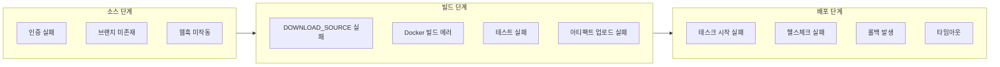
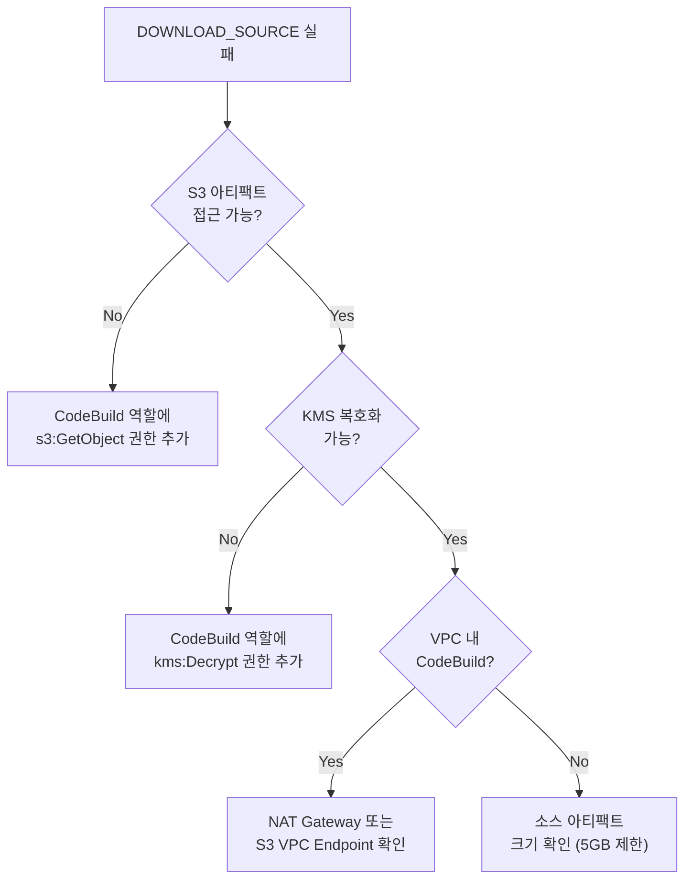
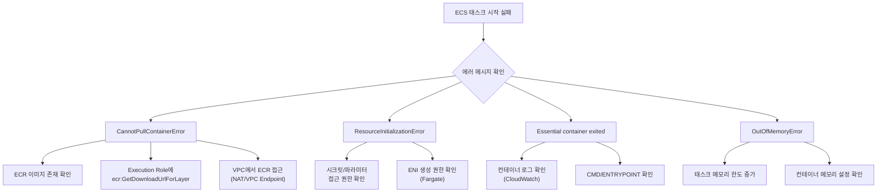
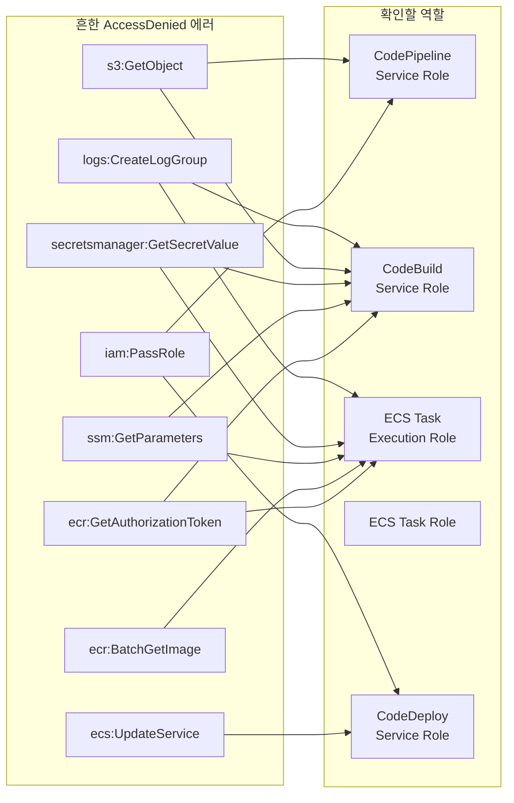

# 트러블슈팅 가이드

AWS CI/CD 파이프라인(CodePipeline, CodeBuild, CodeDeploy)과 ECS 운영 중 발생하는 흔한 실패 패턴과 단계별 디버깅 방법을 체계적으로 정리한다.

## 목차
- [1. 핵심 개념 (What)](#1-핵심-개념-what)
- [2. 왜 알아야 하는가 (Why)](#2-왜-알아야-하는가-why)
- [3. 내부 구현 분석 (How)](#3-내부-구현-분석-how)
- [4. 실전 예제](#4-실전-예제)
- [5. 정리](#5-정리)

---

## 1. 핵심 개념 (What)

### 파이프라인 실패 지점 분류

CI/CD 파이프라인은 여러 단계로 구성되며, 각 단계마다 고유한 실패 패턴이 존재한다.



### 디버깅 도구 체계

| 도구 | 용도 | 접근 방법 |
|------|------|----------|
| CloudWatch Logs | CodeBuild 로그, ECS 컨테이너 로그 | 로그 그룹별 조회 |
| CodePipeline 콘솔 | 단계별 실패 상태 확인 | 파이프라인 실행 히스토리 |
| ECS 서비스 이벤트 | 태스크 배치/실패 이벤트 | 서비스 상세 > 이벤트 탭 |
| CloudTrail | IAM 권한 거부 추적 | 이벤트 히스토리 필터링 |
| X-Ray | 서비스 간 호출 추적 | 트레이스 맵 |

---

## 2. 왜 알아야 하는가 (Why)

### 장애 대응 시간 단축

- 실패 패턴을 미리 파악하면 MTTR(Mean Time To Recovery)을 크게 줄일 수 있다
- "어디서 실패했는가"를 빠르게 파악하는 것이 트러블슈팅의 80%
- 체계적인 디버깅 절차 없이는 동일한 문제에 반복적으로 시간 소모

### 자주 발생하는 실패의 80%는 패턴화 가능

- IAM 권한 부족 — 가장 흔한 원인
- 리소스 제한(CPU/메모리) 초과
- 네트워크 구성 오류(보안 그룹, VPC 엔드포인트)
- 이미지 빌드/풀 실패
- 헬스체크 설정 불일치

### 비용 영향

- 반복 실패하는 파이프라인은 CodeBuild 비용을 불필요하게 증가시킴
- 배포 실패로 인한 롤백은 서비스 가용성에 직접적 영향

---

## 3. 내부 구현 분석 (How)

### 3.1 소스 단계 실패

#### GitHub 연결 실패

```
Error: Could not access the GitHub repository.
Make sure that the GitHub token or connection is valid.
```

**원인과 해결:**

| 증상 | 원인 | 해결 |
|------|------|------|
| `Could not access repository` | GitHub 연결(Connection) 만료 | CodeStar Connections에서 재인증 |
| `Branch not found` | 지정 브랜치 삭제됨 | 파이프라인 소스 설정에서 브랜치 변경 |
| 파이프라인 미트리거 | 웹훅 비활성화 | CodeStar Connection 상태 확인 (AVAILABLE인지) |
| `Access denied` | IAM 역할에 `codestar-connections:UseConnection` 누락 | 서비스 역할에 권한 추가 |

```bash
# CodeStar Connection 상태 확인
aws codestar-connections list-connections \
  --provider-type GitHub \
  --query 'Connections[].{Name:ConnectionName,Status:ConnectionStatus,Arn:ConnectionArn}'

# 결과 예시
# [
#   {
#     "Name": "my-github",
#     "Status": "AVAILABLE",   ← PENDING_HANDSHAKE이면 콘솔에서 재인증 필요
#     "Arn": "arn:aws:codestar-connections:..."
#   }
# ]
```

### 3.2 빌드 단계 실패

#### DOWNLOAD_SOURCE 에러

```
[Container] Phase context status code: COMMAND_EXECUTION_ERROR
Message: Error while executing command: DOWNLOAD_SOURCE
```

**디버깅 플로우:**



#### Docker 빌드 에러

```bash
# 흔한 에러 1: Docker 데몬 미실행
# buildspec.yml에 privileged mode가 필요
# Error: Cannot connect to the Docker daemon

# 해결: CodeBuild 프로젝트 설정에서 privilegedMode: true 확인
aws codebuild update-project \
  --name my-project \
  --environment '{
    "type": "LINUX_CONTAINER",
    "image": "aws/codebuild/amazonlinux2-x86_64-standard:5.0",
    "computeType": "BUILD_GENERAL1_SMALL",
    "privilegedMode": true
  }'
```

```bash
# 흔한 에러 2: ECR 로그인 실패
# Error: no basic auth credentials

# 해결: buildspec.yml pre_build에 ECR 로그인 추가
# 그리고 CodeBuild 역할에 ecr:GetAuthorizationToken 권한 확인
aws ecr get-login-password --region ap-northeast-2 | \
  docker login --username AWS --password-stdin \
  123456789012.dkr.ecr.ap-northeast-2.amazonaws.com
```

```bash
# 흔한 에러 3: Docker Hub rate limit
# Error: toomanyrequests: You have reached your pull rate limit

# 해결: ECR Public 또는 ECR pull-through cache 사용
# buildspec.yml에서 base image를 ECR 경로로 변경
# FROM public.ecr.aws/docker/library/node:18-alpine
```

#### 빌드 타임아웃

```bash
# 기본 타임아웃: 60분
# 큰 프로젝트나 느린 테스트 시 초과 가능

# 타임아웃 조정
aws codebuild update-project \
  --name my-project \
  --timeout-in-minutes 120
```

### 3.3 배포 단계 실패 (ECS/CodeDeploy)

#### 태스크 시작 실패



#### CannotPullContainerError 상세

```bash
# ECR 이미지 존재 여부 확인
aws ecr describe-images \
  --repository-name myapp \
  --image-ids imageTag=latest \
  --query 'imageDetails[0].{Pushed:imagePushedAt,Size:imageSizeInBytes,Digest:imageDigest}'

# VPC Endpoint 확인 (프라이빗 서브넷에서 ECR 접근 시 필수)
aws ec2 describe-vpc-endpoints \
  --filters "Name=service-name,Values=com.amazonaws.ap-northeast-2.ecr.dkr" \
  --query 'VpcEndpoints[].{Id:VpcEndpointId,State:State,SubnetIds:SubnetIds}'
```

#### ResourceInitializationError

```
ResourceInitializationError: unable to pull secrets or registry auth:
  execution resource retrieval failed: unable to retrieve secrets from ssm:
  AccessDeniedException: User: arn:aws:sts::123456789012:assumed-role/ecsTaskExecutionRole/...
  is not authorized to perform: ssm:GetParameters on resource: ...
```

```bash
# Execution Role 권한 확인
aws iam simulate-principal-policy \
  --policy-source-arn "arn:aws:iam::123456789012:role/ecsTaskExecutionRole" \
  --action-names "ssm:GetParameters" \
  --resource-arns "arn:aws:ssm:ap-northeast-2:123456789012:parameter/myapp/prod/db/password"
```

#### 헬스체크 실패로 인한 배포 실패

```
service myapp-service was unable to place a task because no container instance met
all of its requirements. The closest matching container-instance has insufficient memory.

# 또는

service myapp-service (instance i-xxx) (port 8080) is unhealthy in target-group
myapp-tg due to (reason Health checks failed with these codes: [502])
```

**헬스체크 디버깅 체크리스트:**

```bash
# 1. 타겟 그룹 헬스체크 설정 확인
aws elbv2 describe-target-health \
  --target-group-arn "arn:aws:elasticloadbalancing:ap-northeast-2:123456789012:targetgroup/myapp-tg/xxx"

# 2. 보안 그룹에서 헬스체크 포트 허용 확인
aws ec2 describe-security-groups \
  --group-ids sg-xxx \
  --query 'SecurityGroups[0].IpPermissions[?FromPort==`8080`]'

# 3. 컨테이너가 올바른 포트에서 리스닝하는지 확인
# ECS Exec으로 컨테이너 접속
aws ecs execute-command \
  --cluster myapp-cluster \
  --task "arn:aws:ecs:ap-northeast-2:123456789012:task/myapp-cluster/xxx" \
  --container myapp \
  --interactive \
  --command "/bin/sh"

# 컨테이너 내부에서
# curl -v http://localhost:8080/health
```

### 3.4 흔한 IAM 권한 오류



---

## 4. 실전 예제

### 4.1 CloudWatch Logs를 활용한 빌드 로그 분석

```bash
# CodeBuild 로그 그룹에서 최근 실패 로그 검색
aws logs filter-log-events \
  --log-group-name "/aws/codebuild/myapp-build" \
  --filter-pattern "ERROR" \
  --start-time $(date -d '1 hour ago' +%s000) \
  --query 'events[].{Time:timestamp,Message:message}' \
  --output table

# ECS 컨테이너 로그에서 시작 실패 원인 확인
aws logs get-log-events \
  --log-group-name "/ecs/myapp" \
  --log-stream-name "ecs/myapp/TASK_ID" \
  --start-from-head \
  --limit 50

# 특정 에러 패턴으로 Insights 쿼리
aws logs start-query \
  --log-group-name "/ecs/myapp" \
  --start-time $(date -d '24 hours ago' +%s) \
  --end-time $(date +%s) \
  --query-string '
    fields @timestamp, @message
    | filter @message like /(?i)(error|exception|fatal|OOM)/
    | sort @timestamp desc
    | limit 50
  '
```

### 4.2 ECS 서비스 이벤트 분석 스크립트

```bash
#!/bin/bash
# ecs-debug.sh - ECS 서비스 디버깅 도우미

CLUSTER="myapp-cluster"
SERVICE="myapp-service"

echo "=== 서비스 상태 ==="
aws ecs describe-services \
  --cluster $CLUSTER \
  --services $SERVICE \
  --query 'services[0].{
    Status:status,
    DesiredCount:desiredCount,
    RunningCount:runningCount,
    PendingCount:pendingCount,
    DeploymentStatus:deployments[0].rolloutState
  }' --output table

echo ""
echo "=== 최근 이벤트 (10건) ==="
aws ecs describe-services \
  --cluster $CLUSTER \
  --services $SERVICE \
  --query 'services[0].events[:10].{Time:createdAt,Message:message}' \
  --output table

echo ""
echo "=== 중지된 태스크 ==="
STOPPED_TASKS=$(aws ecs list-tasks \
  --cluster $CLUSTER \
  --service-name $SERVICE \
  --desired-status STOPPED \
  --query 'taskArns[:5]' --output text)

if [ -n "$STOPPED_TASKS" ]; then
  aws ecs describe-tasks \
    --cluster $CLUSTER \
    --tasks $STOPPED_TASKS \
    --query 'tasks[].{
      TaskId:taskArn,
      StopCode:stopCode,
      StopReason:stoppedReason,
      Status:containers[0].lastStatus,
      ExitCode:containers[0].exitCode
    }' --output table
else
  echo "중지된 태스크 없음"
fi

echo ""
echo "=== 타겟 그룹 헬스 ==="
TG_ARN=$(aws ecs describe-services \
  --cluster $CLUSTER \
  --services $SERVICE \
  --query 'services[0].loadBalancers[0].targetGroupArn' --output text)

if [ "$TG_ARN" != "None" ]; then
  aws elbv2 describe-target-health \
    --target-group-arn $TG_ARN \
    --query 'TargetHealthDescriptions[].{
      Target:Target.Id,
      Port:Target.Port,
      Health:TargetHealth.State,
      Reason:TargetHealth.Reason
    }' --output table
fi
```

### 4.3 CodePipeline 실패 자동 알림 (CloudWatch Events)

```json
{
  "source": ["aws.codepipeline"],
  "detail-type": ["CodePipeline Pipeline Execution State Change"],
  "detail": {
    "state": ["FAILED"]
  }
}
```

```yaml
# CloudFormation으로 실패 알림 구성
Resources:
  PipelineFailureRule:
    Type: AWS::Events::Rule
    Properties:
      Name: pipeline-failure-notification
      EventPattern:
        source:
          - aws.codepipeline
        detail-type:
          - "CodePipeline Pipeline Execution State Change"
        detail:
          state:
            - FAILED
          pipeline:
            - myapp-pipeline
      Targets:
        - Arn: !Ref AlertSNSTopic
          Id: PipelineFailureTarget
          InputTransformer:
            InputPathsMap:
              pipeline: "$.detail.pipeline"
              state: "$.detail.state"
              executionId: "$.detail.execution-id"
            InputTemplate: |
              "[PIPELINE FAIL] 파이프라인 <pipeline> 실패"
              "실행 ID: <executionId>"
              "콘솔: https://ap-northeast-2.console.aws.amazon.com/codesuite/codepipeline/pipelines/<pipeline>/view"

  AlertSNSTopic:
    Type: AWS::SNS::Topic
    Properties:
      TopicName: cicd-alerts
      Subscription:
        - Protocol: email
          Endpoint: devops@example.com
```

### 4.4 CloudTrail로 IAM 권한 거부 추적

```bash
# 최근 AccessDenied 이벤트 조회
aws cloudtrail lookup-events \
  --lookup-attributes AttributeKey=EventName,AttributeValue=AssumeRole \
  --start-time $(date -d '1 hour ago' +%s) \
  --query 'Events[?contains(CloudTrailEvent, `AccessDenied`)].{
    Time:EventTime,
    Event:EventName,
    Source:EventSource
  }' --output table

# 특정 역할의 거부 이벤트 검색 (CloudWatch Logs Insights)
# CloudTrail 로그 그룹에서 실행
aws logs start-query \
  --log-group-name "CloudTrail/logs" \
  --start-time $(date -d '24 hours ago' +%s) \
  --end-time $(date +%s) \
  --query-string '
    fields @timestamp, eventName, errorCode, errorMessage,
           requestParameters.roleArn, userIdentity.arn
    | filter errorCode = "AccessDenied"
    | filter userIdentity.arn like /ecsTaskExecutionRole/
    | sort @timestamp desc
    | limit 20
  '
```

### 4.5 배포 롤백 디버깅

```bash
# CodeDeploy 배포 실패 상세 확인
aws deploy get-deployment \
  --deployment-id "d-XXXXXXXXX" \
  --query '{
    Status:deploymentInfo.status,
    ErrorInfo:deploymentInfo.errorInformation,
    RollbackInfo:deploymentInfo.rollbackInfo,
    Description:deploymentInfo.description
  }'

# 배포 대상 인스턴스별 상태 확인
aws deploy list-deployment-targets \
  --deployment-id "d-XXXXXXXXX" \
  --query 'targetIds'

# Blue/Green 배포 시 대체 태스크셋 상태
aws ecs describe-task-sets \
  --cluster myapp-cluster \
  --service myapp-service \
  --query 'taskSets[].{
    Id:id,
    Status:status,
    DesiredCount:computedDesiredCount,
    RunningCount:runningCount,
    Stability:stabilityStatus
  }' --output table
```

---

## 5. 정리

### 단계별 체크리스트

| 실패 단계 | 첫 번째 확인 | 두 번째 확인 | 세 번째 확인 |
|-----------|-------------|-------------|-------------|
| **소스** | Connection 상태 (AVAILABLE?) | 브랜치 존재 여부 | IAM `codestar-connections:UseConnection` |
| **빌드 (DOWNLOAD_SOURCE)** | S3 아티팩트 접근 권한 | KMS 복호화 권한 | VPC 네트워크 (NAT/Endpoint) |
| **빌드 (Docker)** | `privilegedMode: true` | ECR 로그인 | Docker Hub rate limit |
| **배포 (태스크 실패)** | 이미지 존재/접근 | 시크릿 접근 권한 | 메모리/CPU 한도 |
| **배포 (헬스체크)** | 헬스체크 경로/포트 | 보안 그룹 규칙 | 애플리케이션 시작 시간 |
| **IAM 공통** | CloudTrail AccessDenied 검색 | `iam:simulate-principal-policy` | 리소스 ARN 패턴 확인 |

### 디버깅 우선순위

1. **로그 확인** — CloudWatch Logs에서 에러 메시지 직접 확인
2. **이벤트 확인** — ECS 서비스 이벤트, CodePipeline 실행 히스토리
3. **권한 확인** — CloudTrail에서 AccessDenied 추적
4. **네트워크 확인** — 보안 그룹, VPC Endpoint, NAT Gateway
5. **리소스 확인** — CPU/메모리 한도, 동시 실행 제한

---
*참고: AWS 서비스 최신 버전 기준*
