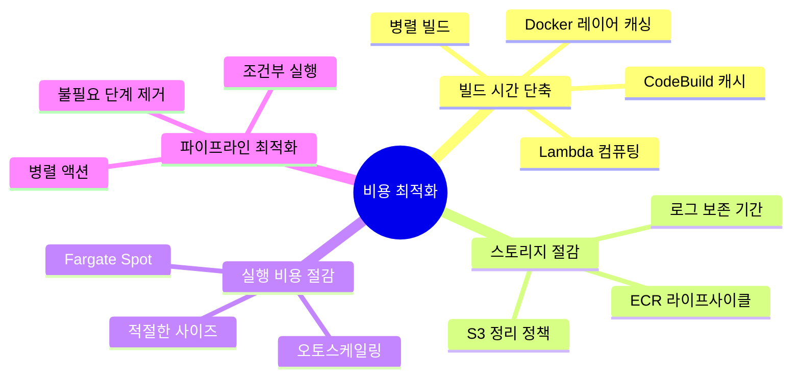
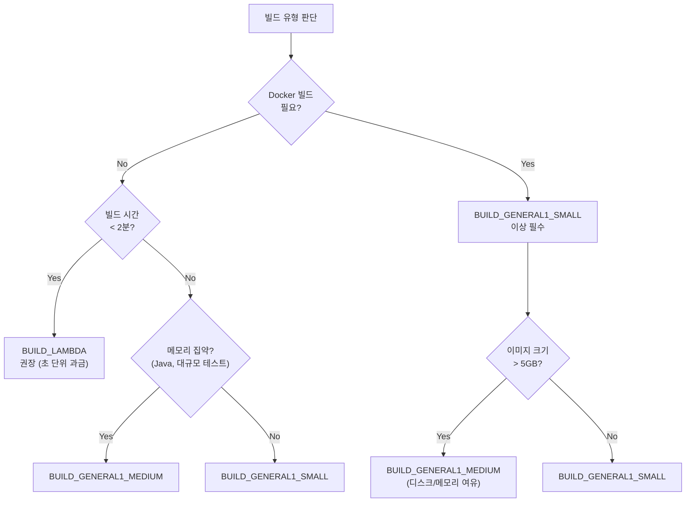
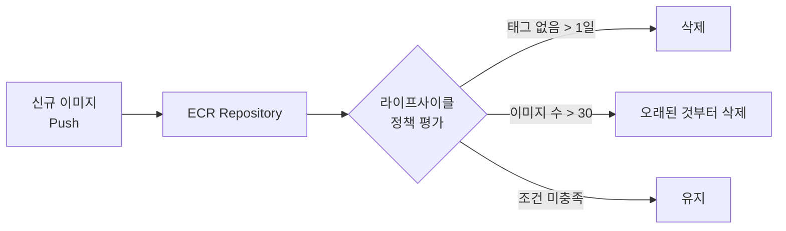
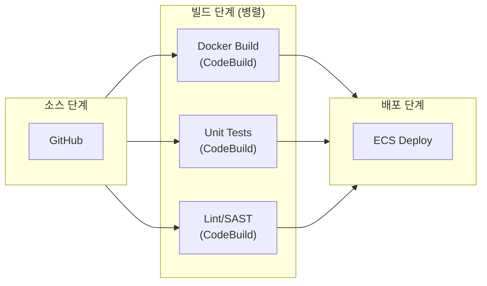

# 비용 최적화와 성능 튜닝

AWS CI/CD 파이프라인과 ECS 인프라의 비용을 절감하면서 빌드 속도와 배포 효율성을 극대화하는 전략을 다룬다.

## 목차
- [1. 핵심 개념 (What)](#1-핵심-개념-what)
- [2. 왜 알아야 하는가 (Why)](#2-왜-알아야-하는가-why)
- [3. 내부 구현 분석 (How)](#3-내부-구현-분석-how)
- [4. 실전 예제](#4-실전-예제)
- [5. 정리](#5-정리)

---

## 1. 핵심 개념 (What)

### 비용 구성 요소

AWS CI/CD + ECS 아키텍처의 비용은 크게 4가지 영역으로 나뉜다.

```
┌─────────────────────────────────────────────────────────────────┐
│                      CI/CD + ECS 비용 구조                       │
│                                                                  │
│  ┌──────────────────┐  ┌──────────────────┐                     │
│  │  빌드 비용         │  │  스토리지 비용     │                     │
│  │  - CodeBuild      │  │  - ECR 이미지      │                     │
│  │    인스턴스 시간    │  │  - S3 아티팩트     │                     │
│  │  - 빌드 횟수       │  │  - CloudWatch 로그 │                     │
│  └──────────────────┘  └──────────────────┘                     │
│                                                                  │
│  ┌──────────────────┐  ┌──────────────────┐                     │
│  │  실행 비용         │  │  네트워크 비용     │                     │
│  │  - Fargate vCPU   │  │  - NAT Gateway    │                     │
│  │  - Fargate 메모리  │  │  - 데이터 전송     │                     │
│  │  - ALB 시간/LCU   │  │  - VPC Endpoint   │                     │
│  └──────────────────┘  └──────────────────┘                     │
└─────────────────────────────────────────────────────────────────┘
```

### CodeBuild 인스턴스 타입별 비용 (서울 리전, Linux)

| 인스턴스 타입 | vCPU | 메모리 | 비용 (분당) | 월 예상 (일 10빌드, 5분) |
|-------------|------|--------|-----------|----------------------|
| BUILD_GENERAL1_SMALL | 3 | 7 GB | $0.005 | ~$7.50 |
| BUILD_GENERAL1_MEDIUM | 7 | 15 GB | $0.010 | ~$15.00 |
| BUILD_GENERAL1_LARGE | 15 | 145 GB | $0.020 | ~$30.00 |
| BUILD_GENERAL1_XLARGE | 72 | 255 GB | $0.020 | ~$30.00 |
| BUILD_LAMBDA_1GB | 2 | 1 GB | $0.00001/128MB | ~$0.50 |
| BUILD_LAMBDA_10GB | 2 | 10 GB | $0.00001/128MB | ~$5.00 |

### 최적화 레버



---

## 2. 왜 알아야 하는가 (Why)

### 비용이 빠르게 증가하는 구간

- Docker 이미지 빌드가 느리면 CodeBuild 비용이 선형 증가
- ECR에 이미지를 무제한 쌓으면 스토리지 비용이 지속 증가
- Fargate 태스크를 오버프로비저닝하면 24/7 불필요 비용 발생
- NAT Gateway 데이터 처리 비용이 예상치 못한 청구의 주범

### 성능이 비용에 미치는 영향

- 빌드 시간 5분 → 2분 단축 = CodeBuild 비용 60% 절감
- Docker 레이어 캐시 적중 시 ECR pull 트래픽 대폭 감소
- 파이프라인 병렬화로 전체 배포 시간 단축 = 개발자 대기 시간 감소

### 실제 비용 시나리오

```
[ 최적화 전 ]
- CodeBuild: MEDIUM, 15분/빌드, 20빌드/일 = $90/월
- ECR: 500개 이미지 × 500MB = $12.50/월
- Fargate: 4 태스크 × 1vCPU/2GB (항상) = $180/월
- 합계: ~$282.50/월

[ 최적화 후 ]
- CodeBuild: SMALL, 5분/빌드, 20빌드/일 = $15/월
- ECR: 30개 이미지 유지 × 500MB = $0.75/월
- Fargate: 2~4 태스크 (오토스케일) + Spot = ~$80/월
- 합계: ~$95.75/월 (66% 절감)
```

---

## 3. 내부 구현 분석 (How)

### 3.1 CodeBuild 인스턴스 타입 선택 전략



**Lambda 컴퓨팅 모드의 이점:**
- 초 단위 과금 (빌드 시간이 짧을수록 유리)
- 콜드 스타트 없음 (사전 프로비저닝된 환경)
- Docker 빌드 미지원 — 단순 코드 빌드/테스트에 적합

### 3.2 Docker 레이어 캐싱 최적화

#### Dockerfile 최적화 원칙

```dockerfile
# === 비효율적인 Dockerfile ===
FROM node:18-alpine
WORKDIR /app
COPY . .                          # 모든 파일 변경 시 캐시 무효화
RUN npm install                   # 매번 전체 설치
RUN npm run build
EXPOSE 8080
CMD ["node", "dist/server.js"]

# === 최적화된 Dockerfile ===
FROM node:18-alpine AS builder
WORKDIR /app

# 1단계: 의존성 설치 (package.json 변경 시만 재실행)
COPY package.json package-lock.json ./
RUN npm ci --ignore-scripts

# 2단계: 소스 복사 및 빌드
COPY tsconfig.json ./
COPY src/ ./src/
RUN npm run build

# 3단계: 프로덕션 이미지 (멀티스테이지)
FROM node:18-alpine
WORKDIR /app
COPY --from=builder /app/dist ./dist
COPY --from=builder /app/node_modules ./node_modules
COPY package.json ./

EXPOSE 8080
USER node
CMD ["node", "dist/server.js"]
```

#### CodeBuild에서 Docker 레이어 캐시 활용

```yaml
# buildspec.yml - Docker 레이어 캐시 전략
version: 0.2

phases:
  pre_build:
    commands:
      - echo Logging in to ECR...
      - aws ecr get-login-password --region $AWS_DEFAULT_REGION | docker login --username AWS --password-stdin $ECR_REGISTRY
      # 이전 이미지를 캐시로 활용
      - docker pull $ECR_REGISTRY/$IMAGE_NAME:latest || true

  build:
    commands:
      # --cache-from으로 이전 레이어 재사용
      - docker build
          --cache-from $ECR_REGISTRY/$IMAGE_NAME:latest
          -t $ECR_REGISTRY/$IMAGE_NAME:$CODEBUILD_RESOLVED_SOURCE_VERSION
          -t $ECR_REGISTRY/$IMAGE_NAME:latest
          .

  post_build:
    commands:
      - docker push $ECR_REGISTRY/$IMAGE_NAME:$CODEBUILD_RESOLVED_SOURCE_VERSION
      - docker push $ECR_REGISTRY/$IMAGE_NAME:latest
```

### 3.3 CodeBuild 캐시 설정

CodeBuild는 두 가지 캐시 모드를 지원한다.

| 캐시 타입 | 저장 위치 | 속도 | 비용 | 적합한 경우 |
|----------|----------|------|------|-----------|
| S3 캐시 | S3 버킷 | 보통 | S3 요금 | 의존성 캐시 (node_modules, .m2) |
| Local 캐시 | 빌드 호스트 | 빠름 | 무료 | Docker 레이어, 소스 캐시 |

```yaml
# CloudFormation - CodeBuild 캐시 설정
Resources:
  BuildProject:
    Type: AWS::CodeBuild::Project
    Properties:
      Name: myapp-build
      Cache:
        # S3 캐시 (의존성 캐시에 적합)
        Type: S3
        Location: !Sub '${CacheBucket}/codebuild-cache'
        # 또는 Local 캐시 (Docker 레이어에 적합)
        # Type: LOCAL
        # Modes:
        #   - LOCAL_DOCKER_LAYER_CACHE
        #   - LOCAL_SOURCE_CACHE
        #   - LOCAL_CUSTOM_CACHE
```

```yaml
# buildspec.yml - S3 캐시 활용
version: 0.2

phases:
  install:
    commands:
      - npm ci --ignore-scripts
  build:
    commands:
      - npm run build
      - npm test

cache:
  paths:
    - 'node_modules/**/*'        # npm 의존성 캐시
    - '.next/cache/**/*'         # Next.js 빌드 캐시
    - '$HOME/.gradle/caches/**/*' # Gradle 캐시 (Java)
    - '$HOME/.m2/**/*'            # Maven 캐시 (Java)
```

### 3.4 ECR 라이프사이클 정책

ECR 이미지가 무한히 쌓이면 스토리지 비용이 지속 증가한다. 라이프사이클 정책으로 자동 정리한다.



### 3.5 Fargate Spot 활용

Fargate Spot은 EC2 Spot과 유사하게 유휴 Fargate 용량을 최대 70% 할인된 가격에 사용한다.

```
┌────────────────────────────────────────────────────────┐
│                  Capacity Provider 전략                  │
│                                                         │
│  ┌──────────────────────┐  ┌──────────────────────────┐│
│  │   FARGATE (Base: 2)  │  │  FARGATE_SPOT (Weight: 3)││
│  │                      │  │                           ││
│  │  - 항상 실행 보장     │  │  - 최대 70% 할인          ││
│  │  - 프로덕션 최소 보장 │  │  - 중단 가능 (2분 경고)   ││
│  │  - 안정성 우선        │  │  - 스케일 아웃 시 사용    ││
│  └──────────────────────┘  └──────────────────────────┘│
│                                                         │
│  예시: 최소 2개 태스크(On-Demand) + 추가분은 Spot      │
└────────────────────────────────────────────────────────┘
```

### 3.6 파이프라인 병렬 액션

CodePipeline은 한 스테이지 내에서 여러 액션을 병렬로 실행할 수 있다.



---

## 4. 실전 예제

### 4.1 ECR 라이프사이클 정책

```bash
# ECR 라이프사이클 정책 설정
aws ecr put-lifecycle-policy \
  --repository-name myapp \
  --lifecycle-policy-text '{
    "rules": [
      {
        "rulePriority": 1,
        "description": "태그 없는 이미지 1일 후 삭제",
        "selection": {
          "tagStatus": "untagged",
          "countType": "sinceImagePushed",
          "countUnit": "days",
          "countNumber": 1
        },
        "action": {
          "type": "expire"
        }
      },
      {
        "rulePriority": 2,
        "description": "dev 태그 이미지 최대 10개 유지",
        "selection": {
          "tagStatus": "tagged",
          "tagPrefixList": ["dev-"],
          "countType": "imageCountMoreThan",
          "countNumber": 10
        },
        "action": {
          "type": "expire"
        }
      },
      {
        "rulePriority": 3,
        "description": "전체 이미지 최대 30개 유지",
        "selection": {
          "tagStatus": "any",
          "countType": "imageCountMoreThan",
          "countNumber": 30
        },
        "action": {
          "type": "expire"
        }
      }
    ]
  }'
```

### 4.2 Fargate Spot Capacity Provider 설정

```yaml
# CloudFormation - Fargate Spot 구성
Resources:
  ECSCluster:
    Type: AWS::ECS::Cluster
    Properties:
      ClusterName: myapp-cluster
      CapacityProviders:
        - FARGATE
        - FARGATE_SPOT
      DefaultCapacityProviderStrategy:
        - CapacityProvider: FARGATE
          Base: 2          # 최소 2개는 On-Demand로 보장
          Weight: 1
        - CapacityProvider: FARGATE_SPOT
          Weight: 3        # 추가 태스크의 75%는 Spot

  ECSService:
    Type: AWS::ECS::Service
    Properties:
      ServiceName: myapp-service
      Cluster: !Ref ECSCluster
      TaskDefinition: !Ref TaskDefinition
      DesiredCount: 4
      # Cluster 기본 전략을 따름: 2 On-Demand + 2 Spot
      CapacityProviderStrategy:
        - CapacityProvider: FARGATE
          Base: 2
          Weight: 1
        - CapacityProvider: FARGATE_SPOT
          Weight: 3

      # Spot 중단 대비 Circuit Breaker 활성화
      DeploymentConfiguration:
        DeploymentCircuitBreaker:
          Enable: true
          Rollback: true
        MaximumPercent: 200
        MinimumHealthyPercent: 100
```

### 4.3 CodeBuild Lambda 컴퓨팅 모드

```yaml
# CloudFormation - Lambda 컴퓨팅 모드
Resources:
  LambdaBuildProject:
    Type: AWS::CodeBuild::Project
    Properties:
      Name: myapp-lint-test
      Source:
        Type: CODEPIPELINE
      Environment:
        # Lambda 컴퓨팅 모드 - Docker 미지원, 초 단위 과금
        Type: LINUX_LAMBDA_CONTAINER
        Image: aws/codebuild/amazonlinux-aarch64-lambda-standard:python3.12
        ComputeType: BUILD_LAMBDA_1GB
      # Lambda 모드에서는 buildspec 인라인 권장
      BuildSpec: |
        version: 0.2
        phases:
          install:
            commands:
              - pip install -r requirements.txt
          build:
            commands:
              - python -m pytest tests/ -v
              - python -m flake8 src/
```

### 4.4 파이프라인 병렬 빌드 액션

```yaml
# CloudFormation - 병렬 빌드 액션
Resources:
  Pipeline:
    Type: AWS::CodePipeline::Pipeline
    Properties:
      Name: myapp-pipeline
      Stages:
        - Name: Source
          Actions:
            - Name: GitHubSource
              ActionTypeId:
                Category: Source
                Owner: AWS
                Provider: CodeStarSourceConnection
                Version: '1'
              Configuration:
                ConnectionArn: !Ref GitHubConnection
                FullRepositoryId: "myorg/myapp"
                BranchName: main
              OutputArtifacts:
                - Name: SourceCode

        - Name: Build
          Actions:
            # 액션 1: Docker 이미지 빌드 (RunOrder: 1)
            - Name: DockerBuild
              RunOrder: 1     # 같은 RunOrder = 병렬 실행
              ActionTypeId:
                Category: Build
                Owner: AWS
                Provider: CodeBuild
                Version: '1'
              Configuration:
                ProjectName: !Ref DockerBuildProject
              InputArtifacts:
                - Name: SourceCode
              OutputArtifacts:
                - Name: BuildOutput

            # 액션 2: 유닛 테스트 (RunOrder: 1 = 병렬)
            - Name: UnitTests
              RunOrder: 1     # DockerBuild와 동시 실행
              ActionTypeId:
                Category: Build
                Owner: AWS
                Provider: CodeBuild
                Version: '1'
              Configuration:
                ProjectName: !Ref TestProject
              InputArtifacts:
                - Name: SourceCode

            # 액션 3: 정적 분석 (RunOrder: 1 = 병렬)
            - Name: SecurityScan
              RunOrder: 1
              ActionTypeId:
                Category: Build
                Owner: AWS
                Provider: CodeBuild
                Version: '1'
              Configuration:
                ProjectName: !Ref SecurityScanProject
              InputArtifacts:
                - Name: SourceCode

        - Name: Deploy
          Actions:
            - Name: DeployToECS
              ActionTypeId:
                Category: Deploy
                Owner: AWS
                Provider: ECS
                Version: '1'
              Configuration:
                ClusterName: !Ref ECSCluster
                ServiceName: !Ref ECSService
                FileName: imagedefinitions.json
              InputArtifacts:
                - Name: BuildOutput
```

### 4.5 CloudWatch 로그 보존 및 비용 관리

```bash
# 로그 그룹 보존 기간 설정 (불필요한 로그 자동 삭제)
aws logs put-retention-policy \
  --log-group-name "/aws/codebuild/myapp-build" \
  --retention-in-days 14   # 빌드 로그: 14일

aws logs put-retention-policy \
  --log-group-name "/ecs/myapp" \
  --retention-in-days 30   # 애플리케이션 로그: 30일

# 모든 로그 그룹의 보존 기간 일괄 확인
aws logs describe-log-groups \
  --query 'logGroups[].{Name:logGroupName,RetentionDays:retentionInDays,StoredBytes:storedBytes}' \
  --output table
```

### 4.6 비용 모니터링 알림 설정

```yaml
# CloudFormation - 비용 이상 알림
Resources:
  CodeBuildBudget:
    Type: AWS::Budgets::Budget
    Properties:
      Budget:
        BudgetName: codebuild-monthly-budget
        BudgetType: COST
        TimeUnit: MONTHLY
        BudgetLimit:
          Amount: 50
          Unit: USD
        CostFilters:
          Service:
            - AWS CodeBuild
      NotificationsWithSubscribers:
        - Notification:
            NotificationType: ACTUAL
            ComparisonOperator: GREATER_THAN
            Threshold: 80    # 80% 도달 시 알림
          Subscribers:
            - SubscriptionType: EMAIL
              Address: devops@example.com
        - Notification:
            NotificationType: FORECASTED
            ComparisonOperator: GREATER_THAN
            Threshold: 100   # 예측 초과 시 알림
          Subscribers:
            - SubscriptionType: EMAIL
              Address: devops@example.com
```

---

## 5. 정리

### 최적화 전략 요약

| 영역 | 전략 | 예상 절감 효과 |
|------|------|-------------|
| **CodeBuild 인스턴스** | 빌드 유형에 맞는 타입 선택, Lambda 모드 활용 | 30-70% |
| **Docker 캐싱** | 멀티스테이지 빌드, `--cache-from`, 레이어 순서 최적화 | 빌드 시간 50-80% 단축 |
| **CodeBuild 캐시** | S3/Local 캐시로 의존성 재다운로드 방지 | 빌드 시간 30-50% 단축 |
| **ECR 라이프사이클** | 태그 없는 이미지 정리, 최대 보관 수 제한 | 스토리지 90% 절감 |
| **Fargate Spot** | Base + Spot 조합, Circuit Breaker 활성화 | 실행 비용 최대 70% |
| **파이프라인 병렬화** | 동일 RunOrder로 빌드/테스트/스캔 동시 실행 | 전체 시간 50-70% 단축 |
| **로그 보존** | 환경별 적절한 보존 기간 설정 | 로그 비용 50-80% |

### 핵심 원칙

1. **측정 먼저** — 최적화 전에 현재 비용과 빌드 시간을 정확히 파악
2. **점진적 적용** — 한 번에 모든 최적화를 적용하지 말고 단계적으로 효과 검증
3. **자동화** — ECR 라이프사이클, 로그 보존, 예산 알림은 설정 후 자동 운영
4. **트레이드오프 인식** — Spot 할인은 안정성과의 교환, 캐시는 복잡성과의 교환

---
*참고: AWS 서비스 최신 버전 기준*
