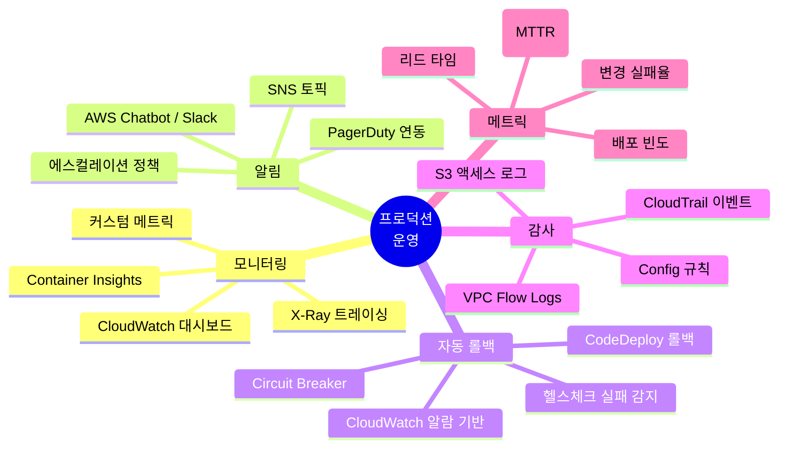
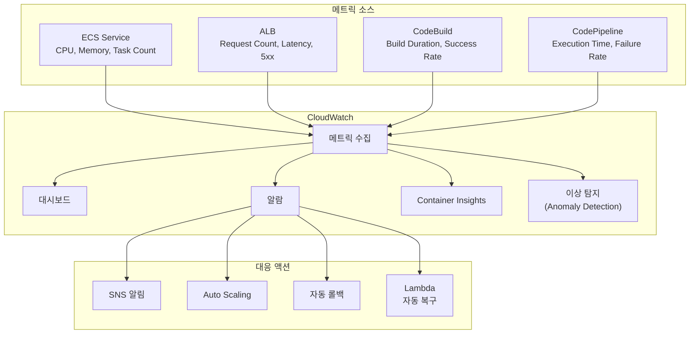
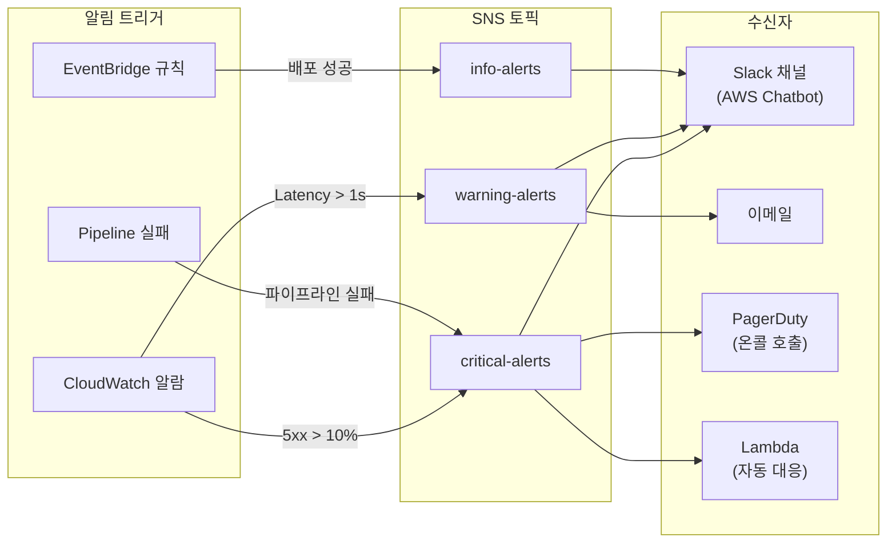
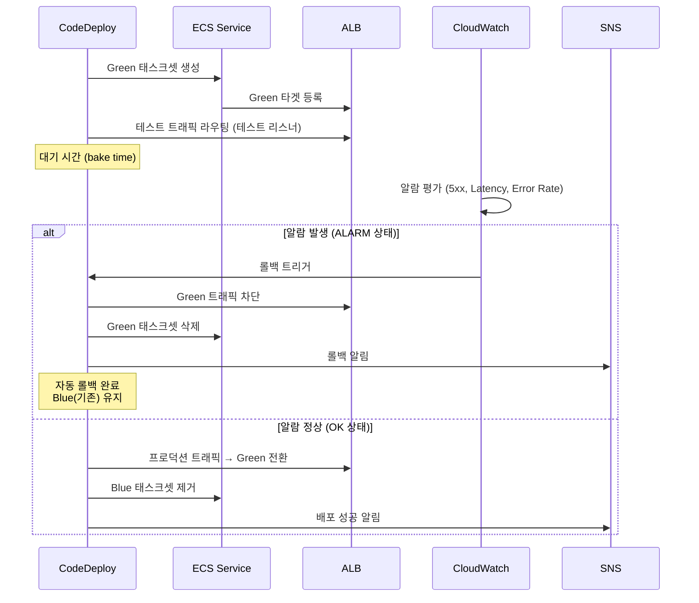
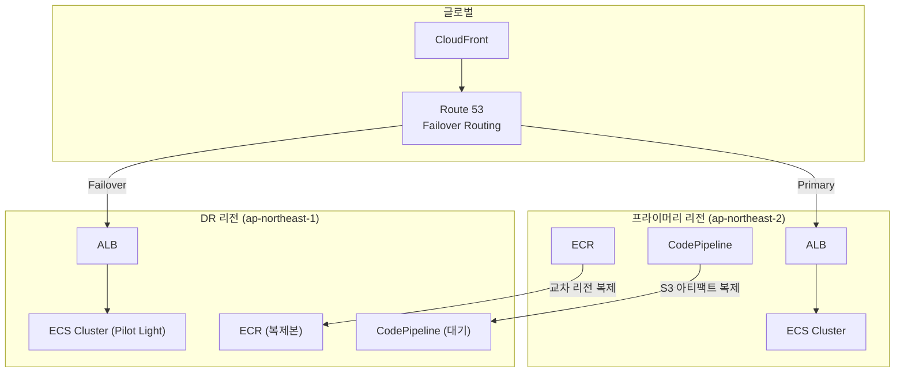

# 프로덕션 운영 베스트 프랙티스

AWS CI/CD 파이프라인과 ECS 기반 프로덕션 환경을 안정적으로 운영하기 위한 모니터링, 알림, 자동 롤백, 감사, 메트릭 수집, 재해 복구 전략을 체계적으로 다룬다.

## 목차
- [1. 핵심 개념 (What)](#1-핵심-개념-what)
- [2. 왜 알아야 하는가 (Why)](#2-왜-알아야-하는가-why)
- [3. 내부 구현 분석 (How)](#3-내부-구현-분석-how)
- [4. 실전 예제](#4-실전-예제)
- [5. 정리](#5-정리)

---

## 1. 핵심 개념 (What)

### 프로덕션 운영의 5가지 축



### DORA 메트릭과 CI/CD

DevOps Research and Assessment(DORA)가 정의한 4가지 핵심 메트릭은 CI/CD 파이프라인의 성숙도를 측정하는 표준이다.

| DORA 메트릭 | 설명 | Elite 수준 | 측정 소스 |
|------------|------|-----------|----------|
| 배포 빈도 (Deployment Frequency) | 프로덕션 배포 횟수 | 하루 여러 번 | CodePipeline 실행 횟수 |
| 리드 타임 (Lead Time for Changes) | 커밋 → 프로덕션 배포 | 1시간 미만 | CodePipeline 시작~완료 시간 |
| 변경 실패율 (Change Failure Rate) | 배포 후 롤백/핫픽스 비율 | 0-15% | CodeDeploy 롤백 횟수 |
| 복구 시간 (MTTR) | 장애 발생 → 복구 | 1시간 미만 | CloudWatch 알람 ~ 해소 시간 |

### 운영 성숙도 모델

```
Level 1: 수동 모니터링    → 콘솔에서 수동 확인
Level 2: 기본 알림       → SNS 이메일 알림
Level 3: 자동 대응       → 알람 기반 자동 롤백
Level 4: 예측 운영       → 이상 탐지, 사전 스케일링
Level 5: 자가 치유       → 자동 복구, 카오스 엔지니어링
```

---

## 2. 왜 알아야 하는가 (Why)

### 배포가 끝이 아니다

- CI/CD 파이프라인을 구축하는 것은 시작일 뿐, 프로덕션 안정성은 운영 체계에 달려 있다
- 모니터링 없는 배포는 "눈 감고 운전하는 것"과 같다
- 자동 롤백 없이는 장애 대응이 사람의 반응 속도에 의존

### 장애의 비용

- 프로덕션 장애 1분당 평균 비용: 중소기업 $427, 대기업 $9,000+ (Gartner)
- MTTR이 5분 vs 30분이면 장애 비용이 6배 차이
- 자동 롤백은 MTTR을 분 단위로 줄여줌

### 컴플라이언스와 감사

- SOC 2, ISO 27001 등 인증을 위해 변경 관리 추적 필수
- "누가, 언제, 무엇을 배포했는가"에 대한 감사 추적(audit trail)
- CloudTrail + Config Rules로 자동화된 컴플라이언스 검증

---

## 3. 내부 구현 분석 (How)

### 3.1 CloudWatch 모니터링 대시보드 아키텍처



### 3.2 알림 체계 (SNS / Slack / ChatBot)



### 3.3 자동 롤백 메커니즘

CodeDeploy(Blue/Green)를 사용하는 ECS 배포에서 CloudWatch 알람 기반 자동 롤백이 동작하는 흐름:



### 3.4 감사 로그 체계

```
┌─────────────────────────────────────────────────────────────┐
│                       감사 로그 체계                          │
│                                                              │
│  CloudTrail                                                  │
│  ├── 관리 이벤트: ECS/CodePipeline/IAM API 호출             │
│  ├── 데이터 이벤트: S3 아티팩트 접근                         │
│  └── Insights: 비정상 API 호출 패턴 감지                     │
│                                                              │
│  AWS Config                                                  │
│  ├── 리소스 변경 추적: 태스크 정의, 서비스, 보안 그룹        │
│  ├── 규칙 평가: 컴플라이언스 자동 검증                       │
│  └── 타임라인: "이 리소스가 언제 어떻게 변경되었는가"        │
│                                                              │
│  CodePipeline 실행 이력                                      │
│  ├── 실행 ID별 단계/액션 결과                                │
│  ├── 소스 커밋 해시 → 배포 이미지 추적                       │
│  └── 승인 기록 (수동 승인 단계)                              │
└─────────────────────────────────────────────────────────────┘
```

### 3.5 재해 복구(DR) 전략

| DR 전략 | RPO | RTO | 비용 | 구현 |
|---------|-----|-----|------|------|
| **Backup & Restore** | 시간 단위 | 시간 단위 | 낮음 | ECR 교차 리전 복제, S3 복제 |
| **Pilot Light** | 분 단위 | 10-30분 | 보통 | DR 리전에 최소 인프라 유지 |
| **Warm Standby** | 초 단위 | 분 단위 | 높음 | DR 리전에 축소된 서비스 상시 실행 |
| **Active-Active** | 거의 0 | 거의 0 | 매우 높음 | 멀티 리전 동시 서비스 |



---

## 4. 실전 예제

### 4.1 CloudWatch 대시보드 구성 (CloudFormation)

```yaml
Resources:
  OperationsDashboard:
    Type: AWS::CloudWatch::Dashboard
    Properties:
      DashboardName: myapp-production
      DashboardBody: !Sub |
        {
          "widgets": [
            {
              "type": "metric",
              "x": 0, "y": 0, "width": 12, "height": 6,
              "properties": {
                "title": "ECS Service - CPU & Memory",
                "metrics": [
                  ["AWS/ECS", "CPUUtilization", "ServiceName", "myapp-service", "ClusterName", "myapp-cluster", {"stat": "Average"}],
                  ["AWS/ECS", "MemoryUtilization", "ServiceName", "myapp-service", "ClusterName", "myapp-cluster", {"stat": "Average"}]
                ],
                "period": 60,
                "region": "${AWS::Region}",
                "view": "timeSeries"
              }
            },
            {
              "type": "metric",
              "x": 12, "y": 0, "width": 12, "height": 6,
              "properties": {
                "title": "ALB - Request Count & Latency",
                "metrics": [
                  ["AWS/ApplicationELB", "RequestCount", "LoadBalancer", "app/myapp-alb/xxx", {"stat": "Sum"}],
                  ["AWS/ApplicationELB", "TargetResponseTime", "LoadBalancer", "app/myapp-alb/xxx", {"stat": "Average", "yAxis": "right"}]
                ],
                "period": 60,
                "region": "${AWS::Region}"
              }
            },
            {
              "type": "metric",
              "x": 0, "y": 6, "width": 12, "height": 6,
              "properties": {
                "title": "ALB - HTTP Error Rates",
                "metrics": [
                  ["AWS/ApplicationELB", "HTTPCode_Target_4XX_Count", "LoadBalancer", "app/myapp-alb/xxx", {"stat": "Sum", "color": "#ff9900"}],
                  ["AWS/ApplicationELB", "HTTPCode_Target_5XX_Count", "LoadBalancer", "app/myapp-alb/xxx", {"stat": "Sum", "color": "#d13212"}],
                  ["AWS/ApplicationELB", "HTTPCode_ELB_5XX_Count", "LoadBalancer", "app/myapp-alb/xxx", {"stat": "Sum", "color": "#ff0000"}]
                ],
                "period": 60,
                "region": "${AWS::Region}"
              }
            },
            {
              "type": "metric",
              "x": 12, "y": 6, "width": 12, "height": 6,
              "properties": {
                "title": "ECS - Running Task Count",
                "metrics": [
                  ["ECS/ContainerInsights", "RunningTaskCount", "ServiceName", "myapp-service", "ClusterName", "myapp-cluster"]
                ],
                "period": 60,
                "region": "${AWS::Region}",
                "annotations": {
                  "horizontal": [
                    {"label": "Min Desired", "value": 2, "color": "#ff9900"},
                    {"label": "Max Desired", "value": 10, "color": "#d13212"}
                  ]
                }
              }
            },
            {
              "type": "metric",
              "x": 0, "y": 12, "width": 24, "height": 6,
              "properties": {
                "title": "CodePipeline - Execution Duration",
                "metrics": [
                  ["AWS/CodeBuild", "Duration", "ProjectName", "myapp-build", {"stat": "Average"}],
                  ["AWS/CodeBuild", "SucceededBuilds", "ProjectName", "myapp-build", {"stat": "Sum", "yAxis": "right"}],
                  ["AWS/CodeBuild", "FailedBuilds", "ProjectName", "myapp-build", {"stat": "Sum", "yAxis": "right", "color": "#d13212"}]
                ],
                "period": 300,
                "region": "${AWS::Region}"
              }
            }
          ]
        }
```

### 4.2 알림 체계 구성 (SNS + AWS Chatbot / Slack)

```yaml
Resources:
  # SNS 토픽 - 심각도별 분리
  CriticalAlertsTopic:
    Type: AWS::SNS::Topic
    Properties:
      TopicName: myapp-critical-alerts
      Subscription:
        - Protocol: email
          Endpoint: oncall@example.com

  WarningAlertsTopic:
    Type: AWS::SNS::Topic
    Properties:
      TopicName: myapp-warning-alerts

  # AWS Chatbot - Slack 연동
  ChatbotRole:
    Type: AWS::IAM::Role
    Properties:
      AssumeRolePolicyDocument:
        Version: '2012-10-17'
        Statement:
          - Effect: Allow
            Principal:
              Service: chatbot.amazonaws.com
            Action: sts:AssumeRole
      Policies:
        - PolicyName: ChatbotPolicy
          PolicyDocument:
            Version: '2012-10-17'
            Statement:
              - Effect: Allow
                Action:
                  - cloudwatch:DescribeAlarms
                  - cloudwatch:GetMetricData
                  - logs:GetLogEvents
                Resource: '*'

  SlackChannelConfig:
    Type: AWS::Chatbot::SlackChannelConfiguration
    Properties:
      ConfigurationName: myapp-alerts-slack
      SlackChannelId: C0XXXXXXXXX       # Slack 채널 ID
      SlackWorkspaceId: T0XXXXXXXXX     # Slack 워크스페이스 ID
      IamRoleArn: !GetAtt ChatbotRole.Arn
      SnsTopicArns:
        - !Ref CriticalAlertsTopic
        - !Ref WarningAlertsTopic
      LoggingLevel: INFO

  # 5xx 에러율 알람 → Critical
  HighErrorRateAlarm:
    Type: AWS::CloudWatch::Alarm
    Properties:
      AlarmName: myapp-high-5xx-rate
      AlarmDescription: "5xx 에러율 10% 초과 - 자동 롤백 트리거"
      Namespace: AWS/ApplicationELB
      MetricName: HTTPCode_Target_5XX_Count
      Dimensions:
        - Name: LoadBalancer
          Value: app/myapp-alb/xxx
      Statistic: Sum
      Period: 60
      EvaluationPeriods: 3
      Threshold: 50
      ComparisonOperator: GreaterThanThreshold
      TreatMissingData: notBreaching
      AlarmActions:
        - !Ref CriticalAlertsTopic
      OKActions:
        - !Ref WarningAlertsTopic

  # 응답 시간 알람 → Warning
  HighLatencyAlarm:
    Type: AWS::CloudWatch::Alarm
    Properties:
      AlarmName: myapp-high-latency
      AlarmDescription: "평균 응답 시간 1초 초과"
      Namespace: AWS/ApplicationELB
      MetricName: TargetResponseTime
      Dimensions:
        - Name: LoadBalancer
          Value: app/myapp-alb/xxx
      Statistic: Average
      Period: 60
      EvaluationPeriods: 5
      Threshold: 1.0
      ComparisonOperator: GreaterThanThreshold
      AlarmActions:
        - !Ref WarningAlertsTopic

  # CPU 사용률 알람 → Auto Scaling + Warning
  HighCPUAlarm:
    Type: AWS::CloudWatch::Alarm
    Properties:
      AlarmName: myapp-high-cpu
      AlarmDescription: "ECS 서비스 CPU 80% 초과"
      Namespace: AWS/ECS
      MetricName: CPUUtilization
      Dimensions:
        - Name: ServiceName
          Value: myapp-service
        - Name: ClusterName
          Value: myapp-cluster
      Statistic: Average
      Period: 60
      EvaluationPeriods: 3
      Threshold: 80
      ComparisonOperator: GreaterThanThreshold
      AlarmActions:
        - !Ref WarningAlertsTopic
```

### 4.3 자동 롤백 설정 (CodeDeploy Blue/Green)

```yaml
Resources:
  # CodeDeploy 배포 그룹 - 자동 롤백 설정
  DeploymentGroup:
    Type: AWS::CodeDeploy::DeploymentGroup
    Properties:
      ApplicationName: !Ref CodeDeployApplication
      DeploymentGroupName: myapp-prod-dg
      ServiceRoleArn: !GetAtt CodeDeployRole.Arn

      DeploymentStyle:
        DeploymentType: BLUE_GREEN
        DeploymentOption: WITH_TRAFFIC_CONTROL

      BlueGreenDeploymentConfiguration:
        TerminateBlueInstancesOnDeploymentSuccess:
          Action: TERMINATE
          TerminationWaitTimeInMinutes: 30  # Blue 환경 30분 유지 (빠른 롤백용)
        DeploymentReadyOption:
          ActionOnTimeout: CONTINUE_DEPLOYMENT
          WaitTimeInMinutes: 0

      # 자동 롤백 설정
      AutoRollbackConfiguration:
        Enabled: true
        Events:
          - DEPLOYMENT_FAILURE           # 배포 자체 실패 시
          - DEPLOYMENT_STOP_ON_ALARM     # CloudWatch 알람 발생 시
          - DEPLOYMENT_STOP_ON_REQUEST   # 수동 중지 요청 시

      # 롤백 트리거 알람
      AlarmConfiguration:
        Alarms:
          - Name: myapp-high-5xx-rate     # 5xx 에러율 초과 시 롤백
          - Name: myapp-high-latency      # 응답 시간 초과 시 롤백
          - Name: myapp-unhealthy-tasks   # 비정상 태스크 감지 시 롤백
        Enabled: true
        IgnorePollAlarmFailure: false

      ECSServices:
        - ClusterName: !Ref ECSCluster
          ServiceName: !Ref ECSService

      LoadBalancerInfo:
        TargetGroupPairInfoList:
          - TargetGroups:
              - Name: myapp-tg-blue
              - Name: myapp-tg-green
            ProdTrafficRoute:
              ListenerArns:
                - !Ref ProdListener
            TestTrafficRoute:
              ListenerArns:
                - !Ref TestListener

  # ECS 서비스 Circuit Breaker (CodeDeploy 없이도 작동)
  ECSService:
    Type: AWS::ECS::Service
    Properties:
      ServiceName: myapp-service
      Cluster: !Ref ECSCluster
      DeploymentController:
        Type: CODE_DEPLOY
      DeploymentConfiguration:
        DeploymentCircuitBreaker:
          Enable: true
          Rollback: true       # Circuit Breaker 발동 시 자동 롤백
        MaximumPercent: 200
        MinimumHealthyPercent: 100
```

### 4.4 CloudTrail 감사 로그 설정

```yaml
Resources:
  # CloudTrail - 모든 관리 이벤트 기록
  AuditTrail:
    Type: AWS::CloudTrail::Trail
    Properties:
      TrailName: myapp-audit-trail
      IsLogging: true
      IsMultiRegionTrail: false
      S3BucketName: !Ref AuditLogBucket
      CloudWatchLogsLogGroupArn: !GetAtt AuditLogGroup.Arn
      CloudWatchLogsRoleArn: !GetAtt CloudTrailRole.Arn
      EnableLogFileValidation: true  # 로그 무결성 검증
      EventSelectors:
        - ReadWriteType: WriteOnly   # 변경 이벤트만 기록 (비용 절감)
          IncludeManagementEvents: true
          DataResources:
            - Type: AWS::S3::Object
              Values:
                - !Sub 'arn:aws:s3:::${ArtifactBucket}/'

  AuditLogGroup:
    Type: AWS::Logs::LogGroup
    Properties:
      LogGroupName: /aws/cloudtrail/myapp-audit
      RetentionInDays: 365   # 감사 로그 1년 보존

  # AWS Config - 리소스 변경 추적
  ConfigRecorder:
    Type: AWS::Config::ConfigurationRecorder
    Properties:
      Name: myapp-config-recorder
      RoleARN: !GetAtt ConfigRole.Arn
      RecordingGroup:
        AllSupported: false
        ResourceTypes:
          - AWS::ECS::Service
          - AWS::ECS::TaskDefinition
          - AWS::EC2::SecurityGroup
          - AWS::ElasticLoadBalancingV2::TargetGroup
          - AWS::IAM::Role

  # Config 규칙 - ECS 태스크에 로깅이 활성화되었는지 검증
  ECSLoggingRule:
    Type: AWS::Config::ConfigRule
    Properties:
      ConfigRuleName: ecs-task-definition-log-configuration
      Source:
        Owner: AWS
        SourceIdentifier: ECS_TASK_DEFINITION_LOG_CONFIGURATION
```

### 4.5 배포 메트릭 수집 (DORA 메트릭)

```yaml
Resources:
  # 배포 빈도 메트릭 수집
  DeploymentFrequencyRule:
    Type: AWS::Events::Rule
    Properties:
      Name: track-deployment-frequency
      EventPattern:
        source:
          - aws.codepipeline
        detail-type:
          - "CodePipeline Pipeline Execution State Change"
        detail:
          state:
            - SUCCEEDED
            - FAILED
          pipeline:
            - myapp-pipeline
      Targets:
        - Arn: !GetAtt MetricsCollectorFunction.Arn
          Id: DeploymentMetrics

  MetricsCollectorFunction:
    Type: AWS::Lambda::Function
    Properties:
      FunctionName: deployment-metrics-collector
      Runtime: python3.12
      Handler: index.handler
      Role: !GetAtt MetricsLambdaRole.Arn
      Code:
        ZipFile: |
          import json
          import boto3
          from datetime import datetime

          cloudwatch = boto3.client('cloudwatch')
          codepipeline = boto3.client('codepipeline')

          def handler(event, context):
              pipeline = event['detail']['pipeline']
              state = event['detail']['state']
              execution_id = event['detail']['execution-id']

              # 1. 배포 빈도 메트릭
              cloudwatch.put_metric_data(
                  Namespace='CICD/DORA',
                  MetricData=[{
                      'MetricName': 'DeploymentCount',
                      'Dimensions': [
                          {'Name': 'Pipeline', 'Value': pipeline},
                          {'Name': 'State', 'Value': state}
                      ],
                      'Value': 1,
                      'Unit': 'Count',
                      'Timestamp': datetime.utcnow()
                  }]
              )

              # 2. 리드 타임 계산 (성공한 배포만)
              if state == 'SUCCEEDED':
                  execution = codepipeline.get_pipeline_execution(
                      pipelineName=pipeline,
                      pipelineExecutionId=execution_id
                  )['pipelineExecution']

                  start_time = execution.get('startTime')
                  last_update = execution.get('lastUpdateTime')

                  if start_time and last_update:
                      lead_time_seconds = (last_update - start_time).total_seconds()
                      cloudwatch.put_metric_data(
                          Namespace='CICD/DORA',
                          MetricData=[{
                              'MetricName': 'LeadTimeSeconds',
                              'Dimensions': [
                                  {'Name': 'Pipeline', 'Value': pipeline}
                              ],
                              'Value': lead_time_seconds,
                              'Unit': 'Seconds',
                              'Timestamp': datetime.utcnow()
                          }]
                      )

              # 3. 변경 실패율 (실패 시)
              if state == 'FAILED':
                  cloudwatch.put_metric_data(
                      Namespace='CICD/DORA',
                      MetricData=[{
                          'MetricName': 'ChangeFailureCount',
                          'Dimensions': [
                              {'Name': 'Pipeline', 'Value': pipeline}
                          ],
                          'Value': 1,
                          'Unit': 'Count',
                          'Timestamp': datetime.utcnow()
                      }]
                  )

              return {'statusCode': 200}
```

### 4.6 재해 복구 - ECR 교차 리전 복제

```yaml
Resources:
  # ECR 프라이머리 리전 레포지토리 (복제 규칙 포함)
  PrimaryECRRepository:
    Type: AWS::ECR::Repository
    Properties:
      RepositoryName: myapp
      ImageScanningConfiguration:
        ScanOnPush: true
      EncryptionConfiguration:
        EncryptionType: KMS

  # ECR 복제 설정 (레지스트리 수준)
  ECRReplicationConfig:
    Type: AWS::ECR::ReplicationConfiguration
    Properties:
      ReplicationConfiguration:
        Rules:
          - Destinations:
              - Region: ap-northeast-1       # DR 리전으로 복제
                RegistryId: !Ref AWS::AccountId
            RepositoryFilters:
              - Filter: myapp
                FilterType: PREFIX_MATCH
```

```bash
# Route 53 헬스체크 + Failover 라우팅 설정
aws route53 create-health-check \
  --caller-reference "myapp-primary-$(date +%s)" \
  --health-check-config '{
    "Type": "HTTPS",
    "FullyQualifiedDomainName": "api.myapp.com",
    "Port": 443,
    "ResourcePath": "/health",
    "RequestInterval": 10,
    "FailureThreshold": 3,
    "Regions": ["ap-northeast-2", "ap-northeast-1", "us-west-2"]
  }'

# Failover 레코드 - Primary
aws route53 change-resource-record-sets \
  --hosted-zone-id Z0XXXXXXXX \
  --change-batch '{
    "Changes": [{
      "Action": "UPSERT",
      "ResourceRecordSet": {
        "Name": "api.myapp.com",
        "Type": "A",
        "SetIdentifier": "primary",
        "Failover": "PRIMARY",
        "HealthCheckId": "HEALTH_CHECK_ID",
        "AliasTarget": {
          "HostedZoneId": "Z0XXXXXXXX",
          "DNSName": "myapp-alb-primary.ap-northeast-2.elb.amazonaws.com",
          "EvaluateTargetHealth": true
        }
      }
    }]
  }'
```

### 4.7 운영 런북 자동화 (Systems Manager)

```yaml
Resources:
  # SSM Automation - ECS 서비스 강제 재배포 런북
  ForceRedeployRunbook:
    Type: AWS::SSM::Document
    Properties:
      DocumentType: Automation
      Name: myapp-force-redeploy
      Content:
        schemaVersion: '0.3'
        description: 'ECS 서비스 강제 재배포 (이미지 최신화)'
        parameters:
          ClusterName:
            type: String
            default: myapp-cluster
          ServiceName:
            type: String
            default: myapp-service
        mainSteps:
          - name: ForceNewDeployment
            action: aws:executeAwsApi
            inputs:
              Service: ecs
              Api: UpdateService
              cluster: '{{ ClusterName }}'
              service: '{{ ServiceName }}'
              forceNewDeployment: true
            outputs:
              - Name: ServiceArn
                Selector: $.service.serviceArn
          - name: WaitForStability
            action: aws:waitForAwsResourceProperty
            timeoutSeconds: 600
            inputs:
              Service: ecs
              Api: DescribeServices
              cluster: '{{ ClusterName }}'
              services:
                - '{{ ServiceName }}'
              PropertySelector: '$.services[0].deployments[0].rolloutState'
              DesiredValues:
                - COMPLETED
          - name: NotifySuccess
            action: aws:executeAwsApi
            inputs:
              Service: sns
              Api: Publish
              TopicArn: !Ref WarningAlertsTopic
              Message: 'ECS 서비스 {{ ServiceName }} 재배포 완료'
```

---

## 5. 정리

### 프로덕션 운영 체크리스트

| 영역 | 항목 | 도구 | 우선순위 |
|------|------|------|---------|
| **모니터링** | ECS CPU/Memory 대시보드 | CloudWatch Dashboard | 필수 |
| **모니터링** | ALB 요청/에러/레이턴시 | CloudWatch Dashboard | 필수 |
| **모니터링** | Container Insights 활성화 | ECS Cluster 설정 | 권장 |
| **알림** | 5xx 에러율 알람 | CloudWatch Alarm → SNS | 필수 |
| **알림** | Slack 채널 연동 | AWS Chatbot | 권장 |
| **알림** | 심각도별 에스컬레이션 | SNS 토픽 분리 | 권장 |
| **롤백** | CodeDeploy 알람 기반 롤백 | CloudWatch Alarm + CodeDeploy | 필수 |
| **롤백** | ECS Circuit Breaker | ECS Service 설정 | 필수 |
| **롤백** | Blue 환경 유지 시간 확보 | CodeDeploy TerminationWait | 권장 |
| **감사** | CloudTrail 활성화 | CloudTrail | 필수 |
| **감사** | AWS Config 리소스 추적 | Config Recorder | 권장 |
| **메트릭** | DORA 4대 메트릭 수집 | EventBridge + Lambda + CloudWatch | 권장 |
| **DR** | ECR 교차 리전 복제 | ECR Replication | 프로덕션 필수 |
| **DR** | Route 53 Failover 라우팅 | Route 53 Health Check | 프로덕션 필수 |

### 핵심 원칙

1. **관측 가능성 우선** — 모니터링 없이 운영하지 않는다 (대시보드 + 알람이 Day 1 필수)
2. **자동 롤백은 안전망** — CloudWatch 알람 기반 롤백으로 MTTR을 분 단위로 줄인다
3. **감사 추적은 문화** — "누가 언제 무엇을 변경했는가"를 항상 추적한다
4. **메트릭으로 개선** — DORA 메트릭을 수집하고 지속적으로 파이프라인을 개선한다
5. **DR은 테스트해야 의미있다** — 구성만 해두고 테스트하지 않으면 실제 장애 시 작동하지 않을 수 있다

---
*참고: AWS 서비스 최신 버전 기준*
