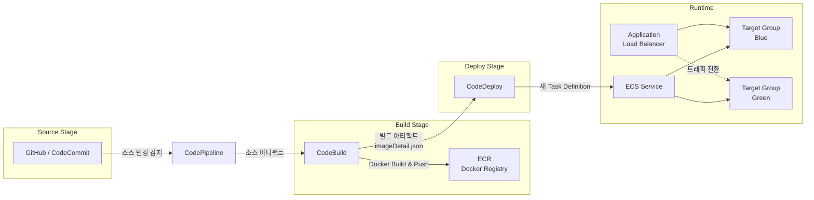

# AWS CI/CD 파이프라인 개요

AWS의 CI/CD 파이프라인은 CodePipeline, CodeBuild, CodeDeploy, ECS 네 가지 핵심 서비스를 조합하여 소스 코드 변경부터 프로덕션 배포까지 전 과정을 자동화한다. 이 문서에서는 전체 아키텍처와 각 서비스의 역할, 그리고 Source → Build → Deploy로 이어지는 배포 흐름을 다룬다.

## 목차
- [1. 핵심 개념 (What)](#1-핵심-개념-what)
- [2. 왜 알아야 하는가 (Why)](#2-왜-알아야-하는가-why)
- [3. 내부 구현 분석 (How)](#3-내부-구현-분석-how)
- [4. 실전 예제](#4-실전-예제)
- [5. 정리](#5-정리)

---

## 1. 핵심 개념 (What)

### CI/CD란?

- **CI (Continuous Integration)**: 개발자가 코드를 공유 리포지토리에 자주 병합하고, 매 병합마다 자동 빌드와 테스트를 실행하여 통합 오류를 조기에 발견하는 방법론이다.
- **CD (Continuous Delivery / Deployment)**: CI를 통과한 코드를 스테이징 또는 프로덕션 환경에 자동으로 배포하는 프로세스다. Delivery는 수동 승인 후 배포, Deployment는 완전 자동 배포를 의미한다.

### AWS CI/CD 핵심 4개 서비스

| 서비스 | 역할 | 비유 |
|--------|------|------|
| **CodePipeline** | 파이프라인 오케스트레이터 | 공장의 컨베이어 벨트 |
| **CodeBuild** | 빌드 및 테스트 실행 | 공장의 조립 라인 |
| **CodeDeploy** | 배포 자동화 | 공장의 출하 담당 |
| **ECS (Elastic Container Service)** | 컨테이너 실행 환경 | 최종 제품이 동작하는 매장 |

### 각 서비스의 핵심 역할

**CodePipeline**은 전체 배포 워크플로를 정의하고 조율하는 오케스트레이터다. Source, Build, Deploy 등 여러 스테이지를 순차적으로 실행하며, 각 스테이지 사이에서 아티팩트를 전달한다.

**CodeBuild**는 소스 코드를 받아 빌드, 테스트, Docker 이미지 생성 등을 수행하는 완전 관리형 빌드 서비스다. 빌드 환경을 Docker 컨테이너로 제공하므로 별도 빌드 서버 관리가 필요 없다.

**CodeDeploy**는 빌드된 아티팩트를 대상 환경에 배포하는 서비스다. ECS 환경에서는 Blue/Green 배포를 지원하여 무중단 배포를 가능하게 한다.

**ECS**는 Docker 컨테이너를 실행하고 관리하는 컨테이너 오케스트레이션 서비스다. Task Definition으로 컨테이너 스펙을 정의하고, Service로 원하는 수의 태스크를 유지한다.

---

## 2. 왜 알아야 하는가 (Why)

### 수동 배포의 한계

수동 배포 프로세스는 다음과 같은 문제를 야기한다:

- **인적 오류**: SSH 접속 후 수동 명령어 실행 시 실수 가능성이 높다
- **배포 시간 증가**: 서버가 늘어날수록 배포에 소요되는 시간이 기하급수적으로 증가한다
- **롤백 어려움**: 문제 발생 시 이전 버전으로 되돌리는 절차가 복잡하다
- **감사 추적 불가**: 누가, 언제, 무엇을 배포했는지 추적이 어렵다

### AWS CI/CD 파이프라인의 이점

- **자동화**: 코드 푸시 한 번으로 빌드, 테스트, 배포가 자동으로 진행된다
- **일관성**: 매 배포마다 동일한 프로세스가 적용되어 환경 간 차이가 없다
- **속도**: 병렬 빌드와 자동 배포로 릴리스 주기를 단축한다
- **안전성**: Blue/Green 배포와 자동 롤백으로 무중단 배포를 실현한다
- **가시성**: 파이프라인 대시보드에서 전체 배포 상태를 실시간으로 확인 가능하다

### 실무에서의 활용 시나리오

1. **마이크로서비스 배포**: 각 서비스별 독립적인 파이프라인 구성
2. **멀티 환경 배포**: dev → staging → production 순차 배포
3. **승인 기반 배포**: 프로덕션 배포 전 수동 승인 게이트 설정

---

## 3. 내부 구현 분석 (How)

### 전체 아키텍처 다이어그램



### 배포 흐름 상세

전체 배포 흐름은 다음 5단계로 진행된다:

```
┌─────────────┐    ┌─────────────┐    ┌─────────────┐    ┌─────────────┐    ┌─────────────┐
│  1. Source   │───▶│  2. Build   │───▶│  3. Push     │───▶│  4. Deploy  │───▶│  5. Serve   │
│             │    │             │    │             │    │             │    │             │
│ GitHub에서   │    │ CodeBuild가 │    │ Docker 이미지│    │ CodeDeploy가│    │ ECS가 새    │
│ 소스 코드    │    │ 빌드 실행   │    │ ECR에 푸시   │    │ Blue/Green  │    │ 컨테이너    │
│ 가져오기     │    │ 테스트 실행  │    │             │    │ 배포 수행    │    │ 실행        │
└─────────────┘    └─────────────┘    └─────────────┘    └─────────────┘    └─────────────┘
```

#### 단계 1: Source (소스 가져오기)

CodePipeline이 소스 리포지토리의 변경을 감지한다. GitHub, CodeCommit, S3, Bitbucket 등을 소스 프로바이더로 사용할 수 있다. 변경이 감지되면 소스 코드를 S3 아티팩트 버킷에 zip으로 저장한다.

#### 단계 2: Build (빌드 및 테스트)

CodeBuild가 소스 아티팩트를 받아 `buildspec.yml`에 정의된 명령어를 실행한다. 일반적으로 다음 작업을 수행한다:
- 의존성 설치
- 단위 테스트 실행
- Docker 이미지 빌드

#### 단계 3: Push (이미지 저장)

빌드된 Docker 이미지를 ECR(Elastic Container Registry)에 푸시한다. 이미지 태그로 커밋 해시나 빌드 번호를 사용하여 추적성을 확보한다.

#### 단계 4: Deploy (배포)

CodeDeploy가 새 Task Definition을 생성하고 ECS 서비스에 Blue/Green 배포를 수행한다. 새 태스크 세트(Green)를 생성하고, 헬스 체크 통과 후 트래픽을 전환한다.

#### 단계 5: Serve (서비스)

ECS가 새 컨테이너를 실행하고 ALB를 통해 트래픽을 수신한다. 이전 태스크 세트(Blue)는 설정된 대기 시간 후 종료된다.

### 아티팩트 흐름

서비스 간 데이터는 S3 아티팩트 버킷을 통해 전달된다:

```
Source Output Artifact          Build Output Artifact
┌──────────────────────┐       ┌──────────────────────┐
│ source.zip           │       │ imageDetail.json     │
│ ├── Dockerfile       │       │ taskdef.json         │
│ ├── buildspec.yml    │  ──▶  │ appspec.yaml         │
│ ├── taskdef.json     │       └──────────────────────┘
│ ├── appspec.yaml     │
│ └── src/             │
└──────────────────────┘
```

### IAM 권한 구조

파이프라인이 정상 동작하려면 각 서비스에 적절한 IAM 역할이 필요하다:

| 역할 | 주요 권한 |
|------|----------|
| CodePipeline Service Role | S3 읽기/쓰기, CodeBuild 시작, CodeDeploy 배포 생성, ECS 업데이트 |
| CodeBuild Service Role | S3 아티팩트 접근, ECR 이미지 푸시, CloudWatch Logs 쓰기, Secrets Manager 읽기 |
| CodeDeploy Service Role | ECS 태스크/서비스 업데이트, ELB 타겟 그룹 수정, Lambda 함수 호출 (훅) |
| ECS Task Execution Role | ECR 이미지 풀, CloudWatch Logs 쓰기, Secrets Manager/SSM 읽기 |

---

## 4. 실전 예제

### 예제 1: CloudFormation으로 전체 파이프라인 구성

```yaml
AWSTemplateFormatVersion: '2010-09-09'
Description: ECS CI/CD Pipeline

Parameters:
  GitHubOwner:
    Type: String
  GitHubRepo:
    Type: String
  GitHubBranch:
    Type: String
    Default: main
  ECSClusterName:
    Type: String
  ECSServiceName:
    Type: String

Resources:
  # 아티팩트 저장소
  ArtifactBucket:
    Type: AWS::S3::Bucket
    Properties:
      BucketEncryption:
        ServerSideEncryptionConfiguration:
          - ServerSideEncryptionByDefault:
              SSEAlgorithm: AES256
      LifecycleConfiguration:
        Rules:
          - ExpirationInDays: 30
            Status: Enabled

  # CodeBuild 프로젝트
  CodeBuildProject:
    Type: AWS::CodeBuild::Project
    Properties:
      Name: !Sub '${AWS::StackName}-build'
      ServiceRole: !GetAtt CodeBuildRole.Arn
      Artifacts:
        Type: CODEPIPELINE
      Environment:
        Type: LINUX_CONTAINER
        ComputeType: BUILD_GENERAL1_SMALL
        Image: aws/codebuild/amazonlinux2-x86_64-standard:4.0
        PrivilegedMode: true    # Docker 빌드에 필요
        EnvironmentVariables:
          - Name: AWS_ACCOUNT_ID
            Value: !Ref 'AWS::AccountId'
          - Name: IMAGE_REPO_NAME
            Value: !Ref ECRRepository
      Source:
        Type: CODEPIPELINE
        BuildSpec: buildspec.yml
      TimeoutInMinutes: 15

  # CodePipeline
  Pipeline:
    Type: AWS::CodePipeline::Pipeline
    Properties:
      Name: !Sub '${AWS::StackName}-pipeline'
      RoleArn: !GetAtt PipelineRole.Arn
      ArtifactStore:
        Type: S3
        Location: !Ref ArtifactBucket
      Stages:
        # Source 스테이지
        - Name: Source
          Actions:
            - Name: Source
              ActionTypeId:
                Category: Source
                Owner: ThirdParty
                Provider: GitHub
                Version: '1'
              Configuration:
                Owner: !Ref GitHubOwner
                Repo: !Ref GitHubRepo
                Branch: !Ref GitHubBranch
                OAuthToken: '{{resolve:secretsmanager:github-token}}'
              OutputArtifacts:
                - Name: SourceOutput

        # Build 스테이지
        - Name: Build
          Actions:
            - Name: Build
              ActionTypeId:
                Category: Build
                Owner: AWS
                Provider: CodeBuild
                Version: '1'
              Configuration:
                ProjectName: !Ref CodeBuildProject
              InputArtifacts:
                - Name: SourceOutput
              OutputArtifacts:
                - Name: BuildOutput

        # Deploy 스테이지
        - Name: Deploy
          Actions:
            - Name: Deploy
              ActionTypeId:
                Category: Deploy
                Owner: AWS
                Provider: CodeDeployToECS
                Version: '1'
              Configuration:
                ApplicationName: !Ref CodeDeployApplication
                DeploymentGroupName: !Ref DeploymentGroup
                TaskDefinitionTemplateArtifact: BuildOutput
                TaskDefinitionTemplatePath: taskdef.json
                AppSpecTemplateArtifact: BuildOutput
                AppSpecTemplatePath: appspec.yaml
                Image1ArtifactName: BuildOutput
                Image1ContainerName: IMAGE1_NAME
              InputArtifacts:
                - Name: BuildOutput
```

### 예제 2: Terraform으로 파이프라인 구성

```hcl
# CodePipeline 정의
resource "aws_codepipeline" "ecs_pipeline" {
  name     = "ecs-app-pipeline"
  role_arn = aws_iam_role.pipeline_role.arn

  artifact_store {
    location = aws_s3_bucket.artifact.bucket
    type     = "S3"
  }

  # Source Stage
  stage {
    name = "Source"

    action {
      name             = "Source"
      category         = "Source"
      owner            = "AWS"
      provider         = "CodeStarSourceConnection"
      version          = "1"
      output_artifacts = ["source_output"]

      configuration = {
        ConnectionArn    = aws_codestarconnections_connection.github.arn
        FullRepositoryId = "my-org/my-app"
        BranchName       = "main"
      }
    }
  }

  # Build Stage
  stage {
    name = "Build"

    action {
      name             = "Build"
      category         = "Build"
      owner            = "AWS"
      provider         = "CodeBuild"
      input_artifacts  = ["source_output"]
      output_artifacts = ["build_output"]
      version          = "1"

      configuration = {
        ProjectName = aws_codebuild_project.app_build.name
      }
    }
  }

  # Deploy Stage
  stage {
    name = "Deploy"

    action {
      name            = "Deploy"
      category        = "Deploy"
      owner           = "AWS"
      provider        = "CodeDeployToECS"
      input_artifacts = ["build_output"]
      version         = "1"

      configuration = {
        ApplicationName                = aws_codedeploy_app.ecs_app.name
        DeploymentGroupName            = aws_codedeploy_deployment_group.ecs_dg.deployment_group_name
        TaskDefinitionTemplateArtifact = "build_output"
        TaskDefinitionTemplatePath     = "taskdef.json"
        AppSpecTemplateArtifact        = "build_output"
        AppSpecTemplatePath            = "appspec.yaml"
        Image1ArtifactName             = "build_output"
        Image1ContainerName            = "IMAGE1_NAME"
      }
    }
  }
}
```

---

## 5. 정리

### 핵심 서비스 요약

| 서비스 | 핵심 역할 | 입력 | 출력 | 비용 모델 |
|--------|----------|------|------|----------|
| **CodePipeline** | 워크플로 오케스트레이션 | 소스 변경 이벤트 | 스테이지별 아티팩트 전달 | 파이프라인당 월 $1 (무료 티어 1개) |
| **CodeBuild** | 빌드/테스트 실행 | 소스 아티팩트 | Docker 이미지, 빌드 아티팩트 | 빌드 시간당 과금 |
| **CodeDeploy** | 배포 자동화 | 빌드 아티팩트 | 배포된 서비스 | ECS 배포 무료 |
| **ECS** | 컨테이너 실행 | Docker 이미지 + Task Definition | 실행 중인 컨테이너 | Fargate: vCPU/메모리 시간당 |

### 배포 흐름 요약

| 단계 | 담당 서비스 | 수행 작업 |
|------|------------|----------|
| 1. Source | CodePipeline | 소스 리포지토리 변경 감지 및 코드 다운로드 |
| 2. Build | CodeBuild | 코드 빌드, 테스트 실행, Docker 이미지 생성 |
| 3. Push | CodeBuild | Docker 이미지를 ECR에 푸시 |
| 4. Deploy | CodeDeploy | ECS 서비스에 Blue/Green 배포 수행 |
| 5. Serve | ECS + ALB | 새 컨테이너 실행 및 트래픽 서빙 |

### 기억할 포인트

1. CodePipeline은 **오케스트레이터**이지 실행자가 아니다 — 실제 빌드/배포는 CodeBuild, CodeDeploy가 담당한다
2. 서비스 간 데이터 전달은 **S3 아티팩트 버킷**을 통해 이루어진다
3. ECS + CodeDeploy 조합은 **Blue/Green 배포**를 기본 전략으로 사용한다
4. 각 서비스에는 **독립적인 IAM 역할**이 필요하며, 최소 권한 원칙을 따라야 한다

---
*참고: AWS 서비스 최신 버전 기준*
