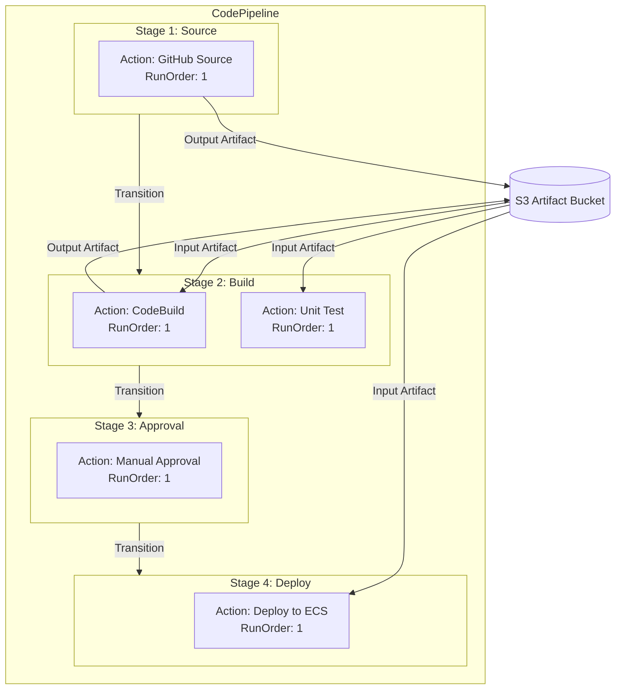

# CodePipeline 핵심 개념

AWS CodePipeline은 소스 코드 변경을 자동으로 감지하여 빌드, 테스트, 배포까지의 워크플로를 오케스트레이션하는 완전 관리형 CI/CD 서비스다. 이 문서에서는 파이프라인의 내부 구조, 스테이지와 액션의 관계, 아티팩트 전달 메커니즘, 그리고 파이프라인 실행 모델을 다룬다.

## 목차
- [1. 핵심 개념 (What)](#1-핵심-개념-what)
- [2. 왜 알아야 하는가 (Why)](#2-왜-알아야-하는가-why)
- [3. 내부 구현 분석 (How)](#3-내부-구현-분석-how)
- [4. 실전 예제](#4-실전-예제)
- [5. 정리](#5-정리)

---

## 1. 핵심 개념 (What)

### 파이프라인 (Pipeline)

파이프라인은 소프트웨어 릴리스 프로세스를 모델링한 워크플로다. 여러 **스테이지(Stage)**로 구성되며, 각 스테이지는 하나 이상의 **액션(Action)**을 포함한다. 파이프라인은 소스 변경이 감지되면 자동으로 실행되거나, 수동으로 트리거할 수 있다.

### 스테이지 (Stage)

스테이지는 파이프라인 내의 논리적 단위이며, 순차적으로 실행된다. 각 스테이지는 독립적인 작업 단위를 나타낸다.

| 스테이지 타입 | 용도 | 대표 프로바이더 |
|--------------|------|----------------|
| **Source** | 소스 코드 가져오기 | GitHub, CodeCommit, S3, Bitbucket, CodeStarSourceConnection |
| **Build** | 코드 빌드 및 테스트 | CodeBuild, Jenkins |
| **Test** | 추가 테스트 실행 | CodeBuild, Device Farm, Third-party |
| **Approval** | 수동 승인 게이트 | Manual Approval |
| **Deploy** | 배포 수행 | CodeDeploy, ECS, S3, CloudFormation, Elastic Beanstalk |
| **Invoke** | Lambda 함수 호출 | Lambda, Step Functions |

### 액션 (Action)

액션은 스테이지 내에서 실행되는 개별 작업이다. 각 액션은 **카테고리(Category)**, **프로바이더(Provider)**, **입/출력 아티팩트**를 갖는다.

액션의 주요 속성:
- **ActionTypeId**: 카테고리(Source/Build/Deploy/Test/Approval/Invoke), Owner(AWS/ThirdParty/Custom), Provider, Version으로 구성
- **RunOrder**: 같은 스테이지 내에서의 실행 순서. 동일한 RunOrder를 가진 액션은 병렬 실행된다
- **InputArtifacts / OutputArtifacts**: 액션 간 데이터 전달을 위한 아티팩트 참조

### 전환 (Transition)

전환은 스테이지 간의 연결이다. 전환을 비활성화(Disable)하면 해당 지점에서 파이프라인 실행이 멈추며, 이를 활용해 특정 환경으로의 배포를 제어할 수 있다.

### 아티팩트 (Artifact)

아티팩트는 파이프라인 액션 간에 전달되는 데이터 묶음이다. S3 버킷에 zip 파일로 저장되며, 각 액션은 이전 액션의 출력 아티팩트를 입력으로 받을 수 있다.

---

## 2. 왜 알아야 하는가 (Why)

### 파이프라인 설계의 중요성

잘못 설계된 파이프라인은 다음 문제를 일으킨다:

- **병목 현상**: 모든 액션이 직렬로 구성되면 배포 시간이 불필요하게 길어진다
- **불필요한 배포**: 스테이지 간 승인 게이트가 없으면 테스트되지 않은 코드가 프로덕션에 배포될 수 있다
- **디버깅 어려움**: 스테이지 구분이 명확하지 않으면 실패 지점을 파악하기 어렵다

### CodePipeline의 이점

- **완전 관리형**: 인프라 관리 없이 파이프라인을 구성할 수 있다
- **유연한 통합**: AWS 서비스는 물론 Jenkins, GitHub Actions 등 서드파티 도구와도 연동 가능하다
- **시각적 관리**: AWS 콘솔에서 파이프라인 상태를 실시간으로 모니터링할 수 있다
- **이벤트 기반**: CloudWatch Events / EventBridge와 연동하여 파이프라인 이벤트에 반응하는 자동화를 구축할 수 있다

### 실무에서 흔히 겪는 문제

1. **소스 감지 실패**: Webhook 연결이 끊어져 파이프라인이 트리거되지 않는 경우
2. **아티팩트 크기 초과**: 큰 바이너리를 아티팩트에 포함하여 전송 시간이 길어지는 경우
3. **동시 실행 충돌**: 같은 파이프라인이 동시에 여러 번 실행되어 충돌하는 경우

---

## 3. 내부 구현 분석 (How)

### 파이프라인 구조 다이어그램



### 파이프라인 실행 모델

CodePipeline V2에서는 두 가지 실행 모드를 지원한다:

#### SUPERSEDED 모드 (기본)
```
실행 A (커밋 #1) ──▶ Source ──▶ Build ──▶ Deploy
실행 B (커밋 #2) ──▶ Source ──▶ (대기 → A가 Build 스테이지를 떠나면 진입)
실행 C (커밋 #3) ──▶ (B를 대체, Superseded)
```
- 최신 실행이 이전 대기 중인 실행을 대체한다
- 가장 최신 코드만 최종 배포된다

#### QUEUED 모드 (V2)
```
실행 A (커밋 #1) ──▶ Source ──▶ Build ──▶ Deploy
실행 B (커밋 #2) ──▶ Source ──▶ Build ──▶ (A 완료 후 Deploy)
실행 C (커밋 #3) ──▶ Source ──▶ Build ──▶ (B 완료 후 Deploy)
```
- 모든 실행이 순서대로 처리된다
- 각 커밋이 순차적으로 배포된다

#### PARALLEL 모드 (V2)
```
실행 A (커밋 #1) ──▶ Source ──▶ Build ──▶ Deploy
실행 B (커밋 #2) ──▶ Source ──▶ Build ──▶ Deploy  (동시 실행)
실행 C (커밋 #3) ──▶ Source ──▶ Build ──▶ Deploy  (동시 실행)
```
- 모든 실행이 독립적으로 병렬 처리된다

### 소스 변경 감지 방식

CodePipeline은 두 가지 방식으로 소스 변경을 감지한다:

**이벤트 기반 (권장)**
```
GitHub Push → Webhook → EventBridge Rule → CodePipeline Trigger
```
- 변경 즉시 파이프라인이 시작된다
- CodeStar Connections를 사용하면 자동으로 설정된다

**폴링 기반 (레거시)**
```
CodePipeline이 주기적으로 소스 확인 (약 1분 간격)
```
- 지연이 발생하며 불필요한 API 호출이 발생한다
- 새 파이프라인에서는 권장하지 않는다

### 아티팩트 저장 및 전달

```
┌─────────────────────────────────────────────────────────┐
│                 S3 Artifact Bucket                       │
│                                                         │
│  /pipeline-name/                                        │
│    /SourceArti/  ← Source 스테이지 출력 (소스 코드 zip)   │
│    /BuildArti/   ← Build 스테이지 출력 (빌드 결과물)      │
│                                                         │
│  - KMS 암호화 적용 (기본: aws/s3 CMK)                    │
│  - 교차 리전 파이프라인 시 리전별 버킷 필요               │
└─────────────────────────────────────────────────────────┘
```

아티팩트는 다음 특성을 갖는다:
- S3에 zip 형태로 저장된다
- KMS로 암호화되며, 사용자 지정 CMK도 사용 가능하다
- 파이프라인 삭제 시 아티팩트 버킷은 자동 삭제되지 않는다 — 별도로 정리해야 한다

### 파이프라인 변수 (Pipeline Variables)

V2에서는 파이프라인 수준 변수를 지원한다:

```
파이프라인 변수:
  #{codepipeline.PipelineExecutionId}  → 실행 고유 ID
  #{SourceVariables.CommitId}          → 소스 커밋 해시
  #{SourceVariables.BranchName}        → 브랜치 이름
  #{BuildVariables.MY_VAR}             → CodeBuild에서 내보낸 환경 변수
```

이를 통해 스테이지 간 동적 값 전달이 가능하다.

---

## 4. 실전 예제

### 예제 1: 멀티 환경 파이프라인 (CloudFormation)

개발, 스테이징, 프로덕션 환경에 순차 배포하는 파이프라인 구성이다.

```yaml
Resources:
  MultiEnvPipeline:
    Type: AWS::CodePipeline::Pipeline
    Properties:
      Name: multi-env-pipeline
      PipelineType: V2
      ExecutionMode: QUEUED    # 순차 실행 보장
      RoleArn: !GetAtt PipelineRole.Arn
      ArtifactStore:
        Type: S3
        Location: !Ref ArtifactBucket

      Variables:
        - Name: IMAGE_TAG
          DefaultValue: latest
          Description: Docker image tag to deploy

      Stages:
        # 1. Source
        - Name: Source
          Actions:
            - Name: GitHubSource
              ActionTypeId:
                Category: Source
                Owner: AWS
                Provider: CodeStarSourceConnection
                Version: '1'
              Configuration:
                ConnectionArn: !Ref GitHubConnection
                FullRepositoryId: 'my-org/my-app'
                BranchName: main
                DetectChanges: true
                OutputArtifactFormat: CODE_ZIP
              OutputArtifacts:
                - Name: SourceOutput
              Namespace: SourceVariables

        # 2. Build
        - Name: Build
          Actions:
            - Name: BuildAndTest
              ActionTypeId:
                Category: Build
                Owner: AWS
                Provider: CodeBuild
                Version: '1'
              Configuration:
                ProjectName: !Ref BuildProject
                EnvironmentVariables: !Sub |
                  [
                    {"name":"COMMIT_ID","value":"#{SourceVariables.CommitId}","type":"PLAINTEXT"},
                    {"name":"BRANCH","value":"#{SourceVariables.BranchName}","type":"PLAINTEXT"}
                  ]
              InputArtifacts:
                - Name: SourceOutput
              OutputArtifacts:
                - Name: BuildOutput
              Namespace: BuildVariables

        # 3. Deploy to Dev (자동)
        - Name: DeployDev
          Actions:
            - Name: DeployToECS
              ActionTypeId:
                Category: Deploy
                Owner: AWS
                Provider: ECS
                Version: '1'
              Configuration:
                ClusterName: !Ref DevCluster
                ServiceName: !Ref DevService
                FileName: imagedefinitions.json
              InputArtifacts:
                - Name: BuildOutput

        # 4. Staging 승인
        - Name: StagingApproval
          Actions:
            - Name: ApproveStaging
              ActionTypeId:
                Category: Approval
                Owner: AWS
                Provider: Manual
                Version: '1'
              Configuration:
                NotificationArn: !Ref ApprovalSNSTopic
                CustomData: |
                  Commit: #{SourceVariables.CommitId}
                  스테이징 환경 배포를 승인하시겠습니까?

        # 5. Deploy to Staging
        - Name: DeployStaging
          Actions:
            - Name: DeployToECS
              ActionTypeId:
                Category: Deploy
                Owner: AWS
                Provider: CodeDeployToECS
                Version: '1'
              Configuration:
                ApplicationName: !Ref StagingCodeDeployApp
                DeploymentGroupName: !Ref StagingDeploymentGroup
                TaskDefinitionTemplateArtifact: BuildOutput
                TaskDefinitionTemplatePath: taskdef.json
                AppSpecTemplateArtifact: BuildOutput
                AppSpecTemplatePath: appspec.yaml
                Image1ArtifactName: BuildOutput
                Image1ContainerName: IMAGE1_NAME
              InputArtifacts:
                - Name: BuildOutput

        # 6. Production 승인
        - Name: ProductionApproval
          Actions:
            - Name: ApproveProduction
              ActionTypeId:
                Category: Approval
                Owner: AWS
                Provider: Manual
                Version: '1'
              Configuration:
                NotificationArn: !Ref ApprovalSNSTopic
                CustomData: |
                  스테이징 검증 완료 후 프로덕션 배포를 승인하시겠습니까?

        # 7. Deploy to Production
        - Name: DeployProduction
          Actions:
            - Name: DeployToECS
              ActionTypeId:
                Category: Deploy
                Owner: AWS
                Provider: CodeDeployToECS
                Version: '1'
              Configuration:
                ApplicationName: !Ref ProdCodeDeployApp
                DeploymentGroupName: !Ref ProdDeploymentGroup
                TaskDefinitionTemplateArtifact: BuildOutput
                TaskDefinitionTemplatePath: taskdef.json
                AppSpecTemplateArtifact: BuildOutput
                AppSpecTemplatePath: appspec.yaml
                Image1ArtifactName: BuildOutput
                Image1ContainerName: IMAGE1_NAME
              InputArtifacts:
                - Name: BuildOutput
```

### 예제 2: 병렬 액션 활용 — 빌드와 린트 동시 실행

```yaml
# Build 스테이지에서 빌드와 린트를 병렬로 실행
- Name: Build
  Actions:
    # RunOrder 1: 빌드와 린트가 동시에 실행
    - Name: BuildApp
      ActionTypeId:
        Category: Build
        Owner: AWS
        Provider: CodeBuild
        Version: '1'
      Configuration:
        ProjectName: !Ref AppBuildProject
      InputArtifacts:
        - Name: SourceOutput
      OutputArtifacts:
        - Name: BuildOutput
      RunOrder: 1

    - Name: LintAndScan
      ActionTypeId:
        Category: Build
        Owner: AWS
        Provider: CodeBuild
        Version: '1'
      Configuration:
        ProjectName: !Ref LintProject
      InputArtifacts:
        - Name: SourceOutput
      OutputArtifacts:
        - Name: LintOutput
      RunOrder: 1

    # RunOrder 2: 위 두 액션 모두 성공해야 실행
    - Name: IntegrationTest
      ActionTypeId:
        Category: Build
        Owner: AWS
        Provider: CodeBuild
        Version: '1'
      Configuration:
        ProjectName: !Ref IntegrationTestProject
      InputArtifacts:
        - Name: BuildOutput
      RunOrder: 2
```

### 예제 3: 전환 비활성화를 활용한 배포 제어

```bash
# 프로덕션 배포 전 전환 비활성화
aws codepipeline disable-stage-transition \
  --pipeline-name my-pipeline \
  --stage-name DeployProduction \
  --transition-type Inbound \
  --reason "프로덕션 배포 동결 - 연말 코드 프리즈"

# 배포 준비 완료 후 전환 활성화
aws codepipeline enable-stage-transition \
  --pipeline-name my-pipeline \
  --stage-name DeployProduction \
  --transition-type Inbound
```

---

## 5. 정리

### 핵심 구성 요소 요약

| 구성 요소 | 설명 | 핵심 포인트 |
|----------|------|------------|
| **Pipeline** | 전체 릴리스 워크플로 | V2는 QUEUED/PARALLEL 모드, 변수 지원 |
| **Stage** | 논리적 작업 단위 | 순차 실행, 전환으로 흐름 제어 |
| **Action** | 실제 실행 단위 | RunOrder로 병렬/순차 제어 |
| **Transition** | 스테이지 간 연결 | 비활성화로 배포 동결 가능 |
| **Artifact** | 스테이지 간 데이터 전달 | S3에 zip으로 저장, KMS 암호화 |

### 실행 모드 비교 (V2)

| 모드 | 동작 | 적합한 상황 |
|------|------|------------|
| **SUPERSEDED** | 최신 실행이 대기 중 실행을 대체 | 항상 최신 코드만 배포하면 되는 경우 |
| **QUEUED** | 모든 실행이 순서대로 처리 | 각 커밋의 배포 이력이 중요한 경우 |
| **PARALLEL** | 모든 실행이 독립적으로 병렬 처리 | 서로 다른 브랜치/환경 배포 |

### 기억할 포인트

1. **스테이지는 순차, 액션은 RunOrder로 병렬 가능**: 같은 RunOrder 값을 가진 액션은 동시에 실행된다
2. **V2 파이프라인을 사용하라**: 변수, QUEUED 모드, 트리거 필터 등 실무에 필수적인 기능이 V2에서 제공된다
3. **이벤트 기반 감지를 사용하라**: 폴링 대비 즉시 트리거되고 불필요한 API 호출을 줄인다
4. **전환 비활성화로 배포를 제어하라**: 코드 프리즈, 긴급 상황 시 특정 스테이지로의 진행을 차단할 수 있다
5. **아티팩트 버킷을 정리하라**: 파이프라인 삭제 시 아티팩트는 자동 삭제되지 않으므로 라이프사이클 정책을 설정해야 한다

---
*참고: AWS 서비스 최신 버전 기준*
