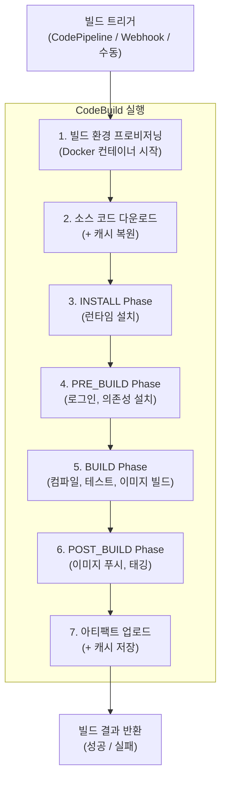

# CodeBuild 핵심 개념

AWS CodeBuild는 소스 코드를 컴파일하고, 테스트를 실행하며, 배포 가능한 아티팩트를 생성하는 완전 관리형 빌드 서비스다. 이 문서에서는 빌드 프로젝트 구성, 빌드 환경(Docker 이미지), buildspec.yml의 구조, 그리고 환경 변수 관리 방법을 다룬다.

## 목차
- [1. 핵심 개념 (What)](#1-핵심-개념-what)
- [2. 왜 알아야 하는가 (Why)](#2-왜-알아야-하는가-why)
- [3. 내부 구현 분석 (How)](#3-내부-구현-분석-how)
- [4. 실전 예제](#4-실전-예제)
- [5. 정리](#5-정리)

---

## 1. 핵심 개념 (What)

### 빌드 프로젝트 (Build Project)

빌드 프로젝트는 CodeBuild의 핵심 리소스이며, 빌드를 실행하기 위한 모든 설정을 포함한다:

- **소스(Source)**: 빌드할 코드의 위치 (CodeCommit, GitHub, S3, Bitbucket 등)
- **환경(Environment)**: 빌드가 실행되는 Docker 컨테이너 설정
- **빌드스펙(Buildspec)**: 빌드 명령어가 정의된 YAML 파일
- **아티팩트(Artifacts)**: 빌드 결과물의 저장 위치와 형식
- **캐시(Cache)**: 빌드 속도를 높이기 위한 캐시 설정
- **로그(Logs)**: CloudWatch Logs 및 S3 로그 설정

### 빌드 환경 (Build Environment)

CodeBuild는 모든 빌드를 Docker 컨테이너 내에서 실행한다. 빌드 환경은 다음 요소로 구성된다:

| 요소 | 설명 | 옵션 |
|------|------|------|
| **이미지(Image)** | 빌드에 사용할 Docker 이미지 | AWS 관리형 이미지 또는 사용자 정의 이미지 |
| **컴퓨팅 타입(ComputeType)** | CPU/메모리 사양 | SMALL(3GB/2vCPU), MEDIUM(7GB/4vCPU), LARGE(15GB/8vCPU), 2XLARGE(145GB/72vCPU) |
| **타입(Type)** | 컨테이너 타입 | LINUX_CONTAINER, LINUX_GPU_CONTAINER, ARM_CONTAINER, WINDOWS_SERVER_2019_CONTAINER |
| **특권 모드(PrivilegedMode)** | Docker-in-Docker 허용 여부 | Docker 이미지 빌드 시 필수 (`true`) |

### buildspec.yml

빌드 명령어와 설정을 정의하는 YAML 파일이다. 프로젝트 루트에 위치하며, 빌드의 각 단계(Phase)에서 실행할 명령어, 생성할 아티팩트, 캐시 설정 등을 포함한다.

### 환경 변수 (Environment Variables)

빌드에 필요한 설정값을 전달하는 메커니즘이다. 세 가지 타입이 존재한다:

- **PLAINTEXT**: 일반 텍스트 (비밀 정보에 사용 금지)
- **PARAMETER_STORE**: AWS Systems Manager Parameter Store에서 가져오기
- **SECRETS_MANAGER**: AWS Secrets Manager에서 가져오기

---

## 2. 왜 알아야 하는가 (Why)

### 자체 빌드 서버 관리의 고충

Jenkins 등 자체 빌드 서버를 운영하면 다음 문제가 발생한다:

- **서버 관리 부담**: OS 패치, 보안 업데이트, 디스크 관리 등 지속적인 운영이 필요하다
- **확장성 한계**: 빌드가 몰리면 대기열이 길어지고, 유휴 시간에는 리소스가 낭비된다
- **환경 일관성**: 빌드 서버의 상태가 변하면 "내 로컬에서는 되는데" 문제가 발생한다

### CodeBuild의 이점

- **서버리스**: 빌드 서버를 관리할 필요가 없다. AWS가 인프라를 완전히 관리한다
- **자동 확장**: 동시에 수백 개의 빌드를 병렬 처리할 수 있다. 대기열이 없다
- **격리된 환경**: 매 빌드마다 새로운 Docker 컨테이너가 생성되어 환경 오염이 없다
- **분 단위 과금**: 빌드 시간만큼만 비용이 발생한다. 유휴 비용이 없다
- **보안**: VPC 내에서 빌드를 실행할 수 있으며, IAM으로 세밀한 권한 제어가 가능하다

### buildspec.yml을 알아야 하는 이유

buildspec.yml은 빌드 프로세스의 핵심이다:

1. **재현 가능한 빌드**: 코드와 함께 버전 관리되므로 어떤 시점의 빌드 절차도 재현 가능하다
2. **빌드 최적화**: 캐시, 병렬 실행, 조건부 빌드 등을 설정하여 빌드 시간을 단축할 수 있다
3. **디버깅**: 빌드 실패 시 어떤 Phase에서 어떤 명령어가 실패했는지 정확히 추적할 수 있다

---

## 3. 내부 구현 분석 (How)

### 빌드 실행 흐름



### buildspec.yml 전체 구조

```yaml
version: 0.2

# 빌드 실행 모드 (기본: BUILD_GENERAL1)
run-as: root    # 선택 사항: 빌드 명령어를 실행할 Linux 사용자

# 환경 변수 정의
env:
  # 빌드 내에서 사용할 변수
  variables:
    APP_NAME: "my-app"
    ENVIRONMENT: "production"
  
  # Parameter Store에서 가져올 변수
  parameter-store:
    DB_PASSWORD: "/myapp/db-password"
    API_KEY: "/myapp/api-key"
  
  # Secrets Manager에서 가져올 변수
  secrets-manager:
    DOCKERHUB_TOKEN: "dockerhub-creds:token"
    DOCKERHUB_USER: "dockerhub-creds:username"
  
  # CodeBuild에서 내보낼 변수 (CodePipeline 변수로 사용 가능)
  exported-variables:
    - IMAGE_TAG
    - BUILD_ID

  # Git 자격 증명 헬퍼 활성화
  git-credential-helper: yes

# 빌드 프록시 설정 (VPC 내 빌드 시)
proxy:
  upload-artifacts: yes
  logs: yes

# 빌드 페이즈 정의
phases:
  # INSTALL: 빌드 도구/런타임 설치
  install:
    runtime-versions:
      nodejs: 18
      docker: 20
    commands:
      - echo "Installing dependencies..."

  # PRE_BUILD: 빌드 전 준비 작업
  pre_build:
    commands:
      - echo "Logging in to Amazon ECR..."
      - aws ecr get-login-password --region $AWS_DEFAULT_REGION | docker login --username AWS --password-stdin $AWS_ACCOUNT_ID.dkr.ecr.$AWS_DEFAULT_REGION.amazonaws.com
    on-failure: ABORT    # 실패 시 빌드 중단 (ABORT | CONTINUE)

  # BUILD: 핵심 빌드 작업
  build:
    commands:
      - echo "Building Docker image..."
      - docker build -t $IMAGE_REPO_NAME:$IMAGE_TAG .
      - docker tag $IMAGE_REPO_NAME:$IMAGE_TAG $AWS_ACCOUNT_ID.dkr.ecr.$AWS_DEFAULT_REGION.amazonaws.com/$IMAGE_REPO_NAME:$IMAGE_TAG
    on-failure: ABORT

  # POST_BUILD: 빌드 후 작업
  post_build:
    commands:
      - echo "Pushing Docker image..."
      - docker push $AWS_ACCOUNT_ID.dkr.ecr.$AWS_DEFAULT_REGION.amazonaws.com/$IMAGE_REPO_NAME:$IMAGE_TAG
      - echo "Writing image definitions file..."
      - printf '[{"name":"container-name","imageUri":"%s"}]' $AWS_ACCOUNT_ID.dkr.ecr.$AWS_DEFAULT_REGION.amazonaws.com/$IMAGE_REPO_NAME:$IMAGE_TAG > imagedefinitions.json
    on-failure: CONTINUE    # 실패해도 아티팩트 업로드 진행

# 리포트 정의 (테스트 결과 등)
reports:
  unit-test-report:
    files:
      - '**/*'
    base-directory: test-reports
    file-format: JUNITXML

# 빌드 결과물 정의
artifacts:
  files:
    - imagedefinitions.json
    - imageDetail.json
    - taskdef.json
    - appspec.yaml
  discard-paths: yes
  
  # 보조 아티팩트 (여러 출력이 필요한 경우)
  secondary-artifacts:
    test-results:
      files:
        - '**/*'
      base-directory: test-reports

# 빌드 캐시 정의
cache:
  paths:
    - '/root/.npm/**/*'           # npm 캐시
    - '/root/.m2/**/*'            # Maven 캐시
    - '/root/.cache/pip/**/*'     # pip 캐시
    - '/var/lib/docker/**/*'      # Docker 레이어 캐시
```

### 빌드 Phase별 동작

```
┌──────────────────────────────────────────────────────────────────────┐
│ Phase 실행 순서와 특성                                                │
├──────────┬───────────────────────────────────────────────────────────┤
│ SUBMITTED│ 빌드 요청 접수 (대기열에 추가)                              │
├──────────┤                                                          │
│ QUEUED   │ 빌드 환경 할당 대기                                        │
├──────────┤                                                          │
│ PROVISIO │ Docker 컨테이너 프로비저닝 (사용자 제어 불가)                 │
│ NING     │                                                          │
├──────────┤                                                          │
│ DOWNLOAD │ 소스 코드 다운로드 + 캐시 복원 (사용자 제어 불가)             │
│ _SOURCE  │                                                          │
├──────────┤                                                          │
│ INSTALL  │ buildspec의 install phase 실행                             │
│          │ - 런타임 버전 설정, 빌드 도구 설치                           │
├──────────┤                                                          │
│ PRE_BUILD│ buildspec의 pre_build phase 실행                           │
│          │ - ECR 로그인, 의존성 설치, 환경 준비                         │
├──────────┤                                                          │
│ BUILD    │ buildspec의 build phase 실행                               │
│          │ - 컴파일, 테스트, Docker 이미지 빌드                        │
├──────────┤                                                          │
│ POST_    │ buildspec의 post_build phase 실행                          │
│ BUILD    │ - 이미지 푸시, 알림 전송, 정리 작업                          │
│          │ ※ BUILD 실패 시에도 실행됨 (CODEBUILD_BUILD_SUCCEEDING=0)   │
├──────────┤                                                          │
│ UPLOAD_  │ 아티팩트 업로드 + 캐시 저장 (사용자 제어 불가)               │
│ ARTIFACTS│                                                          │
├──────────┤                                                          │
│ FINALI   │ 빌드 환경 정리 (사용자 제어 불가)                            │
│ ZING     │                                                          │
└──────────┴───────────────────────────────────────────────────────────┘
```

### 환경 변수 우선순위

환경 변수가 여러 곳에서 정의된 경우 다음 우선순위가 적용된다:

```
1. 빌드 시작 시 전달된 변수 (StartBuild API Override)     ← 최우선
2. 빌드 프로젝트 설정의 환경 변수
3. buildspec.yml의 env.variables
4. Docker 이미지에 설정된 환경 변수                        ← 최하위
```

### 캐시 전략

CodeBuild는 세 가지 캐시 타입을 지원한다:

| 캐시 타입 | 저장 위치 | 속도 | 용도 |
|----------|----------|------|------|
| **No Cache** | 없음 | - | 매번 클린 빌드 |
| **S3 Cache** | S3 버킷 | 보통 | 의존성 캐시 (node_modules, .m2) |
| **Local Cache** | 빌드 호스트 | 빠름 | Docker 레이어, 소스 캐시 |

Local Cache의 세 가지 모드:
- **LOCAL_SOURCE_CACHE**: Git 소스의 `.git` 디렉토리를 캐시
- **LOCAL_DOCKER_LAYER_CACHE**: Docker 레이어를 캐시
- **LOCAL_CUSTOM_CACHE**: buildspec에서 지정한 경로를 캐시

---

## 4. 실전 예제

### 예제 1: ECS용 Docker 이미지 빌드 buildspec.yml

```yaml
version: 0.2

env:
  variables:
    IMAGE_REPO_NAME: "my-app"
    DOCKERFILE_PATH: "Dockerfile"
  parameter-store:
    DOCKERHUB_USER: "/codebuild/dockerhub-user"
    DOCKERHUB_TOKEN: "/codebuild/dockerhub-token"
  exported-variables:
    - IMAGE_TAG

phases:
  install:
    runtime-versions:
      docker: 20

  pre_build:
    commands:
      # Docker Hub 로그인 (Rate Limit 방지)
      - echo $DOCKERHUB_TOKEN | docker login --username $DOCKERHUB_USER --password-stdin
      # ECR 로그인
      - AWS_ACCOUNT_ID=$(aws sts get-caller-identity --query Account --output text)
      - ECR_URI=$AWS_ACCOUNT_ID.dkr.ecr.$AWS_DEFAULT_REGION.amazonaws.com
      - aws ecr get-login-password --region $AWS_DEFAULT_REGION | docker login --username AWS --password-stdin $ECR_URI
      # 이미지 태그 설정
      - IMAGE_TAG=$(echo $CODEBUILD_RESOLVED_SOURCE_VERSION | cut -c 1-7)
      - FULL_IMAGE_URI=$ECR_URI/$IMAGE_REPO_NAME:$IMAGE_TAG
      - echo "Building image $FULL_IMAGE_URI"

  build:
    commands:
      # Docker 이미지 빌드 (BuildKit 사용)
      - DOCKER_BUILDKIT=1 docker build
          --build-arg BUILDKIT_INLINE_CACHE=1
          --cache-from $ECR_URI/$IMAGE_REPO_NAME:latest
          -t $IMAGE_REPO_NAME:$IMAGE_TAG
          -t $IMAGE_REPO_NAME:latest
          -f $DOCKERFILE_PATH .

  post_build:
    commands:
      # ECR에 이미지 푸시
      - docker tag $IMAGE_REPO_NAME:$IMAGE_TAG $FULL_IMAGE_URI
      - docker tag $IMAGE_REPO_NAME:latest $ECR_URI/$IMAGE_REPO_NAME:latest
      - docker push $FULL_IMAGE_URI
      - docker push $ECR_URI/$IMAGE_REPO_NAME:latest
      # CodeDeploy용 파일 생성
      - printf '{"ImageURI":"%s"}' $FULL_IMAGE_URI > imageDetail.json
      # ECS 직접 배포용 파일 생성
      - printf '[{"name":"app","imageUri":"%s"}]' $FULL_IMAGE_URI > imagedefinitions.json

artifacts:
  files:
    - imageDetail.json
    - imagedefinitions.json
    - taskdef.json
    - appspec.yaml
  discard-paths: yes

cache:
  paths:
    - '/var/lib/docker/**/*'
```

### 예제 2: CodeBuild 프로젝트 Terraform 구성

```hcl
resource "aws_codebuild_project" "app_build" {
  name          = "my-app-build"
  description   = "ECS 애플리케이션 Docker 이미지 빌드"
  build_timeout = 15  # 분 단위 (기본 60분)
  service_role  = aws_iam_role.codebuild_role.arn

  # 소스 설정
  source {
    type      = "CODEPIPELINE"
    buildspec = "buildspec.yml"  # 소스 루트 기준 경로
  }

  # 빌드 환경 설정
  environment {
    compute_type                = "BUILD_GENERAL1_MEDIUM"
    image                       = "aws/codebuild/amazonlinux2-x86_64-standard:5.0"
    type                        = "LINUX_CONTAINER"
    image_pull_credentials_type = "CODEBUILD"
    privileged_mode             = true  # Docker 빌드에 필요

    environment_variable {
      name  = "AWS_DEFAULT_REGION"
      value = var.aws_region
    }

    environment_variable {
      name  = "IMAGE_REPO_NAME"
      value = aws_ecr_repository.app.name
    }

    environment_variable {
      name  = "DOCKERHUB_TOKEN"
      value = "/codebuild/dockerhub-token"
      type  = "PARAMETER_STORE"  # SSM Parameter Store에서 가져오기
    }
  }

  # 아티팩트 설정
  artifacts {
    type = "CODEPIPELINE"
  }

  # 캐시 설정 (S3)
  cache {
    type     = "S3"
    location = "${aws_s3_bucket.cache.bucket}/build-cache"
  }

  # VPC 설정 (프라이빗 리소스 접근 필요 시)
  vpc_config {
    vpc_id             = var.vpc_id
    subnets            = var.private_subnet_ids
    security_group_ids = [aws_security_group.codebuild_sg.id]
  }

  # 로그 설정
  logs_config {
    cloudwatch_logs {
      group_name  = "/codebuild/my-app-build"
      stream_name = ""
    }

    s3_logs {
      status   = "ENABLED"
      location = "${aws_s3_bucket.logs.bucket}/codebuild-logs"
    }
  }

  tags = {
    Environment = "production"
    Project     = "my-app"
  }
}

# CodeBuild IAM Role
resource "aws_iam_role" "codebuild_role" {
  name = "codebuild-my-app-role"

  assume_role_policy = jsonencode({
    Version = "2012-10-17"
    Statement = [{
      Action = "sts:AssumeRole"
      Effect = "Allow"
      Principal = {
        Service = "codebuild.amazonaws.com"
      }
    }]
  })
}

resource "aws_iam_role_policy" "codebuild_policy" {
  role = aws_iam_role.codebuild_role.name

  policy = jsonencode({
    Version = "2012-10-17"
    Statement = [
      {
        Effect = "Allow"
        Action = [
          "logs:CreateLogGroup",
          "logs:CreateLogStream",
          "logs:PutLogEvents"
        ]
        Resource = "*"
      },
      {
        Effect = "Allow"
        Action = [
          "ecr:BatchCheckLayerAvailability",
          "ecr:CompleteLayerUpload",
          "ecr:GetAuthorizationToken",
          "ecr:InitiateLayerUpload",
          "ecr:PutImage",
          "ecr:UploadLayerPart",
          "ecr:BatchGetImage",
          "ecr:GetDownloadUrlForLayer"
        ]
        Resource = "*"
      },
      {
        Effect = "Allow"
        Action = [
          "s3:GetObject",
          "s3:PutObject",
          "s3:GetBucketAcl",
          "s3:GetBucketLocation"
        ]
        Resource = [
          aws_s3_bucket.artifact.arn,
          "${aws_s3_bucket.artifact.arn}/*"
        ]
      },
      {
        Effect = "Allow"
        Action = [
          "ssm:GetParameters"
        ]
        Resource = "arn:aws:ssm:*:*:parameter/codebuild/*"
      }
    ]
  })
}
```

---

## 5. 정리

### buildspec.yml Phase 요약

| Phase | 실행 시점 | 주요 작업 | 실패 시 |
|-------|----------|----------|--------|
| **install** | 빌드 환경 설정 직후 | 런타임 버전 설정, 도구 설치 | 빌드 중단 |
| **pre_build** | install 완료 후 | ECR 로그인, 의존성 설치 | on-failure 설정에 따름 |
| **build** | pre_build 완료 후 | 컴파일, Docker 빌드, 테스트 | on-failure 설정에 따름 |
| **post_build** | build 완료 후 | 이미지 푸시, 결과 파일 생성 | build 실패 시에도 실행됨 |

### 환경 변수 타입 비교

| 타입 | 저장소 | 보안 | 사용 시나리오 |
|------|-------|------|-------------|
| **PLAINTEXT** | 빌드 프로젝트 설정 | 평문 노출 | 리전, 프로젝트명 등 비밀이 아닌 값 |
| **PARAMETER_STORE** | SSM Parameter Store | 암호화 가능 (SecureString) | DB 비밀번호, API 키 |
| **SECRETS_MANAGER** | Secrets Manager | 자동 암호화 + 자동 로테이션 | 외부 서비스 자격 증명 |

### 기억할 포인트

1. **Docker 빌드 시 `privilegedMode: true`는 필수다**: Docker-in-Docker로 이미지를 빌드하려면 컨테이너에 특권 모드가 필요하다
2. **post_build는 build 실패 시에도 실행된다**: `CODEBUILD_BUILD_SUCCEEDING` 환경 변수로 성공 여부를 확인해야 한다
3. **비밀 정보는 절대 PLAINTEXT에 넣지 마라**: Parameter Store나 Secrets Manager를 사용하라
4. **캐시를 적극 활용하라**: Docker 레이어 캐시와 의존성 캐시로 빌드 시간을 크게 단축할 수 있다
5. **buildspec.yml은 소스 코드와 함께 버전 관리하라**: 빌드 프로세스의 변경 이력을 추적할 수 있다

---
*참고: AWS 서비스 최신 버전 기준*
