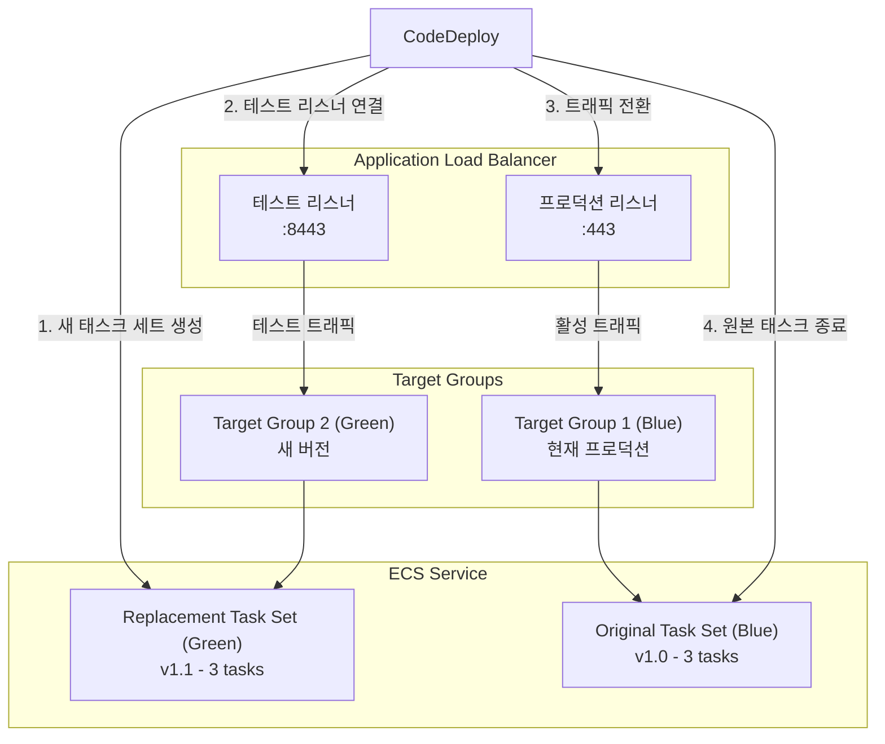
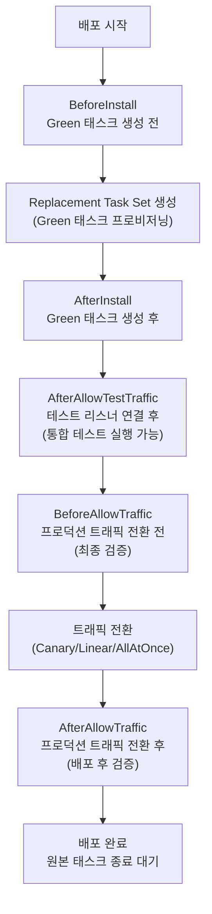

# CodeDeploy 핵심 개념

AWS CodeDeploy는 EC2, Lambda, ECS 등 다양한 컴퓨팅 플랫폼에 애플리케이션을 자동 배포하는 서비스다. 이 문서에서는 CodeDeploy의 핵심 구성 요소인 애플리케이션, 배포 그룹, 배포 구성, AppSpec 파일의 구조를 다루며, 특히 ECS 플랫폼에서의 Blue/Green 배포 역할에 초점을 맞춘다.

## 목차
- [1. 핵심 개념 (What)](#1-핵심-개념-what)
- [2. 왜 알아야 하는가 (Why)](#2-왜-알아야-하는가-why)
- [3. 내부 구현 분석 (How)](#3-내부-구현-분석-how)
- [4. 실전 예제](#4-실전-예제)
- [5. 정리](#5-정리)

---

## 1. 핵심 개념 (What)

### 애플리케이션 (Application)

CodeDeploy에서 애플리케이션은 배포 대상을 식별하는 최상위 논리적 단위다. 플랫폼 타입(EC2/On-premises, Lambda, ECS)을 지정하며, 하위에 하나 이상의 배포 그룹을 포함한다.

### 배포 그룹 (Deployment Group)

배포 그룹은 실제 배포가 수행되는 대상 환경을 정의한다. ECS 플랫폼에서 배포 그룹은 다음을 포함한다:

| 구성 요소 | 설명 |
|----------|------|
| **ECS 클러스터 / 서비스** | 배포 대상 ECS 서비스 |
| **로드 밸런서 설정** | ALB 리스너, 프로덕션/테스트 리스너 포트 |
| **타겟 그룹** | Blue(원본)와 Green(대체) 타겟 그룹 |
| **배포 구성** | 트래픽 전환 방식 (Canary, Linear, AllAtOnce) |
| **자동 롤백 설정** | 배포 실패 또는 알람 트리거 시 자동 롤백 |
| **알람 설정** | CloudWatch 알람 기반 배포 중단 조건 |

### 배포 구성 (Deployment Configuration)

배포 구성은 트래픽을 새 버전으로 전환하는 방식을 정의한다. ECS에서 사용 가능한 배포 구성은 다음과 같다:

| 배포 구성 | 트래픽 전환 방식 |
|----------|----------------|
| **CodeDeployDefault.ECSAllAtOnce** | 즉시 100% 전환 |
| **CodeDeployDefault.ECSLinear10PercentEvery1Minutes** | 1분마다 10%씩 전환 |
| **CodeDeployDefault.ECSLinear10PercentEvery3Minutes** | 3분마다 10%씩 전환 |
| **CodeDeployDefault.ECSCanary10Percent5Minutes** | 10% 먼저, 5분 후 나머지 90% |
| **CodeDeployDefault.ECSCanary10Percent15Minutes** | 10% 먼저, 15분 후 나머지 90% |
| **사용자 정의** | Canary/Linear 비율과 간격을 직접 지정 |

### AppSpec 파일

AppSpec(Application Specification) 파일은 배포 시 CodeDeploy가 수행할 작업을 정의하는 YAML/JSON 파일이다. 플랫폼에 따라 구조가 다르며, ECS에서는 Task Definition, 컨테이너/포트 매핑, 라이프사이클 훅을 정의한다.

### 배포 라이프사이클 훅 (Lifecycle Hooks)

배포 과정의 각 단계에서 Lambda 함수를 호출하여 커스텀 로직을 실행할 수 있다. 검증, 알림, 데이터 마이그레이션 등에 활용한다.

---

## 2. 왜 알아야 하는가 (Why)

### 무중단 배포의 필요성

프로덕션 서비스에서 다운타임은 직접적인 비즈니스 손실로 이어진다:

- **매출 손실**: 서비스 중단 동안 사용자가 이탈한다
- **신뢰도 하락**: 잦은 다운타임은 사용자 신뢰를 훼손한다
- **SLA 위반**: 가용성 SLA를 충족하지 못하면 계약 위반이 된다

### CodeDeploy + ECS의 이점

- **Blue/Green 배포**: 새 버전을 별도 환경에 배포하고 트래픽을 한 번에 전환하므로 다운타임이 없다
- **점진적 트래픽 전환**: Canary/Linear 배포로 소수 사용자에게 먼저 검증한 후 전체 전환한다
- **자동 롤백**: 헬스 체크 실패나 CloudWatch 알람 트리거 시 이전 버전으로 자동 복구한다
- **테스트 리스너**: 전환 전에 테스트 포트로 새 버전을 직접 확인할 수 있다

### ECS에서 CodeDeploy를 사용하는 이유

ECS 자체적으로도 롤링 업데이트를 지원하지만, CodeDeploy와 결합하면 다음 추가 기능을 얻는다:

| 기능 | ECS 롤링 업데이트 | CodeDeploy Blue/Green |
|------|-------------------|----------------------|
| 배포 방식 | 기존 태스크를 순차 교체 | 새 태스크 세트를 병렬 생성 |
| 트래픽 전환 | 점진적 (태스크 단위) | Canary / Linear / AllAtOnce |
| 테스트 리스너 | 미지원 | 지원 |
| 자동 롤백 | 제한적 | CloudWatch 알람 연동 자동 롤백 |
| 라이프사이클 훅 | 미지원 | Lambda 함수 호출 가능 |
| 대기 시간 | 미지원 | 원본 태스크 종료 전 대기 시간 설정 |

---

## 3. 내부 구현 분석 (How)

### ECS Blue/Green 배포 아키텍처



### Blue/Green 배포 상세 흐름

```
시간 ──────────────────────────────────────────────────────────▶

단계 1: 배포 시작
┌──────────────────────────────────────┐
│ CodeDeploy가 새 Task Definition으로  │
│ Replacement Task Set (Green) 생성    │
│                                      │
│ Blue: ████████ (100% 트래픽)         │
│ Green: □□□□□□□□ (프로비저닝 중)       │
└──────────────────────────────────────┘

단계 2: 테스트 기간
┌──────────────────────────────────────┐
│ Green 태스크 헬스체크 통과            │
│ 테스트 리스너로 Green 접근 가능       │
│                                      │
│ Blue: ████████ (프로덕션 트래픽)      │
│ Green: ████████ (테스트 리스너만)     │
│                                      │
│ → BeforeAllowTraffic 훅 실행        │
└──────────────────────────────────────┘

단계 3: 트래픽 전환
┌──────────────────────────────────────┐
│ Canary/Linear/AllAtOnce에 따라       │
│ 프로덕션 리스너를 Green으로 전환     │
│                                      │
│ Canary 10%:                          │
│   Blue: ███████░ (90%)               │
│   Green: █░░░░░░░ (10%)             │
│                                      │
│ → AfterAllowTraffic 훅 실행         │
└──────────────────────────────────────┘

단계 4: 완료
┌──────────────────────────────────────┐
│ 트래픽 100% Green으로 전환 완료      │
│ 대기 시간(termination wait) 후       │
│ Blue 태스크 세트 종료                │
│                                      │
│ Blue: □□□□□□□□ (종료됨)              │
│ Green: ████████ (100% 트래픽)        │
└──────────────────────────────────────┘
```

### AppSpec 파일 구조 (ECS)

```yaml
version: 0.0
Resources:
  - TargetService:
      Type: AWS::ECS::Service
      Properties:
        # Task Definition — <IMAGE1_NAME> 플레이스홀더가 실제 이미지 URI로 치환됨
        TaskDefinition: <TASK_DEFINITION>
        # 로드 밸런서 설정
        LoadBalancerInfo:
          ContainerName: "app-container"
          ContainerPort: 8080
        # 플랫폼 버전 (Fargate만 해당)
        PlatformVersion: "LATEST"
        # 네트워크 설정 (Fargate / awsvpc 모드)
        NetworkConfiguration:
          AwsvpcConfiguration:
            Subnets:
              - "subnet-0123456789abcdef0"
              - "subnet-0123456789abcdef1"
            SecurityGroups:
              - "sg-0123456789abcdef0"
            AssignPublicIp: "DISABLED"
        # 용량 프로바이더 전략
        CapacityProviderStrategy:
          - Base: 1
            CapacityProvider: "FARGATE"
            Weight: 1
          - Base: 0
            CapacityProvider: "FARGATE_SPOT"
            Weight: 3

# 라이프사이클 훅
Hooks:
  - BeforeInstall: "LambdaFunctionToValidateBeforeInstall"
  - AfterInstall: "LambdaFunctionToValidateAfterInstall"
  - AfterAllowTestTraffic: "LambdaFunctionToValidateTestTraffic"
  - BeforeAllowTraffic: "LambdaFunctionToValidateBeforeTraffic"
  - AfterAllowTraffic: "LambdaFunctionToValidateAfterTraffic"
```

### ECS 배포 라이프사이클 훅 순서



### Task Definition 템플릿과 이미지 치환

CodePipeline + CodeDeploy 조합에서 Docker 이미지 URI는 다음과 같이 동적으로 치환된다:

```
1. CodeBuild가 imageDetail.json 생성:
   {"ImageURI": "123456789.dkr.ecr.ap-northeast-2.amazonaws.com/my-app:abc1234"}

2. taskdef.json 템플릿에 플레이스홀더:
   {
     "containerDefinitions": [{
       "name": "app",
       "image": "<IMAGE1_NAME>",     ← 플레이스홀더
       "portMappings": [{"containerPort": 8080}]
     }]
   }

3. CodeDeploy가 <IMAGE1_NAME>을 실제 URI로 치환:
   "image": "123456789.dkr.ecr.ap-northeast-2.amazonaws.com/my-app:abc1234"

4. 치환된 Task Definition을 ECS에 등록하고 배포 수행
```

### 자동 롤백 메커니즘

```
배포 실패 감지 조건:
├── 1. ECS 태스크 시작 실패 (헬스체크 미통과)
├── 2. CloudWatch 알람 트리거 (에러율, 레이턴시 등)
├── 3. 라이프사이클 훅 Lambda 함수 실패
└── 4. 수동 롤백 요청

롤백 동작:
├── 프로덕션 리스너를 Blue 타겟 그룹으로 복원
├── Green 태스크 세트 종료
└── 배포 상태를 "Stopped - Rolled Back"으로 표시
```

---

## 4. 실전 예제

### 예제 1: ECS Blue/Green 배포 전체 구성 (Terraform)

```hcl
# CodeDeploy 애플리케이션
resource "aws_codedeploy_app" "ecs_app" {
  compute_platform = "ECS"
  name             = "my-ecs-app"
}

# 배포 그룹
resource "aws_codedeploy_deployment_group" "ecs_dg" {
  app_name               = aws_codedeploy_app.ecs_app.name
  deployment_group_name  = "my-ecs-dg"
  deployment_config_name = "CodeDeployDefault.ECSCanary10Percent5Minutes"
  service_role_arn       = aws_iam_role.codedeploy_role.arn

  # 자동 롤백 설정
  auto_rollback_configuration {
    enabled = true
    events  = [
      "DEPLOYMENT_FAILURE",
      "DEPLOYMENT_STOP_ON_ALARM"
    ]
  }

  # Blue/Green 배포 설정
  blue_green_deployment_config {
    deployment_ready_option {
      action_on_timeout = "CONTINUE_DEPLOYMENT"
      wait_time_in_minutes = 0
    }

    terminate_blue_instances_on_deployment_success {
      action                           = "TERMINATE"
      termination_wait_time_in_minutes = 60  # 롤백 대비 1시간 대기
    }
  }

  # 배포 스타일
  deployment_style {
    deployment_option = "WITH_TRAFFIC_CONTROL"
    deployment_type   = "BLUE_GREEN"
  }

  # ECS 서비스 설정
  ecs_service {
    cluster_name = aws_ecs_cluster.main.name
    service_name = aws_ecs_service.app.name
  }

  # 로드 밸런서 설정
  load_balancer_info {
    target_group_pair_info {
      # 프로덕션 트래픽 리스너
      prod_traffic_route {
        listener_arns = [aws_lb_listener.prod.arn]
      }

      # 테스트 트래픽 리스너
      test_traffic_route {
        listener_arns = [aws_lb_listener.test.arn]
      }

      # Blue 타겟 그룹
      target_group {
        name = aws_lb_target_group.blue.name
      }

      # Green 타겟 그룹
      target_group {
        name = aws_lb_target_group.green.name
      }
    }
  }

  # CloudWatch 알람 기반 배포 중단
  alarm_configuration {
    alarms  = [
      aws_cloudwatch_metric_alarm.high_error_rate.alarm_name,
      aws_cloudwatch_metric_alarm.high_latency.alarm_name
    ]
    enabled = true
  }
}

# 롤백 판단용 CloudWatch 알람
resource "aws_cloudwatch_metric_alarm" "high_error_rate" {
  alarm_name          = "ecs-app-high-error-rate"
  comparison_operator = "GreaterThanThreshold"
  evaluation_periods  = 2
  metric_name         = "HTTPCode_Target_5XX_Count"
  namespace           = "AWS/ApplicationELB"
  period              = 60
  statistic           = "Sum"
  threshold           = 10
  alarm_description   = "5XX 에러가 2분간 10건 이상 발생 시 배포 중단"

  dimensions = {
    LoadBalancer = aws_lb.main.arn_suffix
    TargetGroup  = aws_lb_target_group.green.arn_suffix
  }
}
```

### 예제 2: 라이프사이클 훅 Lambda 함수

```python
# lambda/validate_deployment.py
# AfterAllowTestTraffic 훅에서 호출되어 테스트 트래픽으로 새 버전을 검증한다

import json
import urllib.request
import boto3

codedeploy = boto3.client('codedeploy')


def handler(event, context):
    """
    CodeDeploy 라이프사이클 훅 핸들러.
    테스트 리스너를 통해 새 버전의 헬스를 검증한다.
    """
    deployment_id = event['DeploymentId']
    lifecycle_event_hook_execution_id = event['LifecycleEventHookExecutionId']

    try:
        # 테스트 엔드포인트 헬스 체크
        test_url = "https://app.example.com:8443/health"
        req = urllib.request.Request(test_url, method='GET')
        req.add_header('Host', 'app.example.com')

        with urllib.request.urlopen(req, timeout=10) as response:
            body = json.loads(response.read().decode())

            if response.status == 200 and body.get('status') == 'healthy':
                status = 'Succeeded'
                print(f"Health check passed: {body}")
            else:
                status = 'Failed'
                print(f"Health check failed: status={response.status}, body={body}")

    except Exception as e:
        status = 'Failed'
        print(f"Health check error: {e}")

    # CodeDeploy에 결과 보고
    codedeploy.put_lifecycle_event_hook_execution_status(
        deploymentId=deployment_id,
        lifecycleEventHookExecutionId=lifecycle_event_hook_execution_id,
        status=status    # 'Succeeded' or 'Failed'
    )

    return {'statusCode': 200, 'body': json.dumps({'status': status})}
```

### 예제 3: taskdef.json 및 appspec.yaml 템플릿

**taskdef.json** (CodeDeploy용 템플릿):
```json
{
  "executionRoleArn": "arn:aws:iam::123456789012:role/ecsTaskExecutionRole",
  "taskRoleArn": "arn:aws:iam::123456789012:role/ecsTaskRole",
  "containerDefinitions": [
    {
      "name": "app",
      "image": "<IMAGE1_NAME>",
      "essential": true,
      "portMappings": [
        {
          "containerPort": 8080,
          "protocol": "tcp"
        }
      ],
      "healthCheck": {
        "command": ["CMD-SHELL", "curl -f http://localhost:8080/health || exit 1"],
        "interval": 30,
        "timeout": 5,
        "retries": 3,
        "startPeriod": 60
      },
      "logConfiguration": {
        "logDriver": "awslogs",
        "options": {
          "awslogs-group": "/ecs/my-app",
          "awslogs-region": "ap-northeast-2",
          "awslogs-stream-prefix": "app"
        }
      },
      "environment": [
        {"name": "NODE_ENV", "value": "production"},
        {"name": "PORT", "value": "8080"}
      ],
      "secrets": [
        {
          "name": "DB_PASSWORD",
          "valueFrom": "arn:aws:ssm:ap-northeast-2:123456789012:parameter/myapp/db-password"
        }
      ]
    }
  ],
  "requiresCompatibilities": ["FARGATE"],
  "networkMode": "awsvpc",
  "cpu": "512",
  "memory": "1024",
  "family": "my-app"
}
```

**appspec.yaml**:
```yaml
version: 0.0
Resources:
  - TargetService:
      Type: AWS::ECS::Service
      Properties:
        TaskDefinition: <TASK_DEFINITION>
        LoadBalancerInfo:
          ContainerName: "app"
          ContainerPort: 8080
        PlatformVersion: "LATEST"
Hooks:
  - AfterAllowTestTraffic: "arn:aws:lambda:ap-northeast-2:123456789012:function:validate-deployment"
```

---

## 5. 정리

### 핵심 구성 요소 요약

| 구성 요소 | 설명 | ECS에서의 역할 |
|----------|------|---------------|
| **Application** | 배포 대상의 논리적 단위 | `compute_platform: ECS` 지정 |
| **Deployment Group** | 배포 환경 설정 | ECS 클러스터/서비스, ALB, 타겟 그룹 연결 |
| **Deployment Configuration** | 트래픽 전환 방식 | Canary, Linear, AllAtOnce 선택 |
| **AppSpec** | 배포 작업 정의 | Task Definition, 컨테이너/포트, 훅 정의 |
| **Lifecycle Hooks** | 배포 단계별 커스텀 로직 | Lambda로 검증, 알림, 데이터 마이그레이션 |

### 배포 구성 비교

| 전략 | 동작 | 위험도 | 적합한 상황 |
|------|------|-------|------------|
| **AllAtOnce** | 즉시 100% 전환 | 높음 | 개발/테스트 환경, 빠른 배포 필요 시 |
| **Canary** | 소량 → 전체 (2단계) | 낮음 | 프로덕션 권장, 빠른 검증 + 안전한 전환 |
| **Linear** | 균등 분할 점진 전환 | 낮음 | 점진적 모니터링이 필요한 대규모 서비스 |

### ECS 배포 라이프사이클 훅 요약

| 훅 | 실행 시점 | 주요 용도 |
|----|----------|----------|
| **BeforeInstall** | Green 태스크 생성 전 | 사전 조건 확인, 리소스 준비 |
| **AfterInstall** | Green 태스크 생성 후 | 태스크 상태 확인, 설정 검증 |
| **AfterAllowTestTraffic** | 테스트 리스너 연결 후 | 통합 테스트, API 검증 (가장 많이 사용) |
| **BeforeAllowTraffic** | 프로덕션 전환 직전 | 최종 승인, 캐시 워밍업 |
| **AfterAllowTraffic** | 프로덕션 전환 후 | 배포 후 모니터링, 알림 전송 |

### 기억할 포인트

1. **ECS에서 CodeDeploy는 Blue/Green 전용이다**: ECS 롤링 업데이트는 CodeDeploy 없이 ECS가 직접 처리한다
2. **Canary 배포를 프로덕션 기본값으로 사용하라**: 소량 트래픽으로 먼저 검증하여 전체 장애를 방지한다
3. **termination_wait_time을 충분히 설정하라**: Blue 태스크를 바로 종료하면 롤백이 불가능해진다
4. **AfterAllowTestTraffic 훅을 반드시 활용하라**: 프로덕션 전환 전에 자동화된 검증을 수행할 수 있는 핵심 지점이다
5. **CloudWatch 알람과 반드시 연동하라**: 배포 중 에러율이나 레이턴시 증가를 자동으로 감지하여 롤백할 수 있다

---
*참고: AWS 서비스 최신 버전 기준*
