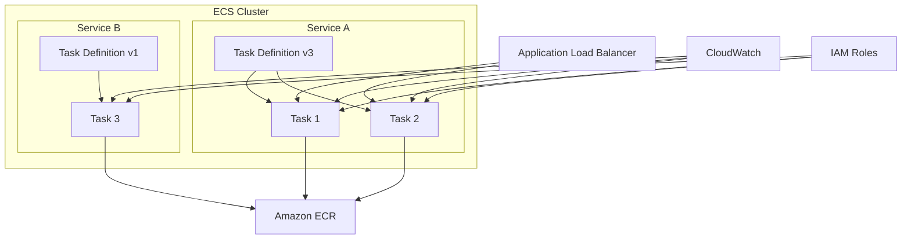
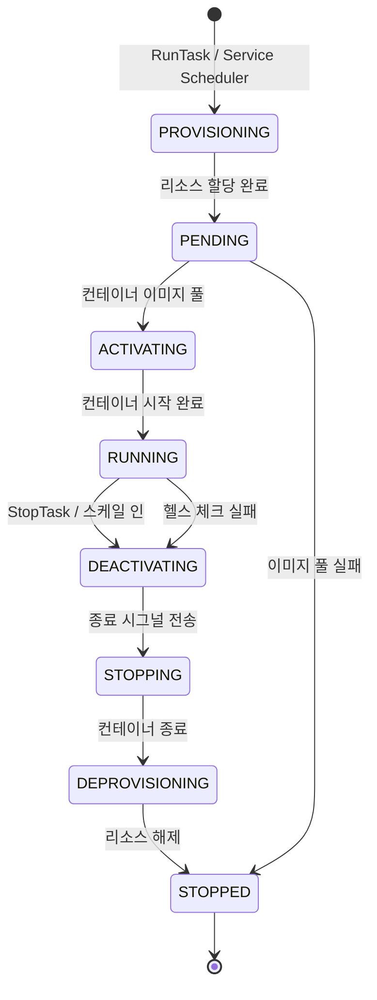
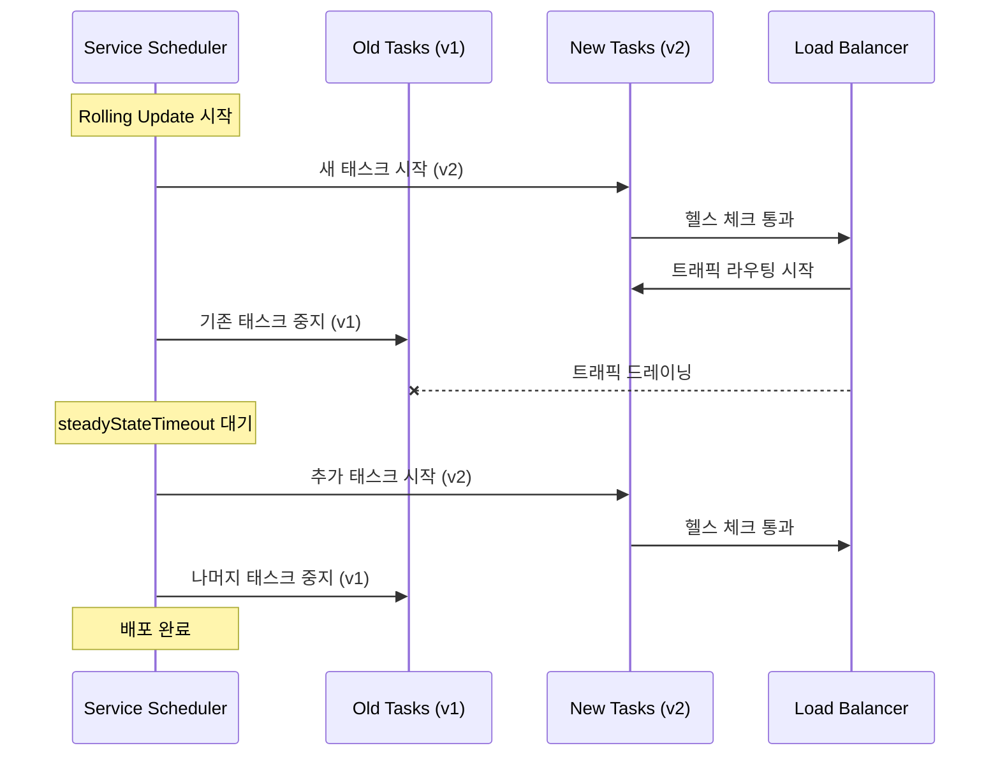

# ECS 핵심 개념

Amazon ECS(Elastic Container Service)는 AWS에서 컨테이너화된 애플리케이션을 실행하고 관리하기 위한 완전 관리형 오케스트레이션 서비스다. 클러스터, 서비스, 태스크의 계층 구조를 이해하면 컨테이너 운영의 핵심을 파악할 수 있다.

## 목차
- [1. 핵심 개념 (What)](#1-핵심-개념-what)
- [2. 왜 알아야 하는가 (Why)](#2-왜-알아야-하는가-why)
- [3. 내부 구현 분석 (How)](#3-내부-구현-분석-how)
- [4. 실전 예제](#4-실전-예제)
- [5. 정리](#5-정리)

---

## 1. 핵심 개념 (What)

### ECS의 핵심 구성 요소

ECS는 4개의 핵심 계층으로 구성된다:

| 구성 요소 | 역할 | 비유 |
|-----------|------|------|
| **Cluster** | 컨테이너 실행 환경의 논리적 그룹 | 데이터센터 |
| **Service** | 태스크의 원하는 상태(desired state)를 유지 | 프로세스 매니저 |
| **Task** | 실제 실행 중인 컨테이너 인스턴스 | 프로세스 |
| **Task Definition** | 컨테이너 실행 설정의 청사진 | Dockerfile + docker-compose.yml |

### 클러스터(Cluster)

클러스터는 ECS의 최상위 리소스로, 서비스와 태스크를 논리적으로 그룹화한다. 하나의 AWS 계정에서 여러 클러스터를 운영할 수 있으며, 환경(dev/staging/prod) 또는 팀 단위로 분리하는 것이 일반적이다.

클러스터 자체에는 비용이 발생하지 않는다. 비용은 클러스터 내에서 실행되는 태스크의 컴퓨팅 리소스에 대해 발생한다.

### 태스크 정의(Task Definition)

태스크 정의는 **변경 불가능한(immutable) 버전 관리 리소스**다. 한 번 등록된 revision은 수정할 수 없으며, 변경이 필요하면 새로운 revision을 등록해야 한다.

태스크 정의에 포함되는 주요 설정:
- **컨테이너 이미지**: ECR 또는 Docker Hub의 이미지 URI
- **CPU/메모리**: 태스크 수준 및 컨테이너 수준 리소스 할당
- **네트워크 모드**: awsvpc, bridge, host, none
- **로그 드라이버**: CloudWatch Logs, Splunk, Fluentd 등
- **IAM 역할**: Task Role(애플리케이션 권한), Execution Role(ECS 에이전트 권한)
- **볼륨**: EFS, Docker 볼륨, Bind Mount
- **환경 변수**: 직접 지정 또는 SSM Parameter Store/Secrets Manager 참조

### 서비스(Service)

서비스는 태스크 정의를 기반으로 **원하는 수의 태스크를 지속적으로 유지**한다. 태스크가 비정상 종료되면 자동으로 새 태스크를 시작한다.

서비스의 핵심 기능:
- **Desired Count 유지**: 항상 지정된 수의 태스크 실행
- **롤링 업데이트**: 새 태스크 정의로 무중단 배포
- **로드 밸런서 통합**: ALB/NLB와 자동 연동
- **Auto Scaling**: 지표 기반 태스크 수 자동 조절
- **배포 회로 차단기(Deployment Circuit Breaker)**: 실패 시 자동 롤백

### Fargate vs EC2 Launch Type

| 항목 | Fargate | EC2 |
|------|---------|-----|
| 인프라 관리 | AWS 관리 (서버리스) | 사용자가 EC2 인스턴스 관리 |
| 가격 모델 | vCPU/메모리 초 단위 과금 | EC2 인스턴스 비용 + ECS 무료 |
| GPU 지원 | 미지원 | 지원 |
| 스케일링 속도 | 빠름 (인스턴스 프로비저닝 불필요) | 느림 (EC2 스케일링 필요) |
| 커스텀 AMI | 불가 | 가능 |
| Spot 지원 | Fargate Spot 지원 | EC2 Spot 인스턴스 지원 |
| 최대 리소스 | 16 vCPU / 120 GB 메모리 | 인스턴스 타입에 따라 다름 |
| 스토리지 | 임시 스토리지 200 GB | 인스턴스 스토리지 + EBS |

### 서비스 디스커버리(Service Discovery)

ECS는 AWS Cloud Map과 통합되어 서비스 디스커버리를 제공한다. 서비스를 DNS 이름으로 등록하면 다른 서비스에서 해당 이름으로 접근할 수 있다.

- **DNS 기반 디스커버리**: Route 53 프라이빗 호스팅 영역에 A/SRV 레코드 자동 등록
- **API 기반 디스커버리**: Cloud Map API를 통한 인스턴스 조회
- **헬스 체크 통합**: 비정상 인스턴스 자동 제거

## 2. 왜 알아야 하는가 (Why)

### 컨테이너 운영의 복잡성 해소

컨테이너를 프로덕션에서 운영하려면 다음 문제를 해결해야 한다:
- 컨테이너 배치(어떤 호스트에 실행할 것인가?)
- 상태 관리(컨테이너가 죽으면 어떻게 복구할 것인가?)
- 네트워크 연결(컨테이너 간 어떻게 통신할 것인가?)
- 리소스 관리(CPU/메모리를 어떻게 분배할 것인가?)
- 배포 전략(어떻게 무중단 업데이트를 할 것인가?)

ECS는 이 모든 것을 AWS 네이티브하게 해결한다. Kubernetes에 비해 학습 곡선이 낮고, AWS 서비스(IAM, CloudWatch, ALB 등)와의 통합이 자연스럽다.

### 올바른 Launch Type 선택이 비용에 직결

Fargate와 EC2의 비용 구조가 근본적으로 다르기 때문에, 워크로드 특성을 이해하고 적절한 Launch Type을 선택하는 것이 운영 비용에 직접적인 영향을 미친다.

- **간헐적/가변적 워크로드**: Fargate가 유리 (사용한 만큼만 과금)
- **안정적/고밀도 워크로드**: EC2가 유리 (인스턴스 리소스를 꽉 채워 사용)
- **배치 작업**: Fargate Spot으로 최대 70% 할인

### Task Definition 설계가 운영 품질을 결정

태스크 정의에서의 리소스 할당, 로깅 설정, IAM 역할 분리, 헬스 체크 설정 등이 서비스의 안정성과 보안성을 직접적으로 결정한다.

## 3. 내부 구현 분석 (How)

### ECS 전체 아키텍처



### 태스크 라이프사이클



### 네트워크 모드별 동작 방식

**awsvpc 모드** (Fargate 필수, EC2 권장):
- 각 태스크에 고유한 ENI(Elastic Network Interface) 할당
- 태스크마다 프라이빗 IP 보유
- Security Group을 태스크 수준에서 적용 가능
- VPC Flow Logs로 태스크별 트래픽 모니터링 가능

```
┌─────────────────────────────────────────┐
│              VPC (10.0.0.0/16)          │
│  ┌───────────────────────────────────┐  │
│  │     Subnet (10.0.1.0/24)         │  │
│  │                                   │  │
│  │  ┌─────────┐   ┌─────────┐       │  │
│  │  │ Task A  │   │ Task B  │       │  │
│  │  │ ENI:    │   │ ENI:    │       │  │
│  │  │ 10.0.1.5│   │ 10.0.1.6│       │  │
│  │  │ SG: A   │   │ SG: B   │       │  │
│  │  └─────────┘   └─────────┘       │  │
│  └───────────────────────────────────┘  │
└─────────────────────────────────────────┘
```

### ECS 에이전트와 컨트롤 플레인

EC2 Launch Type에서 ECS 에이전트는 각 인스턴스에서 실행되며:
1. **컨트롤 플레인과 통신**: 태스크 배치 명령 수신
2. **태스크 상태 보고**: 실행 중인 컨테이너 상태를 주기적으로 보고
3. **이미지 관리**: 컨테이너 이미지 풀 및 캐시 관리
4. **로그 전송**: 컨테이너 로그를 CloudWatch로 전달

Fargate에서는 이 모든 것이 AWS 관리 인프라에서 자동으로 처리된다.

### 서비스 스케줄러 동작

서비스 스케줄러는 두 가지 전략을 사용한다:

**Replica 전략** (기본):
- 지정된 수의 태스크를 AZ에 균등 분배
- `minimumHealthyPercent`와 `maximumPercent`로 배포 중 태스크 수 제어

**Daemon 전략** (EC2 전용):
- 각 컨테이너 인스턴스에 정확히 하나의 태스크 배치
- 모니터링 에이전트, 로그 수집기 등에 적합

### 배포 전략



**Blue/Green 배포** (CodeDeploy 통합):
- 새로운 태스크 세트를 별도로 구성
- ALB 리스너 규칙으로 트래픽 전환
- 즉시 전환 또는 Canary/Linear 방식 선택 가능
- 문제 발생 시 이전 태스크 세트로 즉시 롤백

## 4. 실전 예제

### 예제 1: Fargate 서비스를 위한 Task Definition

```json
{
  "family": "my-web-app",
  "networkMode": "awsvpc",
  "requiresCompatibilities": ["FARGATE"],
  "cpu": "512",
  "memory": "1024",
  "executionRoleArn": "arn:aws:iam::123456789012:role/ecsTaskExecutionRole",
  "taskRoleArn": "arn:aws:iam::123456789012:role/myAppTaskRole",
  "containerDefinitions": [
    {
      "name": "web",
      "image": "123456789012.dkr.ecr.ap-northeast-2.amazonaws.com/my-web-app:latest",
      "essential": true,
      "portMappings": [
        {
          "containerPort": 8080,
          "protocol": "tcp"
        }
      ],
      "healthCheck": {
        "command": ["CMD-SHELL", "curl -f http://localhost:8080/health || exit 1"],
        "interval": 30,
        "timeout": 5,
        "retries": 3,
        "startPeriod": 60
      },
      "logConfiguration": {
        "logDriver": "awslogs",
        "options": {
          "awslogs-group": "/ecs/my-web-app",
          "awslogs-region": "ap-northeast-2",
          "awslogs-stream-prefix": "web"
        }
      },
      "environment": [
        {
          "name": "NODE_ENV",
          "value": "production"
        }
      ],
      "secrets": [
        {
          "name": "DATABASE_URL",
          "valueFrom": "arn:aws:ssm:ap-northeast-2:123456789012:parameter/prod/database-url"
        },
        {
          "name": "API_KEY",
          "valueFrom": "arn:aws:secretsmanager:ap-northeast-2:123456789012:secret:prod/api-key-AbCdEf"
        }
      ],
      "ulimits": [
        {
          "name": "nofile",
          "softLimit": 65536,
          "hardLimit": 65536
        }
      ]
    }
  ]
}
```

### 예제 2: CloudFormation으로 ECS 서비스 + Auto Scaling 구성

```yaml
AWSTemplateFormatVersion: '2010-09-09'
Description: ECS Fargate Service with Auto Scaling

Resources:
  ECSCluster:
    Type: AWS::ECS::Cluster
    Properties:
      ClusterName: my-production-cluster
      ClusterSettings:
        - Name: containerInsights
          Value: enabled
      Configuration:
        ExecuteCommandConfiguration:
          Logging: OVERRIDE
          LogConfiguration:
            CloudWatchLogGroupName: /ecs/exec-logs

  ECSService:
    Type: AWS::ECS::Service
    DependsOn: ALBListener
    Properties:
      Cluster: !Ref ECSCluster
      ServiceName: my-web-service
      TaskDefinition: !Ref TaskDefinition
      DesiredCount: 3
      LaunchType: FARGATE
      DeploymentConfiguration:
        MinimumHealthyPercent: 100
        MaximumPercent: 200
        DeploymentCircuitBreaker:
          Enable: true
          Rollback: true
      NetworkConfiguration:
        AwsvpcConfiguration:
          AssignPublicIp: DISABLED
          SecurityGroups:
            - !Ref ServiceSecurityGroup
          Subnets:
            - !Ref PrivateSubnet1
            - !Ref PrivateSubnet2
      LoadBalancers:
        - ContainerName: web
          ContainerPort: 8080
          TargetGroupArn: !Ref TargetGroup
      ServiceConnectConfiguration:
        Enabled: true
        Namespace: my-app-namespace
        Services:
          - PortName: http
            DiscoveryName: web-service
            ClientAliases:
              - Port: 8080
                DnsName: web.local

  # Auto Scaling 설정
  ScalableTarget:
    Type: AWS::ApplicationAutoScaling::ScalableTarget
    Properties:
      MaxCapacity: 10
      MinCapacity: 2
      ResourceId: !Sub service/${ECSCluster}/${ECSService.Name}
      ScalableDimension: ecs:service:DesiredCount
      ServiceNamespace: ecs
      RoleARN: !GetAtt AutoScalingRole.Arn

  ScalingPolicyCPU:
    Type: AWS::ApplicationAutoScaling::ScalingPolicy
    Properties:
      PolicyName: cpu-target-tracking
      PolicyType: TargetTrackingScaling
      ScalingTargetId: !Ref ScalableTarget
      TargetTrackingScalingPolicyConfiguration:
        PredefinedMetricSpecification:
          PredefinedMetricType: ECSServiceAverageCPUUtilization
        TargetValue: 70.0
        ScaleInCooldown: 300
        ScaleOutCooldown: 60

  ScalingPolicyMemory:
    Type: AWS::ApplicationAutoScaling::ScalingPolicy
    Properties:
      PolicyName: memory-target-tracking
      PolicyType: TargetTrackingScaling
      ScalingTargetId: !Ref ScalableTarget
      TargetTrackingScalingPolicyConfiguration:
        PredefinedMetricSpecification:
          PredefinedMetricType: ECSServiceAverageMemoryUtilization
        TargetValue: 80.0
        ScaleInCooldown: 300
        ScaleOutCooldown: 60
```

### 예제 3: 서비스 디스커버리 설정

```yaml
  # Cloud Map 네임스페이스
  ServiceDiscoveryNamespace:
    Type: AWS::ServiceDiscovery::PrivateDnsNamespace
    Properties:
      Name: my-app.local
      Vpc: !Ref VPC

  # 서비스 디스커버리 서비스
  DiscoveryService:
    Type: AWS::ServiceDiscovery::Service
    Properties:
      Name: api
      NamespaceId: !Ref ServiceDiscoveryNamespace
      DnsConfig:
        DnsRecords:
          - Type: A
            TTL: 10
        RoutingPolicy: MULTIVALUE
      HealthCheckCustomConfig:
        FailureThreshold: 1

  # ECS 서비스에 연결
  APIService:
    Type: AWS::ECS::Service
    Properties:
      Cluster: !Ref ECSCluster
      ServiceName: api-service
      TaskDefinition: !Ref APITaskDefinition
      DesiredCount: 2
      LaunchType: FARGATE
      ServiceRegistries:
        - RegistryArn: !GetAtt DiscoveryService.Arn
      NetworkConfiguration:
        AwsvpcConfiguration:
          Subnets:
            - !Ref PrivateSubnet1
            - !Ref PrivateSubnet2
```

위 설정 후, 다른 서비스에서 `api.my-app.local`로 API 서비스에 접근할 수 있다.

## 5. 정리

### ECS 핵심 구조 요약

| 구성 요소 | 설명 | 핵심 포인트 |
|-----------|------|-------------|
| **Cluster** | 논리적 컨테이너 그룹 | 환경/팀 단위 분리, Container Insights 활성화 |
| **Task Definition** | 컨테이너 실행 청사진 | immutable revision, Task Role vs Execution Role 분리 |
| **Task** | 실행 중인 컨테이너 | awsvpc 모드로 태스크별 ENI/SG 할당 |
| **Service** | desired state 유지 | 배포 회로 차단기, Auto Scaling 연동 |

### Launch Type 선택 가이드

| 시나리오 | 권장 Launch Type | 이유 |
|----------|-----------------|------|
| 웹 API 서버 (가변 트래픽) | Fargate | 인프라 관리 부담 없음, 빠른 스케일링 |
| ML 추론 서비스 (GPU) | EC2 | GPU 인스턴스 필요 |
| 배치 처리 (비용 민감) | Fargate Spot | 최대 70% 비용 절감 |
| 모니터링 에이전트 | EC2 (Daemon) | 모든 인스턴스에 1개씩 배치 |
| 고밀도 마이크로서비스 | EC2 | 인스턴스 리소스 최대 활용 |

### 운영 체크리스트

- [ ] Task Definition에서 Task Role과 Execution Role을 최소 권한으로 분리
- [ ] 컨테이너 헬스 체크의 `startPeriod`를 앱 초기화 시간 이상으로 설정
- [ ] `awsvpc` 네트워크 모드 사용 시 서브넷의 가용 IP 수 확인
- [ ] Container Insights 활성화로 CPU/메모리/네트워크 지표 수집
- [ ] 배포 회로 차단기(Deployment Circuit Breaker) 활성화
- [ ] `stopTimeout`을 graceful shutdown에 충분한 시간으로 설정 (기본 30초)

---
*참고: AWS ECS 최신 버전 기준 (2024)*
