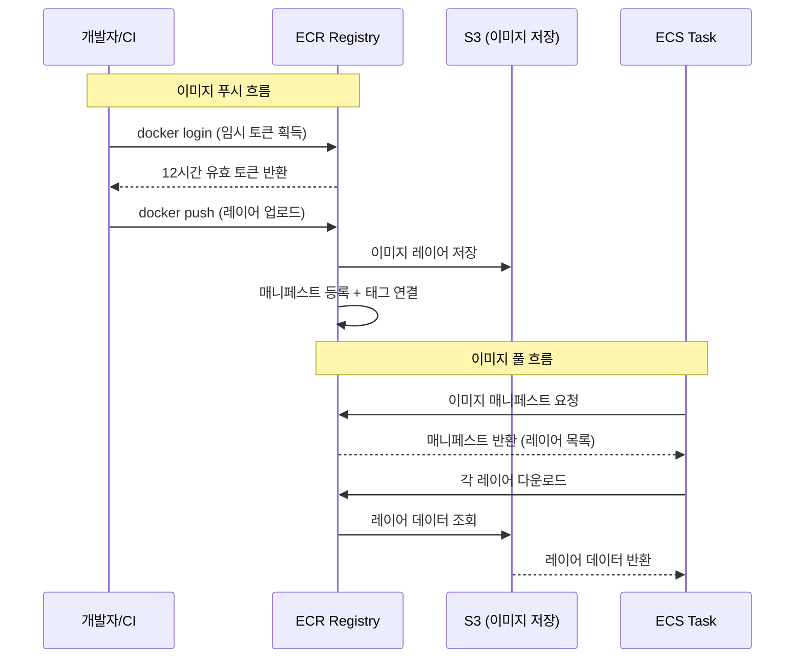
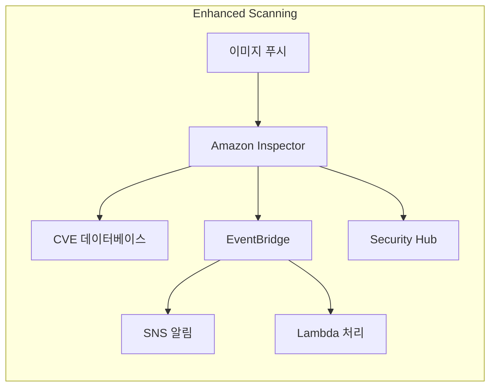
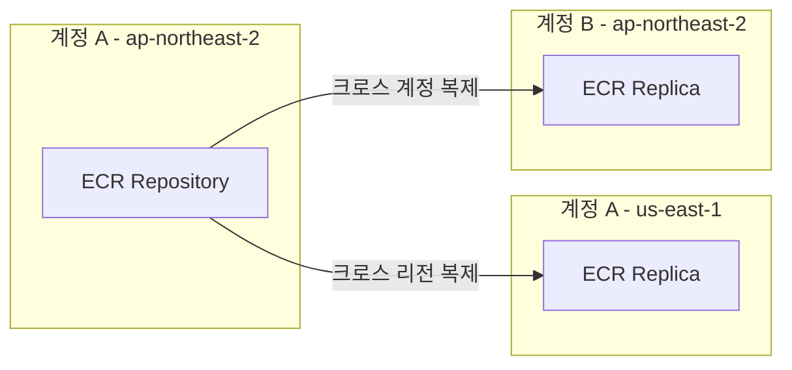

# ECR과 컨테이너 이미지 관리

Amazon ECR(Elastic Container Registry)은 Docker 컨테이너 이미지를 저장, 관리, 배포하기 위한 완전 관리형 레지스트리 서비스다. ECS/EKS와 긴밀하게 통합되어 CI/CD 파이프라인에서 이미지 빌드부터 배포까지의 전체 흐름을 담당한다.

## 목차
- [1. 핵심 개념 (What)](#1-핵심-개념-what)
- [2. 왜 알아야 하는가 (Why)](#2-왜-알아야-하는가-why)
- [3. 내부 구현 분석 (How)](#3-내부-구현-분석-how)
- [4. 실전 예제](#4-실전-예제)
- [5. 정리](#5-정리)

---

## 1. 핵심 개념 (What)

### ECR 레지스트리 구조

ECR은 계층적 구조로 구성된다:

```
AWS 계정 (123456789012)
└── Registry (리전별 1개)
    ├── Repository: my-app/web
    │   ├── Image: sha256:abc123... (태그: v1.0.0, latest)
    │   └── Image: sha256:def456... (태그: v1.1.0)
    ├── Repository: my-app/api
    │   └── Image: sha256:ghi789... (태그: v2.0.0)
    └── Repository: shared/nginx
        └── Image: sha256:jkl012... (태그: 1.25-alpine)
```

| 구성 요소 | 설명 |
|-----------|------|
| **Registry** | AWS 계정 + 리전 조합당 1개. 엔드포인트: `<account-id>.dkr.ecr.<region>.amazonaws.com` |
| **Repository** | 관련 이미지를 그룹화하는 논리 단위. 네임스페이스를 `/`로 구분 가능 |
| **Image** | OCI/Docker 이미지. SHA256 다이제스트로 고유 식별 |
| **Tag** | 이미지의 가변 레이블 (예: `latest`, `v1.0.0`, `abc123f`) |

### Private vs Public ECR

| 항목 | ECR Private | ECR Public (Public Gallery) |
|------|-------------|---------------------------|
| 엔드포인트 | `<account>.dkr.ecr.<region>.amazonaws.com` | `public.ecr.aws/<alias>` |
| 인증 | 필수 (IAM) | 풀은 인증 없이 가능, 푸시는 인증 필요 |
| 비용 | 저장 + 데이터 전송 | 50GB 무료, 이후 과금 |
| 이미지 스캔 | Basic + Enhanced | Basic만 |
| 용도 | 내부 서비스 이미지 | 오픈소스, 공개 배포 |

### 이미지 태깅 전략

이미지 태그는 **가변(mutable)**이다. 같은 태그에 다른 이미지를 덮어쓸 수 있다. 이를 방지하려면 **이미지 태그 불변성(Image Tag Immutability)**을 활성화할 수 있다.

일반적인 태깅 전략:
- **Git SHA 기반**: `abc123f` — 코드와 1:1 매핑, 추적성 우수
- **시맨틱 버전**: `v1.2.3` — 릴리스 관리에 적합
- **브랜치 기반**: `main`, `develop` — 최신 빌드 추적
- **복합**: `v1.2.3-abc123f` — 버전 + Git SHA 조합

## 2. 왜 알아야 하는가 (Why)

### CI/CD의 핵심 연결고리

CI/CD 파이프라인에서 ECR은 빌드 결과물(Docker 이미지)의 저장소이자 배포의 시작점이다. CodeBuild에서 빌드한 이미지가 ECR에 푸시되고, ECS가 ECR에서 이미지를 풀하여 배포한다. ECR이 제대로 구성되지 않으면 파이프라인 전체가 동작하지 않는다.

### 보안과 컴플라이언스

프로덕션 환경에서 컨테이너 이미지의 보안은 필수다:
- **이미지 스캔**: 알려진 취약점(CVE) 자동 감지
- **이미지 서명**: 서명된 이미지만 배포 허용
- **접근 제어**: 리포지토리별 세분화된 IAM 정책
- **암호화**: 저장 시 KMS 암호화 적용

### 비용 최적화

관리하지 않으면 ECR 저장 비용이 불필요하게 증가한다:
- 사용하지 않는 오래된 이미지가 쌓이며 저장 비용 발생
- 라이프사이클 정책으로 자동 정리하지 않으면 수백 GB까지 증가 가능
- 멀티 아키텍처 이미지(arm64 + amd64)는 이미지 수가 2배

## 3. 내부 구현 분석 (How)

### ECR 이미지 풀/푸시 흐름



ECR의 이미지 데이터는 내부적으로 **S3에 저장**된다. ECR API는 Docker Registry HTTP API V2를 구현하여 표준 Docker 클라이언트와 호환된다.

### 이미지 레이어 캐싱

ECR은 **content-addressable storage** 방식을 사용한다. 동일한 레이어(같은 SHA256 다이제스트)는 리포지토리 간에도 한 번만 저장된다.

```
Repository: my-app/web
  Image v1: [base-layer] [deps-layer] [app-layer-v1]
  Image v2: [base-layer] [deps-layer] [app-layer-v2]
                ↑ 공유        ↑ 공유

Repository: my-app/api  
  Image v1: [base-layer] [api-deps-layer] [api-layer-v1]
                ↑ 동일 레이어면 저장 공유
```

### 라이프사이클 정책 평가 로직

라이프사이클 정책은 **규칙 우선순위(rulePriority)** 순서대로 평가된다. 각 규칙은 독립적으로 만료 대상 이미지를 식별하고, 모든 규칙의 결과를 합쳐 삭제한다.

```
정책 평가 흐름:
1. 규칙 우선순위 순으로 정렬
2. 각 규칙의 필터 조건(태그 패턴, 수, 기간)으로 이미지 필터링
3. 조건에 매칭되는 이미지를 "만료 대상"으로 마킹
4. 더 높은 우선순위 규칙에서 유지하기로 한 이미지는 제외
5. 모든 규칙 평가 후 만료 대상 이미지 일괄 삭제
```

### 이미지 스캔 아키텍처

**Basic Scanning**:
- Clair 오픈소스 기반
- 푸시 시 자동 스캔 또는 수동 스캔
- OS 패키지 취약점만 감지

**Enhanced Scanning** (Amazon Inspector 통합):
- 지속적 스캐닝 (새로운 CVE 발견 시 재평가)
- OS 패키지 + 프로그래밍 언어 패키지(npm, pip, maven 등) 취약점 감지
- EventBridge로 스캔 결과 알림 가능



### 크로스 리전 / 크로스 계정 복제

ECR은 **복제 규칙(Replication Rules)**을 지원한다:



- **크로스 리전**: 재해 복구(DR) 및 멀티 리전 배포에 활용
- **크로스 계정**: 중앙 빌드 계정에서 각 환경 계정으로 이미지 배포
- 복제는 **비동기적**으로 수행되며 필터(리포지토리 접두사)로 대상 제한 가능
- 복제된 이미지는 독립적으로 관리됨 (원본 삭제 시 복제본 유지)

## 4. 실전 예제

### 예제 1: Docker 이미지 빌드, 태깅, 푸시

```bash
#!/bin/bash
# ECR 로그인 → 빌드 → 태깅 → 푸시 전체 흐름

ACCOUNT_ID="123456789012"
REGION="ap-northeast-2"
REPO_NAME="my-app/web"
GIT_SHA=$(git rev-parse --short HEAD)
VERSION="1.2.0"

ECR_URI="${ACCOUNT_ID}.dkr.ecr.${REGION}.amazonaws.com/${REPO_NAME}"

# 1. ECR 로그인 (토큰 12시간 유효)
aws ecr get-login-password --region ${REGION} | \
  docker login --username AWS --password-stdin ${ACCOUNT_ID}.dkr.ecr.${REGION}.amazonaws.com

# 2. 멀티 스테이지 빌드
docker build \
  --build-arg BUILD_DATE=$(date -u +'%Y-%m-%dT%H:%M:%SZ') \
  --build-arg GIT_SHA=${GIT_SHA} \
  --cache-from ${ECR_URI}:latest \
  -t ${ECR_URI}:${GIT_SHA} \
  -t ${ECR_URI}:v${VERSION} \
  -t ${ECR_URI}:latest \
  .

# 3. 푸시 (모든 태그)
docker push ${ECR_URI} --all-tags

# 4. 이미지 다이제스트 확인
aws ecr describe-images \
  --repository-name ${REPO_NAME} \
  --image-ids imageTag=${GIT_SHA} \
  --query 'imageDetails[0].imageDigest' \
  --output text
```

### 예제 2: 라이프사이클 정책 설정

```json
{
  "rules": [
    {
      "rulePriority": 1,
      "description": "프로덕션 태그 이미지는 최근 30개 유지",
      "selection": {
        "tagStatus": "tagged",
        "tagPrefixList": ["v"],
        "countType": "imageCountMoreThan",
        "countNumber": 30
      },
      "action": {
        "type": "expire"
      }
    },
    {
      "rulePriority": 2,
      "description": "개발 브랜치 이미지는 14일 후 삭제",
      "selection": {
        "tagStatus": "tagged",
        "tagPrefixList": ["dev-", "feature-"],
        "countType": "sinceImagePushed",
        "countUnit": "days",
        "countNumber": 14
      },
      "action": {
        "type": "expire"
      }
    },
    {
      "rulePriority": 10,
      "description": "태그 없는 이미지는 1일 후 삭제",
      "selection": {
        "tagStatus": "untagged",
        "countType": "sinceImagePushed",
        "countUnit": "days",
        "countNumber": 1
      },
      "action": {
        "type": "expire"
      }
    }
  ]
}
```

```bash
# 라이프사이클 정책 적용
aws ecr put-lifecycle-policy \
  --repository-name my-app/web \
  --lifecycle-policy-text file://lifecycle-policy.json

# 적용된 정책 확인 (dry-run으로 삭제 대상 미리보기)
aws ecr get-lifecycle-policy-preview \
  --repository-name my-app/web
```

### 예제 3: CloudFormation으로 ECR 리포지토리 + 크로스 계정 접근

```yaml
AWSTemplateFormatVersion: '2010-09-09'
Description: ECR Repository with lifecycle policy and cross-account access

Parameters:
  SharedAccountId:
    Type: String
    Description: CI/CD 계정 ID (이미지 푸시 허용)
  ProductionAccountId:
    Type: String
    Description: 프로덕션 계정 ID (이미지 풀 허용)

Resources:
  WebAppRepository:
    Type: AWS::ECR::Repository
    Properties:
      RepositoryName: my-app/web
      ImageTagMutability: IMMUTABLE
      ImageScanningConfiguration:
        ScanOnPush: true
      EncryptionConfiguration:
        EncryptionType: KMS
        KmsKey: !Ref ECRKmsKey
      LifecyclePolicy:
        LifecyclePolicyText: |
          {
            "rules": [
              {
                "rulePriority": 1,
                "description": "Keep last 20 release images",
                "selection": {
                  "tagStatus": "tagged",
                  "tagPrefixList": ["v"],
                  "countType": "imageCountMoreThan",
                  "countNumber": 20
                },
                "action": { "type": "expire" }
              },
              {
                "rulePriority": 100,
                "description": "Remove untagged after 1 day",
                "selection": {
                  "tagStatus": "untagged",
                  "countType": "sinceImagePushed",
                  "countUnit": "days",
                  "countNumber": 1
                },
                "action": { "type": "expire" }
              }
            ]
          }
      RepositoryPolicyText:
        Version: '2012-10-17'
        Statement:
          # CI/CD 계정에서 이미지 푸시 허용
          - Sid: AllowPushFromCI
            Effect: Allow
            Principal:
              AWS: !Sub arn:aws:iam::${SharedAccountId}:root
            Action:
              - ecr:GetDownloadUrlForLayer
              - ecr:BatchGetImage
              - ecr:BatchCheckLayerAvailability
              - ecr:PutImage
              - ecr:InitiateLayerUpload
              - ecr:UploadLayerPart
              - ecr:CompleteLayerUpload
          # 프로덕션 계정에서 이미지 풀만 허용
          - Sid: AllowPullFromProd
            Effect: Allow
            Principal:
              AWS: !Sub arn:aws:iam::${ProductionAccountId}:root
            Action:
              - ecr:GetDownloadUrlForLayer
              - ecr:BatchGetImage
              - ecr:BatchCheckLayerAvailability

  # 크로스 리전 복제 설정
  ReplicationConfiguration:
    Type: AWS::ECR::ReplicationConfiguration
    Properties:
      ReplicationConfiguration:
        Rules:
          - Destinations:
              - Region: us-east-1
                RegistryId: !Ref AWS::AccountId
            RepositoryFilters:
              - Filter: my-app/
                FilterType: PREFIX_MATCH

  ECRKmsKey:
    Type: AWS::KMS::Key
    Properties:
      Description: KMS key for ECR encryption
      KeyPolicy:
        Version: '2012-10-17'
        Statement:
          - Sid: Enable IAM User Permissions
            Effect: Allow
            Principal:
              AWS: !Sub arn:aws:iam::${AWS::AccountId}:root
            Action: kms:*
            Resource: '*'
```

### 예제 4: CodeBuild buildspec에서 ECR 이미지 빌드/푸시

```yaml
version: 0.2

env:
  variables:
    ECR_REPO_NAME: "my-app/web"
    DOCKER_BUILDKIT: "1"

phases:
  pre_build:
    commands:
      - echo "Logging in to Amazon ECR..."
      - ECR_URI="${AWS_ACCOUNT_ID}.dkr.ecr.${AWS_DEFAULT_REGION}.amazonaws.com/${ECR_REPO_NAME}"
      - aws ecr get-login-password --region $AWS_DEFAULT_REGION | docker login --username AWS --password-stdin ${AWS_ACCOUNT_ID}.dkr.ecr.${AWS_DEFAULT_REGION}.amazonaws.com
      - COMMIT_HASH=$(echo $CODEBUILD_RESOLVED_SOURCE_VERSION | cut -c 1-7)
      - IMAGE_TAG=${COMMIT_HASH:-latest}

  build:
    commands:
      - echo "Building Docker image..."
      - docker build --cache-from ${ECR_URI}:latest -t ${ECR_URI}:${IMAGE_TAG} -t ${ECR_URI}:latest .

  post_build:
    commands:
      - echo "Pushing Docker image..."
      - docker push ${ECR_URI}:${IMAGE_TAG}
      - docker push ${ECR_URI}:latest
      - echo "Writing image definitions file..."
      - printf '[{"name":"web","imageUri":"%s"}]' ${ECR_URI}:${IMAGE_TAG} > imagedefinitions.json

artifacts:
  files:
    - imagedefinitions.json
```

## 5. 정리

### ECR 핵심 기능 요약

| 기능 | 설명 | 실무 포인트 |
|------|------|-------------|
| **레지스트리** | 계정/리전별 자동 생성 | `aws ecr get-login-password`로 인증 (12시간 유효) |
| **태그 불변성** | 같은 태그로 덮어쓰기 방지 | 프로덕션 리포지토리에 반드시 활성화 |
| **라이프사이클 정책** | 오래된 이미지 자동 삭제 | 태그 패턴별 보존 기간/개수 차등 설정 |
| **이미지 스캔** | CVE 취약점 자동 감지 | Enhanced Scanning + EventBridge로 알림 자동화 |
| **복제** | 크로스 리전/계정 복제 | DR 및 멀티 계정 배포 전략에 필수 |
| **암호화** | KMS 기반 저장 암호화 | 커스텀 KMS 키로 세분화된 접근 제어 가능 |

### ECR 태깅 전략 비교

| 전략 | 예시 | 장점 | 단점 |
|------|------|------|------|
| Git SHA | `abc123f` | 코드-이미지 추적성 우수 | 사람이 읽기 어려움 |
| 시맨틱 버전 | `v1.2.3` | 릴리스 관리 용이 | 수동 버전 관리 필요 |
| 타임스탬프 | `20240115-143022` | 빌드 시점 파악 용이 | 코드 연관 없음 |
| 복합 | `v1.2.3-abc123f` | 최고의 추적성 | 태그가 길어짐 |

### 운영 체크리스트

- [ ] 프로덕션 리포지토리에 Image Tag Immutability 활성화
- [ ] 라이프사이클 정책으로 불필요한 이미지 자동 정리
- [ ] ScanOnPush 활성화 (Enhanced Scanning 권장)
- [ ] 크로스 계정 접근 시 리포지토리 정책으로 최소 권한 부여
- [ ] KMS 암호화 활성화
- [ ] ECR 풀 캐시 규칙(Pull Through Cache)으로 외부 이미지 관리

---
*참고: AWS ECR 최신 버전 기준 (2024)*
