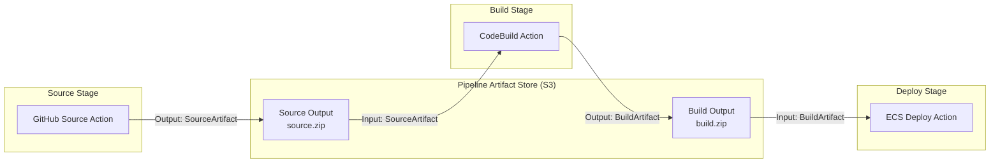
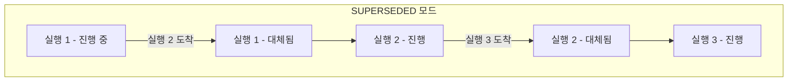
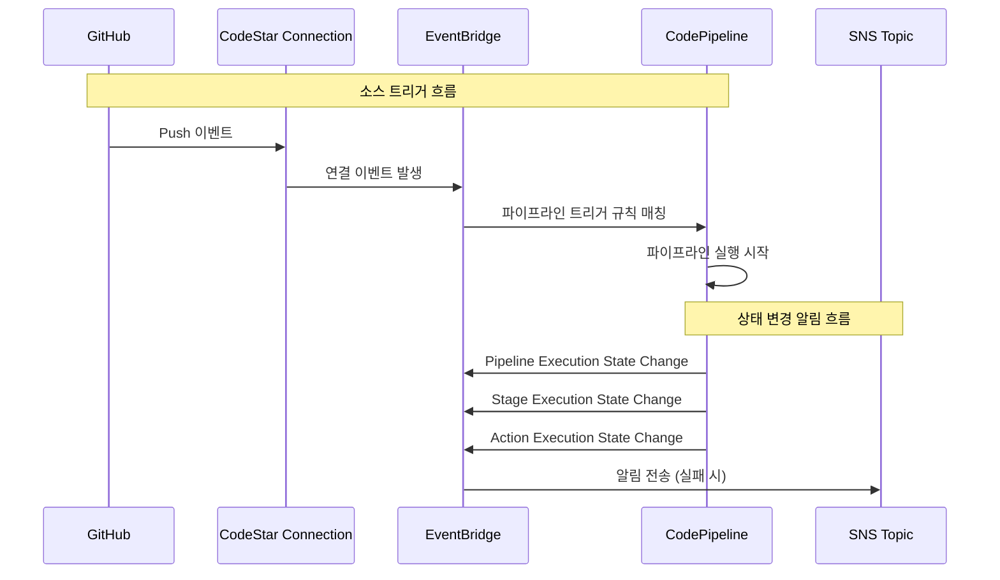

# CodePipeline 내부 동작

AWS CodePipeline은 소스 코드 변경부터 프로덕션 배포까지의 릴리스 프로세스를 자동화하는 완전 관리형 CI/CD 서비스다. 내부적으로 S3 기반 아티팩트 전달, EventBridge 이벤트 트리거, 다양한 실행 모드를 통해 파이프라인의 안정적인 동작을 보장한다.

## 목차
- [1. 핵심 개념 (What)](#1-핵심-개념-what)
- [2. 왜 알아야 하는가 (Why)](#2-왜-알아야-하는가-why)
- [3. 내부 구현 분석 (How)](#3-내부-구현-분석-how)
- [4. 실전 예제](#4-실전-예제)
- [5. 정리](#5-정리)

---

## 1. 핵심 개념 (What)

### CodePipeline의 구성 요소

| 구성 요소 | 설명 |
|-----------|------|
| **Pipeline** | 릴리스 프로세스의 전체 워크플로 |
| **Stage** | 파이프라인 내의 논리적 단계 (Source, Build, Deploy 등) |
| **Action** | 스테이지 내에서 실행되는 개별 작업 |
| **Artifact** | 스테이지 간 전달되는 데이터 (소스 코드, 빌드 결과물 등) |
| **Transition** | 스테이지 간 연결 (활성화/비활성화 가능) |

### 파이프라인 타입: V1 vs V2

CodePipeline은 2023년에 **V2 타입**을 도입했다:

| 항목 | V1 (Legacy) | V2 (현재 기본) |
|------|-------------|---------------|
| 실행 모드 | SUPERSEDED만 | QUEUED, PARALLEL, SUPERSEDED |
| 트리거 | 소스 변경 자동 감지 | 트리거 필터 (브랜치, 파일 경로, 태그) |
| 변수 | 제한적 | 파이프라인 수준 변수 지원 |
| Git 태그 트리거 | 불가 | 가능 |
| 가격 | 파이프라인당 월 $1 | 실행 시간 기반 과금 |

### 소스 변경 감지 방식

CodePipeline이 소스 코드 변경을 감지하는 세 가지 방식:

| 방식 | 동작 | 지원 소스 |
|------|------|----------|
| **CodeStar Connections** | 웹훅 기반, OAuth 앱으로 리포지토리 연결 | GitHub, Bitbucket, GitLab |
| **웹훅(Webhook)** | 소스 프로바이더가 CodePipeline으로 HTTP 호출 | GitHub (V1) |
| **폴링(Polling)** | 주기적으로 소스 변경 확인 | S3, CodeCommit(레거시) |
| **EventBridge** | 이벤트 규칙으로 트리거 | CodeCommit, ECR, S3 |

> CodeStar Connections이 GitHub/Bitbucket/GitLab의 현재 권장 방식이다.

### 아티팩트(Artifact)

아티팩트는 **스테이지 간 데이터를 전달하는 메커니즘**이다. 모든 아티팩트는 파이프라인 생성 시 지정된 **S3 버킷에 암호화되어 저장**된다.

- **Input Artifact**: 액션이 처리할 입력 데이터
- **Output Artifact**: 액션이 생성한 결과 데이터
- 각 액션은 0~5개의 입력, 0~5개의 출력 아티팩트를 가질 수 있다

## 2. 왜 알아야 하는가 (Why)

### 실행 모드 선택이 배포 전략을 결정

실행 모드(QUEUED, SUPERSEDED, PARALLEL)에 따라 동시 배포 동작이 완전히 달라진다. 잘못 선택하면 의도치 않은 배포 순서 역전이나 불필요한 실행 취소가 발생한다.

### 아티팩트 흐름 이해가 디버깅의 핵심

파이프라인 실패 시 대부분의 문제는 아티팩트 관련이다:
- 아티팩트를 찾을 수 없음 (이름 불일치)
- 아티팩트 형식 불일치 (JSON 파싱 에러)
- S3 버킷 권한 문제
- KMS 키 접근 권한 부재

아티팩트가 S3를 통해 전달되는 내부 구조를 이해하면 이런 문제를 빠르게 진단할 수 있다.

### 트리거 메커니즘 이해가 불필요한 실행을 방지

소스 변경 감지 방식을 제대로 이해하지 않으면:
- README 변경에도 전체 파이프라인이 실행됨
- 특정 브랜치 변경만 트리거해야 하는데 모든 브랜치에 반응함
- 태그 기반 릴리스를 자동화하지 못함

V2의 트리거 필터를 활용하면 이런 문제를 해결할 수 있다.

## 3. 내부 구현 분석 (How)

### 아티팩트 저장/전달 메커니즘



아티팩트의 내부 흐름:

1. **Source Action**: 소스 코드를 ZIP으로 압축하여 S3에 업로드
2. **Build Action**: S3에서 소스 ZIP 다운로드 → 빌드 → 결과물 ZIP으로 S3에 업로드
3. **Deploy Action**: S3에서 빌드 결과물 다운로드 → 배포 실행

S3 아티팩트 경로 구조:
```
s3://codepipeline-{region}-{random}/
└── {pipeline-name}/
    ├── SourceArti/   ← Source output artifact
    │   └── {execution-id}.zip
    ├── BuildArtif/   ← Build output artifact
    │   └── {execution-id}.zip
    └── ...
```

모든 아티팩트는 **AWS 관리형 KMS 키(aws/s3)** 또는 **고객 관리형 KMS 키**로 암호화된다. 크로스 계정 파이프라인에서는 고객 관리형 키를 사용해야 다른 계정에서 복호화할 수 있다.

### 파이프라인 실행 모드



**SUPERSEDED (V1 기본, V2 지원)**:
- 한 스테이지에서 한 번에 하나의 실행만 진행
- 새로운 실행이 도착하면 대기 중인 이전 실행을 **대체(supersede)**
- 가장 최신 변경만 배포됨을 보장
- **주의**: 중간 커밋이 스킵될 수 있음

**QUEUED (V2 전용)**:
- 실행이 대기열에 순서대로 추가됨
- 한 번에 하나씩 순서대로 처리
- 모든 커밋이 빠짐없이 배포됨을 보장
- 감사(audit) 요구사항이 있는 환경에 적합

```
QUEUED 실행 흐름:
실행 1: [Source] → [Build] → [Deploy] ✓
실행 2:                       대기 → [Source] → [Build] → [Deploy] ✓
실행 3:                                                    대기 → [Source] → ...
```

**PARALLEL (V2 전용)**:
- 여러 실행이 동시에 독립적으로 진행
- 스테이지 대기 없음
- 실행 간 순서 보장 없음
- 독립적인 기능 브랜치 배포에 적합

```
PARALLEL 실행 흐름:
실행 1: [Source] → [Build] → [Deploy]
실행 2: [Source] → [Build] → [Deploy]    ← 동시 진행
실행 3: [Source] → [Build] → [Deploy]    ← 동시 진행
```

### EventBridge 이벤트 트리거 흐름

CodePipeline은 EventBridge와 양방향으로 통합된다:



EventBridge가 수신하는 CodePipeline 이벤트 유형:

| 이벤트 | 상태 값 | 용도 |
|--------|---------|------|
| Pipeline Execution | STARTED, SUCCEEDED, FAILED, CANCELED, SUPERSEDED | 파이프라인 전체 추적 |
| Stage Execution | STARTED, SUCCEEDED, FAILED, CANCELED | 스테이지별 모니터링 |
| Action Execution | STARTED, SUCCEEDED, FAILED, ABANDONED | 개별 액션 디버깅 |

### 소스 변경 감지 상세

**CodeStar Connections (GitHub/Bitbucket/GitLab)**:

```
1. 사용자가 CodeStar Connection 생성 + OAuth 인증
2. GitHub에 AWS Connector 앱 설치
3. 코드 푸시 발생
4. GitHub → CodeStar Connection → EventBridge 규칙
5. EventBridge → CodePipeline StartPipelineExecution
```

V2에서는 **트리거 필터**로 세밀한 제어가 가능하다:

```json
{
  "triggers": [
    {
      "providerType": "CodeStarSourceConnection",
      "gitConfiguration": {
        "sourceActionName": "Source",
        "push": [
          {
            "branches": {
              "includes": ["main", "release/*"],
              "excludes": ["release/legacy-*"]
            },
            "filePaths": {
              "includes": ["src/**", "Dockerfile"],
              "excludes": ["docs/**", "*.md"]
            }
          }
        ],
        "pullRequest": [
          {
            "events": ["OPEN", "UPDATED"],
            "branches": {
              "includes": ["main"]
            }
          }
        ]
      }
    }
  ]
}
```

### 파이프라인 변수 시스템

V2에서 도입된 파이프라인 변수로 스테이지 간 데이터를 공유할 수 있다:

```
변수 해결 순서:
1. 파이프라인 수준 변수 (선언 시 기본값)
2. 트리거 변수 (실행 시 오버라이드)
3. 액션 출력 변수 (#{action_namespace.variable_name})
4. 시스템 변수 (#{codepipeline.PipelineExecutionId})
```

예약된 시스템 변수:
- `#{codepipeline.PipelineExecutionId}` — 실행 ID
- `#{SourceVariables.CommitId}` — 소스 커밋 해시
- `#{SourceVariables.CommitMessage}` — 커밋 메시지
- `#{SourceVariables.BranchName}` — 브랜치 이름
- `#{BuildVariables.CODEBUILD_BUILD_ID}` — CodeBuild 빌드 ID

## 4. 실전 예제

### 예제 1: V2 파이프라인 - GitHub → CodeBuild → ECS 배포

```yaml
AWSTemplateFormatVersion: '2010-09-09'
Description: CodePipeline V2 - GitHub to ECS with trigger filters

Parameters:
  GitHubConnectionArn:
    Type: String
    Description: CodeStar Connection ARN for GitHub
  GitHubOwner:
    Type: String
  GitHubRepo:
    Type: String
  ECSClusterName:
    Type: String
  ECSServiceName:
    Type: String

Resources:
  ArtifactBucket:
    Type: AWS::S3::Bucket
    Properties:
      BucketName: !Sub codepipeline-artifacts-${AWS::AccountId}
      BucketEncryption:
        ServerSideEncryptionConfiguration:
          - ServerSideEncryptionByDefault:
              SSEAlgorithm: aws:kms
              KMSMasterKeyID: !Ref PipelineKmsKey
      LifecycleConfiguration:
        Rules:
          - Id: CleanupOldArtifacts
            Status: Enabled
            ExpirationInDays: 30
      PublicAccessBlockConfiguration:
        BlockPublicAcls: true
        BlockPublicPolicy: true
        IgnorePublicAcls: true
        RestrictPublicBuckets: true

  Pipeline:
    Type: AWS::CodePipeline::Pipeline
    Properties:
      Name: my-app-pipeline
      PipelineType: V2
      ExecutionMode: QUEUED
      RoleArn: !GetAtt PipelineRole.Arn
      ArtifactStore:
        Type: S3
        Location: !Ref ArtifactBucket
        EncryptionKey:
          Id: !Ref PipelineKmsKey
          Type: KMS
      
      # V2 트리거 필터
      Triggers:
        - ProviderType: CodeStarSourceConnection
          GitConfiguration:
            SourceActionName: GitHubSource
            Push:
              - Branches:
                  Includes:
                    - main
                FilePaths:
                  Includes:
                    - src/**
                    - Dockerfile
                    - buildspec.yml
                  Excludes:
                    - docs/**
                    - "*.md"
                    - .gitignore
            Tags:
              Includes:
                - "v*"

      # 파이프라인 변수
      Variables:
        - Name: DEPLOY_ENV
          DefaultValue: production
          Description: Deployment environment

      Stages:
        # Source Stage
        - Name: Source
          Actions:
            - Name: GitHubSource
              ActionTypeId:
                Category: Source
                Owner: AWS
                Provider: CodeStarSourceConnection
                Version: '1'
              Configuration:
                ConnectionArn: !Ref GitHubConnectionArn
                FullRepositoryId: !Sub ${GitHubOwner}/${GitHubRepo}
                BranchName: main
                OutputArtifactFormat: CODE_ZIP
                DetectChanges: false  # V2에서는 Triggers로 제어
              OutputArtifacts:
                - Name: SourceOutput
              Namespace: SourceVariables

        # Build Stage
        - Name: Build
          Actions:
            - Name: DockerBuild
              ActionTypeId:
                Category: Build
                Owner: AWS
                Provider: CodeBuild
                Version: '1'
              Configuration:
                ProjectName: !Ref CodeBuildProject
                EnvironmentVariables: !Sub |
                  [
                    {"name":"DEPLOY_ENV","value":"#{variables.DEPLOY_ENV}","type":"PLAINTEXT"},
                    {"name":"COMMIT_ID","value":"#{SourceVariables.CommitId}","type":"PLAINTEXT"}
                  ]
              InputArtifacts:
                - Name: SourceOutput
              OutputArtifacts:
                - Name: BuildOutput
              Namespace: BuildVariables

        # Approval Stage (선택)
        - Name: Approval
          Actions:
            - Name: ManualApproval
              ActionTypeId:
                Category: Approval
                Owner: AWS
                Provider: Manual
                Version: '1'
              Configuration:
                NotificationArn: !Ref ApprovalSNSTopic
                CustomData: !Sub |
                  Commit: #{SourceVariables.CommitId}
                  Message: #{SourceVariables.CommitMessage}

        # Deploy Stage
        - Name: Deploy
          Actions:
            - Name: ECSDeployAction
              ActionTypeId:
                Category: Deploy
                Owner: AWS
                Provider: ECS
                Version: '1'
              Configuration:
                ClusterName: !Ref ECSClusterName
                ServiceName: !Ref ECSServiceName
                FileName: imagedefinitions.json
              InputArtifacts:
                - Name: BuildOutput
```

### 예제 2: EventBridge 알림 - 파이프라인 실패 시 Slack 알림

```yaml
  # 파이프라인 실패 감지 규칙
  PipelineFailureRule:
    Type: AWS::Events::Rule
    Properties:
      Name: pipeline-failure-alert
      Description: CodePipeline 실패 시 알림
      EventPattern:
        source:
          - aws.codepipeline
        detail-type:
          - "CodePipeline Pipeline Execution State Change"
        detail:
          state:
            - FAILED
          pipeline:
            - !Ref Pipeline
      State: ENABLED
      Targets:
        - Arn: !Ref AlertSNSTopic
          Id: sns-target
          InputTransformer:
            InputPathsMap:
              pipeline: "$.detail.pipeline"
              state: "$.detail.state"
              executionId: "$.detail.execution-id"
              time: "$.time"
            InputTemplate: |
              "파이프라인 실패 알림"
              "Pipeline: <pipeline>"
              "Status: <state>"
              "Execution ID: <executionId>"
              "Time: <time>"
              "콘솔 링크: https://console.aws.amazon.com/codesuite/codepipeline/pipelines/<pipeline>/executions/<executionId>"

  # 스테이지별 상태 변경 로깅
  StageStateChangeRule:
    Type: AWS::Events::Rule
    Properties:
      Name: pipeline-stage-tracking
      EventPattern:
        source:
          - aws.codepipeline
        detail-type:
          - "CodePipeline Stage Execution State Change"
        detail:
          pipeline:
            - !Ref Pipeline
      Targets:
        - Arn: !GetAtt StageTrackingLambda.Arn
          Id: lambda-target
```

### 예제 3: 크로스 계정 파이프라인 구성

```
아키텍처:
┌─────────────────────┐    ┌─────────────────────┐    ┌─────────────────────┐
│   Tools Account     │    │   Staging Account   │    │   Prod Account      │
│   (111111111111)    │    │   (222222222222)     │    │   (333333333333)    │
│                     │    │                      │    │                     │
│  ┌───────────────┐  │    │  ┌────────────────┐  │    │  ┌───────────────┐  │
│  │ CodePipeline  │──┼────┼──│ ECS Staging    │  │    │  │ ECS Prod      │  │
│  │ CodeBuild     │  │    │  │ Service        │  │    │  │ Service       │  │
│  │ S3 Artifacts  │──┼────┼──┼────────────────┼──┼────┼──│               │  │
│  │ KMS Key       │  │    │  └────────────────┘  │    │  └───────────────┘  │
│  └───────────────┘  │    │                      │    │                     │
└─────────────────────┘    └──────────────────────┘    └─────────────────────┘
```

크로스 계정에서 핵심은 **KMS 키 공유**와 **IAM 역할 위임**이다:

```yaml
  # Tools 계정의 KMS 키 정책 - 다른 계정에서 복호화 허용
  PipelineKmsKey:
    Type: AWS::KMS::Key
    Properties:
      KeyPolicy:
        Version: '2012-10-17'
        Statement:
          - Sid: AllowToolsAccount
            Effect: Allow
            Principal:
              AWS: !Sub arn:aws:iam::${AWS::AccountId}:root
            Action: kms:*
            Resource: '*'
          - Sid: AllowStagingAccount
            Effect: Allow
            Principal:
              AWS: arn:aws:iam::222222222222:root
            Action:
              - kms:Decrypt
              - kms:DescribeKey
            Resource: '*'
          - Sid: AllowProdAccount
            Effect: Allow
            Principal:
              AWS: arn:aws:iam::333333333333:root
            Action:
              - kms:Decrypt
              - kms:DescribeKey
            Resource: '*'
```

## 5. 정리

### 실행 모드 비교

| 모드 | 동시 실행 | 순서 보장 | 스킵 여부 | 적합한 시나리오 |
|------|----------|----------|----------|----------------|
| **SUPERSEDED** | 1개 | 최신만 보장 | 중간 실행 스킵 | 항상 최신 코드만 배포 |
| **QUEUED** | 1개 | 완전 보장 | 스킵 없음 | 감사 요구사항, 순차 배포 |
| **PARALLEL** | 다수 | 보장 안함 | 스킵 없음 | 독립적 브랜치, 병렬 테스트 |

### 소스 감지 방식 비교

| 방식 | 지연 시간 | 필터링 | 권장 소스 |
|------|----------|--------|----------|
| **CodeStar Connections** | ~수초 | 브랜치/파일/태그 (V2) | GitHub, Bitbucket, GitLab |
| **EventBridge** | ~수초 | EventBridge 패턴 | CodeCommit, ECR, S3 |
| **웹훅** | ~수초 | 제한적 | GitHub (V1 레거시) |
| **폴링** | ~1분 | 없음 | S3 (레거시) |

### 핵심 디버깅 포인트

| 증상 | 확인 사항 |
|------|----------|
| 아티팩트 못 찾음 | Output/Input Artifact 이름 일치 확인 |
| 크로스 계정 실패 | KMS 키 정책 + S3 버킷 정책 + IAM AssumeRole |
| 파이프라인 트리거 안됨 | CodeStar Connection 상태 AVAILABLE 확인, 트리거 필터 확인 |
| 이전 실행이 스킵됨 | 실행 모드가 SUPERSEDED인지 확인, QUEUED로 변경 고려 |
| 배포 후 이전 버전 실행 | PARALLEL 모드에서 순서 역전 가능, QUEUED 모드 권장 |

---
*참고: AWS CodePipeline V2 최신 버전 기준 (2024)*
