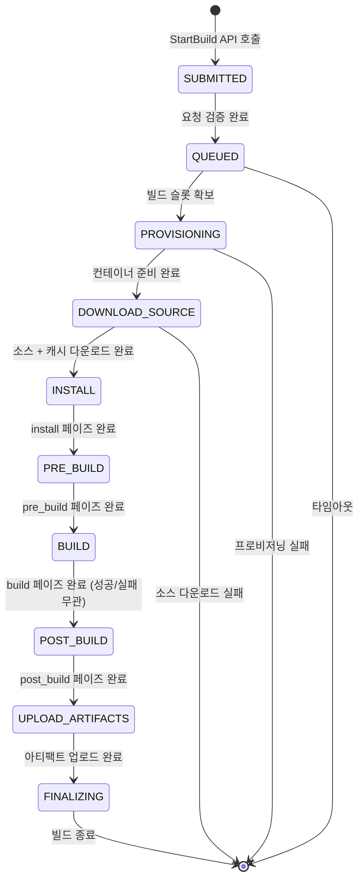
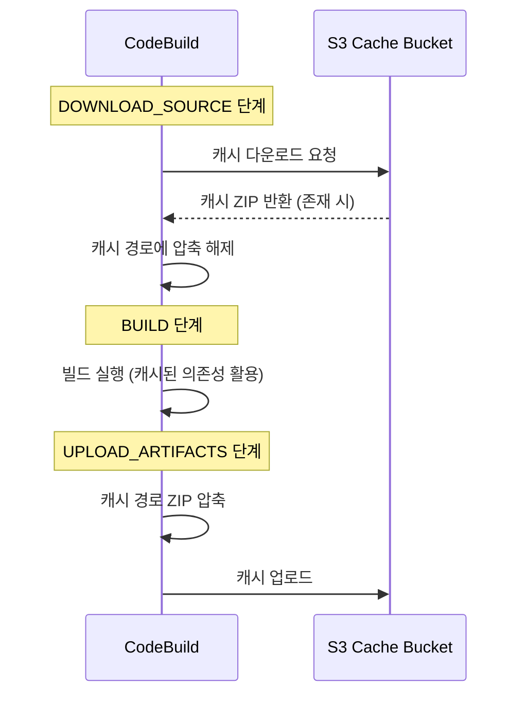
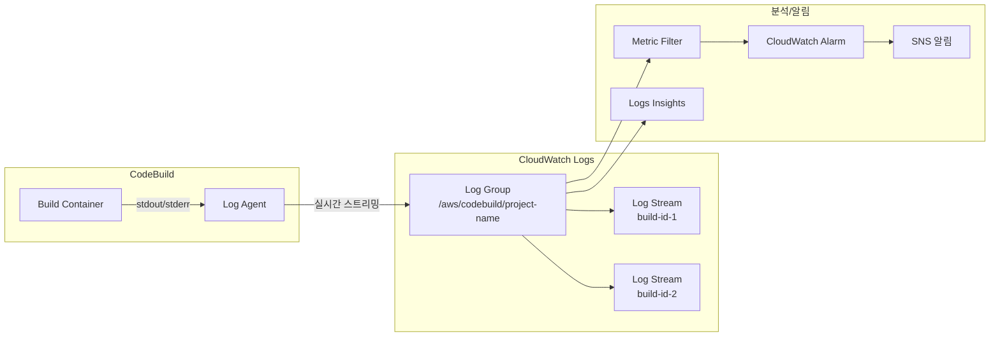
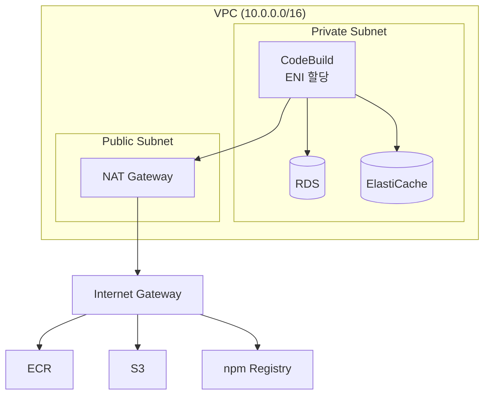

# CodeBuild 내부 동작

AWS CodeBuild는 소스 코드를 컴파일하고, 테스트를 실행하며, 배포 가능한 아티팩트를 생성하는 완전 관리형 빌드 서비스다. 빌드 환경의 프로비저닝부터 아티팩트 업로드까지의 전체 라이프사이클과 캐싱 전략, 환경 변수 우선순위를 이해하면 빌드 시간 최적화와 디버깅이 수월해진다.

## 목차
- [1. 핵심 개념 (What)](#1-핵심-개념-what)
- [2. 왜 알아야 하는가 (Why)](#2-왜-알아야-하는가-why)
- [3. 내부 구현 분석 (How)](#3-내부-구현-분석-how)
- [4. 실전 예제](#4-실전-예제)
- [5. 정리](#5-정리)

---

## 1. 핵심 개념 (What)

### CodeBuild의 구성 요소

| 구성 요소 | 설명 |
|-----------|------|
| **Build Project** | 빌드 설정의 단위. 소스, 환경, buildspec, 아티팩트 등을 정의 |
| **Build Environment** | 빌드가 실행되는 Docker 컨테이너. OS, 런타임, 컴퓨팅 크기 선택 |
| **Buildspec** | 빌드 명령과 설정을 정의하는 YAML 파일 (`buildspec.yml`) |
| **Build Run** | 빌드 프로젝트의 개별 실행 인스턴스 |
| **Compute Type** | 빌드 환경의 CPU/메모리 사양 (BUILD_GENERAL1_SMALL ~ 2XLARGE) |

### 빌드 환경 이미지

CodeBuild는 **AWS 관리형 이미지**와 **커스텀 이미지**를 지원한다:

| 이미지 유형 | 설명 | 예시 |
|------------|------|------|
| **Amazon Linux 2 / AL2023** | 범용 빌드 | `aws/codebuild/amazonlinux2-x86_64-standard:5.0` |
| **Ubuntu** | Ubuntu 기반 빌드 | `aws/codebuild/standard:7.0` |
| **Windows Server** | .NET/Windows 빌드 | `aws/codebuild/windows-base:2019-3.0` |
| **커스텀 Docker** | ECR/Docker Hub의 사용자 이미지 | `123456789012.dkr.ecr.*.amazonaws.com/my-build:latest` |

### 컴퓨팅 타입별 사양

| Compute Type | vCPU | 메모리 | 디스크 | 용도 |
|-------------|------|--------|-------|------|
| BUILD_GENERAL1_SMALL | 2 | 3 GB | 64 GB | 단순 빌드, 린트 |
| BUILD_GENERAL1_MEDIUM | 4 | 7 GB | 128 GB | 일반 빌드 (기본) |
| BUILD_GENERAL1_LARGE | 8 | 15 GB | 128 GB | 대규모 컴파일 |
| BUILD_GENERAL1_2XLARGE | 72 | 145 GB | 824 GB | ML 모델 학습, 대규모 테스트 |
| BUILD_LAMBDA_1GB~10GB | 1~10 GB | - | 512 MB | Lambda 컴퓨팅 모드 (빠른 시작) |

### 빌드 라이프사이클

CodeBuild의 빌드는 다음 **10단계**를 순서대로 거친다:

```
SUBMITTED → QUEUED → PROVISIONING → DOWNLOAD_SOURCE → INSTALL
→ PRE_BUILD → BUILD → POST_BUILD → UPLOAD_ARTIFACTS → FINALIZING
```

각 단계의 역할:

| 단계 | 설명 | 사용자 제어 |
|------|------|------------|
| **SUBMITTED** | 빌드 요청 접수 | 불가 |
| **QUEUED** | 빌드 환경 대기열 진입 | 불가 |
| **PROVISIONING** | Docker 컨테이너 프로비저닝 | 불가 |
| **DOWNLOAD_SOURCE** | 소스 코드 다운로드 + 캐시 복원 | 불가 (캐시 설정으로 간접 제어) |
| **INSTALL** | buildspec의 `install` 페이즈 실행 | `buildspec.yml` |
| **PRE_BUILD** | buildspec의 `pre_build` 페이즈 실행 | `buildspec.yml` |
| **BUILD** | buildspec의 `build` 페이즈 실행 | `buildspec.yml` |
| **POST_BUILD** | buildspec의 `post_build` 페이즈 실행 | `buildspec.yml` |
| **UPLOAD_ARTIFACTS** | 아티팩트를 S3에 업로드 + 캐시 저장 | 불가 (아티팩트 설정으로 간접 제어) |
| **FINALIZING** | 빌드 환경 정리 및 로그 마무리 | 불가 |

## 2. 왜 알아야 하는가 (Why)

### 빌드 시간은 곧 비용이자 개발 속도

CodeBuild는 **빌드 시간(분 단위)**으로 과금된다. 빌드 시간을 1분 줄이면:
- 하루 50회 빌드 기준 → 월 1,500분 절감
- BUILD_GENERAL1_MEDIUM 기준 → 월 약 $7.5 절감
- 개발자 대기 시간도 비례하여 감소

캐싱 전략, 적절한 컴퓨팅 타입 선택, buildspec 최적화로 빌드 시간을 50% 이상 단축할 수 있다.

### 빌드 실패 디버깅에 라이프사이클 이해가 필수

"빌드 실패"라는 결과만으로는 원인을 파악하기 어렵다. 어떤 단계에서 실패했는지에 따라 해결 방법이 완전히 다르다:
- **PROVISIONING 실패**: VPC 설정 문제, 서비스 할당량 초과
- **DOWNLOAD_SOURCE 실패**: 소스 프로바이더 인증 문제, 브랜치 미존재
- **INSTALL 실패**: 의존성 설치 에러, 패키지 버전 충돌
- **BUILD 실패**: 컴파일/테스트 에러 (애플리케이션 코드 문제)
- **UPLOAD_ARTIFACTS 실패**: S3 권한 부족, KMS 키 접근 불가

### 환경 변수 우선순위를 모르면 의도치 않은 값이 주입됨

CodeBuild의 환경 변수는 4곳에서 설정 가능하고 우선순위가 존재한다. 이를 모르면 디버깅에 시간을 낭비하게 된다.

## 3. 내부 구현 분석 (How)

### 빌드 라이프사이클 상세 흐름



**중요한 동작 특성**:

1. **POST_BUILD는 BUILD 실패 후에도 실행된다**: `build` 페이즈가 실패해도 `post_build`는 실행된다. 이를 활용해 실패 시 정리 작업(슬랙 알림, 리소스 정리 등)을 수행할 수 있다.

2. **UPLOAD_ARTIFACTS는 BUILD 실패 시 스킵된다**: `build` 페이즈가 실패하면 아티팩트는 업로드되지 않는다 (단, `post_build`에서 `$CODEBUILD_BUILD_SUCCEEDING`으로 분기 가능).

3. **PROVISIONING 시간은 캐시된 환경 여부에 따라 다르다**: 동일 프로젝트의 반복 빌드는 웜 컨테이너를 재사용할 수 있어 프로비저닝이 빨라진다 (보장은 아님).

### buildspec 페이즈와 라이프사이클 매핑

```yaml
version: 0.2

env:
  variables:           # 정적 환경 변수
    APP_ENV: "production"
  parameter-store:     # SSM Parameter Store 참조
    DB_PASSWORD: "/prod/db/password"
  secrets-manager:     # Secrets Manager 참조
    API_KEY: "prod/api-key:API_KEY"
  exported-variables:  # 다른 액션으로 내보낼 변수
    - IMAGE_TAG
    - BUILD_ID

phases:
  install:             # → INSTALL 단계에서 실행
    runtime-versions:
      nodejs: 20
    commands:
      - echo "Installing dependencies..."

  pre_build:           # → PRE_BUILD 단계에서 실행
    commands:
      - echo "Running pre-build steps..."

  build:               # → BUILD 단계에서 실행
    commands:
      - echo "Building..."
    on-failure: ABORT  # ABORT(기본) 또는 CONTINUE

  post_build:          # → POST_BUILD 단계에서 실행
    commands:
      - echo "Post-build steps..."

artifacts:             # → UPLOAD_ARTIFACTS 단계에서 처리
  files:
    - '**/*'

cache:                 # → DOWNLOAD_SOURCE에서 복원, UPLOAD_ARTIFACTS에서 저장
  paths:
    - 'node_modules/**/*'
```

### 캐싱 전략

CodeBuild는 **두 가지 캐시 유형**을 지원한다:

#### 1. S3 캐시



S3 캐시 특성:
- 빌드 간 **공유** 가능 (같은 프로젝트의 다른 빌드)
- S3 저장 비용 발생
- 네트워크 전송 시간 소요 (대규모 캐시 시 오히려 느려질 수 있음)
- `cache.paths`에 지정된 경로만 캐시

```yaml
# buildspec.yml - S3 캐시 예시
cache:
  paths:
    - '/root/.m2/**/*'        # Maven
    - '/root/.gradle/**/*'    # Gradle
    - 'node_modules/**/*'     # npm
    - '/root/.cache/pip/**/*' # pip
```

#### 2. 로컬 캐시

로컬 캐시는 빌드 호스트의 **로컬 스토리지**를 활용한다:

| 캐시 모드 | 캐시 대상 | 효과 |
|----------|----------|------|
| `LOCAL_SOURCE_CACHE` | Git 소스 코드 | git clone 대신 git pull (증분 다운로드) |
| `LOCAL_DOCKER_LAYER_CACHE` | Docker 레이어 | docker build 시 레이어 캐시 활용 |
| `LOCAL_CUSTOM_CACHE` | buildspec에서 지정한 경로 | S3 캐시와 유사하지만 로컬 |

```json
{
  "cache": {
    "type": "LOCAL",
    "modes": [
      "LOCAL_DOCKER_LAYER_CACHE",
      "LOCAL_SOURCE_CACHE",
      "LOCAL_CUSTOM_CACHE"
    ]
  }
}
```

**로컬 캐시의 한계**:
- 동일 빌드 호스트를 재사용해야 효과가 있음 (보장되지 않음)
- 빌드 빈도가 높을수록 캐시 히트율 증가
- `LOCAL_DOCKER_LAYER_CACHE`는 `privileged` 모드 필요

#### 캐시 전략 선택 가이드

```
                 ┌──────────────────────────────┐
                 │    빌드 빈도가 높은가?        │
                 └──────────┬───────────────────┘
                      ┌─────┴─────┐
                   예 │           │ 아니오
                      ▼           ▼
              ┌──────────┐  ┌──────────────┐
              │ 로컬 캐시 │  │  S3 캐시     │
              │ (높은     │  │  (안정적     │
              │  히트율)  │  │   히트율)    │
              └──────────┘  └──────────────┘
                      │
              ┌───────┴───────┐
              │ Docker 빌드?   │
              └───┬───────┬───┘
               예 │       │ 아니오
                  ▼       ▼
          LOCAL_DOCKER  LOCAL_SOURCE
          _LAYER_CACHE  _CACHE +
                        LOCAL_CUSTOM
                        _CACHE
```

### 환경 변수 우선순위

CodeBuild의 환경 변수는 여러 소스에서 설정될 수 있으며, **후순위가 선순위를 덮어쓴다**:

```
우선순위 (낮음 → 높음):

1. 빌드 프로젝트 설정의 환경 변수
   └── CodeBuild 콘솔 또는 CloudFormation에서 설정

2. buildspec의 env.variables
   └── buildspec.yml 파일에 정의

3. StartBuild API의 environmentVariablesOverride
   └── CodePipeline 또는 CLI에서 실행 시 전달

4. 빌드 프로젝트의 "시스템" 환경 변수
   └── AWS_DEFAULT_REGION, CODEBUILD_BUILD_ID 등 (항상 최우선)
```

AWS가 자동 제공하는 주요 시스템 환경 변수:

| 변수 | 설명 | 예시 |
|------|------|------|
| `CODEBUILD_BUILD_ID` | 빌드 고유 ID | `project:12345678-...` |
| `CODEBUILD_BUILD_NUMBER` | 빌드 순번 | `42` |
| `CODEBUILD_BUILD_SUCCEEDING` | 현재까지 빌드 성공 여부 | `1` (성공) / `0` (실패) |
| `CODEBUILD_SRC_DIR` | 소스 코드 경로 | `/codebuild/output/src123/src` |
| `CODEBUILD_RESOLVED_SOURCE_VERSION` | 소스 커밋 해시 | `abc123def456...` |
| `CODEBUILD_SOURCE_REPO_URL` | 소스 리포지토리 URL | `https://github.com/...` |
| `CODEBUILD_WEBHOOK_EVENT` | 웹훅 이벤트 유형 | `PUSH`, `PULL_REQUEST_CREATED` |
| `AWS_DEFAULT_REGION` | 빌드 리전 | `ap-northeast-2` |
| `AWS_ACCOUNT_ID` | AWS 계정 ID | `123456789012` |

### CloudWatch Logs 통합



로그 설정 옵션:

```json
{
  "logsConfig": {
    "cloudWatchLogs": {
      "status": "ENABLED",
      "groupName": "/aws/codebuild/my-project",
      "streamName": "build-log"
    },
    "s3Logs": {
      "status": "ENABLED",
      "location": "my-bucket/build-logs",
      "encryptionDisabled": false
    }
  }
}
```

- **CloudWatch Logs**: 실시간 스트리밍, Logs Insights로 분석 가능
- **S3 Logs**: 장기 보관, 대용량 로그에 적합 (CloudWatch Logs 비용 절감)
- 두 가지를 **동시에** 활성화할 수 있다

### VPC 내 빌드

프라이빗 서브넷의 리소스(RDS, ElastiCache 등)에 접근해야 하는 빌드에서 VPC 설정이 필요하다.



VPC 설정 시 주의사항:

```
┌─────────────────────────────────────────────────────┐
│                  VPC 빌드 체크리스트                  │
├─────────────────────────────────────────────────────┤
│ 1. 프라이빗 서브넷에 배치 (퍼블릭 서브넷 불가)        │
│ 2. NAT Gateway/Instance 필요 (인터넷 접근용)          │
│ 3. 또는 VPC Endpoint 설정:                           │
│    - S3 Gateway Endpoint (아티팩트/캐시)              │
│    - ECR VPC Endpoint (이미지 풀)                     │
│    - CloudWatch Logs VPC Endpoint (로그 전송)         │
│    - STS VPC Endpoint (IAM 역할 위임)                 │
│ 4. Security Group: 아웃바운드 443 허용 (최소)          │
│ 5. 서브넷에 충분한 IP 확보 (ENI 할당)                  │
│ 6. 프로비저닝 시간 증가 (ENI 연결 소요)                │
└─────────────────────────────────────────────────────┘
```

VPC 빌드는 ENI(Elastic Network Interface)를 빌드 컨테이너에 연결하므로:
- **프로비저닝 시간이 증가**한다 (약 30~60초 추가)
- 서브넷의 **가용 IP가 충분**해야 한다
- 동시 빌드 수만큼의 ENI가 필요하다

## 4. 실전 예제

### 예제 1: 최적화된 Docker 빌드 buildspec

```yaml
version: 0.2

env:
  variables:
    ECR_REPO_NAME: "my-app/web"
    DOCKER_BUILDKIT: "1"
  exported-variables:
    - IMAGE_TAG
    - IMAGE_URI

phases:
  install:
    runtime-versions:
      docker: 20

  pre_build:
    commands:
      # ECR 로그인
      - echo "Logging in to ECR..."
      - ECR_URI="${AWS_ACCOUNT_ID}.dkr.ecr.${AWS_DEFAULT_REGION}.amazonaws.com"
      - aws ecr get-login-password --region ${AWS_DEFAULT_REGION} | docker login --username AWS --password-stdin ${ECR_URI}
      
      # 이미지 태그 생성
      - COMMIT_HASH=$(echo ${CODEBUILD_RESOLVED_SOURCE_VERSION} | cut -c 1-7)
      - IMAGE_TAG="${COMMIT_HASH}"
      - IMAGE_URI="${ECR_URI}/${ECR_REPO_NAME}:${IMAGE_TAG}"
      
      # 캐시용 기존 이미지 풀 (실패해도 빌드 계속)
      - docker pull ${ECR_URI}/${ECR_REPO_NAME}:latest || true

  build:
    commands:
      - echo "Building Docker image..."
      - |
        docker build \
          --cache-from ${ECR_URI}/${ECR_REPO_NAME}:latest \
          --build-arg BUILDKIT_INLINE_CACHE=1 \
          --build-arg BUILD_NUMBER=${CODEBUILD_BUILD_NUMBER} \
          --build-arg GIT_COMMIT=${COMMIT_HASH} \
          -t ${IMAGE_URI} \
          -t ${ECR_URI}/${ECR_REPO_NAME}:latest \
          .

  post_build:
    commands:
      # 빌드 성공 시에만 푸시
      - |
        if [ "$CODEBUILD_BUILD_SUCCEEDING" = "1" ]; then
          echo "Pushing Docker image..."
          docker push ${IMAGE_URI}
          docker push ${ECR_URI}/${ECR_REPO_NAME}:latest
          
          # ECS 배포용 이미지 정의 파일 생성
          printf '[{"name":"web","imageUri":"%s"}]' ${IMAGE_URI} > imagedefinitions.json
          echo "Image pushed successfully: ${IMAGE_URI}"
        else
          echo "Build failed, skipping push"
        fi

artifacts:
  files:
    - imagedefinitions.json
  discard-paths: yes

cache:
  paths:
    - '/root/.docker/**/*'
```

### 예제 2: CloudFormation으로 CodeBuild 프로젝트 (VPC + S3 캐시)

```yaml
AWSTemplateFormatVersion: '2010-09-09'
Description: CodeBuild project with VPC access and S3 caching

Parameters:
  VpcId:
    Type: AWS::EC2::VPC::Id
  PrivateSubnetIds:
    Type: List<AWS::EC2::Subnet::Id>

Resources:
  # 캐시용 S3 버킷
  CacheBucket:
    Type: AWS::S3::Bucket
    Properties:
      BucketName: !Sub codebuild-cache-${AWS::AccountId}
      LifecycleConfiguration:
        Rules:
          - Id: ExpireCache
            Status: Enabled
            ExpirationInDays: 7

  # CodeBuild Security Group
  BuildSecurityGroup:
    Type: AWS::EC2::SecurityGroup
    Properties:
      GroupDescription: CodeBuild VPC access
      VpcId: !Ref VpcId
      SecurityGroupEgress:
        - IpProtocol: tcp
          FromPort: 443
          ToPort: 443
          CidrIp: 0.0.0.0/0
          Description: HTTPS outbound
        - IpProtocol: tcp
          FromPort: 5432
          ToPort: 5432
          CidrIp: 10.0.0.0/16
          Description: PostgreSQL access within VPC

  # CodeBuild 프로젝트
  BuildProject:
    Type: AWS::CodeBuild::Project
    Properties:
      Name: my-app-build
      Description: Build and test my-app with VPC access
      ServiceRole: !GetAtt CodeBuildRole.Arn
      TimeoutInMinutes: 30
      QueuedTimeoutInMinutes: 60
      ConcurrentBuildLimit: 5
      
      Source:
        Type: CODEPIPELINE
        BuildSpec: buildspec.yml
      
      Artifacts:
        Type: CODEPIPELINE

      Environment:
        Type: LINUX_CONTAINER
        ComputeType: BUILD_GENERAL1_MEDIUM
        Image: aws/codebuild/amazonlinux2-x86_64-standard:5.0
        PrivilegedMode: true  # Docker 빌드에 필요
        EnvironmentVariables:
          - Name: AWS_ACCOUNT_ID
            Value: !Ref AWS::AccountId
          - Name: ECR_REPO_NAME
            Value: my-app/web
          - Name: DB_HOST
            Type: PARAMETER_STORE
            Value: /prod/db/host
          - Name: DB_PASSWORD
            Type: SECRETS_MANAGER
            Value: prod/db-credentials:password

      # VPC 설정
      VpcConfig:
        VpcId: !Ref VpcId
        Subnets: !Ref PrivateSubnetIds
        SecurityGroupIds:
          - !Ref BuildSecurityGroup

      # S3 캐시 설정
      Cache:
        Type: S3
        Location: !Sub ${CacheBucket}/build-cache

      # 로그 설정
      LogsConfig:
        CloudWatchLogs:
          Status: ENABLED
          GroupName: !Ref BuildLogGroup
          StreamName: build
        S3Logs:
          Status: ENABLED
          Location: !Sub ${CacheBucket}/build-logs
          EncryptionDisabled: false

  # CloudWatch 로그 그룹
  BuildLogGroup:
    Type: AWS::Logs::LogGroup
    Properties:
      LogGroupName: /aws/codebuild/my-app-build
      RetentionInDays: 30

  # 빌드 실패 메트릭 필터
  BuildFailureMetricFilter:
    Type: AWS::Logs::MetricFilter
    Properties:
      LogGroupName: !Ref BuildLogGroup
      FilterPattern: "[ERROR]"
      MetricTransformations:
        - MetricNamespace: Custom/CodeBuild
          MetricName: BuildErrors
          MetricValue: "1"
          DefaultValue: 0

  # 빌드 실패 알람
  BuildFailureAlarm:
    Type: AWS::CloudWatch::Alarm
    Properties:
      AlarmName: codebuild-failure-alarm
      AlarmDescription: CodeBuild 빌드 에러 발생
      MetricName: BuildErrors
      Namespace: Custom/CodeBuild
      Statistic: Sum
      Period: 300
      EvaluationPeriods: 1
      Threshold: 1
      ComparisonOperator: GreaterThanOrEqualToThreshold
      AlarmActions:
        - !Ref AlertSNSTopic

  # IAM Role
  CodeBuildRole:
    Type: AWS::IAM::Role
    Properties:
      AssumeRolePolicyDocument:
        Version: '2012-10-17'
        Statement:
          - Effect: Allow
            Principal:
              Service: codebuild.amazonaws.com
            Action: sts:AssumeRole
      Policies:
        - PolicyName: CodeBuildPolicy
          PolicyDocument:
            Version: '2012-10-17'
            Statement:
              # CloudWatch Logs
              - Effect: Allow
                Action:
                  - logs:CreateLogGroup
                  - logs:CreateLogStream
                  - logs:PutLogEvents
                Resource:
                  - !GetAtt BuildLogGroup.Arn
                  - !Sub ${BuildLogGroup.Arn}:*
              # S3 (아티팩트 + 캐시)
              - Effect: Allow
                Action:
                  - s3:GetObject
                  - s3:PutObject
                  - s3:GetBucketAcl
                  - s3:GetBucketLocation
                Resource:
                  - !GetAtt CacheBucket.Arn
                  - !Sub ${CacheBucket.Arn}/*
              # ECR
              - Effect: Allow
                Action:
                  - ecr:GetAuthorizationToken
                Resource: '*'
              - Effect: Allow
                Action:
                  - ecr:BatchCheckLayerAvailability
                  - ecr:GetDownloadUrlForLayer
                  - ecr:BatchGetImage
                  - ecr:PutImage
                  - ecr:InitiateLayerUpload
                  - ecr:UploadLayerPart
                  - ecr:CompleteLayerUpload
                Resource: !Sub arn:aws:ecr:${AWS::Region}:${AWS::AccountId}:repository/my-app/*
              # VPC ENI 관리
              - Effect: Allow
                Action:
                  - ec2:CreateNetworkInterface
                  - ec2:DescribeDhcpOptions
                  - ec2:DescribeNetworkInterfaces
                  - ec2:DeleteNetworkInterface
                  - ec2:DescribeSubnets
                  - ec2:DescribeSecurityGroups
                  - ec2:DescribeVpcs
                Resource: '*'
              - Effect: Allow
                Action:
                  - ec2:CreateNetworkInterfacePermission
                Resource: !Sub arn:aws:ec2:${AWS::Region}:${AWS::AccountId}:network-interface/*
                Condition:
                  StringEquals:
                    ec2:AuthorizedService: codebuild.amazonaws.com
              # SSM + Secrets Manager
              - Effect: Allow
                Action:
                  - ssm:GetParameters
                Resource: !Sub arn:aws:ssm:${AWS::Region}:${AWS::AccountId}:parameter/prod/*
              - Effect: Allow
                Action:
                  - secretsmanager:GetSecretValue
                Resource: !Sub arn:aws:secretsmanager:${AWS::Region}:${AWS::AccountId}:secret:prod/*
```

### 예제 3: 멀티 스테이지 buildspec (테스트 + 빌드 분리)

```yaml
version: 0.2

env:
  variables:
    CI: "true"
    NODE_ENV: "test"
  parameter-store:
    DATABASE_URL: "/test/database-url"

phases:
  install:
    runtime-versions:
      nodejs: 20
    commands:
      - echo "Node.js version: $(node --version)"
      - echo "npm version: $(npm --version)"

  pre_build:
    commands:
      # 의존성 설치 (캐시 활용)
      - echo "Installing dependencies..."
      - npm ci --ignore-scripts
      - npm rebuild
      
      # 린트 + 타입 체크
      - echo "Running lint..."
      - npm run lint
      - echo "Running type check..."
      - npm run type-check

  build:
    commands:
      # 테스트 실행
      - echo "Running unit tests..."
      - npm run test -- --coverage --forceExit
      
      # 통합 테스트 (VPC 내 DB 접근)
      - echo "Running integration tests..."
      - npm run test:integration
      
      # 프로덕션 빌드
      - echo "Building application..."
      - NODE_ENV=production npm run build
    on-failure: ABORT

  post_build:
    commands:
      - |
        if [ "$CODEBUILD_BUILD_SUCCEEDING" = "1" ]; then
          echo "All tests passed, build successful"
          # 테스트 커버리지 리포트 업로드
          aws s3 cp coverage/ s3://my-reports-bucket/coverage/${CODEBUILD_BUILD_NUMBER}/ --recursive
        else
          echo "Build failed"
          # 실패 알림 (선택)
        fi

reports:
  jest-reports:
    files:
      - 'junit.xml'
    base-directory: 'test-results'
    file-format: JUNITXML
  coverage-reports:
    files:
      - 'clover.xml'
    base-directory: 'coverage'
    file-format: CLOVERXML

artifacts:
  files:
    - 'dist/**/*'
    - 'package.json'
    - 'Dockerfile'
    - 'imagedefinitions.json'
  base-directory: '.'

cache:
  paths:
    - 'node_modules/**/*'
    - '/root/.npm/**/*'
```

## 5. 정리

### 빌드 라이프사이클 요약

| 단계 | 사용자 제어 | 실패 시 동작 | 최적화 포인트 |
|------|-----------|-------------|--------------|
| SUBMITTED → QUEUED | 불가 | - | `ConcurrentBuildLimit` 조정 |
| PROVISIONING | 불가 | 빌드 종료 | VPC 미사용 시 더 빠름 |
| DOWNLOAD_SOURCE | 캐시 설정 | 빌드 종료 | `LOCAL_SOURCE_CACHE` 활용 |
| INSTALL | buildspec | 빌드 종료 | 의존성 캐시 적극 활용 |
| PRE_BUILD | buildspec | 빌드 종료 | 린트/타입체크 등 빠른 실패 |
| BUILD | buildspec | POST_BUILD 진행 | 병렬 작업, 증분 빌드 |
| POST_BUILD | buildspec | 아티팩트 업로드 진행 | 실패 시 정리 작업 수행 |
| UPLOAD_ARTIFACTS | 아티팩트 설정 | 빌드 실패 | 최소 필요 파일만 포함 |
| FINALIZING | 불가 | - | - |

### 캐시 전략 비교

| 전략 | 히트율 | 비용 | 속도 | 적합한 시나리오 |
|------|--------|------|------|----------------|
| **S3 캐시** | 안정적 (높음) | S3 저장 + 전송 | 중간 | 의존성 캐시 (node_modules, .m2) |
| **LOCAL_SOURCE_CACHE** | 불안정 | 없음 | 빠름 | 대용량 Git 리포지토리 |
| **LOCAL_DOCKER_LAYER_CACHE** | 불안정 | 없음 | 매우 빠름 | Docker 이미지 빌드 |
| **LOCAL_CUSTOM_CACHE** | 불안정 | 없음 | 빠름 | 빈번한 빌드 환경 |

### 환경 변수 우선순위 (낮음 → 높음)

| 우선순위 | 소스 | 설정 위치 |
|---------|------|----------|
| 1 (최저) | Build Project 환경 변수 | 콘솔 / CloudFormation |
| 2 | buildspec `env.variables` | buildspec.yml |
| 3 | StartBuild API Override | CodePipeline / CLI |
| 4 (최고) | AWS 시스템 변수 | 자동 설정 (CODEBUILD_*, AWS_*) |

### 운영 체크리스트

- [ ] buildspec의 `build` 페이즈 실패 후 `post_build`에서 `CODEBUILD_BUILD_SUCCEEDING` 분기 처리
- [ ] 의존성 캐시(S3 또는 로컬) 설정으로 빌드 시간 단축
- [ ] Docker 빌드 시 `privileged` 모드 + `LOCAL_DOCKER_LAYER_CACHE` 설정
- [ ] VPC 빌드 시 NAT Gateway 또는 VPC Endpoint 확인
- [ ] CloudWatch Logs 보존 기간 설정 (무기한 보관 방지)
- [ ] `ConcurrentBuildLimit`으로 동시 빌드 수 제한 (비용 제어)
- [ ] 민감 정보는 환경 변수 직접 입력 대신 SSM Parameter Store / Secrets Manager 참조
- [ ] `QueuedTimeoutInMinutes` 설정으로 대기열 무한 대기 방지

---
*참고: AWS CodeBuild 최신 버전 기준 (2024)*
