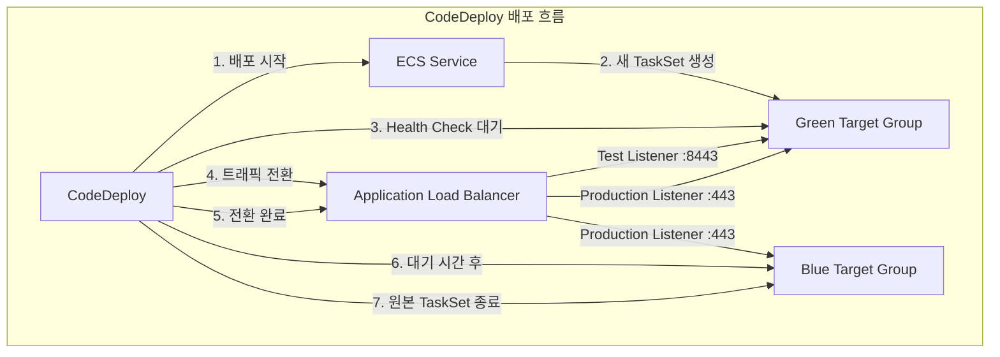
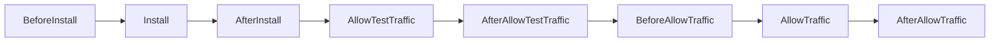

# CodeDeploy + ECS 배포 전략

AWS CodeDeploy와 ECS를 연동한 배포 전략의 핵심 메커니즘을 분석하고, Rolling Update와 Blue/Green 배포의 차이점, 트래픽 전환 방식, 롤백 조건을 실전 관점에서 다룬다.

## 목차
- [1. 핵심 개념 (What)](#1-핵심-개념-what)
- [2. 왜 알아야 하는가 (Why)](#2-왜-알아야-하는가-why)
- [3. 내부 구현 분석 (How)](#3-내부-구현-분석-how)
- [4. 실전 예제](#4-실전-예제)
- [5. 정리](#5-정리)

---

## 1. 핵심 개념 (What)

### ECS 배포 유형 세 가지

ECS 서비스는 세 가지 배포 컨트롤러를 지원한다:

| 배포 컨트롤러 | 관리 주체 | 트래픽 전환 | 롤백 |
|---|---|---|---|
| **Rolling Update** | ECS 자체 | 점진적 태스크 교체 | 수동 재배포 |
| **Blue/Green (CodeDeploy)** | CodeDeploy | ALB 리스너 기반 전환 | 자동/수동 롤백 |
| **External** | 서드파티 | 커스텀 | 커스텀 |

### Rolling Update

ECS의 기본 배포 방식이다. 새로운 Task Definition 버전을 등록하면 ECS 스케줄러가 기존 태스크를 점진적으로 새 버전으로 교체한다. `minimumHealthyPercent`와 `maximumPercent` 파라미터로 동시에 실행되는 태스크 수를 제어한다.

### Blue/Green (CodeDeploy)

CodeDeploy가 배포 오케스트레이션을 담당한다. 두 개의 Target Group(Blue/Green)을 사용하여 새 버전의 태스크 셋을 별도로 띄운 뒤, ALB 리스너의 트래픽을 Blue에서 Green으로 전환한다. 전환 전 테스트 리스너를 통해 검증할 수 있다.

### 트래픽 전환 메커니즘

CodeDeploy는 세 가지 트래픽 전환 유형을 제공한다:

- **AllAtOnce**: 모든 트래픽을 즉시 새 Target Group으로 전환
- **Linear**: 일정 시간 간격으로 동일 비율씩 트래픽 전환 (예: 10%씩 매 1분)
- **Canary**: 먼저 소량의 트래픽을 전환하고, 대기 후 나머지 전체 전환 (예: 10% 전환 → 5분 대기 → 나머지 90%)

---

## 2. 왜 알아야 하는가 (Why)

### 무중단 배포의 필수 요소

프로덕션 환경에서 배포로 인한 다운타임은 직접적인 비즈니스 손실이다. 올바른 배포 전략을 선택하지 않으면:

- **Rolling Update 단독 사용 시**: 새 버전에 문제가 있으면 이미 교체된 태스크를 다시 이전 버전으로 되돌려야 한다. 자동 롤백이 없으므로 수동 개입이 필요하다.
- **Blue/Green 미사용 시**: 새 버전을 프로덕션 트래픽 없이 사전 검증할 수 없다. Health check만으로는 비즈니스 로직 오류를 잡지 못한다.

### 실무에서 자주 겪는 문제

1. **느린 롤백**: Rolling Update에서 문제 발견 시 이전 버전으로 재배포해야 하며, 이 과정 자체가 또 다른 Rolling Update다
2. **배포 중 에러 스파이크**: Canary/Linear 없이 AllAtOnce로 전환하면 새 버전의 결함이 전체 트래픽에 즉시 영향
3. **테스트 리스너 미활용**: Blue/Green을 쓰면서도 테스트 리스너를 설정하지 않으면 사전 검증 기회를 놓침

---

## 3. 내부 구현 분석 (How)

### Blue/Green 배포 아키텍처



### 배포 생명주기 이벤트

CodeDeploy ECS 배포는 다음 생명주기 이벤트 순서를 따른다:



각 이벤트의 역할:

| 생명주기 이벤트 | 설명 | Hook 지원 |
|---|---|---|
| `BeforeInstall` | 새 태스크 셋 생성 전 | Lambda Hook |
| `Install` | 새 태스크 셋 생성 및 Target Group 등록 | 불가 |
| `AfterInstall` | 새 태스크가 Target Group에 등록된 후 | Lambda Hook |
| `AllowTestTraffic` | 테스트 리스너로 트래픽 전달 | 불가 |
| `AfterAllowTestTraffic` | 테스트 트래픽 허용 후 검증 단계 | Lambda Hook |
| `BeforeAllowTraffic` | 프로덕션 트래픽 전환 직전 | Lambda Hook |
| `AllowTraffic` | 프로덕션 리스너를 새 Target Group으로 전환 | 불가 |
| `AfterAllowTraffic` | 프로덕션 트래픽 전환 완료 후 | Lambda Hook |

### Rolling Update 동작 원리

```
desired_count = 4, minimumHealthyPercent = 50, maximumPercent = 200

Step 1: [v1][v1][v1][v1]          ← 기존 4개 태스크
Step 2: [v1][v1][v1][v1][v2][v2]  ← maximumPercent=200이므로 최대 8개까지 가능, 새 태스크 추가
Step 3: [v1][v1][v2][v2][v2][v2]  ← 새 태스크 healthy 확인 후 기존 태스크 종료
Step 4: [v2][v2][v2][v2]          ← 모든 태스크 교체 완료
```

핵심 파라미터:
- `minimumHealthyPercent`: 배포 중 유지해야 할 최소 healthy 태스크 비율
- `maximumPercent`: 배포 중 동시에 실행 가능한 최대 태스크 비율

### 트래픽 전환 구성(Deployment Configuration)

AWS가 제공하는 사전 정의 배포 구성:

| 배포 구성 | 전환 방식 |
|---|---|
| `CodeDeployDefault.ECSAllAtOnce` | 즉시 100% 전환 |
| `CodeDeployDefault.ECSLinear10PercentEvery1Minutes` | 매 1분마다 10%씩 전환 |
| `CodeDeployDefault.ECSLinear10PercentEvery3Minutes` | 매 3분마다 10%씩 전환 |
| `CodeDeployDefault.ECSCanary10Percent5Minutes` | 10% 전환 → 5분 대기 → 나머지 90% |
| `CodeDeployDefault.ECSCanary10Percent15Minutes` | 10% 전환 → 15분 대기 → 나머지 90% |

### 롤백 메커니즘

CodeDeploy의 롤백은 **새로운 배포를 생성하여 이전 버전으로 되돌리는 것**이 아니라, **트래픽을 원래 Target Group으로 재전환**하는 방식이다:

```
롤백 트리거 조건:
1. 자동 롤백 — 배포 실패 시 (태스크 Health Check 실패)
2. 자동 롤백 — CloudWatch 알람 트리거 시
3. 수동 롤백 — 운영자가 Stop & Rollback 클릭
```

---

## 4. 실전 예제

### 예제 1: Blue/Green 배포를 위한 CodeDeploy 리소스 (CloudFormation)

```yaml
# codedeploy-bluegreen.yaml
AWSTemplateFormatVersion: '2010-09-09'
Description: CodeDeploy Blue/Green Deployment for ECS

Resources:
  # CodeDeploy 애플리케이션
  CodeDeployApplication:
    Type: AWS::CodeDeploy::Application
    Properties:
      ApplicationName: my-ecs-app
      ComputePlatform: ECS

  # 배포 그룹 — Canary 10% / 5분
  DeploymentGroup:
    Type: AWS::CodeDeploy::DeploymentGroup
    Properties:
      ApplicationName: !Ref CodeDeployApplication
      DeploymentGroupName: my-ecs-dg
      DeploymentConfigName: CodeDeployDefault.ECSCanary10Percent5Minutes
      ServiceRoleArn: !GetAtt CodeDeployServiceRole.Arn
      DeploymentStyle:
        DeploymentOption: WITH_TRAFFIC_CONTROL
        DeploymentType: BLUE_GREEN
      BlueGreenDeploymentConfiguration:
        TerminateBlueInstancesOnDeploymentSuccess:
          Action: TERMINATE
          TerminationWaitTimeInMinutes: 5
        DeploymentReadyOption:
          ActionOnTimeout: CONTINUE_DEPLOYMENT
          WaitTimeInMinutes: 0
      ECSServices:
        - ClusterName: !Ref ECSCluster
          ServiceName: !GetAtt ECSService.Name
      LoadBalancerInfo:
        TargetGroupPairInfoList:
          - ProdTrafficRoute:
              ListenerArns:
                - !Ref ALBListenerProd
            TestTrafficRoute:
              ListenerArns:
                - !Ref ALBListenerTest
            TargetGroups:
              - Name: !GetAtt BlueTargetGroup.TargetGroupName
              - Name: !GetAtt GreenTargetGroup.TargetGroupName
      AutoRollbackConfiguration:
        Enabled: true
        Events:
          - DEPLOYMENT_FAILURE
          - DEPLOYMENT_STOP_ON_ALARM
      AlarmConfiguration:
        Enabled: true
        Alarms:
          - Name: !Ref HighErrorRateAlarm

  # CodeDeploy 서비스 역할
  CodeDeployServiceRole:
    Type: AWS::IAM::Role
    Properties:
      AssumeRolePolicyDocument:
        Version: '2012-10-17'
        Statement:
          - Effect: Allow
            Principal:
              Service: codedeploy.amazonaws.com
            Action: sts:AssumeRole
      ManagedPolicyArns:
        - arn:aws:iam::aws:policy/AWSCodeDeployRoleForECS
```

### 예제 2: AppSpec 파일 (appspec.yaml)

CodeDeploy ECS 배포에 필요한 AppSpec 파일이다. 태스크 정의와 컨테이너/포트 매핑, 생명주기 Hook을 정의한다.

```yaml
# appspec.yaml
version: 0.0
Resources:
  - TargetService:
      Type: AWS::ECS::Service
      Properties:
        TaskDefinition: "arn:aws:ecs:ap-northeast-2:123456789012:task-definition/my-app:42"
        LoadBalancerInfo:
          ContainerName: "my-app-container"
          ContainerPort: 8080
        PlatformVersion: "LATEST"
        NetworkConfiguration:
          AwsvpcConfiguration:
            Subnets:
              - "subnet-0abc1234"
              - "subnet-0def5678"
            SecurityGroups:
              - "sg-0aabbccdd"
            AssignPublicIp: "DISABLED"
Hooks:
  - BeforeInstall: "arn:aws:lambda:ap-northeast-2:123456789012:function:BeforeInstallHook"
  - AfterInstall: "arn:aws:lambda:ap-northeast-2:123456789012:function:AfterInstallHook"
  - AfterAllowTestTraffic: "arn:aws:lambda:ap-northeast-2:123456789012:function:RunIntegrationTests"
  - BeforeAllowTraffic: "arn:aws:lambda:ap-northeast-2:123456789012:function:PreTrafficValidation"
  - AfterAllowTraffic: "arn:aws:lambda:ap-northeast-2:123456789012:function:PostTrafficValidation"
```

### 예제 3: 생명주기 Hook Lambda (AfterAllowTestTraffic)

테스트 리스너를 통해 새 버전의 헬스 체크와 통합 테스트를 수행하는 Lambda 함수이다.

```python
# lambda/after_allow_test_traffic.py
import json
import urllib.request
import boto3

codedeploy = boto3.client('codedeploy')

def handler(event, context):
    deployment_id = event['DeploymentId']
    lifecycle_event_hook_execution_id = event['LifecycleEventHookExecutionId']
    
    test_endpoint = "http://my-alb-1234567890.ap-northeast-2.elb.amazonaws.com:8443/health"
    
    status = 'Succeeded'
    try:
        # 테스트 리스너를 통해 새 버전 검증
        req = urllib.request.Request(test_endpoint)
        with urllib.request.urlopen(req, timeout=10) as response:
            body = json.loads(response.read())
            if response.status != 200 or body.get('status') != 'healthy':
                status = 'Failed'
                print(f"Health check failed: {body}")
            else:
                print(f"Health check passed: {body}")
                
        # 추가 통합 테스트 수행
        test_cases = [
            {"path": "/api/v1/ping", "expected_status": 200},
            {"path": "/api/v1/readiness", "expected_status": 200},
        ]
        
        for test in test_cases:
            url = f"http://my-alb-1234567890.ap-northeast-2.elb.amazonaws.com:8443{test['path']}"
            req = urllib.request.Request(url)
            with urllib.request.urlopen(req, timeout=10) as resp:
                if resp.status != test['expected_status']:
                    status = 'Failed'
                    print(f"Test failed for {test['path']}: got {resp.status}")
                    break
                    
    except Exception as e:
        status = 'Failed'
        print(f"Validation error: {str(e)}")
    
    # CodeDeploy에 결과 보고
    codedeploy.put_lifecycle_event_hook_execution_status(
        deploymentId=deployment_id,
        lifecycleEventHookExecutionId=lifecycle_event_hook_execution_id,
        status=status
    )
    
    return {'statusCode': 200, 'body': json.dumps({'validation': status})}
```

### 예제 4: ECS 서비스 — Rolling Update 구성 (Terraform)

```hcl
# rolling-update.tf
resource "aws_ecs_service" "app" {
  name            = "my-app-service"
  cluster         = aws_ecs_cluster.main.id
  task_definition = aws_ecs_task_definition.app.arn
  desired_count   = 4
  launch_type     = "FARGATE"

  # Rolling Update 설정
  deployment_controller {
    type = "ECS"  # 기본값 — ECS 자체 Rolling Update
  }

  deployment_maximum_percent         = 200
  deployment_minimum_healthy_percent = 50

  # Circuit Breaker — 배포 실패 시 자동 롤백
  deployment_circuit_breaker {
    enable   = true
    rollback = true
  }

  network_configuration {
    subnets          = var.private_subnets
    security_groups  = [aws_security_group.ecs_tasks.id]
    assign_public_ip = false
  }

  load_balancer {
    target_group_arn = aws_lb_target_group.app.arn
    container_name   = "my-app-container"
    container_port   = 8080
  }
}
```

> **참고**: ECS Rolling Update에서도 `deployment_circuit_breaker`를 활성화하면 배포 실패 시 자동 롤백이 가능하다. 이 기능은 태스크가 반복적으로 STOPPED 상태로 전환될 때 배포를 실패로 판정하고 이전 버전으로 되돌린다.

---

## 5. 정리

### 배포 전략 비교 요약

| 항목 | Rolling Update | Blue/Green (CodeDeploy) |
|---|---|---|
| **관리 주체** | ECS 스케줄러 | CodeDeploy |
| **트래픽 전환** | 태스크 단위 점진적 교체 | ALB 리스너 기반 즉시/점진적 전환 |
| **사전 검증** | Health Check만 가능 | 테스트 리스너로 전체 검증 가능 |
| **롤백 속도** | 느림 (재배포 필요) | 빠름 (트래픽 재전환) |
| **비용** | 낮음 (추가 태스크 일시적) | 높음 (두 배의 태스크 유지) |
| **설정 복잡도** | 낮음 | 높음 (Target Group 2개, 리스너 구성) |
| **추천 환경** | 개발/스테이징, 비용 민감 | 프로덕션, 고가용성 필수 |

### 트래픽 전환 유형 선택 가이드

| 상황 | 추천 전환 유형 |
|---|---|
| 빠른 배포, 충분한 사전 테스트 완료 | `ECSAllAtOnce` |
| 점진적 모니터링 필요, 긴 관찰 시간 | `ECSLinear10PercentEvery3Minutes` |
| 소량 트래픽으로 빠른 검증 후 전체 전환 | `ECSCanary10Percent5Minutes` |

### 핵심 체크리스트

- Blue/Green 배포 시 반드시 테스트 리스너를 구성하여 사전 검증 단계를 활용한다
- `AfterAllowTestTraffic` Hook에 통합 테스트 Lambda를 연결하여 자동 검증한다
- CloudWatch 알람과 연동하여 자동 롤백 조건을 설정한다
- Rolling Update를 사용할 경우 `deployment_circuit_breaker`를 활성화하여 자동 롤백을 확보한다

---
*참고: AWS 서비스 최신 버전 기준*
