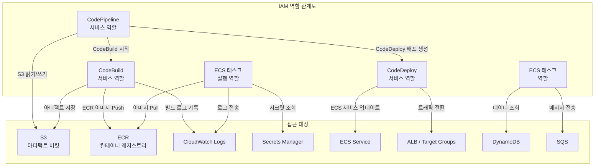

# IAM 역할과 권한 체계

AWS CI/CD 파이프라인에서 ECS까지 이어지는 각 서비스별 IAM 역할의 구조와 최소 권한 원칙 적용 방법을 분석한다. 서비스 역할, 태스크 역할, 크로스 계정 역할의 차이를 명확히 구분하고 실전 정책을 작성한다.

## 목차
- [1. 핵심 개념 (What)](#1-핵심-개념-what)
- [2. 왜 알아야 하는가 (Why)](#2-왜-알아야-하는가-why)
- [3. 내부 구현 분석 (How)](#3-내부-구현-분석-how)
- [4. 실전 예제](#4-실전-예제)
- [5. 정리](#5-정리)

---

## 1. 핵심 개념 (What)

### IAM 역할의 종류

AWS CI/CD + ECS 환경에서 사용되는 주요 IAM 역할은 다음과 같다:

| 역할 | 사용 주체 | 목적 |
|---|---|---|
| **CodePipeline 서비스 역할** | CodePipeline | 파이프라인이 소스, 빌드, 배포 단계에서 다른 AWS 서비스를 호출 |
| **CodeBuild 서비스 역할** | CodeBuild | 빌드 프로젝트가 ECR 푸시, S3 접근, CloudWatch Logs 기록 등 수행 |
| **CodeDeploy 서비스 역할** | CodeDeploy | ECS 서비스 업데이트, Target Group 트래픽 전환 수행 |
| **ECS 태스크 실행 역할** | ECS Agent | 컨테이너 이미지 Pull, 로그 전송, Secrets 조회 |
| **ECS 태스크 역할** | 컨테이너 애플리케이션 | 애플리케이션 코드가 AWS 서비스(S3, DynamoDB 등) 호출 |
| **크로스 계정 역할** | 다른 AWS 계정 | 멀티 계정 환경에서 배포 파이프라인이 타 계정 리소스에 접근 |

### 서비스 역할 vs 태스크 역할

- **서비스 역할(Service Role)**: AWS 서비스가 사용자를 대신하여 다른 AWS 서비스를 호출할 때 사용. Trust Policy에 해당 AWS 서비스의 Principal이 명시된다.
- **태스크 역할(Task Role)**: ECS 태스크 내부의 컨테이너가 AWS SDK를 통해 AWS 서비스를 호출할 때 사용. EC2 인스턴스 프로파일과 유사한 개념이다.

### 태스크 실행 역할 vs 태스크 역할

이 두 역할은 자주 혼동되지만 목적이 완전히 다르다:

```
ECS 태스크 실행 역할 (Execution Role)
├── 사용 시점: 컨테이너 시작 전/중
├── 사용 주체: ECS Agent (인프라 레벨)
└── 용도: ECR 이미지 Pull, CloudWatch Logs 생성, Secrets Manager/SSM 조회

ECS 태스크 역할 (Task Role)
├── 사용 시점: 컨테이너 실행 중
├── 사용 주체: 애플리케이션 코드
└── 용도: S3 읽기/쓰기, DynamoDB 조회, SQS 메시지 전송 등
```

---

## 2. 왜 알아야 하는가 (Why)

### 보안 사고 방지

IAM 역할 설계를 잘못하면 심각한 보안 문제가 발생한다:

1. **과도한 권한 부여**: `AdministratorAccess`를 CI/CD 역할에 부여하면 빌드 스크립트가 임의의 AWS 리소스를 생성/삭제 가능
2. **태스크 역할 미분리**: 태스크 실행 역할에 애플리케이션 권한까지 합치면 ECS Agent 수준에서 불필요한 데이터 접근 가능
3. **크로스 계정 미통제**: 프로덕션 계정의 역할이 개발 계정에서 무제한으로 Assume 가능하면 개발 환경 침해가 프로덕션으로 확산

### 배포 파이프라인 장애 예방

권한 부족으로 인한 배포 실패는 매우 흔하다:

- CodeBuild가 ECR에 이미지를 푸시하지 못해 빌드 실패
- CodeDeploy가 ECS 서비스를 업데이트하지 못해 배포 중단
- 태스크가 Secrets Manager에서 DB 비밀번호를 가져오지 못해 컨테이너 시작 실패

최소 권한 원칙을 적용하되, 필요한 권한은 빠짐없이 부여해야 한다.

### 감사(Audit)와 컴플라이언스

각 역할의 권한 범위가 명확하면:
- CloudTrail에서 어떤 서비스가 어떤 작업을 수행했는지 추적 가능
- 역할 기반 접근 제어(RBAC)로 SOC 2, ISO 27001 등 컴플라이언스 요건 충족
- IAM Access Analyzer로 의도하지 않은 외부 접근 탐지

---

## 3. 내부 구현 분석 (How)

### CI/CD + ECS 역할 관계도



### Trust Policy 구조

각 서비스 역할의 Trust Policy는 해당 AWS 서비스만 Assume할 수 있도록 제한한다:

```json
// CodePipeline 서비스 역할 Trust Policy
{
  "Version": "2012-10-17",
  "Statement": [
    {
      "Effect": "Allow",
      "Principal": {
        "Service": "codepipeline.amazonaws.com"
      },
      "Action": "sts:AssumeRole"
    }
  ]
}
```

```json
// ECS 태스크 실행 역할 Trust Policy
{
  "Version": "2012-10-17",
  "Statement": [
    {
      "Effect": "Allow",
      "Principal": {
        "Service": "ecs-tasks.amazonaws.com"
      },
      "Action": "sts:AssumeRole"
    }
  ]
}
```

### 최소 권한 원칙 적용 전략

1. **리소스 ARN 한정**: `Resource: "*"` 대신 구체적인 ARN 지정
2. **조건 키 활용**: `aws:SourceAccount`, `aws:SourceArn`으로 혼동된 대리인(Confused Deputy) 공격 방지
3. **태그 기반 접근 제어**: `aws:ResourceTag`를 활용하여 환경별(dev/staging/prod) 접근 분리
4. **Permissions Boundary**: 개발자가 생성하는 역할의 최대 권한을 제한

---

## 4. 실전 예제

### 예제 1: CodePipeline 서비스 역할 (CloudFormation)

```yaml
# iam-codepipeline-role.yaml
Resources:
  CodePipelineServiceRole:
    Type: AWS::IAM::Role
    Properties:
      RoleName: codepipeline-ecs-service-role
      AssumeRolePolicyDocument:
        Version: '2012-10-17'
        Statement:
          - Effect: Allow
            Principal:
              Service: codepipeline.amazonaws.com
            Action: sts:AssumeRole
      Policies:
        - PolicyName: CodePipelinePolicy
          PolicyDocument:
            Version: '2012-10-17'
            Statement:
              # S3 아티팩트 버킷 접근
              - Effect: Allow
                Action:
                  - s3:GetObject
                  - s3:GetObjectVersion
                  - s3:PutObject
                  - s3:GetBucketVersioning
                Resource:
                  - !Sub "arn:aws:s3:::${ArtifactBucket}"
                  - !Sub "arn:aws:s3:::${ArtifactBucket}/*"
              # CodeBuild 프로젝트 실행
              - Effect: Allow
                Action:
                  - codebuild:BatchGetBuilds
                  - codebuild:StartBuild
                Resource:
                  - !GetAtt CodeBuildProject.Arn
              # CodeDeploy 배포 생성
              - Effect: Allow
                Action:
                  - codedeploy:CreateDeployment
                  - codedeploy:GetApplication
                  - codedeploy:GetApplicationRevision
                  - codedeploy:GetDeployment
                  - codedeploy:GetDeploymentConfig
                  - codedeploy:RegisterApplicationRevision
                Resource:
                  - !Sub "arn:aws:codedeploy:${AWS::Region}:${AWS::AccountId}:application:${CodeDeployApp}"
                  - !Sub "arn:aws:codedeploy:${AWS::Region}:${AWS::AccountId}:deploymentgroup:${CodeDeployApp}/*"
                  - !Sub "arn:aws:codedeploy:${AWS::Region}:${AWS::AccountId}:deploymentconfig:*"
              # CodeStar Connections (GitHub 연동)
              - Effect: Allow
                Action:
                  - codestar-connections:UseConnection
                Resource:
                  - !Ref GitHubConnection
              # ECS 태스크 정의 등록(PassRole)
              - Effect: Allow
                Action:
                  - ecs:RegisterTaskDefinition
                  - ecs:DescribeTaskDefinition
                Resource: "*"
              - Effect: Allow
                Action:
                  - iam:PassRole
                Resource:
                  - !GetAtt ECSTaskExecutionRole.Arn
                  - !GetAtt ECSTaskRole.Arn
                Condition:
                  StringLike:
                    "iam:PassedToService": "ecs-tasks.amazonaws.com"
```

### 예제 2: CodeBuild 서비스 역할 (Terraform)

```hcl
# iam-codebuild.tf
resource "aws_iam_role" "codebuild" {
  name = "codebuild-ecs-service-role"

  assume_role_policy = jsonencode({
    Version = "2012-10-17"
    Statement = [
      {
        Effect = "Allow"
        Principal = {
          Service = "codebuild.amazonaws.com"
        }
        Action = "sts:AssumeRole"
      }
    ]
  })
}

resource "aws_iam_role_policy" "codebuild" {
  name = "codebuild-policy"
  role = aws_iam_role.codebuild.id

  policy = jsonencode({
    Version = "2012-10-17"
    Statement = [
      # CloudWatch Logs — 빌드 로그 기록
      {
        Effect = "Allow"
        Action = [
          "logs:CreateLogGroup",
          "logs:CreateLogStream",
          "logs:PutLogEvents"
        ]
        Resource = [
          "arn:aws:logs:${var.region}:${var.account_id}:log-group:/aws/codebuild/${var.project_name}",
          "arn:aws:logs:${var.region}:${var.account_id}:log-group:/aws/codebuild/${var.project_name}:*"
        ]
      },
      # ECR — Docker 이미지 빌드 및 푸시
      {
        Effect = "Allow"
        Action = [
          "ecr:BatchCheckLayerAvailability",
          "ecr:CompleteLayerUpload",
          "ecr:InitiateLayerUpload",
          "ecr:PutImage",
          "ecr:UploadLayerPart",
          "ecr:BatchGetImage",
          "ecr:GetDownloadUrlForLayer"
        ]
        Resource = "arn:aws:ecr:${var.region}:${var.account_id}:repository/${var.ecr_repo_name}"
      },
      # ECR — 인증 토큰 획득
      {
        Effect   = "Allow"
        Action   = "ecr:GetAuthorizationToken"
        Resource = "*"
      },
      # S3 — 아티팩트 버킷
      {
        Effect = "Allow"
        Action = [
          "s3:GetObject",
          "s3:PutObject",
          "s3:GetBucketAcl",
          "s3:GetBucketLocation"
        ]
        Resource = [
          var.artifact_bucket_arn,
          "${var.artifact_bucket_arn}/*"
        ]
      },
      # Secrets Manager — 빌드 시 필요한 시크릿 (예: NPM 토큰)
      {
        Effect = "Allow"
        Action = [
          "secretsmanager:GetSecretValue"
        ]
        Resource = "arn:aws:secretsmanager:${var.region}:${var.account_id}:secret:build/*"
      }
    ]
  })
}
```

### 예제 3: ECS 태스크 실행 역할 + 태스크 역할 (CloudFormation)

```yaml
# iam-ecs-roles.yaml
Resources:
  # 태스크 실행 역할 — ECS Agent가 사용
  ECSTaskExecutionRole:
    Type: AWS::IAM::Role
    Properties:
      RoleName: ecs-task-execution-role
      AssumeRolePolicyDocument:
        Version: '2012-10-17'
        Statement:
          - Effect: Allow
            Principal:
              Service: ecs-tasks.amazonaws.com
            Action: sts:AssumeRole
            Condition:
              ArnLike:
                "aws:SourceArn": !Sub "arn:aws:ecs:${AWS::Region}:${AWS::AccountId}:*"
              StringEquals:
                "aws:SourceAccount": !Ref AWS::AccountId
      ManagedPolicyArns:
        - arn:aws:iam::aws:policy/service-role/AmazonECSTaskExecutionRolePolicy
      Policies:
        - PolicyName: SecretsAccess
          PolicyDocument:
            Version: '2012-10-17'
            Statement:
              # Secrets Manager에서 환경변수 주입
              - Effect: Allow
                Action:
                  - secretsmanager:GetSecretValue
                Resource:
                  - !Sub "arn:aws:secretsmanager:${AWS::Region}:${AWS::AccountId}:secret:prod/myapp/*"
              # SSM Parameter Store에서 설정값 주입
              - Effect: Allow
                Action:
                  - ssm:GetParameters
                Resource:
                  - !Sub "arn:aws:ssm:${AWS::Region}:${AWS::AccountId}:parameter/prod/myapp/*"

  # 태스크 역할 — 애플리케이션 코드가 사용
  ECSTaskRole:
    Type: AWS::IAM::Role
    Properties:
      RoleName: ecs-task-role
      AssumeRolePolicyDocument:
        Version: '2012-10-17'
        Statement:
          - Effect: Allow
            Principal:
              Service: ecs-tasks.amazonaws.com
            Action: sts:AssumeRole
            Condition:
              ArnLike:
                "aws:SourceArn": !Sub "arn:aws:ecs:${AWS::Region}:${AWS::AccountId}:*"
              StringEquals:
                "aws:SourceAccount": !Ref AWS::AccountId
      Policies:
        - PolicyName: AppPermissions
          PolicyDocument:
            Version: '2012-10-17'
            Statement:
              # S3 — 사용자 업로드 파일 저장
              - Effect: Allow
                Action:
                  - s3:GetObject
                  - s3:PutObject
                  - s3:DeleteObject
                Resource:
                  - !Sub "arn:aws:s3:::${UserUploadBucket}/*"
              # DynamoDB — 세션 스토어
              - Effect: Allow
                Action:
                  - dynamodb:GetItem
                  - dynamodb:PutItem
                  - dynamodb:UpdateItem
                  - dynamodb:DeleteItem
                  - dynamodb:Query
                Resource:
                  - !GetAtt SessionTable.Arn
                  - !Sub "${SessionTable.Arn}/index/*"
              # SQS — 비동기 작업 큐
              - Effect: Allow
                Action:
                  - sqs:SendMessage
                  - sqs:ReceiveMessage
                  - sqs:DeleteMessage
                  - sqs:GetQueueAttributes
                Resource:
                  - !GetAtt TaskQueue.Arn
```

### 예제 4: 크로스 계정 배포 역할

개발 계정(111111111111)의 파이프라인이 프로덕션 계정(222222222222)에 배포할 때 사용하는 역할 구성이다.

```yaml
# cross-account-role.yaml (프로덕션 계정에 생성)
Resources:
  CrossAccountDeployRole:
    Type: AWS::IAM::Role
    Properties:
      RoleName: cross-account-deploy-role
      AssumeRolePolicyDocument:
        Version: '2012-10-17'
        Statement:
          - Effect: Allow
            Principal:
              AWS: "arn:aws:iam::111111111111:root"  # 개발 계정
            Action: sts:AssumeRole
            Condition:
              StringEquals:
                "sts:ExternalId": "deploy-pipeline-2024"
              ArnLike:
                "aws:PrincipalArn":
                  - "arn:aws:iam::111111111111:role/codepipeline-*"
      MaxSessionDuration: 3600  # 1시간
      Policies:
        - PolicyName: LimitedDeployAccess
          PolicyDocument:
            Version: '2012-10-17'
            Statement:
              - Effect: Allow
                Action:
                  - ecs:UpdateService
                  - ecs:DescribeServices
                  - ecs:RegisterTaskDefinition
                  - ecs:DescribeTaskDefinition
                Resource: "*"
                Condition:
                  StringEquals:
                    "aws:ResourceTag/Environment": "production"
              - Effect: Allow
                Action:
                  - codedeploy:CreateDeployment
                  - codedeploy:GetDeployment
                Resource:
                  - "arn:aws:codedeploy:ap-northeast-2:222222222222:*"
              - Effect: Allow
                Action:
                  - iam:PassRole
                Resource:
                  - "arn:aws:iam::222222222222:role/ecs-task-*"
                Condition:
                  StringEquals:
                    "iam:PassedToService": "ecs-tasks.amazonaws.com"
```

---

## 5. 정리

### 역할별 필수 권한 요약

| 역할 | 핵심 권한 | Trust Principal |
|---|---|---|
| **CodePipeline 서비스 역할** | S3(아티팩트), CodeBuild(StartBuild), CodeDeploy(CreateDeployment), iam:PassRole | `codepipeline.amazonaws.com` |
| **CodeBuild 서비스 역할** | ECR(Push/Pull), CloudWatch Logs, S3(아티팩트), Secrets Manager(빌드 시크릿) | `codebuild.amazonaws.com` |
| **CodeDeploy 서비스 역할** | ECS(UpdateService), ELB(Target Group 수정), Lambda(Hook 실행), CloudWatch(알람 조회) | `codedeploy.amazonaws.com` |
| **ECS 태스크 실행 역할** | ECR(Pull), CloudWatch Logs, Secrets Manager/SSM(환경변수) | `ecs-tasks.amazonaws.com` |
| **ECS 태스크 역할** | 애플리케이션 비즈니스 로직에 필요한 AWS 서비스 (S3, DynamoDB, SQS 등) | `ecs-tasks.amazonaws.com` |

### 최소 권한 원칙 체크리스트

| 원칙 | 적용 방법 |
|---|---|
| 리소스 한정 | `Resource: "*"` 대신 구체적 ARN 사용 |
| 액션 한정 | 와일드카드(`*`) 대신 필요한 API만 명시 |
| 조건 키 활용 | `aws:SourceAccount`, `aws:SourceArn`으로 혼동된 대리인 방지 |
| 역할 분리 | 태스크 실행 역할과 태스크 역할을 반드시 분리 |
| 환경 분리 | 태그 기반 조건(`aws:ResourceTag`)으로 dev/prod 접근 분리 |
| 크로스 계정 | External ID + Principal ARN 제한으로 역할 Assume 통제 |
| Permissions Boundary | 개발자가 만드는 역할의 최대 권한 상한 설정 |

---
*참고: AWS 서비스 최신 버전 기준*
