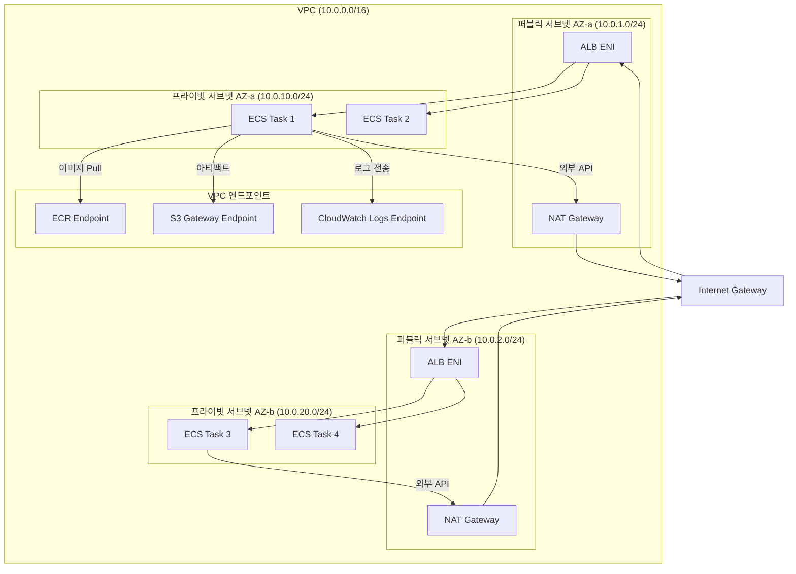
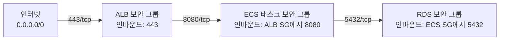

# 네트워킹과 보안

AWS ECS 기반 CI/CD 환경의 네트워크 아키텍처를 설계하고 보안을 강화하는 방법을 다룬다. VPC 구성, 서브넷 설계, 보안 그룹, ALB 리스너/타겟 그룹, NAT Gateway, VPC 엔드포인트까지 프로덕션 환경에 필요한 네트워킹 전략을 분석한다.

## 목차
- [1. 핵심 개념 (What)](#1-핵심-개념-what)
- [2. 왜 알아야 하는가 (Why)](#2-왜-알아야-하는가-why)
- [3. 내부 구현 분석 (How)](#3-내부-구현-분석-how)
- [4. 실전 예제](#4-실전-예제)
- [5. 정리](#5-정리)

---

## 1. 핵심 개념 (What)

### VPC와 서브넷 구성

ECS Fargate 태스크는 VPC 내부에서 실행된다. 보안과 가용성을 위해 퍼블릭/프라이빗 서브넷을 분리하고, 최소 2개 이상의 가용 영역(AZ)에 걸쳐 배치한다.

- **퍼블릭 서브넷**: ALB, NAT Gateway가 위치. 인터넷 게이트웨이를 통해 외부 접근 가능
- **프라이빗 서브넷**: ECS 태스크, RDS 등 백엔드 리소스가 위치. 외부에서 직접 접근 불가

### 보안 그룹 (Security Group)

보안 그룹은 ENI(Elastic Network Interface) 수준의 방화벽이다. ECS Fargate에서는 각 태스크가 자체 ENI를 가지므로(awsvpc 네트워크 모드), 태스크별로 보안 그룹을 적용할 수 있다.

### ALB (Application Load Balancer)

ALB는 L7 로드밸런서로, HTTP/HTTPS 요청을 ECS 태스크로 분배한다. Blue/Green 배포에서는 두 개의 리스너(Production, Test)와 두 개의 Target Group을 사용한다.

### NAT Gateway

프라이빗 서브넷의 ECS 태스크가 외부 인터넷에 접근해야 할 때(예: 외부 API 호출, 패키지 다운로드) NAT Gateway를 통해 아웃바운드 트래픽을 라우팅한다.

### VPC 엔드포인트

VPC 엔드포인트를 사용하면 인터넷을 거치지 않고 AWS 서비스에 접근할 수 있다. NAT Gateway 비용을 절감하고 보안을 강화한다.

---

## 2. 왜 알아야 하는가 (Why)

### 보안 위협 방지

네트워크를 잘못 구성하면 심각한 보안 위험이 발생한다:

1. **ECS 태스크에 퍼블릭 IP 할당**: 프라이빗 서브넷 없이 퍼블릭 서브넷에 태스크를 배치하면 컨테이너가 인터넷에 직접 노출
2. **보안 그룹 과다 개방**: ALB의 보안 그룹에서 모든 포트를 열어두면 공격 표면 확대
3. **VPC 엔드포인트 미사용**: ECR 이미지 Pull 트래픽이 NAT Gateway → 인터넷을 경유하면 데이터 유출 경로가 됨

### 비용 최적화

NAT Gateway는 시간당 과금 + 데이터 처리 비용이 발생한다. ECR, S3, CloudWatch Logs와 같이 빈번히 호출하는 AWS 서비스에 VPC 엔드포인트를 설정하면 NAT Gateway 비용을 크게 절감할 수 있다.

### Blue/Green 배포의 전제 조건

CodeDeploy Blue/Green 배포는 ALB의 리스너와 Target Group 구성이 올바르게 되어 있어야 작동한다. 네트워킹 구성을 이해하지 못하면 배포 자체가 불가능하다.

---

## 3. 내부 구현 분석 (How)

### 전체 네트워크 아키텍처



### 보안 그룹 체인 설계



핵심 원칙: **보안 그룹 참조(Security Group Reference)**를 사용한다. IP 대역 대신 소스 보안 그룹 ID를 지정하면 태스크 IP가 변경되어도 규칙이 유효하다.

### ALB 리스너 / Target Group 구성 (Blue/Green)

```
ALB
├── Production Listener (:443 HTTPS)
│   ├── Default Action → Blue Target Group (port 8080)
│   └── (배포 시 CodeDeploy가 Green Target Group으로 전환)
│
├── Test Listener (:8443 HTTPS)
│   ├── Default Action → Green Target Group (port 8080)
│   └── (배포 중 새 버전 사전 검증용)
│
├── Blue Target Group
│   ├── Target Type: ip (Fargate awsvpc)
│   ├── Health Check: /health, interval=30s, threshold=3
│   └── Deregistration Delay: 30s
│
└── Green Target Group
    ├── Target Type: ip (Fargate awsvpc)
    ├── Health Check: /health, interval=30s, threshold=3
    └── Deregistration Delay: 30s
```

### VPC 엔드포인트 유형

| 엔드포인트 유형 | 대상 서비스 | 비용 |
|---|---|---|
| **Interface Endpoint** | ECR API, ECR DKR, CloudWatch Logs, Secrets Manager, SSM | ENI 시간당 + 데이터 처리 |
| **Gateway Endpoint** | S3, DynamoDB | 무료 |

ECS Fargate에서 ECR 이미지를 Pull하려면 다음 3개 엔드포인트가 모두 필요하다:
1. `com.amazonaws.{region}.ecr.api` — ECR API 호출
2. `com.amazonaws.{region}.ecr.dkr` — Docker 이미지 레이어 다운로드
3. `com.amazonaws.{region}.s3` — 이미지 레이어가 저장된 S3 접근 (Gateway)

---

## 4. 실전 예제

### 예제 1: VPC 및 서브넷 구성 (Terraform)

```hcl
# vpc.tf
resource "aws_vpc" "main" {
  cidr_block           = "10.0.0.0/16"
  enable_dns_support   = true
  enable_dns_hostnames = true

  tags = {
    Name = "ecs-cicd-vpc"
  }
}

# 퍼블릭 서브넷 (ALB, NAT Gateway)
resource "aws_subnet" "public" {
  count             = 2
  vpc_id            = aws_vpc.main.id
  cidr_block        = cidrsubnet("10.0.0.0/16", 8, count.index + 1)  # 10.0.1.0/24, 10.0.2.0/24
  availability_zone = data.aws_availability_zones.available.names[count.index]

  map_public_ip_on_launch = true

  tags = {
    Name = "public-${data.aws_availability_zones.available.names[count.index]}"
    Tier = "public"
  }
}

# 프라이빗 서브넷 (ECS Tasks)
resource "aws_subnet" "private" {
  count             = 2
  vpc_id            = aws_vpc.main.id
  cidr_block        = cidrsubnet("10.0.0.0/16", 8, count.index + 10)  # 10.0.10.0/24, 10.0.11.0/24
  availability_zone = data.aws_availability_zones.available.names[count.index]

  tags = {
    Name = "private-${data.aws_availability_zones.available.names[count.index]}"
    Tier = "private"
  }
}

# Internet Gateway
resource "aws_internet_gateway" "main" {
  vpc_id = aws_vpc.main.id
}

# NAT Gateway (AZ-a)
resource "aws_eip" "nat" {
  domain = "vpc"
}

resource "aws_nat_gateway" "main" {
  allocation_id = aws_eip.nat.id
  subnet_id     = aws_subnet.public[0].id

  tags = {
    Name = "ecs-nat-gateway"
  }
}

# 퍼블릭 라우트 테이블
resource "aws_route_table" "public" {
  vpc_id = aws_vpc.main.id

  route {
    cidr_block = "0.0.0.0/0"
    gateway_id = aws_internet_gateway.main.id
  }
}

resource "aws_route_table_association" "public" {
  count          = 2
  subnet_id      = aws_subnet.public[count.index].id
  route_table_id = aws_route_table.public.id
}

# 프라이빗 라우트 테이블
resource "aws_route_table" "private" {
  vpc_id = aws_vpc.main.id

  route {
    cidr_block     = "0.0.0.0/0"
    nat_gateway_id = aws_nat_gateway.main.id
  }
}

resource "aws_route_table_association" "private" {
  count          = 2
  subnet_id      = aws_subnet.private[count.index].id
  route_table_id = aws_route_table.private.id
}
```

### 예제 2: 보안 그룹 체인 (Terraform)

```hcl
# security-groups.tf

# ALB 보안 그룹
resource "aws_security_group" "alb" {
  name        = "alb-sg"
  description = "ALB security group - allows HTTPS from internet"
  vpc_id      = aws_vpc.main.id

  ingress {
    description = "HTTPS from internet"
    from_port   = 443
    to_port     = 443
    protocol    = "tcp"
    cidr_blocks = ["0.0.0.0/0"]
  }

  # Blue/Green 테스트 리스너
  ingress {
    description = "Test listener for Blue/Green deployment"
    from_port   = 8443
    to_port     = 8443
    protocol    = "tcp"
    cidr_blocks = ["10.0.0.0/8"]  # VPN/내부 네트워크만 허용
  }

  egress {
    from_port   = 0
    to_port     = 0
    protocol    = "-1"
    cidr_blocks = ["0.0.0.0/0"]
  }

  tags = { Name = "alb-sg" }
}

# ECS 태스크 보안 그룹
resource "aws_security_group" "ecs_tasks" {
  name        = "ecs-tasks-sg"
  description = "ECS tasks security group - allows traffic from ALB only"
  vpc_id      = aws_vpc.main.id

  # ALB에서만 트래픽 허용 (보안 그룹 참조)
  ingress {
    description     = "App port from ALB"
    from_port       = 8080
    to_port         = 8080
    protocol        = "tcp"
    security_groups = [aws_security_group.alb.id]
  }

  egress {
    from_port   = 0
    to_port     = 0
    protocol    = "-1"
    cidr_blocks = ["0.0.0.0/0"]
  }

  tags = { Name = "ecs-tasks-sg" }
}

# RDS 보안 그룹
resource "aws_security_group" "rds" {
  name        = "rds-sg"
  description = "RDS security group - allows traffic from ECS tasks only"
  vpc_id      = aws_vpc.main.id

  # ECS 태스크에서만 DB 접근 허용
  ingress {
    description     = "PostgreSQL from ECS tasks"
    from_port       = 5432
    to_port         = 5432
    protocol        = "tcp"
    security_groups = [aws_security_group.ecs_tasks.id]
  }

  tags = { Name = "rds-sg" }
}
```

### 예제 3: ALB + Blue/Green Target Group (CloudFormation)

```yaml
# alb-bluegreen.yaml
Resources:
  # Application Load Balancer
  ALB:
    Type: AWS::ElasticLoadBalancingV2::LoadBalancer
    Properties:
      Name: ecs-alb
      Scheme: internet-facing
      Type: application
      SecurityGroups:
        - !Ref ALBSecurityGroup
      Subnets:
        - !Ref PublicSubnetA
        - !Ref PublicSubnetB

  # Production 리스너 (HTTPS:443)
  ProductionListener:
    Type: AWS::ElasticLoadBalancingV2::Listener
    Properties:
      LoadBalancerArn: !Ref ALB
      Port: 443
      Protocol: HTTPS
      Certificates:
        - CertificateArn: !Ref ACMCertificate
      DefaultActions:
        - Type: forward
          TargetGroupArn: !Ref BlueTargetGroup

  # Test 리스너 (HTTPS:8443) — Blue/Green 배포 사전 검증
  TestListener:
    Type: AWS::ElasticLoadBalancingV2::Listener
    Properties:
      LoadBalancerArn: !Ref ALB
      Port: 8443
      Protocol: HTTPS
      Certificates:
        - CertificateArn: !Ref ACMCertificate
      DefaultActions:
        - Type: forward
          TargetGroupArn: !Ref GreenTargetGroup

  # Blue Target Group
  BlueTargetGroup:
    Type: AWS::ElasticLoadBalancingV2::TargetGroup
    Properties:
      Name: ecs-blue-tg
      VpcId: !Ref VPC
      Protocol: HTTP
      Port: 8080
      TargetType: ip
      HealthCheckPath: /health
      HealthCheckIntervalSeconds: 30
      HealthyThresholdCount: 3
      UnhealthyThresholdCount: 3
      HealthCheckTimeoutSeconds: 5
      TargetGroupAttributes:
        - Key: deregistration_delay.timeout_seconds
          Value: "30"

  # Green Target Group
  GreenTargetGroup:
    Type: AWS::ElasticLoadBalancingV2::TargetGroup
    Properties:
      Name: ecs-green-tg
      VpcId: !Ref VPC
      Protocol: HTTP
      Port: 8080
      TargetType: ip
      HealthCheckPath: /health
      HealthCheckIntervalSeconds: 30
      HealthyThresholdCount: 3
      UnhealthyThresholdCount: 3
      HealthCheckTimeoutSeconds: 5
      TargetGroupAttributes:
        - Key: deregistration_delay.timeout_seconds
          Value: "30"
```

### 예제 4: VPC 엔드포인트 구성 (Terraform)

```hcl
# vpc-endpoints.tf

# VPC 엔드포인트용 보안 그룹
resource "aws_security_group" "vpc_endpoints" {
  name        = "vpc-endpoints-sg"
  description = "Security group for VPC endpoints"
  vpc_id      = aws_vpc.main.id

  ingress {
    description     = "HTTPS from ECS tasks"
    from_port       = 443
    to_port         = 443
    protocol        = "tcp"
    security_groups = [aws_security_group.ecs_tasks.id]
  }

  tags = { Name = "vpc-endpoints-sg" }
}

# ECR API 엔드포인트 (Interface)
resource "aws_vpc_endpoint" "ecr_api" {
  vpc_id              = aws_vpc.main.id
  service_name        = "com.amazonaws.ap-northeast-2.ecr.api"
  vpc_endpoint_type   = "Interface"
  subnet_ids          = aws_subnet.private[*].id
  security_group_ids  = [aws_security_group.vpc_endpoints.id]
  private_dns_enabled = true

  tags = { Name = "ecr-api-endpoint" }
}

# ECR Docker 엔드포인트 (Interface)
resource "aws_vpc_endpoint" "ecr_dkr" {
  vpc_id              = aws_vpc.main.id
  service_name        = "com.amazonaws.ap-northeast-2.ecr.dkr"
  vpc_endpoint_type   = "Interface"
  subnet_ids          = aws_subnet.private[*].id
  security_group_ids  = [aws_security_group.vpc_endpoints.id]
  private_dns_enabled = true

  tags = { Name = "ecr-dkr-endpoint" }
}

# S3 Gateway 엔드포인트 (무료)
resource "aws_vpc_endpoint" "s3" {
  vpc_id            = aws_vpc.main.id
  service_name      = "com.amazonaws.ap-northeast-2.s3"
  vpc_endpoint_type = "Gateway"
  route_table_ids   = [aws_route_table.private.id]

  tags = { Name = "s3-endpoint" }
}

# CloudWatch Logs 엔드포인트 (Interface)
resource "aws_vpc_endpoint" "cloudwatch_logs" {
  vpc_id              = aws_vpc.main.id
  service_name        = "com.amazonaws.ap-northeast-2.logs"
  vpc_endpoint_type   = "Interface"
  subnet_ids          = aws_subnet.private[*].id
  security_group_ids  = [aws_security_group.vpc_endpoints.id]
  private_dns_enabled = true

  tags = { Name = "cloudwatch-logs-endpoint" }
}

# Secrets Manager 엔드포인트 (Interface)
resource "aws_vpc_endpoint" "secretsmanager" {
  vpc_id              = aws_vpc.main.id
  service_name        = "com.amazonaws.ap-northeast-2.secretsmanager"
  vpc_endpoint_type   = "Interface"
  subnet_ids          = aws_subnet.private[*].id
  security_group_ids  = [aws_security_group.vpc_endpoints.id]
  private_dns_enabled = true

  tags = { Name = "secretsmanager-endpoint" }
}
```

---

## 5. 정리

### 네트워크 구성 요약

| 구성 요소 | 위치 | 역할 |
|---|---|---|
| **ALB** | 퍼블릭 서브넷 | 외부 트래픽을 ECS 태스크로 분배 |
| **NAT Gateway** | 퍼블릭 서브넷 | 프라이빗 서브넷의 아웃바운드 인터넷 제공 |
| **ECS Tasks** | 프라이빗 서브넷 | 애플리케이션 실행, 외부 직접 노출 차단 |
| **RDS** | 프라이빗 서브넷 | 데이터베이스, ECS 태스크에서만 접근 |
| **VPC 엔드포인트** | VPC 내부 | AWS 서비스에 프라이빗 접근 (인터넷 우회) |

### 보안 그룹 설계 원칙

| 원칙 | 구현 방법 |
|---|---|
| 최소 포트 개방 | 필요한 포트만 명시적으로 열기 |
| 보안 그룹 참조 | IP 대역 대신 소스 Security Group ID 사용 |
| 계층적 체인 | Internet → ALB SG → ECS SG → RDS SG |
| 테스트 리스너 격리 | 8443 포트는 VPN/내부 네트워크에서만 접근 |

### VPC 엔드포인트 필수 구성

| 서비스 | 엔드포인트 유형 | ECS Fargate 필수 여부 |
|---|---|---|
| ECR API (`ecr.api`) | Interface | 필수 (NAT 없을 시) |
| ECR Docker (`ecr.dkr`) | Interface | 필수 (NAT 없을 시) |
| S3 | Gateway | 필수 (이미지 레이어 저장소) |
| CloudWatch Logs | Interface | 권장 (로그 비용 절감) |
| Secrets Manager | Interface | 권장 (시크릿 조회 시) |
| SSM | Interface | 권장 (파라미터 스토어 사용 시) |

---
*참고: AWS 서비스 최신 버전 기준*
