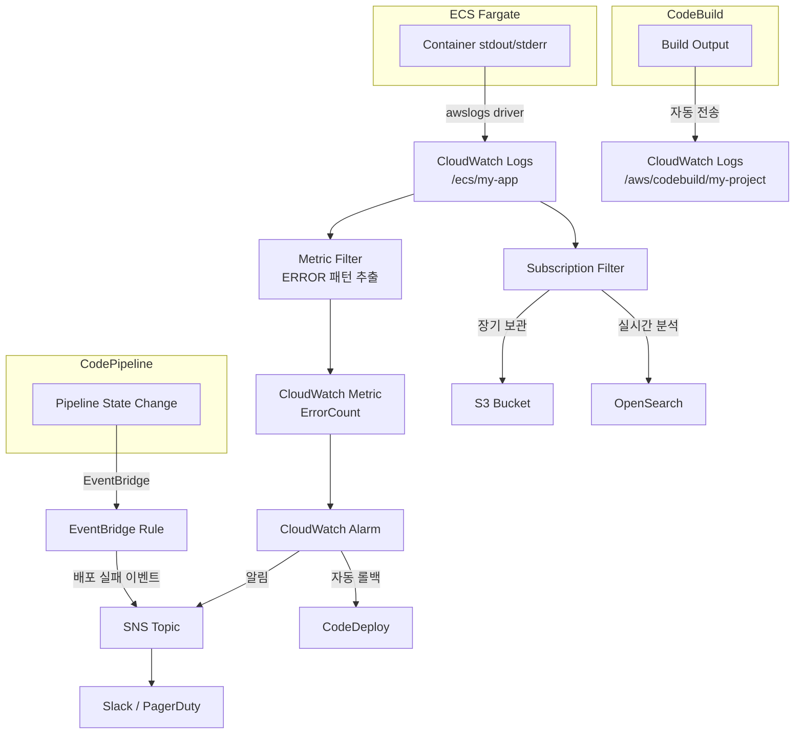
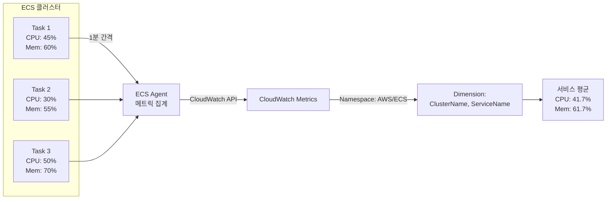

# CloudWatch 모니터링과 로깅

ECS 기반 CI/CD 환경에서 CloudWatch를 활용한 컨테이너 로깅, 빌드/배포 모니터링, 메트릭 수집, 알람 설정, 운영 대시보드 구성 방법을 분석한다. awslogs 드라이버부터 배포 상태 추적까지 프로덕션 관측성(Observability)의 핵심을 다룬다.

## 목차
- [1. 핵심 개념 (What)](#1-핵심-개념-what)
- [2. 왜 알아야 하는가 (Why)](#2-왜-알아야-하는가-why)
- [3. 내부 구현 분석 (How)](#3-내부-구현-분석-how)
- [4. 실전 예제](#4-실전-예제)
- [5. 정리](#5-정리)

---

## 1. 핵심 개념 (What)

### ECS 컨테이너 로깅 — awslogs 드라이버

ECS Fargate에서 컨테이너 로그를 수집하는 기본 방법은 `awslogs` 로그 드라이버다. 컨테이너의 stdout/stderr 출력이 CloudWatch Logs로 직접 전송된다.

- **Log Group**: 로그를 저장하는 논리적 단위. 보존 기간, 암호화 정책을 설정
- **Log Stream**: Log Group 내에서 개별 컨테이너 인스턴스(태스크)별로 생성되는 스트림
- **Log Driver**: 태스크 정의의 `logConfiguration`에서 `awslogs`를 지정

### CodeBuild 빌드 로그

CodeBuild는 빌드 프로세스의 전체 출력을 자동으로 CloudWatch Logs에 기록한다. 로그 그룹 경로는 `/aws/codebuild/{project-name}`이다.

### CodePipeline 실행 이벤트

CodePipeline은 파이프라인 상태 변경 시 Amazon EventBridge(CloudWatch Events)로 이벤트를 발행한다. 이를 활용하여 배포 성공/실패 알림, 자동화 트리거 등을 구성할 수 있다.

### CloudWatch 메트릭

ECS는 다음 핵심 메트릭을 CloudWatch에 자동 보고한다:

| 메트릭 | 단위 | 설명 |
|---|---|---|
| `CPUUtilization` | % | 태스크/서비스의 CPU 사용률 |
| `MemoryUtilization` | % | 태스크/서비스의 메모리 사용률 |
| `RunningTaskCount` | 개 | 현재 실행 중인 태스크 수 |
| `DesiredTaskCount` | 개 | 목표 태스크 수 |

### CloudWatch 알람

메트릭 임계값을 기반으로 알람을 설정하여 SNS 알림, Auto Scaling 트리거, CodeDeploy 자동 롤백 등의 액션을 수행할 수 있다.

---

## 2. 왜 알아야 하는가 (Why)

### 장애 대응 속도 결정

모니터링 없이는 문제를 인지하는 시점이 "고객 불만 접수"가 된다. 체계적인 모니터링이 있으면:

1. **컨테이너 크래시**: 로그에서 에러 스택 트레이스를 즉시 확인
2. **리소스 부족**: CPU/메모리 사용률 급증을 알람으로 사전 감지
3. **배포 실패**: CodeDeploy 배포 실패 이벤트를 실시간으로 Slack/PagerDuty에 전달

### 배포 품질 보증

CodeDeploy Blue/Green 배포에서 CloudWatch 알람을 자동 롤백 조건으로 연동하면, 새 버전 배포 후 에러율이 급증할 때 자동으로 이전 버전으로 돌아간다. 이는 알람 설정이 올바르게 되어 있어야만 작동한다.

### 비용 가시성

CloudWatch 메트릭을 기반으로 ECS Auto Scaling을 구성하면 트래픽에 맞게 태스크 수를 조절하여 비용을 최적화할 수 있다. 반대로 메트릭 없이는 과다 프로비저닝이나 성능 저하를 방치하게 된다.

### 운영 효율화

중앙화된 대시보드에서 파이프라인 상태, 빌드 결과, 서비스 상태, 리소스 사용률을 한눈에 볼 수 있으면 운영 팀의 상황 인지(Situational Awareness)가 크게 향상된다.

---

## 3. 내부 구현 분석 (How)

### 로깅 아키텍처



### awslogs 드라이버 동작 원리

```
ECS Task
├── Container (PID 1)
│   ├── stdout → awslogs driver → CloudWatch Logs PutLogEvents API
│   └── stderr → awslogs driver → CloudWatch Logs PutLogEvents API
│
└── logConfiguration:
    ├── logDriver: "awslogs"
    └── options:
        ├── awslogs-group: "/ecs/my-app"
        ├── awslogs-region: "ap-northeast-2"
        ├── awslogs-stream-prefix: "ecs"
        └── awslogs-datetime-format: "%Y-%m-%d %H:%M:%S"
```

로그 스트림 이름 형식: `{prefix}/{container-name}/{task-id}`
예시: `ecs/my-app-container/a1b2c3d4e5f6`

### ECS 메트릭 수집 경로



ECS 메트릭의 Dimension 구조:
- **클러스터 수준**: `ClusterName` — 클러스터 전체 집계
- **서비스 수준**: `ClusterName` + `ServiceName` — 서비스별 집계

> **중요**: Container Insights를 활성화하면 태스크/컨테이너 수준 메트릭과 네트워크, 디스크 I/O 메트릭도 수집 가능하다.

### CodePipeline EventBridge 이벤트 구조

```json
{
  "source": "aws.codepipeline",
  "detail-type": "CodePipeline Pipeline Execution State Change",
  "detail": {
    "pipeline": "my-ecs-pipeline",
    "execution-id": "12345678-1234-1234-1234-123456789012",
    "state": "FAILED",
    "version": 3
  }
}
```

주요 이벤트 유형:
| detail-type | 용도 |
|---|---|
| `CodePipeline Pipeline Execution State Change` | 파이프라인 전체 상태 (STARTED/SUCCEEDED/FAILED) |
| `CodePipeline Stage Execution State Change` | 스테이지별 상태 |
| `CodePipeline Action Execution State Change` | 개별 액션 상태 |

---

## 4. 실전 예제

### 예제 1: ECS 태스크 정의 — awslogs 로그 구성 (CloudFormation)

```yaml
# task-definition-logging.yaml
Resources:
  # 로그 그룹 — 보존 기간 및 암호화 설정
  ECSLogGroup:
    Type: AWS::Logs::LogGroup
    Properties:
      LogGroupName: /ecs/my-app
      RetentionInDays: 30
      KmsKeyId: !GetAtt LogEncryptionKey.Arn

  # 태스크 정의 — awslogs 드라이버 설정
  TaskDefinition:
    Type: AWS::ECS::TaskDefinition
    Properties:
      Family: my-app
      Cpu: "512"
      Memory: "1024"
      NetworkMode: awsvpc
      RequiresCompatibilities:
        - FARGATE
      ExecutionRoleArn: !GetAtt ECSTaskExecutionRole.Arn
      TaskRoleArn: !GetAtt ECSTaskRole.Arn
      ContainerDefinitions:
        - Name: my-app-container
          Image: !Sub "${AWS::AccountId}.dkr.ecr.${AWS::Region}.amazonaws.com/my-app:latest"
          Essential: true
          PortMappings:
            - ContainerPort: 8080
              Protocol: tcp
          LogConfiguration:
            LogDriver: awslogs
            Options:
              awslogs-group: /ecs/my-app
              awslogs-region: !Ref AWS::Region
              awslogs-stream-prefix: ecs
              # 멀티라인 로그 지원 — Java 스택 트레이스 등
              awslogs-datetime-format: "%Y-%m-%d %H:%M:%S"
              # 로그 버퍼링 설정
              mode: non-blocking
              max-buffer-size: "4m"
          # 사이드카: Fluent Bit (고급 로그 라우팅)
        - Name: log-router
          Image: public.ecr.aws/aws-observability/aws-for-fluent-bit:stable
          Essential: false
          FirelensConfiguration:
            Type: fluentbit
            Options:
              config-file-type: file
              config-file-value: /fluent-bit/configs/parse-json.conf
          LogConfiguration:
            LogDriver: awslogs
            Options:
              awslogs-group: /ecs/my-app-firelens
              awslogs-region: !Ref AWS::Region
              awslogs-stream-prefix: firelens
```

### 예제 2: CloudWatch 메트릭 필터 + 알람 (Terraform)

애플리케이션 로그에서 ERROR 패턴을 추출하여 메트릭으로 변환하고, 임계값 초과 시 알람을 발생시킨다.

```hcl
# cloudwatch-alarms.tf

# 로그에서 ERROR 패턴 추출 → 커스텀 메트릭
resource "aws_cloudwatch_log_metric_filter" "error_count" {
  name           = "app-error-count"
  pattern        = "[timestamp, level = \"ERROR\", ...]"
  log_group_name = "/ecs/my-app"

  metric_transformation {
    name          = "AppErrorCount"
    namespace     = "Custom/ECS"
    value         = "1"
    default_value = "0"
  }
}

# 에러율 알람 — 5분간 에러 10회 이상
resource "aws_cloudwatch_metric_alarm" "high_error_rate" {
  alarm_name          = "ecs-high-error-rate"
  comparison_operator = "GreaterThanOrEqualToThreshold"
  evaluation_periods  = 1
  metric_name         = "AppErrorCount"
  namespace           = "Custom/ECS"
  period              = 300
  statistic           = "Sum"
  threshold           = 10
  alarm_description   = "5분간 애플리케이션 에러 10회 이상 발생"
  treat_missing_data  = "notBreaching"

  alarm_actions = [aws_sns_topic.alerts.arn]
  ok_actions    = [aws_sns_topic.alerts.arn]
}

# CPU 사용률 알람 — 80% 초과 시
resource "aws_cloudwatch_metric_alarm" "high_cpu" {
  alarm_name          = "ecs-high-cpu"
  comparison_operator = "GreaterThanThreshold"
  evaluation_periods  = 3
  metric_name         = "CPUUtilization"
  namespace           = "AWS/ECS"
  period              = 60
  statistic           = "Average"
  threshold           = 80
  alarm_description   = "ECS 서비스 CPU 사용률 80% 초과 (3분 연속)"

  dimensions = {
    ClusterName = var.cluster_name
    ServiceName = var.service_name
  }

  alarm_actions = [
    aws_sns_topic.alerts.arn,
    aws_appautoscaling_policy.scale_out.arn
  ]
}

# 메모리 사용률 알람 — 85% 초과 시
resource "aws_cloudwatch_metric_alarm" "high_memory" {
  alarm_name          = "ecs-high-memory"
  comparison_operator = "GreaterThanThreshold"
  evaluation_periods  = 3
  metric_name         = "MemoryUtilization"
  namespace           = "AWS/ECS"
  period              = 60
  statistic           = "Average"
  threshold           = 85
  alarm_description   = "ECS 서비스 메모리 사용률 85% 초과 (3분 연속)"

  dimensions = {
    ClusterName = var.cluster_name
    ServiceName = var.service_name
  }

  alarm_actions = [aws_sns_topic.alerts.arn]
}

# Running Task Count 알람 — desired보다 적을 때
resource "aws_cloudwatch_metric_alarm" "task_count_low" {
  alarm_name          = "ecs-task-count-low"
  comparison_operator = "LessThanThreshold"
  evaluation_periods  = 2
  metric_name         = "RunningTaskCount"
  namespace           = "ECS/ContainerInsights"
  period              = 60
  statistic           = "Average"
  threshold           = var.desired_count
  alarm_description   = "실행 중인 태스크 수가 desired count 미만"

  dimensions = {
    ClusterName = var.cluster_name
    ServiceName = var.service_name
  }

  alarm_actions = [aws_sns_topic.alerts.arn]
}

# SNS 토픽
resource "aws_sns_topic" "alerts" {
  name = "ecs-monitoring-alerts"
}
```

### 예제 3: CodePipeline/CodeDeploy 이벤트 알림 (CloudFormation)

```yaml
# pipeline-events.yaml
Resources:
  # 파이프라인 실패 이벤트 규칙
  PipelineFailedRule:
    Type: AWS::Events::Rule
    Properties:
      Name: pipeline-execution-failed
      Description: "CodePipeline 실행 실패 알림"
      EventPattern:
        source:
          - aws.codepipeline
        detail-type:
          - "CodePipeline Pipeline Execution State Change"
        detail:
          state:
            - FAILED
          pipeline:
            - !Ref MyPipeline
      Targets:
        - Arn: !Ref AlertsSNSTopic
          Id: pipeline-failed-sns
          InputTransformer:
            InputPathsMap:
              pipeline: "$.detail.pipeline"
              state: "$.detail.state"
              executionId: "$.detail.execution-id"
            InputTemplate: |
              "[파이프라인 실패] <pipeline> 파이프라인이 실패했습니다. (Execution: <executionId>)"

  # CodeDeploy 배포 상태 변경 이벤트 규칙
  DeploymentStateRule:
    Type: AWS::Events::Rule
    Properties:
      Name: codedeploy-deployment-state
      Description: "CodeDeploy 배포 상태 변경 알림"
      EventPattern:
        source:
          - aws.codedeploy
        detail-type:
          - "CodeDeploy Deployment State-change Notification"
        detail:
          state:
            - FAILURE
            - STOP
          application:
            - !Ref CodeDeployApp
      Targets:
        - Arn: !Ref AlertsSNSTopic
          Id: deploy-state-sns

  # CodeDeploy 배포 롤백 이벤트 규칙
  DeploymentRollbackRule:
    Type: AWS::Events::Rule
    Properties:
      Name: codedeploy-rollback
      Description: "CodeDeploy 자동 롤백 알림"
      EventPattern:
        source:
          - aws.codedeploy
        detail-type:
          - "CodeDeploy Deployment State-change Notification"
        detail:
          state:
            - FAILURE
          deploymentOverview:
            Rollback:
              - "true"
      Targets:
        - Arn: !Ref AlertsSNSTopic
          Id: deploy-rollback-sns

  # SNS → Slack 연동 Lambda
  SlackNotificationFunction:
    Type: AWS::Lambda::Function
    Properties:
      FunctionName: slack-pipeline-notification
      Runtime: python3.12
      Handler: index.handler
      Role: !GetAtt SlackLambdaRole.Arn
      Environment:
        Variables:
          SLACK_WEBHOOK_URL: !Sub "{{resolve:secretsmanager:slack/webhook:SecretString:url}}"
      Code:
        ZipFile: |
          import json
          import os
          import urllib.request

          def handler(event, context):
              message = event['Records'][0]['Sns']['Message']
              webhook_url = os.environ['SLACK_WEBHOOK_URL']
              
              slack_payload = {
                  "text": f":rotating_light: *AWS CI/CD Alert*\n```{message}```",
                  "channel": "#deploy-alerts"
              }
              
              req = urllib.request.Request(
                  webhook_url,
                  data=json.dumps(slack_payload).encode('utf-8'),
                  headers={'Content-Type': 'application/json'}
              )
              urllib.request.urlopen(req)
              return {'statusCode': 200}

  SNSToSlackSubscription:
    Type: AWS::SNS::Subscription
    Properties:
      TopicArn: !Ref AlertsSNSTopic
      Protocol: lambda
      Endpoint: !GetAtt SlackNotificationFunction.Arn
```

### 예제 4: 배포 상태 대시보드 (Terraform)

```hcl
# dashboard.tf
resource "aws_cloudwatch_dashboard" "ecs_cicd" {
  dashboard_name = "ECS-CICD-Dashboard"

  dashboard_body = jsonencode({
    widgets = [
      # 행 1: 서비스 상태 개요
      {
        type   = "metric"
        x      = 0
        y      = 0
        width  = 12
        height = 6
        properties = {
          title   = "ECS Service - CPU / Memory Utilization"
          metrics = [
            ["AWS/ECS", "CPUUtilization", "ClusterName", var.cluster_name, "ServiceName", var.service_name, { stat = "Average", label = "CPU %" }],
            ["AWS/ECS", "MemoryUtilization", "ClusterName", var.cluster_name, "ServiceName", var.service_name, { stat = "Average", label = "Memory %" }]
          ]
          period = 60
          view   = "timeSeries"
          yAxis  = { left = { min = 0, max = 100 } }
          annotations = {
            horizontal = [
              { label = "CPU Alarm", value = 80, color = "#ff0000" },
              { label = "Memory Alarm", value = 85, color = "#ff6600" }
            ]
          }
        }
      },
      {
        type   = "metric"
        x      = 12
        y      = 0
        width  = 12
        height = 6
        properties = {
          title   = "ECS Task Count"
          metrics = [
            ["ECS/ContainerInsights", "RunningTaskCount", "ClusterName", var.cluster_name, "ServiceName", var.service_name, { stat = "Average", label = "Running" }],
            ["ECS/ContainerInsights", "DesiredTaskCount", "ClusterName", var.cluster_name, "ServiceName", var.service_name, { stat = "Average", label = "Desired" }]
          ]
          period = 60
          view   = "timeSeries"
          yAxis  = { left = { min = 0 } }
        }
      },
      # 행 2: 애플리케이션 에러 및 ALB 메트릭
      {
        type   = "metric"
        x      = 0
        y      = 6
        width  = 12
        height = 6
        properties = {
          title   = "Application Error Count"
          metrics = [
            ["Custom/ECS", "AppErrorCount", { stat = "Sum", label = "Errors", color = "#ff0000" }]
          ]
          period = 300
          view   = "timeSeries"
        }
      },
      {
        type   = "metric"
        x      = 12
        y      = 6
        width  = 12
        height = 6
        properties = {
          title   = "ALB Metrics"
          metrics = [
            ["AWS/ApplicationELB", "HTTPCode_Target_5XX_Count", "LoadBalancer", var.alb_arn_suffix, { stat = "Sum", label = "5XX", color = "#ff0000" }],
            ["AWS/ApplicationELB", "HTTPCode_Target_2XX_Count", "LoadBalancer", var.alb_arn_suffix, { stat = "Sum", label = "2XX", color = "#00aa00" }],
            ["AWS/ApplicationELB", "TargetResponseTime", "LoadBalancer", var.alb_arn_suffix, { stat = "p99", label = "Latency p99", yAxis = "right" }]
          ]
          period = 60
          view   = "timeSeries"
        }
      },
      # 행 3: 최근 로그 및 파이프라인 상태
      {
        type   = "log"
        x      = 0
        y      = 12
        width  = 24
        height = 6
        properties = {
          title  = "Recent Application Errors"
          query  = "SOURCE '/ecs/my-app' | fields @timestamp, @message | filter @message like /ERROR/ | sort @timestamp desc | limit 20"
          region = var.region
          view   = "table"
        }
      }
    ]
  })
}
```

---

## 5. 정리

### 로깅 구성 요약

| 로그 소스 | Log Group 경로 | 자동/수동 |
|---|---|---|
| ECS 컨테이너 (awslogs) | `/ecs/{app-name}` | 태스크 정의에서 설정 |
| CodeBuild 빌드 로그 | `/aws/codebuild/{project-name}` | 자동 생성 |
| CodePipeline 이벤트 | EventBridge → SNS/Lambda | EventBridge Rule 설정 |
| CodeDeploy 배포 상태 | EventBridge → SNS/Lambda | EventBridge Rule 설정 |

### 핵심 알람 설정 가이드

| 알람 | 메트릭 | 임계값 (권장) | 액션 |
|---|---|---|---|
| CPU 과부하 | `AWS/ECS CPUUtilization` | > 80% (3분) | SNS 알림 + Auto Scaling |
| 메모리 과부하 | `AWS/ECS MemoryUtilization` | > 85% (3분) | SNS 알림 |
| 태스크 부족 | `RunningTaskCount` | < desired count (2분) | SNS 알림 |
| 앱 에러 급증 | Custom `AppErrorCount` | >= 10 (5분) | SNS 알림 + CodeDeploy 롤백 |
| ALB 5XX 급증 | `HTTPCode_Target_5XX_Count` | >= 50 (5분) | SNS 알림 |
| 응답 지연 | `TargetResponseTime` p99 | > 3s (5분) | SNS 알림 |

### 모니터링 체크리스트

| 항목 | 구현 방법 |
|---|---|
| 컨테이너 로그 수집 | 태스크 정의에 awslogs 드라이버 설정 |
| 로그 보존 기간 설정 | Log Group의 `RetentionInDays` (30/60/90일) |
| 에러 패턴 모니터링 | Metric Filter로 ERROR 로그 → 커스텀 메트릭 변환 |
| 리소스 알람 | CPU/Memory 임계값 알람 설정 |
| 배포 알림 | EventBridge Rule로 CodePipeline/CodeDeploy 이벤트 캡처 |
| 자동 롤백 연동 | CloudWatch 알람을 CodeDeploy 배포 그룹에 연결 |
| 운영 대시보드 | CloudWatch Dashboard로 메트릭/로그 통합 시각화 |
| Container Insights | 클러스터 수준에서 활성화 — 태스크/컨테이너 상세 메트릭 수집 |

---
*참고: AWS 서비스 최신 버전 기준*
