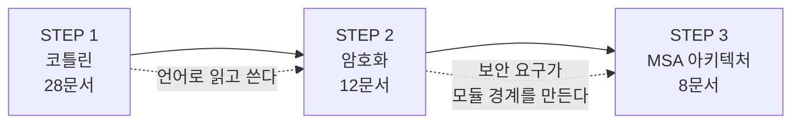

# 학습 계획: 코틀린 → 암호화 → MSA 아키텍처

세 주제를 순서대로 학습하기 위한 로드맵이다. 각 단계는 앞 단계를 전제로 하며, 문서는 **번호 순서대로** 읽으면 된다. 총 60개 문서.

## 목차
- [1. 학습 순서와 근거](#1-학습-순서와-근거)
- [2. STEP 1 — 코틀린 (28문서)](#2-step-1--코틀린-28문서)
- [3. STEP 2 — 암호화 (12문서)](#3-step-2--암호화-12문서)
- [4. STEP 3 — MSA 아키텍처 (8문서)](#4-step-3--msa-아키텍처-8문서)
- [5. 학습 방법](#5-학습-방법)

---

## 1. 학습 순서와 근거

**왜 이 순서인가**

1. **코틀린이 먼저인 이유** — 이후 두 주제의 예제 코드가 전부 Kotlin이다. 언어를 읽지 못하면 암호화 구현도 아키텍처 예제도 겉핥기가 된다. 도구를 먼저 손에 익히는 단계.

2. **암호화가 중간인 이유** — 비교적 경계가 뚜렷하고 정답이 명확한 영역이다. "IV를 재사용하면 뚫린다" 같은 판단 기준이 분명해서, 원리를 배우면 바로 코드에 적용된다. 코틀린으로 실제 구현을 해보며 언어에 익숙해지는 효과도 있다.

3. **MSA 아키텍처가 마지막인 이유** — 정답이 없고 트레이드오프만 있는 영역이다. 언어와 구현 경험이 쌓인 뒤에 봐야 "왜 이 경계를 이렇게 그었나"가 체감된다. 게다가 암호화 키 관리·인증 경계는 실제로 모듈 경계를 나누는 주요 기준 중 하나라, 앞 단계가 사례로 쓰인다.

---

## 2. STEP 1 — 코틀린 (28문서)

경로: `kotlin/`

이미 완비된 커리큘럼이다. **문법을 외우는 게 목적이 아니라, 코드를 읽고 판별하는 능력**을 만드는 게 목표다.

### 기초 (kotlin/ 루트 + main/)

| # | 문서 | 핵심 |
|---|------|------|
| 1 | [Kotlin 기초 문법](../kotlin/01-kotlin-basics.md) | 변수, 함수, 클래스, null 안전성 개괄 |
| 2 | [코틀린 설계 철학과 특징](../kotlin/main/01-kotlin-overview.md) | 컴파일 파이프라인, JVM 바이트코드 변환 |
| 3 | [타입 시스템과 Null 안전성](../kotlin/main/02-type-system-null-safety.md) | 스마트 캐스트, 플랫폼 타입 |
| 4 | [클래스, 객체, 상속](../kotlin/main/03-classes-and-objects.md) | 주 생성자, init 순서, sealed |
| 5 | [data / sealed / enum class](../kotlin/main/04-data-sealed-enum.md) | 자동 생성 코드, when 완전성 |
| 6 | [컴패니언 객체와 팩토리 패턴](../kotlin/main/05-companion-object.md) | static과의 차이, 바이트코드 |
| 7 | [확장 함수와 확장 프로퍼티](../kotlin/main/06-extension-functions.md) | 정적 디스패치의 의미 |
| 8 | [스코프 함수 5총사](../kotlin/main/07-scope-functions.md) | this vs it, 선택 기준 |
| 9 | [컬렉션 API와 시퀀스](../kotlin/main/08-collections-sequences.md) | 즉시 평가 vs 지연 평가 |
| 10 | [람다와 고차 함수](../kotlin/main/09-lambdas-higher-order.md) | 클로저, SAM 변환, 함수 참조 |
| 11 | [프로퍼티 위임과 클래스 위임](../kotlin/main/10-delegation.md) | by lazy 내부 구현 |
| 12 | [제네릭과 변성](../kotlin/main/11-generics-variance.md) | in/out, 타입 소거 |
| 13 | [DSL과 빌더 패턴](../kotlin/main/12-dsl-builder.md) | 수신 객체 람다, @DslMarker |
| 14 | [라벨과 반환](../kotlin/main/13-labels-and-returns.md) | `return@label`, 비지역 반환 |
| 15 | [기호와 관용구 역인덱스](../kotlin/main/14-symbols-and-idioms.md) | `::` `?:` `@field:` 등 기호 사전 |

> **14~15번은 참조용으로 계속 쓰는 문서다.** 코드를 읽다 모르는 기호를 만나면 15번에서 찾는다.

### 실무 (kotlin/advanced/)

| # | 문서 | 핵심 |
|---|------|------|
| 16 | [Kotlin + Spring Boot 설정](../kotlin/advanced/01-kotlin-spring-boot.md) | all-open, no-arg 플러그인 |
| 17 | [JPA 엔티티 Kotlin 패턴](../kotlin/advanced/02-jpa-entities-kotlin.md) | data class를 엔티티로 쓰면 안 되는 이유 |
| 18 | [생성자 주입과 Kotlin](../kotlin/advanced/03-dependency-injection.md) | 주 생성자 주입 |
| 19 | [코루틴 기초](../kotlin/advanced/04-coroutines-basics.md) | suspend의 CPS 변환 |
| 20 | [Flow와 리액티브 스트림](../kotlin/advanced/05-coroutines-flow.md) | Cold/Hot 스트림 |
| 21 | [구조적 동시성](../kotlin/advanced/06-structured-concurrency.md) | Job 트리, 취소 전파 |
| 22 | [Kotlin 테스트 패턴](../kotlin/advanced/07-testing-kotlin.md) | MockK, runTest |
| 23 | [Java 상호 운용성](../kotlin/advanced/08-java-interop.md) | 플랫폼 타입, @Jvm* |
| 24 | [에러 처리 패턴](../kotlin/advanced/09-error-handling-patterns.md) | Result, sealed 에러 모델 |
| 25 | [함수형 프로그래밍 패턴](../kotlin/advanced/10-functional-patterns.md) | 불변성, 함수 합성 |
| 26 | [인라인 함수와 성능 최적화](../kotlin/advanced/11-inline-performance.md) | inline/crossinline/reified |
| 27 | [Kotlin 코딩 컨벤션](../kotlin/advanced/12-best-practices.md) | 안티패턴 |
| 28 | [표준 라이브러리 읽기와 Contract](../kotlin/advanced/13-stdlib-reading-and-contracts.md) | contract, stdlib 읽는 법 |

**우선순위가 급하다면**: 3 → 5 → 8 → 10 → 14 → 15 → 17 → 19 → 21 → 26 → 28 순으로 먼저 본다.

---

## 3. STEP 2 — 암호화 (12문서)

경로: `security/`

기존 `security/` 루트 2개 문서(인증/인가, JWT)를 먼저 훑고 시작하면 맥락이 잡힌다.

### 원리 (security/main/)

| # | 문서 | 핵심 |
|---|------|------|
| 1 | [암호화 기초: 대칭키와 비대칭키](../security/main/01-encryption-fundamentals.md) | 위협 모델, 인코딩≠암호화≠해싱 |
| 2 | [AES 알고리즘 구조](../security/main/02-aes-algorithm-structure.md) | 블록 암호, 라운드, 키 크기 |
| 3 | [블록 암호 운용 모드](../security/main/03-block-cipher-modes.md) | ECB/CBC/CTR/GCM 선택 기준 |
| 4 | [IV와 Nonce](../security/main/04-iv-and-nonce.md) | 재사용 사고, SecureRandom |
| 5 | [패딩과 패딩 오라클 공격](../security/main/05-padding-and-oracle-attack.md) | PKCS#7, POODLE |
| 6 | [AEAD와 인증 암호화](../security/main/06-aead-authenticated-encryption.md) | GCM 태그, AAD, 비트 플리핑 |
| 7 | [해시와 비밀번호 저장](../security/main/07-hashing-and-password-storage.md) | BCrypt/Argon2, salt/pepper |
| 8 | [비대칭키와 전자서명](../security/main/08-asymmetric-crypto-and-signature.md) | RSA/ECDSA, alg=none 취약점 |

### 실무 (security/advanced/)

| # | 문서 | 핵심 |
|---|------|------|
| 9 | [키 관리와 봉투 암호화](../security/advanced/01-key-management-envelope-encryption.md) | DEK/KEK, KMS, 키 로테이션 |
| 10 | [DB 필드 암호화 실전](../security/advanced/02-database-field-encryption.md) | AttributeConverter, blind index |
| 11 | [Spring Boot 암호화 실무](../security/advanced/03-spring-boot-encryption-practice.md) | Jasypt, 시크릿 관리 |
| 12 | [TLS와 전송 구간 암호화](../security/advanced/04-tls-and-transport-security.md) | 핸드셰이크, mTLS |

**이 단계의 목표**: "AES 쓰면 안전하다"에서 **"어떤 모드로, IV를 어떻게 만들고, 키를 어디에 두는가"** 를 판단할 수 있는 상태로.

관련 기존 문서: [백엔드 보안 기초](../security/01-backend-security-fundamentals.md), [JWT/JWK/OAuth 비교](../security/02-jwt-jwk-oauth-comparison.md), [HTTP vs HTTPS](../network/10-http-vs-https.md)

---

## 4. STEP 3 — MSA 아키텍처 (8문서)

경로: `MSA/`

`MSA/01`~`09`(기초·통신·게이트웨이·EDA·saga·outbox·서킷브레이커·추적·트러블슈팅)는 이미 있으니, **모듈 경계와 의존성 규칙**을 다루는 10번부터가 이번 학습 대상이다.

| # | 문서 | 핵심 |
|---|------|------|
| 1 | [의존성 규칙의 원리: DIP](../MSA/10-dependency-rules-and-dip.md) | 의존성 역전, 안정 의존 원칙 |
| 2 | [레이어드 아키텍처와 그 한계](../MSA/11-layered-architecture-and-limits.md) | 기술 기준 vs 도메인 기준 패키징 |
| 3 | [헥사고날 아키텍처](../MSA/12-hexagonal-architecture.md) | 포트와 어댑터, 멀티모듈 구현 |
| 4 | [클린 아키텍처와 의존성 규칙](../MSA/13-clean-architecture-dependency-rule.md) | The Dependency Rule |
| 5 | [모듈 경계 설계: DDD 바운디드 컨텍스트](../MSA/14-module-boundary-and-ddd.md) | 컨텍스트 매핑, ACL |
| 6 | [common 모듈의 함정](../MSA/15-common-module-antipattern.md) | 공유 커널 안티패턴 |
| 7 | [ArchUnit으로 의존성 규칙 강제](../MSA/16-archunit-enforcing-rules.md) | 아키텍처를 테스트로 지키기 |
| 8 | [모듈러 모놀리스에서 MSA로](../MSA/17-modular-monolith-to-msa.md) | 분리 판단 기준, Strangler Fig |

**선행 참고**: [Gradle 멀티 모듈 프로젝트](../build-tool/02-gradle-multi-module.md)에 `implementation` vs `api`, 순환 의존성 감지 등 **설정 실무**가 있다. 10번 시작 전에 훑어두면 좋다. [모듈러 모놀리스와 Spring Modulith](../spring/architecture/01-modular-monolith-spring-modulith.md)도 함께.

**이 단계의 목표**: "Gradle로 모듈 나누는 법"에서 **"어떤 기준으로 나누고, 의존성을 어떻게 강제하는가"** 로.

---

## 5. 학습 방법

### 각 문서를 읽는 3단계

1. **디컴파일 / 실행해서 확인** — 코틀린은 `Tools > Kotlin > Show Kotlin Bytecode > Decompile`, 암호화는 실제로 돌려보고 IV를 바꿔가며 결과를 관찰
2. **한 문단으로 설명 써보기** — 못 쓰면 이해하지 못한 것이다
3. **"언제 쓰면 안 되는가"를 하나 대기** — 트레이드오프를 아는 것이 진짜 이해

### 막힌 지점을 수집하라

읽다가 "이건 뭐지?" 싶은 기호나 개념을 그때그때 메모한다. 그게 다음 학습 주제다. 코틀린 기호는 [기호와 관용구 역인덱스](../kotlin/main/14-symbols-and-idioms.md)에 계속 추가해 나가면 **자기 막힘 이력으로 만든 사전**이 된다.

### AI를 스파링 파트너로

생성된 코드를 그대로 받지 말고 되묻는다.
- "이 암호화 코드에서 IV를 어떻게 생성했어? 재사용 위험은?"
- "이 모듈이 저 모듈에 의존해도 괜찮아? 방향이 반대 아니야?"
- "이 `suspend` 함수 디컴파일하면 어떻게 나와?"

---

> **핵심 포인트**: 세 주제의 공통 목표는 **판별 능력**이다. AI가 코드를 짜주는 환경에서 값이 오르는 건 작성 능력이 아니라, 생성된 코드를 보고 "이건 프로덕션에서 터진다"를 알아채는 능력이다. 코틀린은 코드를 읽기 위해, 암호화는 보안 결함을 잡아내기 위해, 아키텍처는 구조적 결함을 잡아내기 위해 배운다.

---
*작성: 2026-08 / 총 60문서 (코틀린 28 + 암호화 12 + MSA 아키텍처 8, 기존 MSA 9문서 별도)*
