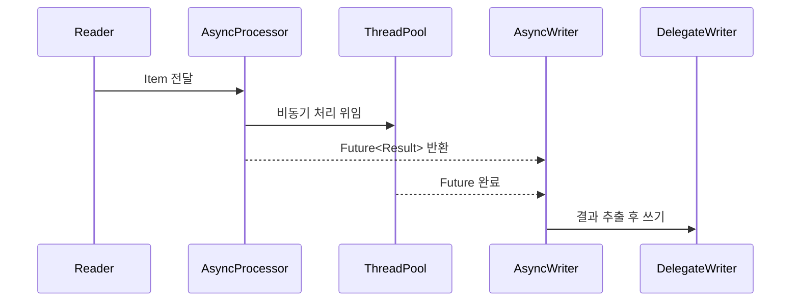

# Multi-threaded Step과 비동기 처리

Spring Batch에서 단일 Step의 처리 성능을 높이기 위한 멀티스레드 처리와 AsyncItemProcessor/Writer 패턴을 다룬다.

## 목차
- [1. 핵심 개념 (What)](#1-핵심-개념-what)
- [2. 왜 알아야 하는가 (Why)](#2-왜-알아야-하는가-why)
- [3. 내부 구현 분석 (How)](#3-내부-구현-분석-how)
- [4. 실전 예제](#4-실전-예제)
- [5. 정리](#5-정리)

---

## 1. 핵심 개념 (What)

Spring Batch는 기본적으로 단일 스레드에서 순차적으로 동작한다. 데이터 규모가 커지면 처리 시간이 선형으로 증가하므로, 병렬 처리 전략이 필요하다. Spring Batch가 제공하는 주요 병렬 처리 방식은 다음과 같다.

### 처리 방식 비교

| 방식 | 적합한 상황 | 장점 | 단점 |
|------|------------|------|------|
| **단일 스레드** | 소량 데이터, 순서 중요 | 단순, 디버깅 용이 | 느림 |
| **멀티스레드 Step** | 중간 규모, 순서 무관 | 구현 간단 | Reader thread-safe 필요 |
| **비동기 Processor** | 외부 API 호출 많음 | I/O 대기 최소화 | 복잡도 증가 |
| **파티셔닝** | 대용량, 명확한 분할 기준 | 확장성 최고 | 파티셔닝 로직 필요 |
| **Split (병렬 Flow)** | 독립적인 Step 동시 실행 | 구현 간단 | 제한적 확장성 |
| **원격 청킹** | 처리가 무거운 경우 | 처리 분산 | 인프라 복잡 |
| **원격 파티셔닝** | 초대용량, 분산 환경 | 완전한 분산 | 가장 복잡 |

### 상세 비교 표

| 구분 | Split | Partition | Remote Partition | Remote Chunking | Async | Multi-thread |
|------|-------|-----------|------------------|-----------------|-------|--------------|
| **병렬화 대상** | Flow | 데이터 | 데이터 | Chunk | Processor | Chunk |
| **실행 환경** | 단일 JVM | 단일 JVM | 다중 JVM | 다중 JVM | 단일 JVM | 단일 JVM |
| **데이터 전송** | X | X | 메타데이터 | 실제 데이터 | X | X |
| **재시작** | 용이 | 용이 | 용이 | 어려움 | 용이 | 어려움 |

이 문서에서는 **Multi-threaded Step**과 **AsyncItemProcessor/Writer** 두 가지에 집중한다.

---

## 2. 왜 알아야 하는가 (Why)

### 실무에서 마주하는 상황

- 수십만~수백만 건의 데이터를 처리하는 배치가 야간 윈도우 안에 끝나지 않는 경우
- 외부 API를 호출하는 Processor에서 I/O 대기 시간이 전체 처리 시간의 대부분을 차지하는 경우
- 단순히 서버 스펙을 올리는 것보다 멀티코어를 활용한 병렬 처리가 비용 효율적인 경우

### 선택 기준

**Multi-threaded Step**은 Chunk 단위 병렬 처리가 목적이며, Reader부터 Writer까지 전체 파이프라인을 여러 스레드가 동시에 실행한다. **AsyncItemProcessor/Writer**는 Processor만 비동기로 분리하여, 외부 API 호출 등 I/O 바운드 작업의 병렬성을 높인다.

- CPU 바운드 작업 -> Multi-threaded Step
- I/O 바운드 작업 (외부 API, 파일 처리) -> AsyncItemProcessor/Writer

---

## 3. 내부 구현 분석 (How)

### 3.1 Multi-threaded Step 아키텍처

하나의 Step을 여러 스레드로 병렬 처리한다. TaskExecutor를 설정하면, 각 Chunk가 별도 스레드에서 Read -> Process -> Write 전체 파이프라인을 실행한다.

```
┌────────────────────────────────────────────────────────────┐
│                    Multi-threaded Step                      │
│   ┌──────────────────────────────────────────────────┐     │
│   │                  TaskExecutor                      │     │
│   │   ┌─────────┐ ┌─────────┐ ┌─────────┐           │     │
│   │   │Thread 1 │ │Thread 2 │ │Thread 3 │ ...       │     │
│   │   │ R->P->W │ │ R->P->W │ │ R->P->W │           │     │
│   │   └─────────┘ └─────────┘ └─────────┘           │     │
│   └──────────────────────────────────────────────────┘     │
│                    Shared Reader (Thread-safe 필수!)        │
└────────────────────────────────────────────────────────────┘
```

핵심 포인트:
- 모든 스레드가 **하나의 Reader를 공유**하므로, Reader는 반드시 thread-safe 해야 한다
- `saveState(false)` 설정이 필수이다 (재시작 시 상태 복원 불가)
- 처리 순서가 보장되지 않는다

### 3.2 Multi-threaded Step 구현

```java
@Bean
public Step multiThreadedStep(JobRepository jobRepository,
                               PlatformTransactionManager transactionManager) {
    return new StepBuilder("multiThreadedStep", jobRepository)
            .<Customer, CustomerDto>chunk(100, transactionManager)
            .reader(synchronizedReader())  // Thread-safe Reader
            .processor(processor())
            .writer(writer())
            .taskExecutor(taskExecutor())
            .throttleLimit(4)  // 동시 실행 스레드 수 제한
            .build();
}

@Bean
public TaskExecutor taskExecutor() {
    ThreadPoolTaskExecutor executor = new ThreadPoolTaskExecutor();
    executor.setCorePoolSize(4);
    executor.setMaxPoolSize(8);
    executor.setQueueCapacity(100);
    executor.setThreadNamePrefix("batch-thread-");
    executor.setRejectedExecutionHandler(new ThreadPoolExecutor.CallerRunsPolicy());
    executor.initialize();
    return executor;
}
```

### 3.3 Thread-safe Reader 구현

`SynchronizedItemStreamReader`를 사용하여 기존 Reader를 래핑한다.

```java
@Bean
public SynchronizedItemStreamReader<Customer> synchronizedReader() {
    JdbcPagingItemReader<Customer> reader = new JdbcPagingItemReaderBuilder<Customer>()
            .name("customerReader")
            .dataSource(dataSource)
            .selectClause("SELECT *")
            .fromClause("FROM customers")
            .sortKeys(Map.of("id", Order.ASCENDING))
            .pageSize(100)
            .rowMapper(new BeanPropertyRowMapper<>(Customer.class))
            .saveState(false)  // 멀티스레드에서는 상태 저장 비활성화
            .build();

    SynchronizedItemStreamReader<Customer> synchronizedReader =
            new SynchronizedItemStreamReader<>();
    synchronizedReader.setDelegate(reader);
    return synchronizedReader;
}
```

**주의사항:**
- Reader는 반드시 Thread-safe 해야 함
- `saveState(false)` 설정 필수 (재시작 기능 비활성화)
- 처리 순서가 보장되지 않음

### 3.4 AsyncItemProcessor/Writer 아키텍처

Processor와 Writer를 비동기로 실행한다. Reader는 동기로 동작하되, Processor가 `Future<T>`를 반환하고, Writer가 Future에서 결과를 추출하여 처리한다.

```
Reader -> AsyncProcessor(비동기 실행) -> Future<결과> -> AsyncWriter(Future에서 결과 추출) -> Writer
```



---

## 4. 실전 예제

### 4.1 AsyncItemProcessor/Writer 전체 구성

외부 API 호출이 포함된 Processor를 비동기로 실행하는 전체 구성 예제이다.

```java
@Bean
public Step asyncStep() {
    return new StepBuilder("asyncStep", jobRepository)
            .<Customer, Future<CustomerDto>>chunk(100, transactionManager)
            .reader(reader())
            .processor(asyncProcessor())
            .writer(asyncWriter())
            .build();
}

@Bean
public AsyncItemProcessor<Customer, CustomerDto> asyncProcessor() {
    AsyncItemProcessor<Customer, CustomerDto> asyncProcessor =
            new AsyncItemProcessor<>();
    asyncProcessor.setDelegate(processor());
    asyncProcessor.setTaskExecutor(asyncTaskExecutor());
    return asyncProcessor;
}

@Bean
public ItemProcessor<Customer, CustomerDto> processor() {
    return customer -> {
        // 시간이 오래 걸리는 처리 (외부 API 호출 등)
        CustomerDetails details = externalApi.getDetails(customer.getId());
        return CustomerDto.from(customer, details);
    };
}

@Bean
public AsyncItemWriter<CustomerDto> asyncWriter() {
    AsyncItemWriter<CustomerDto> asyncWriter = new AsyncItemWriter<>();
    asyncWriter.setDelegate(writer());
    return asyncWriter;
}

@Bean
public TaskExecutor asyncTaskExecutor() {
    ThreadPoolTaskExecutor executor = new ThreadPoolTaskExecutor();
    executor.setCorePoolSize(10);
    executor.setMaxPoolSize(20);
    executor.setQueueCapacity(100);
    executor.setThreadNamePrefix("async-");
    executor.initialize();
    return executor;
}
```

### 4.2 TaskExecutor 설정 가이드

| 설정 | CPU 바운드 | I/O 바운드 |
|------|-----------|-----------|
| corePoolSize | CPU 코어 수 | CPU 코어 수 * 2~4 |
| maxPoolSize | CPU 코어 수 * 1.5 | CPU 코어 수 * 4~8 |
| queueCapacity | 50~100 | 100~500 |
| RejectionPolicy | CallerRunsPolicy 권장 | CallerRunsPolicy 권장 |

### 4.3 Multi-threaded vs Async 선택 기준

```
                      ┌─────────────────┐
                      │  병렬 처리 필요?  │
                      └────────┬────────┘
                               │
                    ┌──────────┴──────────┐
                    │                      │
              Processor만              전체 파이프라인
              병목인가?                병렬화 필요?
                    │                      │
                    ▼                      ▼
         AsyncItemProcessor      Multi-threaded Step
         (I/O 바운드 최적)        (CPU 바운드 최적)
```

---

## 5. 정리

| 항목 | Multi-threaded Step | AsyncItemProcessor/Writer |
|------|--------------------|-----------------------------|
| **병렬화 범위** | Chunk 전체 (R->P->W) | Processor만 비동기 |
| **Reader 제약** | Thread-safe 필수 | 동기 Reader 사용 가능 |
| **재시작 가능** | 불가 (saveState=false) | 가능 |
| **적합한 상황** | CPU 바운드, 중간 규모 | I/O 바운드, 외부 API 호출 |
| **구현 복잡도** | 낮음 | 중간 |
| **순서 보장** | 불가 | 불가 |
| **핵심 설정** | taskExecutor, throttleLimit | AsyncItemProcessor + TaskExecutor |

**핵심 요약:**
1. Multi-threaded Step은 TaskExecutor 하나만 설정하면 되는 가장 간단한 병렬 처리 방법이다
2. Reader의 thread-safety를 반드시 보장해야 하며, `SynchronizedItemStreamReader`를 활용한다
3. AsyncItemProcessor는 외부 API 호출처럼 I/O 대기가 긴 작업에 적합하다
4. 두 방식 모두 처리 순서를 보장하지 않으므로, 순서가 중요한 배치에는 적용하지 않는다

---
*참고: Spring Batch 5.x / Spring Boot 3.x 기준*
