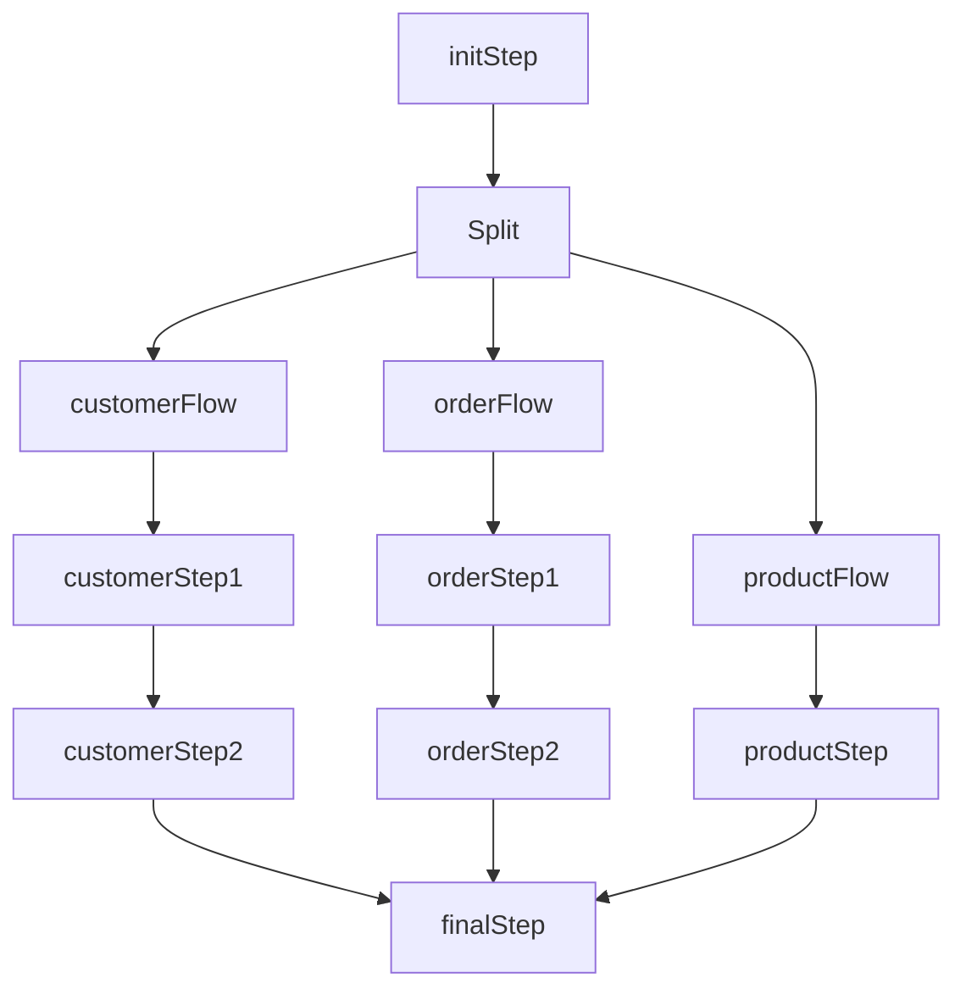

# 병렬 Step과 Partitioning

독립적인 Step을 동시에 실행하는 Split과, 대용량 데이터를 분할하여 병렬 처리하는 Partitioning 전략을 다룬다.

## 목차
- [1. 핵심 개념 (What)](#1-핵심-개념-what)
- [2. 왜 알아야 하는가 (Why)](#2-왜-알아야-하는가-why)
- [3. 내부 구현 분석 (How)](#3-내부-구현-분석-how)
- [4. 실전 예제](#4-실전-예제)
- [5. 정리](#5-정리)

---

## 1. 핵심 개념 (What)

### Split (병렬 Flow)

Split은 **독립적인 여러 Step(또는 Flow)을 동시에 실행**하는 방식이다. 각 Flow는 서로 다른 스레드에서 독립적으로 실행되며, 모든 Flow가 완료된 후 다음 Step으로 진행한다.

```
         ┌─────────┐
         │  Step1  │
         └────┬────┘
  ┌───────────┴───────────────┐
  ▼                           ▼
┌───────────┐           ┌───────────┐
│  Step2A   │  parallel │  Step2B   │
└─────┬─────┘           └─────┬─────┘
      └───────────┬───────────┘
                  ▼
             ┌─────────┐
             │  Step3  │
             └─────────┘
```

### Partitioning

Partitioning은 **하나의 Step을 데이터 단위로 분할하여 병렬 실행**하는 방식이다. Manager Step이 데이터를 파티션으로 나누고, 각 Worker Step이 할당된 파티션을 독립적으로 처리한다.

```
                  ┌──────────────┐
                  │ Manager Step │
                  │ (Partitioner)│
                  └──────┬───────┘
       ┌─────────────────┼───────────────┐
       ▼                 ▼               ▼
┌─────────────┐  ┌─────────────┐  ┌─────────────┐
│  Worker 1   │  │  Worker 2   │  │  Worker 3   │
│ ID: 1-1000  │  │ ID:1001-2000│  │ ID:2001-3000│
│   R->P->W   │  │   R->P->W   │  │   R->P->W   │
└─────────────┘  └─────────────┘  └─────────────┘
```

---

## 2. 왜 알아야 하는가 (Why)

### Split이 필요한 상황

- 서로 독립적인 데이터 처리 파이프라인이 여러 개 있을 때 (고객 처리, 주문 처리, 상품 처리 등)
- 각 Step 간 데이터 의존성이 없어 순차 실행이 불필요할 때
- 배치 전체 소요 시간을 줄여야 할 때

### Partitioning이 필요한 상황

- 수백만~수천만 건의 대용량 데이터를 처리할 때
- 데이터를 ID 범위, 날짜, 파일 등으로 명확히 분할할 수 있을 때
- Multi-threaded Step보다 더 높은 확장성이 필요할 때

### Split vs Partitioning

| 구분 | Split | Partitioning |
|------|-------|-------------|
| 병렬화 대상 | 서로 다른 Step | 같은 Step의 데이터 분할 |
| 데이터 공유 | 없음 | Partitioner가 범위 분배 |
| 확장성 | 제한적 (Step 수 고정) | 높음 (gridSize 조절) |
| 재시작 | 용이 | 용이 |

---

## 3. 내부 구현 분석 (How)

### 3.1 Split을 사용한 병렬 Step 실행

Flow를 여러 개 정의하고, `split()` 메서드로 병렬 실행한다. 모든 Flow가 완료되면 자동으로 동기화되어 다음 Step이 실행된다.

```java
@Bean
public Job parallelJob(JobRepository jobRepository,
                       Step step1, Step step2A, Step step2B, Step step3) {

    Flow flow2A = new FlowBuilder<SimpleFlow>("flow2A")
            .start(step2A).build();

    Flow flow2B = new FlowBuilder<SimpleFlow>("flow2B")
            .start(step2B).build();

    Flow splitFlow = new FlowBuilder<SimpleFlow>("splitFlow")
            .split(new SimpleAsyncTaskExecutor())
            .add(flow2A, flow2B)
            .build();

    return new JobBuilder("parallelJob", jobRepository)
            .start(step1)
            .next(splitFlow)
            .next(step3)  // 모든 병렬 Flow 완료 후 실행 (자동 동기화)
            .end()
            .build();
}
```

### 3.2 여러 Flow 병렬 실행

각 Flow 안에 여러 Step을 체이닝하여 복잡한 병렬 파이프라인을 구성할 수 있다.

```java
@Bean
public Job multiFlowParallelJob(JobRepository jobRepository) {
    Flow customerFlow = new FlowBuilder<SimpleFlow>("customerFlow")
            .start(customerStep1()).next(customerStep2()).build();

    Flow orderFlow = new FlowBuilder<SimpleFlow>("orderFlow")
            .start(orderStep1()).next(orderStep2()).build();

    Flow productFlow = new FlowBuilder<SimpleFlow>("productFlow")
            .start(productStep()).build();

    return new JobBuilder("multiFlowParallelJob", jobRepository)
            .start(initStep())
            .split(taskExecutor())
            .add(customerFlow, orderFlow, productFlow)
            .next(finalStep())
            .end()
            .build();
}
```



### 3.3 Partitioner 인터페이스

`Partitioner`는 `partition(int gridSize)` 메서드를 구현하여, 각 파티션의 실행 컨텍스트(ExecutionContext)를 정의한다.

#### Column Range Partitioner (ID 범위 기반)

```java
public class ColumnRangePartitioner implements Partitioner {

    private final JdbcTemplate jdbcTemplate;
    private final String table;
    private final String column;

    @Override
    public Map<String, ExecutionContext> partition(int gridSize) {
        Long min = jdbcTemplate.queryForObject(
                "SELECT MIN(" + column + ") FROM " + table, Long.class);
        Long max = jdbcTemplate.queryForObject(
                "SELECT MAX(" + column + ") FROM " + table, Long.class);

        if (min == null || max == null) {
            return Collections.emptyMap();
        }

        long targetSize = (max - min) / gridSize + 1;
        Map<String, ExecutionContext> result = new HashMap<>();
        long start = min;
        long end = start + targetSize - 1;

        for (int i = 0; i < gridSize; i++) {
            ExecutionContext context = new ExecutionContext();
            context.putLong("minId", start);
            context.putLong("maxId", Math.min(end, max));
            result.put("partition" + i, context);

            start = end + 1;
            end = start + targetSize - 1;
        }

        return result;
    }
}
```

### 3.4 파티션 Step 설정

Manager Step에서 Partitioner와 Worker Step을 연결한다. Worker Step의 Reader는 `@StepScope`와 `stepExecutionContext`를 사용하여 파티션별 데이터 범위를 주입받는다.

```java
@Bean
public Step managerStep(JobRepository jobRepository,
                        Partitioner partitioner, Step workerStep) {
    return new StepBuilder("managerStep", jobRepository)
            .partitioner("workerStep", partitioner)
            .step(workerStep)
            .gridSize(4)
            .taskExecutor(partitionTaskExecutor())
            .build();
}

@Bean
@StepScope
public JdbcPagingItemReader<Customer> partitionedReader(
        @Value("#{stepExecutionContext['minId']}") Long minId,
        @Value("#{stepExecutionContext['maxId']}") Long maxId) {
    return new JdbcPagingItemReaderBuilder<Customer>()
            .name("partitionedReader")
            .dataSource(dataSource)
            .selectClause("SELECT *")
            .fromClause("FROM customers")
            .whereClause("WHERE id >= :minId AND id <= :maxId")
            .parameterValues(Map.of("minId", minId, "maxId", maxId))
            .sortKeys(Map.of("id", Order.ASCENDING))
            .pageSize(100)
            .rowMapper(new BeanPropertyRowMapper<>(Customer.class))
            .build();
}
```

---

## 4. 실전 예제

### 4.1 날짜 기반 Partitioner

월별, 주별 등 날짜 범위로 데이터를 분할할 때 사용한다.

```java
public class DateRangePartitioner implements Partitioner {

    private final LocalDate startDate;
    private final LocalDate endDate;

    @Override
    public Map<String, ExecutionContext> partition(int gridSize) {
        Map<String, ExecutionContext> result = new HashMap<>();
        long totalDays = ChronoUnit.DAYS.between(startDate, endDate) + 1;
        long daysPerPartition = totalDays / gridSize;

        LocalDate currentStart = startDate;
        for (int i = 0; i < gridSize; i++) {
            ExecutionContext context = new ExecutionContext();
            LocalDate currentEnd = (i == gridSize - 1)
                    ? endDate
                    : currentStart.plusDays(daysPerPartition - 1);

            context.put("startDate", currentStart.toString());
            context.put("endDate", currentEnd.toString());
            result.put("partition" + i, context);
            currentStart = currentEnd.plusDays(1);
        }
        return result;
    }
}
```

### 4.2 파일 기반 Partitioner

여러 입력 파일을 파티션별로 분배하여 병렬 처리한다.

```java
public class MultiFilePartitioner implements Partitioner {

    private final Resource[] resources;

    @Override
    public Map<String, ExecutionContext> partition(int gridSize) {
        Map<String, ExecutionContext> result = new HashMap<>();
        for (int i = 0; i < resources.length; i++) {
            ExecutionContext context = new ExecutionContext();
            context.putString("fileName", resources[i].getFilename());
            context.put("resource", resources[i]);
            result.put("partition" + i, context);
        }
        return result;
    }
}
```

### 4.3 gridSize 결정 기준

```java
// CPU 바운드: CPU 코어 수
int gridSize = Runtime.getRuntime().availableProcessors();

// I/O 바운드: 코어 수 * 2 이상
int gridSize = Runtime.getRuntime().availableProcessors() * 2;

// 데이터 특성에 따라: 전체 데이터 / 파티션당 처리량
long totalCount = jdbcTemplate.queryForObject("SELECT COUNT(*) FROM users", Long.class);
int gridSize = (int) Math.ceil((double) totalCount / 100000);
```

---

## 5. 정리

| 항목 | Split (병렬 Flow) | Partitioning |
|------|-------------------|-------------|
| **목적** | 독립 Step 동시 실행 | 데이터 분할 병렬 처리 |
| **병렬화 대상** | Flow (Step 묶음) | 데이터 (파티션 단위) |
| **실행 환경** | 단일 JVM | 단일 JVM (Remote 확장 가능) |
| **확장성** | Flow 수에 비례 | gridSize로 유연하게 조절 |
| **재시작** | 용이 | 용이 (파티션 단위 재시작) |
| **구현 복잡도** | 낮음 | 중간 (Partitioner 구현 필요) |
| **핵심 클래스** | FlowBuilder, SimpleAsyncTaskExecutor | Partitioner, @StepScope |
| **적합한 상황** | 독립적 파이프라인 병렬화 | 대용량 단일 데이터셋 처리 |

**핵심 요약:**
1. Split은 서로 독립적인 Step들을 동시에 실행하며, 모든 Flow 완료 후 자동 동기화된다
2. Partitioning은 Partitioner가 데이터를 분할하고, 각 Worker Step이 자신의 파티션을 독립적으로 처리한다
3. Partitioner는 ID 범위, 날짜 범위, 파일 등 다양한 기준으로 구현할 수 있다
4. gridSize는 워크로드 특성(CPU/IO 바운드)에 따라 결정하며, DB 커넥션 풀 크기도 함께 고려해야 한다

---
*참고: Spring Batch 5.x / Spring Boot 3.x 기준*
