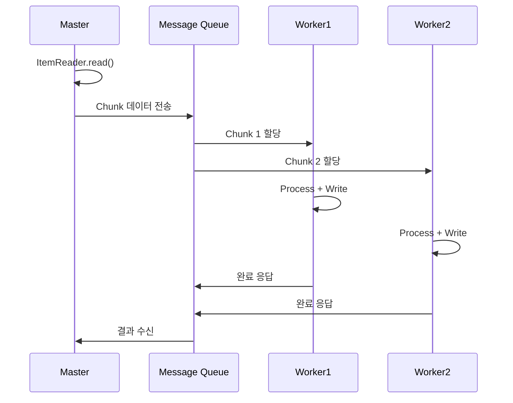

# 원격 처리와 비동기 실행

Remote Chunking, Remote Partitioning을 통한 분산 처리와 JobLauncher 비동기 실행, 비동기 처리 시 주의사항을 다룬다.

## 목차
- [1. 핵심 개념 (What)](#1-핵심-개념-what)
- [2. 왜 알아야 하는가 (Why)](#2-왜-알아야-하는가-why)
- [3. 내부 구현 분석 (How)](#3-내부-구현-분석-how)
- [4. 실전 예제](#4-실전-예제)
- [5. 정리](#5-정리)

---

## 1. 핵심 개념 (What)

단일 JVM의 병렬 처리(Multi-threaded Step, Partitioning 등)로도 부족할 때, **여러 JVM에 걸쳐 처리를 분산**하는 방법이 필요하다. Spring Batch는 Spring Integration과 결합하여 두 가지 원격 처리 패턴을 제공한다.

### Remote Chunking

Master가 데이터를 읽어서 **실제 데이터를 메시지 큐를 통해 Worker에게 전송**한다. Worker는 Process + Write만 수행한다.

```
┌─────────────────────┐
│     Master JVM      │
│  ┌────────────────┐ │
│  │ ItemReader     │ │
│  └───────┬────────┘ │
│          │ Chunk 전송│
└──────────┼──────────┘
           │
    ┌──────┴──────┐
    ▼             ▼
┌──────────┐ ┌──────────┐
│ Worker 1 │ │ Worker 2 │
│Processor │ │Processor │
│+ Writer  │ │+ Writer  │
└──────────┘ └──────────┘
```

### Remote Partitioning

Master는 **파티션 메타데이터만 전송**하고, Worker가 직접 데이터를 Read + Process + Write한다. Worker가 데이터에 가까울 때 적합하다.

```
┌─────────────────┐
│   Master JVM    │
│  ┌───────────┐  │
│  │ Partitioner│  │
│  └─────┬─────┘  │
│        │ 메시지 큐로 파티션 전송
└────────┼────────┘
         │
    ┌────┴────┐
    ▼         ▼
┌────────┐ ┌────────┐
│Worker 1│ │Worker 2│
│ Full   │ │ Full   │
│ Step   │ │ Step   │
│(R->P->W)│ │(R->P->W)│
└────────┘ └────────┘
```

### JobLauncher 비동기 실행

기본 `JobLauncher`는 동기 실행이다. REST API 등에서 Job을 즉시 반환하고 백그라운드에서 실행하려면 비동기 `JobLauncher`를 사용한다.

---

## 2. 왜 알아야 하는가 (Why)

### 원격 처리가 필요한 상황

- **단일 서버의 CPU/메모리 한계**: 수천만 건 이상의 데이터 처리 시 단일 JVM으로 부족
- **Processor가 무거운 경우**: 외부 API 호출, 복잡한 연산 등이 병목일 때 Remote Chunking
- **Worker가 데이터에 가까운 경우**: 분산 DB 환경에서 Worker가 로컬 데이터를 직접 접근할 때 Remote Partitioning
- **REST API를 통한 Job 실행**: 웹 요청에서 배치를 트리거하고 즉시 응답해야 할 때

### Remote Chunking vs Remote Partitioning 선택 기준

| 구분 | Remote Partitioning | Remote Chunking |
|------|---------------------|-----------------|
| **데이터 위치** | Worker 로컬 데이터 | Master에서 읽어서 전송 |
| **네트워크 부하** | 낮음 (메타데이터만 전송) | 높음 (실제 데이터 전송) |
| **Worker 역할** | Read + Process + Write | Process + Write |
| **적합한 경우** | Worker가 데이터에 가까울 때 | Processor가 병목일 때 |
| **구현 복잡도** | 낮음 | 높음 |

---

## 3. 내부 구현 분석 (How)

### 3.1 Remote Chunking - Master 설정

Spring Integration의 채널을 통해 데이터를 전송하고 응답을 수신한다.

```java
@Configuration
@EnableBatchIntegration
public class RemoteChunkingMasterConfig {

    @Autowired
    private RemoteChunkingMasterStepBuilderFactory masterStepBuilderFactory;

    @Bean
    public Step masterStep() {
        return masterStepBuilderFactory.get("masterStep")
                .<Order, Order>chunk(100)
                .reader(orderReader())
                .outputChannel(outboundRequests())
                .inputChannel(inboundReplies())
                .build();
    }
}
```

### 3.2 Remote Chunking - Worker 설정

Worker는 `IntegrationFlow`를 통해 메시지를 수신하고, Processor + Writer를 실행한 후 결과를 응답한다.

```java
@Configuration
@EnableBatchIntegration
public class RemoteChunkingWorkerConfig {

    @Autowired
    private RemoteChunkingWorkerBuilder<Order, Order> workerBuilder;

    @Bean
    public IntegrationFlow workerFlow() {
        return workerBuilder
                .inputChannel(inboundRequests())
                .outputChannel(outboundReplies())
                .itemProcessor(orderProcessor())
                .itemWriter(orderWriter())
                .build();
    }
}
```



### 3.3 Remote Partitioning - Master 설정

Partitioner가 분할한 메타데이터를 메시지 큐를 통해 Worker에게 전달한다.

```java
@Configuration
@EnableBatchIntegration
public class RemotePartitionMasterConfig {

    @Autowired
    private RemotePartitioningMasterStepBuilderFactory masterStepBuilderFactory;

    @Bean
    public Step masterStep() {
        return masterStepBuilderFactory.get("masterStep")
                .partitioner("workerStep", partitioner())
                .gridSize(4)
                .outputChannel(outboundRequests())
                .inputChannel(inboundReplies())
                .build();
    }
}
```

### 3.4 Remote Partitioning - Worker 설정

Worker는 수신한 파티션 메타데이터를 기반으로 전체 Step(Read -> Process -> Write)을 실행한다.

```java
@Configuration
@EnableBatchIntegration
public class RemotePartitionWorkerConfig {

    @Autowired
    private RemotePartitioningWorkerStepBuilderFactory workerStepBuilderFactory;

    @Bean
    public Step workerStep() {
        return workerStepBuilderFactory.get("workerStep")
                .inputChannel(inboundRequests())
                .outputChannel(outboundReplies())
                .stepLocator(new BeanFactoryStepLocator())
                .build();
    }
}
```

### 3.5 비동기 JobLauncher 설정

`TaskExecutorJobLauncher`에 `SimpleAsyncTaskExecutor`를 설정하면, `run()` 호출 즉시 반환되고 Job은 별도 스레드에서 실행된다.

```java
@Bean
public JobLauncher asyncJobLauncher(JobRepository jobRepository) throws Exception {
    TaskExecutorJobLauncher jobLauncher = new TaskExecutorJobLauncher();
    jobLauncher.setJobRepository(jobRepository);
    jobLauncher.setTaskExecutor(new SimpleAsyncTaskExecutor());
    jobLauncher.afterPropertiesSet();
    return jobLauncher;
}
```

---

## 4. 실전 예제

### 4.1 REST API를 통한 비동기 Job 실행

```java
@RestController
@RequestMapping("/api/batch")
@RequiredArgsConstructor
public class BatchController {

    private final JobLauncher asyncJobLauncher;
    private final Job myJob;

    @PostMapping("/run")
    public ResponseEntity<String> runJob(@RequestParam Map<String, String> params) {
        try {
            JobParametersBuilder builder = new JobParametersBuilder();
            builder.addLong("timestamp", System.currentTimeMillis());
            params.forEach(builder::addString);

            JobExecution execution = asyncJobLauncher.run(myJob, builder.toJobParameters());
            return ResponseEntity.ok("Job started with ID: " + execution.getId());
        } catch (Exception e) {
            return ResponseEntity.status(500).body("Failed to start job: " + e.getMessage());
        }
    }

    @GetMapping("/status/{executionId}")
    public ResponseEntity<JobExecutionStatus> getStatus(@PathVariable Long executionId) {
        JobExecution execution = jobExplorer.getJobExecution(executionId);
        return ResponseEntity.ok(new JobExecutionStatus(
                execution.getStatus(),
                execution.getExitStatus(),
                execution.getStartTime(),
                execution.getEndTime()
        ));
    }
}
```

### 4.2 비동기 처리 주의사항

#### 1. Thread-safe 보장

```java
// 잘못된 예: 공유 상태 사용
public class UnsafeProcessor implements ItemProcessor<User, User> {
    private int count = 0;  // 공유 상태!
    @Override
    public User process(User user) {
        count++;  // 동시성 문제 발생
        return user;
    }
}

// 올바른 예: AtomicInteger 사용
public class SafeProcessor implements ItemProcessor<User, User> {
    private final AtomicInteger count = new AtomicInteger(0);
    @Override
    public User process(User user) {
        count.incrementAndGet();
        return user;
    }
}
```

#### 2. DB Connection Pool 설정

파티션 수에 맞게 커넥션 풀 크기를 설정해야 한다. 파티션 수보다 커넥션이 적으면 데드락이 발생할 수 있다.

```yaml
spring:
  datasource:
    hikari:
      maximum-pool-size: 20  # 파티션 수 + 여유분
      minimum-idle: 10
```

#### 3. 원격 처리 시 메시지 직렬화

메시지 큐로 전송되는 객체는 반드시 `Serializable`을 구현해야 한다.

```java
// 메시지 큐로 전송되는 객체는 Serializable 구현 필요
public class Order implements Serializable {
    private static final long serialVersionUID = 1L;
    private Long id;
    private String status;
}
```

#### 4. 재시작과 멱등성

비동기/원격 처리에서는 중복 실행 가능성이 있으므로, Writer를 멱등하게 구현한다.

```java
// 멱등한 Writer 구현 (UPSERT)
@Bean
public ItemWriter<User> idempotentWriter() {
    return new JdbcBatchItemWriterBuilder<User>()
            .dataSource(dataSource)
            .sql("""
                INSERT INTO users (id, name, email, updated_at)
                VALUES (:id, :name, :email, :updatedAt)
                ON DUPLICATE KEY UPDATE
                    name = VALUES(name),
                    email = VALUES(email),
                    updated_at = VALUES(updated_at)
                """)
            .beanMapped()
            .build();
}
```

---

## 5. 정리

| 항목 | Remote Chunking | Remote Partitioning | 비동기 JobLauncher |
|------|----------------|--------------------|--------------------|
| **목적** | 처리 분산 (Process+Write) | 완전한 분산 (R+P+W) | Job 비동기 실행 |
| **실행 환경** | 다중 JVM | 다중 JVM | 단일 JVM |
| **네트워크 부하** | 높음 (데이터 전송) | 낮음 (메타데이터만) | 없음 |
| **인프라 의존** | 메시지 큐 필수 | 메시지 큐 필수 | 없음 |
| **재시작** | 어려움 | 용이 | 일반 Job과 동일 |
| **적합한 상황** | Processor 병목 | 대용량 분산 환경 | REST API 트리거 |

**핵심 요약:**
1. Remote Chunking은 Master가 데이터를 읽어 Worker에게 전송하므로, Processor가 병목일 때 적합하다
2. Remote Partitioning은 메타데이터만 전송하여 네트워크 부하가 낮고, Worker가 데이터에 가까울 때 최적이다
3. 비동기 JobLauncher는 REST API에서 배치를 트리거하고 즉시 응답해야 할 때 사용한다
4. 비동기/원격 처리 시 Thread-safety, Connection Pool 크기, 직렬화, 멱등성을 반드시 고려해야 한다

---
*참고: Spring Batch 5.x / Spring Boot 3.x 기준*
