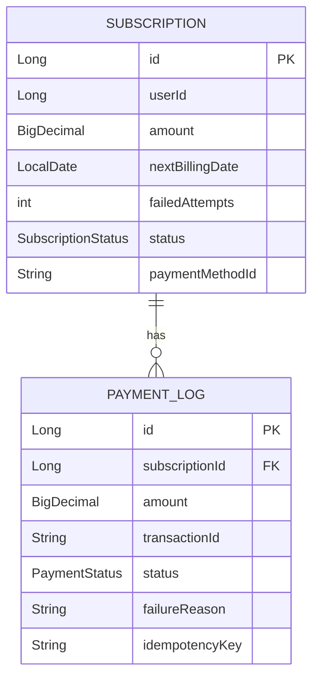
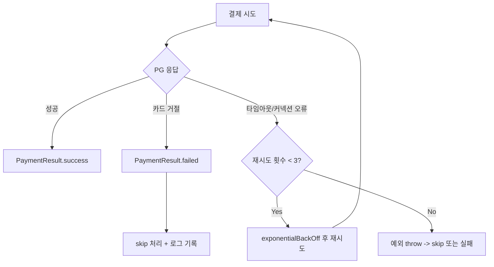
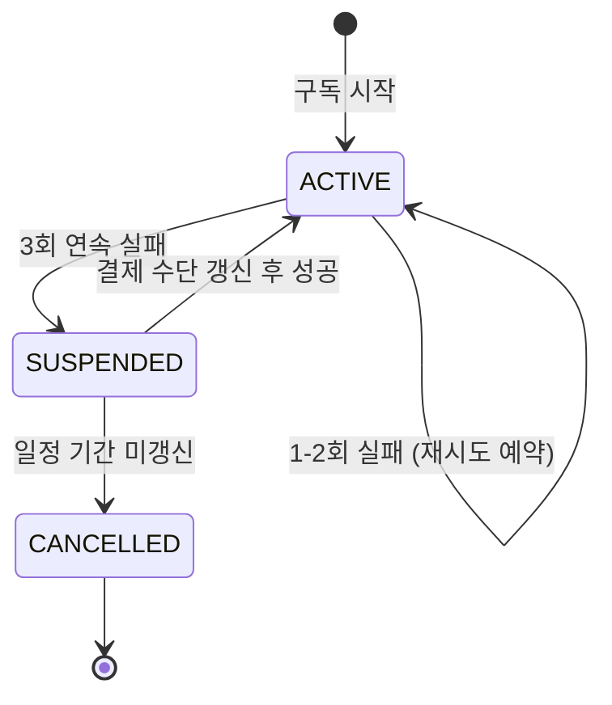

# 정기 결제 배치 설계

Spring Batch를 활용한 정기 결제(Subscription Billing) 배치의 아키텍처, 멱등성 설계, 결제 상태 관리, 재시도 전략을 다룬다.

## 목차
- [1. 핵심 개념 (What)](#1-핵심-개념-what)
- [2. 왜 알아야 하는가 (Why)](#2-왜-알아야-하는가-why)
- [3. 내부 구현 분석 (How)](#3-내부-구현-분석-how)
- [4. 실전 예제](#4-실전-예제)
- [5. 정리](#5-정리)

---

## 1. 핵심 개념 (What)

정기 결제 배치는 구독 서비스에서 **매 결제 주기마다 자동으로 결제를 수행**하는 배치 Job이다. 결제 대상 조회, 결제 시도, 결과 처리, 알림 발송의 4단계로 구성된다.

### 전체 아키텍처

```
┌─────────────────────────────────────────────────────────────────────┐
│                    정기 결제 배치 Job                                │
│                                                                      │
│  ┌────────────┐   ┌────────────┐   ┌────────────┐   ┌────────────┐ │
│  │ 대상 조회   │──▶│ 결제 시도   │──▶│ 결과 처리   │──▶│ 알림 발송   │ │
│  │   Step     │   │   Step     │   │   Step     │   │   Step     │ │
│  └────────────┘   └────────────┘   └────────────┘   └────────────┘ │
└─────────────────────────────────────────────────────────────────────┘
```

### 핵심 설계 원칙

- **멱등성(Idempotency)**: 같은 결제를 두 번 실행해도 한 번만 과금되어야 한다
- **장애 내성(Fault Tolerance)**: PG사 연동 실패 시 재시도, 카드 거절 시 skip 처리
- **상태 관리**: 구독 상태(ACTIVE/SUSPENDED/CANCELLED)와 결제 로그를 정확히 추적
- **소규모 Chunk**: 결제 실패 시 롤백 범위를 최소화하기 위해 Chunk Size를 작게 설정

---

## 2. 왜 알아야 하는가 (Why)

### 결제 배치가 어려운 이유

정기 결제 배치는 단순한 데이터 처리와 다르게, **금전적 트랜잭션**이 관련되어 있다.

- **이중 과금 방지**: 배치 재시작 시 이미 성공한 결제를 다시 시도하면 안 된다
- **외부 시스템 의존**: PG사 API 호출 시 타임아웃, 네트워크 오류 등 다양한 실패 시나리오가 발생한다
- **부분 실패 처리**: 1000건 중 3건이 실패한다고 전체를 롤백할 수 없다
- **추적 가능성**: 모든 결제 시도와 결과를 로그로 남겨야 한다

### 실무에서의 영향

| 문제 | 영향 | 해결 방법 |
|------|-----|----------|
| 이중 과금 | 고객 클레임, 환불 비용 | idempotencyKey 사용 |
| 전체 롤백 | 정상 결제까지 취소 | faultTolerant + skip |
| 무한 재시도 | PG사 차단, 비용 증가 | retryLimit + backOff |
| 상태 불일치 | CS 혼란, 서비스 장애 | 결제 로그 + 상태 동기화 |

---

## 3. 내부 구현 분석 (How)

### 3.1 도메인 모델

결제 배치의 핵심 엔티티는 `Subscription`(구독 정보)과 `PaymentLog`(결제 이력)이다.

```java
@Entity
@Table(name = "subscriptions")
public class Subscription {
    @Id
    private Long id;
    private Long userId;
    private Long planId;
    private BigDecimal amount;
    private LocalDate nextBillingDate;
    private int failedAttempts;

    @Enumerated(EnumType.STRING)
    private SubscriptionStatus status;  // ACTIVE, SUSPENDED, CANCELLED

    private LocalDateTime lastPaymentAt;
    private String paymentMethodId;
}

@Entity
@Table(name = "payment_logs")
public class PaymentLog {
    @Id
    private Long id;
    private Long subscriptionId;
    private Long userId;
    private BigDecimal amount;
    private String transactionId;

    @Enumerated(EnumType.STRING)
    private PaymentStatus status;  // SUCCESS, FAILED, PENDING

    private String failureReason;
    private LocalDateTime processedAt;
    private String idempotencyKey;  // 멱등성 보장용
}
```



### 3.2 결제 대상 조회 (Reader)

결제 대상은 다음 조건을 만족하는 구독이다:
- 오늘이 결제 예정일
- ACTIVE 상태
- 실패 횟수 3회 미만 (3회 이상은 별도 처리)

```java
/**
 * Best Practice: 결제 대상 조회 시 조건을 명확히
 * - 오늘 결제 예정인 구독
 * - ACTIVE 상태
 * - 실패 횟수 3회 미만 (3회 이상은 별도 처리)
 */
@Bean
@StepScope
public JdbcPagingItemReader<Subscription> billingTargetReader(
        @Value("#{jobParameters['billingDate']}") String billingDate) {

    return new JdbcPagingItemReaderBuilder<Subscription>()
            .name("billingTargetReader")
            .dataSource(dataSource)
            .selectClause("""
                SELECT id, user_id, plan_id, amount, next_billing_date,
                       failed_attempts, status, payment_method_id
                """)
            .fromClause("FROM subscriptions")
            .whereClause("""
                WHERE next_billing_date = :billingDate
                  AND status = 'ACTIVE'
                  AND failed_attempts < 3
                """)
            .parameterValues(Map.of("billingDate", billingDate))
            .sortKeys(Map.of("id", Order.ASCENDING))
            .pageSize(100)
            .rowMapper(new BeanPropertyRowMapper<>(Subscription.class))
            .build();
}
```

### 3.3 결제 처리 Step 설정

결제 Step의 핵심 설계 포인트:
- **Chunk Size 10~50**: 결제 실패 시 롤백 범위 최소화
- **retry**: PG 연동 오류(타임아웃, 커넥션)는 재시도
- **skip**: 카드 거절, 무효 결제수단은 건너뛰기
- **exponentialBackOff**: 재시도 간격을 점진적으로 증가

```java
/**
 * Best Practice: 결제 처리 Chunk 설계
 * - Chunk Size는 작게 (10~50): 결제 실패 시 롤백 범위 최소화
 * - 멱등성 보장: idempotencyKey 사용
 * - 타임아웃 설정: 외부 PG 연동 시 필수
 */
@Bean
public Step paymentProcessStep(JobRepository jobRepository,
                               PlatformTransactionManager transactionManager) {
    return new StepBuilder("paymentProcessStep", jobRepository)
            .<Subscription, PaymentResult>chunk(10, transactionManager)
            .reader(billingTargetReader(null))
            .processor(paymentProcessor())
            .writer(paymentResultWriter())
            .faultTolerant()
            .retry(PgConnectionException.class)
            .retry(PgTimeoutException.class)
            .retryLimit(3)
            .backOffPolicy(exponentialBackOff())
            .skip(PaymentDeclinedException.class)
            .skip(InvalidPaymentMethodException.class)
            .skipLimit(Integer.MAX_VALUE)
            .listener(paymentSkipListener())
            .build();
}
```



---

## 4. 실전 예제

### 4.1 결제 Processor - 멱등성 보장

`idempotencyKey`를 사용하여 동일 결제의 중복 처리를 방지한다. 배치 재시작 시에도 이미 성공한 결제를 다시 시도하지 않는다.

```java
@Component
@RequiredArgsConstructor
@Slf4j
public class PaymentProcessor implements ItemProcessor<Subscription, PaymentResult> {

    private final PaymentGateway paymentGateway;
    private final PaymentLogRepository paymentLogRepository;

    @Override
    public PaymentResult process(Subscription subscription) throws Exception {
        String idempotencyKey = generateIdempotencyKey(subscription);

        // 이미 처리된 결제인지 확인
        Optional<PaymentLog> existingLog = paymentLogRepository
                .findByIdempotencyKey(idempotencyKey);

        if (existingLog.isPresent()) {
            log.info("이미 처리된 결제 - subscriptionId: {}", subscription.getId());
            return PaymentResult.alreadyProcessed(existingLog.get());
        }

        try {
            PgResponse response = paymentGateway.charge(
                    PaymentRequest.builder()
                            .amount(subscription.getAmount())
                            .paymentMethodId(subscription.getPaymentMethodId())
                            .idempotencyKey(idempotencyKey)
                            .build()
            );
            return PaymentResult.success(subscription, response.getTransactionId());
        } catch (PaymentDeclinedException e) {
            return PaymentResult.failed(subscription, e.getDeclineCode());
        } catch (PgException e) {
            throw e;  // 상위에서 재시도 처리
        }
    }

    private String generateIdempotencyKey(Subscription subscription) {
        return String.format("billing_%d_%s",
                subscription.getId(), subscription.getNextBillingDate());
    }
}
```

**멱등성 키 생성 전략:**
- `billing_{subscriptionId}_{billingDate}` 형식으로 생성
- 같은 구독의 같은 결제일에 대해 항상 동일한 키가 생성된다
- PG사에도 동일한 키를 전달하여 PG 레벨에서도 이중 과금을 방지한다

### 4.2 실패 처리 (별도 Step)

실패 횟수에 따라 차등적으로 처리한다.

```java
/**
 * Best Practice: 실패 케이스 별도 처리
 * - 1-2회 실패: 다음 날 재시도
 * - 3회 실패: 구독 일시정지 + 사용자 알림
 * - 결제 수단 만료: 업데이트 요청 알림
 */
@Bean
public ItemProcessor<PaymentLog, FailureAction> failureActionProcessor() {
    return log -> {
        int failedAttempts = log.getFailedAttempts();
        if (failedAttempts >= 3) {
            return FailureAction.suspendSubscription(log);
        } else if ("card_expired".equals(log.getFailureReason())) {
            return FailureAction.requestCardUpdate(log);
        } else {
            return FailureAction.scheduleRetry(log, LocalDate.now().plusDays(1));
        }
    };
}
```

### 4.3 결제 상태 흐름



### 4.4 재시도 전략 요약

| 실패 유형 | 처리 방법 | 재시도 시점 |
|-----------|----------|------------|
| PG 타임아웃 | retry (exponentialBackOff) | 즉시 (초 단위) |
| PG 커넥션 오류 | retry (exponentialBackOff) | 즉시 (초 단위) |
| 카드 거절 | skip + 로그 기록 | 다음 날 재시도 |
| 카드 만료 | skip + 갱신 요청 알림 | 갱신 후 재시도 |
| 잔액 부족 | skip + 로그 기록 | 다음 날 재시도 |
| 3회 연속 실패 | 구독 일시정지 + 알림 | 수동 조치 후 |

### 4.5 PG사별 에러 코드 매핑과 재시도 분류

PG사마다 에러 코드 체계가 완전히 다르다. 토스페이먼츠는 문자열 코드(`PROVIDER_ERROR`), 나이스페이는 숫자 코드(`1001`)를 사용한다. 이 차이를 코드에 하드코딩하면 **PG사 추가/변경 시 즉시 장애**로 이어진다.

재시도 분류를 잘못하면 두 가지 심각한 문제가 발생한다:
- **재시도 가능 에러(PG_TIMEOUT)를 skip하면**: 결제가 실제로는 성공 가능한데 건너뛰어 **매출 누락** 발생
- **재시도 불가 에러(CARD_EXPIRED, STOLEN_CARD)를 재시도하면**: 이미 거절된 결제를 반복 호출하여 **이중 과금** 위험 또는 PG사 차단

#### 에러 코드 매핑 테이블 DDL

```sql
CREATE TABLE pg_error_codes (
    pg_company      VARCHAR(50)   NOT NULL,
    pg_error_code   VARCHAR(100)  NOT NULL,
    error_category  ENUM('RETRYABLE', 'NON_RETRYABLE', 'REQUIRES_ACTION') NOT NULL,
    description     VARCHAR(500),
    created_at      DATETIME      NOT NULL DEFAULT CURRENT_TIMESTAMP,
    PRIMARY KEY (pg_company, pg_error_code)
);
```

#### ErrorClassifier 인터페이스와 구현

```java
/**
 * Best Practice: PG사 에러 코드를 DB 기반으로 분류
 * - 하드코딩 대신 DB 조회로 PG사 추가/변경에 무중단 대응
 * - 미등록 코드는 NON_RETRYABLE로 기본 처리 (안전 우선)
 */
public interface ErrorClassifier {
    ErrorCategory classify(String pgCompany, String pgErrorCode);
}

public enum ErrorCategory {
    RETRYABLE,        // 재시도 가능 (PG 인프라 오류, 일시적 장애)
    NON_RETRYABLE,    // 재시도 불가 (카드 만료, 도난 카드 등)
    REQUIRES_ACTION   // 사용자 조치 필요 (한도 초과, 결제수단 변경 등)
}

@Component
@RequiredArgsConstructor
@Slf4j
public class DbErrorClassifier implements ErrorClassifier {

    private final PgErrorCodeRepository pgErrorCodeRepository;

    @Override
    public ErrorCategory classify(String pgCompany, String pgErrorCode) {
        return pgErrorCodeRepository
                .findByPgCompanyAndPgErrorCode(pgCompany, pgErrorCode)
                .map(PgErrorCode::getErrorCategory)
                .orElseGet(() -> {
                    // 미등록 코드는 안전 우선으로 NON_RETRYABLE 처리
                    log.warn("미등록 PG 에러 코드 - pgCompany: {}, pgErrorCode: {}",
                            pgCompany, pgErrorCode);
                    return ErrorCategory.NON_RETRYABLE;
                });
    }
}

@Repository
public interface PgErrorCodeRepository extends JpaRepository<PgErrorCode, PgErrorCodeId> {
    Optional<PgErrorCode> findByPgCompanyAndPgErrorCode(String pgCompany, String pgErrorCode);
}
```

#### PG사별 에러 코드 매핑 예시

| PG사 | PG 에러 코드 | 분류 | 설명 |
|------|-------------|------|------|
| 토스페이먼츠 | `PROVIDER_ERROR` | RETRYABLE | PG 내부 오류 (일시적) |
| 토스페이먼츠 | `CARD_COMPANY_NOT_AVAILABLE` | RETRYABLE | 카드사 점검 중 |
| 토스페이먼츠 | `NOT_AVAILABLE_CARD` | NON_RETRYABLE | 사용 불가 카드 |
| 토스페이먼츠 | `STOLEN_CARD` | NON_RETRYABLE | 도난 신고 카드 |
| 나이스페이 | `1001` | RETRYABLE | 통신 오류 |
| 나이스페이 | `3001` | NON_RETRYABLE | 카드 유효기간 만료 |
| 나이스페이 | `3002` | NON_RETRYABLE | 분실/도난 카드 |

#### ErrorClassifier를 통합한 PaymentProcessor 개선

```java
/**
 * Best Practice: ErrorClassifier 기반 재시도/skip 분기
 * - RETRYABLE: PgRetryableException → 상위에서 retry 처리
 * - NON_RETRYABLE: PaymentDeclinedException → skip 처리
 * - REQUIRES_ACTION: 사용자 알림 후 skip
 */
@Component
@RequiredArgsConstructor
@Slf4j
public class PaymentProcessor implements ItemProcessor<Subscription, PaymentResult> {

    private final PaymentGateway paymentGateway;
    private final PaymentLogRepository paymentLogRepository;
    private final ErrorClassifier errorClassifier;

    @Override
    public PaymentResult process(Subscription subscription) throws Exception {
        String idempotencyKey = generateIdempotencyKey(subscription);

        Optional<PaymentLog> existingLog = paymentLogRepository
                .findByIdempotencyKey(idempotencyKey);

        if (existingLog.isPresent()) {
            log.info("이미 처리된 결제 - subscriptionId: {}", subscription.getId());
            return PaymentResult.alreadyProcessed(existingLog.get());
        }

        try {
            PgResponse response = paymentGateway.charge(
                    PaymentRequest.builder()
                            .amount(subscription.getAmount())
                            .paymentMethodId(subscription.getPaymentMethodId())
                            .idempotencyKey(idempotencyKey)
                            .build()
            );
            return PaymentResult.success(subscription, response.getTransactionId());

        } catch (PgException e) {
            // DB 기반 에러 분류로 재시도 여부 결정
            ErrorCategory category = errorClassifier.classify(
                    e.getPgCompany(), e.getErrorCode());

            switch (category) {
                case RETRYABLE:
                    log.warn("재시도 가능 에러 - pgCompany: {}, errorCode: {}",
                            e.getPgCompany(), e.getErrorCode());
                    throw new PgRetryableException(e);

                case NON_RETRYABLE:
                    log.info("재시도 불가 에러 - pgCompany: {}, errorCode: {}",
                            e.getPgCompany(), e.getErrorCode());
                    throw new PaymentDeclinedException(e.getErrorCode());

                case REQUIRES_ACTION:
                    log.info("사용자 조치 필요 - subscriptionId: {}, errorCode: {}",
                            subscription.getId(), e.getErrorCode());
                    throw new PaymentDeclinedException(e.getErrorCode());

                default:
                    throw new PaymentDeclinedException(e.getErrorCode());
            }
        }
    }

    private String generateIdempotencyKey(Subscription subscription) {
        return String.format("billing_%d_%s",
                subscription.getId(), subscription.getNextBillingDate());
    }
}
```

> **핵심 요약:** 하드코딩된 에러 분류는 PG사 변경 시 즉시 장애로 이어진다. DB 기반 에러 코드 매핑으로 운영 중 PG사 추가/변경에 무중단 대응한다.

---

## 5. 정리

| 설계 요소 | 핵심 내용 |
|-----------|----------|
| **Chunk Size** | 10~50 (결제 롤백 범위 최소화) |
| **멱등성** | idempotencyKey로 이중 과금 방지 (배치 + PG 양쪽) |
| **재시도** | PG 인프라 오류만 retry, 카드 거절은 skip |
| **BackOff** | exponentialBackOff으로 PG사 부하 방지 |
| **실패 관리** | failedAttempts 기반 차등 처리 (재시도/정지/알림) |
| **상태 추적** | PaymentLog에 모든 시도 기록 (감사 추적) |
| **Reader 조건** | billingDate + ACTIVE + failedAttempts < 3 |

**핵심 요약:**
1. 정기 결제 배치는 금전 트랜잭션이므로 멱등성이 최우선 설계 원칙이다
2. `idempotencyKey`는 `billing_{subscriptionId}_{billingDate}` 형식으로, 배치 재시작과 PG 이중 호출 모두를 방어한다
3. Chunk Size를 작게 설정하여 실패 시 영향 범위를 최소화한다
4. PG 인프라 오류는 즉시 재시도(retry), 비즈니스 거절은 건너뛰기(skip)로 구분하여 처리한다
5. 실패 횟수에 따라 재시도, 구독 정지, 알림 등 차등 조치를 적용한다

---
*참고: Spring Batch 5.x / Spring Boot 3.x 기준*
