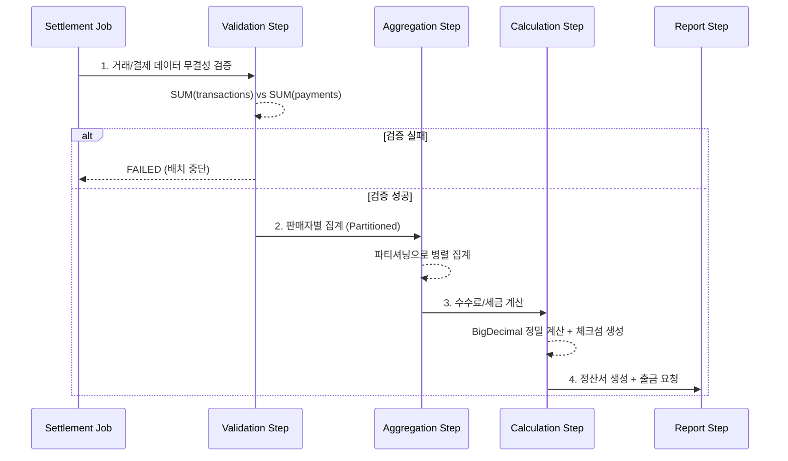

# 정산 배치 설계

정산(Settlement)은 배치 시스템에서 가장 높은 정확성과 신뢰성이 요구되는 도메인이다. 이 문서에서는 Spring Batch를 활용한 정산 배치의 전체 아키텍처, 데이터 집계 전략, 대사(Reconciliation) 기본, 그리고 프로덕션 수준의 코드 예제를 다룬다.

## 목차
- [1. 핵심 개념 (What)](#1-핵심-개념-what)
- [2. 왜 알아야 하는가 (Why)](#2-왜-알아야-하는가-why)
- [3. 내부 구현 분석 (How)](#3-내부-구현-분석-how)
- [4. 실전 예제](#4-실전-예제)
- [5. 정리](#5-정리)

---

## 1. 핵심 개념 (What)

### 정산 배치의 정의

정산 배치란 일정 기간 동안 발생한 거래를 집계하여 판매자(또는 파트너)에게 지급할 금액을 계산하는 프로세스다. 단순한 합산이 아니라 수수료 차감, 세금 계산, 무결성 검증까지 포함한다.

### 전체 아키텍처

```
┌─────────────────────────────────────────────────────────────────────────┐
│                         정산 배치 Job                                    │
│                                                                          │
│  ┌──────────────┐                                                       │
│  │ 검증 Step    │  거래 내역 무결성 검증                                  │
│  └──────┬───────┘                                                       │
│         ▼                                                                │
│  ┌──────────────┐                                                       │
│  │ 집계 Step    │  판매자별 거래 집계 (파티셔닝)                          │
│  │ (Partitioned)│                                                       │
│  └──────┬───────┘                                                       │
│         ▼                                                                │
│  ┌──────────────┐                                                       │
│  │ 정산금 계산   │  수수료 차감, 세금 계산                                │
│  └──────┬───────┘                                                       │
│         ▼                                                                │
│  ┌──────────────┐   ┌──────────────┐                                   │
│  │ 정산서 생성   │──▶│ 출금 요청    │                                    │
│  └──────────────┘   └──────────────┘                                   │
└─────────────────────────────────────────────────────────────────────────┘
```

정산 배치는 크게 4단계로 구성된다:

1. **검증 Step** -- 거래 내역과 결제 내역의 무결성을 검증한다
2. **집계 Step** -- 판매자별로 거래를 집계하며, 대량 데이터를 위해 파티셔닝을 적용한다
3. **정산금 계산** -- 플랫폼 수수료, PG 수수료, 세금을 차감하여 순지급액을 계산한다
4. **정산서 생성 및 출금 요청** -- 최종 정산서를 생성하고 출금을 요청한다

### 도메인 모델

```java
@Entity
@Table(name = "settlements")
public class Settlement {
    @Id
    private Long id;
    private Long sellerId;
    private LocalDate settlementDate;
    private LocalDate periodStart;
    private LocalDate periodEnd;

    private BigDecimal totalSales;
    private BigDecimal platformFee;
    private BigDecimal pgFee;
    private BigDecimal tax;
    private BigDecimal netAmount;
    private int transactionCount;

    @Enumerated(EnumType.STRING)
    private SettlementStatus status;  // PENDING, CONFIRMED, PAID

    private String checksum;  // 무결성 검증용
}
```

핵심 필드 설명:

| 필드 | 역할 |
|------|------|
| `totalSales` | 총 매출액 |
| `platformFee` | 플랫폼 수수료 |
| `pgFee` | PG 수수료 |
| `tax` | 원천징수 세금 |
| `netAmount` | 최종 지급액 (매출 - 수수료 - 세금) |
| `checksum` | SHA-256 기반 무결성 검증 해시 |
| `status` | 정산 상태 (PENDING → CONFIRMED → PAID) |

---

## 2. 왜 알아야 하는가 (Why)

### 정산 배치가 특별한 이유

정산은 **돈**과 직결되는 배치 처리다. 일반적인 데이터 배치와 달리 다음과 같은 제약 조건이 추가된다:

- **정확성**: 1원이라도 차이가 나면 안 된다. 부동소수점 오차 방지를 위해 반드시 `BigDecimal`을 사용해야 한다
- **무결성**: 거래 내역과 결제 내역의 정합성을 보장해야 한다. 대사(Reconciliation)가 필수다
- **감사 추적**: 정산 과정의 모든 단계가 추적 가능해야 한다
- **멱등성**: 동일 기간에 대해 재실행해도 결과가 동일해야 한다

### 대사(Reconciliation)의 중요성

대사란 서로 다른 시스템 간의 데이터를 비교하여 일치 여부를 확인하는 프로세스다. 정산에서는 다음을 검증한다:

- 거래 금액 합계 vs 결제 금액 합계
- 중복 거래 존재 여부
- 누락 거래 존재 여부

대사 없이 정산을 진행하면, 잘못된 금액이 판매자에게 지급될 위험이 있다.

---

## 3. 내부 구현 분석 (How)

### 거래 내역 검증 (Validation Step)

정산 전 가장 먼저 수행하는 것은 데이터 무결성 검증이다. Tasklet 기반으로 구현하며, 거래 금액 합계와 결제 금액 합계를 비교한다.

```java
/**
 * Best Practice: 정산 전 데이터 무결성 검증
 * - 거래 금액 합계 vs 결제 금액 합계 일치 확인
 * - 중복 거래 체크 / 누락 거래 체크
 */
@Bean
@StepScope
public Tasklet validationTasklet(
        @Value("#{jobParameters['periodStart']}") String periodStart,
        @Value("#{jobParameters['periodEnd']}") String periodEnd) {

    return (contribution, chunkContext) -> {
        BigDecimal transactionSum = jdbcTemplate.queryForObject(
                "SELECT COALESCE(SUM(amount), 0) FROM transactions " +
                "WHERE status = 'COMPLETED' AND completed_at BETWEEN ? AND ? AND settled = false",
                BigDecimal.class, periodStart, periodEnd);

        BigDecimal paymentSum = jdbcTemplate.queryForObject(
                "SELECT COALESCE(SUM(amount), 0) FROM payments " +
                "WHERE status = 'SUCCESS' AND paid_at BETWEEN ? AND ?",
                BigDecimal.class, periodStart, periodEnd);

        BigDecimal diff = transactionSum.subtract(paymentSum).abs();
        BigDecimal tolerance = transactionSum.multiply(new BigDecimal("0.0001"));
        boolean isValid = diff.compareTo(tolerance) <= 0;

        chunkContext.getStepContext().getStepExecution()
                .getExecutionContext().put("validationPassed", isValid);

        if (!isValid) {
            log.error("정산 검증 실패 - 거래합계: {}, 결제합계: {}", transactionSum, paymentSum);
        }
        return RepeatStatus.FINISHED;
    };
}
```

핵심 포인트:

- `COALESCE`로 NULL 방지
- 허용 오차(tolerance)를 0.01%로 설정하여 소수점 반올림 차이를 허용
- 검증 결과를 `ExecutionContext`에 저장하여 후속 Step에서 참조

### 집계 Processor

판매자별 거래를 집계하고 수수료와 세금을 계산하는 핵심 로직이다.

```java
/**
 * Best Practice: 정확한 금액 계산
 * - BigDecimal 사용 (부동소수점 오차 방지)
 * - 반올림 정책 명시
 * - 체크섬으로 무결성 검증
 */
@Override
public SellerAggregation process(Long sellerId) throws Exception {
    Map<String, Object> result = jdbcTemplate.queryForMap(
            "SELECT COUNT(*) as transaction_count, " +
            "COALESCE(SUM(amount), 0) as total_sales, " +
            "COALESCE(SUM(platform_fee), 0) as total_platform_fee, " +
            "COALESCE(SUM(pg_fee), 0) as total_pg_fee " +
            "FROM transactions WHERE seller_id = ? AND status = 'COMPLETED' " +
            "AND completed_at BETWEEN ? AND ? AND settled = false",
            sellerId, periodStart, periodEnd);

    BigDecimal totalSales = (BigDecimal) result.get("total_sales");
    BigDecimal platformFee = (BigDecimal) result.get("total_platform_fee");
    BigDecimal pgFee = (BigDecimal) result.get("total_pg_fee");

    // 세금 계산 (원천징수 3.3%)
    BigDecimal taxableAmount = totalSales.subtract(platformFee).subtract(pgFee);
    BigDecimal tax = taxableAmount.multiply(new BigDecimal("0.033"))
            .setScale(0, RoundingMode.DOWN);
    BigDecimal netAmount = taxableAmount.subtract(tax);

    String checksum = DigestUtils.sha256Hex(
            String.format("%d:%s:%s:%s", sellerId, totalSales, netAmount, periodStart));

    return SellerAggregation.builder()
            .sellerId(sellerId).totalSales(totalSales)
            .platformFee(platformFee).pgFee(pgFee)
            .tax(tax).netAmount(netAmount)
            .checksum(checksum).build();
}
```

핵심 포인트:

- **BigDecimal** -- `double`이나 `float`를 절대 사용하지 않는다. 금액 계산에서 `0.1 + 0.2 != 0.3` 같은 오차가 발생하면 정산 금액이 틀어진다
- **RoundingMode.DOWN** -- 세금 계산 시 버림 처리. 반올림 정책은 비즈니스 규칙에 따라 결정
- **체크섬** -- 판매자 ID, 총매출, 순지급액, 정산기간을 조합한 SHA-256 해시로 사후 무결성 검증 가능

---

## 4. 실전 예제

### 정산 Job 전체 구성

```java
@Configuration
@RequiredArgsConstructor
public class SettlementJobConfig {

    private final JobRepository jobRepository;
    private final PlatformTransactionManager transactionManager;

    @Bean
    public Job settlementJob() {
        return new JobBuilder("settlementJob", jobRepository)
                .validator(new DefaultJobParametersValidator(
                        new String[]{"periodStart", "periodEnd"},
                        new String[]{"dryRun"}
                ))
                .incrementer(new RunIdIncrementer())
                .start(validationStep())
                .on("FAILED").fail()
                .from(validationStep()).on("*")
                .to(aggregationStep())
                .next(settlementCalculationStep())
                .next(settlementReportStep())
                .end()
                .build();
    }

    @Bean
    public Step validationStep() {
        return new StepBuilder("validationStep", jobRepository)
                .tasklet(validationTasklet(null, null), transactionManager)
                .build();
    }

    @Bean
    public Step aggregationStep() {
        return new StepBuilder("aggregationStep", jobRepository)
                .partitioner("sellerPartitioner", sellerPartitioner())
                .step(sellerAggregationStep())
                .gridSize(8)
                .taskExecutor(new SimpleAsyncTaskExecutor())
                .build();
    }
}
```

### 정산 데이터 집계 흐름 (Mermaid)



### 파티셔닝을 활용한 병렬 집계

대량의 판매자를 처리할 때 파티셔닝으로 병렬 처리하면 성능을 크게 개선할 수 있다.

```java
@Bean
public Partitioner sellerPartitioner() {
    return gridSize -> {
        List<Long> sellerIds = jdbcTemplate.queryForList(
                "SELECT DISTINCT seller_id FROM transactions " +
                "WHERE status = 'COMPLETED' AND settled = false",
                Long.class);

        Map<String, ExecutionContext> partitions = new HashMap<>();
        List<List<Long>> chunks = Lists.partition(sellerIds,
                sellerIds.size() / gridSize + 1);

        for (int i = 0; i < chunks.size(); i++) {
            ExecutionContext context = new ExecutionContext();
            context.put("sellerIds", chunks.get(i));
            partitions.put("partition" + i, context);
        }
        return partitions;
    };
}
```

---

## 5. 정리

| 항목 | 핵심 내용 |
|------|----------|
| **아키텍처** | 검증 → 집계 → 계산 → 생성/출금의 4단계 파이프라인 |
| **금액 계산** | 반드시 `BigDecimal` 사용, `RoundingMode` 명시 |
| **무결성 검증** | 대사(Reconciliation)로 거래-결제 정합성 확인 |
| **체크섬** | SHA-256 해시로 정산 결과의 사후 검증 가능 |
| **성능** | 파티셔닝으로 판매자별 병렬 집계 |
| **멱등성** | 동일 기간 재실행 시 동일 결과 보장 |
| **상태 관리** | PENDING → CONFIRMED → PAID 상태 흐름 |

정산 배치는 "정확성"이 생명이다. 성능 최적화보다 데이터 정합성을 우선시하고, 모든 계산 과정에서 BigDecimal과 명시적 반올림 정책을 사용해야 한다. 대사 단계를 건너뛰는 것은 운영 사고의 지름길이다.

---
*참고: Spring Batch 5.x / Spring Boot 3.x 기준*
