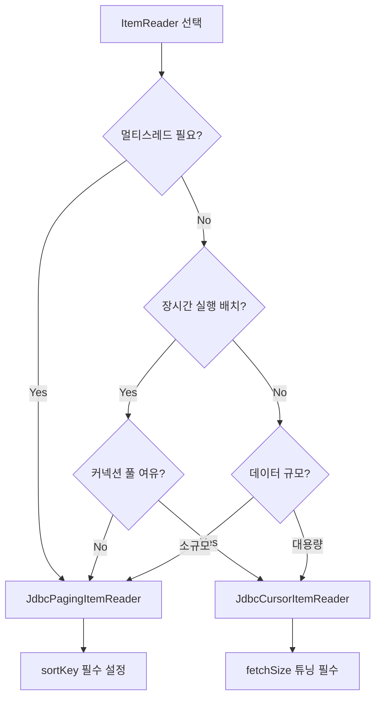

# Spring Batch 내부 아키텍처와 설계 철학

Spring Batch의 설계 철학(표준화, 관심사 분리)과 Chunk 처리의 내부 동작 원리를 분석한다. SimpleChunkProvider/SimpleChunkProcessor의 의사코드와 JdbcCursorItemReader vs JdbcPagingItemReader의 내부 차이를 깊이 있게 다룬다.

## 목차
- [1. 핵심 개념 (What)](#1-핵심-개념-what)
- [2. 왜 알아야 하는가 (Why)](#2-왜-알아야-하는가-why)
- [3. 내부 구현 분석 (How)](#3-내부-구현-분석-how)
- [4. 실전 예제](#4-실전-예제)
- [5. 정리](#5-정리)

---

## 1. 핵심 개념 (What)

### 설계 철학

Spring Batch는 **Accenture의 수십 년간 엔터프라이즈 배치 처리 경험**과 Spring 프레임워크의 설계 원칙이 결합된 프레임워크다. 핵심 철학을 이해하면 "왜 이렇게 동작하는가"가 명확해진다.

### 핵심 설계 원칙

```
┌──────────────────────────────────────────────────────────────────────┐
│                    Spring Batch 설계 원칙                              │
├──────────────────────────────────────────────────────────────────────┤
│                                                                       │
│  1. Chunk 기반 처리 (Chunk-oriented Processing)                      │
│     └── 왜? 전체를 메모리에 올리면 OOM. N건씩 끊어서 처리하면         │
│         메모리 사용량 = O(ChunkSize), 트랜잭션 단위도 제어 가능       │
│                                                                       │
│  2. 재시작 가능성 (Restartability)                                    │
│     └── 왜? 대용량 배치는 실패가 "정상"이다.                          │
│         10시간 배치가 9시간째 실패하면 처음부터 재실행?                │
│         → 실패 지점부터 재시작해야 한다                                │
│                                                                       │
│  3. 관심사 분리 (Separation of Concerns)                              │
│     └── 읽기(Reader) / 가공(Processor) / 쓰기(Writer) 분리           │
│         → 각 컴포넌트 독립 테스트, 교체 가능                          │
│                                                                       │
│  4. 확장성 (Scalability)                                              │
│     └── 단일 스레드 → 멀티스레드 → 파티셔닝 → 원격 분산              │
│         코드 변경 최소화로 스케일 아웃 가능                            │
│                                                                       │
│  5. 메타데이터 기반 운영 (Operational Metadata)                       │
│     └── 모든 실행 이력이 DB에 기록된다                                │
│         → 모니터링, 감사, 재시작의 기반                                │
│                                                                       │
└──────────────────────────────────────────────────────────────────────┘
```

### 메타데이터 테이블 구조

```
┌────────────────────────────────────────────────────────────────────┐
│                     메타데이터 테이블 구조                            │
│                                                                     │
│  BATCH_JOB_INSTANCE          "Job + Parameters = 유일한 인스턴스"    │
│  ├── BATCH_JOB_EXECUTION     "인스턴스의 실행 시도 (N회 가능)"      │
│  │   ├── BATCH_JOB_EXECUTION_PARAMS   "실행 파라미터"              │
│  │   ├── BATCH_JOB_EXECUTION_CONTEXT  "Job 레벨 상태 저장"         │
│  │   └── BATCH_STEP_EXECUTION         "Step 실행 이력"             │
│  │       └── BATCH_STEP_EXECUTION_CONTEXT  "Step 레벨 상태 저장"   │
│  └──                                                                │
│                                                                     │
│  이것이 없으면:                                                     │
│  - 이전 실행이 성공했는지 실패했는지 모른다                          │
│  - 어디까지 처리했는지 모른다                                       │
│  - 같은 Job을 중복 실행할 위험이 있다                                │
│  - 운영 이력을 추적할 수 없다                                       │
└────────────────────────────────────────────────────────────────────┘
```

**Spring Batch가 다른 스케줄러(Quartz, cron)와 근본적으로 다른 점:**
- Quartz/cron: "언제 실행할지"만 관리
- Spring Batch: "무엇을 어디까지 처리했고, 어떤 상태인지"까지 관리

---

## 2. 왜 알아야 하는가 (Why)

Spring Batch의 내부 동작을 이해해야 하는 실무적 이유:

1. **디버깅** -- Chunk 처리 중 예외가 발생했을 때, 트랜잭션 경계를 모르면 데이터 유실 원인을 찾을 수 없다
2. **성능 튜닝** -- Reader 선택(Cursor vs Paging)에 따라 DB 커넥션 사용 패턴이 완전히 달라진다
3. **장애 대응** -- 재시작 메커니즘을 모르면, 실패 후 재실행 시 중복 처리가 발생할 수 있다
4. **설계 결정** -- CompletionPolicy, ExceptionHandler 등을 적절히 활용하려면 내부 루프 구조를 알아야 한다

---

## 3. 내부 구현 분석 (How)

### 3.1 TaskletStep.execute() 내부 루프

실제로 Step이 실행될 때 내부에서 일어나는 일을 단계별로 추적한다.

```
TaskletStep.execute(StepExecution)
│
├── 1. StepExecution 초기화 (status = STARTED)
│
├── 2. RepeatTemplate.iterate() ──── 반복 루프 시작
│   │
│   └── 반복할 때마다:
│       │
│       ├── 3. TransactionTemplate.execute() ──── 트랜잭션 시작
│       │   │
│       │   ├── 4. ChunkOrientedTasklet.execute()
│       │   │   │
│       │   │   ├── 4a. chunkProvider.provide() ── ItemReader.read() × chunkSize
│       │   │   │   └── read()가 null 반환 시 → 데이터 소진, 루프 종료 신호
│       │   │   │
│       │   │   ├── 4b. chunkProcessor.process(chunk)
│       │   │   │   ├── ItemProcessor.process() × chunk.size()
│       │   │   │   └── ItemWriter.write(processedItems)
│       │   │   │
│       │   │   └── return RepeatStatus.CONTINUABLE or FINISHED
│       │   │
│       │   ├── 5. ExecutionContext 업데이트 (DB 저장)
│       │   │
│       │   └── 6. 트랜잭션 커밋 (또는 예외 시 롤백)
│       │
│       └── CompletionPolicy 확인 → 계속할지 중단할지 결정
│
├── 7. StepExecution 갱신 (readCount, writeCount, etc.)
│
└── 8. ExitStatus 결정 → 반환
```

핵심 포인트:
- 각 Chunk가 하나의 트랜잭션 안에서 실행된다
- `RepeatTemplate`이 외부 루프를 제어하고, `TransactionTemplate`이 트랜잭션 경계를 관리한다
- Chunk 처리 후 `ExecutionContext`가 DB에 저장되어 재시작 시 복원 가능하다

### 3.2 ChunkOrientedTasklet.execute() 의사코드

```java
/**
 * 내부 의사코드 - 실제 Spring Batch의 ChunkOrientedTasklet
 *
 * 핵심: Reader는 트랜잭션 안에서 실행되지만,
 *       Cursor 기반 Reader는 트랜잭션 밖에서 커넥션을 유지한다.
 */
public RepeatStatus execute(StepContribution contribution, ChunkContext chunkContext) {

    // ──── 트랜잭션 경계 시작 (이미 TransactionTemplate에 의해 열려있음) ────

    // Step 1: 데이터 읽기 (chunkSize만큼)
    Chunk<I> inputs = chunkProvider.provide(contribution);
    //  └── 내부: while (inputs.size() < chunkSize) { item = reader.read(); }
    //      null이 나올 때까지 읽거나 chunkSize에 도달하면 종료

    if (inputs.isEmpty()) {
        return RepeatStatus.FINISHED;  // 데이터 없으면 Step 종료
    }

    // Step 2: 가공 + 쓰기
    chunkProcessor.process(contribution, inputs);
    //  └── 내부:
    //      List<O> outputs = new ArrayList<>();
    //      for (I item : inputs) {
    //          O output = processor.process(item);
    //          if (output != null) outputs.add(output);  // null이면 필터링
    //      }
    //      writer.write(new Chunk<>(outputs));

    // ──── 트랜잭션 경계 종료 (TransactionTemplate이 커밋) ────

    return RepeatStatus.CONTINUABLE;  // 다음 Chunk 계속 처리
}
```

### 3.3 RepeatTemplate과 CompletionPolicy

```
┌──────────────────────────────────────────────────────────────────┐
│                    RepeatTemplate 동작 원리                        │
│                                                                   │
│  RepeatTemplate은 "언제까지 반복할 것인가?"를 제어한다             │
│                                                                   │
│  ┌────────────────────────────────────────────────────────┐      │
│  │                CompletionPolicy                         │      │
│  │                                                         │      │
│  │  SimpleCompletionPolicy(chunkSize)                      │      │
│  │  └── chunkSize만큼 읽으면 Chunk 완료                    │      │
│  │                                                         │      │
│  │  TimeoutTerminationPolicy(timeout)                      │      │
│  │  └── 지정 시간 초과 시 Chunk 완료                       │      │
│  │                                                         │      │
│  │  CompositeCompletionPolicy                              │      │
│  │  └── 여러 정책 조합 (OR 조건)                           │      │
│  │                                                         │      │
│  │  CountingCompletionPolicy                               │      │
│  │  └── 호출 횟수 기반                                     │      │
│  └────────────────────────────────────────────────────────┘      │
│                                                                   │
│  ExceptionHandler: 예외 발생 시 어떻게 할 것인가?                 │
│  └── SimpleLimitExceptionHandler(limit)                          │
│      → limit 횟수까지 예외 무시 후 재시도, 초과 시 전파            │
│                                                                   │
└──────────────────────────────────────────────────────────────────┘
```

### 3.4 SimpleChunkProvider / SimpleChunkProcessor 내부

#### SimpleChunkProvider.provide()

```java
/**
 * 의사코드: 데이터를 chunkSize만큼 읽어서 Chunk에 담는다
 */
public Chunk<I> provide(StepContribution contribution) {
    Chunk<I> inputs = new Chunk<>();

    // repeatOperations = RepeatTemplate (CompletionPolicy가 적용됨)
    repeatOperations.iterate(context -> {
        I item = read(contribution, inputs);  // ItemReader.read() 호출

        if (item == null) {
            inputs.setEnd();  // 데이터 소진 마킹
            return RepeatStatus.FINISHED;
        }

        inputs.add(item);
        contribution.incrementReadCount();
        return RepeatStatus.CONTINUABLE;
    });

    return inputs;
}
```

#### SimpleChunkProcessor.process()

```java
/**
 * 의사코드: 읽은 데이터를 가공하고 쓴다
 */
public void process(StepContribution contribution, Chunk<I> inputs) {
    // Step 1: Transform (Processor 적용)
    Chunk<O> outputs = transform(contribution, inputs);
    //  └── 각 item에 대해 processor.process(item) 호출
    //      null 반환 시 필터 카운트 증가, 결과에서 제외

    // Step 2: 가공 후 입력-출력 연결 (Skip 시 필요)
    adjustOutputsForSkips(inputs, outputs);

    // Step 3: Write
    write(contribution, inputs, outputs);
    //  └── writer.write(outputs)
    //      실패 시 → Skip/Retry 정책에 따라 처리
}
```

핵심 포인트:
- `provide()`에서 `RepeatTemplate`의 `CompletionPolicy`가 chunkSize를 제어한다
- `process()`에서 Processor가 `null`을 반환하면 해당 아이템은 필터링된다
- `adjustOutputsForSkips()`는 Skip 발생 시 입력-출력 매핑을 유지하는 역할을 한다

---

## 4. 실전 예제

### JdbcCursorItemReader vs JdbcPagingItemReader 내부 차이

```
┌──────────────────────────────────────────────────────────────────────┐
│              Reader 내부 동작 비교                                     │
│                                                                       │
│  JdbcCursorItemReader                                                │
│  ────────────────────                                                │
│  1. Step 시작 시 SQL 실행 → ResultSet 열기                           │
│  2. read() 호출마다 rs.next() → 한 행 반환                           │
│  3. Step 끝나면 ResultSet + Connection 닫기                           │
│                                                                       │
│  특징:                                                                │
│  - 하나의 DB 커넥션이 Step 전체 동안 유지됨                          │
│  - fetchSize로 네트워크 왕복 최적화 (한 번에 N행 가져옴)             │
│  - 트랜잭션과 독립적 (커넥션이 별도)                                 │
│  - 멀티스레드에서 Thread-safe하지 않음 (ResultSet이 공유됨)          │
│  - 재시작 시: ExecutionContext의 read.count로 skip                   │
│                                                                       │
│  JdbcPagingItemReader                                                │
│  ────────────────────                                                │
│  1. read() 호출 → 페이지 내 데이터 반환                              │
│  2. 페이지 소진 시 → 다음 페이지 SQL 실행                            │
│     SELECT * FROM t WHERE id > :lastId ORDER BY id LIMIT :pageSize   │
│  3. 빈 결과 → null 반환 (데이터 소진)                                │
│                                                                       │
│  특징:                                                                │
│  - 페이지마다 새로운 쿼리 실행 (커넥션 반환됨)                       │
│  - 정렬 키(sortKey) 필수 → OFFSET 대신 WHERE 기반 페이징            │
│  - 멀티스레드 가능 (synchronized + saveState=false)                  │
│  - 재시작 시: 마지막 sortKey 값으로 이어서 조회                      │
│                                                                       │
│  ┌────────────────────────────────────────────────────────┐          │
│  │ 선택 기준                                               │          │
│  │                                                         │          │
│  │ Cursor → 단일 스레드, 대용량, 순차 처리                 │          │
│  │ Paging → 멀티스레드, 재시작 필요, 커넥션 풀 보호        │          │
│  │                                                         │          │
│  │ 정산 배치 → Paging 권장 (장시간 커넥션 점유 방지)       │          │
│  └────────────────────────────────────────────────────────┘          │
└──────────────────────────────────────────────────────────────────────┘
```

### Reader 선택 의사결정 흐름 (Mermaid)



### Cursor vs Paging 코드 비교

```java
// JdbcCursorItemReader - Step 전체에서 하나의 커넥션 유지
@Bean
public JdbcCursorItemReader<Order> cursorReader(DataSource dataSource) {
    return new JdbcCursorItemReaderBuilder<Order>()
            .name("orderCursorReader")
            .dataSource(dataSource)
            .sql("SELECT * FROM orders WHERE status = 'PENDING' ORDER BY id")
            .fetchSize(1000)      // 네트워크 왕복 최적화
            .rowMapper(new OrderRowMapper())
            .build();
}

// JdbcPagingItemReader - 페이지마다 커넥션 획득/반환
@Bean
public JdbcPagingItemReader<Order> pagingReader(DataSource dataSource) {
    return new JdbcPagingItemReaderBuilder<Order>()
            .name("orderPagingReader")
            .dataSource(dataSource)
            .selectClause("SELECT *")
            .fromClause("FROM orders")
            .whereClause("WHERE status = 'PENDING'")
            .sortKeys(Map.of("id", Order.ASCENDING))  // 필수!
            .pageSize(1000)
            .rowMapper(new OrderRowMapper())
            .build();
}
```

---

## 5. 정리

| 항목 | 내용 |
|------|------|
| **설계 철학** | Chunk 기반 처리, 재시작 가능성, 관심사 분리, 확장성, 메타데이터 기반 운영 |
| **메타데이터** | Job/Step 실행 이력을 DB에 기록하여 재시작, 모니터링, 감사의 기반 제공 |
| **Chunk 처리 루프** | RepeatTemplate(반복 제어) → TransactionTemplate(트랜잭션) → ChunkOrientedTasklet(R/P/W) |
| **ChunkProvider** | RepeatTemplate + CompletionPolicy로 chunkSize만큼 읽기 |
| **ChunkProcessor** | transform(Processor) → adjustOutputsForSkips → write(Writer) |
| **CursorReader** | 단일 커넥션, ResultSet 기반, Thread-unsafe, fetchSize 튜닝 |
| **PagingReader** | 페이지별 새 쿼리, WHERE 기반 페이징, Thread-safe 가능, sortKey 필수 |
| **Quartz vs Batch** | Quartz = "언제", Spring Batch = "무엇을 어디까지" |

Spring Batch의 내부 아키텍처를 이해하면 단순히 "동작하는 코드"를 넘어 "왜 이렇게 동작하는지"를 설명할 수 있다. 이는 장애 대응, 성능 튜닝, 아키텍처 결정에서 핵심적인 차이를 만든다.

---
*참고: Spring Batch 5.x / Spring Boot 3.x 기준*
