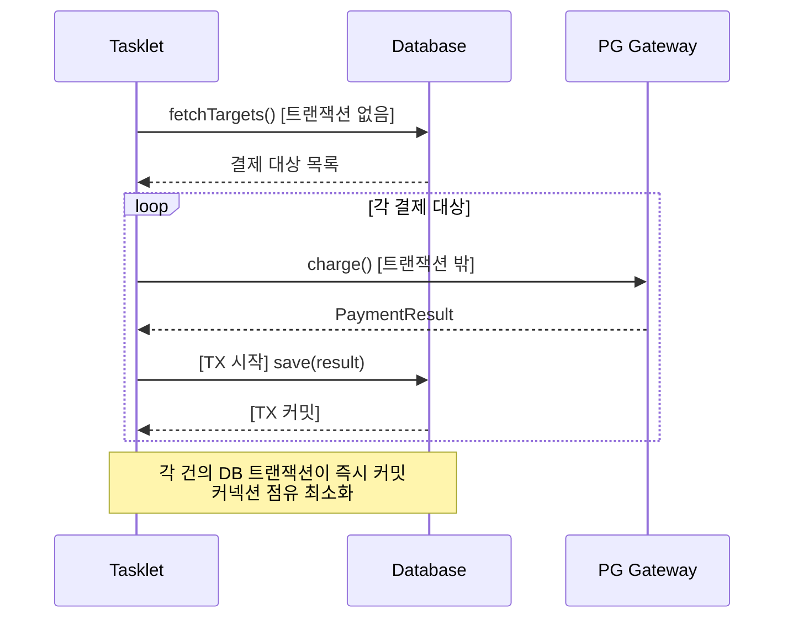
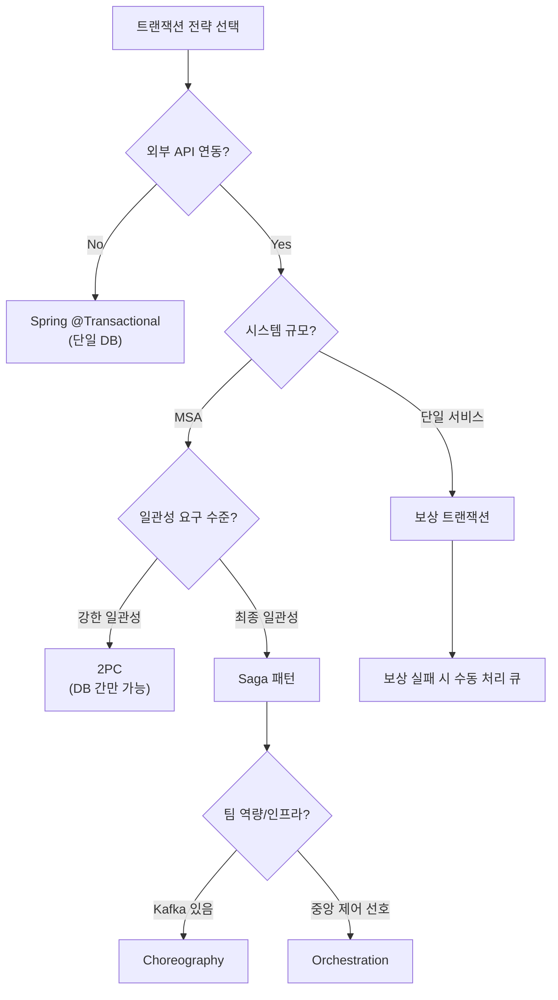

# 트랜잭션 심화

Chunk 트랜잭션 경계의 정확한 이해, Skip 시 트랜잭션 재시도(Scan 모드), 외부 API 호출과 트랜잭션 분리, 보상 트랜잭션 심화를 다룬다. 트랜잭션은 Spring Batch에서 데이터 정합성을 보장하는 핵심 메커니즘이다.

## 목차
- [1. 핵심 개념 (What)](#1-핵심-개념-what)
- [2. 왜 알아야 하는가 (Why)](#2-왜-알아야-하는가-why)
- [3. 내부 구현 분석 (How)](#3-내부-구현-분석-how)
- [4. 실전 예제](#4-실전-예제)
- [5. 정리](#5-정리)

---

## 1. 핵심 개념 (What)

### Chunk 트랜잭션 경계

Spring Batch에서 Chunk는 트랜잭션의 기본 단위다. 하나의 Chunk = 하나의 트랜잭션이며, Read → Process → Write가 모두 같은 트랜잭션 안에서 실행된다.

### 정상 흐름

```
Chunk 1:  [TX 시작] → Read×N → Process×N → Write → [TX 커밋] → EC 저장
Chunk 2:  [TX 시작] → Read×N → Process×N → Write → [TX 커밋] → EC 저장
Chunk 3:  [TX 시작] → Read×N → Process×N → Write → [TX 커밋] → EC 저장
...
```

각 Chunk가 독립적인 트랜잭션으로 처리되므로:
- Chunk 1이 커밋된 후 Chunk 2에서 실패해도, Chunk 1의 데이터는 안전하다
- ExecutionContext(EC)는 트랜잭션 커밋 후 저장되어 재시작 시 복원 가능하다

### 실패 시 롤백 범위

```
Chunk 1: [TX 시작] → Read×N → Process×N → Write → [TX 커밋] (커밋됨, 안전)
Chunk 2: [TX 시작] → Read×N → Process×3 → 예외 발생!
         └── [TX 롤백] ← Chunk 2의 Write 이전이므로 DB 변경 없음
                         ← 하지만 Read한 데이터는 이미 소비됨!

재시작 시:
└── ExecutionContext에 저장된 마지막 성공 위치(Chunk 1 끝)부터 재개
```

---

## 2. 왜 알아야 하는가 (Why)

트랜잭션 경계에 대한 이해 없이 Spring Batch를 사용하면 다음 문제가 발생한다:

- **데이터 유실**: 외부 API를 트랜잭션 안에서 호출하면, 롤백 시 이미 완료된 외부 호출은 취소할 수 없다
- **성능 저하**: 트랜잭션이 너무 오래 유지되면 DB 커넥션 풀이 고갈된다
- **중복 처리**: Reader 종류에 따라 롤백 후 재시작 시 이미 읽은 데이터를 다시 읽을 수도 있고, 건너뛸 수도 있다
- **Skip 오동작**: Writer에서 Skip이 발생할 때 Scan 모드의 동작 원리를 모르면, 왜 성능이 급격히 나빠지는지 이해할 수 없다

---

## 3. 내부 구현 분석 (How)

### 3.1 Reader가 읽은 데이터는 롤백되나?

```
┌────────────────────────────────────────────────────────────────────┐
│  답: Reader 종류에 따라 다르다                                      │
│                                                                     │
│  CursorItemReader:                                                  │
│  - 별도 커넥션 → 트랜잭션 롤백과 무관                              │
│  - 이미 읽은 위치(커서)는 되돌릴 수 없음                           │
│  - 재시작 시 ExecutionContext의 read.count로 skip                  │
│                                                                     │
│  PagingItemReader:                                                  │
│  - 페이지 단위로 새 쿼리 실행                                      │
│  - 같은 트랜잭션 사용 시 롤백되면 다시 조회 가능                   │
│  - 단, readerIsTransactionalQueue() 설정 시 트랜잭션 밖에서 읽음   │
│                                                                     │
│  JMS/Kafka Reader (메시지 큐):                                      │
│  - readerIsTransactionalQueue() 설정 필수                           │
│  - 트랜잭션 롤백 시 메시지가 큐로 복귀해야 하므로                  │
│  - 큐의 트랜잭션과 DB 트랜잭션이 별도로 관리됨                     │
└────────────────────────────────────────────────────────────────────┘
```

이 차이는 중요하다. CursorReader를 사용할 때 트랜잭션이 롤백되어도 커서 위치는 되돌아가지 않으므로, 재시작 메커니즘(ExecutionContext 기반)에 의존해야 한다.

### 3.2 Skip 시 트랜잭션 재시도 메커니즘 (Scan 모드)

Skip이 발생하면 Spring Batch는 "어떤 아이템이 문제인지" 찾기 위해 **Scan 모드**로 전환한다.

#### Writer에서 예외 발생 시

```
정상 흐름:
[TX] Read(1,2,3,4,5) → Process(1,2,3,4,5) → Write(1,2,3,4,5) → [커밋]

Writer에서 예외 발생 시:
[TX] Read(1,2,3,4,5) → Process(1,2,3,4,5) → Write(1,2,3,4,5) → 예외!
└── [TX 롤백]

Scan 모드 진입 (아이템 하나씩 재시도):
[TX] Process(1) → Write(1) → [커밋]
[TX] Process(2) → Write(2) → [커밋]
[TX] Process(3) → Write(3) → 예외! → Skip 처리 → [롤백]
[TX] Process(4) → Write(4) → [커밋]
[TX] Process(5) → Write(5) → [커밋]

결과: 아이템 3만 Skip, 나머지는 정상 처리
```

#### 왜 이렇게 동작하는가?

```
┌────────────────────────────────────────────────────────────────────┐
│  Write는 벌크 연산이다.                                             │
│  write([1,2,3,4,5]) 호출 시 5건이 한꺼번에 DB에 들어간다.          │
│                                                                     │
│  5건 중 3번이 문제라면?                                             │
│  → 전체 롤백 후, 한 건씩 다시 시도해서 문제 건만 Skip해야 한다     │
│                                                                     │
│  이것이 Scan 모드의 존재 이유:                                      │
│  - 대부분의 아이템을 살리면서                                       │
│  - 문제 아이템만 정확히 식별하여 Skip                                │
│                                                                     │
│  트레이드오프:                                                      │
│  - Scan 모드 진입 시 성능 저하 (N건 → N번 트랜잭션)                │
│  - Skip이 빈번하면 전체 배치 성능이 급격히 나빠질 수 있다           │
│  - skipLimit을 적절히 설정하여 비정상 상황 조기 탐지                 │
└────────────────────────────────────────────────────────────────────┘
```

#### Processor에서 Skip 발생 시

Processor는 단건 처리이므로 Scan 모드가 필요 없다. 해당 아이템만 건너뛰면 된다.

```
Processor에서 예외 발생 시는 Scan 모드가 아니다.
Processor는 단건 처리이므로 해당 아이템만 Skip하면 된다.

[TX] Read(1,2,3,4,5) → Process(1) → Process(2) → Process(3) 예외! Skip!
                      → Process(4) → Process(5)
                      → Write(1,2,4,5) → [커밋]

단, Processor에서 Skip 발생 후 캐시된 Reader 데이터를 다시 Read해야 할 수 있다.
이때 Reader의 캐싱 여부가 중요하다.
```

### 3.3 외부 API 호출과 트랜잭션 분리

#### 안티패턴: 트랜잭션 안에서 외부 API 호출

```
┌────────────────────────────────────────────────────────────────────┐
│  안티패턴: Processor에서 외부 API 호출                              │
│                                                                     │
│  [TX 시작]                                                          │
│    Read(100건)                                                      │
│    Process(1): PG 결제 API 호출 (3초)                               │
│    Process(2): PG 결제 API 호출 (3초)                               │
│    ...                                                              │
│    Process(100): PG 결제 API 호출 (3초)                             │
│    Write(100건)                                                     │
│  [TX 커밋]                                                          │
│                                                                     │
│  문제:                                                              │
│  - 트랜잭션 유지 시간: 300초+ (5분!)                                │
│  - DB 커넥션 300초간 점유                                           │
│  - 커넥션 풀 고갈 위험                                              │
│  - 롤백 시 이미 호출된 PG 결제는 취소 불가                          │
│                                                                     │
│  해결 방법들:                                                       │
│                                                                     │
│  1. Chunk Size를 작게 (10건 이하)                                   │
│     → 트랜잭션 유지 시간 단축                                      │
│                                                                     │
│  2. TransactionTemplate으로 트랜잭션 분리                           │
│     → 외부 호출은 트랜잭션 밖에서, DB 저장만 트랜잭션 안에서        │
│                                                                     │
│  3. Tasklet 방식으로 직접 트랜잭션 관리                             │
│     → 세밀한 트랜잭션 경계 제어                                    │
│                                                                     │
│  4. AsyncItemProcessor 활용                                         │
│     → 외부 호출을 비동기로 처리                                    │
└────────────────────────────────────────────────────────────────────┘
```

---

## 4. 실전 예제

### 4.1 TransactionTemplate을 이용한 트랜잭션 분리 패턴

외부 API 호출은 트랜잭션 밖에서, DB 저장은 별도 트랜잭션으로 처리한다.

```java
/**
 * 외부 API 호출은 트랜잭션 밖에서,
 * DB 저장은 별도 트랜잭션으로 처리하는 Tasklet
 */
@Component
@RequiredArgsConstructor
public class PaymentTasklet implements Tasklet {

    private final PaymentGateway paymentGateway;
    private final PaymentRepository paymentRepository;
    private final TransactionTemplate transactionTemplate;

    @Override
    public RepeatStatus execute(StepContribution contribution,
                                ChunkContext chunkContext) {
        List<PaymentTarget> targets = fetchTargets();  // 트랜잭션 밖에서 조회

        for (PaymentTarget target : targets) {
            // 1. 외부 API 호출 (트랜잭션 밖)
            PaymentResult result = paymentGateway.charge(target);

            // 2. DB 저장 (별도 트랜잭션)
            transactionTemplate.executeWithoutResult(status -> {
                paymentRepository.save(toEntity(target, result));
                target.markAsProcessed();
            });
            // → 트랜잭션이 즉시 커밋/롤백되므로 커넥션 점유 최소화
        }

        return RepeatStatus.FINISHED;
    }
}
```

핵심 포인트:
- `fetchTargets()` -- 트랜잭션 밖에서 대상 조회
- `paymentGateway.charge()` -- 트랜잭션 밖에서 외부 API 호출
- `transactionTemplate.executeWithoutResult()` -- DB 저장만 별도 짧은 트랜잭션으로 처리
- 각 아이템의 DB 저장이 즉시 커밋되므로 커넥션 점유 시간이 최소화된다

### 4.2 외부 API 호출 트랜잭션 분리 흐름 (Mermaid)



### 4.3 보상 트랜잭션 심화 -- 분산 트랜잭션 전략 비교

```
┌────────────────────────────────────────────────────────────────────────┐
│  분산 트랜잭션 전략 비교                                                │
│                                                                         │
│  ┌─────────────────────────────────────────────┐                       │
│  │ 2PC (Two-Phase Commit)                       │                       │
│  │ ─────────────────────────────                │                       │
│  │ Phase 1: 모든 참여자에게 "커밋 가능?" 질의   │                       │
│  │ Phase 2: 모두 OK → 커밋 / 하나라도 NO → 롤백 │                       │
│  │                                               │                       │
│  │ 장점: 강한 일관성                             │                       │
│  │ 단점: 느림, 가용성 저하, DB에서만 가능         │                       │
│  │ 배치에서: 거의 사용하지 않음 (외부 API 2PC 불가)│                      │
│  └─────────────────────────────────────────────┘                       │
│                                                                         │
│  ┌─────────────────────────────────────────────┐                       │
│  │ 보상 트랜잭션 (Compensating Transaction)     │                       │
│  │ ─────────────────────────────────────        │                       │
│  │ 실행: A 성공 → B 성공 → C 실패!             │                       │
│  │ 보상: B 취소 → A 취소                         │                       │
│  │                                               │                       │
│  │ 장점: 구현 직관적, 외부 API에도 적용 가능     │                       │
│  │ 단점: 보상 자체가 실패할 수 있음               │                       │
│  │ 배치에서: 결제 → DB 저장 실패 시 환불 등       │                       │
│  └─────────────────────────────────────────────┘                       │
│                                                                         │
│  ┌─────────────────────────────────────────────┐                       │
│  │ Saga 패턴                                     │                       │
│  │ ─────────────                                │                       │
│  │ 각 단계가 독립 트랜잭션 + 보상 로직 쌍        │                       │
│  │                                               │                       │
│  │ Choreography: 이벤트 기반 (Kafka 등)          │                       │
│  │ Orchestration: 중앙 조정자가 순서 관리         │                       │
│  │                                               │                       │
│  │ 장점: MSA에 적합, 높은 확장성                 │                       │
│  │ 단점: 복잡도 높음, 최종 일관성                 │                       │
│  │ 배치에서: 대규모 정산 시스템에서 사용           │                       │
│  └─────────────────────────────────────────────┘                       │
│                                                                         │
│  정산 배치 권장:                                                        │
│  - 단일 DB 내: Spring @Transactional                                   │
│  - 외부 API 연동: 보상 트랜잭션                                        │
│  - MSA 환경: Saga (Orchestration 방식)                                 │
└────────────────────────────────────────────────────────────────────────┘
```

### 4.4 전략 선택 의사결정 흐름



---

## 5. 정리

| 항목 | 핵심 내용 |
|------|----------|
| **Chunk 트랜잭션** | 1 Chunk = 1 Transaction. Read/Process/Write가 동일 트랜잭션 |
| **롤백 범위** | 해당 Chunk만 롤백, 이전 커밋된 Chunk는 안전 |
| **Reader 롤백** | CursorReader: 롤백 무관 (별도 커넥션), PagingReader: 트랜잭션에 따라 다름 |
| **Scan 모드** | Writer 예외 시 한 건씩 재시도하여 문제 아이템만 Skip |
| **Scan 모드 비용** | N건 → N번 트랜잭션으로 성능 급격히 저하 |
| **Processor Skip** | 단건 처리이므로 Scan 모드 불필요, 해당 건만 Skip |
| **외부 API 안티패턴** | 트랜잭션 안에서 외부 API 호출 = 커넥션 점유 + 롤백 불가 |
| **트랜잭션 분리** | TransactionTemplate으로 외부 호출과 DB 저장 분리 |
| **보상 트랜잭션** | 외부 API 연동 시 실패 대비 보상 로직 필수 |
| **분산 트랜잭션** | 단일 DB: @Transactional, 외부 API: 보상, MSA: Saga |

트랜잭션 경계를 정확히 이해하는 것은 Spring Batch 운영의 핵심이다. 특히 외부 API가 포함된 배치에서는 트랜잭션 분리가 필수이며, 보상 트랜잭션과 수동 처리 큐의 조합이 프로덕션 환경에서의 안정성을 보장한다.

---
*참고: Spring Batch 5.x / Spring Boot 3.x 기준*
