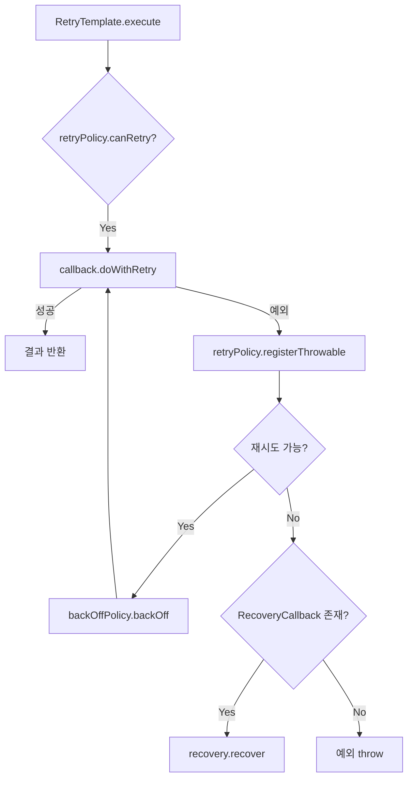
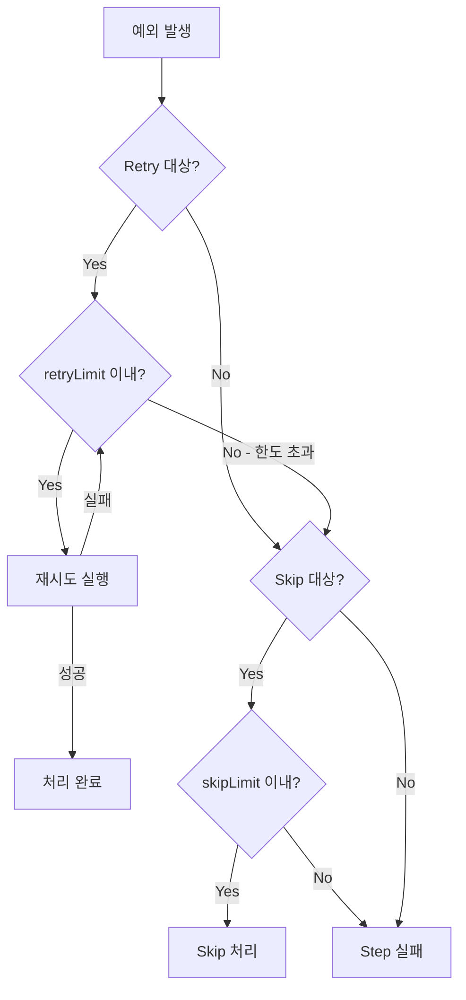

# Retry/Skip 심화 메커니즘

Spring Batch의 Retry와 Skip은 장애 허용(Fault Tolerance) 처리의 핵심이다. 내부적으로 Spring Retry 프레임워크를 활용하며, RetryTemplate의 실행 루프, BackOffPolicy, 그리고 Stateful/Stateless Retry의 차이를 이해해야 프로덕션 수준의 배치를 설계할 수 있다.

## 목차
- [1. 핵심 개념 (What)](#1-핵심-개념-what)
- [2. 왜 알아야 하는가 (Why)](#2-왜-알아야-하는가-why)
- [3. 내부 구현 분석 (How)](#3-내부-구현-분석-how)
- [4. 실전 예제](#4-실전-예제)
- [5. 정리](#5-정리)

---

## 1. 핵심 개념 (What)

Spring Batch의 `.faultTolerant()` 설정은 내부적으로 **spring-retry** 프레임워크를 사용한다. Retry/Skip 메커니즘을 구성하는 핵심 컴포넌트는 다음과 같다.

| 컴포넌트 | 역할 |
|-----------|------|
| `RetryTemplate` | 재시도 루프를 관리하는 핵심 엔진 |
| `RetryCallback` | 실제 비즈니스 로직을 감싸는 콜백 |
| `RetryPolicy` | 재시도 가능 여부를 판단하는 정책 |
| `BackOffPolicy` | 재시도 간 대기 전략 (sleep) |
| `RecoveryCallback` | 모든 재시도 실패 후 실행되는 복구 로직 |
| `SkipPolicy` | 특정 예외 발생 시 건너뛸지 결정하는 정책 |



---

## 2. 왜 알아야 하는가 (Why)

**단순 설정만으로는 부족한 상황들:**

1. **DB 데드락과 외부 API 장애에 서로 다른 재시도 전략이 필요하다** - DB 데드락은 즉시 재시도해도 되지만, 외부 API 장애는 지수 백오프가 필요하다.
2. **Writer 예외와 Processor 예외의 재시도 방식이 다르다** - Processor 예외는 같은 트랜잭션 내에서 재시도하지만(Stateless), Writer 예외는 트랜잭션을 롤백하고 새 트랜잭션에서 재시도한다(Stateful).
3. **비즈니스 로직에 따라 재시도 여부를 동적으로 결정해야 한다** - 카드 한도 초과 같은 영구적 오류는 재시도해도 의미가 없다.
4. **배치 진행 상황에 따라 Skip 정책이 달라져야 한다** - 초반에는 관대하게 Skip하고, 후반에는 엄격하게 처리하는 전략이 필요할 수 있다.

---

## 3. 내부 구현 분석 (How)

### 3.1 RetryTemplate.execute() 내부 루프

RetryTemplate은 재시도 메커니즘의 핵심 엔진이다. RetryContext로 상태를 추적하며, BackOffPolicy로 재시도 간 대기를 관리한다.

```java
/**
 * RetryTemplate 의사코드
 * 핵심: RetryContext로 상태를 추적하며, BackOffPolicy로 대기한다
 */
public <T> T execute(RetryCallback<T> callback, RecoveryCallback<T> recovery) {
    RetryContext context = retryPolicy.open();  // 컨텍스트 생성

    try {
        while (retryPolicy.canRetry(context)) {  // 재시도 가능한가?
            try {
                return callback.doWithRetry(context);  // 실제 로직 실행

            } catch (Exception e) {
                retryPolicy.registerThrowable(context, e);  // 예외 기록

                if (retryPolicy.canRetry(context)) {
                    backOffPolicy.backOff(context);  // 대기 (sleep)
                } else {
                    throw e;  // 재시도 한도 초과
                }
            }
        }

        // 모든 재시도 실패 시 Recovery 실행
        if (recovery != null) {
            return recovery.recover(context);
        }
        throw context.getLastThrowable();

    } finally {
        retryPolicy.close(context);  // 정리
    }
}
```

### 3.2 BackOffPolicy 종류와 선택 기준

```
┌────────────────────────────────────────────────────────────────────┐
│                    BackOffPolicy 비교                               │
│                                                                     │
│  NoBackOffPolicy                                                    │
│  └── 대기 없이 즉시 재시도                                        │
│  └── 용도: 낙관적 락 충돌 등 즉시 재시도해도 되는 경우             │
│                                                                     │
│  FixedBackOffPolicy(backOffPeriod = 1000ms)                        │
│  └── 고정 대기: 1초 → 1초 → 1초                                  │
│  └── 용도: 일반적인 일시적 오류                                    │
│                                                                     │
│  ExponentialBackOffPolicy                                           │
│  └── 지수 증가: 1초 → 2초 → 4초 → 8초                            │
│  └── initialInterval=1000, multiplier=2.0, maxInterval=30000       │
│  └── 용도: 외부 API 장애 (서버 복구 시간 확보)                     │
│                                                                     │
│  ExponentialRandomBackOffPolicy                                     │
│  └── 지수 + 랜덤 지터: 1~1.5초 → 2~3초 → 4~6초                  │
│  └── 용도: 다수 클라이언트가 동시 재시도하는 "Thundering Herd" 방지│
│                                                                     │
│  UniformRandomBackOffPolicy                                         │
│  └── 범위 내 랜덤: minBackOff~maxBackOff 사이 랜덤                │
│  └── 용도: 균등한 부하 분산                                        │
│                                                                     │
│  ┌────────────────────────────────────────────┐                    │
│  │ 정산 배치 권장:                              │                    │
│  │ - DB 데드락 → FixedBackOff(500ms)           │                    │
│  │ - PG API 장애 → ExponentialRandomBackOff    │                    │
│  │ - 네트워크 일시 오류 → ExponentialBackOff   │                    │
│  └────────────────────────────────────────────┘                    │
└────────────────────────────────────────────────────────────────────┘
```

### 3.3 Stateless vs Stateful Retry

두 가지 Retry 방식의 차이를 이해하는 것이 **Writer 예외 처리**의 핵심이다.

#### Stateless Retry (기본)

```
┌────────────────────────────────────────────────────────────────────┐
│  Stateless Retry                                                    │
│                                                                     │
│  Chunk 단위로 재시도 상태가 초기화된다.                             │
│  같은 Chunk 내에서만 재시도 횟수를 추적한다.                        │
│                                                                     │
│  흐름:                                                              │
│  [TX] Process(item) → 예외 → retry 1                               │
│  [TX] Process(item) → 예외 → retry 2                               │
│  [TX] Process(item) → 성공                                         │
│                                                                     │
│  Chunk가 롤백되면 → 재시도 상태도 초기화                           │
│                                                                     │
│  적합한 경우:                                                       │
│  - Processor에서 발생하는 일시적 오류                               │
│  - 외부 API 타임아웃                                                │
│  - 네트워크 불안정                                                  │
└────────────────────────────────────────────────────────────────────┘
```

#### Stateful Retry

```
┌────────────────────────────────────────────────────────────────────┐
│  Stateful Retry                                                     │
│                                                                     │
│  트랜잭션 롤백 후에도 재시도 상태를 유지한다.                       │
│  Writer에서 발생하는 예외에 주로 사용된다.                           │
│                                                                     │
│  흐름:                                                              │
│  [TX1] Read → Process → Write(items) → 예외 → [TX1 롤백]          │
│  ↓ 재시도 상태 유지 (RetryContext가 캐시됨)                        │
│  [TX2] Read → Process → Write(items) → 예외 → [TX2 롤백]          │
│  ↓ retryLimit 초과                                                 │
│  [TX3] → Skip 처리 또는 실패                                       │
│                                                                     │
│  왜 필요한가?                                                       │
│  Writer 예외 → 트랜잭션 전체 롤백 → 새 트랜잭션에서 재시도          │
│  이때 "이전에 몇 번 시도했는지"를 기억해야 무한 재시도 방지          │
│                                                                     │
│  사용법:                                                            │
│  .faultTolerant()                                                   │
│  .retry(DeadlockLoserDataAccessException.class)                     │
│  .retryLimit(3)                                                     │
│  → Writer 예외 시 자동으로 Stateful Retry 적용                     │
└────────────────────────────────────────────────────────────────────┘
```

### 3.4 Skip + Retry 조합 시 내부 동작 순서

```
┌────────────────────────────────────────────────────────────────────┐
│  Skip + Retry 동시 설정 시 우선순위                                 │
│                                                                     │
│  .faultTolerant()                                                   │
│  .retry(TransientException.class).retryLimit(3)                     │
│  .skip(PermanentException.class).skipLimit(100)                     │
│                                                                     │
│  동작 순서:                                                         │
│  1. 예외 발생                                                       │
│  2. Retry 대상인가? → 예 → 재시도 (retryLimit까지)                 │
│  3. retryLimit 초과 시 → Skip 대상인가?                             │
│     → 예 → Skip 처리                                               │
│     → 아니오 → Step 실패                                           │
│                                                                     │
│  즉: Retry 먼저, 소진되면 Skip 시도                                 │
│                                                                     │
│  주의: 같은 예외를 retry + skip에 모두 등록 가능                    │
│  → "3번 재시도하고, 그래도 안 되면 건너뛰기"                        │
└────────────────────────────────────────────────────────────────────┘
```



---

## 4. 실전 예제

### 4.1 비즈니스 로직 기반 커스텀 RetryPolicy

특정 에러 코드에 따라 재시도 여부를 동적으로 결정하는 RetryPolicy이다. 카드 한도 초과나 잔액 부족 같은 영구적 오류는 재시도해도 의미가 없으므로 즉시 포기한다.

```java
/**
 * 예: 특정 에러 코드에 따라 재시도 여부를 결정
 */
public class SmartRetryPolicy implements RetryPolicy {

    private final int maxAttempts;
    private final Set<String> retryableErrorCodes;

    @Override
    public boolean canRetry(RetryContext context) {
        if (context.getRetryCount() >= maxAttempts) return false;

        Throwable lastException = context.getLastThrowable();
        if (lastException instanceof PaymentException pe) {
            // 카드 한도 초과, 잔액 부족 등은 재시도해도 의미 없음
            return retryableErrorCodes.contains(pe.getErrorCode());
        }
        return lastException instanceof TransientException;
    }

    @Override
    public RetryContext open(RetryContext parent) {
        return new RetryContextSupport(parent);
    }

    @Override
    public void close(RetryContext context) { }

    @Override
    public void registerThrowable(RetryContext context, Throwable throwable) {
        ((RetryContextSupport) context).registerThrowable(throwable);
    }
}
```

### 4.2 시간 기반 SkipPolicy

배치 실행 시간에 따라 Skip 허용 여부를 동적으로 결정한다. 초반에는 관대하게 Skip을 허용하고, 후반에는 엄격하게 처리하여 데이터 품질을 보장한다.

```java
/**
 * 배치 시작 후 N분 이내에는 Skip 허용, 이후에는 즉시 실패
 * → 배치 초반에는 관대하게, 후반에는 엄격하게
 */
public class TimeBasedSkipPolicy implements SkipPolicy {

    private final long gracePeriodMs;
    private final int maxSkips;
    private final long startTime = System.currentTimeMillis();

    @Override
    public boolean shouldSkip(Throwable t, long skipCount) {
        long elapsed = System.currentTimeMillis() - startTime;

        if (elapsed < gracePeriodMs) {
            return skipCount < maxSkips;  // 초반: 관대하게 Skip
        }
        return false;  // 후반: Skip 불허 (즉시 실패)
    }
}
```

### 4.3 Retry + Skip 조합 설정 예제

```java
@Bean
public Step settlementStep(JobRepository jobRepository,
                           PlatformTransactionManager transactionManager) {
    return new StepBuilder("settlementStep", jobRepository)
        .<Transaction, Settlement>chunk(500, transactionManager)
        .reader(transactionReader())
        .processor(settlementProcessor())
        .writer(settlementWriter())
        .faultTolerant()
        // Retry 설정: 일시적 오류는 3회 재시도
        .retry(DeadlockLoserDataAccessException.class)
        .retry(TransientDataAccessException.class)
        .retryLimit(3)
        // Skip 설정: 영구적 오류는 최대 100건까지 건너뛰기
        .skip(InvalidDataException.class)
        .skip(DuplicateKeyException.class)
        .skipLimit(100)
        // 커스텀 정책 적용
        .retryPolicy(new SmartRetryPolicy(3, Set.of("TIMEOUT", "CONNECTION_RESET")))
        .skipPolicy(new TimeBasedSkipPolicy(600_000, 50))  // 10분 유예
        .build();
}
```

---

## 5. 정리

| 구분 | Stateless Retry | Stateful Retry |
|------|----------------|----------------|
| **트랜잭션** | 같은 TX 내에서 재시도 | TX 롤백 후 새 TX에서 재시도 |
| **상태 유지** | Chunk 단위로 초기화 | TX 간에도 유지 (캐시) |
| **주 사용처** | Processor 예외 | Writer 예외 |
| **자동 적용** | `.retry()` 기본 | Writer 예외 시 자동 |

| BackOffPolicy | 대기 패턴 | 권장 사용처 |
|--------------|-----------|------------|
| `NoBackOff` | 즉시 | 낙관적 락 충돌 |
| `FixedBackOff` | 고정 간격 | DB 데드락 |
| `ExponentialBackOff` | 지수 증가 | 네트워크 오류 |
| `ExponentialRandomBackOff` | 지수 + 지터 | 외부 API 장애 (Thundering Herd 방지) |

| 동작 순서 | 설명 |
|-----------|------|
| 1단계 | 예외 발생 시 Retry 대상인지 확인 |
| 2단계 | Retry 대상이면 retryLimit까지 재시도 |
| 3단계 | retryLimit 초과 시 Skip 대상인지 확인 |
| 4단계 | Skip 대상이면 건너뛰기, 아니면 Step 실패 |

---
*참고: Spring Batch 5.x / Spring Boot 3.x 기준*
