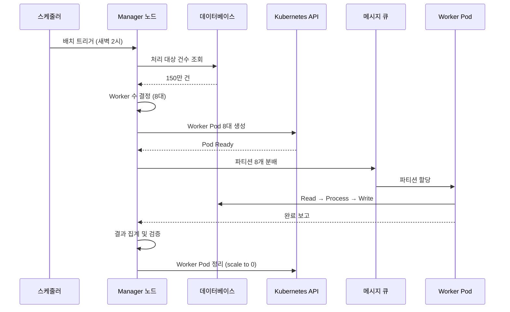

# 대규모 정산 시스템 아키텍처

정산(Settlement) 배치는 일반 배치와 달리 정확성, 멱등성, 감사 추적이 필수이며, 데이터 양 증가에도 SLA를 지켜야 하는 특수한 요구사항을 갖는다. 이 문서에서는 정산 배치의 특수성과, 데이터 양에 따라 Worker를 동적으로 스케일링하는 아키텍처를 다룬다.

## 목차
- [1. 핵심 개념 (What)](#1-핵심-개념-what)
- [2. 왜 알아야 하는가 (Why)](#2-왜-알아야-하는가-why)
- [3. 내부 구현 분석 (How)](#3-내부-구현-분석-how)
- [4. 실전 예제](#4-실전-예제)
- [5. 정리](#5-정리)

---

## 1. 핵심 개념 (What)

### 정산 배치가 일반 배치와 다른 점

```
┌────────────────────────────────────────────────────────────────────┐
│  정산 배치가 일반 배치와 다른 점                                    │
│                                                                     │
│  1. 정확성 > 속도                                                   │
│     - "1원도 틀리면 안 된다"                                       │
│     - BigDecimal 필수, 부동소수점 사용 금지                        │
│     - 체크섬으로 정합성 검증                                       │
│                                                                     │
│  2. 멱등성 필수                                                     │
│     - 같은 정산 기간을 두 번 실행해도 결과가 같아야 한다            │
│     - UPSERT 또는 실행 전 기존 데이터 삭제                          │
│                                                                     │
│  3. 감사 추적(Audit Trail) 필수                                     │
│     - 모든 금액 변동에 대한 이력                                   │
│     - 누가, 언제, 왜 변경했는지 기록                                │
│                                                                     │
│  4. 대사(Reconciliation) 필수                                       │
│     - 내부 거래 합계 vs PG 거래 합계 일치 확인                     │
│     - 불일치 시 자동 알림 + 수동 처리 큐                           │
│                                                                     │
│  5. 시간 제약                                                       │
│     - "오전 10시까지 정산 완료" 같은 SLA                            │
│     - 데이터 양이 늘어도 SLA를 지켜야 함 → 스케일링 필수           │
└────────────────────────────────────────────────────────────────────┘
```

### 동적 Worker 노드 할당의 핵심 아이디어

대규모 정산에서는 매일 처리해야 하는 데이터 양이 달라진다. 정산일, 프로모션 기간, 연말정산 시즌 등에 따라 건수가 10배 이상 차이날 수 있다. 이를 해결하기 위해 **처리 대상 건수를 사전 조회하고, 그에 맞게 Worker 수를 동적으로 결정**하는 아키텍처가 필요하다.

---

## 2. 왜 알아야 하는가 (Why)

**정산 시스템에서 실패는 곧 금전적 손실이다:**

1. **정확성 문제** - `double` 대신 `BigDecimal`을 쓰지 않으면 부동소수점 오차로 정산 금액이 달라진다. 1원 차이라도 대사(Reconciliation)에서 불일치로 잡히고, 운영팀의 수동 확인 비용이 발생한다.

2. **멱등성 문제** - 배치가 중간에 실패해서 재실행했을 때, 이미 처리된 건이 중복 정산되면 판매자에게 돈이 두 번 지급된다.

3. **SLA 위반** - 정산 완료 시간이 오전 10시인데, 데이터가 늘어나 12시에 끝나면 판매자의 자금 유동성에 직접적인 영향을 준다.

4. **고정 인프라의 낭비** - 피크 시간 기준으로 서버를 고정 배치하면 평소에는 자원이 낭비되고, 피크를 초과하면 SLA를 못 맞춘다. 동적 스케일링이 비용과 성능 모두를 최적화한다.

---

## 3. 내부 구현 분석 (How)

### 3.1 전체 아키텍처

```
┌─────────────────────────────────────────────────────────────────────────┐
│                    동적 노드 할당 정산 배치                                │
│                                                                          │
│  ┌──────────────┐                                                       │
│  │  스케줄러     │  매일 새벽 2시 트리거                                  │
│  │  (Jenkins/K8s)│                                                       │
│  └──────┬───────┘                                                       │
│         ▼                                                                │
│  ┌──────────────────────────────────────────────────────────────┐       │
│  │  Manager 노드                                                │       │
│  │                                                               │       │
│  │  1. 처리 대상 건수 조회                                      │       │
│  │  2. 건수 기반 Worker 수 결정                                 │       │
│  │     ├── 10만 건 이하 → Worker 2대                            │       │
│  │     ├── 10~50만 건 → Worker 4대                              │       │
│  │     ├── 50~200만 건 → Worker 8대                             │       │
│  │     └── 200만 건 이상 → Worker 16대                          │       │
│  │  3. Kubernetes API로 Worker Pod 생성                         │       │
│  │  4. 파티션 분배 (메시지 큐 통해)                             │       │
│  │  5. Worker 완료 대기                                         │       │
│  │  6. 결과 집계 및 검증                                        │       │
│  │  7. Worker Pod 정리                                          │       │
│  └──────────────────────────────────────────────────────────────┘       │
│         │                                                                │
│         │ 메시지 큐 (RabbitMQ / Kafka / SQS)                            │
│         │                                                                │
│  ┌──────┴──────┬──────────────┬──────────────┐                          │
│  ▼             ▼              ▼              ▼                          │
│ ┌────────┐ ┌────────┐  ┌────────┐   ┌────────┐                        │
│ │Worker 1│ │Worker 2│  │Worker 3│   │Worker N│  ← 동적 스케일링       │
│ │ID:1~25K│ │ID:25K~ │  │ID:50K~ │   │ID:...  │                        │
│ │R→P→W  │ │R→P→W  │  │R→P→W  │   │R→P→W  │                        │
│ └────────┘ └────────┘  └────────┘   └────────┘                        │
│                                                                          │
│  각 Worker는 독립적인 Step 실행 (자체 트랜잭션)                         │
│  Worker 실패 시 해당 파티션만 재시도                                     │
└─────────────────────────────────────────────────────────────────────────┘
```

### 3.2 동작 흐름



---

## 4. 실전 예제

### 4.1 동적 Worker 수 결정 로직

```java
/**
 * 처리 대상 건수에 따라 Worker 수를 동적으로 결정
 */
@Component
@RequiredArgsConstructor
public class DynamicGridSizeCalculator {

    private final JdbcTemplate jdbcTemplate;

    private static final int ITEMS_PER_WORKER = 50_000;  // Worker당 처리량
    private static final int MIN_WORKERS = 2;
    private static final int MAX_WORKERS = 32;

    public int calculateGridSize(String periodStart, String periodEnd) {
        Long totalCount = jdbcTemplate.queryForObject(
            "SELECT COUNT(*) FROM transactions " +
            "WHERE status = 'COMPLETED' AND settled = false " +
            "AND completed_at BETWEEN ? AND ?",
            Long.class, periodStart, periodEnd);

        if (totalCount == null || totalCount == 0) return 0;

        int calculated = (int) Math.ceil((double) totalCount / ITEMS_PER_WORKER);
        return Math.max(MIN_WORKERS, Math.min(calculated, MAX_WORKERS));
    }
}
```

### 4.2 Kubernetes 연동 Worker Pod 생성

```java
/**
 * Kubernetes API를 이용한 Worker Pod 동적 생성
 */
@Component
@RequiredArgsConstructor
@Slf4j
public class KubernetesWorkerManager {

    private final KubernetesClient kubernetesClient;

    public void scaleWorkers(int workerCount, String jobName) {
        String deploymentName = "batch-worker-" + jobName;

        // Worker Deployment 스케일링
        kubernetesClient.apps().deployments()
            .inNamespace("batch")
            .withName(deploymentName)
            .scale(workerCount);

        log.info("Worker 스케일링 완료: {} → {}대", deploymentName, workerCount);

        // Worker Pod Ready 대기
        waitForPodsReady(deploymentName, workerCount, Duration.ofMinutes(5));
    }

    public void scaleDown(String jobName) {
        String deploymentName = "batch-worker-" + jobName;
        kubernetesClient.apps().deployments()
            .inNamespace("batch")
            .withName(deploymentName)
            .scale(0);

        log.info("Worker 정리 완료: {}", deploymentName);
    }

    private void waitForPodsReady(String deployment, int expected, Duration timeout) {
        Instant deadline = Instant.now().plus(timeout);
        while (Instant.now().isBefore(deadline)) {
            int readyPods = getReadyPodCount(deployment);
            if (readyPods >= expected) return;
            sleep(3000);
        }
        throw new BatchException("Worker Pod 준비 타임아웃: " + deployment);
    }
}
```

### 4.3 Manager Step 구성

```java
@Bean
public Job settlementJob(JobRepository jobRepository,
                         Step managerStep,
                         Step verificationStep) {
    return new JobBuilder("settlementJob", jobRepository)
        .start(managerStep)      // 파티션 기반 정산 처리
        .next(verificationStep)  // 결과 검증 (체크섬, 합계)
        .build();
}

@Bean
public Step managerStep(JobRepository jobRepository,
                        Partitioner partitioner,
                        Step workerStep,
                        DynamicGridSizeCalculator calculator) {
    int gridSize = calculator.calculateGridSize(periodStart, periodEnd);

    return new StepBuilder("managerStep", jobRepository)
        .partitioner("workerStep", partitioner)
        .step(workerStep)
        .gridSize(gridSize)
        .taskExecutor(new SimpleAsyncTaskExecutor())
        .build();
}
```

---

## 5. 정리

| 특성 | 일반 배치 | 정산 배치 |
|------|----------|----------|
| **정확성** | 허용 오차 있을 수 있음 | 1원도 틀리면 안 됨 (BigDecimal 필수) |
| **멱등성** | 권장 | 필수 (UPSERT 또는 선삭제) |
| **감사 추적** | 선택 | 필수 (금융 규정 준수) |
| **대사** | 불필요 | 필수 (내부 vs 외부 기록 비교) |
| **SLA** | 유연 | 엄격 ("오전 10시까지") |
| **스케일링** | 고정 가능 | 동적 필수 (데이터 양 변동) |

| 데이터 건수 | 권장 Worker 수 | 비고 |
|------------|---------------|------|
| 10만 건 이하 | 2대 | 최소 구성 |
| 10~50만 건 | 4대 | 일반적 규모 |
| 50~200만 건 | 8대 | 대규모 |
| 200만 건 이상 | 16~32대 | 최대 스케일 |

| 아키텍처 구성요소 | 역할 |
|------------------|------|
| Manager 노드 | 건수 조회, Worker 수 결정, 파티션 분배, 결과 집계 |
| Worker Pod | 독립적 Step 실행, 자체 트랜잭션 관리 |
| 메시지 큐 | Manager-Worker 간 파티션 분배 통신 |
| Kubernetes API | Worker Pod 동적 생성/삭제 |

---
*참고: Spring Batch 5.x / Spring Boot 3.x 기준*
