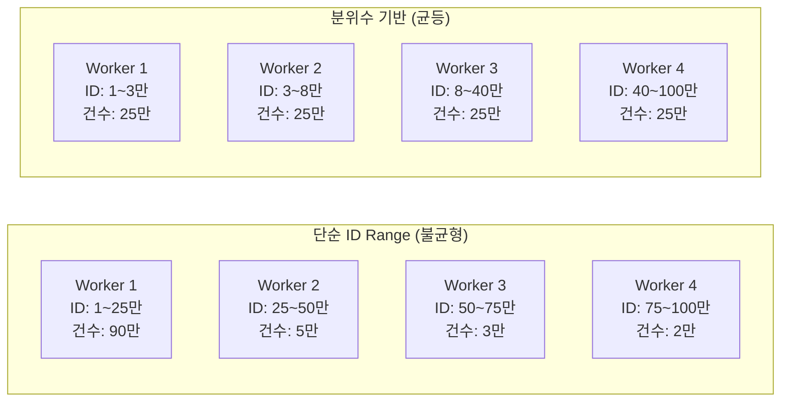
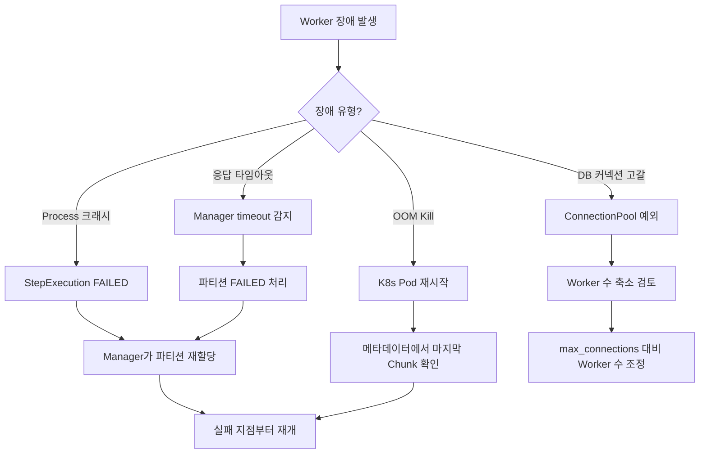

# 동적 파티셔닝과 장애 대응

대규모 정산 배치에서 데이터를 균등하게 분배하는 파티셔닝 전략과, Worker 장애 발생 시 파티션을 재할당하는 메커니즘을 다룬다. 단순 ID Range 분할이 아닌 실제 데이터 분포를 고려한 파티셔닝과 다양한 장애 시나리오별 대응 전략이 핵심이다.

## 목차
- [1. 핵심 개념 (What)](#1-핵심-개념-what)
- [2. 왜 알아야 하는가 (Why)](#2-왜-알아야-하는가-why)
- [3. 내부 구현 분석 (How)](#3-내부-구현-분석-how)
- [4. 실전 예제](#4-실전-예제)
- [5. 정리](#5-정리)

---

## 1. 핵심 개념 (What)

### 동적 파티셔닝이란

파티셔닝은 대량의 데이터를 여러 Worker에 분배하여 병렬 처리하는 기법이다. **동적 파티셔닝**은 단순히 ID를 N등분하는 것이 아니라, 실제 데이터 분포를 분석하여 각 Worker의 작업량이 균등하도록 분배하는 전략이다.

| 파티셔닝 전략 | 분배 기준 | 장점 |
|--------------|----------|------|
| ID Range | ID 범위 균등 분할 | 구현 단순 |
| 데이터 분포 기반 | 실제 건수 분위수(quantile) | 작업량 균등 |
| 판매자 기반 | 판매자(가맹점) ID | 락 경합 없음, 재정산 용이 |
| 해시 기반 | 키 해시값 | 균등 분배 보장 |

### 장애 대응의 핵심

분산 배치에서는 Worker가 언제든 실패할 수 있다. 핵심은 **실패한 파티션만 재처리**하고, **멱등성을 보장**하는 것이다.

---

## 2. 왜 알아야 하는가 (Why)

1. **데이터 쏠림(Skew) 문제** - ID 1~100만을 4등분하면 25만씩 나눠지지만, 실제로 ID 1~10만에 90%의 데이터가 몰려 있다면 Worker 1이 전체 작업의 90%를 담당하게 된다. 나머지 3대는 놀고, 전체 처리 시간은 Worker 1에 의해 결정된다.

2. **정산 도메인의 특성** - 정산은 판매자 단위로 독립적이다. 판매자 기반 파티셔닝을 사용하면 판매자 간 락 경합이 없고, 특정 판매자만 재정산할 때 해당 파티션만 재실행하면 된다.

3. **Worker 장애는 반드시 발생한다** - OOM Kill, 네트워크 단절, DB 커넥션 풀 고갈 등 프로덕션 환경에서 Worker 장애는 일상적이다. 장애 발생 시 전체 Job을 재실행하는 것이 아니라, 실패한 파티션만 재처리해야 SLA를 지킬 수 있다.

4. **DB 커넥션 관리** - Worker 수를 무작정 늘리면 DB 커넥션 풀이 고갈된다. `Worker수 x 커넥션 수 <= DB max_connections` 공식을 반드시 확인해야 한다.

---

## 3. 내부 구현 분석 (How)

### 3.1 데이터 분포 기반 파티셔닝

단순 ID Range가 아닌, 실제 데이터 분포를 고려하여 분위수(quantile) 기반으로 파티션 경계를 결정한다.



```java
/**
 * 단순 ID Range가 아닌, 실제 데이터 분포를 고려한 파티셔닝
 *
 * 문제: ID 1~100만 → 4등분 하면 25만씩?
 *       실제로 ID 1~10만에 90%의 데이터가 몰려 있다면?
 *       → Worker 1이 전체 작업의 90%를 담당 (불균형)
 *
 * 해결: 실제 건수 기반 균등 분배
 */
@Component
@RequiredArgsConstructor
public class DataAwarePartitioner implements Partitioner {

    private final JdbcTemplate jdbcTemplate;

    @Override
    public Map<String, ExecutionContext> partition(int gridSize) {
        // 1. 전체 정렬된 ID 목록에서 분위수(quantile) 계산
        List<Long> boundaries = jdbcTemplate.queryForList(
            """
            SELECT id FROM (
                SELECT id, ROW_NUMBER() OVER (ORDER BY id) as rn,
                       COUNT(*) OVER () as total
                FROM transactions
                WHERE status = 'COMPLETED' AND settled = false
            ) t
            WHERE rn % CEIL(total / ?) = 0
            ORDER BY id
            """,
            Long.class, gridSize);

        // 2. 경계값 기반 파티션 생성
        Map<String, ExecutionContext> partitions = new LinkedHashMap<>();
        long prevId = 0;

        for (int i = 0; i < boundaries.size(); i++) {
            ExecutionContext ctx = new ExecutionContext();
            ctx.putLong("minId", prevId + 1);
            ctx.putLong("maxId", boundaries.get(i));
            partitions.put("partition" + i, ctx);
            prevId = boundaries.get(i);
        }

        // 마지막 파티션: 나머지 전부
        if (prevId > 0) {
            ExecutionContext ctx = new ExecutionContext();
            ctx.putLong("minId", prevId + 1);
            ctx.putLong("maxId", Long.MAX_VALUE);
            partitions.put("partition" + boundaries.size(), ctx);
        }

        return partitions;
    }
}
```

### 3.2 판매자(가맹점) 기반 파티셔닝

정산은 판매자 단위로 독립적이므로, 판매자 기반 파티셔닝이 도메인적으로 가장 자연스러운 선택이다.

```java
/**
 * 정산은 판매자 단위로 독립적이므로, 판매자 기반 파티셔닝이 자연스럽다.
 *
 * 장점:
 * - 판매자 간 데이터 독립 → 락 경합 없음
 * - 판매자 단위 정합성 검증 용이
 * - 특정 판매자 재정산 시 해당 파티션만 재실행
 */
@Component
@RequiredArgsConstructor
public class SellerPartitioner implements Partitioner {

    private final JdbcTemplate jdbcTemplate;

    @Override
    public Map<String, ExecutionContext> partition(int gridSize) {
        List<Long> sellerIds = jdbcTemplate.queryForList(
            "SELECT DISTINCT seller_id FROM transactions " +
            "WHERE status = 'COMPLETED' AND settled = false",
            Long.class);

        // 판매자를 gridSize개 그룹으로 분배
        Map<String, ExecutionContext> partitions = new LinkedHashMap<>();
        List<List<Long>> groups = partitionList(sellerIds, gridSize);

        for (int i = 0; i < groups.size(); i++) {
            ExecutionContext ctx = new ExecutionContext();
            ctx.put("sellerIds", groups.get(i));
            ctx.putInt("partitionIndex", i);
            partitions.put("seller_partition_" + i, ctx);
        }

        return partitions;
    }

    private <T> List<List<T>> partitionList(List<T> list, int groups) {
        List<List<T>> result = new ArrayList<>();
        int size = (int) Math.ceil((double) list.size() / groups);
        for (int i = 0; i < list.size(); i += size) {
            result.add(list.subList(i, Math.min(i + size, list.size())));
        }
        return result;
    }
}
```

### 3.3 Worker 장애 시나리오와 대응

```
┌────────────────────────────────────────────────────────────────────┐
│  Worker 장애 시나리오와 대응                                        │
│                                                                     │
│  시나리오 1: Worker Process 크래시                                  │
│  ──────────────────────────────────                                │
│  - StepExecution status = FAILED                                    │
│  - Manager가 감지 → 새 Worker에 해당 파티션 재할당                 │
│  - ExecutionContext 기반 재시작 (실패 지점부터)                     │
│                                                                     │
│  시나리오 2: Worker Pod OOM Kill                                    │
│  ──────────────────────────────────                                │
│  - Kubernetes가 Pod 재시작 or 새 Pod 생성                          │
│  - 메타데이터 테이블에서 마지막 커밋된 Chunk 확인                  │
│  - 해당 지점부터 재개                                               │
│                                                                     │
│  시나리오 3: Worker 응답 타임아웃                                   │
│  ──────────────────────────────────                                │
│  - Manager의 messageTimeout 초과                                    │
│  - 해당 파티션 FAILED 처리 → 재할당                                │
│  - 주의: 원래 Worker가 아직 살아있을 수 있음 (중복 처리 위험)      │
│  - 해결: 멱등성 보장 필수                                           │
│                                                                     │
│  시나리오 4: DB 커넥션 풀 고갈                                      │
│  ──────────────────────────────────                                │
│  - Worker 수 × 커넥션 수 < DB max_connections 확인 필수            │
│  - 공식: Worker수 × (chunkSize + 여유분) ≤ DB max_connections      │
│  - RDS Proxy 사용 시 커넥션 멀티플렉싱으로 완화 가능               │
└────────────────────────────────────────────────────────────────────┘
```



---

## 4. 실전 예제

### 4.1 파티션 레벨 재시도 설정

Manager Step에서 Worker 실패 시 파티션 단위로 재시도하고, 실패 파티션 정보를 후속 처리에 활용하는 설정이다.

```java
/**
 * 파티션(Worker) 실패 시 Manager 레벨에서 재시도
 */
@Bean
public Step managerStep(JobRepository jobRepository,
                         Partitioner partitioner,
                         Step workerStep) {
    return new StepBuilder("managerStep", jobRepository)
        .partitioner("workerStep", partitioner)
        .step(workerStep)
        .gridSize(dynamicGridSize)
        .taskExecutor(workerTaskExecutor())
        // Worker 실패 시 처리
        .aggregator(new DefaultStepExecutionAggregator() {
            @Override
            public void aggregate(StepExecution result,
                                  Collection<StepExecution> executions) {
                super.aggregate(result, executions);

                long failedPartitions = executions.stream()
                    .filter(e -> e.getStatus() == BatchStatus.FAILED)
                    .count();

                if (failedPartitions > 0) {
                    log.error("실패 파티션 {}개 발생", failedPartitions);
                    // 실패 파티션 정보를 JobExecutionContext에 저장
                    // → 후속 Step에서 재처리 또는 알림
                }
            }
        })
        .build();
}
```

### 4.2 커넥션 풀 안전 검증

```java
/**
 * Worker 스케일링 전 DB 커넥션 풀 안전성 검증
 */
@Component
@RequiredArgsConstructor
public class ConnectionPoolValidator {

    private final DataSource dataSource;

    public void validate(int workerCount, int chunkSize) {
        int connectionsPerWorker = chunkSize + 5;  // chunk + 메타데이터 등 여유분
        int totalRequired = workerCount * connectionsPerWorker;

        // HikariCP 설정 확인
        if (dataSource instanceof HikariDataSource hikari) {
            int maxPoolSize = hikari.getMaximumPoolSize();
            if (totalRequired > maxPoolSize) {
                throw new IllegalStateException(
                    String.format("커넥션 풀 부족: 필요 %d, 최대 %d (Worker %d대 x %d)",
                        totalRequired, maxPoolSize, workerCount, connectionsPerWorker));
            }
        }
    }
}
```

---

## 5. 정리

| 파티셔닝 전략 | 분배 기준 | 장점 | 단점 |
|--------------|----------|------|------|
| ID Range | ID 균등 분할 | 구현 단순 | 데이터 쏠림 위험 |
| 데이터 분포(분위수) | 실제 건수 | 작업량 균등 | 사전 쿼리 비용 |
| 판매자 기반 | 가맹점 ID | 락 없음, 재정산 용이 | 판매자별 건수 차이 |

| 장애 시나리오 | 감지 방법 | 대응 전략 |
|-------------|----------|----------|
| Process 크래시 | StepExecution FAILED | 파티션 재할당 |
| OOM Kill | K8s 자동 감지 | 마지막 Chunk부터 재개 |
| 응답 타임아웃 | Manager timeout | FAILED 처리 후 재할당 (멱등성 필수) |
| DB 커넥션 고갈 | ConnectionPool 예외 | Worker 수 축소, RDS Proxy 검토 |

| 핵심 원칙 | 설명 |
|-----------|------|
| 균등 분배 | 데이터 분포를 고려하여 Worker별 작업량 균등화 |
| 실패 격리 | 실패한 파티션만 재처리, 전체 Job 재실행 불필요 |
| 멱등성 보장 | 타임아웃 시 중복 처리 위험 → UPSERT 등으로 대응 |
| 커넥션 관리 | Worker수 x 커넥션수 <= DB max_connections |

---
*참고: Spring Batch 5.x / Spring Boot 3.x 기준*
