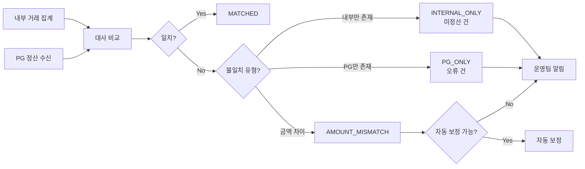

# 정산 대사, 성능 최적화, Spring Batch 5.x

정산 시스템의 마지막 퍼즐인 대사(Reconciliation) 배치 설계, 대량 데이터 처리를 위한 성능 최적화 패턴, 그리고 Spring Batch 5.x의 주요 변경사항을 다룬다. 대사는 내부 기록과 외부(PG사) 기록의 일치 여부를 검증하는 핵심 프로세스이다.

## 목차
- [1. 핵심 개념 (What)](#1-핵심-개념-what)
- [2. 왜 알아야 하는가 (Why)](#2-왜-알아야-하는가-why)
- [3. 내부 구현 분석 (How)](#3-내부-구현-분석-how)
- [4. 실전 예제](#4-실전-예제)
- [5. 정리](#5-정리)

---

## 1. 핵심 개념 (What)

### 대사(Reconciliation)란

대사는 **"우리 기록 vs 외부 기록 일치 확인"**이다. 정산 시스템에서 내부 거래 데이터와 PG사(결제 대행사)의 정산 데이터를 비교하여 불일치를 발견하고 처리하는 과정이다.

### 대사 결과 유형

| 결과 | 상태 | 의미 |
|------|------|------|
| 일치 | MATCHED | 내부 금액 = PG 금액 |
| 내부에만 존재 | INTERNAL_ONLY | PG에 기록 없음 (미정산 건) |
| PG에만 존재 | PG_ONLY | 내부에 기록 없음 (오류) |
| 금액 불일치 | AMOUNT_MISMATCH | 내부 금액 != PG 금액 |

### 성능 최적화 3대 전략

| 영역 | 전략 | 효과 |
|------|------|------|
| 읽기 | Covering Index | 테이블 랜덤 I/O 제거 |
| 쓰기 | Bulk Insert + Temp Table | 본 테이블 락 최소화 |
| 메모리 | DTO Projection | 건당 메모리 ~10배 절감 |

---

## 2. 왜 알아야 하는가 (Why)

1. **대사 없이는 정산의 정확성을 보장할 수 없다** - 내부 시스템에서 100건을 정산했다고 기록해도, PG사에서는 99건만 인식할 수 있다. 대사를 통해 이런 불일치를 즉시 발견하지 않으면, 판매자에게 잘못된 금액이 지급된다.

2. **성능 최적화 없이는 SLA를 지킬 수 없다** - 100만 건의 정산 데이터를 Entity로 읽으면 2GB 메모리를 소비하지만, DTO Projection으로는 200MB로 줄일 수 있다. Covering Index를 사용하면 테이블 랜덤 I/O를 제거하여 조회 속도가 수배 향상된다.

3. **Spring Batch 5.x 마이그레이션은 피할 수 없다** - Spring Boot 3.x로 전환하면 Spring Batch 5.x가 필수이며, API 레벨에서 하위 호환이 깨지는 변경사항이 있다.

---

## 3. 내부 구현 분석 (How)

### 3.1 정산 대사 프로세스

```
┌────────────────────────────────────────────────────────────────────────┐
│                    정산 대사 프로세스                                     │
│                                                                         │
│  Step 1: 내부 거래 데이터 집계                                         │
│  ┌──────────────────────────────────────┐                              │
│  │ SELECT seller_id, SUM(amount),       │                              │
│  │        COUNT(*) FROM transactions    │                              │
│  │ WHERE settled_date = '2026-02-08'    │                              │
│  │ GROUP BY seller_id                   │                              │
│  └──────────────────────────────────────┘                              │
│                                                                         │
│  Step 2: PG사 정산 데이터 수신                                         │
│  ┌──────────────────────────────────────┐                              │
│  │ PG사 SFTP 서버에서 정산 파일 다운로드│                              │
│  │ 또는 API로 정산 내역 조회            │                              │
│  └──────────────────────────────────────┘                              │
│                                                                         │
│  Step 3: 대사 (양쪽 비교)                                              │
│  ┌──────────────────────────────────────────────────────┐              │
│  │  내부 기록     PG 기록      결과                      │              │
│  │  ────────     ─────────    ──────                    │              │
│  │  100,000원    100,000원    일치                      │              │
│  │  50,000원     50,000원     일치                      │              │
│  │  30,000원     (없음)       내부에만 존재 (미정산)    │              │
│  │  (없음)       20,000원     PG에만 존재 (오류)        │              │
│  │  75,000원     74,000원     금액 불일치               │              │
│  └──────────────────────────────────────────────────────┘              │
│                                                                         │
│  Step 4: 불일치 처리                                                    │
│  ┌──────────────────────────────────────┐                              │
│  │ 자동 해결 가능 → 자동 보정           │                              │
│  │ 수동 확인 필요 → 운영팀 알림         │                              │
│  │ 임계치 초과 → PagerDuty 에스컬레이션 │                              │
│  └──────────────────────────────────────┘                              │
└────────────────────────────────────────────────────────────────────────┘
```



### 3.2 Spring Batch 5.x 주요 변경사항

```
┌────────────────────────────────────────────────────────────────────┐
│  Spring Batch 5.x (Spring Boot 3.x) 변경사항                       │
│                                                                     │
│  1. @EnableBatchProcessing 동작 변경                                │
│     4.x: 이 어노테이션이 자동 설정의 일부                          │
│     5.x: Boot 자동 설정과 충돌할 수 있음                           │
│          → Spring Boot 사용 시 제거 권장                            │
│          → Boot가 자동으로 JobRepository, TransactionManager 등 구성│
│                                                                     │
│  2. JobBuilderFactory / StepBuilderFactory 제거                     │
│     4.x: @Autowired JobBuilderFactory jobBuilderFactory;            │
│     5.x: new JobBuilder("name", jobRepository)                      │
│          new StepBuilder("name", jobRepository)                     │
│     → JobRepository를 직접 주입                                    │
│                                                                     │
│  3. TransactionManager 명시적 전달                                  │
│     4.x: .<I,O>chunk(100) // 자동 주입                              │
│     5.x: .<I,O>chunk(100, transactionManager) // 명시 필수          │
│                                                                     │
│  4. 메타데이터 테이블 변경                                          │
│     - BATCH_JOB_EXECUTION: CREATE_TIME, END_TIME 타입 변경          │
│     - 마이그레이션 SQL 제공됨                                      │
│                                                                     │
│  5. javax.batch → jakarta.batch                                     │
│     - JSR-352 지원의 네임스페이스 변경                              │
│                                                                     │
│  6. 기본 실행 방식 변경                                              │
│     4.x: 애플리케이션 시작 시 모든 Job 자동 실행                    │
│     5.x: spring.batch.job.name으로 실행할 Job 지정                  │
│          미지정 시 아무것도 실행하지 않음                            │
└────────────────────────────────────────────────────────────────────┘
```

---

## 4. 실전 예제

### 4.1 대사 Processor 구현

내부 정산 데이터와 PG사 데이터를 비교하여 대사 결과를 생성하는 Processor이다.

```java
@Component
@RequiredArgsConstructor
public class ReconciliationProcessor
    implements ItemProcessor<InternalSettlement, ReconciliationResult> {

    private final PgSettlementRepository pgRepository;

    @Override
    public ReconciliationResult process(InternalSettlement internal) {
        Optional<PgSettlement> pgRecord = pgRepository
            .findByTransactionId(internal.getTransactionId());

        if (pgRecord.isEmpty()) {
            return ReconciliationResult.builder()
                .status(ReconciliationStatus.INTERNAL_ONLY)
                .internalAmount(internal.getAmount())
                .transactionId(internal.getTransactionId())
                .message("PG 기록 없음 - 미정산 건")
                .build();
        }

        PgSettlement pg = pgRecord.get();
        BigDecimal diff = internal.getAmount()
            .subtract(pg.getAmount()).abs();

        if (diff.compareTo(BigDecimal.ZERO) == 0) {
            return ReconciliationResult.matched(internal, pg);
        }

        // 금액 불일치
        return ReconciliationResult.builder()
            .status(ReconciliationStatus.AMOUNT_MISMATCH)
            .internalAmount(internal.getAmount())
            .pgAmount(pg.getAmount())
            .difference(diff)
            .transactionId(internal.getTransactionId())
            .message(String.format("금액 불일치: 내부 %s vs PG %s (차이: %s)",
                internal.getAmount(), pg.getAmount(), diff))
            .build();
    }
}
```

### 4.2 읽기 최적화: Covering Index

```sql
-- 정산 대상 조회 쿼리를 위한 커버링 인덱스
-- 인덱스만으로 조회 가능 → 테이블 랜덤 I/O 제거
CREATE INDEX idx_tx_settlement ON transactions
    (status, settled, completed_at, seller_id, amount);

-- 실행 계획에서 "Using index" 확인
EXPLAIN SELECT seller_id, SUM(amount), COUNT(*)
FROM transactions
WHERE status = 'COMPLETED' AND settled = false
  AND completed_at BETWEEN '2026-02-01' AND '2026-02-08'
GROUP BY seller_id;
```

### 4.3 쓰기 최적화: Bulk Insert + Temp Table

대량 정산 결과를 임시 테이블에 bulk insert 후 본 테이블로 이동하여 본 테이블의 락을 최소화한다.

```java
/**
 * 대량 정산 결과를 임시 테이블에 bulk insert 후 본 테이블로 이동
 * → 본 테이블 락 최소화, 인덱스 재구성 최소화
 */
@Component
public class BulkSettlementWriter implements ItemWriter<Settlement> {

    @Override
    public void write(Chunk<? extends Settlement> items) {
        // 1. 임시 테이블에 Bulk Insert
        String tempInsert = """
            INSERT INTO settlements_temp
            (seller_id, settlement_date, total_sales, net_amount, status)
            VALUES (?, ?, ?, ?, 'PENDING')
            """;

        jdbcTemplate.batchUpdate(tempInsert, new BatchPreparedStatementSetter() {
            @Override
            public void setValues(PreparedStatement ps, int i) throws SQLException {
                Settlement s = items.getItems().get(i);
                ps.setLong(1, s.getSellerId());
                ps.setDate(2, Date.valueOf(s.getSettlementDate()));
                ps.setBigDecimal(3, s.getTotalSales());
                ps.setBigDecimal(4, s.getNetAmount());
            }
            @Override
            public int getBatchSize() { return items.size(); }
        });
    }
}

// Step 완료 후: 임시 테이블 → 본 테이블 이동 (Tasklet)
// INSERT INTO settlements SELECT * FROM settlements_temp;
// DROP TABLE settlements_temp;
```

### 4.4 메모리 최적화: DTO Projection

```java
/**
 * Entity 대신 DTO Projection으로 메모리 사용량 절감
 *
 * Entity: JPA 프록시 + 연관관계 + 변경감지 → 건당 ~2KB
 * DTO: 필요한 필드만 → 건당 ~200B
 *
 * 100만 건 처리 시: 2GB vs 200MB
 */
@Bean
@StepScope
public JdbcPagingItemReader<SettlementDto> optimizedReader() {
    return new JdbcPagingItemReaderBuilder<SettlementDto>()
        .name("settlementReader")
        .dataSource(dataSource)
        .selectClause("SELECT seller_id, SUM(amount) as total, COUNT(*) as cnt")
        .fromClause("FROM transactions")
        .whereClause("WHERE status = 'COMPLETED' AND settled = false")
        .groupClause("GROUP BY seller_id")
        .sortKeys(Map.of("seller_id", Order.ASCENDING))
        .pageSize(1000)
        .rowMapper((rs, i) -> new SettlementDto(
            rs.getLong("seller_id"),
            rs.getBigDecimal("total"),
            rs.getInt("cnt")
        ))
        .build();
}
```

### 4.5 Spring Batch 4.x → 5.x 마이그레이션 비교

```java
// === Spring Batch 4.x ===
@Configuration
@EnableBatchProcessing  // 4.x에서 필수
public class BatchConfig {

    @Autowired
    private JobBuilderFactory jobBuilderFactory;    // 4.x API
    @Autowired
    private StepBuilderFactory stepBuilderFactory;  // 4.x API

    @Bean
    public Job myJob() {
        return jobBuilderFactory.get("myJob")
            .start(myStep())
            .build();
    }

    @Bean
    public Step myStep() {
        return stepBuilderFactory.get("myStep")
            .<Input, Output>chunk(100)  // TransactionManager 자동 주입
            .reader(reader())
            .writer(writer())
            .build();
    }
}

// === Spring Batch 5.x ===
@Configuration
// @EnableBatchProcessing 제거 (Boot 자동 설정 사용)
public class BatchConfig {

    @Bean
    public Job myJob(JobRepository jobRepository) {  // 직접 주입
        return new JobBuilder("myJob", jobRepository)
            .start(myStep(jobRepository, null))
            .build();
    }

    @Bean
    public Step myStep(JobRepository jobRepository,
                       PlatformTransactionManager transactionManager) {
        return new StepBuilder("myStep", jobRepository)
            .<Input, Output>chunk(100, transactionManager)  // 명시 필수
            .reader(reader())
            .writer(writer())
            .build();
    }
}
```

---

## 5. 정리

### 대사(Reconciliation) 핵심

| 대사 결과 | 의미 | 후속 처리 |
|-----------|------|----------|
| MATCHED | 내부 = PG | 처리 완료 |
| INTERNAL_ONLY | 내부에만 존재 | 미정산 건 확인 |
| PG_ONLY | PG에만 존재 | 오류 건 조사 |
| AMOUNT_MISMATCH | 금액 불일치 | 자동 보정 또는 수동 확인 |

### 성능 최적화 패턴

| 영역 | 기법 | 효과 |
|------|------|------|
| 읽기 | Covering Index | 인덱스만으로 조회, 테이블 I/O 제거 |
| 쓰기 | Bulk Insert + Temp Table | 본 테이블 락 최소화 |
| 메모리 | DTO Projection | Entity 대비 ~10배 메모리 절감 |

### Spring Batch 5.x 변경 요약

| 항목 | 4.x | 5.x |
|------|-----|-----|
| `@EnableBatchProcessing` | 필수 | Boot 사용 시 제거 권장 |
| Job/Step 생성 | `JobBuilderFactory` | `new JobBuilder(name, jobRepository)` |
| TransactionManager | 자동 주입 | `chunk(size, txManager)` 명시 |
| 네임스페이스 | `javax.batch` | `jakarta.batch` |
| Job 자동 실행 | 모든 Job 자동 실행 | `spring.batch.job.name` 지정 필수 |
| 메타데이터 테이블 | 기존 타입 | CREATE_TIME, END_TIME 타입 변경 |

---
*참고: Spring Batch 5.x / Spring Boot 3.x 기준*
