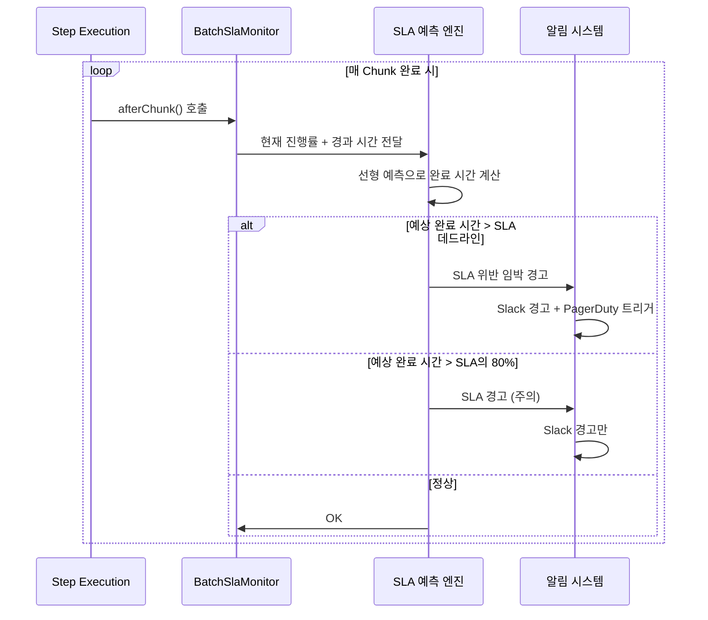
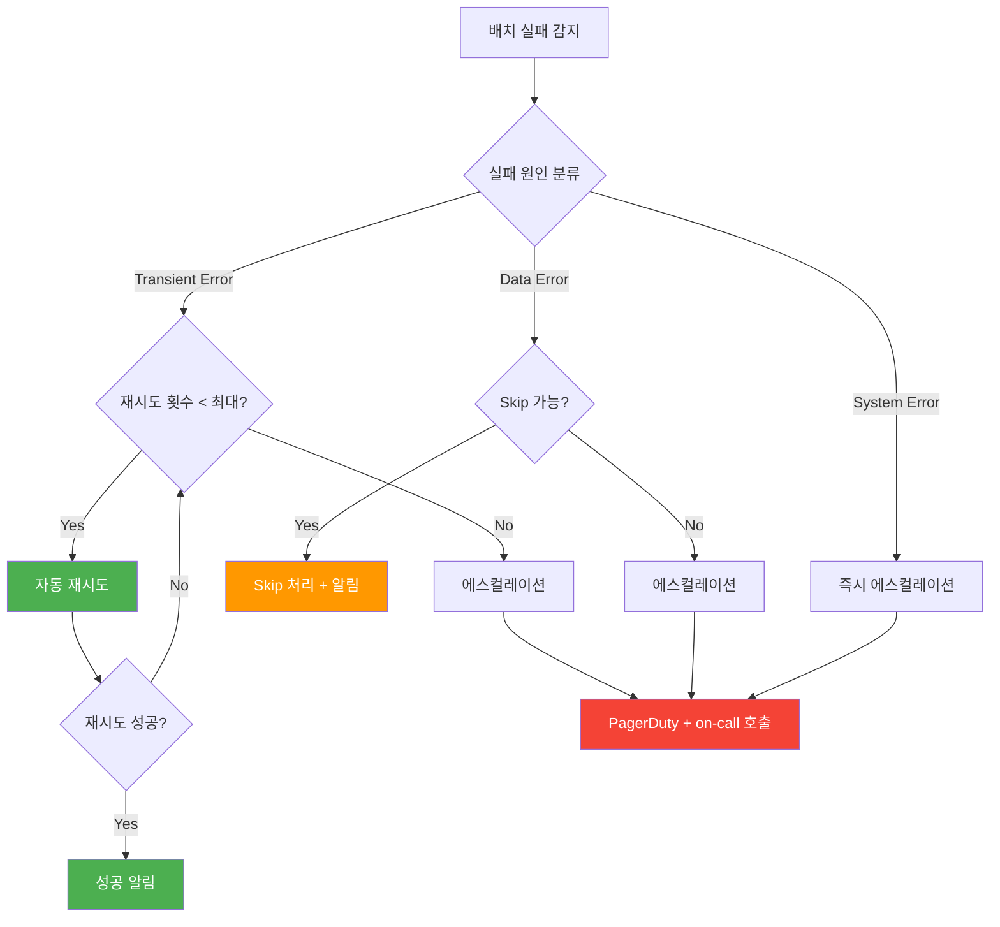

# 배치 모니터링, SLA 관리, 장애 대응 자동화

배치 시스템의 관측 가능성(Observability)을 확보하고, SLA(Service Level Agreement) 기반으로 배치 완료 시간을 사전 예측하며, 장애 발생 시 자동 재시도와 에스컬레이션을 체계적으로 수행하는 전략을 다룬다. 단순 메트릭 수집을 넘어 "SLA 위반 전에 미리 감지하고 대응하는" 프로액티브 모니터링을 구현한다.

## 목차
- [1. 핵심 개념 (What)](#1-핵심-개념-what)
- [2. 왜 알아야 하는가 (Why)](#2-왜-알아야-하는가-why)
- [3. 내부 구현 분석 (How)](#3-내부-구현-분석-how)
- [4. 실전 예제](#4-실전-예제)
- [5. 정리](#5-정리)

---

## 1. 핵심 개념 (What)

### 배치 모니터링의 3축

배치 시스템 모니터링은 세 가지 축으로 구성된다:

| 축 | 역할 | 도구 예시 |
|-----|------|-----------|
| **메트릭(Metrics)** | 수치 기반 상태 추적 (TPS, 실행 시간, 처리 건수) | Prometheus + Micrometer |
| **로그(Logs)** | 이벤트 기반 상세 추적 (에러 스택, Skip 사유) | ELK Stack, Loki |
| **알림(Alerts)** | 이상 상태 감지 시 즉시 통보 | Grafana Alert, PagerDuty |

> **06편과의 차이**: 06편에서는 `JobExecutionListener` 기반 Micrometer 기초와 Slack 알림을 다뤘다. 이 문서는 Prometheus 메트릭 설계, Grafana 대시보드 구축, SLA 예측 알고리즘, 자동 재시도/에스컬레이션 판단 로직에 초점을 맞춘다.

### SLA(Service Level Agreement)란

배치 컨텍스트에서 SLA는 **"이 배치는 반드시 언제까지 완료되어야 한다"**는 약속이다.

| SLA 유형 | 예시 | 위반 시 영향 |
|----------|------|-------------|
| **시간 SLA** | 정산 배치는 06:00까지 완료 | 판매자 정산 지급 지연 |
| **정확도 SLA** | Skip률 0.1% 이하 | 누락 거래 발생, 수동 보정 필요 |
| **가용성 SLA** | 월 99.9% 성공률 | SLA 페널티 발생 |

### 모니터링 성숙도 모델

```
Level 0: 로그 파일 수동 확인 (grep으로 검색)
  ↓
Level 1: 실패 시 Slack 알림 (사후 대응)
  ↓
Level 2: 메트릭 대시보드 + 알림 룰 (실시간 감지)
  ↓
Level 3: SLA 예측 + 사전 경고 + 자동 재시도 (프로액티브 대응)  ← 이 문서의 목표
```

---

## 2. 왜 알아야 하는가 (Why)

1. **SLA 위반을 사전 감지하지 못하면 아침에 장애를 발견한다** - 야간 02:00에 시작한 정산 배치가 평소 2시간이면 끝나는데, 데이터 급증으로 5시간 걸리면 06:00 SLA를 넘긴다. 05:00에 "현재 진행률로는 07:30 완료 예상"이라는 사전 경고가 없으면, 06:30에 출근한 담당자가 뒤늦게 발견한다.

2. **야간 배치 실패는 비즈니스에 직접적 타격을 준다** - 결제 정산 배치가 실패하면 판매자 정산금 지급이 지연된다. 세금계산서 발행 배치가 SLA를 넘기면 법적 기한을 놓칠 수 있다. 단순 기술 장애가 아닌 비즈니스 리스크다.

3. **수동 재시도 vs 자동 재시도의 판단 기준이 필요하다** - 모든 실패를 자동 재시도하면 동일 오류가 반복되고, 모든 실패를 사람이 판단하면 야간 대응이 늦어진다. 실패 원인에 따른 자동/수동 판단 로직이 체계적으로 구성되어야 한다.

---

## 3. 내부 구현 분석 (How)

### 3.1 Prometheus + Micrometer 배치 메트릭 설계

Spring Boot Actuator는 기본적으로 `spring.batch.job` 관련 메트릭을 노출하지만, 프로덕션 수준의 모니터링에는 커스텀 메트릭이 필수다.

#### 기본 메트릭 (Spring Boot 자동 제공)

| 메트릭 이름 | 타입 | 설명 |
|-------------|------|------|
| `spring.batch.job` | Timer | Job 실행 시간 |
| `spring.batch.job.active` | Gauge | 현재 실행 중인 Job 수 |
| `spring.batch.step` | Timer | Step 실행 시간 |

#### 커스텀 메트릭 설계

```java
/**
 * 배치 커스텀 메트릭을 등록하는 설정 클래스.
 * 기본 제공 메트릭만으로는 TPS, 처리 건수 추이 등을 파악하기 어렵다.
 */
@Configuration
@RequiredArgsConstructor
public class BatchMetricsConfig {

    private final MeterRegistry meterRegistry;

    // Best Practice: 메트릭 이름은 도메인.행위.대상 패턴 사용
    public static final String METRIC_ITEMS_PROCESSED = "batch.items.processed";
    public static final String METRIC_ITEMS_SKIPPED = "batch.items.skipped";
    public static final String METRIC_CHUNK_DURATION = "batch.chunk.duration";
    public static final String METRIC_SLA_REMAINING = "batch.sla.remaining.seconds";

    @Bean
    public Counter itemsProcessedCounter() {
        return Counter.builder(METRIC_ITEMS_PROCESSED)
                .description("배치에서 처리 완료된 총 아이템 수")
                .register(meterRegistry);
    }

    @Bean
    public Counter itemsSkippedCounter() {
        return Counter.builder(METRIC_ITEMS_SKIPPED)
                .description("배치에서 Skip된 총 아이템 수")
                .register(meterRegistry);
    }

    @Bean
    public Timer chunkDurationTimer() {
        return Timer.builder(METRIC_CHUNK_DURATION)
                .description("개별 Chunk 처리 소요 시간")
                .publishPercentiles(0.5, 0.95, 0.99)  // p50, p95, p99
                .register(meterRegistry);
    }
}
```

#### MeterRegistryCustomizer로 공통 태그 자동 부착

```java
/**
 * 모든 배치 메트릭에 공통 태그를 자동 부착한다.
 * Grafana에서 Job별, 환경별 필터링이 가능해진다.
 */
@Configuration
public class BatchMeterRegistryConfig {

    @Bean
    public MeterRegistryCustomizer<MeterRegistry> batchMeterCustomizer(
            @Value("${spring.application.name}") String appName,
            @Value("${spring.profiles.active:local}") String profile) {

        return registry -> registry.config()
                .commonTags(
                        "application", appName,
                        "environment", profile,
                        "type", "batch"  // 배치 전용 메트릭 구분
                );
    }
}
```

### 3.2 Grafana 대시보드 구성

#### PromQL 쿼리 예시

**패널 1: 배치 실행 시간 추이 (최근 7일)**
```promql
# Job별 평균 실행 시간 (분 단위)
avg by (name) (
  spring_batch_job_seconds_sum{status="COMPLETED"}
  / spring_batch_job_seconds_count{status="COMPLETED"}
) / 60
```

**패널 2: 현재 TPS (초당 처리 건수)**
```promql
# 최근 5분간 초당 처리 아이템 수
rate(batch_items_processed_total[5m])
```

**패널 3: 실패율 추이**
```promql
# Job 실패율 (최근 24시간, 1시간 간격)
sum by (name) (
  increase(spring_batch_job_seconds_count{status="FAILED"}[1h])
)
/
sum by (name) (
  increase(spring_batch_job_seconds_count[1h])
) * 100
```

**패널 4: Skip률 모니터링**
```promql
# 전체 처리 대비 Skip 비율
batch_items_skipped_total
/ (batch_items_processed_total + batch_items_skipped_total) * 100
```

**패널 5: SLA 잔여 시간**
```promql
# SLA 데드라인까지 남은 시간 (음수면 위반)
batch_sla_remaining_seconds
```

### 3.3 SLA 위반 사전 경고 시스템

SLA 모니터링의 핵심은 **"현재 진행 속도로 SLA를 맞출 수 있는가?"**를 실시간으로 판단하는 것이다.



#### BatchSlaMonitor 구현

```java
/**
 * StepExecutionListener + ChunkListener를 결합하여
 * 매 Chunk 처리 후 SLA 준수 여부를 판단한다.
 *
 * Best Practice: SLA 체크는 매 Chunk마다 수행하되,
 * 알림 발송은 쿨다운(5분) 적용하여 알림 폭풍 방지
 */
@Slf4j
@Component
@RequiredArgsConstructor
public class BatchSlaMonitor implements StepExecutionListener, ChunkListener {

    private final MeterRegistry meterRegistry;
    private final AlertService alertService;

    // SLA 설정 (외부 설정 파일에서 주입 가능)
    private Duration slaDeadline;
    private LocalDateTime jobStartTime;
    private long totalExpectedItems;
    private long processedItems;
    private Instant lastAlertTime = Instant.EPOCH;

    // 알림 쿨다운: 동일 경고를 5분 내 재발송하지 않음
    private static final Duration ALERT_COOLDOWN = Duration.ofMinutes(5);

    @Override
    public void beforeStep(StepExecution stepExecution) {
        this.jobStartTime = LocalDateTime.now();
        this.processedItems = 0;

        // Job Parameter에서 SLA 데드라인과 예상 처리 건수를 읽는다
        JobParameters params = stepExecution.getJobExecution().getJobParameters();
        long slaMinutes = params.getLong("slaMinutes", 120L);
        this.slaDeadline = Duration.ofMinutes(slaMinutes);
        this.totalExpectedItems = params.getLong("expectedItemCount", 0L);

        log.info("[SLA Monitor] Job 시작. SLA: {}분, 예상 처리 건수: {}",
                slaMinutes, totalExpectedItems);
    }

    @Override
    public void afterChunk(ChunkContext context) {
        StepExecution stepExecution = context.getStepContext().getStepExecution();
        this.processedItems = stepExecution.getWriteCount();

        SlaCheckResult result = checkSla();

        // Prometheus 메트릭 갱신
        Gauge.builder("batch.sla.remaining.seconds",
                        () -> result.remainingSeconds())
                .description("SLA 데드라인까지 남은 시간(초)")
                .tags("job", stepExecution.getJobExecution().getJobInstance().getJobName())
                .register(meterRegistry);

        switch (result.status()) {
            case VIOLATION_IMMINENT -> sendAlertIfCooldownPassed(
                    AlertLevel.CRITICAL,
                    String.format("[SLA 위반 임박] 예상 완료: %s, SLA 데드라인: %s, 진행률: %.1f%%",
                            result.estimatedCompletion(), result.deadline(), result.progressPercent())
            );
            case WARNING -> sendAlertIfCooldownPassed(
                    AlertLevel.WARNING,
                    String.format("[SLA 경고] 예상 완료: %s (SLA의 %.0f%% 소요 예상), 진행률: %.1f%%",
                            result.estimatedCompletion(), result.slaUsagePercent(), result.progressPercent())
            );
            case NORMAL -> log.debug("[SLA Monitor] 정상. 진행률: {:.1f}%", result.progressPercent());
        }
    }

    /**
     * SLA 예측 알고리즘 (선형 예측)
     *
     * 현재까지의 처리 속도를 기반으로 전체 완료 시간을 추정한다.
     * - 경과 시간: elapsed
     * - 처리 비율: processedItems / totalExpectedItems
     * - 예상 총 소요 시간: elapsed / 처리비율
     * - 예상 완료 시각: jobStartTime + 예상 총 소요 시간
     */
    private SlaCheckResult checkSla() {
        Duration elapsed = Duration.between(jobStartTime, LocalDateTime.now());
        LocalDateTime deadline = jobStartTime.plus(slaDeadline);

        if (totalExpectedItems == 0 || processedItems == 0) {
            return new SlaCheckResult(SlaStatus.NORMAL, deadline, null,
                    0.0, 0.0, slaDeadline.toSeconds());
        }

        double progressRatio = (double) processedItems / totalExpectedItems;
        // 선형 예측: 현재 속도가 유지된다고 가정
        Duration estimatedTotal = Duration.ofMillis(
                (long) (elapsed.toMillis() / progressRatio));
        LocalDateTime estimatedCompletion = jobStartTime.plus(estimatedTotal);

        double slaUsagePercent = (estimatedTotal.toMillis() * 100.0) / slaDeadline.toMillis();
        long remainingSeconds = Duration.between(LocalDateTime.now(), deadline).toSeconds();

        SlaStatus status;
        if (estimatedCompletion.isAfter(deadline)) {
            status = SlaStatus.VIOLATION_IMMINENT;
        } else if (slaUsagePercent > 80.0) {
            status = SlaStatus.WARNING;
        } else {
            status = SlaStatus.NORMAL;
        }

        return new SlaCheckResult(status, deadline, estimatedCompletion,
                progressRatio * 100, slaUsagePercent, remainingSeconds);
    }

    private void sendAlertIfCooldownPassed(AlertLevel level, String message) {
        if (Instant.now().isAfter(lastAlertTime.plus(ALERT_COOLDOWN))) {
            alertService.send(level, message);
            lastAlertTime = Instant.now();
            log.warn(message);
        }
    }

    @Override
    public ExitStatus afterStep(StepExecution stepExecution) {
        Duration totalDuration = Duration.between(jobStartTime, LocalDateTime.now());
        log.info("[SLA Monitor] Step 완료. 총 소요: {}분, 처리 건수: {}",
                totalDuration.toMinutes(), processedItems);
        return ExitStatus.COMPLETED;
    }

    // SLA 체크 결과 레코드
    public record SlaCheckResult(
            SlaStatus status,
            LocalDateTime deadline,
            LocalDateTime estimatedCompletion,
            double progressPercent,
            double slaUsagePercent,
            long remainingSeconds
    ) {}

    public enum SlaStatus { NORMAL, WARNING, VIOLATION_IMMINENT }
    public enum AlertLevel { INFO, WARNING, CRITICAL }
}
```

### 3.4 자동 재시도 vs 에스컬레이션 판단 로직

배치 실패 시 모든 것을 자동 재시도하면 안 된다. 실패 원인에 따라 재시도 가능 여부가 다르다.



#### 실패 원인 분류 기준

| 분류 | 예시 | 재시도 가능 | 대응 |
|------|------|-------------|------|
| **Transient Error** | DB Connection Timeout, 외부 API 5xx | O (최대 3회) | 자동 재시도 |
| **Data Error** | 데이터 유효성 실패, 파싱 오류 | X (Skip 가능) | Skip + 알림 |
| **System Error** | OOM, 디스크 부족, 설정 오류 | X | 즉시 에스컬레이션 |

```java
/**
 * 배치 실패 시 자동 재시도 또는 에스컬레이션을 판단하는 핸들러.
 * ApplicationListener로 Job 완료 이벤트를 감지한다.
 */
@Slf4j
@Component
@RequiredArgsConstructor
public class BatchFailureHandler {

    private final JobOperator jobOperator;
    private final JobExplorer jobExplorer;
    private final AlertService alertService;

    // Best Practice: 재시도 설정은 외부화
    @Value("${batch.retry.max-attempts:3}")
    private int maxRetryAttempts;

    @Value("${batch.retry.delay-seconds:60}")
    private long retryDelaySeconds;

    /**
     * Job 실패 시 원인을 분류하고 대응 전략을 결정한다.
     */
    public void handleFailure(JobExecution failedExecution) {
        String jobName = failedExecution.getJobInstance().getJobName();
        List<Throwable> exceptions = failedExecution.getAllFailureExceptions();

        FailureCategory category = classifyFailure(exceptions);
        int currentAttempt = countPreviousAttempts(failedExecution);

        log.warn("[Failure Handler] Job: {}, 실패 분류: {}, 시도 횟수: {}/{}",
                jobName, category, currentAttempt, maxRetryAttempts);

        switch (category) {
            case TRANSIENT -> {
                if (currentAttempt < maxRetryAttempts) {
                    scheduleRetry(failedExecution, currentAttempt + 1);
                    alertService.send(AlertLevel.WARNING,
                            String.format("[자동 재시도] %s - %d/%d회차 재시도 예정 (%d초 후)",
                                    jobName, currentAttempt + 1, maxRetryAttempts, retryDelaySeconds));
                } else {
                    escalate(failedExecution, "최대 재시도 횟수 초과");
                }
            }
            case DATA_ERROR -> {
                alertService.send(AlertLevel.WARNING,
                        String.format("[데이터 오류] %s - Skip 처리됨. 수동 확인 필요. 오류: %s",
                                jobName, summarizeExceptions(exceptions)));
            }
            case SYSTEM_ERROR -> {
                escalate(failedExecution, "시스템 오류 - 즉시 확인 필요");
            }
        }
    }

    private FailureCategory classifyFailure(List<Throwable> exceptions) {
        for (Throwable ex : exceptions) {
            Throwable root = getRootCause(ex);
            // 시스템 에러: OOM, 디스크 등
            if (root instanceof OutOfMemoryError || root instanceof IOException) {
                return FailureCategory.SYSTEM_ERROR;
            }
            // Transient: 네트워크, 타임아웃
            if (root instanceof java.net.SocketTimeoutException
                    || root instanceof org.springframework.dao.TransientDataAccessException
                    || root instanceof java.net.ConnectException) {
                return FailureCategory.TRANSIENT;
            }
        }
        return FailureCategory.DATA_ERROR;  // 기본값: 데이터 오류
    }

    private void scheduleRetry(JobExecution failedExecution, int attemptNumber) {
        // Best Practice: ScheduledExecutorService 또는 Spring TaskScheduler 사용
        CompletableFuture.delayedExecutor(retryDelaySeconds, TimeUnit.SECONDS)
                .execute(() -> {
                    try {
                        Long restartId = jobOperator.restart(failedExecution.getId());
                        log.info("[자동 재시도] Job 재시작 완료. 새 ExecutionId: {}", restartId);
                    } catch (Exception e) {
                        log.error("[자동 재시도] 재시작 실패", e);
                        escalate(failedExecution, "자동 재시도 실패: " + e.getMessage());
                    }
                });
    }

    private void escalate(JobExecution execution, String reason) {
        String jobName = execution.getJobInstance().getJobName();
        alertService.send(AlertLevel.CRITICAL,
                String.format("[에스컬레이션] %s - %s\nExecutionId: %d\n시작 시각: %s",
                        jobName, reason, execution.getId(), execution.getStartTime()));
    }

    private int countPreviousAttempts(JobExecution execution) {
        return (int) jobExplorer.getJobExecutions(execution.getJobInstance()).stream()
                .filter(e -> e.getStatus() == BatchStatus.FAILED)
                .count();
    }

    private Throwable getRootCause(Throwable ex) {
        Throwable root = ex;
        while (root.getCause() != null && root.getCause() != root) {
            root = root.getCause();
        }
        return root;
    }

    private String summarizeExceptions(List<Throwable> exceptions) {
        return exceptions.stream()
                .map(e -> getRootCause(e).getMessage())
                .distinct()
                .collect(Collectors.joining("; "));
    }

    enum FailureCategory { TRANSIENT, DATA_ERROR, SYSTEM_ERROR }
}
```

### 3.5 야간 On-call Runbook 구조

장애 등급별 대응 절차를 표준화한다.

```
┌────────────────────────────────────────────────────────────────────────┐
│                    야간 On-call Runbook                                 │
│                                                                         │
│  Severity 1 (P1): 전체 정산 배치 실패                                  │
│  ──────────────────────────────────────                                │
│  1. PagerDuty 알림 확인 (5분 이내 ACK)                                │
│  2. Spring Batch 메타 테이블 조회:                                     │
│     SELECT * FROM BATCH_JOB_EXECUTION                                  │
│     WHERE STATUS = 'FAILED' ORDER BY START_TIME DESC;                  │
│  3. 실패 원인 확인:                                                    │
│     - Grafana 대시보드: 실행 시간, TPS 급감 구간 확인                 │
│     - Application 로그: ERROR 레벨 필터링                              │
│  4. 자동 재시도 결과 확인 (이미 3회 시도됐는지)                       │
│  5. 원인별 대응:                                                       │
│     - DB 커넥션: HikariCP 풀 상태 확인 → DB 인스턴스 확인            │
│     - 외부 API: PG사 상태 확인 → 수동 재시도 또는 대기               │
│     - OOM: Pod 리소스 확인 → JVM Heap 조정 후 재시작                  │
│  6. 재시도: JobOperator.restart(executionId)                           │
│  7. 결과 확인 및 Slack에 상황 보고                                     │
│                                                                         │
│  Severity 2 (P2): Skip 급증 (임계치 초과)                             │
│  ──────────────────────────────────────                                │
│  1. Slack 경고 확인                                                    │
│  2. Skip 사유 로그 확인:                                               │
│     SELECT * FROM BATCH_STEP_EXECUTION                                 │
│     WHERE SKIP_COUNT > 0 ORDER BY START_TIME DESC;                     │
│  3. Skip된 데이터 식별 및 수동 보정 필요 여부 판단                    │
│  4. 다음 영업일 아침 데이터 팀에 인계                                 │
│                                                                         │
│  Severity 3 (P3): 실행 시간 SLA 80% 초과                             │
│  ──────────────────────────────────────                                │
│  1. Slack 경고 확인                                                    │
│  2. 현재 진행률 모니터링 (Grafana)                                     │
│  3. 자연 완료 대기 or Chunk Size 동적 조정 고려                       │
│  4. Slack에 상황 기록                                                  │
└────────────────────────────────────────────────────────────────────────┘
```

---

## 4. 실전 예제

### 4.1 Slack + PagerDuty 알림 연동

```java
/**
 * 알림 채널 분리: 일반 알림은 Slack, 크리티컬은 Slack + PagerDuty 동시 발송.
 * WebClient 기반 비동기 발송으로 배치 성능에 영향 없음.
 */
@Slf4j
@Service
@RequiredArgsConstructor
public class AlertService {

    private final WebClient slackWebClient;
    private final WebClient pagerDutyWebClient;

    @Value("${alert.slack.webhook-url}")
    private String slackWebhookUrl;

    @Value("${alert.pagerduty.routing-key}")
    private String pagerDutyRoutingKey;

    public void send(BatchSlaMonitor.AlertLevel level, String message) {
        // Slack은 모든 레벨에서 발송
        sendSlack(level, message);

        // PagerDuty는 CRITICAL만
        if (level == BatchSlaMonitor.AlertLevel.CRITICAL) {
            sendPagerDuty(message);
        }
    }

    private void sendSlack(BatchSlaMonitor.AlertLevel level, String message) {
        String color = switch (level) {
            case INFO -> "#36a64f";      // 초록
            case WARNING -> "#ff9800";   // 주황
            case CRITICAL -> "#f44336";  // 빨강
        };

        Map<String, Object> payload = Map.of(
                "attachments", List.of(Map.of(
                        "color", color,
                        "title", String.format("[%s] 배치 알림", level),
                        "text", message,
                        "ts", Instant.now().getEpochSecond()
                ))
        );

        slackWebClient.post()
                .uri(slackWebhookUrl)
                .bodyValue(payload)
                .retrieve()
                .bodyToMono(String.class)
                .doOnError(e -> log.error("Slack 알림 발송 실패", e))
                .subscribe();
    }

    private void sendPagerDuty(String message) {
        Map<String, Object> payload = Map.of(
                "routing_key", pagerDutyRoutingKey,
                "event_action", "trigger",
                "payload", Map.of(
                        "summary", message,
                        "severity", "critical",
                        "source", "batch-system",
                        "component", "spring-batch"
                )
        );

        pagerDutyWebClient.post()
                .uri("https://events.pagerduty.com/v2/enqueue")
                .bodyValue(payload)
                .retrieve()
                .bodyToMono(String.class)
                .doOnError(e -> log.error("PagerDuty 알림 발송 실패", e))
                .subscribe();
    }
}
```

### 4.2 Grafana Alert Rule 예시 (YAML)

```yaml
# Grafana Alert Rule: 배치 실패율이 임계치를 초과하면 알림
# 파일: grafana/provisioning/alerting/batch-alerts.yaml
apiVersion: 1
groups:
  - orgId: 1
    name: batch-monitoring
    folder: Batch
    interval: 1m
    rules:
      # Rule 1: 배치 실행 시간 SLA 초과
      - uid: batch-sla-violation
        title: "배치 SLA 위반"
        condition: C
        data:
          - refId: A
            relativeTimeRange:
              from: 600   # 최근 10분
              to: 0
            datasourceUid: prometheus
            model:
              expr: batch_sla_remaining_seconds < 0
              intervalMs: 60000
          - refId: C
            datasourceUid: __expr__
            model:
              type: threshold
              expression: A
              conditions:
                - evaluator:
                    type: lt
                    params: [0]
        for: 0s   # 즉시 발동
        labels:
          severity: critical
          team: settlement
        annotations:
          summary: "{{ $labels.job }} 배치 SLA 위반!"
          description: "SLA 데드라인을 초과했습니다. 남은 시간: {{ $value }}초"

      # Rule 2: 배치 실패율 급증
      - uid: batch-failure-rate
        title: "배치 실패율 급증"
        condition: C
        data:
          - refId: A
            relativeTimeRange:
              from: 3600
              to: 0
            datasourceUid: prometheus
            model:
              expr: >
                sum(increase(spring_batch_job_seconds_count{status="FAILED"}[1h]))
                / sum(increase(spring_batch_job_seconds_count[1h])) * 100
              intervalMs: 60000
          - refId: C
            datasourceUid: __expr__
            model:
              type: threshold
              expression: A
              conditions:
                - evaluator:
                    type: gt
                    params: [20]   # 실패율 20% 초과 시
        for: 5m
        labels:
          severity: warning
          team: settlement
        annotations:
          summary: "배치 실패율 {{ $value }}% 초과"

      # Rule 3: Skip률 임계치 초과
      - uid: batch-skip-rate
        title: "배치 Skip률 임계치 초과"
        condition: C
        data:
          - refId: A
            relativeTimeRange:
              from: 1800
              to: 0
            datasourceUid: prometheus
            model:
              expr: >
                batch_items_skipped_total
                / (batch_items_processed_total + batch_items_skipped_total) * 100
              intervalMs: 60000
          - refId: C
            datasourceUid: __expr__
            model:
              type: threshold
              expression: A
              conditions:
                - evaluator:
                    type: gt
                    params: [0.1]   # Skip률 0.1% 초과 시
        for: 5m
        labels:
          severity: warning
        annotations:
          summary: "Skip률 {{ $value }}% - 임계치(0.1%) 초과"
```

### 4.3 SLA 예측 알고리즘 상세

```java
/**
 * SLA 예측 엔진.
 * 단순 선형 예측 외에 가중 이동평균(WMA)을 지원하여
 * 최근 Chunk의 처리 속도 변화를 더 정확히 반영한다.
 */
@Component
public class SlaPredictor {

    // 최근 N개 Chunk의 처리 속도를 보관 (슬라이딩 윈도우)
    private final Deque<ChunkMetric> recentChunks = new ArrayDeque<>();
    private static final int WINDOW_SIZE = 20;

    public record ChunkMetric(long itemCount, Duration duration) {}

    /**
     * 새 Chunk 처리 결과를 기록한다.
     */
    public void recordChunk(long itemCount, Duration duration) {
        recentChunks.addLast(new ChunkMetric(itemCount, duration));
        if (recentChunks.size() > WINDOW_SIZE) {
            recentChunks.removeFirst();
        }
    }

    /**
     * 가중 이동평균 기반 완료 시간 예측.
     *
     * 최근 Chunk에 더 높은 가중치를 부여하여
     * 데이터 편향(특정 구간에서 처리 속도 변화)을 반영한다.
     *
     * @param remainingItems 남은 처리 건수
     * @return 예상 잔여 시간
     */
    public Duration predictRemainingTime(long remainingItems) {
        if (recentChunks.isEmpty()) {
            return Duration.ZERO;
        }

        // 가중 이동평균: 최근 Chunk일수록 가중치 증가
        double weightedTpsSum = 0;
        double weightSum = 0;
        int weight = 1;

        for (ChunkMetric chunk : recentChunks) {
            double tps = chunk.itemCount() / (chunk.duration().toMillis() / 1000.0);
            weightedTpsSum += tps * weight;
            weightSum += weight;
            weight++;
        }

        double weightedAvgTps = weightedTpsSum / weightSum;

        if (weightedAvgTps <= 0) {
            return Duration.ZERO;
        }

        long remainingSeconds = (long) (remainingItems / weightedAvgTps);
        return Duration.ofSeconds(remainingSeconds);
    }

    /**
     * 현재 진행률과 예상 완료 시각을 계산한다.
     */
    public SlaForecast forecast(long processedItems, long totalItems,
                                 LocalDateTime startTime, LocalDateTime slaDeadline) {
        double progress = totalItems > 0 ? (double) processedItems / totalItems * 100 : 0;
        Duration remaining = predictRemainingTime(totalItems - processedItems);
        LocalDateTime estimatedCompletion = LocalDateTime.now().plus(remaining);

        boolean willMeetSla = estimatedCompletion.isBefore(slaDeadline);
        Duration margin = Duration.between(estimatedCompletion, slaDeadline);

        return new SlaForecast(progress, estimatedCompletion, willMeetSla, margin);
    }

    public record SlaForecast(
            double progressPercent,
            LocalDateTime estimatedCompletion,
            boolean willMeetSla,
            Duration margin  // 양수: 여유, 음수: 초과
    ) {}
}
```

### 4.4 배치 Job에 SLA 모니터 적용

```java
@Configuration
@RequiredArgsConstructor
public class SettlementBatchConfig {

    private final JobRepository jobRepository;
    private final PlatformTransactionManager transactionManager;
    private final BatchSlaMonitor slaMonitor;

    @Bean
    public Job settlementJob() {
        return new JobBuilder("settlementJob", jobRepository)
                .start(settlementStep())
                .build();
    }

    @Bean
    public Step settlementStep() {
        return new StepBuilder("settlementStep", jobRepository)
                .<SettlementSource, SettlementResult>chunk(1000, transactionManager)
                .reader(settlementReader())
                .processor(settlementProcessor())
                .writer(settlementWriter())
                .listener((StepExecutionListener) slaMonitor)   // SLA 모니터 등록
                .listener((ChunkListener) slaMonitor)           // Chunk 리스너 등록
                .build();
    }
}
```

---

## 5. 정리

| 영역 | 핵심 내용 | 구현 포인트 |
|------|-----------|-------------|
| **메트릭 설계** | 기본 메트릭 + 커스텀 메트릭 (TPS, Skip률) | `MeterRegistryCustomizer` + 커스텀 Counter/Timer |
| **대시보드** | Grafana + PromQL로 실시간 시각화 | 실행 시간 추이, TPS, 실패율, SLA 잔여 시간 |
| **SLA 예측** | 현재 속도 기반 완료 시간 선형/WMA 예측 | `BatchSlaMonitor` + `SlaPredictor` |
| **알림 분리** | 수준별 채널 분리 (Slack / PagerDuty) | `AlertService` + 쿨다운 적용 |
| **자동 재시도** | 실패 원인 분류 → Transient만 자동 재시도 | `BatchFailureHandler` + `JobOperator.restart()` |
| **에스컬레이션** | System Error 또는 재시도 초과 시 즉시 호출 | PagerDuty 트리거 + on-call Runbook |
| **Grafana Alert** | SLA 위반, 실패율, Skip률 임계치 기반 | Provisioning YAML + 알림 라우팅 |
| **Runbook** | 장애 등급별(P1/P2/P3) 표준 대응 절차 | 야간 on-call 가이드 문서화 |

---

*참고: Spring Batch 5.x / Spring Boot 3.x 기준*
