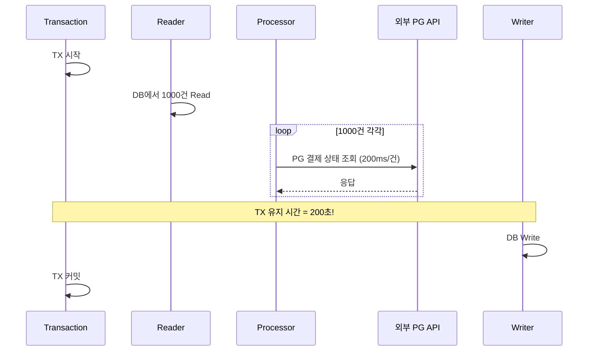
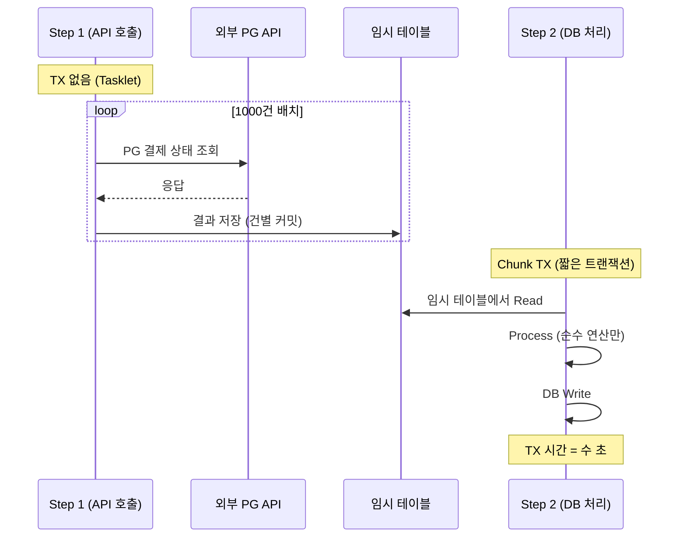

# Long-running 트랜잭션 감지와 회피

배치 환경에서 발생하는 Long-running 트랜잭션의 원인, Connection Pool 고갈 메커니즘, 그리고 외부 API 호출을 트랜잭션 밖으로 분리하는 실전 패턴을 다룬다. 결제/정산 배치에서 트랜잭션이 길어지면 전체 서비스가 마비될 수 있으며, 이를 사전에 감지하고 구조적으로 회피하는 전략이 핵심이다.

## 목차
- [1. 핵심 개념 (What)](#1-핵심-개념-what)
- [2. 왜 알아야 하는가 (Why)](#2-왜-알아야-하는가-why)
- [3. 내부 구현 분석 (How)](#3-내부-구현-분석-how)
- [4. 실전 예제](#4-실전-예제)
- [5. 정리](#5-정리)

---

## 1. 핵심 개념 (What)

### Long-running 트랜잭션이란

Long-running 트랜잭션은 **시작된 후 오랜 시간 동안 커밋되지 않는 트랜잭션**이다. RDBMS에서 트랜잭션이 열려 있는 동안 해당 커넥션은 반환되지 않고, 관련 행에 대한 락이 유지된다.

### 배치에서 특히 위험한 이유

Spring Batch의 Chunk 기반 처리에서 **하나의 Chunk = 하나의 트랜잭션**이다. Chunk 내부에서 외부 API 호출이나 복잡한 연산이 포함되면, 트랜잭션이 의도치 않게 길어진다.

```
일반 웹 요청 트랜잭션:  [TX 시작] → 쿼리 1~3건 → [TX 커밋]  (50ms ~ 500ms)
배치 Chunk 트랜잭션:   [TX 시작] → Read 1000건 → Process 1000건 → Write 1000건 → [TX 커밋]
                                    └── 만약 Process에서 외부 API 호출이 있다면?
                                        1000건 × 200ms = 200초(3분 20초) 동안 TX 유지!
```

### Connection Pool 고갈 메커니즘

```
┌────────────────────────────────────────────────────────────────────────┐
│                    Connection Pool 고갈 시나리오                         │
│                                                                         │
│  HikariCP Pool (maximumPoolSize = 10)                                  │
│                                                                         │
│  시점 T=0s:  배치 시작, 커넥션 1개 사용 (Chunk 트랜잭션)              │
│  ┌──────────────────────────────────────────────────────────────────┐  │
│  │ [사용중] [빈칸] [빈칸] [빈칸] [빈칸] [빈칸] [빈칸] [빈칸] ... │  │
│  └──────────────────────────────────────────────────────────────────┘  │
│                                                                         │
│  시점 T=30s: 외부 API 응답 지연으로 Chunk TX 길어짐                   │
│              + 다른 배치/웹 요청이 커넥션 사용 시작                    │
│  ┌──────────────────────────────────────────────────────────────────┐  │
│  │ [배치TX] [웹1] [웹2] [웹3] [배치2] [웹4] [웹5] [빈칸] [빈칸]  │  │
│  └──────────────────────────────────────────────────────────────────┘  │
│                                                                         │
│  시점 T=60s: 배치 TX가 아직 안 끝남 + 커넥션 풀 거의 소진            │
│  ┌──────────────────────────────────────────────────────────────────┐  │
│  │ [배치TX] [웹1] [웹2] [웹3] [배치2] [웹4] [웹5] [웹6] [웹7]    │  │
│  └──────────────────────────────────────────────────────────────────┘  │
│                                                                         │
│  시점 T=90s: 풀 고갈! 새 요청은 connectionTimeout(30s) 대기           │
│              → 30초 후 SQLTransientConnectionException                 │
│              → 웹 서비스 전체 응답 불가 (Cascading Failure!)           │
└────────────────────────────────────────────────────────────────────────┘
```

### HikariCP Cascading Failure 패턴

| 단계 | 현상 | 지표 |
|------|------|------|
| 1단계 | 배치 TX 길어짐 | `hikaricp_connections_active` 증가 |
| 2단계 | 풀 여유분 감소 | `hikaricp_connections_idle` 0 근접 |
| 3단계 | 대기 큐 증가 | `hikaricp_connections_pending` 급증 |
| 4단계 | connectionTimeout 초과 | `SQLTransientConnectionException` 발생 |
| 5단계 | 서비스 전체 장애 | 모든 DB 요청 실패 |

---

## 2. 왜 알아야 하는가 (Why)

1. **배치가 웹 서비스를 죽일 수 있다** - 배치와 웹 서비스가 같은 DB를 공유하면, 배치의 Long-running TX로 인한 커넥션 풀 고갈이 웹 서비스에 전파된다. 별도 DataSource를 사용하더라도, DB 서버의 `max_connections`에는 상한이 있다.

2. **HikariCP는 기본 설정으로는 Long-running TX를 감지하지 않는다** - `leakDetectionThreshold`가 기본 0(비활성)이기 때문에, 커넥션 누수가 발생해도 로그에 나타나지 않는다. 프로덕션에서는 반드시 활성화해야 한다.

3. **InnoDB Lock Wait로 인한 데드락** - Long-running TX가 특정 행을 잠근 상태에서, 다른 배치나 웹 요청이 같은 행에 접근하면 `innodb_lock_wait_timeout`(기본 50초) 동안 대기 후 실패한다. 결제 테이블에서 이런 일이 발생하면 결제 처리 자체가 멈춘다.

4. **외부 API 호출이 트랜잭션을 예측 불가능하게 만든다** - PG사 API 응답 시간은 우리가 통제할 수 없다. 평소 200ms인 API가 장애 시 30초로 늘어나면, 1000건 Chunk의 트랜잭션이 8시간 넘게 유지될 수 있다.

---

## 3. 내부 구현 분석 (How)

### 3.1 HikariCP leakDetectionThreshold 설정

커넥션 누수(Leak)를 조기에 발견하는 가장 효과적인 방법이다. 설정된 시간 이상 커넥션이 반환되지 않으면 경고 로그와 스택트레이스를 출력한다.

```yaml
# application.yml
spring:
  datasource:
    hikari:
      maximum-pool-size: 10
      # Best Practice: connectionTimeout은 서비스 응답 SLA 이하로 설정
      connection-timeout: 3000    # 3초 (기본 30초는 너무 김)
      # 커넥션 누수 감지: 이 시간 이상 미반환 시 WARN 로그 출력
      leak-detection-threshold: 10000  # 10초 (0이면 비활성)
      # 유휴 커넥션 유지 시간
      idle-timeout: 600000        # 10분
      max-lifetime: 1800000       # 30분
```

`leakDetectionThreshold` 발동 시 출력되는 로그:

```
WARN  com.zaxxer.hikari.pool.ProxyLeakTask -
Connection leak detection triggered for com.mysql.cj.jdbc.ConnectionImpl@3a5ed7a6
on thread batch-executor-1, stack trace follows
java.lang.Exception: Apparent connection leak detected
    at com.zaxxer.hikari.pool.ProxyLeakTask.run(ProxyLeakTask.java:35)
    at com.example.batch.PaymentProcessor.process(PaymentProcessor.java:42)
    at org.springframework.batch.item.support.CompositeItemProcessor.process(...)
    ...
```

### 3.2 InnoDB Lock Wait Timeout과 Chunk Size의 관계

```
┌────────────────────────────────────────────────────────────────────────┐
│  innodb_lock_wait_timeout = 50초 (기본값)                              │
│                                                                         │
│  시나리오: 배치가 payment 테이블의 행을 UPDATE하는 동안                │
│           웹 서비스도 같은 행에 접근                                   │
│                                                                         │
│  Chunk Size = 100일 때:                                               │
│  TX 시간 ≈ Read 100건(0.5s) + Process(1s) + Write 100건(0.5s) = 2초  │
│  → 락 유지 시간 2초 → 웹 요청은 최대 2초 대기 후 성공                │
│                                                                         │
│  Chunk Size = 10000일 때:                                              │
│  TX 시간 ≈ Read(5s) + Process(100s) + Write(50s) = 155초             │
│  → 락 유지 시간 155초 > innodb_lock_wait_timeout(50초)               │
│  → 웹 요청이 50초 대기 후 실패!                                      │
│     ERROR 1205 (HY000): Lock wait timeout exceeded                     │
└────────────────────────────────────────────────────────────────────────┘
```

**Chunk Size 결정 공식:**

```
Chunk TX 예상 시간 < innodb_lock_wait_timeout × 0.5 (안전 마진)

예시: innodb_lock_wait_timeout = 50초
→ Chunk TX 예상 시간 < 25초
→ 건당 Process 시간이 10ms라면, Chunk Size ≤ 2500건
```

### 3.3 외부 API 호출의 트랜잭션 분리

외부 API 호출을 포함하는 ItemProcessor에서 트랜잭션을 분리하는 것이 핵심이다.

#### 문제가 되는 구조 (안티패턴)



#### 해결 방법 1: 2-Step 패턴 (권장)

외부 API 호출과 DB 쓰기를 별도 Step으로 분리한다.



#### 해결 방법 2: @Transactional(propagation = NOT_SUPPORTED)

Processor 내부에서 트랜잭션을 명시적으로 분리한다.

```java
/**
 * 외부 API 호출을 트랜잭션 밖에서 수행하는 Processor.
 *
 * Best Practice: Chunk 트랜잭션 안에서 외부 API를 호출하지 않는다.
 * propagation = NOT_SUPPORTED로 현재 TX를 일시 중단한다.
 *
 * 주의: 이 방식은 API 호출 결과가 TX 롤백과 무관하게 유지된다.
 * 멱등성이 보장되지 않는 API(결제 실행 등)에는 사용하면 안 된다.
 * 조회성 API(상태 확인 등)에만 적합하다.
 */
@Slf4j
@Component
@RequiredArgsConstructor
public class PaymentStatusCheckProcessor
        implements ItemProcessor<Payment, PaymentWithStatus> {

    private final PgApiClient pgApiClient;

    @Transactional(propagation = Propagation.NOT_SUPPORTED)
    @Override
    public PaymentWithStatus process(Payment payment) throws Exception {
        // 이 메서드는 Chunk 트랜잭션 밖에서 실행됨
        PgPaymentStatus pgStatus = pgApiClient.checkStatus(payment.getPgTransactionId());

        return PaymentWithStatus.builder()
                .payment(payment)
                .pgStatus(pgStatus)
                .checkedAt(LocalDateTime.now())
                .build();
    }
}
```

### 3.4 @Transactional(timeout) 설정과 주의사항

```java
/**
 * 트랜잭션 타임아웃 설정.
 *
 * 주의사항:
 * 1. timeout은 DB 쿼리 실행 시점에만 체크된다.
 *    → 외부 API 호출 중에는 타임아웃이 발동하지 않는다!
 * 2. Spring의 트랜잭션 타임아웃은 DataSource의 쿼리 타임아웃으로 전파된다.
 * 3. Chunk 기반 Step에서는 Step 레벨에서 설정하는 것이 더 명확하다.
 */
@Bean
public Step paymentStep() {
    return new StepBuilder("paymentStep", jobRepository)
            .<Payment, Payment>chunk(500, transactionManager)
            .reader(paymentReader())
            .processor(paymentProcessor())
            .writer(paymentWriter())
            // Best Practice: Chunk 트랜잭션 타임아웃은 Step에서 설정
            .transactionAttribute(createTxAttribute())
            .build();
}

private TransactionAttribute createTxAttribute() {
    DefaultTransactionAttribute attribute = new DefaultTransactionAttribute();
    attribute.setTimeout(30);  // 30초 (Chunk 하나의 최대 TX 시간)
    attribute.setIsolationLevel(TransactionDefinition.ISOLATION_READ_COMMITTED);
    return attribute;
}
```

### 3.5 information_schema.INNODB_TRX 실시간 모니터링

```sql
-- 30초 이상 실행 중인 트랜잭션 감지 쿼리
-- 프로덕션에서 주기적으로 실행하여 Long-running TX를 조기 발견한다
SELECT
    trx_id,
    trx_state,
    trx_started,
    TIMESTAMPDIFF(SECOND, trx_started, NOW()) AS duration_seconds,
    trx_mysql_thread_id,
    trx_query,
    trx_tables_locked,
    trx_rows_locked,
    trx_rows_modified
FROM information_schema.INNODB_TRX
WHERE TIMESTAMPDIFF(SECOND, trx_started, NOW()) > 30
ORDER BY duration_seconds DESC;
```

```sql
-- 특정 트랜잭션이 잡고 있는 락 상세 정보
SELECT
    r.trx_id AS waiting_trx_id,
    r.trx_mysql_thread_id AS waiting_thread,
    r.trx_query AS waiting_query,
    b.trx_id AS blocking_trx_id,
    b.trx_mysql_thread_id AS blocking_thread,
    b.trx_query AS blocking_query,
    TIMESTAMPDIFF(SECOND, b.trx_started, NOW()) AS blocking_duration_sec
FROM information_schema.INNODB_LOCK_WAITS w
JOIN information_schema.INNODB_TRX b ON b.trx_id = w.blocking_trx_id
JOIN information_schema.INNODB_TRX r ON r.trx_id = w.requesting_trx_id;
```

---

## 4. 실전 예제

### 4.1 HikariCP 프로덕션 설정

```yaml
# application-prod.yml
spring:
  datasource:
    # Best Practice: 배치 전용 DataSource 분리
    batch:
      hikari:
        pool-name: batch-pool
        maximum-pool-size: 5          # 배치는 소수 커넥션으로 충분
        minimum-idle: 2
        connection-timeout: 5000      # 5초 (배치는 약간 여유)
        leak-detection-threshold: 30000  # 30초 (Chunk TX 최대 시간 기준)
        max-lifetime: 1800000         # 30분
        idle-timeout: 600000          # 10분
        # Best Practice: 커넥션 유효성 검사
        connection-test-query: SELECT 1
        validation-timeout: 3000

    # 웹 서비스용 DataSource (배치와 분리)
    web:
      hikari:
        pool-name: web-pool
        maximum-pool-size: 20
        minimum-idle: 5
        connection-timeout: 3000      # 3초 (웹은 빠른 응답 필수)
        leak-detection-threshold: 10000  # 10초
```

```java
/**
 * 배치 전용 DataSource와 웹 전용 DataSource를 분리하는 설정.
 * 배치의 Long-running TX가 웹 서비스 커넥션 풀에 영향을 주지 않도록 한다.
 */
@Configuration
public class DataSourceConfig {

    @Bean("batchDataSource")
    @ConfigurationProperties("spring.datasource.batch.hikari")
    public DataSource batchDataSource() {
        return DataSourceBuilder.create()
                .type(HikariDataSource.class)
                .build();
    }

    @Bean("webDataSource")
    @Primary
    @ConfigurationProperties("spring.datasource.web.hikari")
    public DataSource webDataSource() {
        return DataSourceBuilder.create()
                .type(HikariDataSource.class)
                .build();
    }

    // 배치 전용 TransactionManager
    @Bean("batchTransactionManager")
    public PlatformTransactionManager batchTransactionManager(
            @Qualifier("batchDataSource") DataSource dataSource) {
        return new DataSourceTransactionManager(dataSource);
    }
}
```

### 4.2 외부 PG API 호출 2-Step 패턴 구현

```java
/**
 * Step 1: 외부 PG API 호출 (트랜잭션 없음)
 * PG사에 결제 상태를 조회하고 결과를 임시 테이블에 저장한다.
 *
 * Best Practice: 외부 API 호출은 Tasklet으로 처리하여
 * DB 트랜잭션과 완전히 분리한다.
 */
@Slf4j
@Component
@RequiredArgsConstructor
public class PgStatusFetchTasklet implements Tasklet {

    private final PgApiClient pgApiClient;
    private final JdbcTemplate batchJdbcTemplate;

    @Override
    public RepeatStatus execute(StepContribution contribution,
                                 ChunkContext chunkContext) throws Exception {
        String targetDate = chunkContext.getStepContext()
                .getJobParameters().get("targetDate").toString();

        // 처리 대상 결제 건 조회
        List<PaymentId> targets = batchJdbcTemplate.query(
                "SELECT id, pg_transaction_id FROM payment WHERE settle_date = ? AND status = 'PENDING'",
                (rs, rowNum) -> new PaymentId(rs.getLong("id"), rs.getString("pg_transaction_id")),
                targetDate
        );

        log.info("[Step 1] PG 상태 조회 시작. 대상: {}건", targets.size());

        int successCount = 0;
        int failCount = 0;

        for (PaymentId target : targets) {
            try {
                // 외부 API 호출 (트랜잭션 밖)
                PgPaymentStatus status = pgApiClient.checkStatus(target.pgTransactionId());

                // 결과를 임시 테이블에 저장 (건별 커밋 = autocommit)
                batchJdbcTemplate.update(
                        "INSERT INTO payment_pg_status_temp (payment_id, pg_status, checked_at) VALUES (?, ?, NOW())",
                        target.id(), status.name()
                );
                successCount++;
            } catch (Exception e) {
                log.warn("[Step 1] PG 상태 조회 실패. paymentId={}, error={}",
                        target.id(), e.getMessage());
                failCount++;
            }
        }

        log.info("[Step 1] PG 상태 조회 완료. 성공: {}건, 실패: {}건", successCount, failCount);
        contribution.incrementWriteCount(successCount);

        return RepeatStatus.FINISHED;
    }

    record PaymentId(long id, String pgTransactionId) {}
}

/**
 * Step 2: 임시 테이블 기반 정산 처리 (Chunk 트랜잭션)
 * 외부 API 호출이 없으므로 트랜잭션이 짧고 예측 가능하다.
 */
@Configuration
@RequiredArgsConstructor
public class PgSettlementJobConfig {

    private final JobRepository jobRepository;
    private final PlatformTransactionManager batchTransactionManager;
    private final PgStatusFetchTasklet pgStatusFetchTasklet;

    @Bean
    public Job pgSettlementJob() {
        return new JobBuilder("pgSettlementJob", jobRepository)
                .start(pgStatusFetchStep())    // Step 1: API 호출 (TX 없음)
                .next(settlementProcessStep())  // Step 2: DB 처리 (짧은 TX)
                .next(cleanupTempStep())         // Step 3: 임시 테이블 정리
                .build();
    }

    @Bean
    public Step pgStatusFetchStep() {
        return new StepBuilder("pgStatusFetchStep", jobRepository)
                .tasklet(pgStatusFetchTasklet, batchTransactionManager)
                .build();
    }

    @Bean
    public Step settlementProcessStep() {
        return new StepBuilder("settlementProcessStep", jobRepository)
                .<PaymentWithPgStatus, SettlementResult>chunk(500, batchTransactionManager)
                .reader(paymentWithPgStatusReader())  // 임시 테이블 JOIN 조회
                .processor(settlementProcessor())      // 순수 비즈니스 로직만
                .writer(settlementWriter())
                .build();
    }

    @Bean
    public Step cleanupTempStep() {
        return new StepBuilder("cleanupTempStep", jobRepository)
                .tasklet((contribution, chunkContext) -> {
                    // Best Practice: 배치 완료 후 임시 테이블 정리
                    batchJdbcTemplate.execute("TRUNCATE TABLE payment_pg_status_temp");
                    return RepeatStatus.FINISHED;
                }, batchTransactionManager)
                .build();
    }
}
```

### 4.3 Long-running TX 모니터링 대시보드 쿼리

```sql
-- 프로덕션 모니터링 쿼리 모음

-- 1. 현재 활성 커넥션 수와 대기 중인 커넥션 수 (HikariCP MBean 기반)
-- Prometheus에서 수집: hikaricp_connections_active, hikaricp_connections_pending

-- 2. 30초 이상 실행 중인 트랜잭션 (실시간 모니터링)
SELECT
    t.trx_id,
    t.trx_state,
    TIMESTAMPDIFF(SECOND, t.trx_started, NOW()) AS running_seconds,
    t.trx_rows_locked,
    t.trx_rows_modified,
    p.USER AS db_user,
    p.HOST AS client_host,
    p.DB AS database_name,
    SUBSTRING(p.INFO, 1, 200) AS current_query
FROM information_schema.INNODB_TRX t
JOIN information_schema.PROCESSLIST p ON t.trx_mysql_thread_id = p.ID
WHERE TIMESTAMPDIFF(SECOND, t.trx_started, NOW()) > 30
ORDER BY running_seconds DESC;

-- 3. 데드락 감지 (최근 데드락 정보)
SHOW ENGINE INNODB STATUS\G
-- 출력에서 "LATEST DETECTED DEADLOCK" 섹션 확인

-- 4. 테이블별 락 대기 현황
SELECT
    object_schema,
    object_name,
    lock_type,
    lock_mode,
    lock_status,
    lock_data
FROM performance_schema.data_locks
WHERE lock_status = 'WAITING'
ORDER BY object_schema, object_name;
```

### 4.4 Long-running TX 감지 자동화

```java
/**
 * 주기적으로 Long-running TX를 감지하여 알림을 보내는 스케줄러.
 * 배치 실행 중에만 활성화되며, 임계치 초과 시 경고한다.
 */
@Slf4j
@Component
@RequiredArgsConstructor
public class LongRunningTxDetector {

    private final JdbcTemplate jdbcTemplate;
    private final AlertService alertService;

    @Value("${monitoring.long-tx.threshold-seconds:30}")
    private int thresholdSeconds;

    // 30초마다 실행
    @Scheduled(fixedRate = 30_000)
    public void detectLongRunningTransactions() {
        List<LongTxInfo> longTxList = jdbcTemplate.query(
                """
                SELECT trx_id, trx_state,
                       TIMESTAMPDIFF(SECOND, trx_started, NOW()) AS duration_seconds,
                       trx_rows_locked, trx_rows_modified, trx_query
                FROM information_schema.INNODB_TRX
                WHERE TIMESTAMPDIFF(SECOND, trx_started, NOW()) > ?
                ORDER BY duration_seconds DESC
                """,
                (rs, rowNum) -> new LongTxInfo(
                        rs.getString("trx_id"),
                        rs.getString("trx_state"),
                        rs.getInt("duration_seconds"),
                        rs.getInt("trx_rows_locked"),
                        rs.getInt("trx_rows_modified"),
                        rs.getString("trx_query")
                ),
                thresholdSeconds
        );

        if (!longTxList.isEmpty()) {
            String message = formatAlert(longTxList);
            log.warn("[Long TX 감지] {}건\n{}", longTxList.size(), message);
            alertService.send(AlertLevel.WARNING, message);
        }
    }

    private String formatAlert(List<LongTxInfo> txList) {
        StringBuilder sb = new StringBuilder();
        sb.append(String.format("[Long-running TX 감지] %d건 발견\n", txList.size()));
        for (LongTxInfo tx : txList) {
            sb.append(String.format(
                    "- TRX: %s | %d초 | 락: %d행 | 변경: %d행 | 쿼리: %.100s\n",
                    tx.trxId(), tx.durationSeconds(), tx.rowsLocked(),
                    tx.rowsModified(), tx.query() != null ? tx.query() : "N/A"
            ));
        }
        return sb.toString();
    }

    record LongTxInfo(String trxId, String state, int durationSeconds,
                      int rowsLocked, int rowsModified, String query) {}
}
```

---

## 5. 정리

| 영역 | 핵심 내용 | 구현 포인트 |
|------|-----------|-------------|
| **개념** | Long-running TX = 오래 커밋 안 되는 트랜잭션 | 배치 Chunk TX에서 외부 API 호출이 주 원인 |
| **풀 고갈** | 배치 TX가 커넥션을 장시간 점유 → Cascading Failure | 배치/웹 DataSource 분리 필수 |
| **누수 감지** | HikariCP `leakDetectionThreshold`로 조기 탐지 | 프로덕션에서 반드시 활성화 (0 = 비활성) |
| **Chunk Size** | TX 시간 < `innodb_lock_wait_timeout` × 0.5 | 외부 API 포함 시 Chunk Size 대폭 축소 |
| **TX 분리** | 외부 API 호출을 TX 밖으로 분리 | 2-Step 패턴 또는 `NOT_SUPPORTED` |
| **TX 타임아웃** | `@Transactional(timeout=30)` 설정 | DB 쿼리 시점에만 체크, API 호출 중엔 미작동 |
| **모니터링** | `INNODB_TRX` 실시간 조회 | 30초 이상 TX 자동 감지 + 알림 |
| **DataSource 분리** | 배치 전용 풀과 웹 전용 풀 분리 | 각각의 HikariCP 설정 독립 관리 |

---

*참고: Spring Batch 5.x / Spring Boot 3.x 기준*
