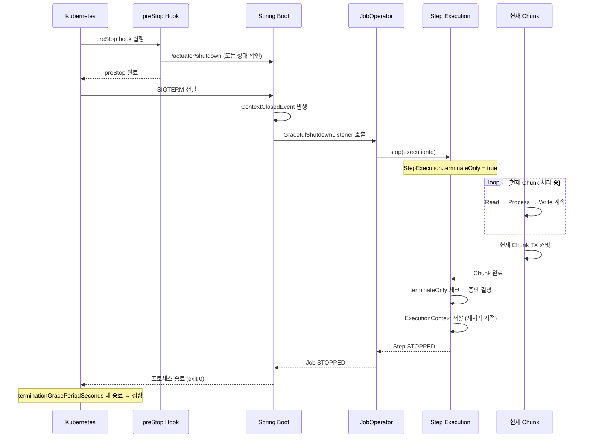

# Graceful Shutdown과 배포 시 안전 전략

Spring Boot Graceful Shutdown 메커니즘을 활용하여 배치 Job 실행 중 안전하게 종료하는 방법, K8s 환경에서의 배포 전략, 그리고 중단 지점부터 재시작하는 패턴을 다룬다. 결제/정산 배치에서 강제 종료는 이중 과금이나 데이터 불일치를 유발할 수 있으므로, 안전한 종료와 배포 전략은 필수다.

## 목차
- [1. 핵심 개념 (What)](#1-핵심-개념-what)
- [2. 왜 알아야 하는가 (Why)](#2-왜-알아야-하는가-why)
- [3. 내부 구현 분석 (How)](#3-내부-구현-분석-how)
- [4. 실전 예제](#4-실전-예제)
- [5. 정리](#5-정리)

---

## 1. 핵심 개념 (What)

### Graceful Shutdown이란

Graceful Shutdown은 **진행 중인 작업을 안전하게 완료한 후 프로세스를 종료하는 것**이다. 반대 개념인 Hard Shutdown(SIGKILL)은 즉시 프로세스를 죽이므로, 진행 중인 트랜잭션이 롤백되거나 데이터가 불완전한 상태로 남는다.

### Spring Boot Graceful Shutdown과 배치 Job의 관계

| 구분 | 웹 서비스 | 배치 Job |
|------|-----------|----------|
| Graceful Shutdown 대상 | 진행 중인 HTTP 요청 | 진행 중인 Chunk 트랜잭션 |
| 새 작업 수락 | 새 요청 거부 (503) | 새 Chunk 시작 안 함 |
| 완료 대기 | 현재 요청 처리 완료까지 대기 | 현재 Chunk 커밋까지 대기 |
| 타임아웃 초과 시 | 강제 종료 | 강제 종료 (TX 롤백) |

### K8s 환경에서의 Pod 종료 흐름

```
┌────────────────────────────────────────────────────────────────────────┐
│  K8s Pod 종료 시퀀스                                                   │
│                                                                         │
│  1. kubectl rollout / HPA scale-down / Node drain                      │
│     ↓                                                                   │
│  2. Pod의 Endpoint가 Service에서 제거됨 (새 트래픽 차단)              │
│     ↓                                                                   │
│  3. preStop hook 실행 (설정된 경우)                                    │
│     ↓                                                                   │
│  4. SIGTERM 전달 (PID 1에게)                                           │
│     ↓                                                                   │
│  5. Spring Boot Graceful Shutdown 시작                                 │
│     - JobOperator.stop() 호출                                          │
│     - 현재 Chunk 완료 대기                                             │
│     ↓                                                                   │
│  6. terminationGracePeriodSeconds 타이머 시작 (기본 30초)             │
│     ↓                                                                   │
│  7-A. 시간 내 종료 성공 → 정상 종료                                   │
│  7-B. 시간 초과 → SIGKILL (강제 종료)                                 │
└────────────────────────────────────────────────────────────────────────┘
```

---

## 2. 왜 알아야 하는가 (Why)

1. **결제 배치 강제 종료 = 이중 과금 위험** - 결제 실행 Chunk가 커밋 직전에 강제 종료되면, PG사에는 결제가 완료됐지만 내부 DB에는 기록이 안 된 상태가 된다. 재시작 시 같은 결제를 다시 실행하면 이중 과금이 발생한다.

2. **정산 배치 중간 종료 = 데이터 불일치** - 10만 건의 정산 처리 중 5만 건 시점에서 강제 종료되면, 5만 건은 정산 완료 상태이고 나머지 5만 건은 미처리 상태다. 재시작 로직이 없으면 어디서부터 다시 시작해야 하는지 알 수 없다.

3. **K8s Rolling Update = 암묵적 종료 요청** - 배포할 때마다 기존 Pod에 SIGTERM이 전달된다. 배치가 실행 중이라면 배포 = 배치 중단이다. Graceful Shutdown 없이 배포하면 매 배포마다 장애 리스크가 발생한다.

### 실제 장애 시나리오

```
┌────────────────────────────────────────────────────────────────────────┐
│  장애 시나리오: 정산 배치 배포 중 강제 종료                            │
│                                                                         │
│  02:00 - 정산 배치 시작 (10만 건)                                      │
│  02:30 - 5만 건 처리 완료 (50%)                                        │
│  02:31 - 개발자가 핫픽스 배포 (kubectl apply)                          │
│          → SIGTERM 전달                                                │
│          → terminationGracePeriodSeconds = 30초 (기본값)               │
│          → 현재 Chunk(1000건)가 25초 남음                              │
│  02:31:30 - 30초 타임아웃 초과! SIGKILL 발동                          │
│             → 진행 중이던 Chunk TX 롤백                                │
│             → BATCH_JOB_EXECUTION 상태: STARTED (비정상)               │
│                                                                         │
│  02:32 - 새 Pod 시작, 배치 재시작 시도                                │
│          → 이전 Execution이 STARTED 상태라 재시작 불가!               │
│          → "A job execution for this job is already running" 에러     │
│                                                                         │
│  결과: 수동으로 BATCH_JOB_EXECUTION 상태를 FAILED로 변경해야 재시작   │
│        → 새벽에 DBA 호출 → 대응 시간 1시간+ → 정산 지급 지연         │
└────────────────────────────────────────────────────────────────────────┘
```

---

## 3. 내부 구현 분석 (How)

### 3.1 Spring Boot Graceful Shutdown 설정

```yaml
# application.yml
server:
  # Graceful Shutdown 활성화
  shutdown: graceful

spring:
  lifecycle:
    # Graceful Shutdown 최대 대기 시간
    # Best Practice: 배치의 최대 Chunk 처리 시간 + 여유(10초)
    timeout-per-shutdown-phase: 60s
```

### 3.2 JobOperator.stop()을 활용한 안전 정지

SIGTERM 수신 시 `JobOperator.stop()`을 호출하면, 현재 실행 중인 Chunk를 완료한 후 Job을 STOPPED 상태로 전환한다.

```java
/**
 * SIGTERM(ContextClosedEvent) 수신 시 실행 중인 모든 배치 Job을
 * 안전하게 중지하는 리스너.
 *
 * Best Practice:
 * - stop()은 현재 Chunk 완료 후 중지를 요청하는 것이지 즉시 중단이 아니다
 * - STOPPED 상태의 Job은 JobOperator.restart()로 이어서 실행 가능
 */
@Slf4j
@Component
@RequiredArgsConstructor
public class GracefulShutdownListener implements ApplicationListener<ContextClosedEvent> {

    private final JobOperator jobOperator;
    private final JobExplorer jobExplorer;

    @Override
    public void onApplicationEvent(ContextClosedEvent event) {
        log.info("[Graceful Shutdown] SIGTERM 수신. 실행 중인 Job 중지 시작...");

        Set<Long> runningExecutionIds = jobOperator.getRunningExecutions("*");

        if (runningExecutionIds.isEmpty()) {
            log.info("[Graceful Shutdown] 실행 중인 Job 없음. 즉시 종료.");
            return;
        }

        for (Long executionId : runningExecutionIds) {
            try {
                jobOperator.stop(executionId);
                log.info("[Graceful Shutdown] Job 중지 요청 완료. executionId={}", executionId);
            } catch (Exception e) {
                log.error("[Graceful Shutdown] Job 중지 실패. executionId={}", executionId, e);
            }
        }

        // 현재 Chunk 완료까지 대기
        waitForJobsToStop(runningExecutionIds);
    }

    private void waitForJobsToStop(Set<Long> executionIds) {
        int maxWaitSeconds = 55;  // terminationGracePeriodSeconds보다 약간 짧게
        int waited = 0;

        while (waited < maxWaitSeconds) {
            boolean allStopped = executionIds.stream()
                    .map(id -> jobExplorer.getJobExecution(id))
                    .allMatch(exec -> exec != null && !exec.isRunning());

            if (allStopped) {
                log.info("[Graceful Shutdown] 모든 Job 안전 중지 완료. ({}초 소요)", waited);
                return;
            }

            try {
                Thread.sleep(1000);
                waited++;
            } catch (InterruptedException e) {
                Thread.currentThread().interrupt();
                break;
            }
        }

        log.warn("[Graceful Shutdown] 대기 시간({}초) 초과. 일부 Job이 아직 실행 중.", maxWaitSeconds);
    }
}
```

### 3.3 K8s preStop hook 설정

preStop hook은 SIGTERM 전에 실행되므로, 배치 종료 준비 시간을 확보할 수 있다.

```yaml
# k8s/deployment.yaml
apiVersion: apps/v1
kind: Deployment
metadata:
  name: settlement-batch
spec:
  replicas: 1
  # Best Practice: 배치 Pod는 Recreate 전략 사용
  strategy:
    type: Recreate
  template:
    spec:
      # SIGKILL까지의 최대 대기 시간
      # Best Practice: 배치 최대 Chunk 시간 + preStop 시간 + 여유(20초)
      terminationGracePeriodSeconds: 90
      containers:
        - name: settlement-batch
          image: settlement-batch:latest
          lifecycle:
            preStop:
              exec:
                command:
                  - /bin/sh
                  - -c
                  # preStop에서 Spring Actuator를 통해 실행 중인 Job 확인 후
                  # 종료 준비 완료까지 대기
                  - |
                    echo "preStop hook 시작"
                    # 실행 중인 Job이 있는지 확인
                    RUNNING=$(curl -s http://localhost:8080/actuator/batch/jobs/running | jq length)
                    if [ "$RUNNING" -gt 0 ]; then
                      echo "실행 중인 Job ${RUNNING}건 발견. 종료 준비 중..."
                      # Actuator shutdown 엔드포인트 호출 (Graceful)
                      curl -X POST http://localhost:8080/actuator/shutdown
                      # 약간의 대기 (SIGTERM이 이후에 전달됨)
                      sleep 5
                    fi
                    echo "preStop hook 완료"
          resources:
            requests:
              memory: "1Gi"
              cpu: "500m"
            limits:
              memory: "2Gi"
              cpu: "1000m"
```

### 3.4 SIGTERM → 안전 종료 전체 시퀀스



### 3.5 StepExecution.isTerminateOnly() 활용

`JobOperator.stop()`은 `StepExecution.setTerminateOnly(true)`를 설정한다. Chunk 처리 루프에서 이 플래그를 확인하면, 현재 Chunk 완료 후 안전하게 중단할 수 있다.

```java
/**
 * ItemProcessor에서 terminateOnly 플래그를 확인하여
 * Graceful Shutdown 중에는 빠르게 현재 Chunk를 완료하고 중단한다.
 *
 * Best Practice: 외부 API 호출처럼 시간이 오래 걸리는 Processor에서는
 * 매 아이템 처리 전에 terminateOnly를 체크한다.
 */
@Slf4j
@Component
@StepScope
@RequiredArgsConstructor
public class SafeSettlementProcessor
        implements ItemProcessor<SettlementSource, SettlementResult> {

    @Value("#{stepExecution}")
    private StepExecution stepExecution;

    private final SettlementCalculator calculator;

    @Override
    public SettlementResult process(SettlementSource source) throws Exception {
        // Graceful Shutdown 중이면 현재 아이템은 처리하되 로그 남김
        if (stepExecution.isTerminateOnly()) {
            log.info("[Graceful Shutdown] 종료 요청 감지. 현재 Chunk 완료 후 중단 예정. " +
                    "처리 중인 아이템: {}", source.getId());
        }

        // 비즈니스 로직은 정상 수행 (현재 Chunk는 완료해야 함)
        return calculator.calculate(source);
    }
}
```

### 3.6 ExecutionContext 기반 재시작

Job이 STOPPED 상태로 안전 중단된 후, `JobOperator.restart()`로 중단 지점부터 재개한다.

```java
/**
 * 중단된 Job을 재시작하는 서비스.
 * STOPPED 또는 FAILED 상태의 Job만 재시작 가능하다.
 *
 * ExecutionContext에 저장된 read.count, write.count 등을 활용하여
 * 중단 지점부터 정확히 재개한다.
 */
@Slf4j
@Service
@RequiredArgsConstructor
public class BatchRestartService {

    private final JobOperator jobOperator;
    private final JobExplorer jobExplorer;

    /**
     * 마지막 실행이 STOPPED/FAILED인 Job을 재시작한다.
     *
     * @param jobName 재시작할 Job 이름
     * @return 새 JobExecution ID
     */
    public Long restartJob(String jobName) {
        // 마지막 실행 조회
        List<JobInstance> instances = jobExplorer.getJobInstances(jobName, 0, 1);
        if (instances.isEmpty()) {
            throw new IllegalStateException("Job not found: " + jobName);
        }

        JobInstance lastInstance = instances.get(0);
        List<JobExecution> executions = jobExplorer.getJobExecutions(lastInstance);
        JobExecution lastExecution = executions.get(0);

        BatchStatus status = lastExecution.getStatus();
        if (status != BatchStatus.STOPPED && status != BatchStatus.FAILED) {
            throw new IllegalStateException(
                    String.format("Job '%s' 상태가 %s이므로 재시작 불가. STOPPED 또는 FAILED만 가능.",
                            jobName, status));
        }

        // 재시작 지점 로깅
        lastExecution.getStepExecutions().forEach(step -> {
            log.info("[재시작] Step: {}, ReadCount: {}, WriteCount: {}, CommitCount: {}",
                    step.getStepName(),
                    step.getReadCount(),
                    step.getWriteCount(),
                    step.getCommitCount());
        });

        try {
            Long newExecutionId = jobOperator.restart(lastExecution.getId());
            log.info("[재시작] Job '{}' 재시작 성공. 이전 ExecutionId: {}, 새 ExecutionId: {}",
                    jobName, lastExecution.getId(), newExecutionId);
            return newExecutionId;
        } catch (Exception e) {
            log.error("[재시작] Job '{}' 재시작 실패", jobName, e);
            throw new RuntimeException("Job 재시작 실패: " + jobName, e);
        }
    }
}
```

---

## 4. 실전 예제

### 4.1 배치 전용 Pod 배포 전략 비교

#### Recreate vs Blue/Green

| 비교 항목 | Recreate | Blue/Green (Rolling) |
|-----------|----------|---------------------|
| **동작** | 기존 Pod 모두 종료 후 새 Pod 생성 | 새 Pod 준비 후 트래픽 전환 |
| **다운타임** | 있음 (종료~시작 사이) | 없음 |
| **동시 실행** | 불가능 | 기존+새 Pod 동시 존재 |
| **배치 적합성** | 적합 (동시 실행 방지) | 부적합 (같은 Job 중복 실행 위험!) |
| **권장 대상** | 결제/정산 배치 | 웹 서비스 |

```yaml
# 결제/정산 배치는 Recreate 전략 필수
# 이유: Blue/Green은 신규 Pod가 뜨면서 같은 Job을 동시 실행할 수 있다
# → 이중 정산, 이중 결제 위험
spec:
  strategy:
    type: Recreate   # Rolling이 아닌 Recreate!
```

**Rolling Update가 배치에서 위험한 이유:**

```
시점 T=0:  [기존 Pod] 정산 배치 실행 중 (5만 건 처리 완료)
시점 T=1:  [새 Pod] 생성 → 스케줄러가 같은 정산 배치 시작!
           → 이미 정산 완료된 5만 건을 다시 처리할 수 있음
           → 이중 정산 발생!

Recreate 전략:
시점 T=0:  [기존 Pod] 정산 배치 실행 중
시점 T=1:  [기존 Pod] SIGTERM → Graceful Shutdown → STOPPED
시점 T=2:  [기존 Pod] 완전 종료 확인
시점 T=3:  [새 Pod] 생성 → 이전 Job restart() → 5만 건 이후부터 재개
           → 안전!
```

### 4.2 배포 전 실행 중 Job 확인

#### Spring Actuator 엔드포인트

```java
/**
 * 현재 실행 중인 배치 Job 목록을 제공하는 Actuator 엔드포인트.
 * 배포 전 CI/CD 파이프라인에서 이 엔드포인트를 확인하여
 * 실행 중인 Job이 있으면 배포를 대기한다.
 */
@Component
@Endpoint(id = "batchJobs")
@RequiredArgsConstructor
public class BatchJobsEndpoint {

    private final JobExplorer jobExplorer;

    @ReadOperation
    public Map<String, Object> getRunningJobs() {
        Set<String> jobNames = jobExplorer.getJobNames();
        List<Map<String, Object>> runningJobs = new ArrayList<>();

        for (String jobName : jobNames) {
            List<JobInstance> instances = jobExplorer.getJobInstances(jobName, 0, 1);
            for (JobInstance instance : instances) {
                List<JobExecution> executions = jobExplorer.getJobExecutions(instance);
                for (JobExecution execution : executions) {
                    if (execution.isRunning()) {
                        runningJobs.add(Map.of(
                                "jobName", jobName,
                                "executionId", execution.getId(),
                                "startTime", execution.getStartTime().toString(),
                                "status", execution.getStatus().toString(),
                                "stepExecutions", execution.getStepExecutions().stream()
                                        .map(step -> Map.of(
                                                "stepName", step.getStepName(),
                                                "readCount", step.getReadCount(),
                                                "writeCount", step.getWriteCount(),
                                                "status", step.getStatus().toString()
                                        ))
                                        .toList()
                        ));
                    }
                }
            }
        }

        return Map.of(
                "totalRunning", runningJobs.size(),
                "jobs", runningJobs,
                "safeToDeployment", runningJobs.isEmpty()
        );
    }
}
```

#### 배포 전 확인 스크립트

```bash
#!/bin/bash
# deploy-check.sh
# CI/CD 파이프라인에서 배포 전 실행 중인 배치 Job 확인

BATCH_URL="${BATCH_SERVICE_URL:-http://localhost:8080}"
MAX_WAIT=600    # 최대 10분 대기
INTERVAL=10     # 10초 간격 확인

echo "[배포 확인] 실행 중인 배치 Job 확인..."

elapsed=0
while [ $elapsed -lt $MAX_WAIT ]; do
    RESPONSE=$(curl -s "${BATCH_URL}/actuator/batchJobs")
    RUNNING=$(echo "$RESPONSE" | jq -r '.totalRunning')
    SAFE=$(echo "$RESPONSE" | jq -r '.safeToDeployment')

    if [ "$SAFE" = "true" ]; then
        echo "[배포 확인] 실행 중인 Job 없음. 배포 진행 가능."
        exit 0
    fi

    echo "[배포 확인] 실행 중인 Job ${RUNNING}건. ${INTERVAL}초 후 재확인... (${elapsed}/${MAX_WAIT}s)"

    # 실행 중인 Job 상세 출력
    echo "$RESPONSE" | jq '.jobs[] | {jobName, status, startTime}'

    sleep $INTERVAL
    elapsed=$((elapsed + INTERVAL))
done

echo "[배포 확인] 최대 대기 시간(${MAX_WAIT}초) 초과. 수동 확인 필요!"
exit 1
```

### 4.3 GracefulShutdownListener 전체 구현 (ApplicationListener)

```java
/**
 * Spring ApplicationContext 종료 이벤트를 감지하여
 * 실행 중인 모든 배치 Job을 안전하게 중지하는 리스너.
 *
 * 동작 순서:
 * 1. 실행 중인 모든 Job 탐색
 * 2. JobOperator.stop() 호출 (현재 Chunk 완료 후 중지)
 * 3. Job STOPPED 상태 전환 대기
 * 4. 메트릭/알림 발송
 */
@Slf4j
@Component
@RequiredArgsConstructor
public class GracefulBatchShutdownManager implements ApplicationListener<ContextClosedEvent> {

    private final JobOperator jobOperator;
    private final JobExplorer jobExplorer;
    private final MeterRegistry meterRegistry;

    // Best Practice: terminationGracePeriodSeconds보다 10초 짧게 설정
    @Value("${batch.shutdown.max-wait-seconds:50}")
    private int maxWaitSeconds;

    @Override
    public void onApplicationEvent(ContextClosedEvent event) {
        log.info("[Graceful Shutdown] 종료 이벤트 수신. 실행 중인 Job 탐색...");

        List<RunningJobInfo> runningJobs = findRunningJobs();

        if (runningJobs.isEmpty()) {
            log.info("[Graceful Shutdown] 실행 중인 Job 없음. 바로 종료.");
            return;
        }

        log.warn("[Graceful Shutdown] 실행 중인 Job {}건 발견. 안전 중지 시작.", runningJobs.size());

        // 모든 실행 중인 Job에 stop 요청
        for (RunningJobInfo job : runningJobs) {
            try {
                jobOperator.stop(job.executionId());
                log.info("[Graceful Shutdown] stop 요청 완료. Job: {}, ExecutionId: {}",
                        job.jobName(), job.executionId());
            } catch (Exception e) {
                log.error("[Graceful Shutdown] stop 요청 실패. Job: {}", job.jobName(), e);
            }
        }

        // 모든 Job이 중지될 때까지 대기
        boolean allStopped = waitForCompletion(runningJobs);

        if (allStopped) {
            log.info("[Graceful Shutdown] 모든 Job 안전 중지 완료.");
            meterRegistry.counter("batch.shutdown", "result", "graceful").increment();
        } else {
            log.error("[Graceful Shutdown] 일부 Job이 시간 내 중지되지 않음! " +
                    "SIGKILL에 의한 강제 종료 예상.");
            meterRegistry.counter("batch.shutdown", "result", "timeout").increment();
        }
    }

    private List<RunningJobInfo> findRunningJobs() {
        List<RunningJobInfo> result = new ArrayList<>();
        for (String jobName : jobExplorer.getJobNames()) {
            List<JobInstance> instances = jobExplorer.getJobInstances(jobName, 0, 5);
            for (JobInstance instance : instances) {
                for (JobExecution execution : jobExplorer.getJobExecutions(instance)) {
                    if (execution.isRunning()) {
                        result.add(new RunningJobInfo(jobName, execution.getId()));
                    }
                }
            }
        }
        return result;
    }

    private boolean waitForCompletion(List<RunningJobInfo> jobs) {
        Set<Long> pendingIds = jobs.stream()
                .map(RunningJobInfo::executionId)
                .collect(Collectors.toSet());

        int waited = 0;
        while (waited < maxWaitSeconds && !pendingIds.isEmpty()) {
            try {
                Thread.sleep(1000);
                waited++;
            } catch (InterruptedException e) {
                Thread.currentThread().interrupt();
                return false;
            }

            pendingIds.removeIf(id -> {
                JobExecution exec = jobExplorer.getJobExecution(id);
                boolean stopped = exec != null && !exec.isRunning();
                if (stopped) {
                    log.info("[Graceful Shutdown] Job 중지 확인. ExecutionId: {}, 상태: {}",
                            id, exec.getStatus());
                }
                return stopped;
            });

            if (waited % 10 == 0) {
                log.info("[Graceful Shutdown] 대기 중... {}초 경과, 남은 Job: {}건",
                        waited, pendingIds.size());
            }
        }

        return pendingIds.isEmpty();
    }

    record RunningJobInfo(String jobName, Long executionId) {}
}
```

### 4.4 terminationGracePeriodSeconds 계산

```
terminationGracePeriodSeconds 계산 공식:

  preStop hook 시간 (5초)
+ Spring Graceful Shutdown 시간 (60초)
+ 여유 시간 (15초)
────────────────────────────
= terminationGracePeriodSeconds (80초)

Chunk 최대 처리 시간이 기준:
- Chunk Size = 1000
- 건당 처리 시간 = 10ms
- Write 시간 = 5초
- → Chunk 최대 시간 ≈ 15초

Spring lifecycle timeout은 Chunk 최대 시간의 2~3배:
- spring.lifecycle.timeout-per-shutdown-phase = 45s

terminationGracePeriodSeconds는 전체 합:
- 5(preStop) + 45(lifecycle) + 20(여유) = 70초
```

---

## 5. 정리

| 영역 | 핵심 내용 | 구현 포인트 |
|------|-----------|-------------|
| **Graceful Shutdown** | `server.shutdown=graceful` 활성화 | `timeout-per-shutdown-phase`를 Chunk 최대 시간 기준으로 설정 |
| **Job 안전 중지** | `JobOperator.stop(executionId)` | 현재 Chunk 완료 후 STOPPED 상태 전환 |
| **K8s preStop** | SIGTERM 전 정리 작업 실행 | Actuator 확인 → shutdown 호출 |
| **terminationGracePeriod** | preStop + Shutdown + 여유 | Chunk 최대 시간 기준으로 계산 |
| **terminateOnly** | Processor에서 안전 중단점 구현 | `stepExecution.isTerminateOnly()` 체크 |
| **재시작** | ExecutionContext 기반 중단 지점 재개 | `JobOperator.restart()` → STOPPED Job 이어서 실행 |
| **배포 전략** | 배치 Pod는 Recreate 전략 필수 | Rolling Update는 동시 실행 위험 |
| **배포 전 확인** | Actuator 엔드포인트로 실행 중 Job 조회 | CI/CD 파이프라인에 확인 스크립트 추가 |
| **Shutdown 리스너** | `ContextClosedEvent` 리스너 구현 | 모든 실행 중 Job stop + 완료 대기 |

---

*참고: Spring Batch 5.x / Spring Boot 3.x 기준*
