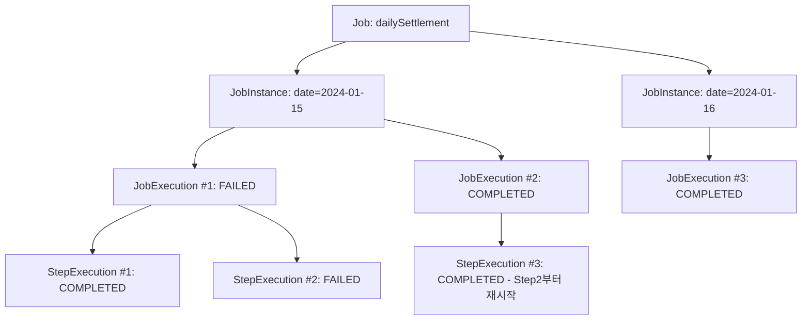
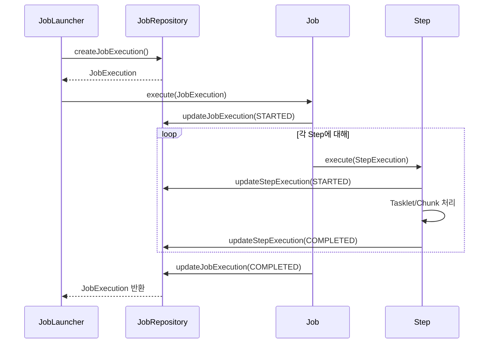

# Spring Batch 기초와 도메인 모델

Spring Batch는 대용량 데이터 처리를 위한 경량 배치 프레임워크다. 이 문서에서는 Spring Batch의 기본 개념과 핵심 도메인 모델(Job, Step, JobInstance, JobExecution, StepExecution)의 관계를 분석한다.

## 목차
- [1. 핵심 개념 (What)](#1-핵심-개념-what)
- [2. 왜 알아야 하는가 (Why)](#2-왜-알아야-하는가-why)
- [3. 내부 구현 분석 (How)](#3-내부-구현-분석-how)
- [4. 실전 예제](#4-실전-예제)
- [5. 정리](#5-정리)

---

## 1. 핵심 개념 (What)

### Spring Batch란?

Spring Batch는 대용량 데이터 처리를 위한 경량 배치 프레임워크다. 로깅, 트랜잭션 관리, 재시작, 건너뛰기, 리소스 관리 등 배치 처리에 필수적인 기능을 제공한다.

**주요 사용 사례:**
- 대량 데이터 ETL (Extract-Transform-Load)
- 정산/결제 처리
- 대용량 파일 처리
- 주기적인 데이터 마이그레이션

Spring Batch는 JSR-352(Java Batch Processing) 표준의 사실상 참조 구현체이며, Spring 생태계의 트랜잭션 관리, DI, AOP 등을 그대로 활용할 수 있다.

### 핵심 도메인 모델

Spring Batch의 도메인 모델은 **Job → Step → (Tasklet 또는 Chunk)** 의 계층 구조로 이루어지며, 각 실행 시도는 별도의 Execution 객체로 추적된다.

| 개념 | 설명 |
|------|------|
| **Job** | 배치 처리의 최상위 단위. 여러 Step으로 구성 |
| **Step** | Job 내의 독립적인 처리 단계 |
| **JobInstance** | Job의 논리적 실행 단위 (Job + JobParameters) |
| **JobExecution** | JobInstance의 실제 실행 시도 |
| **StepExecution** | Step의 실제 실행 시도 |
| **ExecutionContext** | 실행 중 상태를 저장하는 키-값 저장소 |

---

## 2. 왜 알아야 하는가 (Why)

### 배치 처리가 필요한 이유

실무에서는 실시간 API로 처리하기 어려운 대량 작업이 반드시 발생한다.

- **정산**: 수백만 건의 거래 데이터를 집계하여 정산 결과를 생성
- **ETL**: 외부 시스템의 데이터를 추출, 변환하여 내부 DB에 적재
- **리포트**: 일/주/월 단위 통계 데이터 생성
- **데이터 마이그레이션**: 스키마 변경 시 기존 데이터 변환

이런 작업을 단순 스크립트로 구현하면 **재시작 불가**, **실패 지점 추적 불가**, **트랜잭션 관리 부재** 등의 문제가 발생한다.

### 도메인 모델 이해가 중요한 이유

Spring Batch 도메인 모델을 정확히 이해해야 하는 실무적 이유:

1. **JobInstance vs JobExecution 혼동** → 같은 파라미터로 재실행 시 `JobInstanceAlreadyCompleteException` 발생 원인 파악 불가
2. **StepExecution 상태 관리** → 재시작 시 어느 Step부터 다시 실행되는지 이해 필요
3. **ExecutionContext 범위** → Job 레벨과 Step 레벨의 컨텍스트 차이를 모르면 상태 공유에서 버그 발생

---

## 3. 내부 구현 분석 (How)

### 아키텍처 다이어그램

```
┌─────────────────────────────────────────────────────────┐
│                         Job                              │
│  ┌─────────┐   ┌─────────┐   ┌─────────┐               │
│  │  Step1  │──▶│  Step2  │──▶│  Step3  │               │
│  └─────────┘   └─────────┘   └─────────┘               │
└─────────────────────────────────────────────────────────┘
         │                           │
         ▼                           ▼
┌─────────────────┐         ┌─────────────────┐
│  JobExecution   │         │  StepExecution  │
└─────────────────┘         └─────────────────┘
         │                           │
         └───────────┬───────────────┘
                     ▼
            ┌─────────────────┐
            │  JobRepository  │
            └─────────────────┘
```

### Job과 JobInstance의 관계



**핵심 포인트:**
- `JobInstance` = `Job 이름` + `JobParameters`의 고유 조합
- 동일한 `JobInstance`가 COMPLETED 상태이면 같은 파라미터로 재실행 불가
- `JobExecution`은 `JobInstance`의 실제 실행 시도이므로 한 `JobInstance`에 여러 `JobExecution`이 존재할 수 있음

### StepExecution 내부 상태

`StepExecution`은 실행 통계를 상세히 추적한다:

```java
public class StepExecution {
    private BatchStatus status;        // STARTING, STARTED, COMPLETED, FAILED...
    private int readCount;             // 읽은 아이템 수
    private int writeCount;            // 쓴 아이템 수
    private int commitCount;           // 커밋 횟수
    private int rollbackCount;         // 롤백 횟수
    private int readSkipCount;         // 읽기 스킵 횟수
    private int processSkipCount;      // 처리 스킵 횟수
    private int writeSkipCount;        // 쓰기 스킵 횟수
    private int filterCount;           // 필터링된 아이템 수
    private ExecutionContext executionContext;  // 상태 저장소
}
```

### JobLauncher → Job → Step 실행 흐름



### BatchStatus와 ExitStatus의 차이

| 구분 | BatchStatus | ExitStatus |
|------|-------------|------------|
| 역할 | 프레임워크 내부 상태 관리 | 흐름 제어 조건으로 사용 |
| 값 | enum (COMPLETED, FAILED, STOPPED 등) | 자유 문자열 (커스텀 가능) |
| 사용처 | Job/Step 실행 결과 | `on("COMPLETED").to(nextStep)` 분기 조건 |

---

## 4. 실전 예제

### 예제 1: 기본 Job 구성

```java
@Configuration
@EnableBatchProcessing
public class BasicJobConfig {

    @Bean
    public Job dailySettlementJob(JobRepository jobRepository,
                                   Step extractStep,
                                   Step transformStep,
                                   Step loadStep) {
        return new JobBuilder("dailySettlementJob", jobRepository)
                .start(extractStep)
                .next(transformStep)
                .next(loadStep)
                .incrementer(new RunIdIncrementer())
                .build();
    }
}
```

### 예제 2: JobInstance 재실행 방지와 RunIdIncrementer

```java
// RunIdIncrementer 없이 같은 파라미터로 재실행 시
// → JobInstanceAlreadyCompleteException 발생

// RunIdIncrementer를 사용하면 매 실행마다 고유한 run.id 파라미터 추가
@Bean
public Job repeatableJob(JobRepository jobRepository, Step step1) {
    return new JobBuilder("repeatableJob", jobRepository)
            .start(step1)
            .incrementer(new RunIdIncrementer())
            .build();
}

// 커스텀 Incrementer — 날짜 기반
public class DailyJobIncrementer implements JobParametersIncrementer {
    @Override
    public JobParameters getNext(JobParameters parameters) {
        return new JobParametersBuilder(parameters != null ? parameters : new JobParameters())
                .addLocalDate("targetDate", LocalDate.now())
                .toJobParameters();
    }
}
```

### 예제 3: StepExecution 통계 활용

```java
@Component
public class StepExecutionLogger implements StepExecutionListener {

    @Override
    public ExitStatus afterStep(StepExecution stepExecution) {
        log.info("=== Step [{}] 실행 결과 ===", stepExecution.getStepName());
        log.info("  Status: {}", stepExecution.getStatus());
        log.info("  Read Count: {}", stepExecution.getReadCount());
        log.info("  Write Count: {}", stepExecution.getWriteCount());
        log.info("  Skip Count: {}", stepExecution.getSkipCount());
        log.info("  Commit Count: {}", stepExecution.getCommitCount());
        log.info("  Duration: {}ms",
                Duration.between(
                    stepExecution.getStartTime(),
                    stepExecution.getEndTime()
                ).toMillis());
        return stepExecution.getExitStatus();
    }
}
```

### 예제 4: Job 재시작 동작 확인

```java
// Step1: COMPLETED → Step2: FAILED인 경우
// 재시작 시 Step2부터 실행됨 (Step1은 건너뜀)

@Bean
public Step step1(JobRepository jobRepository,
                  PlatformTransactionManager tx) {
    return new StepBuilder("step1", jobRepository)
            .tasklet((contribution, chunkContext) -> {
                log.info("Step1 실행");
                return RepeatStatus.FINISHED;
            }, tx)
            .allowStartIfComplete(false)  // 기본값: 완료된 Step은 재실행 안 함
            .build();
}

@Bean
public Step step2(JobRepository jobRepository,
                  PlatformTransactionManager tx) {
    return new StepBuilder("step2", jobRepository)
            .tasklet((contribution, chunkContext) -> {
                log.info("Step2 실행 - 여기서 실패하면 재시작 시 이 Step부터 다시 실행");
                return RepeatStatus.FINISHED;
            }, tx)
            .startLimit(3)  // 최대 3번까지 재시작 허용
            .build();
}
```

---

## 5. 정리

| 도메인 모델 | 역할 | 핵심 포인트 |
|-------------|------|------------|
| **Job** | 배치 작업의 최상위 컨테이너 | 여러 Step을 조합하여 하나의 배치 작업 정의 |
| **Step** | 실제 처리 로직이 담긴 단위 | Tasklet 또는 Chunk 방식으로 구성 |
| **JobInstance** | Job + JobParameters의 논리적 실행 단위 | 동일 파라미터로 COMPLETED 후 재실행 불가 |
| **JobExecution** | JobInstance의 물리적 실행 시도 | FAILED 시 같은 JobInstance로 재시도 가능 |
| **StepExecution** | Step의 물리적 실행 시도 | readCount, writeCount 등 통계 추적 |
| **ExecutionContext** | 실행 상태를 저장하는 키-값 저장소 | Job/Step 레벨로 분리, 재시작 시 복원됨 |
| **JobRepository** | 모든 메타데이터를 영속화 | BATCH_* 테이블에 상태 저장 |

**기억할 공식:**

```
JobInstance = Job 이름 + JobParameters (논리적 단위)
JobExecution = JobInstance + 실행 시도 (물리적 단위)
재시작 = 같은 JobInstance의 새로운 JobExecution 생성
```

---
*참고: Spring Batch 5.x / Spring Boot 3.x 기준*
