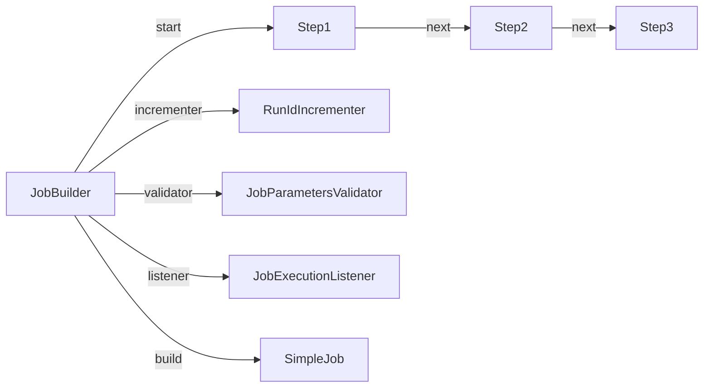
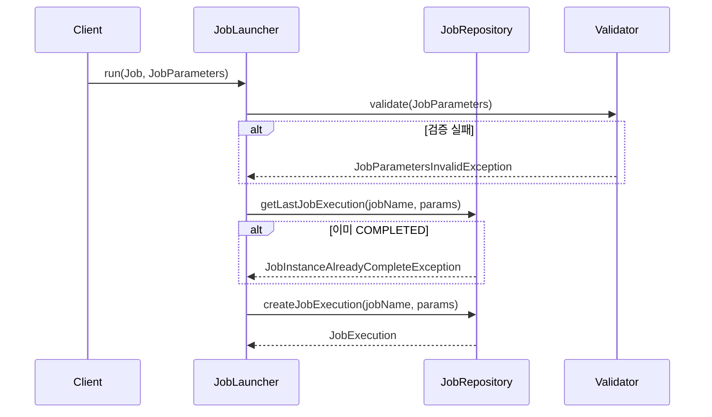
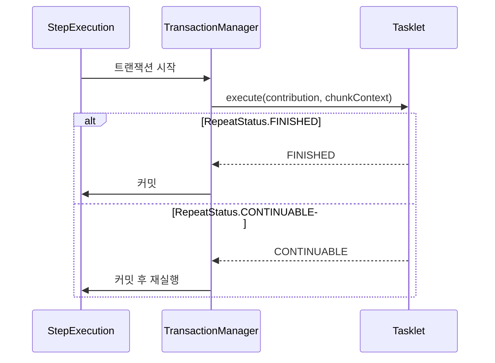

# Job과 Step 구성하기

Spring Batch에서 Job과 Step을 실제로 구성하는 방법을 다룬다. Job 빌더 패턴, JobParameters 활용, Tasklet과 Chunk 기반 Step의 차이를 비교 분석한다.

## 목차
- [1. 핵심 개념 (What)](#1-핵심-개념-what)
- [2. 왜 알아야 하는가 (Why)](#2-왜-알아야-하는가-why)
- [3. 내부 구현 분석 (How)](#3-내부-구현-분석-how)
- [4. 실전 예제](#4-실전-예제)
- [5. 정리](#5-정리)

---

## 1. 핵심 개념 (What)

### Job 구성

Job은 `JobBuilder`를 사용하여 선언적으로 구성한다. Spring Batch 5.x에서는 `@EnableBatchProcessing` 어노테이션과 함께 `JobRepository`를 직접 주입받아 구성하는 방식을 사용한다.

```java
@Configuration
@EnableBatchProcessing
public class BatchConfig {

    @Bean
    public Job sampleJob(JobRepository jobRepository, Step step1, Step step2) {
        return new JobBuilder("sampleJob", jobRepository)
                .start(step1)
                .next(step2)
                .build();
    }
}
```

### Step 구성 방식

Step은 두 가지 방식으로 구성할 수 있다:

| 방식 | 설명 | 적합한 경우 |
|------|------|------------|
| **Tasklet** | 단일 작업을 하나의 메서드에서 처리 | 파일 삭제, 알림 전송 등 단순 작업 |
| **Chunk** | Reader → Processor → Writer 파이프라인 | 대량 데이터 처리 |

---

## 2. 왜 알아야 하는가 (Why)

### Job 구성의 실무적 중요성

1. **JobParameters 검증**: 필수 파라미터 누락 시 런타임에 발견하면 이미 늦다. `JobParametersValidator`로 실행 전 검증 필수
2. **Incrementer 설정**: 동일 파라미터로 재실행이 필요한 경우(개발/테스트) `RunIdIncrementer` 없으면 `JobInstanceAlreadyCompleteException` 발생
3. **Step 선택**: Tasklet과 Chunk의 잘못된 선택은 성능과 유지보수성에 직접 영향

### Tasklet vs Chunk 선택 기준

실무에서 가장 빈번하게 혼동되는 부분이다:

- **파일 정리, 외부 API 호출, 통계 테이블 갱신** → Tasklet
- **CSV 파일 → DB 적재, DB → DB 이관, 대량 데이터 변환** → Chunk

잘못된 선택의 예: 100만 건 데이터 처리를 Tasklet으로 구현하면 메모리 부족(OOM) 위험

---

## 3. 내부 구현 분석 (How)

### Job 빌더 체인 구조



`JobBuilder`는 내부적으로 `SimpleJob`을 생성하며, 다음 설정을 체이닝 방식으로 적용한다:

| 메서드 | 역할 |
|--------|------|
| `start(Step)` | 첫 번째 Step 지정 |
| `next(Step)` | 다음 Step 지정 (순차 실행) |
| `incrementer(JobParametersIncrementer)` | 파라미터 자동 증가 전략 |
| `validator(JobParametersValidator)` | 파라미터 검증 |
| `listener(JobExecutionListener)` | 실행 전/후 콜백 |
| `preventRestart()` | 재시작 비허용 |

### JobParameters 내부 동작



### Tasklet Step 실행 흐름



Tasklet은 `RepeatStatus.FINISHED`를 반환할 때까지 반복 실행된다. `CONTINUABLE`을 반환하면 같은 Tasklet이 다시 호출된다.

### Chunk Step 실행 흐름

```
┌──────────────────────────────────────────────────────────────┐
│                     Chunk 기반 Step                            │
│                                                               │
│   ┌─────────┐      ┌───────────┐      ┌─────────┐           │
│   │ Reader  │─────▶│ Processor │─────▶│ Writer  │           │
│   └─────────┘      └───────────┘      └─────────┘           │
│       │                 │                  │                 │
│       │    chunk-size   │    chunk-size    │                 │
│       │◀───────────────▶│◀────────────────▶│                 │
│       │     (1개씩)      │     (1개씩)       │   (chunk 단위)  │
│                                                               │
│   [트랜잭션 시작] ──────────────────────── [커밋] ────────────│
└──────────────────────────────────────────────────────────────┘
```

**핵심 동작 원리:**
1. Reader가 아이템을 **1개씩** 읽는다
2. Processor가 아이템을 **1개씩** 처리한다
3. chunk-size만큼 모이면 Writer가 **한번에** 쓴다
4. 트랜잭션은 chunk 단위로 커밋된다

---

## 4. 실전 예제

### 예제 1: JobParameters 검증과 활용

```java
@Bean
public Job parameterizedJob(JobRepository jobRepository, Step step1) {
    return new JobBuilder("parameterizedJob", jobRepository)
            .start(step1)
            .incrementer(new RunIdIncrementer())  // 매번 새 인스턴스 생성
            .validator(new DefaultJobParametersValidator(
                    new String[]{"inputFile"},     // 필수 파라미터
                    new String[]{"outputFile"}     // 선택 파라미터
            ))
            .build();
}

// 파라미터 사용
@Bean
@StepScope
public FlatFileItemReader<String> reader(
        @Value("#{jobParameters['inputFile']}") String inputFile) {
    return new FlatFileItemReaderBuilder<String>()
            .name("fileReader")
            .resource(new FileSystemResource(inputFile))
            .lineMapper(new PassThroughLineMapper())
            .build();
}
```

### 예제 2: 커스텀 JobParametersValidator

```java
public class DateRangeValidator implements JobParametersValidator {

    @Override
    public void validate(JobParameters parameters) throws JobParametersInvalidException {
        LocalDate startDate = parameters.getLocalDate("startDate");
        LocalDate endDate = parameters.getLocalDate("endDate");

        if (startDate == null || endDate == null) {
            throw new JobParametersInvalidException(
                "startDate와 endDate는 필수 파라미터입니다.");
        }
        if (startDate.isAfter(endDate)) {
            throw new JobParametersInvalidException(
                "startDate는 endDate보다 이전이어야 합니다.");
        }
        if (ChronoUnit.DAYS.between(startDate, endDate) > 31) {
            throw new JobParametersInvalidException(
                "처리 기간은 최대 31일까지 가능합니다.");
        }
    }
}
```

### 예제 3: Tasklet 기반 Step

단순한 단일 작업에 적합하다.

```java
@Bean
public Step cleanupStep(JobRepository jobRepository,
                        PlatformTransactionManager transactionManager) {
    return new StepBuilder("cleanupStep", jobRepository)
            .tasklet((contribution, chunkContext) -> {
                Files.deleteIfExists(Path.of("/tmp/batch-temp.dat"));
                log.info("임시 파일 정리 완료");
                return RepeatStatus.FINISHED;
            }, transactionManager)
            .build();
}
```

### 예제 4: 반복 실행 Tasklet (CONTINUABLE)

```java
@Bean
public Step pollingStep(JobRepository jobRepository,
                        PlatformTransactionManager transactionManager) {
    return new StepBuilder("pollingStep", jobRepository)
            .tasklet((contribution, chunkContext) -> {
                ExecutionContext ctx = chunkContext.getStepContext()
                        .getStepExecution().getExecutionContext();
                int attempt = ctx.getInt("attempt", 0) + 1;
                ctx.putInt("attempt", attempt);

                boolean ready = externalService.isReady();
                if (ready || attempt >= 10) {
                    log.info("조건 충족 또는 최대 시도 도달 (attempt={})", attempt);
                    return RepeatStatus.FINISHED;
                }

                log.info("아직 준비되지 않음, 재시도... (attempt={})", attempt);
                Thread.sleep(5000);
                return RepeatStatus.CONTINUABLE;
            }, transactionManager)
            .build();
}
```

### 예제 5: Chunk 기반 Step

대량 데이터 처리에 적합하다.

```java
@Bean
public Step chunkStep(JobRepository jobRepository,
                      PlatformTransactionManager transactionManager,
                      ItemReader<Input> reader,
                      ItemProcessor<Input, Output> processor,
                      ItemWriter<Output> writer) {
    return new StepBuilder("chunkStep", jobRepository)
            .<Input, Output>chunk(100, transactionManager)  // 100개씩 처리
            .reader(reader)
            .processor(processor)
            .writer(writer)
            .build();
}
```

### 예제 6: 완전한 Job 구성 (Tasklet + Chunk 혼합)

```java
@Configuration
public class SettlementJobConfig {

    @Bean
    public Job settlementJob(JobRepository jobRepository,
                              Step initStep,
                              Step processStep,
                              Step reportStep,
                              Step cleanupStep) {
        return new JobBuilder("settlementJob", jobRepository)
                .start(initStep)          // Tasklet: 초기화
                .next(processStep)        // Chunk: 대량 데이터 처리
                .next(reportStep)         // Chunk: 리포트 생성
                .next(cleanupStep)        // Tasklet: 정리
                .incrementer(new RunIdIncrementer())
                .listener(new JobCompletionNotificationListener())
                .build();
    }

    // Step 1: 초기화 (Tasklet)
    @Bean
    public Step initStep(JobRepository jobRepository,
                          PlatformTransactionManager tx) {
        return new StepBuilder("initStep", jobRepository)
                .tasklet((contribution, chunkContext) -> {
                    log.info("정산 배치 초기화 시작");
                    // 임시 테이블 생성, 이전 데이터 정리 등
                    return RepeatStatus.FINISHED;
                }, tx)
                .build();
    }

    // Step 2: 대량 데이터 처리 (Chunk)
    @Bean
    public Step processStep(JobRepository jobRepository,
                             PlatformTransactionManager tx,
                             ItemReader<Transaction> reader,
                             ItemProcessor<Transaction, Settlement> processor,
                             ItemWriter<Settlement> writer) {
        return new StepBuilder("processStep", jobRepository)
                .<Transaction, Settlement>chunk(500, tx)
                .reader(reader)
                .processor(processor)
                .writer(writer)
                .build();
    }

    // Step 4: 정리 (Tasklet)
    @Bean
    public Step cleanupStep(JobRepository jobRepository,
                             PlatformTransactionManager tx) {
        return new StepBuilder("cleanupStep", jobRepository)
                .tasklet((contribution, chunkContext) -> {
                    log.info("임시 데이터 정리 완료");
                    return RepeatStatus.FINISHED;
                }, tx)
                .build();
    }
}
```

---

## 5. 정리

### Tasklet vs Chunk 비교

| 기준 | Tasklet | Chunk |
|------|---------|-------|
| **처리 방식** | 단일 메서드에서 모든 로직 처리 | Reader → Processor → Writer 파이프라인 |
| **트랜잭션** | Tasklet 실행 단위 | chunk-size 단위 |
| **재시작** | 처음부터 다시 실행 | 마지막 커밋 지점부터 재개 |
| **메모리** | 전체 데이터를 직접 관리 | chunk 단위로 메모리 사용 |
| **적합한 경우** | 파일 정리, API 호출, 통계 갱신 | 대량 데이터 ETL, 이관, 변환 |
| **코드 재사용** | 낮음 (일체형) | 높음 (Reader/Writer 교체 가능) |

### Job 구성 시 체크리스트

| 항목 | 설정 | 비고 |
|------|------|------|
| `incrementer` | 재실행 필요 시 `RunIdIncrementer` | 개발/테스트 환경에서 필수 |
| `validator` | 필수 파라미터 검증 | `DefaultJobParametersValidator` 또는 커스텀 |
| `preventRestart` | 재시작 비허용 시 설정 | 멱등하지 않은 작업에 적용 |
| `listener` | Job 시작/종료 시 로깅, 알림 | `JobExecutionListener` 구현 |

---
*참고: Spring Batch 5.x / Spring Boot 3.x 기준*
