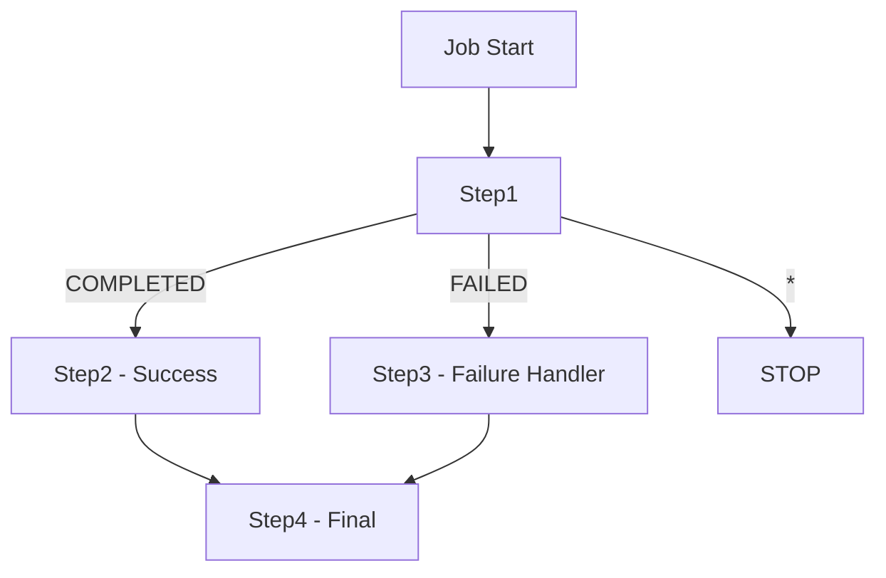
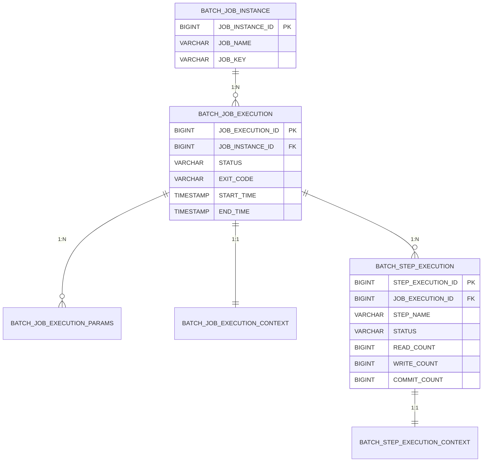

# 실행 흐름과 JobRepository

Spring Batch의 실행 흐름 제어(순차, 조건부, 커스텀 분기)와 JobRepository의 메타데이터 테이블 구조, 그리고 다양한 Job 실행 방법을 분석한다.

## 목차
- [1. 핵심 개념 (What)](#1-핵심-개념-what)
- [2. 왜 알아야 하는가 (Why)](#2-왜-알아야-하는가-why)
- [3. 내부 구현 분석 (How)](#3-내부-구현-분석-how)
- [4. 실전 예제](#4-실전-예제)
- [5. 정리](#5-정리)

---

## 1. 핵심 개념 (What)

### 실행 흐름 제어

Spring Batch Job은 여러 Step을 다양한 방식으로 조합할 수 있다:

| 제어 방식 | 설명 |
|-----------|------|
| **순차 실행** | Step을 순서대로 실행 (`start().next().next()`) |
| **조건부 실행** | Step의 ExitStatus에 따라 분기 (`on().to()`) |
| **커스텀 분기** | 커스텀 ExitStatus로 복잡한 분기 처리 |

### JobRepository

JobRepository는 Spring Batch의 실행 상태를 영속화하는 핵심 인프라 컴포넌트다. 모든 Job/Step의 실행 이력, 파라미터, ExecutionContext를 RDBMS의 메타데이터 테이블에 저장한다.

### Job 실행 방법

| 방법 | 설명 |
|------|------|
| **CommandLineJobRunner** | CLI에서 직접 실행 |
| **JobLauncher** | 프로그래밍 방식으로 실행 |
| **스케줄러 연동** | `@Scheduled`와 결합하여 주기적 실행 |

---

## 2. 왜 알아야 하는가 (Why)

### 실행 흐름 제어의 실무적 중요성

실제 배치 작업은 단순 순차 실행만으로 해결되지 않는다:

1. **데이터 검증 후 분기**: 데이터 품질 검사 Step이 실패하면 보정 Step으로 이동, 성공하면 본 처리 Step으로 이동
2. **데이터 크기에 따른 전략 변경**: 소량이면 단일 쓰레드, 대량이면 멀티쓰레드 처리
3. **실패 후 보상 로직**: 메인 Step 실패 시 알림 전송 Step으로 이동

### JobRepository를 이해해야 하는 이유

1. **메타데이터 테이블 장애**: 테이블 공간 부족, 커넥션 풀 고갈 등이 배치 전체 장애로 이어짐
2. **재시작 메커니즘**: JobRepository에 저장된 상태를 기반으로 재시작 지점을 결정하므로, 테이블 데이터 임의 삭제 시 재시작 불가
3. **운영 모니터링**: 메타데이터 테이블 조회로 배치 실행 이력, 성능 추이 확인 가능

---

## 3. 내부 구현 분석 (How)

### 실행 흐름 제어 구조



### 순차 실행

```java
@Bean
public Job sequentialJob(JobRepository jobRepository,
                         Step step1, Step step2, Step step3) {
    return new JobBuilder("sequentialJob", jobRepository)
            .start(step1)
            .next(step2)
            .next(step3)
            .build();
}
```

### 조건부 실행

```java
@Bean
public Job conditionalJob(JobRepository jobRepository,
                          Step step1, Step successStep, Step failStep) {
    return new JobBuilder("conditionalJob", jobRepository)
            .start(step1)
                .on("COMPLETED").to(successStep)  // 성공 시
                .from(step1)
                .on("FAILED").to(failStep)        // 실패 시
                .from(step1)
                .on("*").stop()                   // 그 외 중단
            .end()
            .build();
}
```

### 커스텀 ExitStatus로 분기

```java
@Bean
public Step decisionStep(JobRepository jobRepository,
                         PlatformTransactionManager transactionManager) {
    return new StepBuilder("decisionStep", jobRepository)
            .tasklet((contribution, chunkContext) -> {
                int count = getRecordCount();
                if (count > 1000) {
                    contribution.setExitStatus(new ExitStatus("LARGE_DATASET"));
                } else {
                    contribution.setExitStatus(new ExitStatus("SMALL_DATASET"));
                }
                return RepeatStatus.FINISHED;
            }, transactionManager)
            .build();
}

@Bean
public Job branchingJob(JobRepository jobRepository,
                        Step decisionStep, Step largeStep, Step smallStep) {
    return new JobBuilder("branchingJob", jobRepository)
            .start(decisionStep)
                .on("LARGE_DATASET").to(largeStep)
                .from(decisionStep)
                .on("SMALL_DATASET").to(smallStep)
            .end()
            .build();
}
```

### 조건부 분기의 ExitStatus 패턴 매칭

`on()` 메서드는 와일드카드 패턴을 지원한다:

| 패턴 | 의미 |
|------|------|
| `"COMPLETED"` | 정확히 COMPLETED인 경우 |
| `"FAILED"` | 정확히 FAILED인 경우 |
| `"*"` | 모든 ExitStatus (catch-all) |
| `"COMPLETED*"` | COMPLETED로 시작하는 모든 값 |

**주의:** `on()` 에서 사용하는 값은 `BatchStatus`가 아니라 `ExitStatus`의 문자열 값이다.

### 메타데이터 테이블 구조

Spring Batch는 실행 상태를 다음 테이블에 저장한다:



| 테이블명 | 설명 |
|---------|------|
| BATCH_JOB_INSTANCE | Job 인스턴스 정보 |
| BATCH_JOB_EXECUTION | Job 실행 이력 |
| BATCH_JOB_EXECUTION_PARAMS | Job 파라미터 |
| BATCH_JOB_EXECUTION_CONTEXT | Job ExecutionContext |
| BATCH_STEP_EXECUTION | Step 실행 이력 |
| BATCH_STEP_EXECUTION_CONTEXT | Step ExecutionContext |

### JobRepository 설정

```java
@Configuration
public class BatchInfraConfig {

    @Bean
    public JobRepository jobRepository(DataSource dataSource,
                                        PlatformTransactionManager transactionManager)
            throws Exception {
        JobRepositoryFactoryBean factory = new JobRepositoryFactoryBean();
        factory.setDataSource(dataSource);
        factory.setTransactionManager(transactionManager);
        factory.setDatabaseType("MYSQL");
        factory.setTablePrefix("BATCH_");
        factory.setIsolationLevelForCreate("ISOLATION_SERIALIZABLE");
        factory.afterPropertiesSet();
        return factory.getObject();
    }
}
```

**주요 설정 항목:**

| 설정 | 설명 | 기본값 |
|------|------|--------|
| `databaseType` | DB 종류 (MYSQL, POSTGRES, H2 등) | 자동 감지 |
| `tablePrefix` | 테이블명 접두사 | `BATCH_` |
| `isolationLevelForCreate` | JobExecution 생성 시 격리 수준 | `SERIALIZABLE` |
| `maxVarCharLength` | VARCHAR 컬럼 최대 길이 | 2500 |

---

## 4. 실전 예제

### 예제 1: CommandLineJobRunner

```bash
java -jar my-batch.jar \
  --spring.batch.job.name=sampleJob \
  inputFile=/data/input.csv \
  date=2024-01-15
```

### 예제 2: JobLauncher를 통한 프로그래밍 방식

```java
@Service
@RequiredArgsConstructor
public class BatchJobService {

    private final JobLauncher jobLauncher;
    private final Job sampleJob;

    public void runJob(String inputFile) throws Exception {
        JobParameters params = new JobParametersBuilder()
                .addString("inputFile", inputFile)
                .addLocalDateTime("runTime", LocalDateTime.now())
                .toJobParameters();

        JobExecution execution = jobLauncher.run(sampleJob, params);
        log.info("Job 실행 결과: {}", execution.getStatus());
    }
}
```

### 예제 3: 스케줄러 연동

```java
@Component
@RequiredArgsConstructor
public class BatchScheduler {

    private final JobLauncher jobLauncher;
    private final Job dailyJob;

    @Scheduled(cron = "0 0 2 * * *")  // 매일 새벽 2시
    public void runDailyBatch() {
        try {
            JobParameters params = new JobParametersBuilder()
                    .addLocalDateTime("scheduledTime", LocalDateTime.now())
                    .toJobParameters();
            jobLauncher.run(dailyJob, params);
        } catch (Exception e) {
            log.error("스케줄된 배치 실패", e);
        }
    }
}
```

### 예제 4: REST API로 Job 실행

```java
@RestController
@RequiredArgsConstructor
@RequestMapping("/api/batch")
public class BatchController {

    private final JobLauncher jobLauncher;
    private final Job settlementJob;

    @PostMapping("/settlement")
    public ResponseEntity<String> runSettlement(
            @RequestParam String targetDate) {
        try {
            JobParameters params = new JobParametersBuilder()
                    .addString("targetDate", targetDate)
                    .addLocalDateTime("requestTime", LocalDateTime.now())
                    .toJobParameters();

            JobExecution execution = jobLauncher.run(settlementJob, params);
            return ResponseEntity.ok("Job 시작됨: " + execution.getId());
        } catch (JobInstanceAlreadyCompleteException e) {
            return ResponseEntity.status(HttpStatus.CONFLICT)
                    .body("이미 완료된 Job입니다: " + targetDate);
        } catch (Exception e) {
            return ResponseEntity.internalServerError()
                    .body("Job 실행 실패: " + e.getMessage());
        }
    }
}
```

### 예제 5: 복합 실행 흐름 (검증 → 분기 → 알림)

```java
@Configuration
public class ComplexFlowJobConfig {

    @Bean
    public Job dataProcessingJob(JobRepository jobRepository,
                                  Step validateStep,
                                  Step processLargeStep,
                                  Step processSmallStep,
                                  Step notifyStep,
                                  Step errorStep) {
        return new JobBuilder("dataProcessingJob", jobRepository)
                // 1단계: 데이터 검증
                .start(validateStep)
                    .on("LARGE_DATASET").to(processLargeStep)
                        .on("*").to(notifyStep)
                    .from(validateStep)
                    .on("SMALL_DATASET").to(processSmallStep)
                        .on("*").to(notifyStep)
                    .from(validateStep)
                    .on("FAILED").to(errorStep)
                .end()
                .build();
    }

    @Bean
    public Step validateStep(JobRepository jobRepository,
                              PlatformTransactionManager tx) {
        return new StepBuilder("validateStep", jobRepository)
                .tasklet((contribution, chunkContext) -> {
                    long count = dataRepository.countPendingRecords();
                    log.info("처리 대상 건수: {}", count);

                    if (count == 0) {
                        contribution.setExitStatus(new ExitStatus("FAILED"));
                    } else if (count > 10000) {
                        contribution.setExitStatus(new ExitStatus("LARGE_DATASET"));
                    } else {
                        contribution.setExitStatus(new ExitStatus("SMALL_DATASET"));
                    }
                    return RepeatStatus.FINISHED;
                }, tx)
                .build();
    }
}
```

### 예제 6: 메타데이터 조회 쿼리

운영 중 배치 실행 이력을 확인할 때 유용한 SQL 쿼리:

```sql
-- 최근 실패한 Job 조회
SELECT ji.JOB_NAME, je.START_TIME, je.END_TIME, je.STATUS, je.EXIT_CODE
FROM BATCH_JOB_EXECUTION je
JOIN BATCH_JOB_INSTANCE ji ON je.JOB_INSTANCE_ID = ji.JOB_INSTANCE_ID
WHERE je.STATUS = 'FAILED'
ORDER BY je.START_TIME DESC
LIMIT 10;

-- 특정 Job의 Step별 처리 건수 확인
SELECT se.STEP_NAME, se.STATUS,
       se.READ_COUNT, se.WRITE_COUNT,
       se.COMMIT_COUNT, se.ROLLBACK_COUNT,
       se.READ_SKIP_COUNT + se.PROCESS_SKIP_COUNT + se.WRITE_SKIP_COUNT AS TOTAL_SKIP
FROM BATCH_STEP_EXECUTION se
JOIN BATCH_JOB_EXECUTION je ON se.JOB_EXECUTION_ID = je.JOB_EXECUTION_ID
WHERE je.JOB_EXECUTION_ID = :executionId
ORDER BY se.STEP_EXECUTION_ID;

-- 메타데이터 테이블 정리 (30일 이상 된 데이터)
DELETE FROM BATCH_STEP_EXECUTION_CONTEXT
WHERE STEP_EXECUTION_ID IN (
    SELECT se.STEP_EXECUTION_ID
    FROM BATCH_STEP_EXECUTION se
    JOIN BATCH_JOB_EXECUTION je ON se.JOB_EXECUTION_ID = je.JOB_EXECUTION_ID
    WHERE je.END_TIME < DATE_SUB(NOW(), INTERVAL 30 DAY)
);
```

---

## 5. 정리

### 실행 흐름 제어 요약

| 방식 | 코드 패턴 | 사용 시점 |
|------|-----------|-----------|
| 순차 실행 | `.start(A).next(B).next(C)` | 단순 파이프라인 |
| 조건부 실행 | `.on("COMPLETED").to(B).from(A).on("FAILED").to(C)` | 성공/실패 분기 |
| 커스텀 분기 | `contribution.setExitStatus(new ExitStatus("CUSTOM"))` | 비즈니스 로직 기반 분기 |
| 중단 | `.on("*").stop()` | 특정 조건에서 Job 중단 |

### Job 실행 방법 비교

| 방법 | 장점 | 적합한 환경 |
|------|------|------------|
| CommandLineJobRunner | 단순, CI/CD 파이프라인 연동 | 배치 서버, 크론잡 |
| JobLauncher (동기) | 실행 결과 즉시 확인 | 관리 API, 테스트 |
| @Scheduled | Spring 내장 스케줄러 | 단순 주기 실행 |
| REST API | 외부 시스템 연동 용이 | 운영 대시보드, Jenkins |

### JobRepository 메타데이터 테이블 관리 포인트

| 항목 | 권장사항 |
|------|---------|
| 테이블 정리 | 주기적으로 오래된 실행 이력 삭제 (30~90일) |
| 인덱스 | JOB_INSTANCE_ID, JOB_EXECUTION_ID 기반 조회 최적화 |
| 모니터링 | BATCH_JOB_EXECUTION 테이블의 STATUS 컬럼 기반 알림 설정 |
| 격리 수준 | 동시 실행 시 SERIALIZABLE 유지 (기본값) |

---
*참고: Spring Batch 5.x / Spring Boot 3.x 기준*
