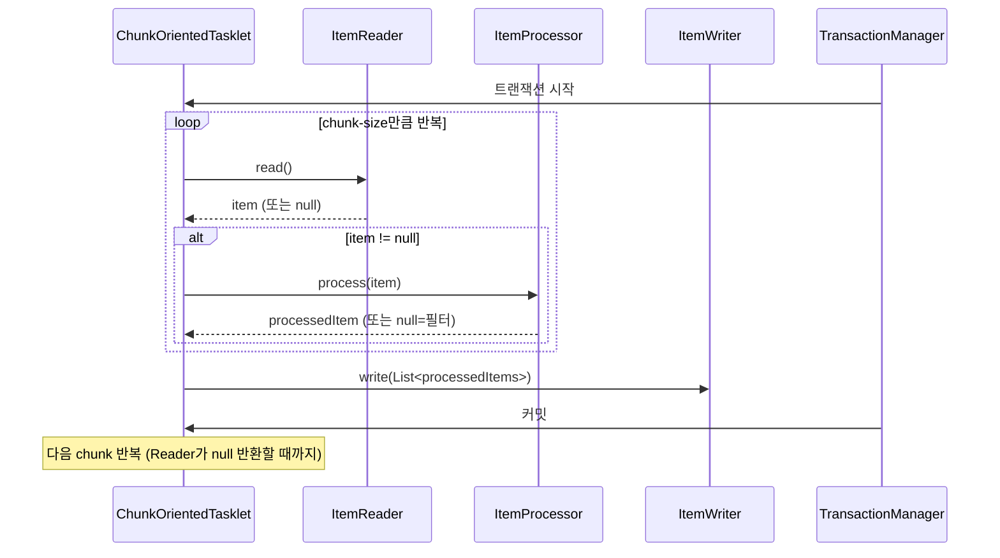
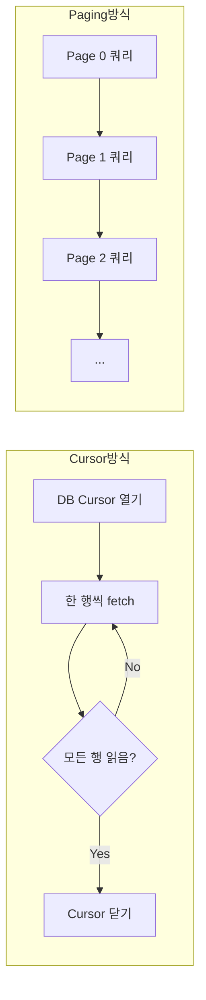
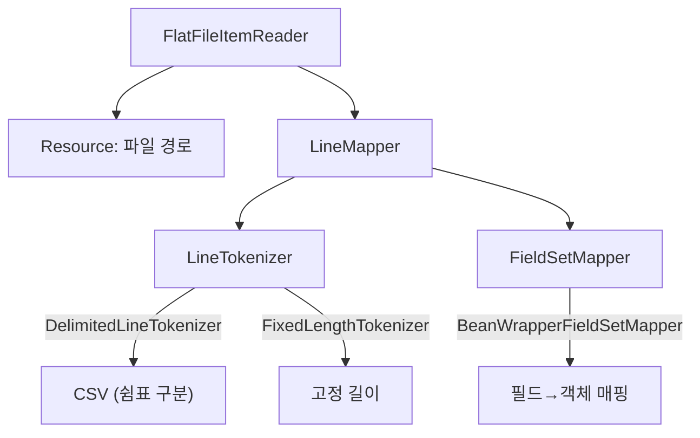

# Chunk 처리 개념과 ItemReader

Spring Batch의 Chunk 처리 모델과 다양한 ItemReader 구현체를 분석한다. FlatFileItemReader, JdbcCursorItemReader, JdbcPagingItemReader, JpaPagingItemReader의 특성과 선택 기준을 다룬다.

## 목차
- [1. 핵심 개념 (What)](#1-핵심-개념-what)
- [2. 왜 알아야 하는가 (Why)](#2-왜-알아야-하는가-why)
- [3. 내부 구현 분석 (How)](#3-내부-구현-분석-how)
- [4. 실전 예제](#4-실전-예제)
- [5. 정리](#5-정리)

---

## 1. 핵심 개념 (What)

### Chunk 처리 모델

Chunk 처리는 데이터를 일정 단위(chunk)로 나누어 처리하는 방식이다. Reader → Processor → Writer 파이프라인으로 구성되며, chunk-size 단위로 트랜잭션이 커밋된다.

```
┌──────────────────────────────────────────────────────────────┐
│                      Chunk Processing                         │
│                                                               │
│   ┌─────────┐      ┌───────────┐      ┌─────────┐           │
│   │ Reader  │─────▶│ Processor │─────▶│ Writer  │           │
│   └─────────┘      └───────────┘      └─────────┘           │
│       │                 │                  │                 │
│       │    chunk-size   │    chunk-size    │                 │
│       │◀───────────────▶│◀────────────────▶│                 │
│       │     (1개씩)      │     (1개씩)       │   (chunk 단위)  │
│                                                               │
│   [트랜잭션 시작] ──────────────────────── [커밋] ────────────│
└──────────────────────────────────────────────────────────────┘
```

### ItemReader 인터페이스

`ItemReader<T>`는 데이터 소스에서 아이템을 하나씩 읽어오는 역할을 한다.

```java
public interface ItemReader<T> {
    T read() throws Exception, UnexpectedInputException,
                    ParseException, NonTransientResourceException;
}
```

**핵심 규약:** `null`을 반환하면 더 이상 읽을 데이터가 없다는 의미로, 읽기가 종료된다.

### 주요 ItemReader 구현체

| 구현체 | 데이터 소스 | 특징 |
|--------|------------|------|
| `FlatFileItemReader` | CSV, 고정길이 파일 | 파일 기반 입력 |
| `JdbcCursorItemReader` | JDBC (Cursor) | DB 커서 기반, 단방향 순회 |
| `JdbcPagingItemReader` | JDBC (Paging) | 페이징 쿼리, 멀티쓰레드 안전 |
| `JpaPagingItemReader` | JPA | JPA 엔티티 기반 페이징 |
| `RepositoryItemReader` | Spring Data | Repository 메서드 활용 |

---

## 2. 왜 알아야 하는가 (Why)

### Chunk Size 선택의 중요성

Chunk Size는 성능과 안정성에 직접 영향을 미친다:

| Chunk Size | 적합한 상황 |
|------------|------------|
| 10~50 | 개별 아이템 처리 시간이 긴 경우 |
| 100~500 | 일반적인 데이터 처리 |
| 1000+ | 단순 데이터 이관, I/O 최적화 필요 시 |

- **너무 작으면**: 커밋 횟수 증가 → DB 부하, 처리 시간 증가
- **너무 크면**: 메모리 사용량 증가, 롤백 시 재처리 범위 증가

### ItemReader 선택이 중요한 이유

1. **Cursor vs Paging**: Cursor는 DB 커넥션을 오래 점유하지만 정렬 불필요. Paging은 커넥션 효율적이지만 정렬 키 필수
2. **멀티쓰레드 환경**: `JdbcCursorItemReader`는 thread-safe하지 않지만, `JdbcPagingItemReader`는 thread-safe
3. **메모리 관리**: JPA Reader는 영속성 컨텍스트 관리에 주의 필요

---

## 3. 내부 구현 분석 (How)

### Chunk 처리 내부 흐름



**동작 순서:**
1. 트랜잭션을 시작한다
2. Reader가 아이템을 1개씩 읽어 chunk-size 만큼 모은다
3. 모인 아이템을 Processor에 1개씩 전달하여 변환한다
4. 변환된 아이템 리스트를 Writer에 한번에 전달한다
5. 트랜잭션을 커밋한다
6. Reader가 `null`을 반환할 때까지 반복한다

### Cursor 방식 vs Paging 방식



| 특성 | Cursor | Paging |
|------|--------|--------|
| DB 커넥션 | 전체 처리 동안 유지 | 페이지별 획득/반납 |
| 정렬 필요 | 불필요 | 필수 (sortKeys 지정) |
| 멀티쓰레드 | 불가 (thread-unsafe) | 가능 (thread-safe) |
| 네트워크 호출 | 1번 (커서 열기) | 페이지 수만큼 |
| 메모리 | 1개 행만 유지 | 1페이지 데이터 유지 |
| 적합한 경우 | 순차 처리, 소~중 규모 | 대용량, 멀티쓰레드 처리 |

### FlatFileItemReader 내부 구조



---

## 4. 실전 예제

### 예제 1: FlatFileItemReader (CSV 파일)

```java
@Bean
public FlatFileItemReader<Customer> fileReader() {
    return new FlatFileItemReaderBuilder<Customer>()
            .name("customerReader")
            .resource(new ClassPathResource("customers.csv"))
            .linesToSkip(1)  // 헤더 스킵
            .delimited()
            .delimiter(",")
            .names("id", "name", "email", "age")
            .targetType(Customer.class)
            .build();
}
```

### 예제 2: FlatFileItemReader (고정 길이 파일)

```java
@Bean
public FlatFileItemReader<Customer> fixedLengthReader() {
    return new FlatFileItemReaderBuilder<Customer>()
            .name("fixedLengthReader")
            .resource(new ClassPathResource("customers.dat"))
            .fixedLength()
            .columns(new Range(1, 10), new Range(11, 30), new Range(31, 50))
            .names("id", "name", "email")
            .targetType(Customer.class)
            .build();
}
```

### 예제 3: JdbcCursorItemReader

```java
@Bean
public JdbcCursorItemReader<Customer> cursorReader(DataSource dataSource) {
    return new JdbcCursorItemReaderBuilder<Customer>()
            .name("customerCursorReader")
            .dataSource(dataSource)
            .sql("SELECT id, name, email, age FROM customers WHERE status = ?")
            .preparedStatementSetter(ps -> ps.setString(1, "ACTIVE"))
            .rowMapper((rs, rowNum) -> Customer.builder()
                    .id(rs.getLong("id"))
                    .name(rs.getString("name"))
                    .email(rs.getString("email"))
                    .age(rs.getInt("age"))
                    .build())
            .build();
}
```

### 예제 4: JdbcPagingItemReader

대용량 데이터 처리에 적합하다. 메모리 효율적.

```java
@Bean
public JdbcPagingItemReader<Customer> pagingReader(DataSource dataSource) {
    Map<String, Order> sortKeys = new HashMap<>();
    sortKeys.put("id", Order.ASCENDING);

    return new JdbcPagingItemReaderBuilder<Customer>()
            .name("customerPagingReader")
            .dataSource(dataSource)
            .selectClause("SELECT id, name, email, age")
            .fromClause("FROM customers")
            .whereClause("WHERE status = :status")
            .parameterValues(Map.of("status", "ACTIVE"))
            .sortKeys(sortKeys)
            .pageSize(100)
            .rowMapper(new BeanPropertyRowMapper<>(Customer.class))
            .build();
}
```

### 예제 5: JpaPagingItemReader

```java
@Bean
public JpaPagingItemReader<Customer> jpaReader(EntityManagerFactory emf) {
    return new JpaPagingItemReaderBuilder<Customer>()
            .name("customerJpaReader")
            .entityManagerFactory(emf)
            .queryString("SELECT c FROM Customer c WHERE c.status = :status")
            .parameterValues(Map.of("status", Status.ACTIVE))
            .pageSize(100)
            .build();
}

// Spring Data Repository 사용 시
@Bean
public RepositoryItemReader<Customer> repositoryReader(CustomerRepository repository) {
    return new RepositoryItemReaderBuilder<Customer>()
            .name("repositoryReader")
            .repository(repository)
            .methodName("findByStatus")
            .arguments(Status.ACTIVE)
            .pageSize(100)
            .sorts(Map.of("id", Sort.Direction.ASC))
            .build();
}
```

### 예제 6: 커스텀 ItemReader

```java
@Component
public class ApiItemReader implements ItemReader<ApiData> {

    private final ApiClient apiClient;
    private Iterator<ApiData> dataIterator;
    private boolean initialized = false;

    @Override
    public ApiData read() {
        if (!initialized) {
            List<ApiData> data = apiClient.fetchAll();
            dataIterator = data.iterator();
            initialized = true;
        }

        if (dataIterator.hasNext()) {
            return dataIterator.next();
        }
        return null;  // null 반환 시 읽기 종료
    }
}
```

### 예제 7: @StepScope로 Late Binding

```java
@Bean
@StepScope
public FlatFileItemReader<Customer> scopedReader(
        @Value("#{jobParameters['inputFile']}") String inputFile,
        @Value("#{stepExecutionContext['minId']}") Long minId) {

    return new FlatFileItemReaderBuilder<Customer>()
            .name("scopedReader")
            .resource(new FileSystemResource(inputFile))
            .delimited()
            .names("id", "name", "email")
            .targetType(Customer.class)
            .build();
}
```

### 예제 8: 멀티쓰레드 환경에서 안전한 Reader 선택

```java
@Bean
public Step multiThreadedStep(JobRepository jobRepository,
                               PlatformTransactionManager tx,
                               JdbcPagingItemReader<Customer> reader,
                               ItemProcessor<Customer, CustomerDto> processor,
                               ItemWriter<CustomerDto> writer) {
    return new StepBuilder("multiThreadedStep", jobRepository)
            .<Customer, CustomerDto>chunk(100, tx)
            .reader(reader)       // PagingItemReader는 thread-safe
            .processor(processor)
            .writer(writer)
            .taskExecutor(new SimpleAsyncTaskExecutor())
            .throttleLimit(4)     // 최대 4개 쓰레드
            .build();
}

// 주의: CursorItemReader를 멀티쓰레드에서 사용하려면 SynchronizedItemStreamReader 필요
@Bean
public SynchronizedItemStreamReader<Customer> synchronizedReader(
        JdbcCursorItemReader<Customer> cursorReader) {
    SynchronizedItemStreamReader<Customer> reader = new SynchronizedItemStreamReader<>();
    reader.setDelegate(cursorReader);
    return reader;
}
```

---

## 5. 정리

### ItemReader 구현체 선택 가이드

| 구현체 | 데이터 소스 | Thread-Safe | 정렬 필요 | 메모리 효율 | 권장 데이터 규모 |
|--------|------------|:-----------:|:---------:|:-----------:|:---------------:|
| `FlatFileItemReader` | CSV/고정길이 파일 | X | - | 좋음 | 소~대 |
| `JdbcCursorItemReader` | JDBC | X | X | 매우 좋음 | 소~중 |
| `JdbcPagingItemReader` | JDBC | O | O | 좋음 | 중~대 |
| `JpaPagingItemReader` | JPA | O | O | 보통 | 중~대 |
| `RepositoryItemReader` | Spring Data | O | O | 보통 | 중~대 |
| 커스텀 `ItemReader` | API, NoSQL 등 | 구현에 따라 | - | 구현에 따라 | - |

### Chunk Size 선택 기준

| Chunk Size | 적합한 상황 | 트레이드오프 |
|:----------:|------------|-------------|
| 10~50 | 아이템 처리 시간이 긴 경우 | 커밋 빈번, 롤백 범위 작음 |
| 100~500 | 일반적인 데이터 처리 | 균형 잡힌 성능 |
| 1000+ | 단순 데이터 이관, I/O 최적화 | 메모리 사용 높음, 롤백 비용 큼 |

### 핵심 규칙

```
1. ItemReader.read()가 null을 반환하면 읽기 종료
2. Cursor = DB 커넥션 장시간 점유, Paging = 쿼리 반복 실행
3. 멀티쓰레드 → JdbcPagingItemReader (또는 SynchronizedItemStreamReader)
4. chunk-size = pageSize로 맞추는 것이 일반적
5. @StepScope는 JobParameters/ExecutionContext의 Late Binding에 필수
```

---
*참고: Spring Batch 5.x / Spring Boot 3.x 기준*
