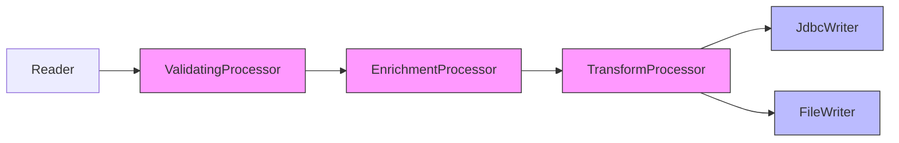

# ItemProcessor와 ItemWriter

Spring Batch에서 데이터를 변환/필터링하는 ItemProcessor와 처리된 데이터를 출력하는 ItemWriter의 구조, 주요 구현체, 그리고 실전 활용 패턴을 다룬다.

## 목차
- [1. 핵심 개념 (What)](#1-핵심-개념-what)
- [2. 왜 알아야 하는가 (Why)](#2-왜-알아야-하는가-why)
- [3. 내부 구현 분석 (How)](#3-내부-구현-분석-how)
- [4. 실전 예제](#4-실전-예제)
- [5. 정리](#5-정리)

---

## 1. 핵심 개념 (What)

### ItemProcessor

`ItemProcessor<I, O>`는 Reader가 읽어온 데이터(I)를 변환하여 Writer에 전달할 데이터(O)로 만드는 컴포넌트다. 단순 변환뿐 아니라 **필터링** 기능도 수행한다 -- `null`을 반환하면 해당 아이템은 Writer로 전달되지 않는다.

```
Reader ──▶ ItemProcessor ──▶ Writer
  (I)         I → O           (O)
              null → 필터링
```

### ItemWriter

`ItemWriter<T>`는 처리된 데이터를 최종 목적지에 출력하는 컴포넌트다. Reader/Processor와 달리 **Chunk 단위(List)**로 호출되므로, 벌크 연산에 최적화되어 있다.

```java
public interface ItemWriter<T> {
    void write(Chunk<? extends T> items) throws Exception;
}
```

---

## 2. 왜 알아야 하는가 (Why)

배치 처리에서 "읽기 → 변환 → 쓰기" 파이프라인의 핵심 축을 담당하는 컴포넌트들이다.

- **비즈니스 로직 분리**: Reader는 데이터 소스, Writer는 출력 대상에만 집중하고, 변환/검증/필터링 로직은 Processor에 격리할 수 있다
- **재사용성**: CompositeItemProcessor로 작은 Processor를 조합하면 단일 책임 원칙을 지키면서 복잡한 변환 파이프라인을 구성할 수 있다
- **다중 출력**: CompositeItemWriter를 통해 하나의 Step에서 DB 저장, 파일 출력, 메시지 전송 등을 동시에 수행할 수 있다
- **조건부 처리**: ClassifierComposite 패턴으로 데이터 특성에 따라 다른 처리/출력 전략을 적용할 수 있다

---

## 3. 내부 구현 분석 (How)

### 3.1 ItemProcessor 구현체 계층

```
ItemProcessor<I, O> (함수형 인터페이스)
├── ValidatingItemProcessor<T>        -- 유효성 검사
├── CompositeItemProcessor<I, O>      -- 순차 체이닝
└── ClassifierCompositeItemProcessor  -- 조건부 분기
```

#### 기본 Processor (Lambda)

`ItemProcessor`는 함수형 인터페이스이므로 Lambda로 간결하게 구현할 수 있다.

```java
@Bean
public ItemProcessor<Customer, CustomerDto> processor() {
    return customer -> {
        // null 반환 시 해당 아이템 필터링 (Writer로 전달 안 됨)
        if (!customer.isActive()) {
            return null;
        }

        return CustomerDto.builder()
                .id(customer.getId())
                .fullName(customer.getFirstName() + " " + customer.getLastName())
                .email(customer.getEmail().toLowerCase())
                .build();
    };
}
```

#### ValidatingItemProcessor

입력 데이터의 유효성을 검사하는 Processor다. `setFilter(true)`로 설정하면 유효성 검사 실패 시 예외 대신 필터링(skip)한다.

```java
@Bean
public ValidatingItemProcessor<Customer> validatingProcessor() {
    ValidatingItemProcessor<Customer> processor = new ValidatingItemProcessor<>();
    processor.setValidator(new SpringValidator<>(customerValidator()));
    processor.setFilter(true);  // 유효성 검사 실패 시 필터링 (예외 대신)
    return processor;
}
```

#### CompositeItemProcessor (체이닝)

여러 Processor를 **순차적으로** 연결하여 파이프라인을 구성한다. 중간 Processor가 `null`을 반환하면 이후 체인은 실행되지 않고 해당 아이템은 필터링된다.

```java
@Bean
public CompositeItemProcessor<Customer, CustomerDto> compositeProcessor() {
    return new CompositeItemProcessorBuilder<Customer, CustomerDto>()
            .delegates(
                    validationProcessor(),   // 1. 유효성 검사
                    enrichmentProcessor(),   // 2. 데이터 보강
                    transformProcessor()     // 3. DTO 변환
            )
            .build();
}
```

```
Customer ──▶ Validation ──▶ Enrichment ──▶ Transform ──▶ CustomerDto
              (null → 필터링)
```

#### ClassifierCompositeItemProcessor (조건부 처리)

아이템의 특성에 따라 **서로 다른 Processor**를 적용한다. Classifier 패턴을 사용하여 런타임에 분기한다.

```java
@Bean
public ClassifierCompositeItemProcessor<Customer, CustomerDto> classifierProcessor() {
    ClassifierCompositeItemProcessor<Customer, CustomerDto> processor =
            new ClassifierCompositeItemProcessor<>();

    processor.setClassifier(customer -> {
        if (customer.getType() == CustomerType.PREMIUM) {
            return premiumProcessor();
        } else {
            return standardProcessor();
        }
    });

    return processor;
}
```

### 3.2 ItemWriter 구현체 계층

```
ItemWriter<T>
├── FlatFileItemWriter<T>              -- CSV/TSV 파일 출력
├── JdbcBatchItemWriter<T>             -- JDBC 벌크 INSERT
├── JpaItemWriter<T>                   -- JPA persist/merge
├── RepositoryItemWriter<T>            -- Spring Data Repository
├── CompositeItemWriter<T>             -- 다중 출력
├── ClassifierCompositeItemWriter<T>   -- 조건부 출력
└── (커스텀 구현)                       -- API 호출 등
```

#### FlatFileItemWriter (파일)

CSV, TSV 등 플랫 파일로 출력한다. 헤더/푸터 콜백을 지원한다.

```java
@Bean
public FlatFileItemWriter<CustomerDto> fileWriter() {
    return new FlatFileItemWriterBuilder<CustomerDto>()
            .name("customerWriter")
            .resource(new FileSystemResource("output/customers.csv"))
            .headerCallback(writer -> writer.write("ID,NAME,EMAIL"))
            .footerCallback(writer -> writer.write("--- END OF FILE ---"))
            .delimited()
            .delimiter(",")
            .names("id", "fullName", "email")
            .build();
}
```

#### JdbcBatchItemWriter (DB)

JDBC 배치를 사용하여 대량 INSERT/UPDATE를 수행한다. `beanMapped()`는 객체 필드명을 SQL의 named parameter에 매핑한다.

```java
@Bean
public JdbcBatchItemWriter<CustomerDto> jdbcWriter(DataSource dataSource) {
    return new JdbcBatchItemWriterBuilder<CustomerDto>()
            .dataSource(dataSource)
            .sql("INSERT INTO customers_backup (id, name, email, created_at) " +
                 "VALUES (:id, :fullName, :email, :createdAt)")
            .beanMapped()
            .build();
}
```

#### JpaItemWriter / RepositoryItemWriter (JPA)

JPA `EntityManager`를 사용하여 엔티티를 저장한다. `persist()`와 `merge()` 중 선택할 수 있다.

```java
@Bean
public JpaItemWriter<CustomerEntity> jpaWriter(EntityManagerFactory emf) {
    JpaItemWriter<CustomerEntity> writer = new JpaItemWriter<>();
    writer.setEntityManagerFactory(emf);
    writer.setUsePersist(true);  // persist() 사용 (기본: merge())
    return writer;
}

// Spring Data JPA Repository 사용
@Bean
public RepositoryItemWriter<CustomerEntity> repositoryWriter(
        CustomerRepository repository) {
    return new RepositoryItemWriterBuilder<CustomerEntity>()
            .repository(repository)
            .methodName("save")
            .build();
}
```

#### CompositeItemWriter (다중 출력)

하나의 Chunk를 **여러 Writer에 동시에** 출력한다. DB 저장과 파일 출력, 메시지 전송을 한 Step에서 처리할 때 유용하다.

```java
@Bean
public CompositeItemWriter<CustomerDto> compositeWriter() {
    return new CompositeItemWriterBuilder<CustomerDto>()
            .delegates(
                    jdbcWriter(),    // DB 저장
                    fileWriter(),    // 파일 출력
                    kafkaWriter()    // Kafka 전송
            )
            .build();
}
```

#### ClassifierCompositeItemWriter (조건부 출력)

아이템의 특성에 따라 **서로 다른 Writer**로 출력한다.

```java
@Bean
public ClassifierCompositeItemWriter<CustomerDto> classifierWriter() {
    ClassifierCompositeItemWriter<CustomerDto> writer =
            new ClassifierCompositeItemWriter<>();

    writer.setClassifier(customer -> {
        if (customer.getCountry().equals("KR")) {
            return koreanDbWriter();
        } else {
            return globalDbWriter();
        }
    });

    return writer;
}
```

---

## 4. 실전 예제

### 커스텀 ItemWriter -- 외부 API 전송

Spring Batch가 제공하지 않는 출력 대상(외부 API, 메시지 큐 등)에 쓸 때는 `ItemWriter`를 직접 구현한다.

```java
@Component
public class ApiItemWriter implements ItemWriter<CustomerDto> {

    private final ApiClient apiClient;

    @Override
    public void write(Chunk<? extends CustomerDto> items) {
        List<CustomerDto> customers = new ArrayList<>(items.getItems());
        apiClient.bulkCreate(customers);
        log.info("{}건 API 전송 완료", customers.size());
    }
}
```

### 전체 Step 구성 -- Composite 패턴 조합

Processor와 Writer 모두 Composite 패턴을 적용한 종합 예제다.

```java
@Bean
public Step customerMigrationStep(JobRepository jobRepository,
                                   PlatformTransactionManager txManager) {
    return new StepBuilder("customerMigrationStep", jobRepository)
            .<Customer, CustomerDto>chunk(500, txManager)
            .reader(customerReader())
            .processor(
                new CompositeItemProcessorBuilder<Customer, CustomerDto>()
                    .delegates(
                        validationProcessor(),
                        enrichmentProcessor(),
                        transformProcessor()
                    )
                    .build()
            )
            .writer(
                new CompositeItemWriterBuilder<CustomerDto>()
                    .delegates(
                        jdbcWriter(),
                        fileWriter()
                    )
                    .build()
            )
            .build();
}
```



---

## 5. 정리

| 컴포넌트 | 역할 | 호출 단위 | 핵심 포인트 |
|---------|------|----------|-----------|
| **ItemProcessor** | 변환/필터링 | 아이템 1건 | `null` 반환 = 필터링 |
| **ValidatingItemProcessor** | 유효성 검사 | 아이템 1건 | `setFilter(true)`로 skip 가능 |
| **CompositeItemProcessor** | 순차 체이닝 | 아이템 1건 | 중간에 `null` 반환 시 체인 중단 |
| **ClassifierCompositeItemProcessor** | 조건부 분기 | 아이템 1건 | Classifier로 런타임 분기 |
| **FlatFileItemWriter** | 파일 출력 | Chunk 단위 | 헤더/푸터 콜백 지원 |
| **JdbcBatchItemWriter** | JDBC 벌크 쓰기 | Chunk 단위 | `beanMapped()` / `columnMapped()` |
| **JpaItemWriter** | JPA 저장 | Chunk 단위 | `persist()` vs `merge()` 선택 |
| **CompositeItemWriter** | 다중 출력 | Chunk 단위 | 하나의 Chunk를 여러 대상에 출력 |
| **ClassifierCompositeItemWriter** | 조건부 출력 | Chunk 단위 | 아이템별 다른 Writer 적용 |

---
*참고: Spring Batch 5.x / Spring Boot 3.x 기준*
