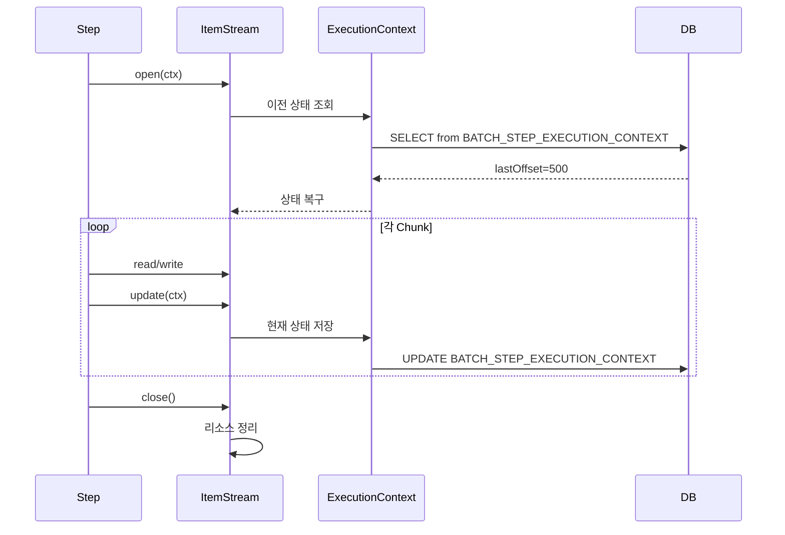

# Late Binding과 ItemStream

SpEL을 통한 Late Binding으로 실행 시점에 값을 주입하는 방법과, ItemStream 인터페이스를 구현하여 Reader/Writer의 상태를 관리하는 패턴을 다룬다.

## 목차
- [1. 핵심 개념 (What)](#1-핵심-개념-what)
- [2. 왜 알아야 하는가 (Why)](#2-왜-알아야-하는가-why)
- [3. 내부 구현 분석 (How)](#3-내부-구현-분석-how)
- [4. 실전 예제](#4-실전-예제)
- [5. 정리](#5-정리)

---

## 1. 핵심 개념 (What)

### Late Binding

Late Binding은 Bean 정의 시점이 아닌 **Step 실행 시점**에 값을 바인딩하는 기법이다. `@StepScope`(또는 `@JobScope`)와 SpEL(Spring Expression Language)을 조합하여, ExecutionContext 값이나 JobParameter를 런타임에 주입받는다.

```
애플리케이션 시작 시점                     Step 실행 시점
┌────────────────────┐                  ┌─────────────────────────┐
│ Bean 정의만 등록     │   ──────────▶  │ @StepScope에 의해         │
│ (프록시 생성)        │                │ 실제 Bean 인스턴스 생성     │
│                     │                │ SpEL로 값 바인딩           │
└────────────────────┘                  └─────────────────────────┘
```

### ItemStream

`ItemStream`은 Reader/Writer가 ExecutionContext와 상호작용하는 **표준 인터페이스**다. 3개의 라이프사이클 메서드를 통해 상태 복구, 상태 저장, 리소스 정리를 수행한다.

```java
public interface ItemStream {
    void open(ExecutionContext executionContext);    // Step 시작 시 - 상태 복구
    void update(ExecutionContext executionContext);  // Chunk 완료 시 - 상태 저장
    void close();                                    // Step 종료 시 - 리소스 정리
}
```

---

## 2. 왜 알아야 하는가 (Why)

### Late Binding이 필요한 이유

- **동적 파라미터**: 실행할 때마다 다른 입력 파일, 날짜 범위, 파티션 키를 사용해야 하는 경우
- **ExecutionContext 연동**: 이전 Step에서 저장한 값(예: 마지막 처리 ID)을 다음 Step의 Reader에 주입
- **재시작 지원**: 재시작 시 ExecutionContext에서 복구된 값을 자동으로 Reader에 전달

### ItemStream이 필요한 이유

- **재시작 가능한 커스텀 컴포넌트**: 기본 제공 Reader/Writer가 아닌 커스텀 구현체를 만들 때, 재시작 지원을 위해 상태 저장/복구 로직이 필요
- **리소스 관리**: 파일 핸들, 네트워크 연결 등을 Step 라이프사이클에 맞춰 열고 닫아야 하는 경우
- **진행 상태 저장**: 매 Chunk마다 현재 오프셋이나 마지막 처리 ID를 기록하여 실패 시 복구 지점으로 활용

---

## 3. 내부 구현 분석 (How)

### 3.1 SpEL을 통한 Late Binding

`@StepScope`를 선언하면 해당 Bean은 Step 실행 시점에 생성되며, SpEL 표현식으로 다양한 런타임 값을 주입받을 수 있다.

```java
@Bean
@StepScope  // 필수! Step 실행 시점에 빈 생성
public ItemReader<Customer> reader(
        @Value("#{stepExecutionContext['lastProcessedId']}") Long lastId,
        @Value("#{jobExecutionContext['globalSetting']}") String setting,
        @Value("#{jobParameters['inputFile']}") String inputFile) {
    // lastId, setting, inputFile 사용
}
```

사용 가능한 SpEL 표현식:

| 표현식 | 설명 |
|--------|------|
| `#{jobParameters['key']}` | Job 실행 시 전달된 파라미터 |
| `#{jobExecutionContext['key']}` | JobExecutionContext에 저장된 값 |
| `#{stepExecutionContext['key']}` | StepExecutionContext에 저장된 값 |
| `#{stepExecution.stepName}` | 현재 Step 이름 |

### 3.2 null 안전 처리 (Elvis 연산자)

SpEL의 Elvis 연산자(`?:`)를 사용하여 값이 없을 때 기본값을 지정할 수 있다. 최초 실행 시에는 ExecutionContext가 비어있으므로 이 처리가 필수적이다.

```java
// 방법 1: Elvis 연산자 (?:)
@Value("#{stepExecutionContext['lastId'] ?: 0}")
Long lastId;  // null이면 0

// 방법 2: 코드에서 처리
@Bean
@StepScope
public ItemReader<Customer> reader(
        @Value("#{stepExecutionContext['lastId']}") Long lastId) {
    long startId = Optional.ofNullable(lastId).orElse(0L);
    // ...
}
```

### 3.3 @StepScope vs @JobScope

| 항목 | @StepScope | @JobScope |
|------|-----------|-----------|
| **생성 시점** | Step 실행 시 | Job 실행 시 |
| **접근 가능 표현식** | jobParameters, jobExecutionContext, stepExecutionContext | jobParameters, jobExecutionContext |
| **사용 대상** | Reader, Processor, Writer | Step Bean |
| **인스턴스 수** | Step 실행마다 새로 생성 | Job 실행마다 새로 생성 |

### 3.4 ItemStream 동작 흐름

ItemStream의 3개 메서드는 Step 라이프사이클에 맞춰 자동으로 호출된다.

```
Step 시작
    │
    ▼
  open(executionContext) - DB에서 이전 상태 로드
    │
    ▼
  Chunk 1: Read -> Process -> Write
    └─▶ update(executionContext) - 진행 상태 저장
  Chunk 2: Read -> Process -> Write
    └─▶ update(executionContext) - 진행 상태 저장
  ...반복...
    │
    ▼
  close() - 리소스 정리
```

각 메서드의 역할:

| 메서드 | 호출 시점 | 역할 |
|--------|---------|------|
| `open()` | Step 시작 시 1회 | 이전 상태 복구, 리소스 초기화 |
| `update()` | 매 Chunk 완료 후 | 현재 진행 상태를 ExecutionContext에 저장 |
| `close()` | Step 종료 시 1회 | 리소스 정리(파일 닫기, 연결 해제) |

---

## 4. 실전 예제

### 커스텀 ItemStreamReader 구현

외부 API에서 데이터를 읽으면서, 실패 시 이전 오프셋부터 재시작할 수 있는 Reader다.

```java
@Component
@Slf4j
public class RestartableApiReader implements ItemStreamReader<ApiData> {

    private static final String LAST_OFFSET_KEY = "lastOffset";
    private static final String TOTAL_READ_KEY = "totalRead";

    private final ApiClient apiClient;
    private int currentOffset = 0;
    private int totalRead = 0;
    private List<ApiData> buffer = new ArrayList<>();
    private int bufferIndex = 0;

    @Override
    public void open(ExecutionContext executionContext) {
        if (executionContext.containsKey(LAST_OFFSET_KEY)) {
            this.currentOffset = executionContext.getInt(LAST_OFFSET_KEY);
            this.totalRead = executionContext.getInt(TOTAL_READ_KEY);
            log.info("이전 상태 복구 - offset: {}, totalRead: {}",
                    currentOffset, totalRead);
        }
    }

    @Override
    public ApiData read() {
        if (bufferIndex >= buffer.size()) {
            buffer = apiClient.fetchData(currentOffset, 100);
            bufferIndex = 0;
            currentOffset += 100;
            if (buffer.isEmpty()) {
                return null;
            }
        }
        totalRead++;
        return buffer.get(bufferIndex++);
    }

    @Override
    public void update(ExecutionContext executionContext) {
        executionContext.putInt(LAST_OFFSET_KEY, currentOffset);
        executionContext.putInt(TOTAL_READ_KEY, totalRead);
    }

    @Override
    public void close() {
        buffer.clear();
        log.info("Reader 종료 - 총 읽기: {}", totalRead);
    }
}
```

### 커스텀 ItemStreamWriter 구현

처리된 데이터를 저장하면서 마지막으로 저장한 ID와 쓰기 건수를 ExecutionContext에 기록하는 Writer다.

```java
@Component
@Slf4j
public class CheckpointWriter implements ItemStreamWriter<ProcessedData> {

    private static final String LAST_WRITTEN_ID_KEY = "lastWrittenId";
    private static final String WRITE_COUNT_KEY = "writeCount";

    private final DataRepository repository;
    private Long lastWrittenId = 0L;
    private int writeCount = 0;

    @Override
    public void open(ExecutionContext executionContext) {
        if (executionContext.containsKey(LAST_WRITTEN_ID_KEY)) {
            this.lastWrittenId = executionContext.getLong(LAST_WRITTEN_ID_KEY);
            this.writeCount = executionContext.getInt(WRITE_COUNT_KEY);
        }
    }

    @Override
    public void write(Chunk<? extends ProcessedData> items) throws Exception {
        for (ProcessedData item : items) {
            repository.save(item);
            lastWrittenId = item.getId();
            writeCount++;
        }
    }

    @Override
    public void update(ExecutionContext executionContext) {
        executionContext.putLong(LAST_WRITTEN_ID_KEY, lastWrittenId);
        executionContext.putInt(WRITE_COUNT_KEY, writeCount);
    }

    @Override
    public void close() {
        log.info("Writer 종료 - 총 쓰기: {}", writeCount);
    }
}
```

### Late Binding + ItemStream 조합

`@StepScope`와 ItemStream을 결합하면, 최초 실행 시에는 JobParameter를, 재시작 시에는 ExecutionContext 값을 사용하는 유연한 Reader를 만들 수 있다.

```java
@Bean
@StepScope
public ItemStreamReader<Customer> restartableReader(
        DataSource dataSource,
        @Value("#{jobParameters['startDate']}") String startDate,
        @Value("#{stepExecutionContext['lastId'] ?: 0}") Long lastId) {

    return new JdbcCursorItemReaderBuilder<Customer>()
            .name("restartableReader")
            .dataSource(dataSource)
            .sql("SELECT * FROM customers WHERE created_date >= ? AND id > ? ORDER BY id")
            .queryArguments(startDate, lastId)
            .rowMapper(new BeanPropertyRowMapper<>(Customer.class))
            .saveState(true)  // ItemStream의 update()에서 자동으로 상태 저장
            .build();
}
```



---

## 5. 정리

| 항목 | 설명 |
|------|------|
| **Late Binding** | `@StepScope` + SpEL로 Step 실행 시점에 값 주입 |
| **@StepScope** | Step 실행마다 Bean을 새로 생성하여 런타임 바인딩 지원 |
| **@JobScope** | Job 실행마다 Bean을 새로 생성, jobParameters/jobExecutionContext 접근 가능 |
| **Elvis 연산자** | `#{expression ?: default}` -- null일 때 기본값 지정 |
| **ItemStream** | Reader/Writer의 상태 관리 표준 인터페이스 |
| **open()** | Step 시작 시 호출, 이전 상태 복구 및 리소스 초기화 |
| **update()** | Chunk 완료 시 호출, 현재 진행 상태를 ExecutionContext에 저장 |
| **close()** | Step 종료 시 호출, 리소스 정리 |
| **ItemStreamReader** | `ItemReader` + `ItemStream` -- 재시작 가능한 Reader |
| **ItemStreamWriter** | `ItemWriter` + `ItemStream` -- 체크포인트 지원 Writer |

---
*참고: Spring Batch 5.x / Spring Boot 3.x 기준*
