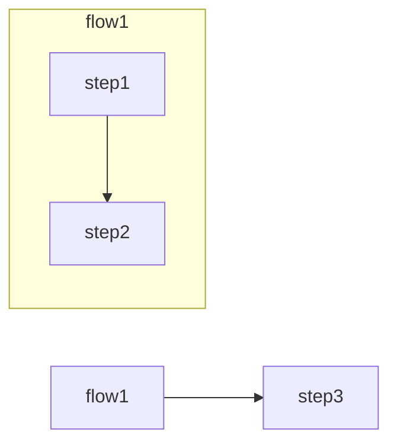
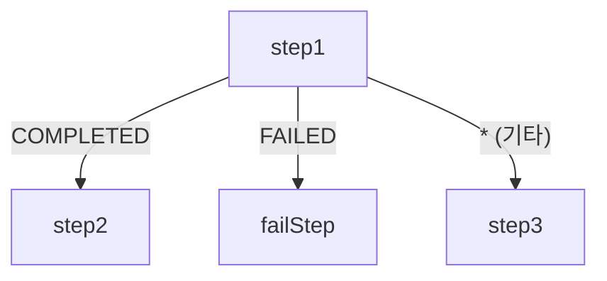
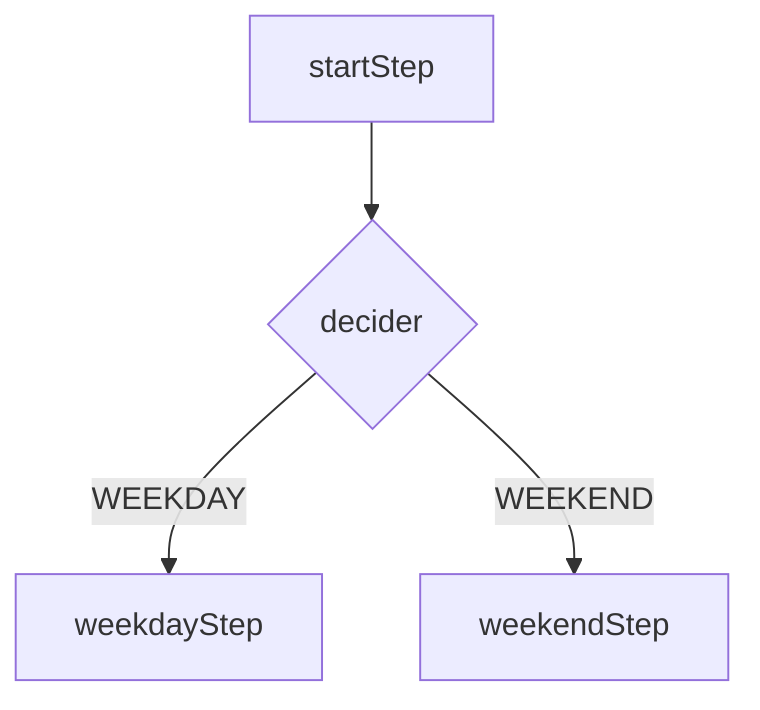

# Flow와 조건부 흐름 제어

Spring Batch에서 Step의 실행 순서를 동적으로 결정하는 Flow와 조건부 분기 메커니즘을 다룬다. `on()`/`to()`/`from()` 패턴과 `JobExecutionDecider`를 활용한 실무 분기 전략을 정리한다.

## 목차
- [1. 핵심 개념 (What)](#1-핵심-개념-what)
- [2. 왜 알아야 하는가 (Why)](#2-왜-알아야-하는가-why)
- [3. 내부 구현 분석 (How)](#3-내부-구현-분석-how)
- [4. 실전 예제](#4-실전-예제)
- [5. 정리](#5-정리)

---

## 1. 핵심 개념 (What)

### Flow란?

Flow는 여러 Step을 **논리적으로 그룹화**하고, 조건에 따라 **분기 처리**할 수 있게 해주는 Spring Batch의 핵심 추상화다. Flow를 통해 다음과 같은 흐름 제어가 가능하다:

- **순차 실행**: Step A -> Step B -> Step C
- **조건 분기**: Step A 성공 시 Step B, 실패 시 Step C
- **동적 분기**: 런타임 조건에 따라 다음 Step 결정

### 핵심 API

| API | 설명 |
|-----|------|
| `on(String pattern)` | ExitStatus 패턴 매칭 (`COMPLETED`, `FAILED`, `*` 등) |
| `to(Step step)` | 매칭 시 이동할 다음 Step 지정 |
| `from(Step step)` | 분기 시작점 재지정 (같은 Step에서 여러 분기 정의) |
| `end()` | Flow 종료 |
| `fail()` | Job을 FAILED 상태로 종료 |
| `stop()` | Job을 STOPPED 상태로 종료 (재시작 가능) |

### JobExecutionDecider

Step이 아닌 별도의 Decider 컴포넌트로 분기 로직을 분리한다. Step의 ExitStatus에 의존하지 않고 **비즈니스 로직 기반으로 분기**할 수 있다.

---

## 2. 왜 알아야 하는가 (Why)

### 실무 시나리오

배치 작업은 단순한 순차 실행만으로는 부족한 경우가 많다:

- **데이터 검증 후 분기**: 검증 Step 통과 시 처리 진행, 실패 시 알림 발송
- **요일별 다른 처리**: 평일에는 실시간 정산, 주말에는 일괄 정산
- **환경별 분기**: 테스트 환경에서는 Dry-run, 운영 환경에서는 실제 처리
- **장애 대응**: 특정 Step 실패 시 보상 트랜잭션 실행

### ExitStatus vs. FlowExecutionStatus

```
Step ExitStatus      ->  on() 패턴 매칭  ->  FlowExecutionStatus
"COMPLETED"          ->  on("COMPLETED") ->  다음 Step으로 이동
"FAILED"             ->  on("FAILED")    ->  실패 처리 Step으로 이동
"CUSTOM_STATUS"      ->  on("CUSTOM_*")  ->  커스텀 분기 처리
```

`on()` 메서드는 **와일드카드 패턴**을 지원한다:
- `*`: 모든 ExitStatus와 매칭 (0개 이상의 문자)
- `?`: 단일 문자와 매칭

---

## 3. 내부 구현 분석 (How)

### 3.1 기본 Flow 정의

여러 Step을 하나의 Flow로 묶어 재사용할 수 있다.

```java
@Bean
public Job flowJob() {
    return new JobBuilder("flowJob", jobRepository)
            .start(flow1())
            .next(step3())
            .end()
            .build();
}

@Bean
public Flow flow1() {
    return new FlowBuilder<SimpleFlow>("flow1")
            .start(step1())
            .next(step2())
            .build();
}
```



### 3.2 조건부 Flow

Step의 ExitStatus에 따라 다음 실행 경로를 결정한다.

```java
@Bean
public Job conditionalFlowJob() {
    return new JobBuilder("conditionalFlowJob", jobRepository)
            .start(step1())
                .on("COMPLETED").to(step2())
                .from(step1())
                .on("FAILED").to(failStep())
                .from(step1())
                .on("*").to(step3())
            .end()
            .build();
}
```



**분기 규칙:**
- `on("COMPLETED")`: step1이 정상 완료되면 step2로 이동
- `on("FAILED")`: step1이 실패하면 failStep으로 이동
- `on("*")`: 위 조건에 해당하지 않는 모든 ExitStatus는 step3으로 이동
- `from(step1())`: 같은 Step에서 여러 분기를 정의할 때 사용

### 3.3 커스텀 ExitStatus를 이용한 분기

기본 ExitStatus(`COMPLETED`, `FAILED`) 외에 커스텀 상태를 정의하여 세밀한 분기를 구현할 수 있다.

```java
@Bean
public Job customExitStatusJob() {
    return new JobBuilder("customExitStatusJob", jobRepository)
            .start(deciderStep())
                .on("ODD").to(oddStep())
                .from(deciderStep())
                .on("EVEN").to(evenStep())
            .end()
            .build();
}

@Bean
public Step deciderStep() {
    return new StepBuilder("deciderStep", jobRepository)
            .tasklet((contribution, chunkContext) -> {
                int number = (int) (Math.random() * 100);
                if (number % 2 == 0) {
                    contribution.setExitStatus(new ExitStatus("EVEN"));
                } else {
                    contribution.setExitStatus(new ExitStatus("ODD"));
                }
                return RepeatStatus.FINISHED;
            }, transactionManager)
            .build();
}
```

**주의**: Tasklet 내부에서 `contribution.setExitStatus()`를 호출하여 커스텀 ExitStatus를 설정한다. 이 값이 `on()` 패턴과 매칭된다.

### 3.4 JobExecutionDecider

Step에 분기 로직을 넣지 않고, 전용 Decider 컴포넌트로 분리하는 방식이다. Step의 비즈니스 로직과 흐름 제어 로직을 **관심사 분리**할 수 있다.

```java
@Bean
public Job deciderJob() {
    return new JobBuilder("deciderJob", jobRepository)
            .start(startStep())
            .next(decider())
                .on("WEEKDAY").to(weekdayStep())
                .from(decider())
                .on("WEEKEND").to(weekendStep())
            .end()
            .build();
}

@Bean
public JobExecutionDecider decider() {
    return (jobExecution, stepExecution) -> {
        DayOfWeek dayOfWeek = LocalDate.now().getDayOfWeek();
        if (dayOfWeek == DayOfWeek.SATURDAY || dayOfWeek == DayOfWeek.SUNDAY) {
            return new FlowExecutionStatus("WEEKEND");
        }
        return new FlowExecutionStatus("WEEKDAY");
    };
}
```



**JobExecutionDecider의 장점:**
- Step과 독립적으로 분기 로직을 관리
- Step을 실행하지 않고 분기만 수행하므로 **성능 오버헤드 없음**
- `FlowExecutionStatus`를 반환하므로 ExitStatus 조작이 불필요

---

## 4. 실전 예제

### 데이터 검증 후 분기 처리

실무에서 가장 흔한 패턴: 검증 Step 결과에 따라 처리 경로를 분기한다.

```java
@Configuration
public class DataValidationJobConfig {

    @Bean
    public Job dataValidationJob(JobRepository jobRepository) {
        return new JobBuilder("dataValidationJob", jobRepository)
                .start(validateStep())
                    .on("VALID").to(processStep())
                    .from(validateStep())
                    .on("INVALID").to(notifyStep())
                    .from(validateStep())
                    .on("*").to(errorStep())
                .end()
                .build();
    }

    @Bean
    public Step validateStep() {
        return new StepBuilder("validateStep", jobRepository)
                .tasklet((contribution, chunkContext) -> {
                    boolean isValid = performValidation();
                    if (isValid) {
                        contribution.setExitStatus(new ExitStatus("VALID"));
                    } else {
                        contribution.setExitStatus(new ExitStatus("INVALID"));
                    }
                    return RepeatStatus.FINISHED;
                }, transactionManager)
                .build();
    }
}
```

### 비즈니스 조건 기반 Decider

시간대, 데이터 건수 등 런타임 조건에 따라 분기하는 Decider 예제:

```java
@Bean
public JobExecutionDecider volumeDecider() {
    return (jobExecution, stepExecution) -> {
        long count = stepExecution.getWriteCount();
        if (count > 10000) {
            return new FlowExecutionStatus("HIGH_VOLUME");
        } else if (count > 1000) {
            return new FlowExecutionStatus("MEDIUM_VOLUME");
        }
        return new FlowExecutionStatus("LOW_VOLUME");
    };
}

@Bean
public Job volumeBasedJob(JobRepository jobRepository) {
    return new JobBuilder("volumeBasedJob", jobRepository)
            .start(extractStep())
            .next(volumeDecider())
                .on("HIGH_VOLUME").to(parallelProcessStep())
                .from(volumeDecider())
                .on("MEDIUM_VOLUME").to(batchProcessStep())
                .from(volumeDecider())
                .on("LOW_VOLUME").to(simpleProcessStep())
            .end()
            .build();
}
```

---

## 5. 정리

| 항목 | 핵심 내용 |
|------|-----------|
| **Flow** | 여러 Step을 논리적으로 그룹화하여 재사용 가능한 단위로 만듦 |
| **on(pattern)** | ExitStatus 패턴 매칭 (`COMPLETED`, `FAILED`, `*` 와일드카드 지원) |
| **from(step)** | 같은 Step에서 여러 분기를 정의할 때 분기 시작점 재지정 |
| **커스텀 ExitStatus** | `contribution.setExitStatus(new ExitStatus("CUSTOM"))` 으로 설정 |
| **JobExecutionDecider** | Step 없이 분기 로직만 수행하는 전용 컴포넌트 |
| **FlowExecutionStatus** | Decider가 반환하는 분기 상태값 |
| **관심사 분리** | 비즈니스 로직(Step)과 흐름 제어(Decider)를 분리하는 것이 권장 |

---
*참고: Spring Batch 5.x / Spring Boot 3.x 기준*
