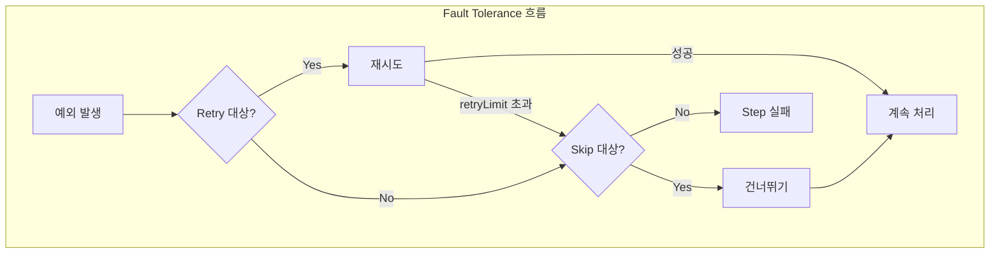

# Skip, Retry, Listener 총정리

Spring Batch의 내결함성(Fault Tolerance) 메커니즘인 Skip과 Retry, 그리고 배치 생명주기 전반에 걸친 Listener를 다룬다. 프로덕션 배치에서 안정적인 오류 처리와 모니터링을 위한 필수 설정을 정리한다.

## 목차
- [1. 핵심 개념 (What)](#1-핵심-개념-what)
- [2. 왜 알아야 하는가 (Why)](#2-왜-알아야-하는가-why)
- [3. 내부 구현 분석 (How)](#3-내부-구현-분석-how)
- [4. 실전 예제](#4-실전-예제)
- [5. 정리](#5-정리)

---

## 1. 핵심 개념 (What)

### Skip

특정 예외가 발생했을 때 해당 아이템을 **건너뛰고** 나머지를 계속 처리한다. 데이터 품질 문제로 일부 레코드가 유효하지 않을 때 전체 배치를 실패시키지 않기 위해 사용한다.

### Retry

일시적 오류(네트워크 타임아웃, DB 데드락 등)에 대해 **재시도**한다. 재시도 횟수, 대상 예외, 백오프 정책 등을 세밀하게 제어할 수 있다.

### Listener

배치 실행의 각 단계(Job, Step, Chunk, Item)에서 발생하는 이벤트를 감지하여 **로깅, 모니터링, 후처리** 등을 수행한다.



---

## 2. 왜 알아야 하는가 (Why)

### 프로덕션 배치의 현실

- 수백만 건 데이터 중 **일부 불량 레코드**가 반드시 존재한다
- DB 데드락, 네트워크 순단 같은 **일시적 오류**는 언제든 발생한다
- 오류 하나로 전체 배치가 실패하면 **운영 비용이 급증**한다

### Skip + Retry 조합의 가치

1. **Retry**: 일시적 오류는 재시도로 복구
2. **Skip**: 재시도로도 해결 안 되면 건너뛰기
3. **Listener**: 건너뛴 아이템과 오류를 기록하여 사후 처리

이 세 가지를 적절히 조합하면 **자율적으로 복구되는 탄력적인 배치**를 구축할 수 있다.

---

## 3. 내부 구현 분석 (How)

### 3.1 Skip 설정

특정 예외 발생 시 해당 아이템을 건너뛰고 계속 진행한다.

```java
@Bean
public Step skipStep(JobRepository jobRepository,
                     PlatformTransactionManager transactionManager) {
    return new StepBuilder("skipStep", jobRepository)
            .<Customer, CustomerDto>chunk(100, transactionManager)
            .reader(reader())
            .processor(processor())
            .writer(writer())
            .faultTolerant()
            .skip(ValidationException.class)
            .skip(DuplicateKeyException.class)
            .skipLimit(100)
            .skipPolicy(new AlwaysSkipItemSkipPolicy())  // 커스텀 정책
            .noSkip(FileNotFoundException.class)  // 이 예외는 스킵하지 않음
            .listener(new SkipListener<Customer, CustomerDto>() {
                @Override
                public void onSkipInRead(Throwable t) {
                    log.warn("읽기 중 스킵: {}", t.getMessage());
                }
                @Override
                public void onSkipInProcess(Customer item, Throwable t) {
                    log.warn("처리 중 스킵 - ID: {}, 오류: {}",
                            item.getId(), t.getMessage());
                }
                @Override
                public void onSkipInWrite(CustomerDto item, Throwable t) {
                    log.warn("쓰기 중 스킵 - ID: {}", item.getId());
                }
            })
            .build();
}
```

**Skip 설정 핵심:**

| 메서드 | 설명 |
|--------|------|
| `.faultTolerant()` | Skip/Retry 기능 활성화 (필수 선행 호출) |
| `.skip(Class)` | 스킵할 예외 클래스 지정 (여러 번 호출 가능) |
| `.skipLimit(int)` | 최대 스킵 허용 횟수 (초과 시 Step 실패) |
| `.skipPolicy(SkipPolicy)` | 커스텀 스킵 정책 (skipLimit 대신 사용) |
| `.noSkip(Class)` | 절대 스킵하지 않을 예외 지정 |

**Skip 동작 단계별 차이:**
- **Read 단계**: 해당 아이템을 건너뛰고 다음 아이템 읽기
- **Process 단계**: 해당 아이템을 필터링하고 다음 아이템 처리
- **Write 단계**: Chunk를 개별 아이템 단위로 재시도 후 실패 아이템만 스킵

### 3.2 Retry 설정

일시적 오류에 대해 재시도한다.

```java
@Bean
public Step retryStep(JobRepository jobRepository,
                      PlatformTransactionManager transactionManager) {
    return new StepBuilder("retryStep", jobRepository)
            .<Customer, CustomerDto>chunk(100, transactionManager)
            .reader(reader())
            .processor(processor())
            .writer(writer())
            .faultTolerant()
            .retry(DeadlockLoserDataAccessException.class)
            .retry(OptimisticLockingFailureException.class)
            .retryLimit(3)
            .retryPolicy(new SimpleRetryPolicy(3,
                    Map.of(TransientDataAccessException.class, true)))
            .backOffPolicy(new ExponentialBackOffPolicy())  // 지수 백오프
            .noRetry(ValidationException.class)  // 이 예외는 재시도하지 않음
            .listener(new RetryListener() {
                @Override
                public <T, E extends Throwable> void onError(
                        RetryContext context, RetryCallback<T, E> callback, Throwable t) {
                    log.warn("재시도 #{}: {}", context.getRetryCount(), t.getMessage());
                }
            })
            .build();
}
```

**Retry 설정 핵심:**

| 메서드 | 설명 |
|--------|------|
| `.retry(Class)` | 재시도할 예외 클래스 지정 |
| `.retryLimit(int)` | 최대 재시도 횟수 |
| `.retryPolicy(RetryPolicy)` | 커스텀 재시도 정책 |
| `.backOffPolicy(BackOffPolicy)` | 재시도 간 대기 전략 |
| `.noRetry(Class)` | 재시도하지 않을 예외 지정 |

### RetryTemplate을 이용한 세밀한 제어

```java
@Bean
public RetryPolicy retryPolicy() {
    Map<Class<? extends Throwable>, Boolean> retryableExceptions = new HashMap<>();
    retryableExceptions.put(TransientDataAccessException.class, true);
    retryableExceptions.put(DeadlockLoserDataAccessException.class, true);
    return new SimpleRetryPolicy(3, retryableExceptions, true);
}

@Bean
public BackOffPolicy backOffPolicy() {
    ExponentialBackOffPolicy policy = new ExponentialBackOffPolicy();
    policy.setInitialInterval(1000);  // 1초
    policy.setMultiplier(2.0);        // 2배씩 증가
    policy.setMaxInterval(10000);     // 최대 10초
    return policy;
}
```

**BackOffPolicy 종류:**

| 정책 | 설명 | 대기 시간 예시 |
|------|------|---------------|
| `FixedBackOffPolicy` | 고정 간격 | 1s, 1s, 1s |
| `ExponentialBackOffPolicy` | 지수 증가 | 1s, 2s, 4s |
| `ExponentialRandomBackOffPolicy` | 지수 + 랜덤 | 0.8s, 2.3s, 3.7s |
| `NoBackOffPolicy` | 즉시 재시도 | 0s, 0s, 0s |

### 3.3 Skip + Retry 조합

실무에서 가장 강력한 패턴: 먼저 재시도하고, 재시도 실패 시 건너뛴다.

```java
@Bean
public Step robustStep(JobRepository jobRepository,
                       PlatformTransactionManager transactionManager) {
    return new StepBuilder("robustStep", jobRepository)
            .<Customer, CustomerDto>chunk(100, transactionManager)
            .reader(reader())
            .processor(processor())
            .writer(writer())
            .faultTolerant()
            // Retry 설정
            .retry(TransientDataAccessException.class)
            .retryLimit(3)
            // Skip 설정 (재시도 후에도 실패하면 스킵)
            .skip(Exception.class)
            .skipLimit(10)
            .noSkip(FileNotFoundException.class)
            .noRetry(ValidationException.class)
            .build();
}
```

**처리 흐름:**
1. `TransientDataAccessException` 발생 -> 최대 3회 재시도
2. 재시도 후에도 실패 -> Skip 대상이면 건너뛰기
3. `ValidationException` 발생 -> 재시도 없이 즉시 Skip 여부 판단
4. `FileNotFoundException` 발생 -> Skip 불가, Step 즉시 실패

### 3.4 Listener 총정리

#### JobExecutionListener

Job의 시작/종료 시점에 호출된다.

```java
@Bean
public Job jobWithListener() {
    return new JobBuilder("jobWithListener", jobRepository)
            .start(step1())
            .listener(new JobExecutionListener() {
                @Override
                public void beforeJob(JobExecution jobExecution) {
                    log.info("Job 시작: {}", jobExecution.getJobInstance().getJobName());
                }
                @Override
                public void afterJob(JobExecution jobExecution) {
                    if (jobExecution.getStatus() == BatchStatus.COMPLETED) {
                        log.info("Job 완료! 처리 시간: {}ms",
                                jobExecution.getEndTime().toEpochMilli()
                                - jobExecution.getStartTime().toEpochMilli());
                    } else if (jobExecution.getStatus() == BatchStatus.FAILED) {
                        log.error("Job 실패: {}",
                                jobExecution.getAllFailureExceptions());
                    }
                }
            })
            .build();
}
```

#### StepExecutionListener

Step의 시작/종료 시점에 호출된다. `afterStep()`에서 ExitStatus를 변경할 수 있다.

```java
@Component
public class StepLoggingListener implements StepExecutionListener {

    @Override
    public void beforeStep(StepExecution stepExecution) {
        log.info("Step 시작: {}", stepExecution.getStepName());
    }

    @Override
    public ExitStatus afterStep(StepExecution stepExecution) {
        log.info("Step 완료 - 읽기: {}, 쓰기: {}, 건너뛰기: {}",
                stepExecution.getReadCount(),
                stepExecution.getWriteCount(),
                stepExecution.getSkipCount());

        if (stepExecution.getSkipCount() > 100) {
            return new ExitStatus("COMPLETED WITH SKIPS");
        }
        return stepExecution.getExitStatus();
    }
}
```

#### ChunkListener

Chunk 단위의 시작/종료/에러 시점에 호출된다.

```java
@Bean
public Step stepWithChunkListener() {
    return new StepBuilder("stepWithChunkListener", jobRepository)
            .<User, User>chunk(100, transactionManager)
            .reader(userReader())
            .writer(userWriter())
            .listener(new ChunkListener() {
                @Override
                public void beforeChunk(ChunkContext context) {
                    log.info("Chunk 시작");
                }
                @Override
                public void afterChunk(ChunkContext context) {
                    log.info("Chunk 완료 - Read: {}, Write: {}",
                            context.getStepContext().getStepExecution().getReadCount(),
                            context.getStepContext().getStepExecution().getWriteCount());
                }
                @Override
                public void afterChunkError(ChunkContext context) {
                    log.error("Chunk 에러 발생");
                }
            })
            .build();
}
```

#### ItemReadListener / ItemProcessListener / ItemWriteListener

Item 단위의 읽기/처리/쓰기 이벤트를 감지한다. 세밀한 아이템 레벨 모니터링에 사용한다.

```java
@Component
public class CustomItemListener implements ItemReadListener<User>,
                                            ItemProcessListener<User, User>,
                                            ItemWriteListener<User> {

    @Override
    public void afterRead(User item) {
        log.debug("읽음: {}", item.getId());
    }

    @Override
    public void onReadError(Exception ex) {
        log.error("읽기 에러: {}", ex.getMessage());
    }

    @Override
    public void afterProcess(User input, User output) {
        if (output == null) {
            log.info("필터링됨: {}", input.getId());
        }
    }

    @Override
    public void onProcessError(User item, Exception e) {
        log.error("처리 에러 - ID: {}, Error: {}", item.getId(), e.getMessage());
    }

    @Override
    public void beforeWrite(Chunk<? extends User> items) {
        log.info("쓰기 시작: {} 건", items.size());
    }

    @Override
    public void afterWrite(Chunk<? extends User> items) {
        log.info("쓰기 완료: {} 건", items.size());
    }

    @Override
    public void onWriteError(Exception exception, Chunk<? extends User> items) {
        log.error("쓰기 에러: {} 건 실패", items.size());
    }
}
```

---

## 4. 실전 예제

### Listener 계층 구조와 호출 순서

```
JobExecutionListener.beforeJob()
  └─ StepExecutionListener.beforeStep()
       └─ ChunkListener.beforeChunk()
            ├─ ItemReadListener.beforeRead() / afterRead()
            ├─ ItemProcessListener.beforeProcess() / afterProcess()
            └─ ItemWriteListener.beforeWrite() / afterWrite()
       └─ ChunkListener.afterChunk()
  └─ StepExecutionListener.afterStep()
JobExecutionListener.afterJob()
```

### 실무 권장 조합

| 시나리오 | Skip | Retry | Listener |
|----------|------|-------|----------|
| 데이터 품질 이슈 | skipLimit(100) | - | SkipListener로 불량 데이터 기록 |
| DB 데드락 | - | retryLimit(3) + ExponentialBackOff | RetryListener로 재시도 로깅 |
| 외부 API 호출 | skipLimit(10) | retryLimit(3) | 양쪽 Listener 모두 적용 |
| 파일 처리 | noSkip(IOException) | - | StepExecutionListener로 결과 요약 |

---

## 5. 정리

| 항목 | 핵심 내용 |
|------|-----------|
| **Skip** | `faultTolerant()` + `skip(Class)` + `skipLimit(int)` 으로 설정 |
| **Retry** | `faultTolerant()` + `retry(Class)` + `retryLimit(int)` 으로 설정 |
| **BackOffPolicy** | 재시도 간 대기 전략 (ExponentialBackOffPolicy 권장) |
| **Skip + Retry** | 먼저 재시도, 실패 시 스킵 -- 가장 탄력적인 조합 |
| **noSkip / noRetry** | 치명적 오류는 명시적으로 제외하여 즉시 실패 처리 |
| **Listener 종류** | Job, Step, Chunk, Item(Read/Process/Write) 레벨 |
| **Listener 활용** | 로깅, 모니터링, ExitStatus 변경, 오류 집계 |

---
*참고: Spring Batch 5.x / Spring Boot 3.x 기준*
