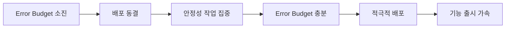
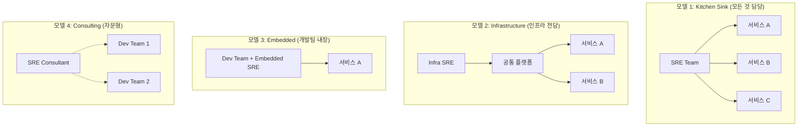

# SRE 기초 - Site Reliability Engineering의 핵심 원칙

Google에서 탄생한 SRE(Site Reliability Engineering)는 소프트웨어 엔지니어링 접근 방식으로 운영 문제를 해결하는 방법론이다. 이 문서에서는 SRE의 핵심 원칙과 전통적 Ops와의 차이, 그리고 조직에 SRE를 도입하기 위한 전략을 다룬다.

## 목차
- [1. 핵심 개념 (What)](#1-핵심-개념-what)
- [2. 왜 알아야 하는가 (Why)](#2-왜-알아야-하는가-why)
- [3. 내부 구현 분석 (How)](#3-내부-구현-분석-how)
- [4. 실전 예제](#4-실전-예제)
- [5. 정리](#5-정리)

---

## 1. 핵심 개념 (What)

### SRE의 탄생 배경

2003년 Google의 Ben Treynor Sloss가 처음 정의한 SRE는 "소프트웨어 엔지니어에게 운영 업무를 맡겼을 때 일어나는 일"이라는 한 문장으로 요약된다. 전통적인 시스템 관리자(sysadmin) 모델이 서비스 규모에 비례하여 인력이 증가하는 문제를 해결하기 위해 탄생했다.

### SRE의 핵심 원칙

```
┌─────────────────────────────────────────────────────┐
│                  SRE 핵심 원칙                        │
├─────────────────────────────────────────────────────┤
│  1. Embracing Risk      - 100% 가용성은 목표가 아니다  │
│  2. Error Budget        - 허용 가능한 장애 예산         │
│  3. Eliminating Toil    - 반복 수작업 자동화            │
│  4. Monitoring          - 관측 가능성 확보              │
│  5. Release Engineering - 안전한 배포 파이프라인         │
│  6. Simplicity          - 복잡성 관리                  │
└─────────────────────────────────────────────────────┘
```

### SRE vs 전통적 Ops

| 항목 | 전통적 Ops | SRE |
|------|-----------|-----|
| 인력 모델 | 서비스 규모에 비례 증가 | 소프트웨어로 확장 |
| 장애 대응 | 수동 대응, 개인 경험 의존 | 자동화, 런북, 포스트모템 |
| 배포 관점 | 변경 = 리스크, 보수적 | Error Budget 내 적극 배포 |
| Dev-Ops 관계 | 대립적 (안정성 vs 속도) | 공동 책임, Error Budget 공유 |
| 작업 성격 | 수동 반복 작업(Toil) 중심 | 50% 이상 엔지니어링 업무 |
| 인력 배경 | 시스템 관리자 | 소프트웨어 엔지니어 |

### Error Budget 개념

Error Budget은 SRE의 가장 혁신적인 개념이다. "100% 신뢰성은 잘못된 목표"라는 전제에서 출발한다.

```
Error Budget = 1 - SLO

예시: SLO가 99.9%인 서비스
- Error Budget = 0.1% = 월간 약 43.2분
- 이 43.2분은 "사용해도 되는 장애 시간"
- 새 기능 배포, 실험, 마이그레이션에 활용 가능
```



### Toil의 정의

Toil은 프로덕션 서비스 운영과 관련된 작업 중 다음 특성을 모두 만족하는 반복적 수작업이다:

- **수동적(Manual)**: 사람이 직접 수행해야 함
- **반복적(Repetitive)**: 같은 작업이 계속 발생
- **자동화 가능(Automatable)**: 기계가 대신할 수 있음
- **전술적(Tactical)**: 장기 전략이 아닌 단기 대응
- **가치 비증가(No enduring value)**: 서비스 자체를 개선하지 않음
- **서비스 성장에 비례(O(n))**: 서비스가 커지면 함께 증가

## 2. 왜 알아야 하는가 (Why)

### 운영 비용의 선형 증가 문제

전통적 Ops 모델에서는 서비스가 2배 성장하면 운영 인력도 2배가 필요하다. SRE는 자동화를 통해 이 선형 관계를 깨뜨린다.

### Dev와 Ops의 인센티브 정렬

전통적 모델에서 개발팀은 "빨리 배포"를, 운영팀은 "안정적 유지"를 원해 구조적으로 충돌한다. Error Budget은 양쪽에 동일한 인센티브를 부여한다:
- 개발팀: Error Budget 안에서 자유롭게 배포
- SRE팀: Error Budget 소진 시 배포를 중단하고 안정성에 집중

### 장애로부터의 학습

SRE는 장애를 "피해야 할 것"이 아니라 "학습 기회"로 본다. Blameless Post-mortem 문화를 통해 같은 장애의 재발을 방지한다.

## 3. 내부 구현 분석 (How)

### SRE 팀 구성 모델



### 50% 규칙

Google SRE의 핵심 원칙 중 하나는 **엔지니어링 작업이 최소 50%를 차지해야 한다**는 것이다.

```
SRE 업무 시간 배분:
├── 엔지니어링 (≥ 50%)
│   ├── 자동화 도구 개발
│   ├── 모니터링 시스템 개선
│   ├── 아키텍처 리뷰
│   └── 성능 최적화
│
└── 운영/Toil (≤ 50%)
    ├── On-call 대응
    ├── 티켓 처리
    ├── 수동 배포
    └── 반복 작업
```

Toil이 50%를 초과하면 관리자가 개입하여 자동화를 우선순위로 올린다.

### SRE 도입 로드맵

```
Phase 1: 기반 구축 (1-3개월)
├── SLI/SLO 정의
├── 모니터링 체계 구축
└── 장애 대응 프로세스 수립

Phase 2: 프로세스 정착 (3-6개월)
├── On-call 로테이션 시작
├── 포스트모템 문화 도입
└── 런북 작성 시작

Phase 3: 자동화 (6-12개월)
├── Toil 측정 및 자동화
├── CI/CD 파이프라인 고도화
└── Chaos Engineering 도입

Phase 4: 성숙 (12개월+)
├── Error Budget 기반 의사결정
├── SRE Consulting 모델 확장
└── 조직 전체 SRE 문화 확산
```

## 4. 실전 예제

### Error Budget 계산 스크립트

```python
from datetime import datetime, timedelta

class ErrorBudgetCalculator:
    """Error Budget 계산기"""

    def __init__(self, slo_target: float, window_days: int = 30):
        self.slo_target = slo_target
        self.window_days = window_days
        self.total_minutes = window_days * 24 * 60

    def calculate_budget(self) -> dict:
        """Error Budget 계산"""
        error_budget_ratio = 1 - self.slo_target
        budget_minutes = self.total_minutes * error_budget_ratio

        return {
            "slo_target": f"{self.slo_target * 100:.2f}%",
            "window_days": self.window_days,
            "total_minutes": self.total_minutes,
            "error_budget_ratio": f"{error_budget_ratio * 100:.3f}%",
            "budget_minutes": round(budget_minutes, 2),
            "budget_hours": round(budget_minutes / 60, 2),
        }

    def remaining_budget(self, downtime_minutes: float) -> dict:
        """남은 Error Budget 계산"""
        budget = self.calculate_budget()
        remaining = budget["budget_minutes"] - downtime_minutes
        consumption_rate = (downtime_minutes / budget["budget_minutes"]) * 100

        return {
            "total_budget_minutes": budget["budget_minutes"],
            "consumed_minutes": downtime_minutes,
            "remaining_minutes": round(remaining, 2),
            "consumption_rate": f"{consumption_rate:.1f}%",
            "status": "OK" if remaining > 0 else "BUDGET_EXHAUSTED",
        }


# 사용 예시
calc = ErrorBudgetCalculator(slo_target=0.999, window_days=30)
print(calc.calculate_budget())
# {'slo_target': '99.90%', 'budget_minutes': 43.2, 'budget_hours': 0.72, ...}

print(calc.remaining_budget(downtime_minutes=20))
# {'remaining_minutes': 23.2, 'consumption_rate': '46.3%', 'status': 'OK'}
```

### Toil 측정 템플릿

```yaml
# toil-tracking.yaml
# 주간 Toil 측정 시트

team: platform-sre
week: "2024-W03"
members:
  - name: "engineer-1"
    total_hours: 40
    toil_tasks:
      - task: "수동 인증서 갱신"
        hours: 2
        frequency: "monthly"
        automatable: true
        automation_effort: "2 sprints"
      - task: "디스크 용량 정리"
        hours: 1.5
        frequency: "weekly"
        automatable: true
        automation_effort: "1 sprint"
      - task: "배포 승인 처리"
        hours: 3
        frequency: "daily"
        automatable: true
        automation_effort: "3 sprints"
    toil_percentage: 16.25  # 6.5 / 40

summary:
  team_toil_percentage: 18.5
  target: 25  # 50% 미만 유지, 목표는 25% 이하
  top_toil_candidates:
    - "배포 승인 처리 → CI/CD 자동 승인 파이프라인"
    - "인증서 갱신 → cert-manager 도입"
    - "디스크 용량 정리 → 자동 로그 로테이션"
```

## 5. 정리

| 개념 | 설명 | 핵심 포인트 |
|------|------|------------|
| SRE | 소프트웨어 엔지니어링으로 운영 문제 해결 | 자동화로 운영 확장 |
| Error Budget | 허용 가능한 장애 시간 | 속도와 안정성의 균형점 |
| Toil | 자동화 가능한 반복 수작업 | 50% 이하로 유지 |
| 50% 규칙 | 엔지니어링 작업 ≥ 50% | Toil 초과 시 자동화 우선 |
| SRE 모델 | Kitchen Sink / Infrastructure / Embedded / Consulting | 조직 규모에 맞게 선택 |

---
*참고: Google SRE Book (2016), The Site Reliability Workbook (2018)*
