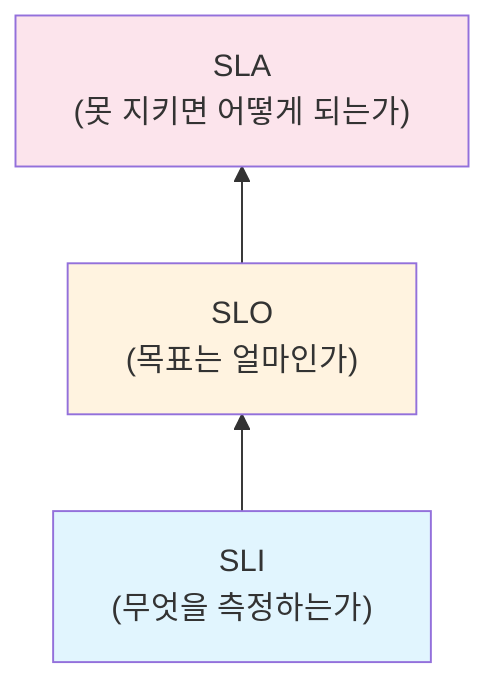
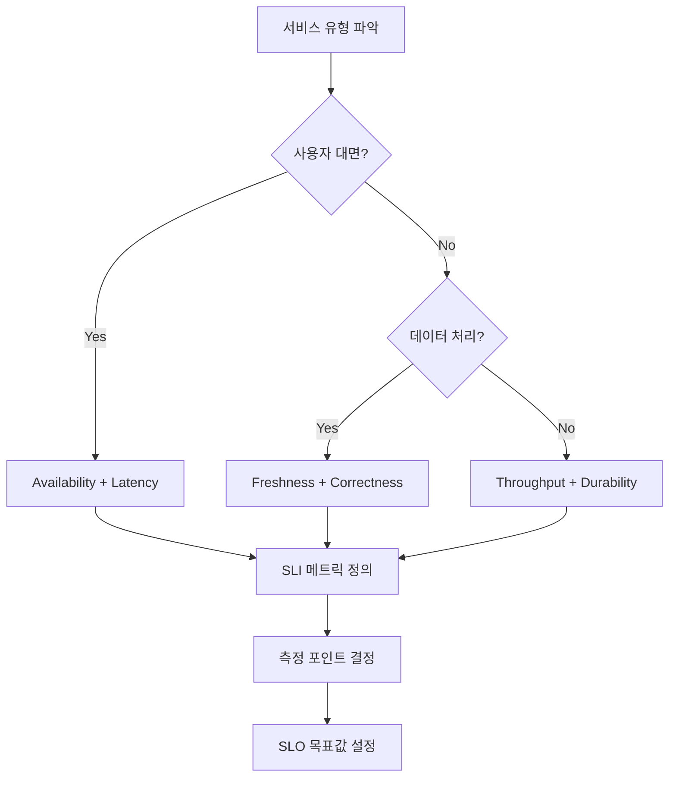

# SLA/SLO/SLI 개념과 설계 - 서비스 신뢰성 측정의 기초

서비스 신뢰성을 정량적으로 측정하고 관리하기 위한 세 가지 핵심 개념인 SLI, SLO, SLA의 정의와 관계, 그리고 실무에서의 설계 방법을 다룬다.

## 목차
- [1. 핵심 개념 (What)](#1-핵심-개념-what)
- [2. 왜 알아야 하는가 (Why)](#2-왜-알아야-하는가-why)
- [3. 내부 구현 분석 (How)](#3-내부-구현-분석-how)
- [4. 실전 예제](#4-실전-예제)
- [5. 정리](#5-정리)

---

## 1. 핵심 개념 (What)

### SLI (Service Level Indicator)

SLI는 서비스 수준을 **측정하는 지표**다. 일반적으로 0%~100% 사이의 비율(ratio)로 표현한다.

```
SLI = (양호한 이벤트 수) / (전체 이벤트 수) × 100%
```

주요 SLI 유형:

| SLI 유형 | 측정 대상 | 예시 |
|----------|----------|------|
| Availability | 정상 응답 비율 | 성공 요청 / 전체 요청 |
| Latency | 응답 시간 | p99 < 200ms 요청 비율 |
| Throughput | 처리량 | 초당 처리 가능한 요청 수 |
| Error Rate | 에러 비율 | 5xx 응답 / 전체 응답 |
| Correctness | 정확성 | 올바른 결과 반환 비율 |
| Freshness | 데이터 최신성 | 1분 이내 갱신된 데이터 비율 |
| Durability | 데이터 내구성 | 데이터 손실 없이 보존된 비율 |

### SLO (Service Level Objective)

SLO는 SLI에 대한 **목표값**이다. "이 정도는 달성하겠다"는 내부 약속이다.

```
SLO 예시:
- "월간 가용성 SLI ≥ 99.9%"
- "p99 지연시간 SLI ≥ 95% (200ms 이내)"
- "일간 에러율 SLI ≤ 0.1%"
```

### SLA (Service Level Agreement)

SLA는 SLO에 **비즈니스 결과(보상/페널티)**를 결합한 계약이다. 고객과의 공식적인 약속이다.

```
SLA 예시:
- "월간 가용성 99.95% 미달 시 서비스 크레딧 10% 제공"
- "월간 가용성 99.0% 미달 시 서비스 크레딧 30% 제공"
```

### 세 개념의 관계



```
SLI: "가용성은 현재 99.95%이다" (측정)
SLO: "가용성 99.9%를 목표로 한다" (목표)
SLA: "가용성 99.9% 미달 시 크레딧 제공" (계약)
```

**핵심 원칙**: SLA < SLO (SLO는 항상 SLA보다 엄격해야 한다)

## 2. 왜 알아야 하는가 (Why)

### 객관적 의사결정 기반

"서비스가 느려요"라는 주관적 보고 대신 "p99 latency SLI가 350ms로 SLO 200ms를 위반 중"이라는 객관적 데이터로 대응할 수 있다.

### Error Budget을 통한 속도-안정성 균형

SLO가 없으면 "더 안정적으로" vs "더 빠르게"라는 끝없는 논쟁이 반복된다. SLO는 Error Budget이라는 정량적 기준을 제공한다.

```
SLO = 99.9% → Error Budget = 0.1% = 월 43.2분

Error Budget 남음 → 새 기능 배포 OK
Error Budget 소진 → 안정성 작업에 집중
```

### 리소스 할당의 근거

모든 서비스에 99.99% 가용성이 필요하진 않다. SLO를 통해 비용 대비 적절한 신뢰성 수준을 결정할 수 있다.

| 가용성 | 월간 다운타임 | 비용 증가 | 적합한 서비스 |
|--------|-------------|----------|-------------|
| 99% | 7.2시간 | 기본 | 내부 도구, 배치 작업 |
| 99.9% | 43.2분 | 중간 | 일반 웹 서비스 |
| 99.95% | 21.6분 | 높음 | E-commerce, SaaS |
| 99.99% | 4.3분 | 매우 높음 | 결제, 인증 시스템 |
| 99.999% | 26초 | 극도로 높음 | 의료, 금융 핵심 |

## 3. 내부 구현 분석 (How)

### SLI 선정 프로세스



### 서비스 유형별 SLI 설계

**1. 요청-응답형 서비스 (API, Web)**
```
Primary SLI:
- Availability = count(status < 500) / count(total)
- Latency = count(duration < threshold) / count(total)

측정 포인트: Load Balancer 로그 (서버측보다 사용자 경험에 가까움)
```

**2. 데이터 파이프라인 서비스 (Batch, ETL)**
```
Primary SLI:
- Freshness = count(updated_within_threshold) / count(total_records)
- Correctness = count(valid_output) / count(total_output)

측정 포인트: 파이프라인 출력 검증 시스템
```

**3. 스토리지 서비스 (DB, Object Storage)**
```
Primary SLI:
- Durability = count(data_preserved) / count(data_stored)
- Availability = count(successful_ops) / count(total_ops)

측정 포인트: 스토리지 시스템 내부 메트릭
```

### SLO 설정 전략

**Step 1**: 현재 성능 측정 (최소 2-4주)
```
현재 p50 latency: 45ms
현재 p95 latency: 120ms
현재 p99 latency: 280ms
현재 가용성: 99.97%
```

**Step 2**: 사용자 기대 수준 파악
```
사용자 조사 결과: 200ms 이내 응답을 기대
비즈니스 요구: 월 4시간 이상 다운타임 불가
```

**Step 3**: 달성 가능하면서 의미 있는 목표 설정
```
SLO 설정:
- Availability: 99.95% (현재 99.97%보다 약간 여유)
- Latency p99: 200ms (현재 280ms → 개선 필요)
```

### SLO Window 유형

| Window | 설명 | 장점 | 단점 |
|--------|------|------|------|
| Calendar (월/분기) | 매월 1일 리셋 | 단순, 리포트 쉬움 | 월초 장애와 월말 장애 가중치 동일 |
| Rolling (30일) | 항상 최근 30일 | 최신 상태 반영 | 과거 장애가 갑자기 사라짐 |

## 4. 실전 예제

### SLO 문서 템플릿

```yaml
# slo-definition.yaml
service: user-api
owner: platform-team
version: "2024-01-15"

slis:
  - name: availability
    description: "성공적으로 처리된 HTTP 요청 비율"
    formula: "count(http_status < 500) / count(total_requests)"
    measurement_point: "ALB access logs"
    good_event: "HTTP status code < 500"
    valid_event: "All HTTP requests (excluding health checks)"

  - name: latency
    description: "200ms 이내 응답한 요청 비율"
    formula: "count(duration < 200ms) / count(total_requests)"
    measurement_point: "ALB access logs"
    good_event: "Response time < 200ms"
    valid_event: "All HTTP requests with status < 500"

slos:
  - sli: availability
    target: 99.95
    window: rolling_30d
    error_budget_minutes: 21.6
    consequences:
      budget_below_50pct: "Alert to SRE team"
      budget_below_25pct: "Freeze non-critical deployments"
      budget_exhausted: "Freeze all deployments, incident review"

  - sli: latency
    target: 99.0
    window: rolling_30d
    consequences:
      budget_below_50pct: "Performance review sprint"
      budget_exhausted: "Dedicated performance improvement"

sla:
  availability_target: 99.9
  penalty:
    below_99_9: "10% service credit"
    below_99_0: "30% service credit"
  note: "SLA는 SLO보다 완화된 수치. SLO 위반 시 SLA 위반 전 대응 가능."
```

### 가용성 계산 예시

```python
# SLA/SLO 가용성 등급별 허용 다운타임 계산
MINUTES_PER_DAY = 24 * 60
MINUTES_PER_MONTH = 30 * MINUTES_PER_DAY
MINUTES_PER_YEAR = 365 * MINUTES_PER_DAY

availability_levels = [99.0, 99.5, 99.9, 99.95, 99.99, 99.999]

print(f"{'가용성':>10} | {'월간 다운타임':>14} | {'연간 다운타임':>14}")
print("-" * 48)

for avail in availability_levels:
    downtime_ratio = 1 - (avail / 100)
    monthly_minutes = MINUTES_PER_MONTH * downtime_ratio
    yearly_minutes = MINUTES_PER_YEAR * downtime_ratio

    def format_time(minutes):
        if minutes >= 60:
            return f"{minutes / 60:.1f}시간"
        elif minutes >= 1:
            return f"{minutes:.1f}분"
        else:
            return f"{minutes * 60:.0f}초"

    print(f"{avail:>9.3f}% | {format_time(monthly_minutes):>14} | {format_time(yearly_minutes):>14}")

# 출력:
#    가용성 |     월간 다운타임 |     연간 다운타임
# ------------------------------------------------
#   99.000% |         7.2시간 |         3.7일
#   99.500% |         3.6시간 |        1.8일
#   99.900% |        43.2분  |         8.8시간
#   99.950% |        21.6분  |         4.4시간
#   99.990% |         4.3분  |        52.6분
#   99.999% |        26초    |         5.3분
```

## 5. 정리

| 개념 | 정의 | 대상 | 예시 |
|------|------|------|------|
| SLI | 서비스 수준 지표 | 엔지니어링 팀 | 가용성 99.95% (측정값) |
| SLO | 서비스 수준 목표 | 내부 조직 | 가용성 ≥ 99.9% (목표) |
| SLA | 서비스 수준 계약 | 외부 고객 | 99.9% 미달 시 크레딧 제공 |
| Error Budget | 허용 가능한 실패량 | Dev + SRE | 월 43.2분 (0.1%) |

**핵심 설계 원칙**:
1. SLI는 사용자 경험에 가장 가까운 지점에서 측정한다
2. SLO는 현재 성능보다 약간 낮게, SLA는 SLO보다 더 낮게 설정한다
3. 모든 서비스에 같은 SLO를 적용하지 않는다 (비즈니스 중요도에 따라 차등)
4. SLO는 고정이 아니라 주기적으로 리뷰하고 조정한다

---
*참고: Google SRE Book Ch.4 (Service Level Objectives), The Site Reliability Workbook Ch.2*
