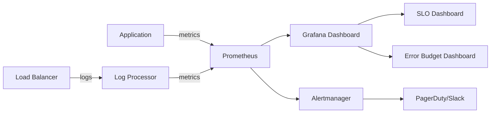
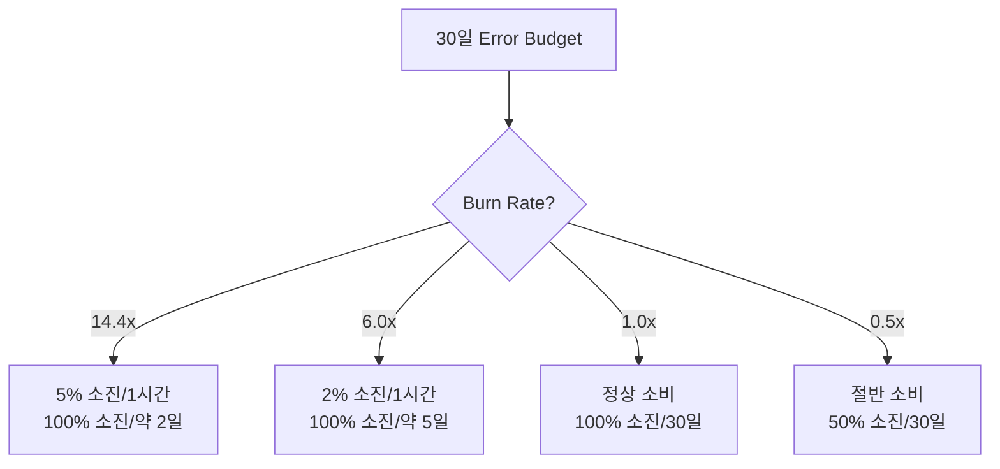

# SLA/SLO/SLI 실전 구현 - Prometheus와 Grafana를 활용한 SLO 모니터링

Prometheus와 Grafana를 활용하여 SLI 메트릭을 수집하고, SLO 대시보드를 구성하며, Error Budget 기반 알림을 설정하는 실전 구현 방법을 다룬다.

## 목차
- [1. 핵심 개념 (What)](#1-핵심-개념-what)
- [2. 왜 알아야 하는가 (Why)](#2-왜-알아야-하는가-why)
- [3. 내부 구현 분석 (How)](#3-내부-구현-분석-how)
- [4. 실전 예제](#4-실전-예제)
- [5. 정리](#5-정리)

---

## 1. 핵심 개념 (What)

### SLO 모니터링 아키텍처



### SLI 측정 방식

SLI를 측정하는 방법은 크게 세 가지다:

| 방식 | 설명 | 장점 | 단점 |
|------|------|------|------|
| Request Log | LB/프록시 로그 분석 | 가장 정확한 사용자 경험 | 처리 지연, 스토리지 비용 |
| Application Metrics | 앱 내부 메트릭 | 상세한 분석 가능 | 앱 장애 시 측정 불가 |
| Synthetic Monitoring | 외부에서 주기적 테스트 | 사용자 관점 측정 | 실제 트래픽 반영 어려움 |

### Burn Rate 개념

Burn Rate는 Error Budget을 소비하는 속도다. 1이면 정상, 1보다 크면 예산을 빠르게 소비 중이다.

```
Burn Rate = (실제 에러율) / (허용 에러율)

예시: SLO 99.9% (허용 에러율 0.1%)
- 실제 에러율 0.1% → Burn Rate = 1.0 (정상)
- 실제 에러율 1.0% → Burn Rate = 10.0 (위험!)
- 실제 에러율 0.05% → Burn Rate = 0.5 (여유)
```

## 2. 왜 알아야 하는가 (Why)

### 단순 임계값 알림의 한계

"에러율 > 1%이면 알림" 같은 단순 알림은 두 가지 문제가 있다:
1. **짧은 스파이크에 과잉 반응**: 1분간 2% 에러 → 알림 발생 → 자동 복구 → 무의미한 알림
2. **느린 악화 감지 실패**: 0.5% 에러가 3일간 지속 → 임계값 미달 → 알림 없음 → Error Budget 소진

Burn Rate 기반 알림은 이 두 문제를 모두 해결한다.

### Error Budget 기반 의사결정

실시간으로 Error Budget 소비율을 추적하면:
- "이번 달 배포 가능한 여유가 얼마나 남았는가?"
- "지난 장애로 Error Budget을 얼마나 소비했는가?"
- "현재 추세면 월말까지 Error Budget이 남는가?"

이런 질문에 데이터로 답할 수 있다.

## 3. 내부 구현 분석 (How)

### Prometheus SLI 메트릭 설계

**Availability SLI**:
```promql
# 5xx 에러를 제외한 성공 요청 비율 (30일 rolling)
sum(rate(http_requests_total{status!~"5.."}[30d]))
/
sum(rate(http_requests_total[30d]))
```

**Latency SLI**:
```promql
# 200ms 이내 응답 비율 (30일 rolling)
sum(rate(http_request_duration_seconds_bucket{le="0.2"}[30d]))
/
sum(rate(http_request_duration_seconds_count[30d]))
```

### Multi-Window, Multi-Burn-Rate Alert

Google SRE Workbook에서 제안하는 가장 정교한 알림 전략이다.

```
┌────────────────────────────────────────────────┐
│   Severity    │ Long Window │ Short Window │ Burn Rate │
├───────────────┼─────────────┼──────────────┼───────────┤
│   Page (P1)   │   1 hour    │   5 min      │    14.4   │
│   Page (P2)   │   6 hours   │   30 min     │    6.0    │
│   Ticket (P3) │   3 days    │   6 hours    │    1.0    │
└────────────────────────────────────────────────┘
```

원리:
- **Long Window**: 지속적인 문제인지 확인 (오탐 방지)
- **Short Window**: 현재도 진행 중인지 확인 (이미 복구된 문제에 알림 방지)
- **Burn Rate 14.4**: 이 속도면 5일 만에 30일 Error Budget 전부 소진

### Burn Rate 계산



## 4. 실전 예제

### Prometheus Recording Rules

```yaml
# prometheus-slo-rules.yaml
groups:
  - name: slo-recording-rules
    interval: 30s
    rules:
      # Availability SLI - 다양한 시간 윈도우
      - record: sli:availability:ratio_rate5m
        expr: |
          sum(rate(http_requests_total{status!~"5.."}[5m]))
          /
          sum(rate(http_requests_total[5m]))

      - record: sli:availability:ratio_rate30m
        expr: |
          sum(rate(http_requests_total{status!~"5.."}[30m]))
          /
          sum(rate(http_requests_total[30m]))

      - record: sli:availability:ratio_rate1h
        expr: |
          sum(rate(http_requests_total{status!~"5.."}[1h]))
          /
          sum(rate(http_requests_total[1h]))

      - record: sli:availability:ratio_rate6h
        expr: |
          sum(rate(http_requests_total{status!~"5.."}[6h]))
          /
          sum(rate(http_requests_total[6h]))

      - record: sli:availability:ratio_rate3d
        expr: |
          sum(rate(http_requests_total{status!~"5.."}[3d]))
          /
          sum(rate(http_requests_total[3d]))

      - record: sli:availability:ratio_rate30d
        expr: |
          sum(rate(http_requests_total{status!~"5.."}[30d]))
          /
          sum(rate(http_requests_total[30d]))

      # Latency SLI (p99 < 200ms)
      - record: sli:latency:ratio_rate5m
        expr: |
          sum(rate(http_request_duration_seconds_bucket{le="0.2"}[5m]))
          /
          sum(rate(http_request_duration_seconds_count[5m]))

      - record: sli:latency:ratio_rate1h
        expr: |
          sum(rate(http_request_duration_seconds_bucket{le="0.2"}[1h]))
          /
          sum(rate(http_request_duration_seconds_count[1h]))

      # Error Budget 남은 비율
      - record: slo:availability:error_budget_remaining
        expr: |
          1 - (
            (1 - sli:availability:ratio_rate30d)
            /
            (1 - 0.999)
          )
```

### Alertmanager Burn Rate Rules

```yaml
# prometheus-slo-alerts.yaml
groups:
  - name: slo-burn-rate-alerts
    rules:
      # P1: Burn Rate 14.4x - 1시간/5분 윈도우
      - alert: SLOAvailabilityBurnRateCritical
        expr: |
          (1 - sli:availability:ratio_rate1h) > (14.4 * 0.001)
          and
          (1 - sli:availability:ratio_rate5m) > (14.4 * 0.001)
        for: 2m
        labels:
          severity: critical
          slo: availability
        annotations:
          summary: "Availability SLO burn rate critical (14.4x)"
          description: |
            현재 burn rate: {{ $value | humanize }}
            이 속도면 약 2일 내 Error Budget 전량 소진.
            즉시 대응 필요.

      # P2: Burn Rate 6x - 6시간/30분 윈도우
      - alert: SLOAvailabilityBurnRateHigh
        expr: |
          (1 - sli:availability:ratio_rate6h) > (6.0 * 0.001)
          and
          (1 - sli:availability:ratio_rate30m) > (6.0 * 0.001)
        for: 5m
        labels:
          severity: warning
          slo: availability
        annotations:
          summary: "Availability SLO burn rate high (6x)"
          description: |
            현재 burn rate: {{ $value | humanize }}
            이 속도면 약 5일 내 Error Budget 전량 소진.

      # P3: Burn Rate 1x - 3일/6시간 윈도우
      - alert: SLOAvailabilityBurnRateSlow
        expr: |
          (1 - sli:availability:ratio_rate3d) > (1.0 * 0.001)
          and
          (1 - sli:availability:ratio_rate6h) > (1.0 * 0.001)
        for: 30m
        labels:
          severity: info
          slo: availability
        annotations:
          summary: "Availability SLO burn rate elevated (1x)"
          description: "Error Budget이 정상보다 빠르게 소비되고 있습니다."
```

### Grafana SLO Dashboard JSON (핵심 패널)

```json
{
  "panels": [
    {
      "title": "Current Availability SLI (30d rolling)",
      "type": "gauge",
      "targets": [
        {
          "expr": "sli:availability:ratio_rate30d * 100",
          "legendFormat": "Availability"
        }
      ],
      "fieldConfig": {
        "defaults": {
          "thresholds": {
            "steps": [
              { "value": 0, "color": "red" },
              { "value": 99.0, "color": "orange" },
              { "value": 99.9, "color": "yellow" },
              { "value": 99.95, "color": "green" }
            ]
          },
          "min": 98,
          "max": 100
        }
      }
    },
    {
      "title": "Error Budget Remaining (%)",
      "type": "stat",
      "targets": [
        {
          "expr": "slo:availability:error_budget_remaining * 100",
          "legendFormat": "Budget Remaining"
        }
      ]
    },
    {
      "title": "Burn Rate (1h window)",
      "type": "timeseries",
      "targets": [
        {
          "expr": "(1 - sli:availability:ratio_rate1h) / (1 - 0.999)",
          "legendFormat": "Burn Rate"
        }
      ]
    }
  ]
}
```

### OpenSLO Specification

```yaml
# openslo-spec.yaml
apiVersion: openslo/v1
kind: SLO
metadata:
  name: user-api-availability
  displayName: "User API Availability SLO"
spec:
  service: user-api
  description: "User API의 월간 가용성 SLO"
  budgetingMethod: Occurrences
  objectives:
    - displayName: "99.9% Availability"
      target: 0.999
      ratioMetrics:
        good:
          source: prometheus
          queryType: promql
          query: sum(rate(http_requests_total{service="user-api",status!~"5.."}[{{.window}}]))
        total:
          source: prometheus
          queryType: promql
          query: sum(rate(http_requests_total{service="user-api"}[{{.window}}]))
  timeWindow:
    - duration: 30d
      isRolling: true
  alertPolicies:
    - kind: AlertPolicy
      metadata:
        name: user-api-availability-burn-rate
      spec:
        conditions:
          - kind: burnrate
            threshold: 14.4
            lookbackWindow: 1h
            alertAfter: 2m
```

## 5. 정리

| 구성 요소 | 도구 | 핵심 설정 |
|-----------|------|----------|
| SLI 수집 | Prometheus Recording Rules | 5m, 30m, 1h, 6h, 3d, 30d 윈도우 |
| Burn Rate 알림 | Prometheus Alert Rules | P1(14.4x), P2(6x), P3(1x) |
| 대시보드 | Grafana | SLI 게이지, Error Budget, Burn Rate |
| 표준화 | OpenSLO | 벤더 중립 SLO 정의 |

**구현 핵심 원칙**:
1. Recording Rule로 미리 계산하여 쿼리 성능 확보
2. Multi-Window, Multi-Burn-Rate로 오탐과 미탐 최소화
3. Error Budget 잔량을 실시간으로 추적하여 의사결정에 활용
4. SLO를 코드로 관리 (OpenSLO, SLO-as-Code)

---
*참고: Google SRE Workbook Ch.5 (Alerting on SLOs), Prometheus Monitoring Mixins, OpenSLO Spec v1*
