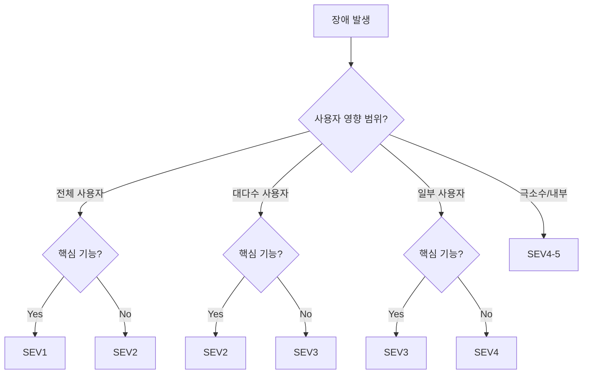
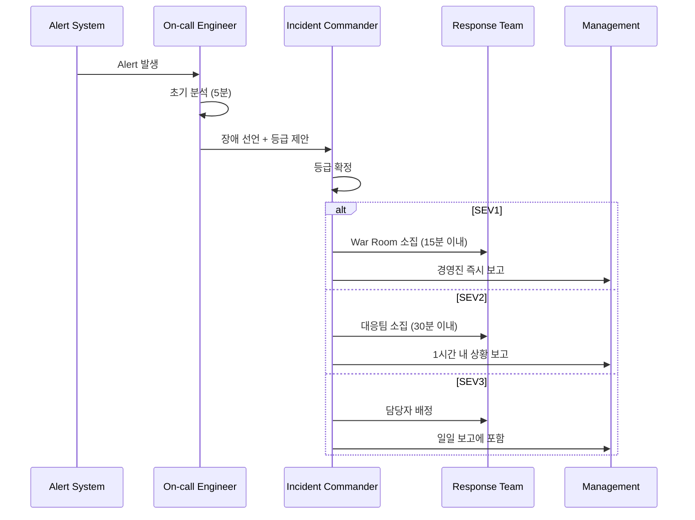

# 장애 등급 분류 체계 (Severity Level) - 체계적 장애 대응의 시작

장애 등급(Severity Level)은 장애의 영향도와 긴급도에 따라 대응 수준을 결정하는 분류 체계다. 이 문서에서는 SEV1~SEV5 등급의 정의와 기준, 각 등급별 대응 프로세스, 그리고 실제 기업 사례를 다룬다.

## 목차
- [1. 핵심 개념 (What)](#1-핵심-개념-what)
- [2. 왜 알아야 하는가 (Why)](#2-왜-알아야-하는가-why)
- [3. 내부 구현 분석 (How)](#3-내부-구현-분석-how)
- [4. 실전 예제](#4-실전-예제)
- [5. 정리](#5-정리)

---

## 1. 핵심 개념 (What)

### 장애 등급 정의

```
┌──────────┬──────────────────────────────────────────────┐
│  등급     │  설명                                         │
├──────────┼──────────────────────────────────────────────┤
│  SEV1    │  전체 서비스 중단, 데이터 유실, 보안 침해       │
│  SEV2    │  주요 기능 장애, 대규모 사용자 영향             │
│  SEV3    │  부분적 기능 장애, 일부 사용자 영향             │
│  SEV4    │  경미한 이슈, 우회 방법 존재                   │
│  SEV5    │  외관/UX 이슈, 서비스 영향 없음                │
└──────────┴──────────────────────────────────────────────┘
```

### 영향도 평가 매트릭스



### 각 등급별 상세 기준

**SEV1 - Critical**
- 전체 서비스 다운 (All users affected)
- 데이터 유실 또는 corruption 발생
- 보안 침해 (데이터 유출, 무단 접근)
- 결제/금융 트랜잭션 실패
- 대응 시간: 15분 이내 대응 시작
- 예시: 메인 DB 장애로 전체 서비스 중단, 고객 개인정보 유출

**SEV2 - High**
- 핵심 기능 불가 (로그인, 결제, 검색 등)
- 50% 이상 사용자에게 영향
- 성능 심각 저하 (응답 시간 10배 이상)
- 대응 시간: 30분 이내 대응 시작
- 예시: 결제 시스템 장애로 주문 불가, 특정 리전 전체 장애

**SEV3 - Medium**
- 보조 기능 장애 (알림, 리포트 등)
- 10-50% 사용자에게 영향
- 우회 방법(workaround) 존재
- 대응 시간: 4시간 이내 대응 시작
- 예시: 이메일 알림 지연, 대시보드 일부 차트 미표시

**SEV4 - Low**
- 경미한 기능 이슈
- 10% 미만 사용자 영향
- 우회 방법 명확
- 대응 시간: 다음 근무일 내
- 예시: 특정 브라우저에서 레이아웃 깨짐, 드물게 발생하는 에러

**SEV5 - Informational**
- 외관/UX 이슈
- 서비스 기능에 영향 없음
- 대응 시간: 백로그에 추가
- 예시: 오타, 색상 불일치, 개선 제안

## 2. 왜 알아야 하는가 (Why)

### 일관된 대응 보장

장애 등급 없이 "긴급해요!"라는 주관적 판단에 의존하면:
- 경미한 이슈에 과잉 대응 → 팀 피로도 증가
- 심각한 이슈에 과소 대응 → 장애 확대
- 대응 기준이 사람마다 달라 혼란 발생

### 리소스 최적화

모든 장애에 동일한 수준으로 대응할 수 없다. 등급에 따라 투입 인력, 커뮤니케이션 수준, 에스컬레이션 경로가 달라진다.

### 사후 분석과 메트릭

장애 등급이 있어야 "이번 분기 SEV1 장애 0건, SEV2 장애 3건" 같은 정량적 분석이 가능하다.

## 3. 내부 구현 분석 (How)

### 장애 선언(Declaration) 프로세스



### 등급별 대응 매트릭스

| 항목 | SEV1 | SEV2 | SEV3 | SEV4 |
|------|------|------|------|------|
| 대응 시작 | 15분 | 30분 | 4시간 | 다음 근무일 |
| Incident Commander | 필수 | 필수 | 선택 | 불필요 |
| War Room | 즉시 개설 | 필요 시 | 불필요 | 불필요 |
| 커뮤니케이션 | 15분 간격 | 30분 간격 | 일 1회 | 티켓 |
| 경영진 보고 | 즉시 | 1시간 내 | 일일 보고 | 불필요 |
| Status Page | 즉시 업데이트 | 즉시 업데이트 | 필요 시 | 불필요 |
| 포스트모템 | 필수 | 필수 | 선택 | 불필요 |
| 대응 인원 | 5-10명 | 3-5명 | 1-2명 | 1명 |

### 등급 변경(Escalation / De-escalation)

장애 진행 중 등급은 변경될 수 있다:

```
De-escalation 조건:
- 영향 범위 축소 (SEV1 → SEV2: 전체 장애 → 일부 기능)
- 우회 방법 확보 (SEV2 → SEV3: workaround 제공)

Escalation 조건:
- 영향 범위 확대 (SEV3 → SEV2: 추가 시스템으로 전파)
- 데이터 이슈 발견 (SEV2 → SEV1: 데이터 corruption 확인)
- 복구 시간 초과 (SEV2 → SEV1: 2시간 이상 미복구)
```

### 실제 기업 사례

**Google의 등급 체계**:
- P0: 전사 영향, VP 레벨 보고
- P1: 주요 제품 영향
- P2: 단일 서비스 영향
- P3: 경미한 이슈

**Meta의 등급 체계**:
- SEV0: 회사 전체 영향 (극히 드묾)
- SEV1: 주요 제품(Facebook, Instagram) 전체 장애
- SEV2: 주요 기능 장애
- SEV3-4: 부분적/경미한 이슈

**AWS의 등급 체계**:
- Critical: 리전 레벨 서비스 중단
- High: 단일 AZ 또는 주요 기능 장애
- Medium: 성능 저하
- Low: 경미한 이슈

## 4. 실전 예제

### 장애 등급 판정 Decision Tree (코드)

```python
from enum import Enum
from dataclasses import dataclass


class Severity(Enum):
    SEV1 = 1
    SEV2 = 2
    SEV3 = 3
    SEV4 = 4
    SEV5 = 5


@dataclass
class IncidentAssessment:
    user_impact_percentage: float  # 0-100
    is_core_functionality: bool    # 로그인, 결제, 핵심 API
    has_data_loss: bool
    has_security_breach: bool
    has_workaround: bool
    revenue_impact: bool           # 직접적 매출 영향


def classify_severity(assessment: IncidentAssessment) -> Severity:
    """장애 등급 자동 분류"""

    # SEV1 조건: 데이터 유실, 보안 침해, 또는 전체 서비스 중단
    if assessment.has_data_loss or assessment.has_security_breach:
        return Severity.SEV1

    if assessment.user_impact_percentage >= 90 and assessment.is_core_functionality:
        return Severity.SEV1

    # SEV2 조건: 핵심 기능 장애 또는 대규모 영향
    if assessment.is_core_functionality and assessment.user_impact_percentage >= 50:
        return Severity.SEV2

    if assessment.revenue_impact and assessment.user_impact_percentage >= 30:
        return Severity.SEV2

    # SEV3 조건: 부분적 장애
    if assessment.user_impact_percentage >= 10:
        return Severity.SEV3

    if assessment.is_core_functionality and not assessment.has_workaround:
        return Severity.SEV3

    # SEV4 조건: 경미한 이슈
    if assessment.user_impact_percentage > 0:
        return Severity.SEV4

    # SEV5: 기능 영향 없음
    return Severity.SEV5


# 사용 예시
incident = IncidentAssessment(
    user_impact_percentage=100,
    is_core_functionality=True,
    has_data_loss=False,
    has_security_breach=False,
    has_workaround=False,
    revenue_impact=True,
)
print(f"Severity: {classify_severity(incident)}")  # SEV1
```

### 장애 등급 정의서 템플릿

```yaml
# severity-definitions.yaml
organization: "MyCompany"
version: "2024-01"
last_reviewed: "2024-01-15"

severity_levels:
  SEV1:
    name: "Critical"
    description: "전체 서비스 중단 또는 데이터/보안 이슈"
    criteria:
      - "전체 사용자 서비스 이용 불가"
      - "데이터 유실 또는 corruption"
      - "보안 침해 (데이터 유출, 무단 접근)"
      - "결제/금융 시스템 완전 장애"
    response:
      initial_response: "15분"
      incident_commander: required
      war_room: required
      communication_interval: "15분"
      executive_notification: immediate
      status_page: required
      postmortem: required
    escalation_path:
      - "On-call Engineer → Team Lead → Engineering Director → VP/CTO"

  SEV2:
    name: "High"
    description: "주요 기능 장애, 대규모 사용자 영향"
    criteria:
      - "핵심 기능 불가 (로그인, 결제, 핵심 API)"
      - "50% 이상 사용자 영향"
      - "심각한 성능 저하 (응답 10x 이상)"
    response:
      initial_response: "30분"
      incident_commander: required
      war_room: as_needed
      communication_interval: "30분"
      executive_notification: "1시간 내"
      status_page: required
      postmortem: required
    escalation_path:
      - "On-call Engineer → Team Lead → Engineering Director"

  SEV3:
    name: "Medium"
    description: "부분적 기능 장애, 일부 사용자 영향"
    criteria:
      - "보조 기능 장애"
      - "10-50% 사용자 영향"
      - "우회 방법 존재"
    response:
      initial_response: "4시간"
      incident_commander: optional
      communication_interval: "일 1회"
      postmortem: optional

  SEV4:
    name: "Low"
    description: "경미한 이슈, 우회 방법 존재"
    response:
      initial_response: "다음 근무일"
      tracked_via: "JIRA ticket"
      postmortem: not_required

  SEV5:
    name: "Informational"
    description: "외관/UX 이슈, 서비스 영향 없음"
    response:
      tracked_via: "Backlog item"
```

## 5. 정리

| 등급 | 영향 | 대응 시간 | IC | 포스트모템 |
|------|------|----------|-----|----------|
| SEV1 | 전체 중단/데이터/보안 | 15분 | 필수 | 필수 |
| SEV2 | 핵심 기능/대규모 | 30분 | 필수 | 필수 |
| SEV3 | 부분적/우회 가능 | 4시간 | 선택 | 선택 |
| SEV4 | 경미한 이슈 | 다음 근무일 | 불필요 | 불필요 |
| SEV5 | 외관/UX | 백로그 | 불필요 | 불필요 |

**핵심 원칙**:
1. 의심스러우면 높은 등급으로 선언한다 (Over-declare > Under-declare)
2. 등급은 변경 가능하다 (Escalation / De-escalation)
3. 등급 기준은 조직 전체가 합의해야 한다
4. 정기적으로 등급 기준을 리뷰하고 업데이트한다

---
*참고: PagerDuty Incident Response Guide, Google SRE Book Ch.14, Atlassian Incident Management Handbook*
