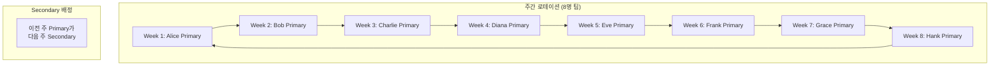
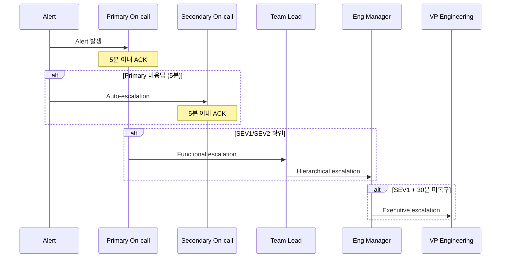

# On-call 프로세스와 에스컬레이션 - 효과적인 당직 체계 구축

On-call은 프로덕션 시스템의 안정성을 보장하기 위해 엔지니어가 교대로 장애에 대응하는 체계다. 이 문서에서는 On-call 로테이션 설계, 에스컬레이션 정책, 번아웃 방지 전략을 다룬다.

## 목차
- [1. 핵심 개념 (What)](#1-핵심-개념-what)
- [2. 왜 알아야 하는가 (Why)](#2-왜-알아야-하는가-why)
- [3. 내부 구현 분석 (How)](#3-내부-구현-분석-how)
- [4. 실전 예제](#4-실전-예제)
- [5. 정리](#5-정리)

---

## 1. 핵심 개념 (What)

### On-call의 정의

On-call Engineer는 지정된 기간 동안 프로덕션 시스템의 장애에 **최초 대응하는 역할**을 맡는다. 단순히 "전화를 받는 사람"이 아니라, 장애의 영향을 파악하고 초기 대응을 수행하며 필요 시 에스컬레이션하는 전문 역할이다.

### On-call 계층 구조

```
┌─────────────────────────────────────────────┐
│                On-call 계층                   │
├─────────────────────────────────────────────┤
│  Primary On-call (1차)                       │
│  ├── 모든 알림을 최초 수신                     │
│  ├── 5분 이내 Acknowledge                     │
│  └── 초기 분석 및 대응                         │
│                                              │
│  Secondary On-call (2차)                     │
│  ├── Primary 미응답 시 자동 에스컬레이션        │
│  ├── SEV1/2 장애 시 지원                      │
│  └── Primary의 백업                           │
│                                              │
│  Escalation Chain (3차+)                     │
│  ├── Team Lead / Engineering Manager         │
│  ├── Subject Matter Expert (SME)             │
│  └── VP / CTO (SEV1 Only)                   │
└─────────────────────────────────────────────┘
```

### 에스컬레이션의 유형

| 유형 | 설명 | 예시 |
|------|------|------|
| Automatic | 응답 시간 초과 시 자동 | Primary 5분 미응답 → Secondary |
| Functional | 전문 지식 필요 시 | DB 이슈 → DBA팀 |
| Hierarchical | 의사결정 권한 필요 시 | 서비스 중단 결정 → Manager |

## 2. 왜 알아야 하는가 (Why)

### 장애 대응 시간 단축

체계적인 On-call이 없으면 "누가 대응하지?"부터 시작해야 한다. 5분이면 될 대응이 30분 이상 지연될 수 있다.

### 엔지니어 번아웃 방지

비체계적인 On-call은 특정 엔지니어에게 부하가 집중된다. Google SRE는 On-call 빈도를 **최대 25%**(주간 기준)로 제한한다.

```
권장 로테이션:
- 최소 팀원 수: 8명 (주간 로테이션 기준)
- On-call 빈도: 12.5% (8주에 1주)
- 최대 허용: 25% (4주에 1주)
- 야간 호출: 주당 2회 미만 권장
```

### 지식 공유와 시스템 이해

On-call을 경험하면 시스템의 약점을 체감하게 된다. 이 경험이 더 나은 코드와 아키텍처로 이어진다.

## 3. 내부 구현 분석 (How)

### On-call 로테이션 설계



### 핸드오프(Handoff) 절차

On-call 교대 시 반드시 수행해야 하는 절차:

```
On-call 핸드오프 체크리스트:
━━━━━━━━━━━━━━━━━━━━━━━━━━━
□ 현재 진행 중인 이슈 인수인계
□ 최근 배포 이력 공유
□ 알려진 위험 요소 전달
□ 모니터링 대시보드 상태 확인
□ 페이저(PagerDuty) 로테이션 확인
□ 연락처(Secondary, SME) 확인
□ 핸드오프 문서에 기록
```

### 에스컬레이션 매트릭스



### On-call 보상 체계

| 항목 | 일반적 보상 | 비고 |
|------|-----------|------|
| On-call 수당 | 기본급의 5-15% 추가 | 주간 대기 기준 |
| 야간 호출 | 건당 추가 수당 | 실제 대응 시 |
| 주말/공휴일 | 1.5-2x 추가 | 대기 시간 전체 |
| 대체 휴무 | 야간 호출 후 익일 | 수면 보장 |
| 번아웃 보호 | 연속 2주 금지 | 정책으로 강제 |

### Google SRE의 On-call 원칙

1. **50% 규칙**: On-call 중에도 50% 이상은 엔지니어링 작업에 사용
2. **최대 2 이벤트/시프트**: 시프트당 평균 2건 이하의 알림
3. **야간 호출 후 대체 휴무**: 야간에 호출받으면 다음 날 휴식
4. **교육 필수**: On-call 투입 전 최소 1-2주 Shadow 기간

## 4. 실전 예제

### PagerDuty On-call Schedule 설정

```json
{
  "schedule": {
    "type": "schedule",
    "name": "Platform Team Primary",
    "time_zone": "Asia/Seoul",
    "schedule_layers": [
      {
        "name": "Primary On-call",
        "start": "2024-01-01T09:00:00+09:00",
        "rotation_virtual_start": "2024-01-01T09:00:00+09:00",
        "rotation_turn_length_seconds": 604800,
        "users": [
          {"user": {"id": "PUSER01", "type": "user_reference"}},
          {"user": {"id": "PUSER02", "type": "user_reference"}},
          {"user": {"id": "PUSER03", "type": "user_reference"}},
          {"user": {"id": "PUSER04", "type": "user_reference"}},
          {"user": {"id": "PUSER05", "type": "user_reference"}},
          {"user": {"id": "PUSER06", "type": "user_reference"}},
          {"user": {"id": "PUSER07", "type": "user_reference"}},
          {"user": {"id": "PUSER08", "type": "user_reference"}}
        ],
        "restrictions": []
      }
    ]
  }
}
```

### Escalation Policy 설정

```json
{
  "escalation_policy": {
    "type": "escalation_policy",
    "name": "Platform Service Escalation",
    "num_loops": 2,
    "escalation_rules": [
      {
        "escalation_delay_in_minutes": 5,
        "targets": [
          {
            "type": "schedule_reference",
            "id": "PRIMARY_SCHEDULE_ID"
          }
        ]
      },
      {
        "escalation_delay_in_minutes": 10,
        "targets": [
          {
            "type": "schedule_reference",
            "id": "SECONDARY_SCHEDULE_ID"
          }
        ]
      },
      {
        "escalation_delay_in_minutes": 15,
        "targets": [
          {
            "type": "user_reference",
            "id": "TEAM_LEAD_USER_ID"
          }
        ]
      }
    ]
  }
}
```

### On-call 핸드오프 템플릿

```markdown
# On-call 핸드오프 - Week 2024-W03

## 교대 정보
- **인계자**: Alice (2024-01-08 ~ 2024-01-14)
- **인수자**: Bob (2024-01-15 ~ 2024-01-21)
- **Secondary**: Alice (이전 Primary)

## 현재 진행 중인 이슈
| 이슈 | 상태 | 영향 | 다음 액션 |
|------|------|------|----------|
| PROD-1234: Redis 메모리 증가 추세 | 모니터링 중 | 없음 (아직) | 수요일까지 70% 초과 시 스케일업 |
| PROD-1230: 간헐적 504 에러 | 조사 중 | < 0.01% | upstream timeout 조정 테스트 중 |

## 최근 변경사항
- 01/10: user-api v2.3.1 배포 (신규 캐시 레이어)
- 01/12: DB read replica 1대 추가

## 주의 사항
- 01/17 예정: payment-service 마이그레이션 (SEV2 리스크)
- Redis 메모리 73% 상태, 증가 추세

## 대시보드 링크
- [Service Health](https://grafana.internal/d/service-health)
- [Error Budget](https://grafana.internal/d/error-budget)
- [On-call Runbook](https://wiki.internal/oncall-runbook)
```

### On-call 품질 메트릭 추적

```python
from dataclasses import dataclass
from datetime import timedelta


@dataclass
class OnCallMetrics:
    """On-call 시프트 품질 메트릭"""
    shift_duration: timedelta
    total_alerts: int
    acknowledged_within_sla: int  # 5분 이내 ACK
    false_positives: int
    pages_during_sleep: int       # 23:00 ~ 07:00 호출
    escalations: int
    mttr_minutes: float           # 평균 복구 시간

    @property
    def ack_rate(self) -> float:
        if self.total_alerts == 0:
            return 1.0
        return self.acknowledged_within_sla / self.total_alerts

    @property
    def noise_ratio(self) -> float:
        if self.total_alerts == 0:
            return 0.0
        return self.false_positives / self.total_alerts

    @property
    def alerts_per_day(self) -> float:
        days = self.shift_duration.total_seconds() / 86400
        return self.total_alerts / days if days > 0 else 0

    def health_report(self) -> dict:
        return {
            "총 알림": self.total_alerts,
            "일평균 알림": f"{self.alerts_per_day:.1f}",
            "SLA 내 ACK율": f"{self.ack_rate * 100:.1f}%",
            "오탐률": f"{self.noise_ratio * 100:.1f}%",
            "야간 호출": self.pages_during_sleep,
            "에스컬레이션": self.escalations,
            "평균 MTTR": f"{self.mttr_minutes:.0f}분",
            "상태": self._health_status(),
        }

    def _health_status(self) -> str:
        if self.alerts_per_day > 5:
            return "UNHEALTHY - 알림 과다 (Alert Fatigue 위험)"
        if self.noise_ratio > 0.3:
            return "UNHEALTHY - 오탐률 높음"
        if self.pages_during_sleep > 2:
            return "WARNING - 야간 호출 과다"
        return "HEALTHY"


# 사용 예시
metrics = OnCallMetrics(
    shift_duration=timedelta(days=7),
    total_alerts=12,
    acknowledged_within_sla=11,
    false_positives=3,
    pages_during_sleep=1,
    escalations=2,
    mttr_minutes=23.5,
)
print(metrics.health_report())
```

## 5. 정리

| 항목 | 권장 사항 |
|------|----------|
| 최소 팀 크기 | 8명 (주간 로테이션) |
| On-call 빈도 | 최대 25%, 권장 12.5% |
| 응답 SLA | 5분 이내 Acknowledge |
| 야간 호출 | 주당 2회 미만 |
| 핸드오프 | 체크리스트 기반 인수인계 |
| 보상 | 수당 + 대체 휴무 |
| Shadow | 투입 전 1-2주 |
| 메트릭 | ACK율, 오탐률, MTTR 추적 |

**핵심 원칙**:
1. On-call은 팀의 공유 책임이다 (특정인 고정 금지)
2. 알림은 Actionable해야 한다 (오탐 = Toil)
3. 야간 호출 후 반드시 대체 휴무를 보장한다
4. On-call 품질 메트릭을 정기적으로 리뷰한다

---
*참고: Google SRE Book Ch.11 (Being On-Call), PagerDuty On-Call Guide, Increment Magazine On-Call Issue*
