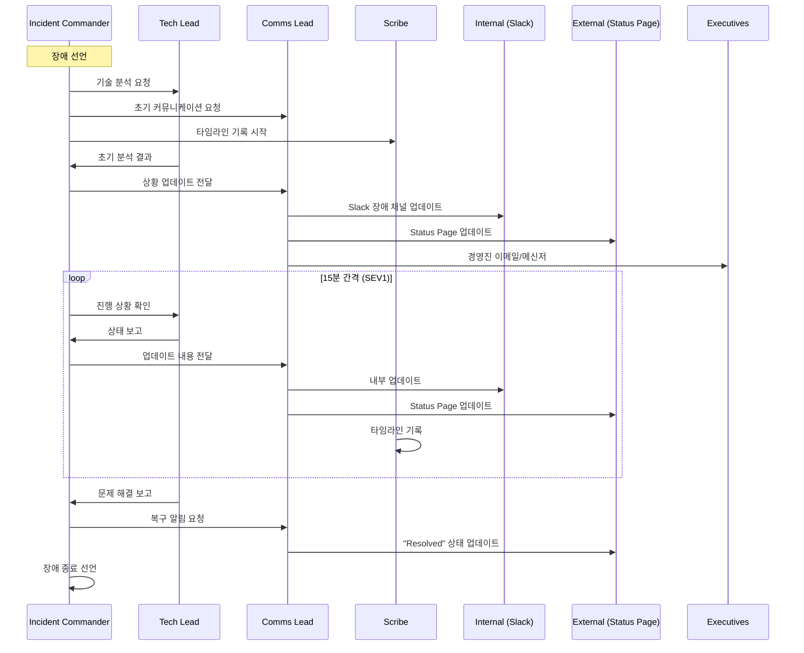
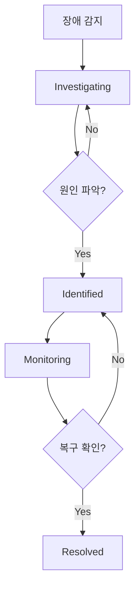

# 장애 커뮤니케이션 - Incident Commander와 효과적인 장애 소통

장애 대응에서 기술적 해결만큼 중요한 것이 커뮤니케이션이다. Incident Commander의 역할, War Room 운영, 내부/외부 소통 전략, Status Page 운영 방법을 다룬다.

## 목차
- [1. 핵심 개념 (What)](#1-핵심-개념-what)
- [2. 왜 알아야 하는가 (Why)](#2-왜-알아야-하는가-why)
- [3. 내부 구현 분석 (How)](#3-내부-구현-분석-how)
- [4. 실전 예제](#4-실전-예제)
- [5. 정리](#5-정리)

---

## 1. 핵심 개념 (What)

### 장애 대응 역할 (Incident Response Roles)

```
┌──────────────────────────────────────────────────┐
│            Incident Response Team                 │
├──────────────────────────────────────────────────┤
│                                                   │
│  Incident Commander (IC)                          │
│  ├── 전체 대응 조율                                │
│  ├── 의사결정 및 우선순위 결정                      │
│  └── 에스컬레이션 판단                             │
│                                                   │
│  Tech Lead (Operations Lead)                      │
│  ├── 기술적 분석 및 해결 주도                       │
│  ├── 엔지니어 작업 분배                             │
│  └── 기술적 의사결정                               │
│                                                   │
│  Communications Lead (Comms Lead)                 │
│  ├── 내부/외부 커뮤니케이션                         │
│  ├── Status Page 업데이트                          │
│  └── 고객/경영진 소통                              │
│                                                   │
│  Scribe (기록자)                                   │
│  ├── 타임라인 실시간 기록                           │
│  ├── 주요 의사결정 기록                             │
│  └── 포스트모템 초안 작성                           │
│                                                   │
└──────────────────────────────────────────────────┘
```

### Incident Commander의 핵심 역할

IC는 장애의 기술적 해결을 직접 수행하지 않는다. IC의 역할은 **조율(Coordination)**이다.

| 역할 | IC가 해야 할 것 | IC가 하지 말아야 할 것 |
|------|----------------|---------------------|
| 조율 | 작업 할당, 우선순위 결정 | 직접 코드 수정 |
| 소통 | 상황 업데이트 주기적 공유 | 혼자 문제 분석 |
| 의사결정 | 롤백/에스컬레이션 판단 | 기술 세부사항 파고들기 |
| 기록 | Scribe에게 기록 지시 | 모든 것을 직접 기록 |

### War Room

War Room은 장애 대응팀이 실시간으로 소통하는 공간이다.

- **물리적 War Room**: 회의실에 모여서 대응 (같은 사무실일 때)
- **가상 War Room**: Slack 채널 + Zoom/Google Meet (원격 근무)
- **하이브리드**: 물리적 공간 + 원격 참여자 동시 지원

## 2. 왜 알아야 하는가 (Why)

### 커뮤니케이션 실패 = 장애 확대

많은 장애가 기술적 문제가 아니라 **커뮤니케이션 실패**로 악화된다:

- 누가 무엇을 하고 있는지 모름 → 중복 작업
- 장애 상황이 공유되지 않음 → 잘못된 판단
- 고객에게 정보가 전달되지 않음 → 신뢰 하락
- 경영진이 상황을 모름 → 부적절한 개입

### 고객 신뢰 유지

장애 자체보다 장애에 대한 **소통 부재**가 더 큰 신뢰 손상을 가져온다.

```
고객 반응 비교:
━━━━━━━━━━━━━━━━━━━━━━━━━━━━
장애 + 빠른 소통 → "투명하네, 신뢰할 수 있어"
장애 + 소통 없음 → "뭐가 어떻게 된 거야? 다른 서비스 찾아보자"
```

## 3. 내부 구현 분석 (How)

### 장애 대응 커뮤니케이션 흐름



### 장애 채널 네이밍 컨벤션

```
Slack 채널 생성 규칙:
#incident-{YYYY-MM-DD}-{짧은설명}

예시:
#incident-2024-01-15-payment-timeout
#incident-2024-01-15-db-failover
#incident-2024-02-03-auth-outage
```

### Status Page 운영 전략



각 단계별 메시지:

| 상태 | 설명 | 업데이트 타이밍 |
|------|------|---------------|
| Investigating | "문제를 인지하고 조사 중" | 장애 감지 후 5분 이내 |
| Identified | "원인을 파악했고 해결 중" | 원인 파악 즉시 |
| Monitoring | "수정을 적용하고 모니터링 중" | 수정 적용 후 |
| Resolved | "문제가 해결됨" | 안정 확인 후 |

### 내부 커뮤니케이션 vs 외부 커뮤니케이션

| 항목 | 내부 (Slack/Email) | 외부 (Status Page/SNS) |
|------|-------------------|----------------------|
| 상세도 | 기술적 세부사항 포함 | 사용자 영향 중심 |
| 빈도 | 실시간 | 상태 변경 시 |
| 톤 | 기술적, 직접적 | 공감적, 전문적 |
| 내용 | 원인, 조치, 영향 범위 | 영향, 예상 복구, 우회 방법 |
| 대상 | 엔지니어, 경영진, CS팀 | 고객, 파트너 |

## 4. 실전 예제

### 장애 선언 메시지 템플릿

```markdown
# 장애 선언 - Slack #incident-2024-01-15-payment-timeout

🚨 **장애 선언 - SEV2**

**시간**: 2024-01-15 14:23 KST
**서비스**: payment-service
**영향**: 결제 요청 중 약 30%가 timeout 발생
**IC**: @alice
**Tech Lead**: @bob
**Comms Lead**: @charlie

**현재 상황**: payment-service에서 외부 PG사 연동 timeout 다수 발생.
사용자 결제 시도 중 일부 실패.

**다음 단계**: PG사 상태 확인 및 timeout 임계값 조정 검토 중.

**업데이트 주기**: 30분 간격
**War Room**: https://meet.google.com/xxx-yyyy-zzz
```

### Status Page 메시지 예시

```markdown
# Status Page 업데이트 예시

## Investigating (14:25 KST)
일부 사용자에게서 결제 처리 지연이 발생하고 있습니다.
현재 원인을 조사하고 있으며, 추가 정보가 확인되는 대로 업데이트하겠습니다.

## Identified (14:45 KST)
결제 처리 지연의 원인을 확인했습니다.
외부 결제 대행사와의 통신에서 간헐적 지연이 발생하고 있으며,
현재 우회 처리를 적용 중입니다.
결제에 실패한 경우, 잠시 후 다시 시도해 주세요.

## Monitoring (15:10 KST)
우회 처리를 적용했으며, 결제 성공률이 정상 수준으로 회복되고 있습니다.
현재 모니터링 중이며, 안정성이 확인되면 최종 업데이트하겠습니다.

## Resolved (15:40 KST)
결제 처리가 완전히 정상화되었습니다.
14:23 ~ 15:10 사이 일부 결제 시도에서 지연 또는 실패가 있었으며,
실패한 결제는 자동으로 재처리되었습니다.
불편을 드려 죄송합니다. 재발 방지를 위한 조치를 진행 중입니다.
```

### 경영진 보고 템플릿

```markdown
# 장애 경영진 보고 - SEV2 Payment Timeout

**상태**: 해결 완료 (Resolved)
**기간**: 2024-01-15 14:23 ~ 15:10 KST (47분)

## 비즈니스 영향
- 영향받은 사용자: 약 2,300명 (전체 사용자의 4.2%)
- 실패한 결제 건수: 약 340건
- 추정 매출 영향: 약 1,200만원 (재처리 완료)
- 고객 문의: CS팀 접수 15건

## 원인 (한 줄 요약)
외부 PG사(ABC페이)의 일시적 응답 지연으로 인한 결제 timeout 발생

## 대응
- 14:25 장애 선언, 14:45 원인 파악, 15:10 복구 완료
- 우회 처리(backup PG 전환)로 서비스 복구
- 실패 건 자동 재처리 완료

## 재발 방지
- [ ] PG사 이중화 구성 강화 (2주 내)
- [ ] Timeout 임계값 최적화 (1주 내)
- [ ] PG사 장애 시 자동 전환(failover) 구현 (1개월 내)
```

## 5. 정리

| 역할 | 책임 | 핵심 |
|------|------|------|
| Incident Commander | 전체 조율, 의사결정 | 직접 코드 수정하지 않음 |
| Tech Lead | 기술적 분석, 해결 | IC에게 상태 보고 |
| Comms Lead | 내부/외부 소통 | Status Page 업데이트 |
| Scribe | 타임라인 기록 | 실시간 기록 유지 |

**핵심 원칙**:
1. 장애는 개인이 아닌 팀으로 대응한다
2. IC는 조율에 집중하고, 기술적 해결은 Tech Lead에게 위임한다
3. Status Page는 빠르게, 자주, 솔직하게 업데이트한다
4. 과도한 정보보다 부족한 정보가 더 나쁘다 (Over-communicate)

---
*참고: PagerDuty Incident Response Guide, Google SRE Book Ch.14, Atlassian Incident Management Handbook*
