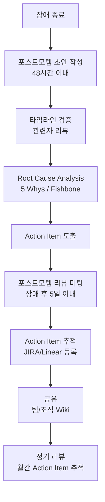

# 포스트모템(Post-mortem) 작성법 - Blameless 문화와 학습하는 조직

포스트모템은 장애 발생 후 원인을 분석하고 재발 방지 대책을 수립하는 문서이자 프로세스다. Blameless 문화 위에서 효과적인 포스트모템을 작성하고 운영하는 방법을 다룬다.

## 목차
- [1. 핵심 개념 (What)](#1-핵심-개념-what)
- [2. 왜 알아야 하는가 (Why)](#2-왜-알아야-하는가-why)
- [3. 내부 구현 분석 (How)](#3-내부-구현-분석-how)
- [4. 실전 예제](#4-실전-예제)
- [5. 정리](#5-정리)

---

## 1. 핵심 개념 (What)

### 포스트모템의 정의

포스트모템(Post-mortem, 사후 분석)은 장애 또는 중대한 이벤트가 발생한 후 수행하는 구조화된 분석 프로세스다. 목표는 **비난이 아닌 학습**이다.

### Blameless Post-mortem 철학

```
Blameless ≠ Accountless

Blameless: "왜 이 사람이 그런 판단을 했는가?" → 시스템/프로세스 개선
Blameful:  "누가 실수했는가?" → 개인 처벌

Blameless의 전제:
- 모든 사람은 그 시점에 가용한 정보로 최선의 판단을 했다
- 장애의 원인은 개인이 아니라 시스템에 있다
- 사람의 실수를 방지하는 것은 시스템의 책임이다
```

### 포스트모템 트리거 조건

모든 이슈에 포스트모템이 필요한 것은 아니다:

| 조건 | 포스트모템 필요 |
|------|---------------|
| SEV1 장애 | 필수 |
| SEV2 장애 | 필수 |
| SEV3 장애 | 선택 (학습 가치가 있으면) |
| 아차 사고 (Near-miss) | 권장 |
| 데이터 유실/보안 이슈 | 필수 |
| 반복 장애 (같은 유형 3회) | 필수 |
| 고객 영향 크레딧 발생 | 필수 |

## 2. 왜 알아야 하는가 (Why)

### 같은 장애 반복 방지

포스트모템 없이 장애를 넘기면 같은 원인으로 같은 장애가 반복된다.

```
포스트모템 없는 조직:
장애 A → 복구 → 장애 A 재발 → 복구 → 장애 A 재발...

포스트모템이 있는 조직:
장애 A → 복구 → 포스트모템 → Action Item → 장애 A 근본 해결
                                    → 유사 장애 B 예방
```

### 조직 지식의 축적

포스트모템은 **조직의 기억**이다. 팀원이 이직하거나 바뀌어도 과거 장애의 원인과 대응 방법이 문서로 남는다.

### 심리적 안전과 신뢰 구축

Blameless 포스트모템은 팀원들이 실수를 숨기지 않고 공유하게 만든다. 이는 빠른 장애 감지와 솔직한 원인 분석으로 이어진다.

## 3. 내부 구현 분석 (How)

### 포스트모템 프로세스



### Root Cause Analysis 기법

**1. 5 Whys (다섯 번의 왜)**

```
현상: 결제 서비스 30분간 장애 발생

Why 1: 왜 결제가 실패했는가?
→ 결제 서비스가 PG사 API에 연결하지 못했다.

Why 2: 왜 PG사 API에 연결하지 못했는가?
→ TLS 인증서가 만료되었다.

Why 3: 왜 인증서가 만료되었는가?
→ 인증서 갱신이 수동 프로세스였고, 담당자가 갱신을 잊었다.

Why 4: 왜 담당자가 갱신을 잊었는가?
→ 인증서 만료 알림이 설정되어 있지 않았다.

Why 5: 왜 만료 알림이 없었는가?
→ 인증서 관리에 대한 표준 프로세스가 없었다.

Root Cause: 인증서 생명주기 관리 프로세스/자동화 부재
```

**2. Fishbone Diagram (Ishikawa)**

```
                    ┌─────────────────────────┐
    인력             │                         │   프로세스
  ──────────────────▶│                         │◀──────────────────
  - 담당자 부재      │    결제 서비스           │  - 수동 갱신 프로세스
  - 인수인계 미흡    │    30분 장애             │  - 알림 미설정
                    │                         │  - 체크리스트 부재
  ──────────────────▶│                         │◀──────────────────
  - cert-manager    │                         │   환경
    미도입           └─────────────────────────┘  - 멀티 도메인 인증서
  - 모니터링 누락                                 - 스테이징 환경 없음
    도구
```

### Action Item 도출 원칙

좋은 Action Item의 조건 (SMART):

| 원칙 | 나쁜 예 | 좋은 예 |
|------|---------|---------|
| Specific | "모니터링 개선" | "인증서 만료 30일 전 Slack 알림 설정" |
| Measurable | "안정성 향상" | "인증서 자동 갱신 커버리지 100%" |
| Assignable | "누군가 해야 함" | "@bob이 cert-manager 도입 (JIRA-123)" |
| Realistic | "모든 장애 0건" | "인증서 관련 장애 0건" |
| Time-bound | "빨리" | "2주 이내 완료" |

Action Item 유형:

```
1. Mitigate (완화): 장애 재발 시 영향 축소
   예: "PG사 failover 로직 추가"

2. Prevent (예방): 장애 원인 제거
   예: "cert-manager로 자동 갱신"

3. Detect (감지): 장애 조기 발견
   예: "인증서 만료 30일 전 알림"

4. Process (프로세스): 대응 절차 개선
   예: "인증서 관리 런북 작성"
```

### 포스트모템 리뷰 미팅

```
포스트모템 리뷰 미팅 아젠다 (60분):

1. 개요 (5분)
   - 장애 요약, 영향 범위

2. 타임라인 워크스루 (15분)
   - 시간순으로 무슨 일이 있었는지 리뷰
   - "그 시점에 무엇을 알고 있었는가?" 관점

3. Root Cause Analysis (15분)
   - 5 Whys 또는 Fishbone 결과 공유
   - 참석자 의견 수렴

4. 잘한 점 (What went well) (10분)
   - 장애 대응에서 효과적이었던 부분

5. Action Items 리뷰 (15분)
   - 각 Action Item의 우선순위, 담당자, 기한 확정
   - JIRA 티켓 생성

규칙:
- 개인 비난 금지 ("누가 실수했나"가 아닌 "왜 시스템이 허용했나")
- 타임라인은 사실 기반 (추측 금지)
- 모든 관련자 참석 (가능한 한)
```

## 4. 실전 예제

### 포스트모템 템플릿 (Google SRE 기반)

```markdown
# Post-mortem: [제목]

**날짜**: YYYY-MM-DD
**작성자**: [이름]
**Severity**: SEV[1-5]
**장애 기간**: YYYY-MM-DD HH:MM ~ HH:MM (총 XX분)
**Status**: [Draft / In Review / Reviewed / Action Items Tracked]

## 요약
[2-3문장으로 장애 요약. 무엇이 발생했고, 어떤 영향이 있었으며, 어떻게 해결했는지.]

## 영향
- **사용자 영향**: [영향받은 사용자 수/비율, 영향 내용]
- **매출 영향**: [금액 또는 "해당 없음"]
- **데이터 영향**: [데이터 유실 여부]
- **SLA 영향**: [Error Budget 소비량]

## 타임라인 (모든 시간은 KST)

| 시간 | 이벤트 |
|------|--------|
| 14:00 | deployment-pipeline이 user-api v2.3.1 배포 시작 |
| 14:05 | 5xx 에러율 0.1% → 15% 급증 |
| 14:07 | PagerDuty alert 발생, @alice (Primary On-call) ACK |
| 14:10 | @alice가 Slack #incident-2024-01-15-api-errors 채널 생성 |
| 14:12 | SEV2 장애 선언, IC: @alice, Tech Lead: @bob |
| 14:20 | @bob: 최근 배포와 에러 시점 일치 확인 |
| 14:25 | 롤백 결정, v2.3.0으로 롤백 시작 |
| 14:30 | 롤백 완료, 에러율 정상화 시작 |
| 14:35 | 에러율 0.1% 이하로 복구 확인 |
| 14:40 | 장애 종료 선언 |

## Root Cause

[근본 원인 상세 설명]

### 5 Whys
1. Why: [현상에 대한 첫 번째 질문과 답]
2. Why: [두 번째 질문과 답]
3. Why: [세 번째 질문과 답]
4. Why: [네 번째 질문과 답]
5. Why: [다섯 번째 질문과 답 = Root Cause]

## 기여 요인 (Contributing Factors)
- [근본 원인 외에 장애를 악화시킨 요인들]

## 잘한 점 (What Went Well)
- [장애 대응에서 효과적이었던 부분]

## 개선할 점 (What Went Wrong)
- [장애 대응에서 부족했던 부분]

## Action Items

| # | 유형 | 설명 | 담당 | 기한 | 티켓 |
|---|------|------|------|------|------|
| 1 | Prevent | [예방 조치] | @name | MM/DD | JIRA-XXX |
| 2 | Detect | [감지 개선] | @name | MM/DD | JIRA-XXX |
| 3 | Mitigate | [완화 조치] | @name | MM/DD | JIRA-XXX |
| 4 | Process | [프로세스 개선] | @name | MM/DD | JIRA-XXX |

## 교훈 (Lessons Learned)
[이 장애에서 배운 핵심 교훈 1-3개]
```

### Action Item 추적 대시보드 쿼리

```sql
-- 포스트모템 Action Item 완료율 추적 (JIRA 데이터 기준)
SELECT
    DATE_TRUNC('month', pm.incident_date) AS month,
    COUNT(*) AS total_action_items,
    COUNT(CASE WHEN ai.status = 'Done' THEN 1 END) AS completed,
    COUNT(CASE WHEN ai.status = 'Done' THEN 1 END)::float
        / COUNT(*)::float * 100 AS completion_rate,
    COUNT(CASE WHEN ai.due_date < CURRENT_DATE
               AND ai.status != 'Done' THEN 1 END) AS overdue
FROM postmortems pm
JOIN action_items ai ON pm.id = ai.postmortem_id
WHERE pm.incident_date >= DATE_TRUNC('year', CURRENT_DATE)
GROUP BY 1
ORDER BY 1;
```

## 5. 정리

| 항목 | 핵심 |
|------|------|
| 철학 | Blameless - 시스템을 개선하지, 사람을 비난하지 않는다 |
| 트리거 | SEV1/2 필수, SEV3 선택, 데이터/보안 이슈 필수 |
| 시기 | 장애 후 48시간 내 초안, 5일 내 리뷰 미팅 |
| 분석 | 5 Whys, Fishbone Diagram |
| Action Item | SMART + 유형별(Prevent/Detect/Mitigate/Process) |
| 추적 | JIRA 등록, 월간 완료율 리뷰 |
| 공유 | 팀/조직 Wiki 공개 (학습 문화) |

**핵심 원칙**:
1. Blameless: "누가"가 아니라 "왜/어떻게"에 집중한다
2. 포스트모템을 쓰는 것보다 Action Item을 실행하는 것이 더 중요하다
3. 포스트모템은 비공개가 아니라 공유할수록 가치가 커진다
4. 완벽한 포스트모템보다 빠른 포스트모템이 낫다

---
*참고: Google SRE Book Ch.15 (Postmortem Culture), Etsy Debriefing Facilitation Guide, PagerDuty Post-Incident Review Guide*
