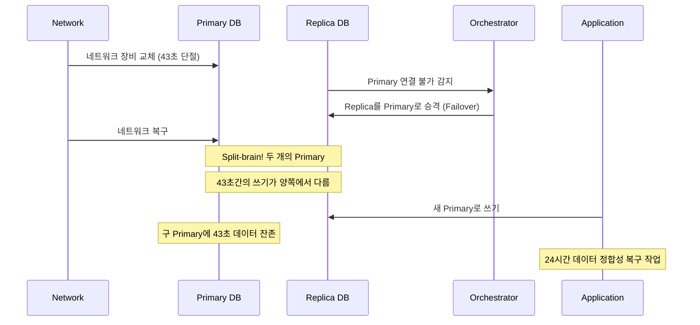
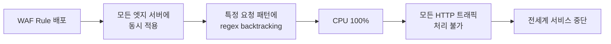

# 포스트모템 실전 사례 분석 - 대규모 장애에서 배우는 교훈

유명 IT 기업들의 공개 포스트모템을 분석하여 장애의 패턴, 대응 방법, 그리고 교훈을 학습한다. 실제 사례를 통해 효과적인 포스트모템 작성법을 익힌다.

## 목차
- [1. 핵심 개념 (What)](#1-핵심-개념-what)
- [2. 왜 알아야 하는가 (Why)](#2-왜-알아야-하는가-why)
- [3. 내부 구현 분석 (How)](#3-내부-구현-분석-how)
- [4. 실전 예제](#4-실전-예제)
- [5. 정리](#5-정리)

---

## 1. 핵심 개념 (What)

### 공개 포스트모템의 가치

많은 IT 기업들이 주요 장애의 포스트모템을 공개한다. 이는 투명성을 보여주는 동시에, 전체 업계의 학습에 기여한다.

### 장애 패턴 분류

```
┌──────────────────────────────────────────────────┐
│              장애의 일반적 패턴                      │
├──────────────────────────────────────────────────┤
│  1. Cascading Failure  - 연쇄 장애               │
│  2. Configuration Error - 설정 오류               │
│  3. Capacity Exhaustion - 용량 초과               │
│  4. Dependency Failure  - 의존성 장애             │
│  5. Deploy-related      - 배포 관련 장애          │
│  6. Data Corruption     - 데이터 손상              │
│  7. Network Partition   - 네트워크 분리            │
│  8. Human Error         - 운영자 실수              │
└──────────────────────────────────────────────────┘
```

## 2. 왜 알아야 하는가 (Why)

### 다른 조직의 장애에서 배우기

자사 서비스에서 발생하기 전에 다른 조직의 사례로부터 미리 대비할 수 있다.

### 패턴 인식

비슷한 원인, 비슷한 전개, 비슷한 해결 방식의 장애가 반복된다. 패턴을 알면 대응 속도가 빨라진다.

## 3. 내부 구현 분석 (How)

### 사례 1: GitHub - 2018년 10월 Database Incident (24시간)

**요약**: MySQL 데이터베이스 클러스터의 네트워크 장비 교체 작업 중 43초간의 네트워크 단절이 발생하여 데이터베이스 split-brain 상태가 되었고, 데이터 정합성을 위해 24시간 동안 서비스가 영향을 받았다.



**타임라인**:
- 22:52 UTC: 네트워크 장비 교체로 43초 단절
- 22:54 UTC: Orchestrator가 자동 failover 실행
- 23:02 UTC: 내부 시스템 불일치 감지
- 다음 24시간: 데이터 정합성 복구 및 백로그 처리

**Root Cause**: 네트워크 단절 시간(43초)이 orchestrator의 failover 임계값보다 길었고, failover 후 원래 primary 복귀 시 데이터 정합성 보장 메커니즘이 부재했다.

**교훈**:
1. 자동 failover와 데이터 정합성은 동시에 해결해야 한다
2. 네트워크 유지보수 시 failover 자동화를 일시 중지하는 절차 필요
3. 데이터 정합성 > 가용성 (이 경우)

---

### 사례 2: AWS S3 - 2017년 2월 US-EAST-1 Outage (4시간)

**요약**: S3 팀의 한 엔지니어가 과금 시스템 디버깅 중 의도한 것보다 많은 서버를 제거하는 명령을 실행했다. S3의 인덱스 및 배치 하위 시스템의 서버가 대량 제거되어 S3와 그에 의존하는 수많은 AWS 서비스가 영향을 받았다.

```
장애 전파 경로:
S3 서버 제거 명령 (실수)
  └── S3 Index 시스템 다운
       └── S3 GET/PUT/LIST 실패
            ├── EC2 Dashboard 장애 (S3에 의존)
            ├── Lambda 장애 (S3에 의존)
            ├── ECS 장애 (S3에 의존)
            └── AWS Status Page 장애 (S3에 의존!)
                 └── AWS가 장애 상황을 Status Page에 표시 불가
```

**Root Cause**: 운영 도구가 대량 서버 제거에 대한 안전장치(safeguard)가 없었다. 제거 규모에 대한 제한이나 확인 절차가 없어 의도보다 많은 서버가 한 번에 제거됐다.

**교훈**:
1. 위험한 운영 명령에는 반드시 안전장치(rate limiter, confirmation)를 둔다
2. 핵심 서비스(S3)의 장애가 다른 모든 서비스에 전파되는 의존성을 인식한다
3. Status Page 자체가 장애 서비스에 의존하면 안 된다
4. 대규모 변경은 점진적으로 수행한다 (blast radius 제한)

---

### 사례 3: Cloudflare - 2019년 7월 Regex 장애 (27분)

**요약**: WAF(Web Application Firewall) 규칙 업데이트에 포함된 정규표현식이 과도한 CPU 사용을 유발하여 전 세계 Cloudflare 엣지 서버의 CPU가 100%에 도달, 전체 CDN 서비스가 27분간 중단되었다.

```
문제의 정규표현식 (단순화):
(?:(?:\"|'|\]|\}|\\|\d|(?:nan|infinity|true|false|null|undefined|symbol|math)|\`|\-|\+)+[)]*;?((?:\s|-|~|!|{}|\|\||\+)*.*(?:.*=.*)))

핵심 문제: Catastrophic Backtracking
- .*(?:.*=.*) 패턴이 입력 길이에 대해 지수적 시간 복잡도
- 정상 입력: 마이크로초
- 악의적/특수 입력: 수 초 ~ 수 분 (CPU 100%)
```



**Root Cause**: 정규표현식의 catastrophic backtracking 취약점. WAF 규칙 배포 시 정규표현식 복잡도 검증이 없었고, 전 세계 동시 배포(canary 없음)로 blast radius가 전체 인프라에 미쳤다.

**교훈**:
1. 정규표현식에 시간 제한(timeout)과 복잡도 검증을 적용한다
2. **Canary 배포**: 전 세계 동시 배포가 아닌, 일부 리전부터 점진 배포
3. 빠른 롤백 메커니즘이 중요하다 (Cloudflare는 kill switch로 빠르게 복구)
4. "코드"뿐 아니라 "설정/규칙"도 배포 파이프라인을 거쳐야 한다

## 4. 실전 예제

### 가상 시나리오: 포스트모템 작성 워크스루

다음은 가상의 E-commerce 서비스 장애에 대한 포스트모템 작성 예시다.

```markdown
# Post-mortem: 상품 검색 서비스 장애

**날짜**: 2024-01-20
**작성자**: Alice Kim
**Severity**: SEV2
**장애 기간**: 2024-01-20 10:15 ~ 11:42 KST (87분)
**Status**: Reviewed

## 요약
상품 검색 서비스의 Elasticsearch 클러스터에서 인덱스 재구축(reindex) 작업이
예상보다 많은 리소스를 소비하여 검색 응답 시간이 10초 이상으로 증가했다.
전체 사용자의 약 60%가 검색 기능을 정상적으로 사용할 수 없었다.

## 영향
- **사용자 영향**: 약 15,000명 (전체의 60%) 검색 기능 장애
- **매출 영향**: 추정 3,500만원 (검색 경유 주문 87분 중단)
- **데이터 영향**: 없음
- **SLA 영향**: Error Budget 42% 소비 (월간)

## 타임라인

| 시간 | 이벤트 |
|------|--------|
| 09:30 | 데이터팀이 상품 카탈로그 대량 업데이트 작업 시작 |
| 09:45 | Elasticsearch reindex 작업 자동 트리거 |
| 10:10 | ES 클러스터 CPU 사용률 85% 도달 |
| 10:15 | 검색 API p99 latency 3초 → 10초 급증 |
| 10:18 | Alertmanager → PagerDuty 알림 발생 |
| 10:20 | @bob (Primary On-call) ACK, 초기 분석 시작 |
| 10:25 | SEV2 장애 선언, IC: @bob |
| 10:30 | @charlie (ES 전문가) 합류, reindex 작업이 원인으로 파악 |
| 10:35 | reindex 작업 중단 시도 → API로 cancel 요청 |
| 10:40 | reindex cancel 완료, CPU 하락 시작 |
| 10:55 | CPU 60%로 하락, latency 개선 시작 |
| 11:20 | latency p99 < 500ms로 복구 |
| 11:42 | 안정성 확인, 장애 종료 선언 |

## Root Cause

### 5 Whys

1. **왜 검색이 느려졌는가?**
   ES 클러스터의 CPU가 85% 이상으로 올라가 쿼리 처리가 지연되었다.

2. **왜 CPU가 급등했는가?**
   대량 reindex 작업이 검색 쿼리와 동일한 클러스터에서 실행되었다.

3. **왜 reindex가 검색과 같은 클러스터에서 실행되었는가?**
   읽기/쓰기 분리가 되어 있지 않았다. 단일 클러스터로 운영 중이었다.

4. **왜 리소스 제한 없이 reindex가 실행되었는가?**
   reindex 작업에 request_per_second throttle이 설정되어 있지 않았다.

5. **왜 throttle 설정이 없었는가?**
   ES reindex 운영 가이드(런북)에 throttle 설정이 포함되어 있지 않았다.

**Root Cause**: Elasticsearch reindex 작업에 대한 리소스 제한(throttle)이 없었고,
읽기/쓰기 워크로드 분리가 되어 있지 않아 배치 작업이 실시간 쿼리에 영향을 미쳤다.

## 기여 요인
- 데이터팀의 대량 업데이트가 사전 공지 없이 실행됨
- ES 클러스터 CPU 알림 임계값이 90%로 너무 높게 설정되어 있었음

## 잘한 점
- On-call 엔지니어가 3분 이내 ACK
- ES 전문가(@charlie)가 빠르게 합류하여 원인 파악
- reindex cancel API 활용으로 빠른 원인 제거

## 개선할 점
- 데이터팀의 대량 작업에 대한 사전 리뷰 프로세스 부재
- reindex 관련 런북 미비
- CPU 알림 임계값이 너무 높았음

## Action Items

| # | 유형 | 설명 | 담당 | 기한 | 티켓 |
|---|------|------|------|------|------|
| 1 | Prevent | ES reindex에 requests_per_second throttle 기본 적용 | @charlie | 01/27 | SRVC-456 |
| 2 | Prevent | 읽기/쓰기 클러스터 분리 (장기) | @dave | 03/31 | SRVC-457 |
| 3 | Detect | ES CPU 알림 임계값 90% → 75% 조정 | @bob | 01/22 | SRVC-458 |
| 4 | Process | 대량 데이터 변경 시 사전 리뷰 프로세스 수립 | @alice | 02/03 | SRVC-459 |
| 5 | Process | ES reindex 런북 작성 (throttle, 시간대 가이드) | @charlie | 01/31 | SRVC-460 |

## 교훈
1. 배치 작업과 실시간 쿼리의 리소스 격리는 선택이 아닌 필수다
2. "항상 잘 돌아갔으니까"는 위험한 가정이다 (데이터 규모는 계속 증가)
3. 대량 작업에는 항상 throttle과 시간대 제한을 적용한다
```

## 5. 정리

### 주요 사례 비교

| 사례 | 원인 유형 | 기간 | 핵심 교훈 |
|------|----------|------|----------|
| GitHub 2018 | Network + Split-brain | 24시간 | 자동 failover 시 데이터 정합성 |
| AWS S3 2017 | Human Error + 안전장치 부재 | 4시간 | 위험 명령의 안전장치 필수 |
| Cloudflare 2019 | Regex + 전체 배포 | 27분 | Canary 배포, 입력 검증 |

### 공통 패턴

1. **Blast Radius 미제한**: 변경이 전체 시스템에 동시 적용
2. **안전장치 부재**: 위험한 작업에 확인/제한 메커니즘 없음
3. **의존성 인식 부족**: 핵심 서비스 장애 시 연쇄 영향
4. **모니터링 간극**: 문제를 충분히 빠르게 감지하지 못함
5. **점진적 배포 부재**: 전체 배포로 인한 영향 확대

---
*참고: GitHub Engineering Blog, AWS Post-Event Summary, Cloudflare Blog, SRE Weekly Newsletter*
