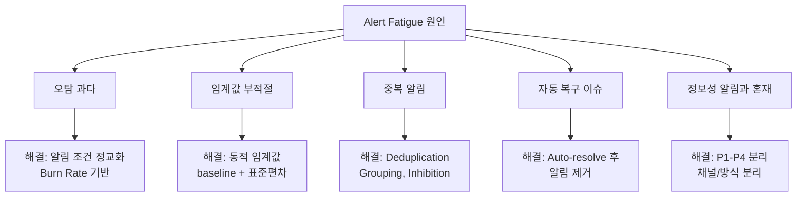

# Alert 설계와 Alert Fatigue 방지 - 의미 있는 알림 시스템 구축

효과적인 알림 시스템은 진짜 문제만 전달하고, 불필요한 알림으로 인한 피로를 방지한다. 이 문서에서는 좋은 Alert의 조건, Alert Fatigue의 원인과 해결책, 그리고 SLO 기반 알림 설계를 다룬다.

## 목차
- [1. 핵심 개념 (What)](#1-핵심-개념-what)
- [2. 왜 알아야 하는가 (Why)](#2-왜-알아야-하는가-why)
- [3. 내부 구현 분석 (How)](#3-내부-구현-분석-how)
- [4. 실전 예제](#4-실전-예제)
- [5. 정리](#5-정리)

---

## 1. 핵심 개념 (What)

### 좋은 Alert의 3가지 조건

```
┌────────────────────────────────────────────────┐
│          좋은 Alert의 조건 (ATC)                 │
├────────────────────────────────────────────────┤
│                                                 │
│  Actionable (행동 가능)                          │
│  ├── 받은 사람이 즉시 취할 수 있는 조치가 있다     │
│  └── "그래서 뭘 해야 하지?"가 나오면 나쁜 Alert    │
│                                                 │
│  Timely (적시)                                   │
│  ├── 문제 발생 후 충분히 빠르게 도달               │
│  └── 너무 빠르면 오탐, 너무 느리면 무용            │
│                                                 │
│  Contextual (맥락 제공)                           │
│  ├── 무엇이 문제인지 즉시 파악 가능                │
│  └── 대시보드 링크, 런북 링크 포함                 │
│                                                 │
└────────────────────────────────────────────────┘
```

### Alert 계층 구조

| 레벨 | 알림 방식 | 대응 | 예시 |
|------|----------|------|------|
| P1 (Page) | PagerDuty 호출 | 즉시 대응 (야간 포함) | 서비스 다운, 데이터 유실 |
| P2 (Page) | PagerDuty 호출 | 즉시 대응 (근무 시간) | 주요 기능 장애 |
| P3 (Notify) | Slack 알림 | 근무 시간 내 대응 | 성능 저하, 디스크 80% |
| P4 (Log) | 대시보드/티켓 | 다음 스프린트 | 경고 수준 메트릭 |

### Alert Fatigue 정의

Alert Fatigue(알림 피로)는 과도한 알림으로 인해 대응자가 알림에 둔감해지는 현상이다.

```
Alert Fatigue의 악순환:

과다 알림 → 무시 습관 → 중요 알림 놓침 → 장애 확대
    ↑                                        │
    └──────── "안전하게" 알림 추가 ◄────────────┘
```

## 2. 왜 알아야 하는가 (Why)

### Alert Fatigue의 실제 영향

연구에 따르면:
- 오탐률 30% 이상이면 대응자가 알림을 무시하기 시작한다
- On-call 시프트당 5건 이상의 알림은 번아웃을 유발한다
- 야간 알림이 주 2회 이상이면 이직률이 2배 증가한다

### 알림 품질 = 서비스 안정성

나쁜 알림 시스템은 두 가지 방식으로 서비스를 위험에 빠뜨린다:
1. **오탐 과다**: 진짜 문제를 놓치게 만듦
2. **미탐**: 실제 장애를 감지하지 못함

```
알림 품질 매트릭스:
                 실제 문제 O    실제 문제 X
알림 발생 O  │  True Positive  │  False Positive (오탐)  │
알림 발생 X  │  False Negative │  True Negative          │
              (미탐 - 위험!)
```

## 3. 내부 구현 분석 (How)

### Alert Fatigue의 주요 원인과 해결책



### Alertmanager의 3대 노이즈 제거 기능

**1. Grouping (그룹화)**
같은 원인의 알림을 하나로 묶는다.

```yaml
# 같은 서비스의 같은 유형 알림을 그룹화
route:
  group_by: ['service', 'alertname']
  group_wait: 30s        # 첫 알림 후 30초 대기 (같은 그룹 수집)
  group_interval: 5m     # 그룹 내 새 알림 추가 간격
  repeat_interval: 4h    # 같은 알림 반복 간격
```

**2. Inhibition (억제)**
상위 알림 발생 시 하위 알림을 억제한다.

```yaml
# 클러스터 다운이면 개별 노드 알림 억제
inhibit_rules:
  - source_match:
      alertname: 'ClusterDown'
    target_match:
      alertname: 'NodeDown'
    equal: ['cluster']
```

**3. Silencing (무음)**
계획된 유지보수 시 알림을 일시 중지한다.

```yaml
# API로 Silence 생성
# POST /api/v2/silences
{
  "matchers": [
    {"name": "service", "value": "payment-api", "isRegex": false}
  ],
  "startsAt": "2024-01-20T02:00:00Z",
  "endsAt": "2024-01-20T04:00:00Z",
  "createdBy": "alice",
  "comment": "Payment DB 마이그레이션 유지보수"
}
```

### SLO 기반 알림 vs 원인 기반 알림

| 방식 | 설명 | 장점 | 단점 |
|------|------|------|------|
| 원인 기반 | CPU > 90%, Memory > 80% | 직관적 | 오탐 많음, 사용자 영향과 괴리 |
| 증상 기반 | Error rate > 1%, Latency > 500ms | 사용자 경험 반영 | 원인 파악은 별도 |
| SLO 기반 | Burn Rate > 14.4x | 비즈니스 영향 직결 | 설정 복잡 |

**권장**: SLO 기반 알림을 주 알림으로, 원인 기반 알림은 진단용으로 사용

```
Alert 계층 구조 (권장):
━━━━━━━━━━━━━━━━━━━━━━━
Page (P1-P2):  SLO Burn Rate Alert만 사용
Notify (P3):   증상 기반 Alert (에러율, 지연시간)
Log (P4):      원인 기반 Alert (CPU, Memory, Disk)
```

### Alert 리뷰 프로세스

```
월간 Alert 리뷰 (1시간):
━━━━━━━━━━━━━━━━━━━━━
1. 지난 달 전체 알림 통계 리뷰
   - 총 알림 수, P1-P4 분포
   - 오탐률 (목표: < 10%)
   - 야간 호출 수

2. 각 알림별 분석
   - Actionable이었는가?
   - 임계값 적절한가?
   - 제거/수정/유지 결정

3. 누락된 알림 식별
   - 장애가 있었으나 알림이 없었던 경우
   - 새로 추가해야 할 알림

4. Action Item 도출
   - 제거할 알림 목록
   - 수정할 임계값
   - 추가할 알림
```

## 4. 실전 예제

### Alertmanager 전체 설정 예시

```yaml
# alertmanager.yml
global:
  resolve_timeout: 5m
  slack_api_url: 'https://hooks.slack.com/services/xxx'
  pagerduty_url: 'https://events.pagerduty.com/v2/enqueue'

route:
  receiver: 'default-slack'
  group_by: ['service', 'alertname']
  group_wait: 30s
  group_interval: 5m
  repeat_interval: 4h
  routes:
    # P1: Critical - PagerDuty 즉시 호출
    - match:
        severity: critical
      receiver: 'pagerduty-critical'
      group_wait: 10s
      repeat_interval: 1h

    # P2: Warning - PagerDuty (근무 시간)
    - match:
        severity: warning
      receiver: 'pagerduty-warning'
      group_wait: 30s
      repeat_interval: 2h

    # P3: Info - Slack 알림
    - match:
        severity: info
      receiver: 'slack-info'
      repeat_interval: 12h

receivers:
  - name: 'pagerduty-critical'
    pagerduty_configs:
      - routing_key: '<P1_ROUTING_KEY>'
        severity: critical
        description: '{{ .CommonAnnotations.summary }}'
        details:
          service: '{{ .CommonLabels.service }}'
          runbook: '{{ .CommonAnnotations.runbook_url }}'

  - name: 'pagerduty-warning'
    pagerduty_configs:
      - routing_key: '<P2_ROUTING_KEY>'
        severity: warning

  - name: 'slack-info'
    slack_configs:
      - channel: '#alerts-info'
        title: '{{ .CommonAnnotations.summary }}'
        text: '{{ .CommonAnnotations.description }}'

  - name: 'default-slack'
    slack_configs:
      - channel: '#alerts-default'

inhibit_rules:
  # 서비스 전체 다운이면 개별 엔드포인트 알림 억제
  - source_match:
      alertname: 'ServiceDown'
    target_match_re:
      alertname: 'EndpointSlow|EndpointError'
    equal: ['service']

  # Critical 알림 시 같은 서비스의 Warning 억제
  - source_match:
      severity: 'critical'
    target_match:
      severity: 'warning'
    equal: ['service', 'alertname']
```

### Alert 품질 메트릭 수집

```python
from dataclasses import dataclass, field
from datetime import datetime


@dataclass
class AlertMetrics:
    """월간 Alert 품질 메트릭"""
    month: str
    total_alerts: int = 0
    true_positives: int = 0
    false_positives: int = 0
    missed_incidents: int = 0  # 알림 없이 발견된 장애
    night_pages: int = 0       # 23:00-07:00 호출
    auto_resolved: int = 0     # 자동 복구된 알림
    alerts_by_priority: dict = field(default_factory=lambda: {
        "P1": 0, "P2": 0, "P3": 0, "P4": 0
    })

    @property
    def false_positive_rate(self) -> float:
        if self.total_alerts == 0:
            return 0.0
        return self.false_positives / self.total_alerts

    @property
    def signal_to_noise(self) -> float:
        if self.false_positives == 0:
            return float('inf')
        return self.true_positives / self.false_positives

    @property
    def actionable_rate(self) -> float:
        if self.total_alerts == 0:
            return 0.0
        non_actionable = self.false_positives + self.auto_resolved
        return 1 - (non_actionable / self.total_alerts)

    def report(self) -> str:
        return f"""
Alert Quality Report - {self.month}
{'=' * 40}
총 알림: {self.total_alerts}
  P1: {self.alerts_by_priority['P1']}, P2: {self.alerts_by_priority['P2']}
  P3: {self.alerts_by_priority['P3']}, P4: {self.alerts_by_priority['P4']}

오탐률: {self.false_positive_rate:.1%} (목표: < 10%)
Actionable률: {self.actionable_rate:.1%} (목표: > 80%)
Signal-to-Noise: {self.signal_to_noise:.1f}:1
야간 호출: {self.night_pages}건 (목표: < 4건/월)
놓친 장애: {self.missed_incidents}건 (목표: 0건)

상태: {'HEALTHY' if self.false_positive_rate < 0.1 and self.night_pages < 4 else 'NEEDS IMPROVEMENT'}
"""


# 사용 예시
metrics = AlertMetrics(
    month="2024-01",
    total_alerts=45,
    true_positives=38,
    false_positives=4,
    missed_incidents=0,
    night_pages=3,
    auto_resolved=3,
    alerts_by_priority={"P1": 2, "P2": 5, "P3": 25, "P4": 13},
)
print(metrics.report())
```

### Alert Rule 템플릿 (런북 연동)

```yaml
# prometheus-alert-with-runbook.yaml
groups:
  - name: service-alerts
    rules:
      - alert: HighErrorRate
        expr: |
          (1 - sli:availability:ratio_rate5m) > 0.01
        for: 5m
        labels:
          severity: warning
          service: "{{ $labels.service }}"
          team: platform
        annotations:
          summary: "{{ $labels.service }} 에러율 1% 초과"
          description: |
            서비스 {{ $labels.service }}의 에러율이
            {{ $value | humanizePercentage }}입니다.
            5분 이상 지속 중.
          runbook_url: "https://wiki.internal/runbooks/high-error-rate"
          dashboard_url: "https://grafana.internal/d/svc/{{ $labels.service }}"
          impact: "사용자 요청 중 {{ $value | humanizePercentage }}가 실패"
          action: |
            1. 대시보드 확인: {{ $externalURL }}/dashboard
            2. 최근 배포 확인: deploy history
            3. 에러 로그 확인: kibana link
            4. 런북 참조: {{ $labels.runbook_url }}
```

## 5. 정리

| 항목 | 권장 |
|------|------|
| 오탐률 | < 10% |
| Actionable률 | > 80% |
| 야간 호출 | < 주 2회 |
| On-call당 알림 | < 시프트당 5건 |
| 알림 리뷰 | 월 1회 |
| 주 알림 방식 | SLO Burn Rate 기반 |

**핵심 원칙**:
1. 모든 P1/P2 알림은 Actionable이어야 한다 (행동 불가능한 알림 = 노이즈)
2. 알림에는 반드시 런북 링크와 대시보드 링크를 포함한다
3. Grouping, Inhibition, Silencing으로 노이즈를 제거한다
4. 월간 Alert 리뷰로 알림 품질을 지속적으로 개선한다
5. "의심스러우면 알림 추가"가 아니라 "증명되면 알림 추가"

---
*참고: Google SRE Book Ch.6 (Monitoring Distributed Systems), Alertmanager Documentation, Rob Ewaschuk "My Philosophy on Alerting"*
