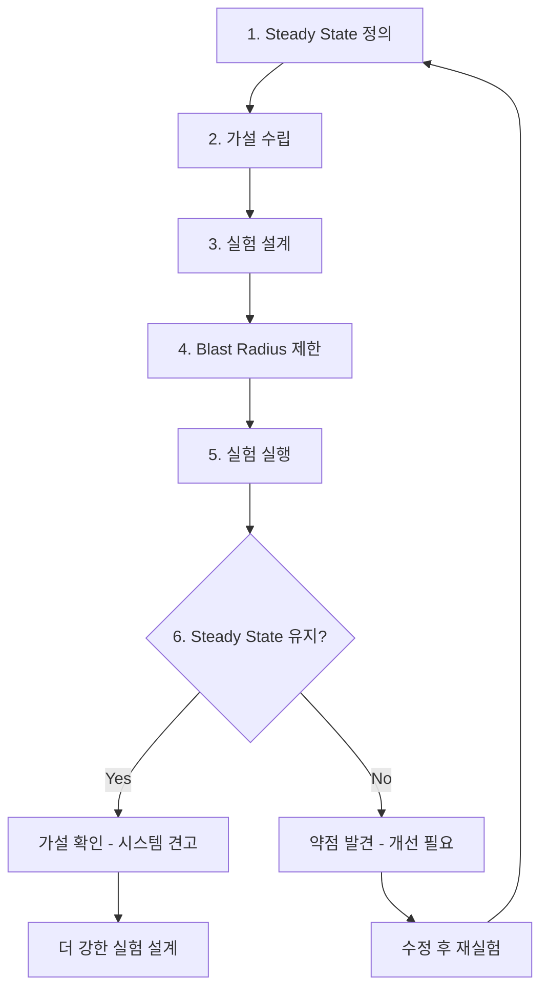
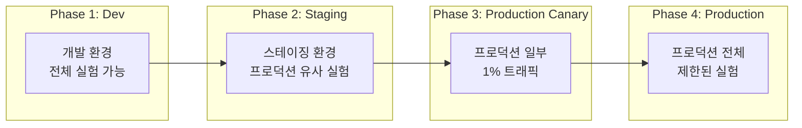

# Chaos Engineering 기초 - 장애 시뮬레이션으로 시스템 신뢰성 강화

Chaos Engineering은 프로덕션 시스템에 의도적으로 장애를 주입하여 약점을 발견하고 개선하는 방법론이다. Netflix에서 시작된 이 접근법의 원칙, 실험 설계 방법, 주요 도구를 다룬다.

## 목차
- [1. 핵심 개념 (What)](#1-핵심-개념-what)
- [2. 왜 알아야 하는가 (Why)](#2-왜-알아야-하는가-why)
- [3. 내부 구현 분석 (How)](#3-내부-구현-분석-how)
- [4. 실전 예제](#4-실전-예제)
- [5. 정리](#5-정리)

---

## 1. 핵심 개념 (What)

### Chaos Engineering의 정의

> "Chaos Engineering is the discipline of experimenting on a system in order to build confidence in the system's capability to withstand turbulent conditions in production."
> — Principles of Chaos Engineering

핵심은 **"실험"**이다. 무작위로 파괴하는 것이 아니라, **가설을 세우고 검증하는 과학적 접근**이다.

### Chaos Engineering의 4대 원칙 (Netflix)

```
┌──────────────────────────────────────────────────┐
│        Principles of Chaos Engineering            │
├──────────────────────────────────────────────────┤
│                                                   │
│  1. Steady State 가설 수립                         │
│     "정상 상태의 시스템 행동을 정의하라"              │
│                                                   │
│  2. 실제 세계의 이벤트를 모사                        │
│     "서버 다운, 네트워크 지연, 디스크 풀 등"          │
│                                                   │
│  3. 프로덕션에서 실험                               │
│     "스테이징은 프로덕션을 완벽히 재현하지 못한다"     │
│                                                   │
│  4. 자동화하여 지속적으로 실행                       │
│     "일회성이 아닌 CI/CD에 통합"                     │
│                                                   │
└──────────────────────────────────────────────────┘
```

### Chaos Engineering vs 무작위 파괴

| 항목 | Chaos Engineering | 무작위 파괴 |
|------|------------------|-----------|
| 가설 | 명확한 가설 수립 | 가설 없음 |
| 범위 | Blast Radius 제한 | 제한 없음 |
| 목적 | 시스템 약점 발견 | 스트레스 테스트 |
| 실행 | 통제된 실험 | 비통제 |
| 결과 | 학습과 개선 | 혼란 |
| 중단 | 위험 시 즉시 중단 | 중단 계획 없음 |

## 2. 왜 알아야 하는가 (Why)

### 분산 시스템의 복잡성

현대 시스템은 수십~수백 개의 마이크로서비스로 구성된다. 개별 서비스는 건강해도 **서비스 간 상호작용에서 예상치 못한 장애**가 발생한다.

```
마이크로서비스 장애 유형:
├── 네트워크 지연 증가 (Latency injection)
├── 서비스 응답 실패 (HTTP 500)
├── 서비스 완전 중단 (Connection refused)
├── 느린 응답 (Slow response - 가장 위험)
├── 부분 장애 (Partial failure)
└── 데이터 불일치 (Eventual consistency 문제)
```

### "잘 되고 있다"는 착각

테스트 환경에서 모든 것이 정상이라고 프로덕션에서도 정상이라는 보장은 없다. Chaos Engineering은 **"우리 시스템이 정말 장애에 강한가?"**라는 질문에 실험으로 답한다.

### 장애 복구 능력 검증

Chaos Engineering으로 검증할 수 있는 것:
- Auto-scaling이 실제로 작동하는가?
- Circuit Breaker가 제대로 열리는가?
- Failover가 데이터 손실 없이 수행되는가?
- 알림이 제때 발생하는가?
- 런북이 실제 상황에서도 유효한가?

## 3. 내부 구현 분석 (How)

### Chaos Experiment 설계 프로세스



### Steady State 정의 예시

```
서비스: user-api
Steady State 메트릭:
━━━━━━━━━━━━━━━━━━━━
- HTTP 성공률 > 99.9%
- p99 Latency < 200ms
- 분당 처리량 > 1000 RPS
- Error Budget 소비율 < 1x Burn Rate

가설: "Backend DB replica 1대를 종료해도
      user-api의 Steady State가 유지된다"
```

### Blast Radius 제어



Blast Radius 제한 방법:
1. **대상 제한**: 전체가 아닌 특정 인스턴스/Pod만
2. **시간 제한**: 최대 실험 시간 설정 (예: 5분)
3. **트래픽 제한**: 일부 사용자/요청만 영향
4. **자동 중단**: Steady State 위반 시 즉시 중단 (abort condition)

### 주요 Chaos Engineering 도구 비교

| 도구 | 대상 | 장점 | 단점 |
|------|------|------|------|
| Chaos Monkey (Netflix) | AWS EC2 인스턴스 | 심플, 검증됨 | EC2 전용 |
| Litmus Chaos | Kubernetes | 오픈소스, CRD 기반 | K8s 전용 |
| Gremlin | 모든 인프라 | 강력한 UI, 안전장치 | 유료 |
| Chaos Mesh | Kubernetes | CNCF, 다양한 실험 | K8s 전용 |
| AWS FIS | AWS 서비스 | AWS 네이티브 통합 | AWS 전용 |
| Toxiproxy | 네트워크 | 네트워크 장애 특화 | 범위 제한 |

### GameDay 운영

GameDay는 팀이 함께 모여 Chaos Experiment를 실행하고 대응을 연습하는 이벤트다.

```
GameDay 진행 순서:
━━━━━━━━━━━━━━━━
1. 준비 (1주 전)
   - 실험 시나리오 설계
   - 참가자 선정
   - Rollback 계획 수립
   - 모니터링 대시보드 준비

2. 브리핑 (30분)
   - 목적 설명
   - 규칙 안내 (abort condition)
   - 역할 배정 (실험자, 관찰자, 기록자)

3. 실험 실행 (2-4시간)
   - 시나리오별 장애 주입
   - 실시간 모니터링
   - 대응 관찰 및 기록

4. 디브리핑 (1시간)
   - 발견한 약점 정리
   - 잘 작동한 부분 공유
   - Action Item 도출

5. 사후 처리
   - 보고서 작성
   - Action Item JIRA 등록
   - 다음 GameDay 계획
```

## 4. 실전 예제

### Chaos Experiment 정의서 템플릿

```yaml
# chaos-experiment-definition.yaml
experiment:
  name: "db-replica-failure"
  description: "DB Read Replica 장애 시 서비스 가용성 검증"
  owner: "@alice"
  date: "2024-01-25"
  environment: staging

  steady_state:
    metrics:
      - name: "http_success_rate"
        query: "sum(rate(http_requests_total{status!~'5..'}[1m])) / sum(rate(http_requests_total[1m]))"
        threshold: "> 0.999"
      - name: "p99_latency"
        query: "histogram_quantile(0.99, rate(http_request_duration_seconds_bucket[1m]))"
        threshold: "< 0.2"

  hypothesis: |
    DB Read Replica 1대가 종료되더라도 나머지 Replica로
    트래픽이 분산되어 HTTP 성공률 99.9% 이상, p99 지연시간 200ms 이내를 유지한다.

  method:
    action: "Kill one DB read replica instance"
    target: "db-replica-2 (10.0.1.52)"
    duration: "5 minutes"
    blast_radius: "1 instance out of 3 replicas"

  abort_conditions:
    - "HTTP 성공률 < 99.0% (5분 이상 지속)"
    - "p99 지연시간 > 1초 (3분 이상 지속)"
    - "Error Budget 소비 > 5% (일간 기준)"

  rollback:
    - "DB Replica 인스턴스 재시작"
    - "필요 시 트래픽을 Primary로 전환"

  results:
    status: null  # pass / fail / aborted
    observations: null
    action_items: null
```

### 간단한 Chaos 실험 스크립트

```python
"""
간단한 Chaos Engineering 프레임워크
실제 프로덕션에서는 Litmus/Gremlin 같은 도구를 사용하세요.
"""
import subprocess
import time
import requests
from dataclasses import dataclass


@dataclass
class SteadyState:
    name: str
    check_url: str
    success_threshold: float
    latency_threshold_ms: float

    def verify(self) -> tuple[bool, dict]:
        """Steady State 검증"""
        try:
            start = time.time()
            resp = requests.get(self.check_url, timeout=5)
            latency_ms = (time.time() - start) * 1000

            is_healthy = (
                resp.status_code == 200
                and latency_ms < self.latency_threshold_ms
            )
            return is_healthy, {
                "status": resp.status_code,
                "latency_ms": round(latency_ms, 2),
            }
        except Exception as e:
            return False, {"error": str(e)}


@dataclass
class ChaosExperiment:
    name: str
    steady_state: SteadyState
    inject_command: str
    rollback_command: str
    duration_seconds: int
    check_interval_seconds: int = 10

    def run(self):
        print(f"=== Chaos Experiment: {self.name} ===")

        # Step 1: Verify Steady State (Before)
        print("\n[1/4] Verifying Steady State (before)...")
        healthy, metrics = self.steady_state.verify()
        if not healthy:
            print(f"  ABORT: Steady State not healthy: {metrics}")
            return

        print(f"  OK: {metrics}")

        # Step 2: Inject Chaos
        print(f"\n[2/4] Injecting chaos: {self.inject_command}")
        subprocess.run(self.inject_command, shell=True)

        # Step 3: Monitor
        print(f"\n[3/4] Monitoring for {self.duration_seconds}s...")
        violations = 0
        for i in range(0, self.duration_seconds, self.check_interval_seconds):
            time.sleep(self.check_interval_seconds)
            healthy, metrics = self.steady_state.verify()
            status = "OK" if healthy else "VIOLATION"
            print(f"  [{i + self.check_interval_seconds}s] {status}: {metrics}")
            if not healthy:
                violations += 1
                if violations >= 3:
                    print("  ABORT: 3 consecutive violations!")
                    break
            else:
                violations = 0

        # Step 4: Rollback
        print(f"\n[4/4] Rolling back: {self.rollback_command}")
        subprocess.run(self.rollback_command, shell=True)

        # Verify Steady State (After)
        time.sleep(10)  # Wait for recovery
        healthy, metrics = self.steady_state.verify()
        print(f"\nPost-rollback Steady State: {'OK' if healthy else 'FAIL'}: {metrics}")


# 사용 예시
if __name__ == "__main__":
    experiment = ChaosExperiment(
        name="Kill Redis Replica",
        steady_state=SteadyState(
            name="API Health",
            check_url="http://localhost:8080/health",
            success_threshold=0.999,
            latency_threshold_ms=200,
        ),
        inject_command="docker stop redis-replica-1",
        rollback_command="docker start redis-replica-1",
        duration_seconds=60,
        check_interval_seconds=10,
    )
    experiment.run()
```

### 점진적 Chaos Engineering 도입 로드맵

```
Level 0: 시작 (1개월)
├── GameDay 1회 실행 (스테이징)
├── 단일 서비스 장애 실험
└── 팀 내 Chaos Engineering 소개

Level 1: 기반 (1-3개월)
├── 정기 GameDay (월 1회)
├── 주요 서비스별 실험 시나리오 수립
├── Abort condition 및 rollback 자동화
└── 결과 문서화 프로세스 수립

Level 2: 확장 (3-6개월)
├── 프로덕션 Canary 실험 시작
├── CI/CD 파이프라인에 Chaos 테스트 통합
├── 크로스팀 GameDay
└── Chaos Engineering 도구 도입 (Litmus/Gremlin)

Level 3: 성숙 (6개월+)
├── 프로덕션 자동화된 Chaos 실험
├── 지속적 Chaos (Continuous Chaos)
├── 멀티 장애 시나리오
└── 조직 전체 Chaos Engineering 문화
```

## 5. 정리

| 항목 | 설명 |
|------|------|
| 정의 | 의도적 장애 주입을 통한 시스템 신뢰성 검증 |
| 핵심 | 가설 기반 실험 (무작위 파괴가 아님) |
| Steady State | 실험 전후로 검증할 정상 상태 메트릭 |
| Blast Radius | 실험 영향 범위를 항상 제한 |
| Abort Condition | 위험 시 즉시 중단하는 조건 |
| 도입 순서 | Dev → Staging → Prod Canary → Prod |
| GameDay | 팀이 함께 실험하고 학습하는 이벤트 |

**핵심 원칙**:
1. "파괴"가 아니라 "실험"이다 - 항상 가설을 세운다
2. Blast Radius를 항상 제한한다 - 작게 시작한다
3. Abort condition을 반드시 정의한다 - 위험하면 즉시 중단
4. 결과를 기록하고 공유한다 - 학습이 목적이다
5. 점진적으로 도입한다 - Dev부터 시작, Production은 마지막

---
*참고: Principles of Chaos Engineering (principlesofchaos.org), Netflix Tech Blog, Gremlin Chaos Engineering Guide*
