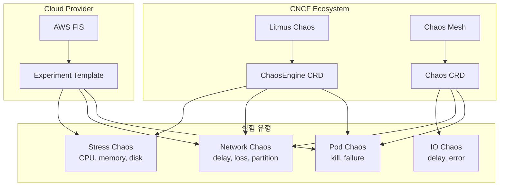
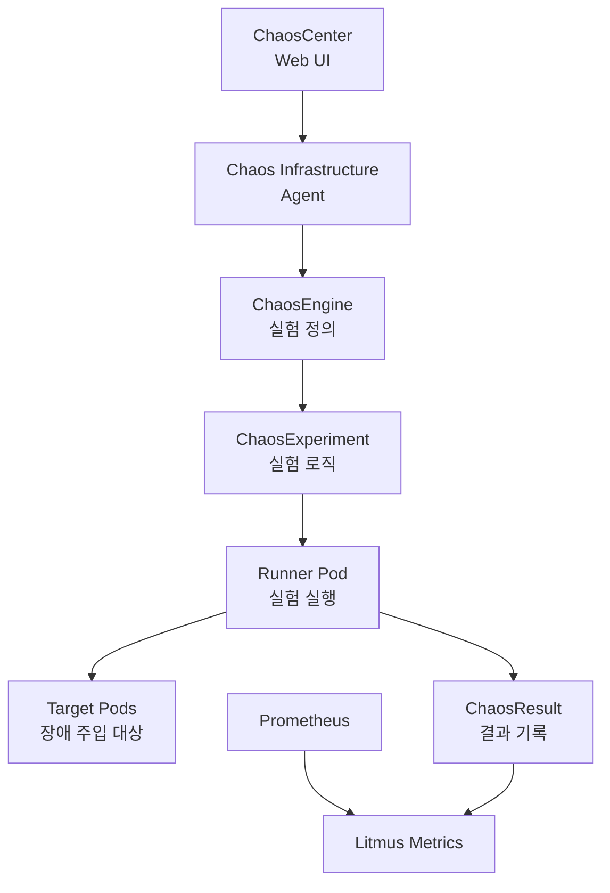
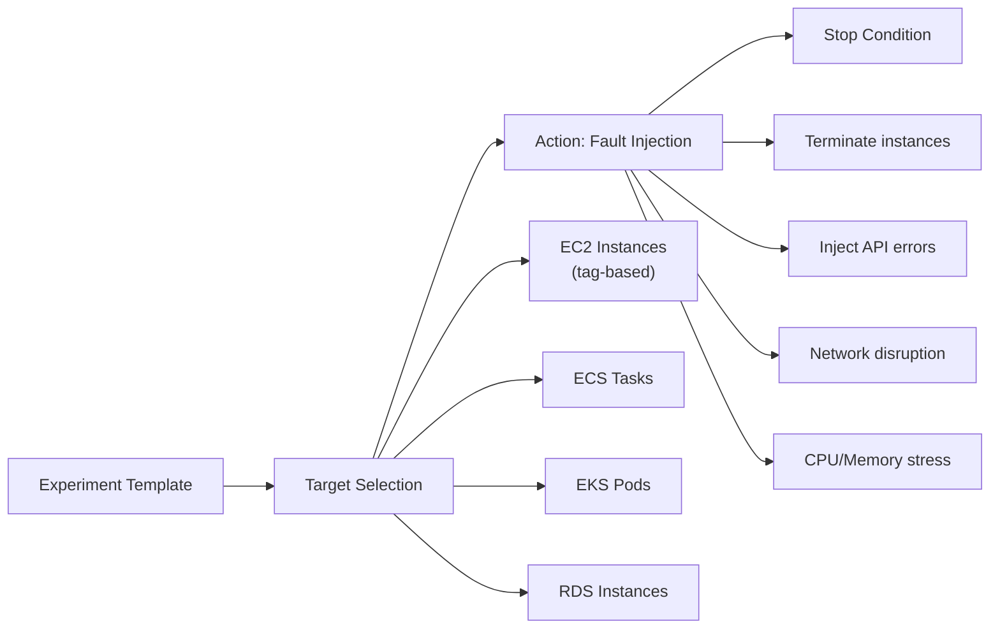

# Chaos Engineering 실전 - Kubernetes 환경에서의 장애 주입

Kubernetes 환경에서 Litmus Chaos와 AWS Fault Injection Simulator(FIS)를 활용한 실전 Chaos Engineering 실험 방법을 다룬다. 구체적인 실험 시나리오와 안전 가이드를 포함한다.

## 목차
- [1. 핵심 개념 (What)](#1-핵심-개념-what)
- [2. 왜 알아야 하는가 (Why)](#2-왜-알아야-하는가-why)
- [3. 내부 구현 분석 (How)](#3-내부-구현-분석-how)
- [4. 실전 예제](#4-실전-예제)
- [5. 정리](#5-정리)

---

## 1. 핵심 개념 (What)

### Kubernetes Chaos Engineering 도구



### 주요 장애 주입 유형

| 유형 | 설명 | 검증 대상 |
|------|------|----------|
| Pod Kill | Pod를 강제 종료 | Auto-restart, ReplicaSet |
| Pod Failure | Pod를 일정 시간 중단 | Health Check, Readiness Probe |
| Container Kill | 컨테이너만 종료 | Container restart policy |
| Network Latency | 네트워크 지연 주입 | Timeout 설정, Retry |
| Network Loss | 패킷 드롭 | Circuit Breaker |
| Network Partition | 네트워크 분리 | Split-brain 방지 |
| CPU Stress | CPU 부하 주입 | HPA, Resource Limits |
| Memory Stress | 메모리 소비 | OOMKill, Limits |
| Disk Fill | 디스크 채우기 | Log Rotation, Alerts |
| DNS Chaos | DNS 장애/지연 | DNS 캐시, Fallback |

## 2. 왜 알아야 하는가 (Why)

### Kubernetes의 복잡성

Kubernetes는 자체적으로 많은 복원력 메커니즘을 제공하지만, 실제로 잘 작동하는지는 테스트해봐야 안다.

```
검증해야 할 Kubernetes 복원력:
━━━━━━━━━━━━━━━━━━━━━━━━━━━
- Pod가 죽으면 ReplicaSet이 정말 재시작하는가?
- Readiness Probe가 실패하면 트래픽이 정말 차단되는가?
- HPA가 부하 증가 시 정말 스케일아웃하는가?
- PDB(Pod Disruption Budget)가 최소 Pod 수를 보장하는가?
- Node가 다운되면 Pod가 다른 Node로 재배치되는가?
```

### 설정 오류 조기 발견

Chaos 실험 없이는 다음과 같은 설정 오류가 실제 장애 때 발견된다:
- Liveness Probe 설정 오류 → CrashLoopBackOff
- Resource Limits 과소 → OOMKilled
- Anti-affinity 미설정 → 같은 Node에 모든 Pod
- PDB 미설정 → 노드 드레인 시 서비스 중단

## 3. 내부 구현 분석 (How)

### Litmus Chaos 아키텍처



### Litmus Chaos 설치

```bash
# Litmus 3.x 설치 (Helm)
helm repo add litmuschaos https://litmuschaos.github.io/litmus-helm/
helm repo update

# ChaosCenter 설치
helm install chaos litmuschaos/litmus \
  --namespace litmus \
  --create-namespace \
  --set portal.frontend.service.type=LoadBalancer

# 또는 kubectl로 직접 설치
kubectl apply -f https://litmuschaos.github.io/litmus/3.0.0/litmus-3.0.0.yaml
```

### 프로덕션 Chaos 실험 안전 가이드

```
프로덕션 Chaos 실험 체크리스트:
━━━━━━━━━━━━━━━━━━━━━━━━━━━━

실험 전:
□ Steady State 메트릭 확인 (현재 정상인가?)
□ 실험 시나리오 팀 리뷰 완료
□ Blast Radius 확인 (최대 영향 범위)
□ Abort condition 설정
□ Rollback 절차 준비
□ 관련 팀 사전 고지
□ 유지보수 윈도우 확인 (다른 작업과 겹치지 않는지)

실험 중:
□ 모니터링 대시보드 실시간 감시
□ Error Budget 소비율 추적
□ Abort condition 지속 확인
□ 타임라인 기록

실험 후:
□ Steady State 복구 확인
□ 실험 결과 문서화
□ 발견된 약점 Action Item 생성
□ 다음 실험 계획
```

### AWS Fault Injection Simulator (FIS)



## 4. 실전 예제

### Litmus ChaosEngine: Pod Kill 실험

```yaml
# pod-kill-experiment.yaml
apiVersion: litmuschaos.io/v1alpha1
kind: ChaosEngine
metadata:
  name: user-api-pod-kill
  namespace: production
spec:
  appinfo:
    appns: 'production'
    applabel: 'app=user-api'
    appkind: 'deployment'
  engineState: 'active'
  chaosServiceAccount: litmus-admin
  experiments:
    - name: pod-delete
      spec:
        components:
          env:
            # 종료할 Pod 수
            - name: TOTAL_CHAOS_DURATION
              value: '30'
            # 실험 지속 시간 (초)
            - name: CHAOS_INTERVAL
              value: '10'
            # Pod 삭제 간격 (초)
            - name: FORCE
              value: 'false'
            # Graceful shutdown
            - name: PODS_AFFECTED_PERC
              value: '50'
            # 전체 Pod의 50%만 영향
        probe:
          - name: "check-api-health"
            type: "httpProbe"
            mode: "Continuous"
            httpProbe/inputs:
              url: "http://user-api.production.svc:8080/health"
              method:
                get:
                  criteria: "=="
                  responseCode: "200"
            runProperties:
              probeTimeout: 5
              interval: 5
              retry: 3
```

### Litmus: Network Latency 실험

```yaml
# network-latency-experiment.yaml
apiVersion: litmuschaos.io/v1alpha1
kind: ChaosEngine
metadata:
  name: payment-network-latency
  namespace: production
spec:
  appinfo:
    appns: 'production'
    applabel: 'app=payment-service'
    appkind: 'deployment'
  engineState: 'active'
  chaosServiceAccount: litmus-admin
  experiments:
    - name: pod-network-latency
      spec:
        components:
          env:
            - name: TOTAL_CHAOS_DURATION
              value: '60'
            - name: NETWORK_LATENCY
              value: '500'
            # 500ms 지연 추가
            - name: JITTER
              value: '100'
            # +/- 100ms 랜덤 지연
            - name: DESTINATION_IPS
              value: '10.0.2.0/24'
            # 특정 서브넷(DB)으로만 지연 주입
            - name: NETWORK_INTERFACE
              value: 'eth0'
        probe:
          - name: "check-latency-slo"
            type: "promProbe"
            mode: "Continuous"
            promProbe/inputs:
              endpoint: "http://prometheus.monitoring:9090"
              query: "histogram_quantile(0.99, rate(http_request_duration_seconds_bucket{service='payment'}[1m]))"
              comparator:
                type: "float"
                criteria: "<="
                value: "2.0"
            # p99 latency가 2초를 넘으면 실패
            runProperties:
              probeTimeout: 5
              interval: 10
```

### Litmus: CPU Stress 실험

```yaml
# cpu-stress-experiment.yaml
apiVersion: litmuschaos.io/v1alpha1
kind: ChaosEngine
metadata:
  name: api-cpu-stress
  namespace: production
spec:
  appinfo:
    appns: 'production'
    applabel: 'app=user-api'
    appkind: 'deployment'
  engineState: 'active'
  chaosServiceAccount: litmus-admin
  experiments:
    - name: pod-cpu-hog
      spec:
        components:
          env:
            - name: TOTAL_CHAOS_DURATION
              value: '120'
            - name: CPU_CORES
              value: '2'
            # 2 CPU 코어 사용
            - name: CPU_LOAD
              value: '80'
            # 80% 부하
            - name: PODS_AFFECTED_PERC
              value: '30'
            # 30%의 Pod만 영향
        probe:
          - name: "check-hpa-scaleout"
            type: "k8sProbe"
            mode: "EOT"
            # End Of Test - 실험 종료 시 검증
            k8sProbe/inputs:
              group: "apps"
              version: "v1"
              resource: "deployments"
              namespace: "production"
              fieldSelector: "metadata.name=user-api"
              operation: "present"
            runProperties:
              probeTimeout: 30
              retry: 3
```

### AWS FIS Experiment Template

```json
{
  "description": "EKS Pod 장애 시 서비스 가용성 검증",
  "targets": {
    "eks-pods": {
      "resourceType": "aws:eks:pod",
      "selectionMode": "COUNT(2)",
      "resourceArns": [
        "arn:aws:eks:ap-northeast-2:123456789:cluster/prod-cluster"
      ],
      "parameters": {
        "clusterIdentifier": "prod-cluster",
        "namespace": "production",
        "selectorType": "labelSelector",
        "selectorValue": "app=user-api",
        "targetContainerName": "user-api"
      }
    }
  },
  "actions": {
    "kill-pods": {
      "actionId": "aws:eks:pod-delete",
      "parameters": {},
      "targets": {
        "Pods": "eks-pods"
      },
      "startAfter": []
    }
  },
  "stopConditions": [
    {
      "source": "aws:cloudwatch:alarm",
      "value": "arn:aws:cloudwatch:ap-northeast-2:123456789:alarm:high-error-rate"
    }
  ],
  "roleArn": "arn:aws:iam::123456789:role/FISExperimentRole",
  "tags": {
    "team": "platform-sre",
    "experiment": "pod-resilience"
  }
}
```

### Chaos 실험 결과 리포트 템플릿

```markdown
# Chaos Experiment Report

**실험명**: DB Replica Failure Resilience
**날짜**: 2024-01-25
**환경**: Staging (prod-like)
**실행자**: @alice

## 실험 요약
| 항목 | 값 |
|------|-----|
| 대상 서비스 | user-api (3 replicas) |
| 장애 유형 | DB Read Replica 1/3 종료 |
| 지속 시간 | 5분 |
| Blast Radius | DB Replica 1대 (33%) |

## Steady State 검증

| 메트릭 | 기준 | 실험 전 | 실험 중 | 실험 후 | 결과 |
|--------|------|---------|---------|---------|------|
| HTTP 성공률 | > 99.9% | 99.99% | 99.95% | 99.99% | PASS |
| p99 Latency | < 200ms | 85ms | 165ms | 90ms | PASS |
| RPS | > 1000 | 1,250 | 1,180 | 1,240 | PASS |

## 결과: PASS

가설이 확인되었다. DB Replica 1대 장애 시에도 Steady State가 유지되었다.

## 관찰 사항
1. Failover 시간: 약 3초 (Connection Pool 재분배)
2. Latency spike: 장애 직후 2초간 p99 450ms 기록 (이후 안정)
3. 에러: 장애 직후 5건의 5xx 에러 발생 (Connection Reset)

## Action Items
| # | 설명 | 우선순위 |
|---|------|---------|
| 1 | Connection Pool의 health check 간격 3초 → 1초 단축 | Medium |
| 2 | DB Failover 시 retry 로직 강화 (현재 1회 → 3회) | High |

## 다음 실험 제안
- DB Primary 장애 시 자동 Failover 검증
- 2/3 Replica 동시 장애 시나리오
```

## 5. 정리

| 도구 | 대상 | 특징 | 추천 환경 |
|------|------|------|----------|
| Litmus Chaos | Kubernetes | CNCF, CRD 기반, Probe 통합 | K8s 네이티브 |
| Chaos Mesh | Kubernetes | 다양한 IO/Network 실험 | K8s 네이티브 |
| AWS FIS | AWS | CloudWatch 연동, IAM 통합 | AWS 환경 |
| Gremlin | 모든 인프라 | 강력한 UI, 팀 관리 | 엔터프라이즈 |

**핵심 원칙**:
1. 항상 Steady State를 먼저 정의하고 실험한다
2. Abort condition과 rollback을 반드시 준비한다
3. Staging에서 충분히 실험한 후 Production으로 확장한다
4. 실험 결과를 문서화하고 Action Item으로 연결한다
5. 점진적으로 범위를 넓힌다 (단일 Pod → 다중 Pod → Node → AZ)

---
*참고: Litmus Chaos Documentation, Chaos Mesh Documentation, AWS FIS User Guide, CNCF Chaos Engineering Whitepaper*
