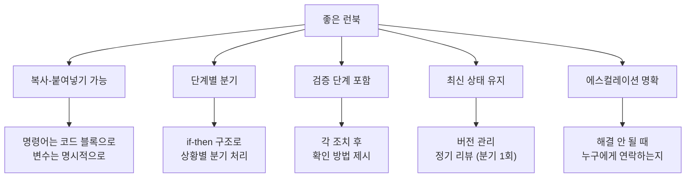

# 런북(Runbook) 작성법 - 장애 대응 자동화의 시작

런북(Runbook)은 특정 알림이나 장애 상황에 대한 단계별 대응 절차를 문서화한 것이다. 잘 작성된 런북은 장애 대응 시간을 단축하고, 경험이 적은 엔지니어도 효과적으로 대응할 수 있게 한다.

## 목차
- [1. 핵심 개념 (What)](#1-핵심-개념-what)
- [2. 왜 알아야 하는가 (Why)](#2-왜-알아야-하는가-why)
- [3. 내부 구현 분석 (How)](#3-내부-구현-분석-how)
- [4. 실전 예제](#4-실전-예제)
- [5. 정리](#5-정리)

---

## 1. 핵심 개념 (What)

### 런북의 정의

런북은 **알림 → 진단 → 조치 → 검증**의 전 과정을 단계별로 기술한 운영 매뉴얼이다.

```
┌──────────────────────────────────────────────────┐
│                런북의 구조                          │
├──────────────────────────────────────────────────┤
│                                                   │
│  1. 알림 정보 (Alert Context)                      │
│     - 어떤 알림이 이 런북을 트리거하는가             │
│     - 알림의 의미는 무엇인가                        │
│                                                   │
│  2. 영향 평가 (Impact Assessment)                   │
│     - 이 상황의 사용자 영향은 무엇인가               │
│     - Severity 판단 기준                           │
│                                                   │
│  3. 진단 (Diagnosis)                               │
│     - 원인을 파악하기 위한 단계별 절차               │
│     - 확인할 대시보드, 로그, 메트릭                  │
│                                                   │
│  4. 조치 (Remediation)                             │
│     - 문제를 해결하기 위한 구체적 명령어/절차         │
│     - 시나리오별 분기 처리                          │
│                                                   │
│  5. 검증 (Verification)                            │
│     - 문제가 해결되었는지 확인하는 방법              │
│     - 정상 상태 복귀 기준                           │
│                                                   │
│  6. 에스컬레이션 (Escalation)                       │
│     - 위 절차로 해결되지 않을 때 연락할 사람/팀       │
│                                                   │
└──────────────────────────────────────────────────┘
```

### 런북 vs 플레이북 vs SOP

| 문서 | 범위 | 상세도 | 예시 |
|------|------|--------|------|
| Runbook | 특정 알림/시나리오 | 매우 상세 (복붙 가능) | "Redis 메모리 90% 알림 대응" |
| Playbook | 장애 유형 | 전략적 | "데이터베이스 장애 대응" |
| SOP | 정기 운영 절차 | 절차적 | "주간 배포 프로세스" |

## 2. 왜 알아야 하는가 (Why)

### MTTR 단축

런북이 있으면 "어떻게 하지?"를 고민하는 시간이 사라진다.

```
런북 없이:
알림 → 원인 파악 (15분) → 해결법 검색 (10분) → 조치 (5분) = 30분

런북 있으면:
알림 → 런북 따라하기 (5분) → 조치 (5분) = 10분
```

### 지식의 민주화

시니어 엔지니어만 할 수 있던 장애 대응을 주니어도 할 수 있게 된다. 특정 개인에 대한 의존도가 줄어든다.

### On-call 품질 향상

런북이 잘 갖춰진 팀의 On-call Engineer는 스트레스가 적고, 야간 호출에서도 효과적으로 대응할 수 있다.

## 3. 내부 구현 분석 (How)

### 좋은 런북 작성 원칙



### 런북 작성 안티패턴

| 안티패턴 | 문제점 | 올바른 방법 |
|---------|--------|-----------|
| "관련 로그를 확인한다" | 어디서? 어떤 로그? | "Kibana > user-api > 최근 30분 > status:500 필터" |
| "필요하면 재시작한다" | 어떻게? 영향은? | "kubectl rollout restart deployment/user-api -n prod" |
| "팀에 연락한다" | 누구에게? 어떻게? | "@alice (Slack) 또는 PagerDuty team-db 에스컬레이션" |
| 1년 전 작성 후 방치 | 명령어/URL 변경됨 | 분기별 런북 리뷰, 장애 후 업데이트 |

### Alert와 런북 연동

```
Alert → 런북 자동 링크 구조:

alert: HighMemoryUsage
annotations:
  runbook_url: "https://wiki.internal/runbooks/high-memory-usage"
  ─────────────────────────────────────────────────────
  │ 클릭하면 바로 런북으로 이동                          │
  │ On-call Engineer가 즉시 대응 절차 확인 가능          │
  └────────────────────────────────────────────────────
```

### 런북 자동화 단계

```
Level 1: 문서 (Manual)
├── Wiki/Confluence에 절차 문서화
└── 사람이 읽고 수동으로 실행

Level 2: 반자동화 (Semi-automated)
├── 진단 스크립트 제공 (./diagnose.sh)
├── 조치 스크립트 제공 (./fix.sh)
└── 사람이 판단하고 스크립트 실행

Level 3: 자동화 (Automated)
├── 알림 → 자동 진단 → 자동 조치
├── Rundeck / AWS SSM Automation
└── 사람은 결과를 확인만

Level 4: 자가 치유 (Self-healing)
├── 시스템이 자동으로 감지/수정/검증
├── Kubernetes Operator 패턴
└── 사람은 리포트만 확인
```

### 런북 유지보수 프로세스

```
런북 리뷰 주기:
━━━━━━━━━━━━━━━
- 장애 후: 해당 런북 즉시 업데이트 (실제 대응 과정 반영)
- 분기별: 전체 런북 리뷰 (URL, 명령어, 담당자 최신화)
- On-call 핸드오프 시: 사용한 런북 피드백

런북 품질 체크:
□ 명령어가 현재 환경에서 실행 가능한가?
□ 대시보드/로그 URL이 유효한가?
□ 에스컬레이션 연락처가 최신인가?
□ 최근 1년 내 업데이트되었는가?
□ 실제 장애에서 사용된 적이 있는가?
```

## 4. 실전 예제

### 런북 템플릿

```markdown
# Runbook: [알림명 / 시나리오명]

**최종 업데이트**: YYYY-MM-DD
**작성자**: @name
**담당 팀**: [팀명]
**관련 서비스**: [서비스명]
**관련 알림**: [AlertName]

---

## 1. 알림 정보

**알림 조건**: [어떤 조건에서 이 알림이 발생하는지]
**심각도**: P1 / P2 / P3
**의미**: [이 알림이 의미하는 바, 사용자 영향]

## 2. 영향 평가

이 상황이 발생하면:
- [ ] 사용자가 [기능]을 사용할 수 없음
- [ ] [서비스]의 응답 시간 증가
- [ ] 데이터 처리 지연

**Severity 판단**:
- 전체 사용자 영향 → SEV1
- 50% 이상 영향 → SEV2
- 일부 영향, 우회 가능 → SEV3

## 3. 진단

### Step 1: 현재 상태 확인

대시보드 확인:
- [Grafana 대시보드 링크](https://grafana.internal/d/xxx)
- [Kibana 로그 링크](https://kibana.internal/app/discover#/xxx)

### Step 2: 메트릭 확인

```bash
# [무엇을 확인하는 명령어인지 설명]
kubectl top pods -n production -l app=user-api

# 최근 에러 로그 확인
kubectl logs -n production -l app=user-api --since=10m | grep ERROR | tail -20
```

### Step 3: 원인 분류

확인 결과에 따라 분기:

- **CPU/Memory 과다** → [4A. 리소스 이슈 조치](#4a-리소스-이슈)
- **에러율 급증** → [4B. 에러 이슈 조치](#4b-에러-이슈)
- **외부 의존성 장애** → [4C. 의존성 이슈 조치](#4c-의존성-이슈)

## 4. 조치

### 4A. 리소스 이슈

```bash
# HPA 확인
kubectl get hpa -n production user-api-hpa

# 수동 스케일아웃 (HPA가 반응하지 않을 때)
kubectl scale deployment user-api -n production --replicas=5

# 스케일아웃 후 확인
kubectl get pods -n production -l app=user-api -w
```

### 4B. 에러 이슈

```bash
# 최근 배포 확인
kubectl rollout history deployment/user-api -n production

# 이전 버전으로 롤백
kubectl rollout undo deployment/user-api -n production

# 롤백 상태 확인
kubectl rollout status deployment/user-api -n production
```

### 4C. 의존성 이슈

```bash
# 외부 서비스 연결 확인
kubectl exec -it deploy/user-api -n production -- \
  curl -s -o /dev/null -w "%{http_code}" http://payment-service:8080/health

# Circuit Breaker 상태 확인
kubectl exec -it deploy/user-api -n production -- \
  curl -s http://localhost:8080/actuator/circuitbreakers
```

## 5. 검증

```bash
# 에러율 확인 (0.1% 이하로 복구되어야 함)
curl -s http://prometheus:9090/api/v1/query?query=rate(http_requests_total{status=~"5.."}[5m])

# p99 latency 확인 (200ms 이하로 복구되어야 함)
curl -s http://prometheus:9090/api/v1/query?query=histogram_quantile(0.99,rate(http_request_duration_seconds_bucket[5m]))
```

정상 복구 기준:
- [ ] HTTP 에러율 < 0.1%
- [ ] p99 Latency < 200ms
- [ ] 모든 Pod Ready 상태

## 6. 에스컬레이션

위 절차로 **15분 이내 해결되지 않으면**:

| 상황 | 연락 대상 | 방법 |
|------|----------|------|
| 기본 | @team-lead | Slack #incident 채널 |
| DB 관련 | @dba-team | PagerDuty "DBA On-call" |
| 네트워크 | @infra-team | PagerDuty "Infra On-call" |
| 심각 (SEV1) | @engineering-director | 전화 직접 연락 |
```

### Rundeck 자동화 런북 예시

```yaml
# rundeck-job-definition.yaml
- defaultTab: nodes
  description: "Redis 메모리 초과 시 자동 대응"
  executionEnabled: true
  name: redis-memory-remediation
  nodeFilterEditable: false
  scheduleEnabled: true
  sequence:
    commands:
      # Step 1: 현재 메모리 사용량 확인
      - description: "Redis 메모리 사용량 확인"
        exec: |
          redis-cli -h ${option.redis_host} INFO memory |
          grep used_memory_human

      # Step 2: 만료 키 정리
      - description: "만료된 키 강제 정리"
        exec: |
          redis-cli -h ${option.redis_host} --scan --pattern '*' |
          head -1000 |
          xargs -L 1 redis-cli -h ${option.redis_host} TTL |
          grep -c "^-1$"

      # Step 3: 캐시 정리 (TTL이 없는 오래된 키)
      - description: "TTL 없는 키 확인 및 보고"
        exec: |
          echo "Manual review required for keys without TTL"
          redis-cli -h ${option.redis_host} --scan --pattern 'cache:*' |
          head -100

      # Step 4: 메모리 정책 확인
      - description: "maxmemory-policy 확인"
        exec: |
          redis-cli -h ${option.redis_host} CONFIG GET maxmemory-policy

      # Step 5: 검증
      - description: "메모리 사용량 재확인"
        exec: |
          redis-cli -h ${option.redis_host} INFO memory |
          grep used_memory_human

  options:
    - name: redis_host
      description: "Redis 호스트 주소"
      required: true
      value: "redis-primary.internal"
```

## 5. 정리

| 항목 | 권장 |
|------|------|
| 형식 | 복사-붙여넣기 가능한 명령어 |
| 구조 | 알림 → 진단 → 분기 → 조치 → 검증 → 에스컬레이션 |
| 연동 | Alert → runbook_url 자동 링크 |
| 유지보수 | 분기별 리뷰, 장애 후 즉시 업데이트 |
| 자동화 | Manual → Semi-auto → Auto → Self-healing |

**핵심 원칙**:
1. 런북은 "읽는 문서"가 아니라 "따라하는 문서"다
2. 명령어는 반드시 복사-붙여넣기 가능하게 작성한다
3. 모든 Alert에 runbook_url을 연결한다
4. 장애 대응 후 런북을 업데이트하는 것을 습관화한다
5. 3회 이상 같은 런북을 사용했다면 자동화를 검토한다

---
*참고: Google SRE Book Ch.11, PagerDuty Runbook Guide, Rundeck Documentation*
